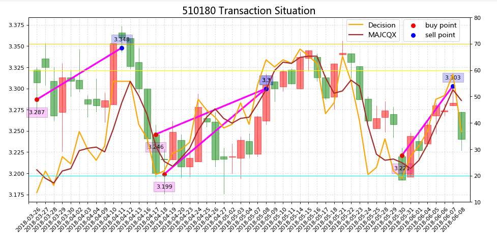
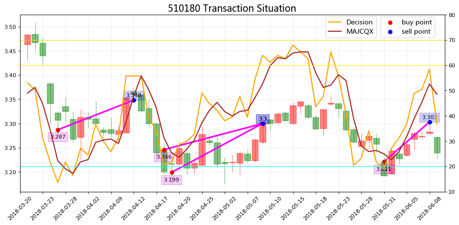

## Candle
* [2018.06.12_Candlestick_plus_2018-6-14](http://nbviewer.jupyter.org/github/bitbyte27/PythonQuant/blob/master/Candle/2018.06.12_Candlestick_plus_2018-6-14.ipynb)

* [2018.06.14_300ETF_Candle](http://nbviewer.jupyter.org/github/bitbyte27/PythonQuant/blob/master/Candle/2018.06.14_300ETF_Candle.ipynb)

* [2018.06.12_Candlestick_plus_2018-6-15](http://nbviewer.jupyter.org/github/bitbyte27/PythonQuant/blob/master/Candle/2018.06.12_Candlestick_plus_2018-6-15.ipynb)

* [2018.06.12_Candlestick_plus](http://nbviewer.jupyter.org/github/bitbyte27/PythonQuant/blob/master/Candle/2018.06.12_Candlestick_plus.ipynb)

### [Candle](http://nbviewer.jupyter.org/github/bitbyte27/PythonQuant/tree/master/Candle/)

### ETF交易记录
* [2018.06.12_Candlestick_plus_2018-6-23](http://nbviewer.jupyter.org/github/bitbyte27/PythonQuant/blob/master/Candle/2018.06.12_Candlestick_plus_2018-6-23.ipynb)

### 300-ETF-行情与指标
* [2018.06.23_Candlestick_Risk_Ratio_ZFXF_YCWW_2018-7-11](http://nbviewer.jupyter.org/github/bitbyte27/PythonQuant/blob/master/Candle/2018.06.23_Candlestick_Risk_Ratio_ZFXF_YCWW_2018-7-11.ipynb)
* [2018.07.12_510300ETF_2018-7-12](http://nbviewer.jupyter.org/github/bitbyte27/PythonQuant/blob/master/ETF/2018.06.19_510300ETF/2018.07.12_510300ETF_2018-7-12.ipynb)
* [2018.07.12_510300ETF_2018-7-20](http://nbviewer.jupyter.org/github/bitbyte27/PythonQuant/blob/master/ETF/2018.06.19_510300ETF/2018.07.12_510300ETF_2018-7-20.ipynb)

### 可转债-行情与指标
* [2018.06.18_tushare_cb_candle_risk_ratio_2018-6-21](http://nbviewer.jupyter.org/github/bitbyte27/PythonQuant/blob/master/Candle/2018.06.18_tushare_cb_candle_risk_ratio_2018-6-21.ipynb)
* [2018.06.18_tushare_cb_candle_risk_ratio](https://github.com/bitbyte27/PythonQuant/tree/master/ConvertibleBond/2018.06.18_tushare_cb_candle_risk_ratio)
