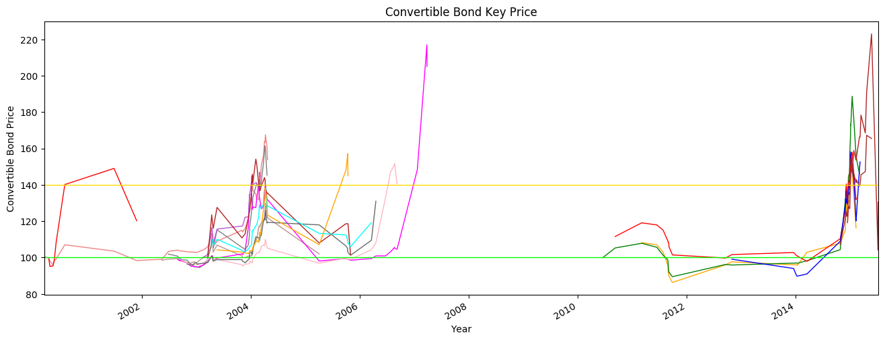
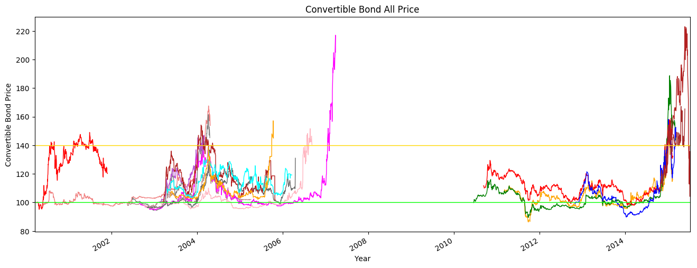

```python
import numpy as np
import pandas as pd
import matplotlib.pyplot as plt
```


```python
CB_110015 = pd.read_csv('cbcsv/110015.csv')
CB_110015 = CB_110015.set_index('date')
# 110015，石化转债（中国石化），2011-2-23
```


```python
CB_110015_max = CB_110015['close'].max()
CB_110015_max_data = CB_110015.loc[CB_110015['close'] == CB_110015_max,'close']
CB_110015_min = CB_110015['close'].min()
CB_110015_min_data = CB_110015.loc[CB_110015['close'] == CB_110015_min,'close']
CB_110015_last_data = CB_110015['close'].tail(1)
CB_110015_begin = CB_110015['close'].head(1)
CB_110015_begin_data = CB_110015['open'].head(1)
# 分别取最大值、最小值、最后收盘价、最初开盘价
```


```python
CB_110015_min_data_0 = CB_110015.loc[CB_110015['close'] == CB_110015_min,'close']
CB_110015_min_data_0[0] = 0
CB_110015_max_data_0 = CB_110015.loc[CB_110015['close'] == CB_110015_max,'close']
CB_110015_max_data_0[0] = 0
# 设置一个最大值和最小值的日期与数值为0的一行记录
# 其目的是为了把相同时间的价格设置为0，看下面演示
```


```python
if CB_110015_last_data[0] == CB_110015_max:
    CB_110015_max_data = CB_max_data_0
if CB_110015_last_data[0] == CB_110015_min:
    CB_110015_min_data = CB_min_data_0
# 如果最后收盘价就是最高价或者最低价，那么将最高价或最低价设置为0
# 因为最后收盘价是可以做得了卖出的，而最高价或最低价是可遇不可求的
```


```python
# ====================
if CB_110015_min < 107:
    CB_110015_call_price = CB_110015.loc[CB_110015['close'] <= 107,'close'].head(1)
    if CB_110015_begin_data[0] < 107:
        CB_110015_call_price = CB_110015_min_data_0
    elif CB_110015_call_price[0] < 103:
        CB_110015_call_price = CB_110015_min_data_0
else:
    CB_110015_call_price = CB_110015_min_data_0
# 最小收盘价小于赎回价107元时，令买入价格为低于107的第一个收盘价
# 如果这个收盘价还小于回售价103元，那么设置这个收盘价为0，其时间用最小收盘价时间
# 就是使用了上述的“设置一个最大值和最小值的日期与数值为0”
# 赎回价等于最小收盘价时，将最小收盘价设置为0，因为我们可能在达到赎回价线时进行建仓，
# 但非常难用最低价建仓，所以这里将最低价设置为0，而保留赎回价，以下的回售价、面值价亦如此
# 如果最小收盘价大于赎回价107元时，同样设置为0，其时间用最小收盘价时间
# 以下同理
# ====================
if CB_110015_min < 103:
    CB_110015_sell_back = CB_110015.loc[CB_110015['close'] <= 103,'close'].head(1)
    if CB_110015_begin_data[0] < 103:
        CB_110015_sell_back = CB_110015_min_data_0
    elif CB_110015_sell_back[0] < 100:
        CB_110015_sell_back = CB_110015_min_data_0
else:
    CB_110015_sell_back = CB_110015_min_data_0
# ====================
if CB_110015_min < 100:
    CB_110015_par_value = CB_110015.loc[CB_110015['close'] <= 100,'close'].head(1)
    if CB_110015_begin_data[0] < 100:
        CB_110015_par_value = CB_110015_min_data_0
    elif CB_110015_par_value[0] == CB_110015_begin[0]:
        CB_110015_par_value = CB_110015_min_data_0
else:
    CB_110015_par_value = CB_110015_min_data_0
# ====================
if CB_110015_min < 95:
    CB_110015_95Sell = CB_110015.loc[CB_110015['close'] <= 95,'close'].head(1)
else:
    CB_110015_95Sell = CB_110015_min_data_0
# ====================
if CB_110015_min < 90:
    CB_110015_90Sell = CB_110015.loc[CB_110015['close'] <= 90,'close'].head(1)
else:
    CB_110015_90Sell = CB_110015_min_data_0
# ====================
if CB_110015_min < 85:
    CB_110015_85Sell = CB_110015.loc[CB_110015['close'] <= 85,'close'].head(1)
else:
    CB_110015_85Sell = CB_110015_min_data_0
# ====================
if CB_110015_min < 80:
    CB_110015_80Sell = CB_110015.loc[CB_110015['close'] <= 80,'close'].head(1)
else:
    CB_110015_80Sell = CB_110015_min_data_0
# ====================
# 以上为建仓买入价格的阶梯价
```


```python
# ====================
if CB_110015_max > 140:
    CB_110015_140Sell = CB_110015.loc[CB_110015['close'] > 140,'close'].head(1)
    if CB_110015_140Sell[0] == CB_110015_max:
        CB_110015_140Sell = CB_110015_max_data_0
else:
    CB_110015_140Sell = CB_110015_max_data_0
# ====================
CB_110015['Stock_Transfer_Profit'] = (CB_110015['TargetStock'] - CB_110015['ShareTransfer'])/CB_110015['ShareTransfer']*100
Stock_Transfer_Profit = CB_110015['Stock_Transfer_Profit'].max()
# ====================
if Stock_Transfer_Profit > 30:
    CB_110015_30Sell = CB_110015.loc[CB_110015['Stock_Transfer_Profit'] > 30,'close'].head(1)
    if CB_110015_30Sell[0] == CB_110015_max:
        CB_110015_30Sell = CB_110015_max_data_0
else:
    CB_110015_30Sell = CB_110015_max_data_0
# ====================
if Stock_Transfer_Profit > 50:
    CB_110015_50Sell = CB_110015.loc[CB_110015['Stock_Transfer_Profit'] > 50,'close'].head(1)
    if CB_110015_50Sell[0] == CB_110015_max:
        CB_110015_50Sell = CB_110015_max_data_0
else:
    CB_110015_50Sell = CB_110015_max_data_0
# ====================
# 以上为平仓卖出价格的阶梯价
```


```python
CB_110015_data = pd.concat([CB_110015_begin_data,CB_110015_max_data, CB_110015_min_data, CB_110015_last_data,CB_110015_call_price,CB_110015_sell_back,CB_110015_par_value,CB_110015_95Sell,CB_110015_90Sell,CB_110015_85Sell,CB_110015_80Sell,CB_110015_140Sell,CB_110015_30Sell,CB_110015_50Sell], axis=1)
CB_110015_data.columns = ['close_begin','close_max','close_min','close_last','close_call_price','close_sell_back','close_par_value','close_95','close_90','close_85','close_80','close_140','close_30','close_50']
# 将以上各表合成一个总表，并重命名各个字段
CB_110015_data['BS_close'] = CB_110015_data.apply(lambda x: x.sum(), axis=1)
# 将每一行的所有列累加，得到一列合计数
```


```python
CB_110015_data.loc[CB_110015_data['close_begin'] > 0,'Name'] = 'Begin Price [1]'
CB_110015_data.loc[CB_110015_data['close_max'] > 0,'Name'] = 'Max Price'
CB_110015_data.loc[CB_110015_data['close_min'] > 0,'Name'] = 'Min Price'
CB_110015_data.loc[CB_110015_data['close_last'] > 0,'Name'] = 'Last Price'
CB_110015_data.loc[CB_110015_data['close_call_price'] > 0,'Name'] = 'Call Price [2]'
CB_110015_data.loc[CB_110015_data['close_sell_back'] > 0,'Name'] = 'SellBack Price [3]'
CB_110015_data.loc[CB_110015_data['close_par_value'] > 0,'Name'] = 'Par Value [4]'
CB_110015_data.loc[CB_110015_data['close_95'] > 0,'Name'] = '￥95 [5]'
CB_110015_data.loc[CB_110015_data['close_90'] > 0,'Name'] = '￥90 [6]'
CB_110015_data.loc[CB_110015_data['close_85'] > 0,'Name'] = '￥85 [7]'
CB_110015_data.loc[CB_110015_data['close_80'] > 0,'Name'] = '￥80 [8]'
CB_110015_data.loc[CB_110015_data['close_140'] > 0,'Name'] = '￥140 [A]'
CB_110015_data.loc[CB_110015_data['close_30'] > 0,'Name'] = '30％ [B]'
CB_110015_data.loc[CB_110015_data['close_50'] > 0,'Name'] = '50％ [C]'
```


```python
CB_110015_data.index = pd.to_datetime(CB_110015_data.index)
CB_110015_data = CB_110015_data.sort_index(axis=0, ascending=True)
CB_110015_data = CB_110015_data[['Name','BS_close']]
CB_110015_data.columns = ['110015','石化转债']
CB_110015_data
```


<div>
<style>
    .dataframe thead tr:only-child th {
        text-align: right;
    }

    .dataframe thead th {
        text-align: left;
    }

    .dataframe tbody tr th {
        vertical-align: top;
    }
</style>
<table border="1" class="dataframe">
  <thead>
    <tr style="text-align: right;">
      <th></th>
      <th>110015</th>
      <th>石化转债</th>
    </tr>
  </thead>
  <tbody>
    <tr>
      <th>2011-03-07</th>
      <td>Begin Price [1]</td>
      <td>108.00</td>
    </tr>
    <tr>
      <th>2011-06-16</th>
      <td>Call Price [2]</td>
      <td>106.99</td>
    </tr>
    <tr>
      <th>2011-07-28</th>
      <td>SellBack Price [3]</td>
      <td>103.00</td>
    </tr>
    <tr>
      <th>2011-08-29</th>
      <td>Par Value [4]</td>
      <td>95.65</td>
    </tr>
    <tr>
      <th>2011-08-30</th>
      <td>￥95 [5]</td>
      <td>94.02</td>
    </tr>
    <tr>
      <th>2011-09-05</th>
      <td>￥90 [6]</td>
      <td>89.91</td>
    </tr>
    <tr>
      <th>2011-09-29</th>
      <td>Min Price</td>
      <td>86.35</td>
    </tr>
    <tr>
      <th>2014-12-05</th>
      <td>30％ [B]</td>
      <td>129.96</td>
    </tr>
    <tr>
      <th>2015-01-05</th>
      <td>￥140 [A]</td>
      <td>149.39</td>
    </tr>
    <tr>
      <th>2015-01-07</th>
      <td>Max Price</td>
      <td>151.74</td>
    </tr>
    <tr>
      <th>2015-02-11</th>
      <td>Last Price</td>
      <td>116.30</td>
    </tr>
  </tbody>
</table>
</div>


```python
import cb100009
cb100009.CB_data.columns = ['100009','机场转债']
cb100009.CB_data
```


<div>
<style>
    .dataframe thead tr:only-child th {
        text-align: right;
    }

    .dataframe thead th {
        text-align: left;
    }

    .dataframe tbody tr th {
        vertical-align: top;
    }
</style>
<table border="1" class="dataframe">
  <thead>
    <tr style="text-align: right;">
      <th></th>
      <th>100009</th>
      <th>机场转债</th>
    </tr>
  </thead>
  <tbody>
    <tr>
      <th>2000-03-17</th>
      <td>Begin Price [1]</td>
      <td>101.20</td>
    </tr>
    <tr>
      <th>2000-03-27</th>
      <td>Par Value [4]</td>
      <td>99.99</td>
    </tr>
    <tr>
      <th>2000-05-15</th>
      <td>Min Price</td>
      <td>96.09</td>
    </tr>
    <tr>
      <th>2003-12-25</th>
      <td>30％ [B]</td>
      <td>129.54</td>
    </tr>
    <tr>
      <th>2004-01-12</th>
      <td>￥140 [A]</td>
      <td>142.37</td>
    </tr>
    <tr>
      <th>2004-03-12</th>
      <td>50％ [C]</td>
      <td>150.93</td>
    </tr>
    <tr>
      <th>2004-04-08</th>
      <td>Max Price</td>
      <td>167.60</td>
    </tr>
    <tr>
      <th>2004-04-22</th>
      <td>Last Price</td>
      <td>153.85</td>
    </tr>
  </tbody>
</table>
</div>


```python
import cb125898
cb125898.CB_data.columns = ['125898','鞍钢转债']
cb125898.CB_data
```


<div>
<style>
    .dataframe thead tr:only-child th {
        text-align: right;
    }

    .dataframe thead th {
        text-align: left;
    }

    .dataframe tbody tr th {
        vertical-align: top;
    }
</style>
<table border="1" class="dataframe">
  <thead>
    <tr style="text-align: right;">
      <th></th>
      <th>125898</th>
      <th>鞍钢转债</th>
    </tr>
  </thead>
  <tbody>
    <tr>
      <th>2000-04-17</th>
      <td>Begin Price [1]</td>
      <td>101.00</td>
    </tr>
    <tr>
      <th>2000-04-24</th>
      <td>Min Price</td>
      <td>95.14</td>
    </tr>
    <tr>
      <th>2000-05-24</th>
      <td>30％ [B]</td>
      <td>99.08</td>
    </tr>
    <tr>
      <th>2000-06-05</th>
      <td>50％ [C]</td>
      <td>108.44</td>
    </tr>
    <tr>
      <th>2000-08-02</th>
      <td>￥140 [A]</td>
      <td>140.19</td>
    </tr>
    <tr>
      <th>2001-06-28</th>
      <td>Max Price</td>
      <td>149.06</td>
    </tr>
    <tr>
      <th>2001-11-27</th>
      <td>Last Price</td>
      <td>120.25</td>
    </tr>
  </tbody>
</table>
</div>


```python
import cb100220
cb100220.CB_data.columns = ['100220','阳光转债']
cb100220.CB_data
```


<div>
<style>
    .dataframe thead tr:only-child th {
        text-align: right;
    }

    .dataframe thead th {
        text-align: left;
    }

    .dataframe tbody tr th {
        vertical-align: top;
    }
</style>
<table border="1" class="dataframe">
  <thead>
    <tr style="text-align: right;">
      <th></th>
      <th>100220</th>
      <th>阳光转债</th>
    </tr>
  </thead>
  <tbody>
    <tr>
      <th>2002-05-16</th>
      <td>Begin Price [1]</td>
      <td>101.40</td>
    </tr>
    <tr>
      <th>2002-11-27</th>
      <td>Min Price</td>
      <td>96.88</td>
    </tr>
    <tr>
      <th>2004-04-08</th>
      <td>Max Price</td>
      <td>129.98</td>
    </tr>
    <tr>
      <th>2005-04-04</th>
      <td>Last Price</td>
      <td>101.99</td>
    </tr>
  </tbody>
</table>
</div>


```python
import cb125002
cb125002.CB_data.columns = ['125002','万科转债']
cb125002.CB_data
```


<div>
<style>
    .dataframe thead tr:only-child th {
        text-align: right;
    }

    .dataframe thead th {
        text-align: left;
    }

    .dataframe tbody tr th {
        vertical-align: top;
    }
</style>
<table border="1" class="dataframe">
  <thead>
    <tr style="text-align: right;">
      <th></th>
      <th>125002</th>
      <th>万科转债</th>
    </tr>
  </thead>
  <tbody>
    <tr>
      <th>2002-06-28</th>
      <td>Begin Price [1]</td>
      <td>100.18</td>
    </tr>
    <tr>
      <th>2002-09-06</th>
      <td>Par Value [4]</td>
      <td>99.91</td>
    </tr>
    <tr>
      <th>2002-12-18</th>
      <td>￥95 [5]</td>
      <td>94.90</td>
    </tr>
    <tr>
      <th>2003-01-22</th>
      <td>Min Price</td>
      <td>94.40</td>
    </tr>
    <tr>
      <th>2004-01-15</th>
      <td>30％ [B]</td>
      <td>133.03</td>
    </tr>
    <tr>
      <th>2004-02-10</th>
      <td>￥140 [A]</td>
      <td>140.92</td>
    </tr>
    <tr>
      <th>2004-03-26</th>
      <td>50％ [C]</td>
      <td>151.86</td>
    </tr>
    <tr>
      <th>2004-04-05</th>
      <td>Max Price</td>
      <td>161.50</td>
    </tr>
    <tr>
      <th>2004-04-06</th>
      <td>Max Price</td>
      <td>161.50</td>
    </tr>
    <tr>
      <th>2004-04-19</th>
      <td>Last Price</td>
      <td>145.33</td>
    </tr>
  </tbody>
</table>
</div>


```python
import cb100087
cb100087.CB_data.columns = ['100087','水运转债']
cb100087.CB_data
```


<div>
<style>
    .dataframe thead tr:only-child th {
        text-align: right;
    }

    .dataframe thead th {
        text-align: left;
    }

    .dataframe tbody tr th {
        vertical-align: top;
    }
</style>
<table border="1" class="dataframe">
  <thead>
    <tr style="text-align: right;">
      <th></th>
      <th>100087</th>
      <th>水运转债</th>
    </tr>
  </thead>
  <tbody>
    <tr>
      <th>2002-08-28</th>
      <td>Begin Price [1]</td>
      <td>99.90</td>
    </tr>
    <tr>
      <th>2003-01-02</th>
      <td>￥95 [5]</td>
      <td>94.88</td>
    </tr>
    <tr>
      <th>2003-01-07</th>
      <td>Min Price</td>
      <td>94.71</td>
    </tr>
    <tr>
      <th>2003-12-23</th>
      <td>30％ [B]</td>
      <td>134.50</td>
    </tr>
    <tr>
      <th>2004-02-24</th>
      <td>￥140 [A]</td>
      <td>140.99</td>
    </tr>
    <tr>
      <th>2007-01-22</th>
      <td>50％ [C]</td>
      <td>148.40</td>
    </tr>
    <tr>
      <th>2007-03-27</th>
      <td>Max Price</td>
      <td>217.09</td>
    </tr>
    <tr>
      <th>2007-03-28</th>
      <td>Last Price</td>
      <td>205.10</td>
    </tr>
  </tbody>
</table>
</div>


```python
import cb126301
cb126301.CB_data.columns = ['126301','丝绸转2']
cb126301.CB_data
```


<div>
<style>
    .dataframe thead tr:only-child th {
        text-align: right;
    }

    .dataframe thead th {
        text-align: left;
    }

    .dataframe tbody tr th {
        vertical-align: top;
    }
</style>
<table border="1" class="dataframe">
  <thead>
    <tr style="text-align: right;">
      <th></th>
      <th>126301</th>
      <th>丝绸转2</th>
    </tr>
  </thead>
  <tbody>
    <tr>
      <th>2002-09-24</th>
      <td>Begin Price [1]</td>
      <td>98.90</td>
    </tr>
    <tr>
      <th>2003-11-07</th>
      <td>Min Price</td>
      <td>95.40</td>
    </tr>
    <tr>
      <th>2006-06-23</th>
      <td>30％ [B]</td>
      <td>133.09</td>
    </tr>
    <tr>
      <th>2006-07-27</th>
      <td>￥140 [A]</td>
      <td>147.21</td>
    </tr>
    <tr>
      <th>2006-08-22</th>
      <td>50％ [C]</td>
      <td>151.01</td>
    </tr>
    <tr>
      <th>2006-08-23</th>
      <td>Max Price</td>
      <td>151.68</td>
    </tr>
    <tr>
      <th>2006-09-08</th>
      <td>Last Price</td>
      <td>140.50</td>
    </tr>
  </tbody>
</table>
</div>


```python
import cb125729
cb125729.CB_data.columns = ['125729','燕京转债']
cb125729.CB_data
```


<div>
<style>
    .dataframe thead tr:only-child th {
        text-align: right;
    }

    .dataframe thead th {
        text-align: left;
    }

    .dataframe tbody tr th {
        vertical-align: top;
    }
</style>
<table border="1" class="dataframe">
  <thead>
    <tr style="text-align: right;">
      <th></th>
      <th>125729</th>
      <th>燕京转债</th>
    </tr>
  </thead>
  <tbody>
    <tr>
      <th>2002-10-31</th>
      <td>Begin Price [1]</td>
      <td>97.01</td>
    </tr>
    <tr>
      <th>2002-12-13</th>
      <td>Min Price</td>
      <td>96.05</td>
    </tr>
    <tr>
      <th>2006-04-19</th>
      <td>Last Price</td>
      <td>131.00</td>
    </tr>
  </tbody>
</table>
</div>


```python
import cb125629
cb125629.CB_data.columns = ['125629','钢钒转债']
cb125629.CB_data
```


<div>
<style>
    .dataframe thead tr:only-child th {
        text-align: right;
    }

    .dataframe thead th {
        text-align: left;
    }

    .dataframe tbody tr th {
        vertical-align: top;
    }
</style>
<table border="1" class="dataframe">
  <thead>
    <tr style="text-align: right;">
      <th></th>
      <th>125629</th>
      <th>钢钒转债</th>
    </tr>
  </thead>
  <tbody>
    <tr>
      <th>2003-02-17</th>
      <td>Begin Price [1]</td>
      <td>100.88</td>
    </tr>
    <tr>
      <th>2003-02-18</th>
      <td>Min Price</td>
      <td>100.25</td>
    </tr>
    <tr>
      <th>2003-04-14</th>
      <td>30％ [B]</td>
      <td>116.54</td>
    </tr>
    <tr>
      <th>2004-01-06</th>
      <td>￥140 [A]</td>
      <td>141.90</td>
    </tr>
    <tr>
      <th>2004-03-01</th>
      <td>Max Price</td>
      <td>147.00</td>
    </tr>
    <tr>
      <th>2004-03-03</th>
      <td>Last Price</td>
      <td>144.50</td>
    </tr>
  </tbody>
</table>
</div>


```python
import cb100016
cb100016.CB_data.columns = ['100016','民生转债']
cb100016.CB_data
```


<div>
<style>
    .dataframe thead tr:only-child th {
        text-align: right;
    }

    .dataframe thead th {
        text-align: left;
    }

    .dataframe tbody tr th {
        vertical-align: top;
    }
</style>
<table border="1" class="dataframe">
  <thead>
    <tr style="text-align: right;">
      <th></th>
      <th>100016</th>
      <th>民生转债</th>
    </tr>
  </thead>
  <tbody>
    <tr>
      <th>2003-03-18</th>
      <td>Begin Price [1]</td>
      <td>99.87</td>
    </tr>
    <tr>
      <th>2003-04-11</th>
      <td>30％ [B]</td>
      <td>120.46</td>
    </tr>
    <tr>
      <th>2003-04-14</th>
      <td>50％ [C]</td>
      <td>123.52</td>
    </tr>
    <tr>
      <th>2004-01-07</th>
      <td>￥140 [A]</td>
      <td>140.49</td>
    </tr>
    <tr>
      <th>2004-02-04</th>
      <td>Max Price</td>
      <td>154.22</td>
    </tr>
    <tr>
      <th>2005-10-31</th>
      <td>Last Price</td>
      <td>101.68</td>
    </tr>
  </tbody>
</table>
</div>


```python
import cb100177
cb100177.CB_data.columns = ['100177','雅戈转债']
cb100177.CB_data
```


<div>
<style>
    .dataframe thead tr:only-child th {
        text-align: right;
    }

    .dataframe thead th {
        text-align: left;
    }

    .dataframe tbody tr th {
        vertical-align: top;
    }
</style>
<table border="1" class="dataframe">
  <thead>
    <tr style="text-align: right;">
      <th></th>
      <th>100177</th>
      <th>雅戈转债</th>
    </tr>
  </thead>
  <tbody>
    <tr>
      <th>2003-04-21</th>
      <td>Begin Price [1]</td>
      <td>108.11</td>
    </tr>
    <tr>
      <th>2003-04-24</th>
      <td>Call Price [2]</td>
      <td>106.50</td>
    </tr>
    <tr>
      <th>2003-11-24</th>
      <td>Min Price</td>
      <td>103.10</td>
    </tr>
    <tr>
      <th>2004-02-27</th>
      <td>30％ [B]</td>
      <td>128.24</td>
    </tr>
    <tr>
      <th>2004-04-08</th>
      <td>Max Price</td>
      <td>138.38</td>
    </tr>
    <tr>
      <th>2006-03-20</th>
      <td>Last Price</td>
      <td>119.23</td>
    </tr>
  </tbody>
</table>
</div>


```python
import cb125930
cb125930.CB_data.columns = ['125930','丰原转债']
cb125930.CB_data
```


<div>
<style>
    .dataframe thead tr:only-child th {
        text-align: right;
    }

    .dataframe thead th {
        text-align: left;
    }

    .dataframe tbody tr th {
        vertical-align: top;
    }
</style>
<table border="1" class="dataframe">
  <thead>
    <tr style="text-align: right;">
      <th></th>
      <th>125930</th>
      <th>丰原转债</th>
    </tr>
  </thead>
  <tbody>
    <tr>
      <th>2003-05-20</th>
      <td>Begin Price [1]</td>
      <td>105.52</td>
    </tr>
    <tr>
      <th>2003-11-03</th>
      <td>SellBack Price [3]</td>
      <td>102.99</td>
    </tr>
    <tr>
      <th>2003-12-16</th>
      <td>Min Price</td>
      <td>102.19</td>
    </tr>
    <tr>
      <th>2004-04-02</th>
      <td>30％ [B]</td>
      <td>131.20</td>
    </tr>
    <tr>
      <th>2005-09-30</th>
      <td>￥140 [A]</td>
      <td>148.04</td>
    </tr>
    <tr>
      <th>2005-10-11</th>
      <td>50％ [C]</td>
      <td>156.00</td>
    </tr>
    <tr>
      <th>2005-10-12</th>
      <td>Max Price</td>
      <td>157.17</td>
    </tr>
    <tr>
      <th>2005-10-14</th>
      <td>Last Price</td>
      <td>145.01</td>
    </tr>
  </tbody>
</table>
</div>


```python
import cb113001
cb113001.CB_data.columns = ['113001','中行转债']
cb113001.CB_data
```


<div>
<style>
    .dataframe thead tr:only-child th {
        text-align: right;
    }

    .dataframe thead th {
        text-align: left;
    }

    .dataframe tbody tr th {
        vertical-align: top;
    }
</style>
<table border="1" class="dataframe">
  <thead>
    <tr style="text-align: right;">
      <th></th>
      <th>113001</th>
      <th>中行转债</th>
    </tr>
  </thead>
  <tbody>
    <tr>
      <th>2010-06-18</th>
      <td>Begin Price [1]</td>
      <td>101.00</td>
    </tr>
    <tr>
      <th>2011-09-02</th>
      <td>￥95 [5]</td>
      <td>94.10</td>
    </tr>
    <tr>
      <th>2011-09-26</th>
      <td>￥90 [6]</td>
      <td>89.65</td>
    </tr>
    <tr>
      <th>2011-09-29</th>
      <td>Min Price</td>
      <td>89.49</td>
    </tr>
    <tr>
      <th>2014-12-02</th>
      <td>30％ [B]</td>
      <td>132.24</td>
    </tr>
    <tr>
      <th>2014-12-22</th>
      <td>￥140 [A]</td>
      <td>144.57</td>
    </tr>
    <tr>
      <th>2014-12-30</th>
      <td>50％ [C]</td>
      <td>149.81</td>
    </tr>
    <tr>
      <th>2015-01-16</th>
      <td>Max Price</td>
      <td>188.74</td>
    </tr>
    <tr>
      <th>2015-03-06</th>
      <td>Last Price</td>
      <td>145.93</td>
    </tr>
  </tbody>
</table>
</div>


```python
import cb113002
cb113002.CB_data.columns = ['113002','工行转债']
cb113002.CB_data
```


<div>
<style>
    .dataframe thead tr:only-child th {
        text-align: right;
    }

    .dataframe thead th {
        text-align: left;
    }

    .dataframe tbody tr th {
        vertical-align: top;
    }
</style>
<table border="1" class="dataframe">
  <thead>
    <tr style="text-align: right;">
      <th></th>
      <th>113002</th>
      <th>工行转债</th>
    </tr>
  </thead>
  <tbody>
    <tr>
      <th>2010-09-10</th>
      <td>Begin Price [1]</td>
      <td>110.00</td>
    </tr>
    <tr>
      <th>2011-09-06</th>
      <td>Call Price [2]</td>
      <td>105.81</td>
    </tr>
    <tr>
      <th>2011-09-26</th>
      <td>SellBack Price [3]</td>
      <td>102.07</td>
    </tr>
    <tr>
      <th>2012-09-19</th>
      <td>Par Value [4]</td>
      <td>99.75</td>
    </tr>
    <tr>
      <th>2014-03-19</th>
      <td>Min Price</td>
      <td>97.92</td>
    </tr>
    <tr>
      <th>2014-12-04</th>
      <td>30％ [B]</td>
      <td>130.36</td>
    </tr>
    <tr>
      <th>2014-12-08</th>
      <td>￥140 [A]</td>
      <td>140.46</td>
    </tr>
    <tr>
      <th>2015-01-05</th>
      <td>50％ [C]</td>
      <td>154.08</td>
    </tr>
    <tr>
      <th>2015-01-16</th>
      <td>Max Price</td>
      <td>157.97</td>
    </tr>
    <tr>
      <th>2015-02-12</th>
      <td>Last Price</td>
      <td>132.38</td>
    </tr>
  </tbody>
</table>
</div>


```python
import cb110020
cb110020.CB_data.columns = ['110020','南山转债']
cb110020.CB_data
```


<div>
<style>
    .dataframe thead tr:only-child th {
        text-align: right;
    }

    .dataframe thead th {
        text-align: left;
    }

    .dataframe tbody tr th {
        vertical-align: top;
    }
</style>
<table border="1" class="dataframe">
  <thead>
    <tr style="text-align: right;">
      <th></th>
      <th>110020</th>
      <th>南山转债</th>
    </tr>
  </thead>
  <tbody>
    <tr>
      <th>2012-10-31</th>
      <td>Begin Price [1]</td>
      <td>100.10</td>
    </tr>
    <tr>
      <th>2013-12-19</th>
      <td>￥95 [5]</td>
      <td>94.00</td>
    </tr>
    <tr>
      <th>2014-01-09</th>
      <td>￥90 [6]</td>
      <td>89.88</td>
    </tr>
    <tr>
      <th>2014-01-13</th>
      <td>Min Price</td>
      <td>89.77</td>
    </tr>
    <tr>
      <th>2014-12-04</th>
      <td>30％ [B]</td>
      <td>136.57</td>
    </tr>
    <tr>
      <th>2014-12-29</th>
      <td>￥140 [A]</td>
      <td>140.31</td>
    </tr>
    <tr>
      <th>2015-01-06</th>
      <td>50％ [C]</td>
      <td>152.91</td>
    </tr>
    <tr>
      <th>2015-01-07</th>
      <td>Max Price</td>
      <td>158.17</td>
    </tr>
    <tr>
      <th>2015-03-10</th>
      <td>Last Price</td>
      <td>152.64</td>
    </tr>
  </tbody>
</table>
</div>


```python
import cb110029
cb110029.CB_data.columns = ['110029','浙能转债']
cb110029.CB_data
```


<div>
<style>
    .dataframe thead tr:only-child th {
        text-align: right;
    }

    .dataframe thead th {
        text-align: left;
    }

    .dataframe tbody tr th {
        vertical-align: top;
    }
</style>
<table border="1" class="dataframe">
  <thead>
    <tr style="text-align: right;">
      <th></th>
      <th>110029</th>
      <th>浙能转债</th>
    </tr>
  </thead>
  <tbody>
    <tr>
      <th>2014-10-28</th>
      <td>Begin Price [1]</td>
      <td>105.00</td>
    </tr>
    <tr>
      <th>2014-12-22</th>
      <td>30％ [B]</td>
      <td>133.93</td>
    </tr>
    <tr>
      <th>2014-12-31</th>
      <td>￥140 [A]</td>
      <td>140.05</td>
    </tr>
    <tr>
      <th>2015-04-14</th>
      <td>50％ [C]</td>
      <td>147.36</td>
    </tr>
    <tr>
      <th>2015-04-23</th>
      <td>Max Price</td>
      <td>167.29</td>
    </tr>
    <tr>
      <th>2015-05-26</th>
      <td>Last Price</td>
      <td>165.50</td>
    </tr>
  </tbody>
</table>
</div>


```python
import cb113501
cb113501.CB_data.columns = ['113501','洛钼转债']
cb113501.CB_data
```


<div>
<style>
    .dataframe thead tr:only-child th {
        text-align: right;
    }

    .dataframe thead th {
        text-align: left;
    }

    .dataframe tbody tr th {
        vertical-align: top;
    }
</style>
<table border="1" class="dataframe">
  <thead>
    <tr style="text-align: right;">
      <th></th>
      <th>113501</th>
      <th>洛钼转债</th>
    </tr>
  </thead>
  <tbody>
    <tr>
      <th>2014-12-16</th>
      <td>Begin Price [1]</td>
      <td>116.66</td>
    </tr>
    <tr>
      <th>2015-01-05</th>
      <td>￥140 [A]</td>
      <td>143.48</td>
    </tr>
    <tr>
      <th>2015-01-27</th>
      <td>30％ [B]</td>
      <td>158.88</td>
    </tr>
    <tr>
      <th>2015-03-16</th>
      <td>50％ [C]</td>
      <td>178.39</td>
    </tr>
    <tr>
      <th>2015-05-26</th>
      <td>Max Price</td>
      <td>223.07</td>
    </tr>
    <tr>
      <th>2015-07-08</th>
      <td>Call Price [2]</td>
      <td>104.19</td>
    </tr>
    <tr>
      <th>2015-07-09</th>
      <td>Last Price</td>
      <td>130.55</td>
    </tr>
  </tbody>
</table>
</div>


```python
CB_Data = pd.concat([CB_110015_data,cb100009.CB_data,cb125898.CB_data,cb100220.CB_data,cb125002.CB_data,cb100087.CB_data,
                     cb126301.CB_data,cb125729.CB_data,cb125629.CB_data,cb100016.CB_data,cb100177.CB_data,cb125930.CB_data,
                     cb113001.CB_data,cb113002.CB_data,cb110020.CB_data,cb110029.CB_data,cb113501.CB_data], axis=1)
CB_Data = CB_Data.sort_index(axis=0, ascending=True)
# CB_Data.tail()
```


```python
CB_110015.index = pd.to_datetime(CB_110015.index)
CB_110015_Line = CB_110015.loc[CB_Data.index,'close']
# ====================
cb100009.CB.index = pd.to_datetime(cb100009.CB.index)
CB_100009_Line = cb100009.CB.loc[CB_Data.index,'close']
# ====================
cb125898.CB.index = pd.to_datetime(cb125898.CB.index)
CB_125898_Line = cb125898.CB.loc[CB_Data.index,'close']
# ====================
cb100220.CB.index = pd.to_datetime(cb100220.CB.index)
CB_100220_Line = cb100220.CB.loc[CB_Data.index,'close']
# ====================
cb125002.CB.index = pd.to_datetime(cb125002.CB.index)
CB_125002_Line = cb125002.CB.loc[CB_Data.index,'close']
# ====================
cb100087.CB.index = pd.to_datetime(cb100087.CB.index)
CB_100087_Line = cb100087.CB.loc[CB_Data.index,'close']
# ====================
cb126301.CB.index = pd.to_datetime(cb126301.CB.index)
CB_126301_Line = cb126301.CB.loc[CB_Data.index,'close']
# ====================
cb125729.CB.index = pd.to_datetime(cb125729.CB.index)
CB_125729_Line = cb125729.CB.loc[CB_Data.index,'close']
# ====================
cb125629.CB.index = pd.to_datetime(cb125629.CB.index)
CB_125629_Line = cb125629.CB.loc[CB_Data.index,'close']
# ====================
cb100016.CB.index = pd.to_datetime(cb100016.CB.index)
CB_100016_Line = cb100016.CB.loc[CB_Data.index,'close']
# ====================
cb100177.CB.index = pd.to_datetime(cb100177.CB.index)
CB_100177_Line = cb100177.CB.loc[CB_Data.index,'close']
# ====================
cb125930.CB.index = pd.to_datetime(cb125930.CB.index)
CB_125930_Line = cb125930.CB.loc[CB_Data.index,'close']

# ====================
cb113001.CB.index = pd.to_datetime(cb113001.CB.index)
CB_113001_Line = cb113001.CB.loc[CB_Data.index,'close']
# ====================
cb113002.CB.index = pd.to_datetime(cb113002.CB.index)
CB_113002_Line = cb113002.CB.loc[CB_Data.index,'close']
# ====================
cb110020.CB.index = pd.to_datetime(cb110020.CB.index)
CB_110020_Line = cb110020.CB.loc[CB_Data.index,'close']
# ====================
cb110029.CB.index = pd.to_datetime(cb110029.CB.index)
CB_110029_Line = cb110029.CB.loc[CB_Data.index,'close']
# ====================
cb113501.CB.index = pd.to_datetime(cb113501.CB.index)
CB_113501_Line = cb113501.CB.loc[CB_Data.index,'close']
# ====================
```


```python
CB_Data_Line = pd.concat([CB_110015_Line,CB_100009_Line,CB_125898_Line,CB_100220_Line,CB_125002_Line,CB_100087_Line,
                          CB_126301_Line,CB_125729_Line,CB_125629_Line,CB_100016_Line,CB_100177_Line,CB_125930_Line,
                          CB_113001_Line,CB_113002_Line,CB_110020_Line,CB_110029_Line,CB_113501_Line], axis=1)
CB_Data_Line.columns = ['110015','100009','125898','100220','125002','100087','126301','125729','125629','100016','100177',
                        '125930',
                        '113001','113002','110020','110029','113501']
CB_Data_Line.tail()
```


<div>
<style>
    .dataframe thead tr:only-child th {
        text-align: right;
    }

    .dataframe thead th {
        text-align: left;
    }

    .dataframe tbody tr th {
        vertical-align: top;
    }
</style>
<table border="1" class="dataframe">
  <thead>
    <tr style="text-align: right;">
      <th></th>
      <th>110015</th>
      <th>100009</th>
      <th>125898</th>
      <th>100220</th>
      <th>125002</th>
      <th>100087</th>
      <th>126301</th>
      <th>125729</th>
      <th>125629</th>
      <th>100016</th>
      <th>100177</th>
      <th>125930</th>
      <th>113001</th>
      <th>113002</th>
      <th>110020</th>
      <th>110029</th>
      <th>113501</th>
    </tr>
  </thead>
  <tbody>
    <tr>
      <th>2015-04-14</th>
      <td>NaN</td>
      <td>NaN</td>
      <td>NaN</td>
      <td>NaN</td>
      <td>NaN</td>
      <td>NaN</td>
      <td>NaN</td>
      <td>NaN</td>
      <td>NaN</td>
      <td>NaN</td>
      <td>NaN</td>
      <td>NaN</td>
      <td>NaN</td>
      <td>NaN</td>
      <td>NaN</td>
      <td>147.36</td>
      <td>168.52</td>
    </tr>
    <tr>
      <th>2015-04-23</th>
      <td>NaN</td>
      <td>NaN</td>
      <td>NaN</td>
      <td>NaN</td>
      <td>NaN</td>
      <td>NaN</td>
      <td>NaN</td>
      <td>NaN</td>
      <td>NaN</td>
      <td>NaN</td>
      <td>NaN</td>
      <td>NaN</td>
      <td>NaN</td>
      <td>NaN</td>
      <td>NaN</td>
      <td>167.29</td>
      <td>190.92</td>
    </tr>
    <tr>
      <th>2015-05-26</th>
      <td>NaN</td>
      <td>NaN</td>
      <td>NaN</td>
      <td>NaN</td>
      <td>NaN</td>
      <td>NaN</td>
      <td>NaN</td>
      <td>NaN</td>
      <td>NaN</td>
      <td>NaN</td>
      <td>NaN</td>
      <td>NaN</td>
      <td>NaN</td>
      <td>NaN</td>
      <td>NaN</td>
      <td>165.50</td>
      <td>223.07</td>
    </tr>
    <tr>
      <th>2015-07-08</th>
      <td>NaN</td>
      <td>NaN</td>
      <td>NaN</td>
      <td>NaN</td>
      <td>NaN</td>
      <td>NaN</td>
      <td>NaN</td>
      <td>NaN</td>
      <td>NaN</td>
      <td>NaN</td>
      <td>NaN</td>
      <td>NaN</td>
      <td>NaN</td>
      <td>NaN</td>
      <td>NaN</td>
      <td>NaN</td>
      <td>104.19</td>
    </tr>
    <tr>
      <th>2015-07-09</th>
      <td>NaN</td>
      <td>NaN</td>
      <td>NaN</td>
      <td>NaN</td>
      <td>NaN</td>
      <td>NaN</td>
      <td>NaN</td>
      <td>NaN</td>
      <td>NaN</td>
      <td>NaN</td>
      <td>NaN</td>
      <td>NaN</td>
      <td>NaN</td>
      <td>NaN</td>
      <td>NaN</td>
      <td>NaN</td>
      <td>130.55</td>
    </tr>
  </tbody>
</table>
</div>


```python
plt.figure(1, figsize=(16,6), dpi=100)
ax1 = plt.subplot(111)
```


```python
CB_Data_Line['110015'].plot(color ='orange', linewidth=1.0, linestyle="-")
CB_Data_Line['100009'].plot(color ='LightCoral', linewidth=1.0, linestyle="-")
CB_Data_Line['125898'].plot(color ='red', linewidth=1.0, linestyle="-")
CB_Data_Line['100220'].plot(color ='RosyBrown', linewidth=1.0, linestyle="-")
CB_Data_Line['125002'].plot(color ='gray', linewidth=1.0, linestyle="-")
CB_Data_Line['100087'].plot(color ='Magenta', linewidth=1.0, linestyle="-")
CB_Data_Line['126301'].plot(color ='LightPink', linewidth=1.0, linestyle="-")
CB_Data_Line['125729'].plot(color ='DimGray', linewidth=1.0, linestyle="-")
CB_Data_Line['125629'].plot(color ='MediumOrchid', linewidth=1.0, linestyle="-")
CB_Data_Line['100016'].plot(color ='FireBrick', linewidth=1.0, linestyle="-")
CB_Data_Line['100177'].plot(color ='cyan', linewidth=1.0, linestyle="-")
CB_Data_Line['125930'].plot(color ='orange', linewidth=1.0, linestyle="-")
CB_Data_Line['113001'].plot(color ='green', linewidth=1.0, linestyle="-")
CB_Data_Line['113002'].plot(color ='red', linewidth=1.0, linestyle="-")
CB_Data_Line['110020'].plot(color ='blue', linewidth=1.0, linestyle="-")
CB_Data_Line['110029'].plot(color ='Brown', linewidth=1.0, linestyle="-")
CB_Data_Line['113501'].plot(color ='FireBrick', linewidth=1.0, linestyle="-")
```


    <matplotlib.axes._subplots.AxesSubplot at 0xcbc0dd8>


```python
plt.axhline(y=100, color='Lime', linewidth='1.0')
plt.axhline(y=140, color='Gold', linewidth='1.0') 
```


    <matplotlib.lines.Line2D at 0xcad6978>


```python
plt.title('Convertible Bond Key Price')
plt.xlabel('Year') 
plt.ylabel('Convertible Bond Price') 
```


    <matplotlib.text.Text at 0xc671c50>


```python
# plt.savefig('D:/Python/iPython/CB/CB1.png', dpi=600)
```


```python
plt.show()
```





```python
plt.figure(2, figsize=(16,6), dpi=100)
ax2 = plt.subplot(111)
```


```python
CB_110015['close'].plot(color ='orange', linewidth=1.0, linestyle="-")
cb100009.CB['close'].plot(color ='LightCoral', linewidth=1.0, linestyle="-")
cb125898.CB['close'].plot(color ='red', linewidth=1.0, linestyle="-")
cb100220.CB['close'].plot(color ='RosyBrown', linewidth=1.0, linestyle="-")
cb125002.CB['close'].plot(color ='gray', linewidth=1.0, linestyle="-")
cb100087.CB['close'].plot(color ='Magenta', linewidth=1.0, linestyle="-")
cb126301.CB['close'].plot(color ='LightPink', linewidth=1.0, linestyle="-")
cb125729.CB['close'].plot(color ='DimGray', linewidth=1.0, linestyle="-")
cb125629.CB['close'].plot(color ='MediumOrchid', linewidth=1.0, linestyle="-")
cb100016.CB['close'].plot(color ='FireBrick', linewidth=1.0, linestyle="-")
cb100177.CB['close'].plot(color ='cyan', linewidth=1.0, linestyle="-")
cb125930.CB['close'].plot(color ='orange', linewidth=1.0, linestyle="-")
cb113001.CB['close'].plot(color ='green', linewidth=1.0, linestyle="-")
cb113002.CB['close'].plot(color ='red', linewidth=1.0, linestyle="-")
cb110020.CB['close'].plot(color ='blue', linewidth=1.0, linestyle="-")
cb110029.CB['close'].plot(color ='Brown', linewidth=1.0, linestyle="-")
cb113501.CB['close'].plot(color ='FireBrick', linewidth=1.0, linestyle="-")
```


    <matplotlib.axes._subplots.AxesSubplot at 0xccd9208>


```python
plt.axhline(y=100, color='Lime', linewidth='1.0')
plt.axhline(y=140, color='Gold', linewidth='1.0') 
```


    <matplotlib.lines.Line2D at 0xcfedb00>


```python
plt.title('Convertible Bond All Price')
plt.xlabel('Year') 
plt.ylabel('Convertible Bond Price') 
```


    <matplotlib.text.Text at 0xcd14908>


```python
# plt.savefig('D:/Python/iPython/CB/CB2.png', dpi=600)
```


```python
plt.show()
```




