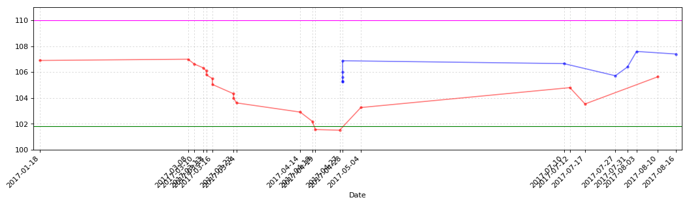
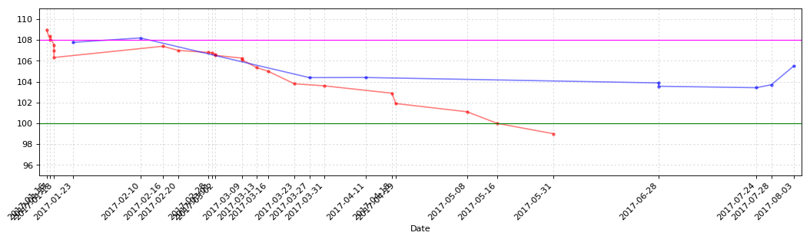

```python
import pandas as pd
import numpy as np
import matplotlib.pyplot as plt
import matplotlib
import matplotlib.dates as mdates
import time
```


```python
Now_Date = time.strftime('%Y-%m-%d',time.localtime(time.time()))
Now_Date = pd.to_datetime(Now_Date)
Now_Date = mdates.date2num(Now_Date)
```


```python
CB_Transaction_Data = pd.read_csv('cbcsv/CB_Transaction_Data.csv', encoding='gbk')
```


```python
CB_TD_lanbiao = CB_Transaction_Data.loc[CB_Transaction_Data[u'证券名称'] == u'蓝标转债']
CB_TD_lanbiao = CB_TD_lanbiao.reset_index(drop=True)
CB_TD_lanbiao
```


<div>

<table border="1" class="dataframe">
  <thead>
    <tr style="text-align: right;">
      <th></th>
      <th>发生日期</th>
      <th>业务名称</th>
      <th>证券代码</th>
      <th>证券名称</th>
      <th>成交均价</th>
      <th>成交数量</th>
      <th>成交金额</th>
      <th>股份余额</th>
      <th>手续费</th>
      <th>发生金额</th>
    </tr>
  </thead>
  <tbody>
    <tr>
      <th>0</th>
      <td>2017-1-18</td>
      <td>证券买入清算</td>
      <td>123001</td>
      <td>蓝标转债</td>
      <td>106.901</td>
      <td>10</td>
      <td>1069.01</td>
      <td>10</td>
      <td>0.21</td>
      <td>-1069.22</td>
    </tr>
    <tr>
      <th>1</th>
      <td>2017-3-8</td>
      <td>证券买入清算</td>
      <td>123001</td>
      <td>蓝标转债</td>
      <td>107.000</td>
      <td>10</td>
      <td>1070.00</td>
      <td>20</td>
      <td>0.21</td>
      <td>-1070.21</td>
    </tr>
    <tr>
      <th>2</th>
      <td>2017-3-10</td>
      <td>证券买入清算</td>
      <td>123001</td>
      <td>蓝标转债</td>
      <td>106.631</td>
      <td>10</td>
      <td>1066.31</td>
      <td>30</td>
      <td>0.21</td>
      <td>-1066.52</td>
    </tr>
    <tr>
      <th>3</th>
      <td>2017-3-13</td>
      <td>证券买入清算</td>
      <td>123001</td>
      <td>蓝标转债</td>
      <td>106.333</td>
      <td>10</td>
      <td>1063.33</td>
      <td>40</td>
      <td>0.21</td>
      <td>-1063.54</td>
    </tr>
    <tr>
      <th>4</th>
      <td>2017-3-14</td>
      <td>证券买入清算</td>
      <td>123001</td>
      <td>蓝标转债</td>
      <td>106.100</td>
      <td>10</td>
      <td>1061.00</td>
      <td>50</td>
      <td>0.21</td>
      <td>-1061.21</td>
    </tr>
    <tr>
      <th>5</th>
      <td>2017-3-14</td>
      <td>证券买入清算</td>
      <td>123001</td>
      <td>蓝标转债</td>
      <td>105.800</td>
      <td>10</td>
      <td>1058.00</td>
      <td>60</td>
      <td>0.21</td>
      <td>-1058.21</td>
    </tr>
    <tr>
      <th>6</th>
      <td>2017-3-16</td>
      <td>证券买入清算</td>
      <td>123001</td>
      <td>蓝标转债</td>
      <td>105.500</td>
      <td>10</td>
      <td>1055.00</td>
      <td>70</td>
      <td>0.21</td>
      <td>-1055.21</td>
    </tr>
    <tr>
      <th>7</th>
      <td>2017-3-16</td>
      <td>证券买入清算</td>
      <td>123001</td>
      <td>蓝标转债</td>
      <td>105.050</td>
      <td>10</td>
      <td>1050.50</td>
      <td>80</td>
      <td>0.21</td>
      <td>-1050.71</td>
    </tr>
    <tr>
      <th>8</th>
      <td>2017-3-23</td>
      <td>证券买入清算</td>
      <td>123001</td>
      <td>蓝标转债</td>
      <td>104.330</td>
      <td>10</td>
      <td>1043.30</td>
      <td>90</td>
      <td>0.21</td>
      <td>-1043.51</td>
    </tr>
    <tr>
      <th>9</th>
      <td>2017-3-23</td>
      <td>证券买入清算</td>
      <td>123001</td>
      <td>蓝标转债</td>
      <td>103.983</td>
      <td>10</td>
      <td>1039.83</td>
      <td>100</td>
      <td>0.21</td>
      <td>-1040.04</td>
    </tr>
    <tr>
      <th>10</th>
      <td>2017-3-24</td>
      <td>证券买入清算</td>
      <td>123001</td>
      <td>蓝标转债</td>
      <td>103.620</td>
      <td>10</td>
      <td>1036.20</td>
      <td>110</td>
      <td>0.21</td>
      <td>-1036.41</td>
    </tr>
    <tr>
      <th>11</th>
      <td>2017-4-14</td>
      <td>证券买入清算</td>
      <td>123001</td>
      <td>蓝标转债</td>
      <td>102.911</td>
      <td>10</td>
      <td>1029.11</td>
      <td>120</td>
      <td>0.21</td>
      <td>-1029.32</td>
    </tr>
    <tr>
      <th>12</th>
      <td>2017-4-18</td>
      <td>证券买入清算</td>
      <td>123001</td>
      <td>蓝标转债</td>
      <td>102.195</td>
      <td>10</td>
      <td>1021.95</td>
      <td>130</td>
      <td>0.20</td>
      <td>-1022.15</td>
    </tr>
    <tr>
      <th>13</th>
      <td>2017-4-19</td>
      <td>证券买入清算</td>
      <td>123001</td>
      <td>蓝标转债</td>
      <td>101.561</td>
      <td>10</td>
      <td>1015.61</td>
      <td>140</td>
      <td>0.20</td>
      <td>-1015.81</td>
    </tr>
    <tr>
      <th>14</th>
      <td>2017-4-27</td>
      <td>证券买入清算</td>
      <td>123001</td>
      <td>蓝标转债</td>
      <td>101.511</td>
      <td>10</td>
      <td>1015.11</td>
      <td>150</td>
      <td>0.20</td>
      <td>-1015.31</td>
    </tr>
    <tr>
      <th>15</th>
      <td>2017-4-28</td>
      <td>证券卖出清算</td>
      <td>123001</td>
      <td>蓝标转债</td>
      <td>105.251</td>
      <td>-40</td>
      <td>4210.04</td>
      <td>110</td>
      <td>0.84</td>
      <td>4209.20</td>
    </tr>
    <tr>
      <th>16</th>
      <td>2017-4-28</td>
      <td>证券卖出清算</td>
      <td>123001</td>
      <td>蓝标转债</td>
      <td>105.300</td>
      <td>-20</td>
      <td>2106.00</td>
      <td>90</td>
      <td>0.42</td>
      <td>2105.58</td>
    </tr>
    <tr>
      <th>17</th>
      <td>2017-4-28</td>
      <td>证券卖出清算</td>
      <td>123001</td>
      <td>蓝标转债</td>
      <td>105.600</td>
      <td>-20</td>
      <td>2112.00</td>
      <td>70</td>
      <td>0.42</td>
      <td>2111.58</td>
    </tr>
    <tr>
      <th>18</th>
      <td>2017-4-28</td>
      <td>证券卖出清算</td>
      <td>123001</td>
      <td>蓝标转债</td>
      <td>106.000</td>
      <td>-20</td>
      <td>2120.00</td>
      <td>50</td>
      <td>0.42</td>
      <td>2119.58</td>
    </tr>
    <tr>
      <th>19</th>
      <td>2017-4-28</td>
      <td>证券卖出清算</td>
      <td>123001</td>
      <td>蓝标转债</td>
      <td>106.880</td>
      <td>-20</td>
      <td>2137.60</td>
      <td>30</td>
      <td>0.43</td>
      <td>2137.17</td>
    </tr>
    <tr>
      <th>20</th>
      <td>2017-5-4</td>
      <td>证券买入清算</td>
      <td>123001</td>
      <td>蓝标转债</td>
      <td>103.262</td>
      <td>20</td>
      <td>2065.24</td>
      <td>50</td>
      <td>0.41</td>
      <td>-2065.65</td>
    </tr>
    <tr>
      <th>21</th>
      <td>2017-7-10</td>
      <td>证券卖出清算</td>
      <td>123001</td>
      <td>蓝标转债</td>
      <td>106.660</td>
      <td>-20</td>
      <td>2133.20</td>
      <td>30</td>
      <td>0.43</td>
      <td>2132.77</td>
    </tr>
    <tr>
      <th>22</th>
      <td>2017-7-12</td>
      <td>证券买入清算</td>
      <td>123001</td>
      <td>蓝标转债</td>
      <td>104.801</td>
      <td>10</td>
      <td>1048.01</td>
      <td>40</td>
      <td>0.21</td>
      <td>-1048.22</td>
    </tr>
    <tr>
      <th>23</th>
      <td>2017-7-17</td>
      <td>证券买入清算</td>
      <td>123001</td>
      <td>蓝标转债</td>
      <td>103.540</td>
      <td>10</td>
      <td>1035.40</td>
      <td>50</td>
      <td>0.21</td>
      <td>-1035.61</td>
    </tr>
    <tr>
      <th>24</th>
      <td>2017-7-27</td>
      <td>证券卖出清算</td>
      <td>123001</td>
      <td>蓝标转债</td>
      <td>105.720</td>
      <td>-10</td>
      <td>1057.20</td>
      <td>40</td>
      <td>0.21</td>
      <td>1056.99</td>
    </tr>
    <tr>
      <th>25</th>
      <td>2017-7-31</td>
      <td>证券卖出清算</td>
      <td>123001</td>
      <td>蓝标转债</td>
      <td>106.400</td>
      <td>-10</td>
      <td>1064.00</td>
      <td>30</td>
      <td>0.21</td>
      <td>1063.79</td>
    </tr>
    <tr>
      <th>26</th>
      <td>2017-8-3</td>
      <td>证券卖出清算</td>
      <td>123001</td>
      <td>蓝标转债</td>
      <td>107.600</td>
      <td>-10</td>
      <td>1076.00</td>
      <td>20</td>
      <td>0.22</td>
      <td>1075.78</td>
    </tr>
    <tr>
      <th>27</th>
      <td>2017-8-10</td>
      <td>证券买入清算</td>
      <td>123001</td>
      <td>蓝标转债</td>
      <td>105.640</td>
      <td>10</td>
      <td>1056.40</td>
      <td>30</td>
      <td>0.21</td>
      <td>-1056.61</td>
    </tr>
    <tr>
      <th>28</th>
      <td>2017-8-16</td>
      <td>证券卖出清算</td>
      <td>123001</td>
      <td>蓝标转债</td>
      <td>107.400</td>
      <td>-10</td>
      <td>1074.00</td>
      <td>20</td>
      <td>0.22</td>
      <td>1073.78</td>
    </tr>
  </tbody>
</table>
</div>


```python
CB_TD_lanbiao_cost_O = CB_TD_lanbiao[[u'发生金额',u'成交数量']]
CB_TD_lanbiao_cost_P = CB_TD_lanbiao_cost_O.T
CB_TD_lanbiao_cost_P[u'蓝标转债'] = CB_TD_lanbiao_cost_P.apply(lambda x: x.sum(), axis=1)
CB_TD_lanbiao_cost_Q = CB_TD_lanbiao_cost_P[[u'蓝标转债']]
CB_TD_lanbiao_cost = CB_TD_lanbiao_cost_Q.T
if CB_TD_lanbiao_cost[u'成交数量'].values == 0:
    CB_TD_lanbiao_cost[u'持仓成本'] = 0
else:
    CB_TD_lanbiao_cost[u'持仓成本'] = CB_TD_lanbiao_cost[u'发生金额']/CB_TD_lanbiao_cost[u'成交数量']*-1
CB_TD_lanbiao_cost[u'起息日'] = '2015-12-18'
lanbiao_Date = pd.to_datetime(CB_TD_lanbiao_cost[u'起息日']).astype(np.object)
lanbiao_Date = mdates.date2num(lanbiao_Date)
lanbiao_Year = int(6-(Now_Date-lanbiao_Date)/365)
lanbiao_Day = ((6-(Now_Date-lanbiao_Date)/365)-lanbiao_Year)*365
CB_TD_lanbiao_cost[u'剩余年限'] = u'%d年%d天'%(lanbiao_Year,lanbiao_Day)
```


```python
plt.figure(123001,figsize=(16,4), dpi=80)
ax123001 = plt.subplot(111)
```


```python
CB_TD_lanbiao_B = CB_TD_lanbiao.loc[CB_TD_lanbiao[u'成交数量'] > 0,[u'发生日期',u'成交均价',u'成交数量']]
CB_TD_lanbiao_B = CB_TD_lanbiao_B.set_index(u'发生日期')
CB_TD_lanbiao_B.index = pd.to_datetime(CB_TD_lanbiao_B.index)
CB_TD_lanbiao_S = CB_TD_lanbiao.loc[CB_TD_lanbiao[u'成交数量'] < 0,[u'发生日期',u'成交均价',u'成交数量']]
CB_TD_lanbiao_S = CB_TD_lanbiao_S.set_index(u'发生日期')
CB_TD_lanbiao_S.index = pd.to_datetime(CB_TD_lanbiao_S.index)
```


```python
CB_TD_lanbiao_BS = CB_TD_lanbiao.loc[CB_TD_lanbiao[u'成交数量'] <> 0,[u'发生日期',u'证券代码']]
CB_TD_lanbiao_BS = CB_TD_lanbiao_BS.drop_duplicates([u'发生日期'])
CB_TD_lanbiao_BS = CB_TD_lanbiao_BS.set_index(u'发生日期')
Day1 = pd.to_datetime(CB_TD_lanbiao_BS.index[0])
Day1 = mdates.date2num(Day1)-2
Day2 = pd.to_datetime(CB_TD_lanbiao_BS.index[-1])
Day2 = mdates.date2num(Day2)+2
```


```python
CB_TD_lanbiao_B[u'成交均价'].plot(color='red', marker='.', alpha=0.5)
CB_TD_lanbiao_S[u'成交均价'].plot(color='blue', marker='.', alpha=0.5)
plt.axhline(y=110, color='Magenta', linewidth='1.0')
plt.axhline(y=101.8, color='Green', linewidth='1.0')
plt.grid(linestyle=':', alpha=0.5)
ax123001.xaxis.set_major_formatter(mdates.DateFormatter('%Y-%m-%d'))
plt.xticks(CB_TD_lanbiao_BS.index, rotation=45)
plt.ylim(100,111,1)
plt.xlim(Day1,Day2)
plt.xlabel('Date') 
```


    <matplotlib.text.Text at 0xc38a908>


```python
CB_TD_lanbiao_cost.round(3)
```


<div>

<table border="1" class="dataframe">
  <thead>
    <tr style="text-align: right;">
      <th></th>
      <th>发生金额</th>
      <th>成交数量</th>
      <th>持仓成本</th>
      <th>起息日</th>
      <th>剩余年限</th>
    </tr>
  </thead>
  <tbody>
    <tr>
      <th>蓝标转债</th>
      <td>-1817.25</td>
      <td>20.0</td>
      <td>90.862</td>
      <td>2015-12-18</td>
      <td>4年121天</td>
    </tr>
  </tbody>
</table>
</div>


```python
plt.show()
```





```python
CB_TD_huifeng = CB_Transaction_Data.loc[CB_Transaction_Data[u'证券名称'] == u'辉丰转债']
CB_TD_huifeng = CB_TD_huifeng.reset_index(drop=True)
CB_TD_huifeng
```


<div>

<table border="1" class="dataframe">
  <thead>
    <tr style="text-align: right;">
      <th></th>
      <th>发生日期</th>
      <th>业务名称</th>
      <th>证券代码</th>
      <th>证券名称</th>
      <th>成交均价</th>
      <th>成交数量</th>
      <th>成交金额</th>
      <th>股份余额</th>
      <th>手续费</th>
      <th>发生金额</th>
    </tr>
  </thead>
  <tbody>
    <tr>
      <th>0</th>
      <td>2017-1-26</td>
      <td>证券买入清算</td>
      <td>128012</td>
      <td>辉丰转债</td>
      <td>105.799</td>
      <td>10</td>
      <td>1057.99</td>
      <td>10</td>
      <td>0.21</td>
      <td>-1058.20</td>
    </tr>
    <tr>
      <th>1</th>
      <td>2017-2-3</td>
      <td>证券买入清算</td>
      <td>128012</td>
      <td>辉丰转债</td>
      <td>105.320</td>
      <td>20</td>
      <td>2106.40</td>
      <td>30</td>
      <td>0.42</td>
      <td>-2106.82</td>
    </tr>
    <tr>
      <th>2</th>
      <td>2017-2-7</td>
      <td>证券买入清算</td>
      <td>128012</td>
      <td>辉丰转债</td>
      <td>105.300</td>
      <td>20</td>
      <td>2106.00</td>
      <td>50</td>
      <td>0.42</td>
      <td>-2106.42</td>
    </tr>
    <tr>
      <th>3</th>
      <td>2017-2-21</td>
      <td>证券买入清算</td>
      <td>128012</td>
      <td>辉丰转债</td>
      <td>105.100</td>
      <td>30</td>
      <td>3153.00</td>
      <td>80</td>
      <td>0.63</td>
      <td>-3153.63</td>
    </tr>
    <tr>
      <th>4</th>
      <td>2017-3-3</td>
      <td>证券买入清算</td>
      <td>128012</td>
      <td>辉丰转债</td>
      <td>104.898</td>
      <td>20</td>
      <td>2097.96</td>
      <td>100</td>
      <td>0.42</td>
      <td>-2098.38</td>
    </tr>
    <tr>
      <th>5</th>
      <td>2017-3-3</td>
      <td>证券买入清算</td>
      <td>128012</td>
      <td>辉丰转债</td>
      <td>104.639</td>
      <td>20</td>
      <td>2092.78</td>
      <td>120</td>
      <td>0.42</td>
      <td>-2093.20</td>
    </tr>
    <tr>
      <th>6</th>
      <td>2017-3-7</td>
      <td>证券卖出清算</td>
      <td>128012</td>
      <td>辉丰转债</td>
      <td>104.998</td>
      <td>-40</td>
      <td>4199.92</td>
      <td>80</td>
      <td>0.84</td>
      <td>4199.08</td>
    </tr>
    <tr>
      <th>7</th>
      <td>2017-3-8</td>
      <td>证券卖出清算</td>
      <td>128012</td>
      <td>辉丰转债</td>
      <td>105.450</td>
      <td>-20</td>
      <td>2109.00</td>
      <td>60</td>
      <td>0.42</td>
      <td>2108.58</td>
    </tr>
    <tr>
      <th>8</th>
      <td>2017-3-10</td>
      <td>证券买入清算</td>
      <td>128012</td>
      <td>辉丰转债</td>
      <td>104.600</td>
      <td>20</td>
      <td>2092.00</td>
      <td>80</td>
      <td>0.42</td>
      <td>-2092.42</td>
    </tr>
    <tr>
      <th>9</th>
      <td>2017-3-13</td>
      <td>证券买入清算</td>
      <td>128012</td>
      <td>辉丰转债</td>
      <td>104.311</td>
      <td>20</td>
      <td>2086.22</td>
      <td>100</td>
      <td>0.42</td>
      <td>-2086.64</td>
    </tr>
    <tr>
      <th>10</th>
      <td>2017-3-16</td>
      <td>证券买入清算</td>
      <td>128012</td>
      <td>辉丰转债</td>
      <td>103.900</td>
      <td>20</td>
      <td>2078.00</td>
      <td>120</td>
      <td>0.42</td>
      <td>-2078.42</td>
    </tr>
    <tr>
      <th>11</th>
      <td>2017-3-27</td>
      <td>证券卖出清算</td>
      <td>128012</td>
      <td>辉丰转债</td>
      <td>104.500</td>
      <td>-20</td>
      <td>2090.00</td>
      <td>100</td>
      <td>0.42</td>
      <td>2089.58</td>
    </tr>
    <tr>
      <th>12</th>
      <td>2017-3-27</td>
      <td>证券卖出清算</td>
      <td>128012</td>
      <td>辉丰转债</td>
      <td>104.660</td>
      <td>-20</td>
      <td>2093.20</td>
      <td>80</td>
      <td>0.42</td>
      <td>2092.78</td>
    </tr>
    <tr>
      <th>13</th>
      <td>2017-3-31</td>
      <td>证券买入清算</td>
      <td>128012</td>
      <td>辉丰转债</td>
      <td>103.900</td>
      <td>20</td>
      <td>2078.00</td>
      <td>100</td>
      <td>0.42</td>
      <td>-2078.42</td>
    </tr>
    <tr>
      <th>14</th>
      <td>2017-3-31</td>
      <td>证券买入清算</td>
      <td>128012</td>
      <td>辉丰转债</td>
      <td>103.921</td>
      <td>20</td>
      <td>2078.42</td>
      <td>120</td>
      <td>0.42</td>
      <td>-2078.84</td>
    </tr>
    <tr>
      <th>15</th>
      <td>2017-3-31</td>
      <td>证券卖出清算</td>
      <td>128012</td>
      <td>辉丰转债</td>
      <td>103.994</td>
      <td>-20</td>
      <td>2079.88</td>
      <td>100</td>
      <td>0.42</td>
      <td>2079.46</td>
    </tr>
    <tr>
      <th>16</th>
      <td>2017-4-18</td>
      <td>证券买入清算</td>
      <td>128012</td>
      <td>辉丰转债</td>
      <td>103.361</td>
      <td>10</td>
      <td>1033.61</td>
      <td>110</td>
      <td>0.21</td>
      <td>-1033.82</td>
    </tr>
    <tr>
      <th>17</th>
      <td>2017-4-19</td>
      <td>证券买入清算</td>
      <td>128012</td>
      <td>辉丰转债</td>
      <td>103.023</td>
      <td>10</td>
      <td>1030.23</td>
      <td>120</td>
      <td>0.21</td>
      <td>-1030.44</td>
    </tr>
    <tr>
      <th>18</th>
      <td>2017-4-20</td>
      <td>债券兑息</td>
      <td>128012</td>
      <td>辉丰转债</td>
      <td>0.000</td>
      <td>0</td>
      <td>60.00</td>
      <td>0</td>
      <td>0.00</td>
      <td>48.00</td>
    </tr>
    <tr>
      <th>19</th>
      <td>2017-4-27</td>
      <td>证券买入清算</td>
      <td>128012</td>
      <td>辉丰转债</td>
      <td>102.127</td>
      <td>10</td>
      <td>1021.27</td>
      <td>130</td>
      <td>0.20</td>
      <td>-1021.47</td>
    </tr>
    <tr>
      <th>20</th>
      <td>2017-5-5</td>
      <td>证券买入清算</td>
      <td>128012</td>
      <td>辉丰转债</td>
      <td>101.486</td>
      <td>10</td>
      <td>1014.86</td>
      <td>140</td>
      <td>0.20</td>
      <td>-1015.06</td>
    </tr>
    <tr>
      <th>21</th>
      <td>2017-5-8</td>
      <td>证券买入清算</td>
      <td>128012</td>
      <td>辉丰转债</td>
      <td>101.175</td>
      <td>10</td>
      <td>1011.75</td>
      <td>150</td>
      <td>0.20</td>
      <td>-1011.95</td>
    </tr>
    <tr>
      <th>22</th>
      <td>2017-5-31</td>
      <td>证券买入清算</td>
      <td>128012</td>
      <td>辉丰转债</td>
      <td>99.010</td>
      <td>20</td>
      <td>1980.20</td>
      <td>170</td>
      <td>0.40</td>
      <td>-1980.60</td>
    </tr>
    <tr>
      <th>23</th>
      <td>2017-6-28</td>
      <td>证券卖出清算</td>
      <td>128012</td>
      <td>辉丰转债</td>
      <td>101.880</td>
      <td>-40</td>
      <td>4075.20</td>
      <td>130</td>
      <td>0.82</td>
      <td>4074.38</td>
    </tr>
    <tr>
      <th>24</th>
      <td>2017-7-10</td>
      <td>证券卖出清算</td>
      <td>128012</td>
      <td>辉丰转债</td>
      <td>103.000</td>
      <td>-20</td>
      <td>2060.00</td>
      <td>110</td>
      <td>0.41</td>
      <td>2059.59</td>
    </tr>
    <tr>
      <th>25</th>
      <td>2017-7-24</td>
      <td>证券卖出清算</td>
      <td>128012</td>
      <td>辉丰转债</td>
      <td>106.600</td>
      <td>-30</td>
      <td>3198.00</td>
      <td>80</td>
      <td>0.64</td>
      <td>3197.36</td>
    </tr>
    <tr>
      <th>26</th>
      <td>2017-7-27</td>
      <td>证券卖出清算</td>
      <td>128012</td>
      <td>辉丰转债</td>
      <td>106.900</td>
      <td>-30</td>
      <td>3207.00</td>
      <td>50</td>
      <td>0.64</td>
      <td>3206.36</td>
    </tr>
    <tr>
      <th>27</th>
      <td>2017-7-31</td>
      <td>证券卖出清算</td>
      <td>128012</td>
      <td>辉丰转债</td>
      <td>108.800</td>
      <td>-10</td>
      <td>1088.00</td>
      <td>40</td>
      <td>0.22</td>
      <td>1087.78</td>
    </tr>
    <tr>
      <th>28</th>
      <td>2017-7-31</td>
      <td>证券卖出清算</td>
      <td>128012</td>
      <td>辉丰转债</td>
      <td>110.000</td>
      <td>-10</td>
      <td>1100.00</td>
      <td>30</td>
      <td>0.22</td>
      <td>1099.78</td>
    </tr>
    <tr>
      <th>29</th>
      <td>2017-8-9</td>
      <td>证券买入清算</td>
      <td>128012</td>
      <td>辉丰转债</td>
      <td>107.700</td>
      <td>10</td>
      <td>1077.00</td>
      <td>40</td>
      <td>0.22</td>
      <td>-1077.22</td>
    </tr>
    <tr>
      <th>30</th>
      <td>2017-8-11</td>
      <td>证券买入清算</td>
      <td>128012</td>
      <td>辉丰转债</td>
      <td>106.753</td>
      <td>10</td>
      <td>1067.53</td>
      <td>50</td>
      <td>0.21</td>
      <td>-1067.74</td>
    </tr>
    <tr>
      <th>31</th>
      <td>2017-8-11</td>
      <td>证券买入清算</td>
      <td>128012</td>
      <td>辉丰转债</td>
      <td>106.123</td>
      <td>10</td>
      <td>1061.23</td>
      <td>60</td>
      <td>0.21</td>
      <td>-1061.44</td>
    </tr>
    <tr>
      <th>32</th>
      <td>2017-8-11</td>
      <td>证券买入清算</td>
      <td>128012</td>
      <td>辉丰转债</td>
      <td>105.550</td>
      <td>10</td>
      <td>1055.50</td>
      <td>70</td>
      <td>0.21</td>
      <td>-1055.71</td>
    </tr>
    <tr>
      <th>33</th>
      <td>2017-8-14</td>
      <td>证券卖出清算</td>
      <td>128012</td>
      <td>辉丰转债</td>
      <td>106.970</td>
      <td>-10</td>
      <td>1069.70</td>
      <td>60</td>
      <td>0.21</td>
      <td>1069.49</td>
    </tr>
    <tr>
      <th>34</th>
      <td>2017-8-14</td>
      <td>证券卖出清算</td>
      <td>128012</td>
      <td>辉丰转债</td>
      <td>107.800</td>
      <td>-10</td>
      <td>1078.00</td>
      <td>50</td>
      <td>0.22</td>
      <td>1077.78</td>
    </tr>
  </tbody>
</table>
</div>


```python
CB_TD_huifeng_cost_O = CB_TD_huifeng[[u'发生金额',u'成交数量']]
CB_TD_huifeng_cost_P = CB_TD_huifeng_cost_O.T
CB_TD_huifeng_cost_P[u'辉丰转债'] = CB_TD_huifeng_cost_P.apply(lambda x: x.sum(), axis=1)
CB_TD_huifeng_cost_Q = CB_TD_huifeng_cost_P[[u'辉丰转债']]
CB_TD_huifeng_cost = CB_TD_huifeng_cost_Q.T
if CB_TD_huifeng_cost[u'成交数量'].values == 0:
    CB_TD_huifeng_cost[u'持仓成本'] = 0
else:
    CB_TD_huifeng_cost[u'持仓成本'] = CB_TD_huifeng_cost[u'发生金额']/CB_TD_huifeng_cost[u'成交数量']*-1
CB_TD_huifeng_cost[u'起息日'] = '2016-4-21'
huifeng_Date = pd.to_datetime(CB_TD_huifeng_cost[u'起息日']).astype(np.object)
huifeng_Date = mdates.date2num(huifeng_Date)
huifeng_Year = int(6-(Now_Date-huifeng_Date)/365)
huifeng_Day = ((6-(Now_Date-huifeng_Date)/365)-huifeng_Year)*365
CB_TD_huifeng_cost[u'剩余年限'] = u'%d年%d天'%(huifeng_Year,huifeng_Day)
```


```python
plt.figure(128012,figsize=(16,4), dpi=80)
ax128012 = plt.subplot(111)
```


```python
CB_TD_huifeng_B = CB_TD_huifeng.loc[CB_TD_huifeng[u'成交数量'] > 0,[u'发生日期',u'成交均价',u'成交数量']]
CB_TD_huifeng_B = CB_TD_huifeng_B.set_index(u'发生日期')
CB_TD_huifeng_B.index = pd.to_datetime(CB_TD_huifeng_B.index)
CB_TD_huifeng_S = CB_TD_huifeng.loc[CB_TD_huifeng[u'成交数量'] < 0,[u'发生日期',u'成交均价',u'成交数量']]
CB_TD_huifeng_S = CB_TD_huifeng_S.set_index(u'发生日期')
CB_TD_huifeng_S.index = pd.to_datetime(CB_TD_huifeng_S.index)
```


```python
CB_TD_huifeng_BS = CB_TD_huifeng.loc[CB_TD_huifeng[u'成交数量'] <> 0,[u'发生日期',u'证券代码']]
CB_TD_huifeng_BS = CB_TD_huifeng_BS.drop_duplicates([u'发生日期'])
CB_TD_huifeng_BS = CB_TD_huifeng_BS.set_index(u'发生日期')
Day1 = pd.to_datetime(CB_TD_huifeng_BS.index[0])
Day1 = mdates.date2num(Day1)-2
Day2 = pd.to_datetime(CB_TD_huifeng_BS.index[-1])
Day2 = mdates.date2num(Day2)+2
```


```python
CB_TD_huifeng_B[u'成交均价'].plot(color='red', marker='.', alpha=0.5)
CB_TD_huifeng_S[u'成交均价'].plot(color='blue', marker='.', alpha=0.5)
plt.axhline(y=106.44, color='Magenta', linewidth='1.0')
plt.axhline(y=100, color='Green', linewidth='1.0')
plt.grid(linestyle=':', alpha=0.5)
ax128012.xaxis.set_major_formatter(mdates.DateFormatter('%Y-%m-%d'))
plt.xticks(CB_TD_huifeng_BS.index, rotation=45)
plt.ylim(95,111,1)
plt.xlim(Day1,Day2)
plt.xlabel('Date') 
```


    <matplotlib.text.Text at 0xc8a4278>


```python
CB_TD_huifeng_cost.round(3)
```


<div>

<table border="1" class="dataframe">
  <thead>
    <tr style="text-align: right;">
      <th></th>
      <th>发生金额</th>
      <th>成交数量</th>
      <th>持仓成本</th>
      <th>起息日</th>
      <th>剩余年限</th>
    </tr>
  </thead>
  <tbody>
    <tr>
      <th>辉丰转债</th>
      <td>-4896.84</td>
      <td>50.0</td>
      <td>97.937</td>
      <td>2016-4-21</td>
      <td>4年245天</td>
    </tr>
  </tbody>
</table>
</div>


```python
plt.show()
```


```python
CB_TD_hongtao = CB_Transaction_Data.loc[CB_Transaction_Data[u'证券名称'] == u'洪涛转债']
CB_TD_hongtao = CB_TD_hongtao.reset_index(drop=True)
CB_TD_hongtao
```


<div>

<table border="1" class="dataframe">
  <thead>
    <tr style="text-align: right;">
      <th></th>
      <th>发生日期</th>
      <th>业务名称</th>
      <th>证券代码</th>
      <th>证券名称</th>
      <th>成交均价</th>
      <th>成交数量</th>
      <th>成交金额</th>
      <th>股份余额</th>
      <th>手续费</th>
      <th>发生金额</th>
    </tr>
  </thead>
  <tbody>
    <tr>
      <th>0</th>
      <td>2017-1-16</td>
      <td>证券买入清算</td>
      <td>128013</td>
      <td>洪涛转债</td>
      <td>109.000</td>
      <td>10</td>
      <td>1090.00</td>
      <td>10</td>
      <td>0.22</td>
      <td>-1090.22</td>
    </tr>
    <tr>
      <th>1</th>
      <td>2017-1-17</td>
      <td>证券买入清算</td>
      <td>128013</td>
      <td>洪涛转债</td>
      <td>108.000</td>
      <td>10</td>
      <td>1080.00</td>
      <td>20</td>
      <td>0.22</td>
      <td>-1080.22</td>
    </tr>
    <tr>
      <th>2</th>
      <td>2017-1-17</td>
      <td>证券买入清算</td>
      <td>128013</td>
      <td>洪涛转债</td>
      <td>108.350</td>
      <td>10</td>
      <td>1083.50</td>
      <td>30</td>
      <td>0.22</td>
      <td>-1083.72</td>
    </tr>
    <tr>
      <th>3</th>
      <td>2017-1-18</td>
      <td>证券买入清算</td>
      <td>128013</td>
      <td>洪涛转债</td>
      <td>107.500</td>
      <td>20</td>
      <td>2150.00</td>
      <td>50</td>
      <td>0.43</td>
      <td>-2150.43</td>
    </tr>
    <tr>
      <th>4</th>
      <td>2017-1-18</td>
      <td>证券买入清算</td>
      <td>128013</td>
      <td>洪涛转债</td>
      <td>107.000</td>
      <td>20</td>
      <td>2140.00</td>
      <td>70</td>
      <td>0.43</td>
      <td>-2140.43</td>
    </tr>
    <tr>
      <th>5</th>
      <td>2017-1-18</td>
      <td>证券买入清算</td>
      <td>128013</td>
      <td>洪涛转债</td>
      <td>106.320</td>
      <td>20</td>
      <td>2126.40</td>
      <td>90</td>
      <td>0.43</td>
      <td>-2126.83</td>
    </tr>
    <tr>
      <th>6</th>
      <td>2017-1-23</td>
      <td>证券卖出清算</td>
      <td>128013</td>
      <td>洪涛转债</td>
      <td>107.771</td>
      <td>-60</td>
      <td>6466.26</td>
      <td>30</td>
      <td>1.29</td>
      <td>6464.97</td>
    </tr>
    <tr>
      <th>7</th>
      <td>2017-2-10</td>
      <td>证券卖出清算</td>
      <td>128013</td>
      <td>洪涛转债</td>
      <td>108.199</td>
      <td>-20</td>
      <td>2163.98</td>
      <td>10</td>
      <td>0.43</td>
      <td>2163.55</td>
    </tr>
    <tr>
      <th>8</th>
      <td>2017-2-16</td>
      <td>证券买入清算</td>
      <td>128013</td>
      <td>洪涛转债</td>
      <td>107.400</td>
      <td>20</td>
      <td>2148.00</td>
      <td>30</td>
      <td>0.43</td>
      <td>-2148.43</td>
    </tr>
    <tr>
      <th>9</th>
      <td>2017-2-20</td>
      <td>证券买入清算</td>
      <td>128013</td>
      <td>洪涛转债</td>
      <td>107.001</td>
      <td>30</td>
      <td>3210.03</td>
      <td>60</td>
      <td>0.64</td>
      <td>-3210.67</td>
    </tr>
    <tr>
      <th>10</th>
      <td>2017-2-28</td>
      <td>证券买入清算</td>
      <td>128013</td>
      <td>洪涛转债</td>
      <td>106.810</td>
      <td>10</td>
      <td>1068.10</td>
      <td>70</td>
      <td>0.21</td>
      <td>-1068.31</td>
    </tr>
    <tr>
      <th>11</th>
      <td>2017-3-1</td>
      <td>证券买入清算</td>
      <td>128013</td>
      <td>洪涛转债</td>
      <td>106.775</td>
      <td>30</td>
      <td>3203.25</td>
      <td>100</td>
      <td>0.64</td>
      <td>-3203.89</td>
    </tr>
    <tr>
      <th>12</th>
      <td>2017-3-2</td>
      <td>证券买入清算</td>
      <td>128013</td>
      <td>洪涛转债</td>
      <td>106.602</td>
      <td>10</td>
      <td>1066.02</td>
      <td>110</td>
      <td>0.21</td>
      <td>-1066.23</td>
    </tr>
    <tr>
      <th>13</th>
      <td>2017-3-2</td>
      <td>证券买入清算</td>
      <td>128013</td>
      <td>洪涛转债</td>
      <td>106.528</td>
      <td>10</td>
      <td>1065.28</td>
      <td>120</td>
      <td>0.21</td>
      <td>-1065.49</td>
    </tr>
    <tr>
      <th>14</th>
      <td>2017-3-9</td>
      <td>证券买入清算</td>
      <td>128013</td>
      <td>洪涛转债</td>
      <td>106.261</td>
      <td>20</td>
      <td>2125.22</td>
      <td>140</td>
      <td>0.43</td>
      <td>-2125.65</td>
    </tr>
    <tr>
      <th>15</th>
      <td>2017-3-9</td>
      <td>证券买入清算</td>
      <td>128013</td>
      <td>洪涛转债</td>
      <td>106.101</td>
      <td>20</td>
      <td>2122.02</td>
      <td>160</td>
      <td>0.42</td>
      <td>-2122.44</td>
    </tr>
    <tr>
      <th>16</th>
      <td>2017-3-13</td>
      <td>证券买入清算</td>
      <td>128013</td>
      <td>洪涛转债</td>
      <td>105.351</td>
      <td>20</td>
      <td>2107.02</td>
      <td>180</td>
      <td>0.42</td>
      <td>-2107.44</td>
    </tr>
    <tr>
      <th>17</th>
      <td>2017-3-16</td>
      <td>证券买入清算</td>
      <td>128013</td>
      <td>洪涛转债</td>
      <td>105.000</td>
      <td>20</td>
      <td>2100.00</td>
      <td>200</td>
      <td>0.42</td>
      <td>-2100.42</td>
    </tr>
    <tr>
      <th>18</th>
      <td>2017-3-23</td>
      <td>证券买入清算</td>
      <td>128013</td>
      <td>洪涛转债</td>
      <td>103.798</td>
      <td>10</td>
      <td>1037.98</td>
      <td>210</td>
      <td>0.21</td>
      <td>-1038.19</td>
    </tr>
    <tr>
      <th>19</th>
      <td>2017-3-27</td>
      <td>证券卖出清算</td>
      <td>128013</td>
      <td>洪涛转债</td>
      <td>104.390</td>
      <td>-10</td>
      <td>1043.90</td>
      <td>200</td>
      <td>0.21</td>
      <td>1043.69</td>
    </tr>
    <tr>
      <th>20</th>
      <td>2017-3-31</td>
      <td>证券买入清算</td>
      <td>128013</td>
      <td>洪涛转债</td>
      <td>103.600</td>
      <td>20</td>
      <td>2072.00</td>
      <td>220</td>
      <td>0.41</td>
      <td>-2072.41</td>
    </tr>
    <tr>
      <th>21</th>
      <td>2017-4-11</td>
      <td>证券卖出清算</td>
      <td>128013</td>
      <td>洪涛转债</td>
      <td>104.400</td>
      <td>-20</td>
      <td>2088.00</td>
      <td>200</td>
      <td>0.42</td>
      <td>2087.58</td>
    </tr>
    <tr>
      <th>22</th>
      <td>2017-4-18</td>
      <td>证券买入清算</td>
      <td>128013</td>
      <td>洪涛转债</td>
      <td>102.891</td>
      <td>20</td>
      <td>2057.82</td>
      <td>220</td>
      <td>0.41</td>
      <td>-2058.23</td>
    </tr>
    <tr>
      <th>23</th>
      <td>2017-4-19</td>
      <td>证券买入清算</td>
      <td>128013</td>
      <td>洪涛转债</td>
      <td>101.903</td>
      <td>20</td>
      <td>2038.06</td>
      <td>240</td>
      <td>0.41</td>
      <td>-2038.47</td>
    </tr>
    <tr>
      <th>24</th>
      <td>2017-5-8</td>
      <td>证券买入清算</td>
      <td>128013</td>
      <td>洪涛转债</td>
      <td>101.110</td>
      <td>10</td>
      <td>1011.10</td>
      <td>250</td>
      <td>0.20</td>
      <td>-1011.30</td>
    </tr>
    <tr>
      <th>25</th>
      <td>2017-5-16</td>
      <td>证券买入清算</td>
      <td>128013</td>
      <td>洪涛转债</td>
      <td>99.999</td>
      <td>20</td>
      <td>1999.98</td>
      <td>270</td>
      <td>0.40</td>
      <td>-2000.38</td>
    </tr>
    <tr>
      <th>26</th>
      <td>2017-5-31</td>
      <td>证券买入清算</td>
      <td>128013</td>
      <td>洪涛转债</td>
      <td>99.003</td>
      <td>20</td>
      <td>1980.06</td>
      <td>290</td>
      <td>0.40</td>
      <td>-1980.46</td>
    </tr>
    <tr>
      <th>27</th>
      <td>2017-6-28</td>
      <td>证券卖出清算</td>
      <td>128013</td>
      <td>洪涛转债</td>
      <td>103.880</td>
      <td>-40</td>
      <td>4155.20</td>
      <td>250</td>
      <td>0.83</td>
      <td>4154.37</td>
    </tr>
    <tr>
      <th>28</th>
      <td>2017-6-28</td>
      <td>证券卖出清算</td>
      <td>128013</td>
      <td>洪涛转债</td>
      <td>103.560</td>
      <td>-10</td>
      <td>1035.60</td>
      <td>240</td>
      <td>0.21</td>
      <td>1035.39</td>
    </tr>
    <tr>
      <th>29</th>
      <td>2017-7-24</td>
      <td>证券卖出清算</td>
      <td>128013</td>
      <td>洪涛转债</td>
      <td>103.421</td>
      <td>-20</td>
      <td>2068.42</td>
      <td>220</td>
      <td>0.41</td>
      <td>2068.01</td>
    </tr>
    <tr>
      <th>30</th>
      <td>2017-7-28</td>
      <td>证券卖出清算</td>
      <td>128013</td>
      <td>洪涛转债</td>
      <td>103.701</td>
      <td>-20</td>
      <td>2074.02</td>
      <td>200</td>
      <td>0.41</td>
      <td>2073.61</td>
    </tr>
    <tr>
      <th>31</th>
      <td>2017-7-28</td>
      <td>债券兑息</td>
      <td>128013</td>
      <td>洪涛转债</td>
      <td>0.000</td>
      <td>0</td>
      <td>80.00</td>
      <td>0</td>
      <td>0.00</td>
      <td>64.00</td>
    </tr>
    <tr>
      <th>32</th>
      <td>2017-8-3</td>
      <td>证券卖出清算</td>
      <td>128013</td>
      <td>洪涛转债</td>
      <td>105.510</td>
      <td>-20</td>
      <td>2110.20</td>
      <td>180</td>
      <td>0.42</td>
      <td>2109.78</td>
    </tr>
  </tbody>
</table>
</div>


```python
CB_TD_hongtao_cost_O = CB_TD_hongtao[[u'发生金额',u'成交数量']]
CB_TD_hongtao_cost_P = CB_TD_hongtao_cost_O.T
CB_TD_hongtao_cost_P[u'洪涛转债'] = CB_TD_hongtao_cost_P.apply(lambda x: x.sum(), axis=1)
CB_TD_hongtao_cost_Q = CB_TD_hongtao_cost_P[[u'洪涛转债']]
CB_TD_hongtao_cost = CB_TD_hongtao_cost_Q.T
if CB_TD_hongtao_cost[u'成交数量'].values == 0:
    CB_TD_hongtao_cost[u'持仓成本'] = 0
else:
    CB_TD_hongtao_cost[u'持仓成本'] = CB_TD_hongtao_cost[u'发生金额']/CB_TD_hongtao_cost[u'成交数量']*-1
CB_TD_hongtao_cost[u'起息日'] = '2016-7-29'
hongtao_Date = pd.to_datetime(CB_TD_hongtao_cost[u'起息日']).astype(np.object)
hongtao_Date = mdates.date2num(hongtao_Date)
hongtao_Year = int(6-(Now_Date-hongtao_Date)/365)
hongtao_Day = ((6-(Now_Date-hongtao_Date)/365)-hongtao_Year)*365
CB_TD_hongtao_cost[u'剩余年限'] = u'%d年%d天'%(hongtao_Year,hongtao_Day)
```


```python
plt.figure(128013,figsize=(16,4), dpi=80)
ax128013 = plt.subplot(111)
```


```python
CB_TD_hongtao_B = CB_TD_hongtao.loc[CB_TD_hongtao[u'成交数量'] > 0,[u'发生日期',u'成交均价',u'成交数量']]
CB_TD_hongtao_B = CB_TD_hongtao_B.set_index(u'发生日期')
CB_TD_hongtao_B.index = pd.to_datetime(CB_TD_hongtao_B.index)
CB_TD_hongtao_S = CB_TD_hongtao.loc[CB_TD_hongtao[u'成交数量'] < 0,[u'发生日期',u'成交均价',u'成交数量']]
CB_TD_hongtao_S = CB_TD_hongtao_S.set_index(u'发生日期')
CB_TD_hongtao_S.index = pd.to_datetime(CB_TD_hongtao_S.index)
```


```python
CB_TD_hongtao_BS = CB_TD_hongtao.loc[CB_TD_hongtao[u'成交数量'] <> 0,[u'发生日期',u'证券代码']]
CB_TD_hongtao_BS = CB_TD_hongtao_BS.drop_duplicates([u'发生日期'])
CB_TD_hongtao_BS = CB_TD_hongtao_BS.set_index(u'发生日期')
Day1 = pd.to_datetime(CB_TD_hongtao_BS.index[0])
Day1 = mdates.date2num(Day1)-2
Day2 = pd.to_datetime(CB_TD_hongtao_BS.index[-1])
Day2 = mdates.date2num(Day2)+2
```


```python
CB_TD_hongtao_B[u'成交均价'].plot(color='red', marker='.', alpha=0.5)
CB_TD_hongtao_S[u'成交均价'].plot(color='blue', marker='.', alpha=0.5)
plt.axhline(y=108, color='Magenta', linewidth='1.0')
plt.axhline(y=100, color='Green', linewidth='1.0')
plt.grid(linestyle=':', alpha=0.5)
ax128013.xaxis.set_major_formatter(mdates.DateFormatter('%Y-%m-%d'))
plt.xticks(CB_TD_hongtao_BS.index, rotation=45)
plt.ylim(95,111,1)
plt.xlim(Day1,Day2)
plt.xlabel('Date') 
```


    <matplotlib.text.Text at 0xc9a3128>


```python
CB_TD_hongtao_cost.round(3)
```


<div>

<table border="1" class="dataframe">
  <thead>
    <tr style="text-align: right;">
      <th></th>
      <th>发生金额</th>
      <th>成交数量</th>
      <th>持仓成本</th>
      <th>起息日</th>
      <th>剩余年限</th>
    </tr>
  </thead>
  <tbody>
    <tr>
      <th>洪涛转债</th>
      <td>-18825.31</td>
      <td>180.0</td>
      <td>104.585</td>
      <td>2016-7-29</td>
      <td>4年344天</td>
    </tr>
  </tbody>
</table>
</div>


```python
plt.show()
```





```python
CB_TD_hangxin = CB_Transaction_Data.loc[CB_Transaction_Data[u'证券名称'] == u'航信转债']
CB_TD_hangxin = CB_TD_hangxin.reset_index(drop=True)
CB_TD_hangxin
```


<div>

<table border="1" class="dataframe">
  <thead>
    <tr style="text-align: right;">
      <th></th>
      <th>发生日期</th>
      <th>业务名称</th>
      <th>证券代码</th>
      <th>证券名称</th>
      <th>成交均价</th>
      <th>成交数量</th>
      <th>成交金额</th>
      <th>股份余额</th>
      <th>手续费</th>
      <th>发生金额</th>
    </tr>
  </thead>
  <tbody>
    <tr>
      <th>0</th>
      <td>2017-1-18</td>
      <td>证券买入清算</td>
      <td>110031</td>
      <td>航信转债</td>
      <td>106.90</td>
      <td>10</td>
      <td>1069.0</td>
      <td>10</td>
      <td>1.00</td>
      <td>-1070.00</td>
    </tr>
    <tr>
      <th>1</th>
      <td>2017-1-18</td>
      <td>证券买入清算</td>
      <td>110031</td>
      <td>航信转债</td>
      <td>106.40</td>
      <td>20</td>
      <td>2128.0</td>
      <td>30</td>
      <td>1.00</td>
      <td>-2129.00</td>
    </tr>
    <tr>
      <th>2</th>
      <td>2017-2-14</td>
      <td>证券卖出清算</td>
      <td>110031</td>
      <td>航信转债</td>
      <td>107.67</td>
      <td>-20</td>
      <td>2153.4</td>
      <td>10</td>
      <td>1.00</td>
      <td>2152.40</td>
    </tr>
    <tr>
      <th>3</th>
      <td>2017-2-17</td>
      <td>证券买入清算</td>
      <td>110031</td>
      <td>航信转债</td>
      <td>107.02</td>
      <td>20</td>
      <td>2140.4</td>
      <td>30</td>
      <td>1.00</td>
      <td>-2141.40</td>
    </tr>
    <tr>
      <th>4</th>
      <td>2017-3-2</td>
      <td>证券买入清算</td>
      <td>110031</td>
      <td>航信转债</td>
      <td>106.90</td>
      <td>20</td>
      <td>2138.0</td>
      <td>50</td>
      <td>1.00</td>
      <td>-2139.00</td>
    </tr>
    <tr>
      <th>5</th>
      <td>2017-3-23</td>
      <td>证券买入清算</td>
      <td>110031</td>
      <td>航信转债</td>
      <td>105.10</td>
      <td>20</td>
      <td>2102.0</td>
      <td>70</td>
      <td>1.00</td>
      <td>-2103.00</td>
    </tr>
    <tr>
      <th>6</th>
      <td>2017-3-23</td>
      <td>证券买入清算</td>
      <td>110031</td>
      <td>航信转债</td>
      <td>104.74</td>
      <td>10</td>
      <td>1047.4</td>
      <td>80</td>
      <td>1.00</td>
      <td>-1048.40</td>
    </tr>
    <tr>
      <th>7</th>
      <td>2017-3-23</td>
      <td>证券买入清算</td>
      <td>110031</td>
      <td>航信转债</td>
      <td>104.60</td>
      <td>10</td>
      <td>1046.0</td>
      <td>90</td>
      <td>1.00</td>
      <td>-1047.00</td>
    </tr>
    <tr>
      <th>8</th>
      <td>2017-3-24</td>
      <td>证券买入清算</td>
      <td>110031</td>
      <td>航信转债</td>
      <td>104.51</td>
      <td>10</td>
      <td>1045.1</td>
      <td>100</td>
      <td>1.00</td>
      <td>-1046.10</td>
    </tr>
    <tr>
      <th>9</th>
      <td>2017-4-7</td>
      <td>证券卖出清算</td>
      <td>110031</td>
      <td>航信转债</td>
      <td>104.41</td>
      <td>-10</td>
      <td>1044.1</td>
      <td>90</td>
      <td>1.00</td>
      <td>1043.10</td>
    </tr>
    <tr>
      <th>10</th>
      <td>2017-4-7</td>
      <td>证券卖出清算</td>
      <td>110031</td>
      <td>航信转债</td>
      <td>104.46</td>
      <td>-10</td>
      <td>1044.6</td>
      <td>80</td>
      <td>1.00</td>
      <td>1043.60</td>
    </tr>
    <tr>
      <th>11</th>
      <td>2017-4-7</td>
      <td>证券卖出清算</td>
      <td>110031</td>
      <td>航信转债</td>
      <td>104.55</td>
      <td>-10</td>
      <td>1045.5</td>
      <td>70</td>
      <td>1.00</td>
      <td>1044.50</td>
    </tr>
    <tr>
      <th>12</th>
      <td>2017-4-7</td>
      <td>证券卖出清算</td>
      <td>110031</td>
      <td>航信转债</td>
      <td>104.80</td>
      <td>-20</td>
      <td>2096.0</td>
      <td>50</td>
      <td>1.00</td>
      <td>2095.00</td>
    </tr>
    <tr>
      <th>13</th>
      <td>2017-4-14</td>
      <td>证券买入清算</td>
      <td>110031</td>
      <td>航信转债</td>
      <td>104.01</td>
      <td>20</td>
      <td>2080.2</td>
      <td>70</td>
      <td>1.00</td>
      <td>-2081.20</td>
    </tr>
    <tr>
      <th>14</th>
      <td>2017-4-19</td>
      <td>证券买入清算</td>
      <td>110031</td>
      <td>航信转债</td>
      <td>103.61</td>
      <td>20</td>
      <td>2072.2</td>
      <td>90</td>
      <td>1.00</td>
      <td>-2073.20</td>
    </tr>
    <tr>
      <th>15</th>
      <td>2017-4-24</td>
      <td>证券买入清算</td>
      <td>110031</td>
      <td>航信转债</td>
      <td>102.95</td>
      <td>10</td>
      <td>1029.5</td>
      <td>100</td>
      <td>1.00</td>
      <td>-1030.50</td>
    </tr>
    <tr>
      <th>16</th>
      <td>2017-5-16</td>
      <td>证券买入清算</td>
      <td>110031</td>
      <td>航信转债</td>
      <td>99.98</td>
      <td>20</td>
      <td>1999.6</td>
      <td>120</td>
      <td>1.00</td>
      <td>-2000.60</td>
    </tr>
    <tr>
      <th>17</th>
      <td>2017-6-16</td>
      <td>债券兑息</td>
      <td>110031</td>
      <td>航信转债</td>
      <td>0.00</td>
      <td>0</td>
      <td>60.0</td>
      <td>120</td>
      <td>0.00</td>
      <td>48.00</td>
    </tr>
    <tr>
      <th>18</th>
      <td>2017-6-28</td>
      <td>证券卖出清算</td>
      <td>110031</td>
      <td>航信转债</td>
      <td>104.09</td>
      <td>-70</td>
      <td>7286.3</td>
      <td>50</td>
      <td>1.46</td>
      <td>7284.84</td>
    </tr>
    <tr>
      <th>19</th>
      <td>2017-7-24</td>
      <td>证券卖出清算</td>
      <td>110031</td>
      <td>航信转债</td>
      <td>104.51</td>
      <td>-30</td>
      <td>3135.3</td>
      <td>20</td>
      <td>1.00</td>
      <td>3134.30</td>
    </tr>
  </tbody>
</table>
</div>


```python
CB_TD_hangxin_cost_O = CB_TD_hangxin[[u'发生金额',u'成交数量']]
CB_TD_hangxin_cost_P = CB_TD_hangxin_cost_O.T
CB_TD_hangxin_cost_P[u'航信转债'] = CB_TD_hangxin_cost_P.apply(lambda x: x.sum(), axis=1)
CB_TD_hangxin_cost_Q = CB_TD_hangxin_cost_P[[u'航信转债']]
CB_TD_hangxin_cost = CB_TD_hangxin_cost_Q.T
if CB_TD_hangxin_cost[u'成交数量'].values == 0:
    CB_TD_hangxin_cost[u'持仓成本'] = 0
else:
    CB_TD_hangxin_cost[u'持仓成本'] = CB_TD_hangxin_cost[u'发生金额']/CB_TD_hangxin_cost[u'成交数量']*-1
CB_TD_hangxin_cost[u'起息日'] = '2015-6-12'
hangxin_Date = pd.to_datetime(CB_TD_hangxin_cost[u'起息日']).astype(np.object)
hangxin_Date = mdates.date2num(hangxin_Date)
hangxin_Year = int(6-(Now_Date-hangxin_Date)/365)
hangxin_Day = ((6-(Now_Date-hangxin_Date)/365)-hangxin_Year)*365
CB_TD_hangxin_cost[u'剩余年限'] = u'%d年%d天'%(hangxin_Year,hangxin_Day)
```


```python
plt.figure(110031,figsize=(16,4), dpi=80)
ax110031 = plt.subplot(111)
```


```python
CB_TD_hangxin_B = CB_TD_hangxin.loc[CB_TD_hangxin[u'成交数量'] > 0,[u'发生日期',u'成交均价',u'成交数量']]
CB_TD_hangxin_B = CB_TD_hangxin_B.set_index(u'发生日期')
CB_TD_hangxin_B.index = pd.to_datetime(CB_TD_hangxin_B.index)
CB_TD_hangxin_S = CB_TD_hangxin.loc[CB_TD_hangxin[u'成交数量'] < 0,[u'发生日期',u'成交均价',u'成交数量']]
CB_TD_hangxin_S = CB_TD_hangxin_S.set_index(u'发生日期')
CB_TD_hangxin_S.index = pd.to_datetime(CB_TD_hangxin_S.index)
```


```python
CB_TD_hangxin_BS = CB_TD_hangxin.loc[CB_TD_hangxin[u'成交数量'] <> 0,[u'发生日期',u'证券代码']]
CB_TD_hangxin_BS = CB_TD_hangxin_BS.drop_duplicates([u'发生日期'])
CB_TD_hangxin_BS = CB_TD_hangxin_BS.set_index(u'发生日期')
Day1 = pd.to_datetime(CB_TD_hangxin_BS.index[0])
Day1 = mdates.date2num(Day1)-2
Day2 = pd.to_datetime(CB_TD_hangxin_BS.index[-1])
Day2 = mdates.date2num(Day2)+2
```


```python
CB_TD_hangxin_B[u'成交均价'].plot(color='red', marker='.', alpha=0.5)
CB_TD_hangxin_S[u'成交均价'].plot(color='blue', marker='.', alpha=0.5)
plt.axhline(y=107, color='Magenta', linewidth='1.0')
plt.axhline(y=101.5, color='Green', linewidth='1.0')
plt.grid(linestyle=':', alpha=0.5)
ax110031.xaxis.set_major_formatter(mdates.DateFormatter('%Y-%m-%d'))
plt.xticks(CB_TD_hangxin_BS.index, rotation=45)
plt.ylim(95,111,1)
plt.xlim(Day1,Day2)
plt.xlabel('Date') 
```


    <matplotlib.text.Text at 0xcbeee48>


```python
CB_TD_hangxin_cost.round(3)
```


<div>

<table border="1" class="dataframe">
  <thead>
    <tr style="text-align: right;">
      <th></th>
      <th>发生金额</th>
      <th>成交数量</th>
      <th>持仓成本</th>
      <th>起息日</th>
      <th>剩余年限</th>
    </tr>
  </thead>
  <tbody>
    <tr>
      <th>航信转债</th>
      <td>-2063.66</td>
      <td>20.0</td>
      <td>103.183</td>
      <td>2015-6-12</td>
      <td>3年296天</td>
    </tr>
  </tbody>
</table>
</div>


```python
plt.show()
```


```python
CB_TD_haiyin = CB_Transaction_Data.loc[CB_Transaction_Data[u'证券名称'] == u'海印转债']
CB_TD_haiyin = CB_TD_haiyin.reset_index(drop=True)
CB_TD_haiyin
```


<div>

<table border="1" class="dataframe">
  <thead>
    <tr style="text-align: right;">
      <th></th>
      <th>发生日期</th>
      <th>业务名称</th>
      <th>证券代码</th>
      <th>证券名称</th>
      <th>成交均价</th>
      <th>成交数量</th>
      <th>成交金额</th>
      <th>股份余额</th>
      <th>手续费</th>
      <th>发生金额</th>
    </tr>
  </thead>
  <tbody>
    <tr>
      <th>0</th>
      <td>2017-3-23</td>
      <td>证券买入清算</td>
      <td>127003</td>
      <td>海印转债</td>
      <td>107.011</td>
      <td>10</td>
      <td>1070.11</td>
      <td>10</td>
      <td>0.21</td>
      <td>-1070.32</td>
    </tr>
    <tr>
      <th>1</th>
      <td>2017-4-7</td>
      <td>证券买入清算</td>
      <td>127003</td>
      <td>海印转债</td>
      <td>106.410</td>
      <td>10</td>
      <td>1064.10</td>
      <td>20</td>
      <td>0.21</td>
      <td>-1064.31</td>
    </tr>
    <tr>
      <th>2</th>
      <td>2017-4-18</td>
      <td>证券买入清算</td>
      <td>127003</td>
      <td>海印转债</td>
      <td>104.890</td>
      <td>10</td>
      <td>1048.90</td>
      <td>30</td>
      <td>0.21</td>
      <td>-1049.11</td>
    </tr>
    <tr>
      <th>3</th>
      <td>2017-4-27</td>
      <td>证券买入清算</td>
      <td>127003</td>
      <td>海印转债</td>
      <td>103.300</td>
      <td>10</td>
      <td>1033.00</td>
      <td>40</td>
      <td>0.21</td>
      <td>-1033.21</td>
    </tr>
    <tr>
      <th>4</th>
      <td>2017-5-4</td>
      <td>证券买入清算</td>
      <td>127003</td>
      <td>海印转债</td>
      <td>102.960</td>
      <td>10</td>
      <td>1029.60</td>
      <td>50</td>
      <td>0.21</td>
      <td>-1029.81</td>
    </tr>
    <tr>
      <th>5</th>
      <td>2017-5-8</td>
      <td>证券买入清算</td>
      <td>127003</td>
      <td>海印转债</td>
      <td>102.101</td>
      <td>10</td>
      <td>1021.01</td>
      <td>60</td>
      <td>0.20</td>
      <td>-1021.21</td>
    </tr>
    <tr>
      <th>6</th>
      <td>2017-5-16</td>
      <td>证券买入清算</td>
      <td>127003</td>
      <td>海印转债</td>
      <td>100.000</td>
      <td>20</td>
      <td>2000.00</td>
      <td>80</td>
      <td>0.40</td>
      <td>-2000.40</td>
    </tr>
    <tr>
      <th>7</th>
      <td>2017-7-7</td>
      <td>证券卖出清算</td>
      <td>127003</td>
      <td>海印转债</td>
      <td>102.500</td>
      <td>-30</td>
      <td>3075.00</td>
      <td>50</td>
      <td>0.62</td>
      <td>3074.38</td>
    </tr>
    <tr>
      <th>8</th>
      <td>2017-7-24</td>
      <td>证券卖出清算</td>
      <td>127003</td>
      <td>海印转债</td>
      <td>103.790</td>
      <td>-20</td>
      <td>2075.80</td>
      <td>30</td>
      <td>0.42</td>
      <td>2075.38</td>
    </tr>
    <tr>
      <th>9</th>
      <td>2017-7-31</td>
      <td>证券卖出清算</td>
      <td>127003</td>
      <td>海印转债</td>
      <td>105.390</td>
      <td>-10</td>
      <td>1053.90</td>
      <td>20</td>
      <td>0.21</td>
      <td>1053.69</td>
    </tr>
    <tr>
      <th>10</th>
      <td>2017-8-11</td>
      <td>证券买入清算</td>
      <td>127003</td>
      <td>海印转债</td>
      <td>103.450</td>
      <td>10</td>
      <td>1034.50</td>
      <td>30</td>
      <td>0.21</td>
      <td>-1034.71</td>
    </tr>
  </tbody>
</table>
</div>


```python
CB_TD_haiyin_cost_O = CB_TD_haiyin[[u'发生金额',u'成交数量']]
CB_TD_haiyin_cost_P = CB_TD_haiyin_cost_O.T
CB_TD_haiyin_cost_P[u'海印转债'] = CB_TD_haiyin_cost_P.apply(lambda x: x.sum(), axis=1)
CB_TD_haiyin_cost_Q = CB_TD_haiyin_cost_P[[u'海印转债']]
CB_TD_haiyin_cost = CB_TD_haiyin_cost_Q.T
if CB_TD_haiyin_cost[u'成交数量'].values == 0:
    CB_TD_haiyin_cost[u'持仓成本'] = 0
else:
    CB_TD_haiyin_cost[u'持仓成本'] = CB_TD_haiyin_cost[u'发生金额']/CB_TD_haiyin_cost[u'成交数量']*-1
CB_TD_haiyin_cost[u'起息日'] = '2016-6-8'
haiyin_Date = pd.to_datetime(CB_TD_haiyin_cost[u'起息日']).astype(np.object)
haiyin_Date = mdates.date2num(haiyin_Date)
haiyin_Year = int(6-(Now_Date-haiyin_Date)/365)
haiyin_Day = ((6-(Now_Date-haiyin_Date)/365)-haiyin_Year)*365
CB_TD_haiyin_cost[u'剩余年限'] = u'%d年%d天'%(haiyin_Year,haiyin_Day)
```


```python
plt.figure(127003,figsize=(16,4), dpi=80)
ax127003 = plt.subplot(111)
```


```python
CB_TD_haiyin_B = CB_TD_haiyin.loc[CB_TD_haiyin[u'成交数量'] > 0,[u'发生日期',u'成交均价',u'成交数量']]
CB_TD_haiyin_B = CB_TD_haiyin_B.set_index(u'发生日期')
CB_TD_haiyin_B.index = pd.to_datetime(CB_TD_haiyin_B.index)
CB_TD_haiyin_S = CB_TD_haiyin.loc[CB_TD_haiyin[u'成交数量'] < 0,[u'发生日期',u'成交均价',u'成交数量']]
CB_TD_haiyin_S = CB_TD_haiyin_S.set_index(u'发生日期')
CB_TD_haiyin_S.index = pd.to_datetime(CB_TD_haiyin_S.index)
```


```python
CB_TD_haiyin_BS = CB_TD_haiyin.loc[CB_TD_haiyin[u'成交数量'] <> 0,[u'发生日期',u'证券代码']]
CB_TD_haiyin_BS = CB_TD_haiyin_BS.drop_duplicates([u'发生日期'])
CB_TD_haiyin_BS = CB_TD_haiyin_BS.set_index(u'发生日期')
Day1 = pd.to_datetime(CB_TD_haiyin_BS.index[0])
Day1 = mdates.date2num(Day1)-2
Day2 = pd.to_datetime(CB_TD_haiyin_BS.index[-1])
Day2 = mdates.date2num(Day2)+2
```


```python
CB_TD_haiyin_B[u'成交均价'].plot(color='red', marker='.', alpha=0.5)
CB_TD_haiyin_S[u'成交均价'].plot(color='blue', marker='.', alpha=0.5)
plt.axhline(y=110, color='Magenta', linewidth='1.0')
plt.axhline(y=100, color='Green', linewidth='1.0')
plt.grid(linestyle=':', alpha=0.5)
ax127003.xaxis.set_major_formatter(mdates.DateFormatter('%Y-%m-%d'))
plt.xticks(CB_TD_haiyin_BS.index, rotation=45)
plt.ylim(95,111,1)
plt.xlim(Day1,Day2)
plt.xlabel('Date') 
```


    <matplotlib.text.Text at 0xcff3cc0>


```python
CB_TD_haiyin_cost.round(3)
```


<div>

<table border="1" class="dataframe">
  <thead>
    <tr style="text-align: right;">
      <th></th>
      <th>发生金额</th>
      <th>成交数量</th>
      <th>持仓成本</th>
      <th>起息日</th>
      <th>剩余年限</th>
    </tr>
  </thead>
  <tbody>
    <tr>
      <th>海印转债</th>
      <td>-3099.63</td>
      <td>30.0</td>
      <td>103.321</td>
      <td>2016-6-8</td>
      <td>4年294天</td>
    </tr>
  </tbody>
</table>
</div>


```python
plt.show()
```


```python
CB_TD_guangda = CB_Transaction_Data.loc[CB_Transaction_Data[u'证券名称'] == u'光大转债']
CB_TD_guangda = CB_TD_guangda.reset_index(drop=True)
CB_TD_guangda
```


<div>

<table border="1" class="dataframe">
  <thead>
    <tr style="text-align: right;">
      <th></th>
      <th>发生日期</th>
      <th>业务名称</th>
      <th>证券代码</th>
      <th>证券名称</th>
      <th>成交均价</th>
      <th>成交数量</th>
      <th>成交金额</th>
      <th>股份余额</th>
      <th>手续费</th>
      <th>发生金额</th>
    </tr>
  </thead>
  <tbody>
    <tr>
      <th>0</th>
      <td>2017-3-16</td>
      <td>配股权证到帐</td>
      <td>764818</td>
      <td>光大转债</td>
      <td>100.00</td>
      <td>10</td>
      <td>1000.0</td>
      <td>10</td>
      <td>0.0</td>
      <td>-1000.0</td>
    </tr>
    <tr>
      <th>1</th>
      <td>2017-4-19</td>
      <td>证券买入清算</td>
      <td>113011</td>
      <td>光大转债</td>
      <td>101.25</td>
      <td>10</td>
      <td>1012.5</td>
      <td>20</td>
      <td>1.0</td>
      <td>-1013.5</td>
    </tr>
    <tr>
      <th>2</th>
      <td>2017-5-8</td>
      <td>证券买入清算</td>
      <td>113011</td>
      <td>光大转债</td>
      <td>100.11</td>
      <td>10</td>
      <td>1001.1</td>
      <td>30</td>
      <td>1.0</td>
      <td>-1002.1</td>
    </tr>
    <tr>
      <th>3</th>
      <td>2017-5-8</td>
      <td>证券买入清算</td>
      <td>113011</td>
      <td>光大转债</td>
      <td>99.90</td>
      <td>10</td>
      <td>999.0</td>
      <td>40</td>
      <td>1.0</td>
      <td>-1000.0</td>
    </tr>
    <tr>
      <th>4</th>
      <td>2017-6-28</td>
      <td>证券卖出清算</td>
      <td>113011</td>
      <td>光大转债</td>
      <td>106.01</td>
      <td>-20</td>
      <td>2120.2</td>
      <td>20</td>
      <td>1.0</td>
      <td>2119.2</td>
    </tr>
    <tr>
      <th>5</th>
      <td>2017-7-13</td>
      <td>证券卖出清算</td>
      <td>113011</td>
      <td>光大转债</td>
      <td>107.22</td>
      <td>-10</td>
      <td>1072.2</td>
      <td>10</td>
      <td>1.0</td>
      <td>1071.2</td>
    </tr>
    <tr>
      <th>6</th>
      <td>2017-7-17</td>
      <td>证券卖出清算</td>
      <td>113011</td>
      <td>光大转债</td>
      <td>110.95</td>
      <td>-10</td>
      <td>1109.5</td>
      <td>0</td>
      <td>1.0</td>
      <td>1108.5</td>
    </tr>
  </tbody>
</table>
</div>


```python
CB_TD_guangda_cost_O = CB_TD_guangda[[u'发生金额',u'成交数量']]
CB_TD_guangda_cost_P = CB_TD_guangda_cost_O.T
CB_TD_guangda_cost_P[u'光大转债'] = CB_TD_guangda_cost_P.apply(lambda x: x.sum(), axis=1)
CB_TD_guangda_cost_Q = CB_TD_guangda_cost_P[[u'光大转债']]
CB_TD_guangda_cost = CB_TD_guangda_cost_Q.T
if CB_TD_guangda_cost[u'成交数量'].values == 0:
    CB_TD_guangda_cost[u'持仓成本'] = 0
else:
    CB_TD_guangda_cost[u'持仓成本'] = CB_TD_guangda_cost[u'发生金额']/CB_TD_guangda_cost[u'成交数量']*-1      
CB_TD_guangda_cost[u'起息日'] = '2017-3-17'
guangda_Date = pd.to_datetime(CB_TD_guangda_cost[u'起息日']).astype(np.object)
guangda_Date = mdates.date2num(guangda_Date)
guangda_Year = int(6-(Now_Date-guangda_Date)/365)
guangda_Day = ((6-(Now_Date-guangda_Date)/365)-guangda_Year)*365
CB_TD_guangda_cost[u'剩余年限'] = u'%d年%d天'%(guangda_Year,guangda_Day)
```


```python
plt.figure(113011,figsize=(16,4), dpi=80)
ax113011 = plt.subplot(111)
```


```python
CB_TD_guangda_B = CB_TD_guangda.loc[CB_TD_guangda[u'成交数量'] > 0,[u'发生日期',u'成交均价',u'成交数量']]
CB_TD_guangda_B = CB_TD_guangda_B.set_index(u'发生日期')
CB_TD_guangda_B.index = pd.to_datetime(CB_TD_guangda_B.index)
CB_TD_guangda_S = CB_TD_guangda.loc[CB_TD_guangda[u'成交数量'] < 0,[u'发生日期',u'成交均价',u'成交数量']]
CB_TD_guangda_S = CB_TD_guangda_S.set_index(u'发生日期')
CB_TD_guangda_S.index = pd.to_datetime(CB_TD_guangda_S.index)
```


```python
CB_TD_guangda_BS = CB_TD_guangda.loc[CB_TD_guangda[u'成交数量'] <> 0,[u'发生日期',u'证券代码']]
CB_TD_guangda_BS = CB_TD_guangda_BS.drop_duplicates([u'发生日期'])
CB_TD_guangda_BS = CB_TD_guangda_BS.set_index(u'发生日期')
Day1 = pd.to_datetime(CB_TD_guangda_BS.index[0])
Day1 = mdates.date2num(Day1)-2
Day2 = pd.to_datetime(CB_TD_guangda_BS.index[-1])
Day2 = mdates.date2num(Day2)+2
```


```python
CB_TD_guangda_B[u'成交均价'].plot(color='red', marker='.', alpha=0.5)
CB_TD_guangda_S[u'成交均价'].plot(color='blue', marker='.', alpha=0.5)
plt.axhline(y=101, color='Magenta', linewidth='1.0')
plt.axhline(y=96, color='Green', linewidth='1.0')
plt.grid(linestyle=':', alpha=0.5)
ax113011.xaxis.set_major_formatter(mdates.DateFormatter('%Y-%m-%d'))
plt.xticks(CB_TD_guangda_BS.index, rotation=45)
plt.ylim(95,120,1)
plt.xlim(Day1,Day2)
plt.xlabel('Date') 
```


    <matplotlib.text.Text at 0xcff3518>


```python
CB_TD_guangda_cost.round(3)
```


<div>

<table border="1" class="dataframe">
  <thead>
    <tr style="text-align: right;">
      <th></th>
      <th>发生金额</th>
      <th>成交数量</th>
      <th>持仓成本</th>
      <th>起息日</th>
      <th>剩余年限</th>
    </tr>
  </thead>
  <tbody>
    <tr>
      <th>光大转债</th>
      <td>283.3</td>
      <td>0.0</td>
      <td>0</td>
      <td>2017-3-17</td>
      <td>5年210天</td>
    </tr>
  </tbody>
</table>
</div>


```python
plt.show()
```


```python
CB_Transaction_Data_Cost_T = pd.concat([CB_TD_lanbiao_cost.T,CB_TD_huifeng_cost.T,CB_TD_hongtao_cost.T,CB_TD_hangxin_cost.T,CB_TD_haiyin_cost.T], axis=1)
# 等待光大转债下次建仓：,CB_TD_guangda_cost.T
CB_Transaction_Data_Cost = CB_Transaction_Data_Cost_T.T
```


```python
plt.figure(1,figsize=(8,6), dpi=80)
ax1 = plt.subplot(111)
```


```python
Yahei = matplotlib.font_manager.FontProperties(fname='C:\Windows\Fonts\msyh.ttf')
k = len(CB_Transaction_Data_Cost)
x_ticks_num = np.arange(0,k)
x_ticks_name = CB_Transaction_Data_Cost.index
y_ticks_values = CB_Transaction_Data_Cost[u'持仓成本'].values
y_ticks_num = CB_Transaction_Data_Cost[u'成交数量'].values
total_width = 0.7
num_bar = 2
w = total_width/num_bar
x_ticks_b = x_ticks_num - (total_width - w)/2
af = 0.8
x_ticks_num
```


    array([0, 1, 2, 3, 4])


```python
ax1.bar(x_ticks_num+w, y_ticks_values, facecolor='orange', width=w, label=u'持仓成本', alpha=af)
plt.axhline(y=100, color='red', linewidth='1.0')
plt.legend(prop={'family':'Microsoft YaHei','size':12}, loc=(0.02,0.9))
plt.ylim(90,110,1)
plt.xticks(x_ticks_num+1.5*w, x_ticks_name, fontproperties=Yahei)
plt.grid(linestyle=':', alpha=0.5)
```


```python
ax2 = ax1.twinx()
ax2.bar(x_ticks_num+2.1*w, y_ticks_num, facecolor='FireBrick', width=w, label=u'持仓数量', alpha=af)
plt.legend(prop={'family':'Microsoft YaHei','size':12}, loc=(0.02,0.8))
plt.ylim(0,250,1)
```


    (0, 250)


```python
for a,b in zip(x_ticks_num,y_ticks_values):
    ax1.text(a+w, b+0.2, '%.3f' % b, ha='center', va= 'bottom')
```


```python
for c,d in zip(x_ticks_num,y_ticks_num):
    ax2.text(c+2.1*w, d+1, '%.0f' % d, ha='center', va= 'bottom')
```


```python
CB_Transaction_Data_Cost.round(3)
```


<div>

<table border="1" class="dataframe">
  <thead>
    <tr style="text-align: right;">
      <th></th>
      <th>发生金额</th>
      <th>成交数量</th>
      <th>持仓成本</th>
      <th>起息日</th>
      <th>剩余年限</th>
    </tr>
  </thead>
  <tbody>
    <tr>
      <th>蓝标转债</th>
      <td>-1817.25</td>
      <td>20</td>
      <td>90.8625</td>
      <td>2015-12-18</td>
      <td>4年121天</td>
    </tr>
    <tr>
      <th>辉丰转债</th>
      <td>-4896.84</td>
      <td>50</td>
      <td>97.9368</td>
      <td>2016-4-21</td>
      <td>4年245天</td>
    </tr>
    <tr>
      <th>洪涛转债</th>
      <td>-18825.3</td>
      <td>180</td>
      <td>104.585</td>
      <td>2016-7-29</td>
      <td>4年344天</td>
    </tr>
    <tr>
      <th>航信转债</th>
      <td>-2063.66</td>
      <td>20</td>
      <td>103.183</td>
      <td>2015-6-12</td>
      <td>3年296天</td>
    </tr>
    <tr>
      <th>海印转债</th>
      <td>-3099.63</td>
      <td>30</td>
      <td>103.321</td>
      <td>2016-6-8</td>
      <td>4年294天</td>
    </tr>
  </tbody>
</table>
</div>


```python
plt.savefig('D:/Python/iPython/CB/CB_TD.png', dpi=600)
```


```python
plt.show()
```


```python
CB_TD_lanbiao_last = CB_TD_lanbiao.tail(2).T
CB_TD_huifeng_last = CB_TD_huifeng.tail(2).T
CB_TD_hongtao_last = CB_TD_hongtao.tail(2).T
CB_TD_hangxin_last = CB_TD_hangxin.tail(2).T
CB_TD_haiyin_last = CB_TD_haiyin.tail(2).T
CB_TD_guangda_last = CB_TD_guangda.tail(2).T
```


```python
CB_Transaction_Data_last_T = pd.concat([CB_TD_lanbiao_last,CB_TD_huifeng_last,CB_TD_hongtao_last,CB_TD_hangxin_last,CB_TD_haiyin_last,CB_TD_guangda_last], axis=1)
CB_Transaction_Data_last = CB_Transaction_Data_last_T.T.reset_index(drop=True)
CB_Transaction_Data_last
```


<div>

<table border="1" class="dataframe">
  <thead>
    <tr style="text-align: right;">
      <th></th>
      <th>发生日期</th>
      <th>业务名称</th>
      <th>证券代码</th>
      <th>证券名称</th>
      <th>成交均价</th>
      <th>成交数量</th>
      <th>成交金额</th>
      <th>股份余额</th>
      <th>手续费</th>
      <th>发生金额</th>
    </tr>
  </thead>
  <tbody>
    <tr>
      <th>0</th>
      <td>2017-8-10</td>
      <td>证券买入清算</td>
      <td>123001</td>
      <td>蓝标转债</td>
      <td>105.64</td>
      <td>10</td>
      <td>1056.4</td>
      <td>30</td>
      <td>0.21</td>
      <td>-1056.61</td>
    </tr>
    <tr>
      <th>1</th>
      <td>2017-8-16</td>
      <td>证券卖出清算</td>
      <td>123001</td>
      <td>蓝标转债</td>
      <td>107.4</td>
      <td>-10</td>
      <td>1074</td>
      <td>20</td>
      <td>0.22</td>
      <td>1073.78</td>
    </tr>
    <tr>
      <th>2</th>
      <td>2017-8-14</td>
      <td>证券卖出清算</td>
      <td>128012</td>
      <td>辉丰转债</td>
      <td>106.97</td>
      <td>-10</td>
      <td>1069.7</td>
      <td>60</td>
      <td>0.21</td>
      <td>1069.49</td>
    </tr>
    <tr>
      <th>3</th>
      <td>2017-8-14</td>
      <td>证券卖出清算</td>
      <td>128012</td>
      <td>辉丰转债</td>
      <td>107.8</td>
      <td>-10</td>
      <td>1078</td>
      <td>50</td>
      <td>0.22</td>
      <td>1077.78</td>
    </tr>
    <tr>
      <th>4</th>
      <td>2017-7-28</td>
      <td>债券兑息</td>
      <td>128013</td>
      <td>洪涛转债</td>
      <td>0</td>
      <td>0</td>
      <td>80</td>
      <td>0</td>
      <td>0</td>
      <td>64</td>
    </tr>
    <tr>
      <th>5</th>
      <td>2017-8-3</td>
      <td>证券卖出清算</td>
      <td>128013</td>
      <td>洪涛转债</td>
      <td>105.51</td>
      <td>-20</td>
      <td>2110.2</td>
      <td>180</td>
      <td>0.42</td>
      <td>2109.78</td>
    </tr>
    <tr>
      <th>6</th>
      <td>2017-6-28</td>
      <td>证券卖出清算</td>
      <td>110031</td>
      <td>航信转债</td>
      <td>104.09</td>
      <td>-70</td>
      <td>7286.3</td>
      <td>50</td>
      <td>1.46</td>
      <td>7284.84</td>
    </tr>
    <tr>
      <th>7</th>
      <td>2017-7-24</td>
      <td>证券卖出清算</td>
      <td>110031</td>
      <td>航信转债</td>
      <td>104.51</td>
      <td>-30</td>
      <td>3135.3</td>
      <td>20</td>
      <td>1</td>
      <td>3134.3</td>
    </tr>
    <tr>
      <th>8</th>
      <td>2017-7-31</td>
      <td>证券卖出清算</td>
      <td>127003</td>
      <td>海印转债</td>
      <td>105.39</td>
      <td>-10</td>
      <td>1053.9</td>
      <td>20</td>
      <td>0.21</td>
      <td>1053.69</td>
    </tr>
    <tr>
      <th>9</th>
      <td>2017-8-11</td>
      <td>证券买入清算</td>
      <td>127003</td>
      <td>海印转债</td>
      <td>103.45</td>
      <td>10</td>
      <td>1034.5</td>
      <td>30</td>
      <td>0.21</td>
      <td>-1034.71</td>
    </tr>
    <tr>
      <th>10</th>
      <td>2017-7-13</td>
      <td>证券卖出清算</td>
      <td>113011</td>
      <td>光大转债</td>
      <td>107.22</td>
      <td>-10</td>
      <td>1072.2</td>
      <td>10</td>
      <td>1</td>
      <td>1071.2</td>
    </tr>
    <tr>
      <th>11</th>
      <td>2017-7-17</td>
      <td>证券卖出清算</td>
      <td>113011</td>
      <td>光大转债</td>
      <td>110.95</td>
      <td>-10</td>
      <td>1109.5</td>
      <td>0</td>
      <td>1</td>
      <td>1108.5</td>
    </tr>
  </tbody>
</table>
</div>


