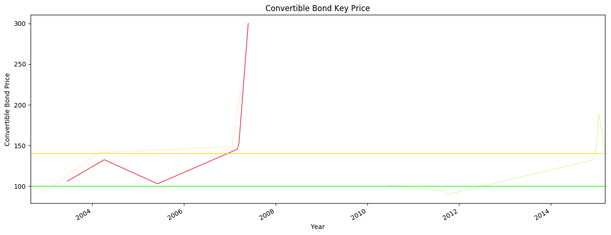
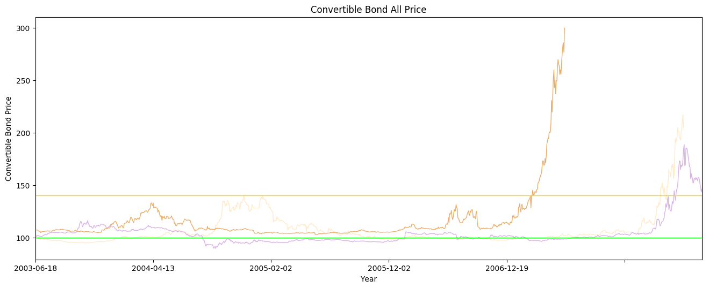

```python
import numpy as np
import pandas as pd
import matplotlib.pyplot as plt
from random import choice
```


```python
# CB = pd.read_csv('cbcsv/CB_code.csv', encoding='gbk')
```


```python
CB_Code = pd.Series([100087, 113001, 100726])
CB_Code = ['%d'%i for i in CB_Code]
```


```python
CB_color = pd.read_csv('../datacsv/color.csv')
CB_color = CB_color['colorcode']
CB_color = ['%s'%j for j in CB_color]
```


```python
import cb100087
cb100087.CB_data.columns = ['水运转债','100087']
cb_100087 = cb100087.CB_data
cb_100087
```


<div>

<table border="1" class="dataframe">
  <thead>
    <tr style="text-align: right;">
      <th></th>
      <th>水运转债</th>
      <th>100087</th>
    </tr>
  </thead>
  <tbody>
    <tr>
      <th>2002-08-28</th>
      <td>Begin Price [1]</td>
      <td>99.90</td>
    </tr>
    <tr>
      <th>2003-01-02</th>
      <td>￥95 [5]</td>
      <td>94.88</td>
    </tr>
    <tr>
      <th>2003-01-07</th>
      <td>Min Price</td>
      <td>94.71</td>
    </tr>
    <tr>
      <th>2003-12-23</th>
      <td>30％ [B]</td>
      <td>134.50</td>
    </tr>
    <tr>
      <th>2004-02-24</th>
      <td>￥140 [A]</td>
      <td>140.99</td>
    </tr>
    <tr>
      <th>2007-01-22</th>
      <td>50％ [C]</td>
      <td>148.40</td>
    </tr>
    <tr>
      <th>2007-03-27</th>
      <td>Max Price</td>
      <td>217.09</td>
    </tr>
    <tr>
      <th>2007-03-28</th>
      <td>Last Price</td>
      <td>205.10</td>
    </tr>
  </tbody>
</table>
</div>


```python
import cb113001
cb113001.CB_data.columns = ['中行转债','113001']
cb_113001 = cb113001.CB_data
cb_113001
```


<div>

<table border="1" class="dataframe">
  <thead>
    <tr style="text-align: right;">
      <th></th>
      <th>中行转债</th>
      <th>113001</th>
    </tr>
  </thead>
  <tbody>
    <tr>
      <th>2010-06-18</th>
      <td>Begin Price [1]</td>
      <td>101.00</td>
    </tr>
    <tr>
      <th>2011-09-02</th>
      <td>￥95 [5]</td>
      <td>94.10</td>
    </tr>
    <tr>
      <th>2011-09-26</th>
      <td>￥90 [6]</td>
      <td>89.65</td>
    </tr>
    <tr>
      <th>2011-09-29</th>
      <td>Min Price</td>
      <td>89.49</td>
    </tr>
    <tr>
      <th>2014-12-02</th>
      <td>30％ [B]</td>
      <td>132.24</td>
    </tr>
    <tr>
      <th>2014-12-22</th>
      <td>￥140 [A]</td>
      <td>144.57</td>
    </tr>
    <tr>
      <th>2014-12-30</th>
      <td>50％ [C]</td>
      <td>149.81</td>
    </tr>
    <tr>
      <th>2015-01-16</th>
      <td>Max Price</td>
      <td>188.74</td>
    </tr>
    <tr>
      <th>2015-03-06</th>
      <td>Last Price</td>
      <td>145.93</td>
    </tr>
  </tbody>
</table>
</div>


```python
import cb100726
cb100726.CB_data.columns = ['华电转债','100726']
cb100726.CB_data
```


<div>

<table border="1" class="dataframe">
  <thead>
    <tr style="text-align: right;">
      <th></th>
      <th>华电转债</th>
      <th>100726</th>
    </tr>
  </thead>
  <tbody>
    <tr>
      <th>2003-06-18</th>
      <td>Begin Price [1]</td>
      <td>106.00</td>
    </tr>
    <tr>
      <th>2004-04-07</th>
      <td>30％ [B]</td>
      <td>132.39</td>
    </tr>
    <tr>
      <th>2005-06-03</th>
      <td>SellBack Price [3]</td>
      <td>102.94</td>
    </tr>
    <tr>
      <th>2005-06-07</th>
      <td>Min Price</td>
      <td>102.85</td>
    </tr>
    <tr>
      <th>2007-03-02</th>
      <td>￥140 [A]</td>
      <td>145.20</td>
    </tr>
    <tr>
      <th>2007-03-15</th>
      <td>50％ [C]</td>
      <td>151.99</td>
    </tr>
    <tr>
      <th>2007-05-28</th>
      <td>Last Price</td>
      <td>299.98</td>
    </tr>
  </tbody>
</table>
</div>


```python
CB_Code_Data_h = ['cb%s.CB_data'%h for h in CB_Code]
CB_Code_Data_h
```


    ['cb100087.CB_data', 'cb113001.CB_data', 'cb100726.CB_data']


```python
CB_Code_Data = [cb100087.CB_data,cb113001.CB_data,cb100726.CB_data]
```


```python
CB_Data = pd.concat(CB_Code_Data, axis=1)
CB_Data.index = pd.to_datetime(CB_Data.index)
CB_Data = CB_Data.sort_index(axis=0, ascending=True)
```


```python
CB_Data
```


<div>

<table border="1" class="dataframe">
  <thead>
    <tr style="text-align: right;">
      <th></th>
      <th>水运转债</th>
      <th>100087</th>
      <th>中行转债</th>
      <th>113001</th>
      <th>华电转债</th>
      <th>100726</th>
    </tr>
  </thead>
  <tbody>
    <tr>
      <th>2002-08-28</th>
      <td>Begin Price [1]</td>
      <td>99.90</td>
      <td>NaN</td>
      <td>NaN</td>
      <td>NaN</td>
      <td>NaN</td>
    </tr>
    <tr>
      <th>2003-01-02</th>
      <td>￥95 [5]</td>
      <td>94.88</td>
      <td>NaN</td>
      <td>NaN</td>
      <td>NaN</td>
      <td>NaN</td>
    </tr>
    <tr>
      <th>2003-01-07</th>
      <td>Min Price</td>
      <td>94.71</td>
      <td>NaN</td>
      <td>NaN</td>
      <td>NaN</td>
      <td>NaN</td>
    </tr>
    <tr>
      <th>2003-06-18</th>
      <td>NaN</td>
      <td>NaN</td>
      <td>NaN</td>
      <td>NaN</td>
      <td>Begin Price [1]</td>
      <td>106.00</td>
    </tr>
    <tr>
      <th>2003-12-23</th>
      <td>30％ [B]</td>
      <td>134.50</td>
      <td>NaN</td>
      <td>NaN</td>
      <td>NaN</td>
      <td>NaN</td>
    </tr>
    <tr>
      <th>2004-02-24</th>
      <td>￥140 [A]</td>
      <td>140.99</td>
      <td>NaN</td>
      <td>NaN</td>
      <td>NaN</td>
      <td>NaN</td>
    </tr>
    <tr>
      <th>2004-04-07</th>
      <td>NaN</td>
      <td>NaN</td>
      <td>NaN</td>
      <td>NaN</td>
      <td>30％ [B]</td>
      <td>132.39</td>
    </tr>
    <tr>
      <th>2005-06-03</th>
      <td>NaN</td>
      <td>NaN</td>
      <td>NaN</td>
      <td>NaN</td>
      <td>SellBack Price [3]</td>
      <td>102.94</td>
    </tr>
    <tr>
      <th>2005-06-07</th>
      <td>NaN</td>
      <td>NaN</td>
      <td>NaN</td>
      <td>NaN</td>
      <td>Min Price</td>
      <td>102.85</td>
    </tr>
    <tr>
      <th>2007-01-22</th>
      <td>50％ [C]</td>
      <td>148.40</td>
      <td>NaN</td>
      <td>NaN</td>
      <td>NaN</td>
      <td>NaN</td>
    </tr>
    <tr>
      <th>2007-03-02</th>
      <td>NaN</td>
      <td>NaN</td>
      <td>NaN</td>
      <td>NaN</td>
      <td>￥140 [A]</td>
      <td>145.20</td>
    </tr>
    <tr>
      <th>2007-03-15</th>
      <td>NaN</td>
      <td>NaN</td>
      <td>NaN</td>
      <td>NaN</td>
      <td>50％ [C]</td>
      <td>151.99</td>
    </tr>
    <tr>
      <th>2007-03-27</th>
      <td>Max Price</td>
      <td>217.09</td>
      <td>NaN</td>
      <td>NaN</td>
      <td>NaN</td>
      <td>NaN</td>
    </tr>
    <tr>
      <th>2007-03-28</th>
      <td>Last Price</td>
      <td>205.10</td>
      <td>NaN</td>
      <td>NaN</td>
      <td>NaN</td>
      <td>NaN</td>
    </tr>
    <tr>
      <th>2007-05-28</th>
      <td>NaN</td>
      <td>NaN</td>
      <td>NaN</td>
      <td>NaN</td>
      <td>Last Price</td>
      <td>299.98</td>
    </tr>
    <tr>
      <th>2010-06-18</th>
      <td>NaN</td>
      <td>NaN</td>
      <td>Begin Price [1]</td>
      <td>101.00</td>
      <td>NaN</td>
      <td>NaN</td>
    </tr>
    <tr>
      <th>2011-09-02</th>
      <td>NaN</td>
      <td>NaN</td>
      <td>￥95 [5]</td>
      <td>94.10</td>
      <td>NaN</td>
      <td>NaN</td>
    </tr>
    <tr>
      <th>2011-09-26</th>
      <td>NaN</td>
      <td>NaN</td>
      <td>￥90 [6]</td>
      <td>89.65</td>
      <td>NaN</td>
      <td>NaN</td>
    </tr>
    <tr>
      <th>2011-09-29</th>
      <td>NaN</td>
      <td>NaN</td>
      <td>Min Price</td>
      <td>89.49</td>
      <td>NaN</td>
      <td>NaN</td>
    </tr>
    <tr>
      <th>2014-12-02</th>
      <td>NaN</td>
      <td>NaN</td>
      <td>30％ [B]</td>
      <td>132.24</td>
      <td>NaN</td>
      <td>NaN</td>
    </tr>
    <tr>
      <th>2014-12-22</th>
      <td>NaN</td>
      <td>NaN</td>
      <td>￥140 [A]</td>
      <td>144.57</td>
      <td>NaN</td>
      <td>NaN</td>
    </tr>
    <tr>
      <th>2014-12-30</th>
      <td>NaN</td>
      <td>NaN</td>
      <td>50％ [C]</td>
      <td>149.81</td>
      <td>NaN</td>
      <td>NaN</td>
    </tr>
    <tr>
      <th>2015-01-16</th>
      <td>NaN</td>
      <td>NaN</td>
      <td>Max Price</td>
      <td>188.74</td>
      <td>NaN</td>
      <td>NaN</td>
    </tr>
    <tr>
      <th>2015-03-06</th>
      <td>NaN</td>
      <td>NaN</td>
      <td>Last Price</td>
      <td>145.93</td>
      <td>NaN</td>
      <td>NaN</td>
    </tr>
  </tbody>
</table>
</div>


```python
'''# ====================
cb100087.CB.index = pd.to_datetime(cb100087.CB.index)
CB_100087_Line = cb100087.CB.loc[CB_Data.index,'close']
# ====================
cb113001.CB.index = pd.to_datetime(cb113001.CB.index)
CB_113001_Line = cb113001.CB.loc[CB_Data.index,'close']
# ====================
cb100726.CB.index = pd.to_datetime(cb100726.CB.index)
CB_100726_Line = cb100726.CB.loc[CB_Data.index,'close']
# ===================='''
```


    "# ====================\ncb100087.CB.index = pd.to_datetime(cb100087.CB.index)\nCB_100087_Line = cb100087.CB.loc[CB_Data.index,'close']\n# ====================\ncb113001.CB.index = pd.to_datetime(cb113001.CB.index)\nCB_113001_Line = cb113001.CB.loc[CB_Data.index,'close']\n# ====================\ncb100726.CB.index = pd.to_datetime(cb100726.CB.index)\nCB_100726_Line = cb100726.CB.loc[CB_Data.index,'close']\n# ===================="


```python
'''CB_Data_Line = pd.concat([CB_100087_Line,CB_113001_Line,CB_100726_Line], axis=1)
CB_Data_Line.columns = CB_Code'''
```


    'CB_Data_Line = pd.concat([CB_100087_Line,CB_113001_Line,CB_100726_Line], axis=1)\nCB_Data_Line.columns = CB_Code'


```python
plt.figure(1, figsize=(16,6), dpi=100)
ax1 = plt.subplot(111)
```


```python
for m in CB_Code:
    CB_Data[m].dropna().plot(color = choice(CB_color), linewidth=1.0, linestyle="-")
```


```python
plt.axhline(y=100, color='Lime', linewidth='1.0')
plt.axhline(y=140, color='Gold', linewidth='1.0') 
```


    <matplotlib.lines.Line2D at 0xc815f60>


```python
plt.title('Convertible Bond Key Price')
plt.xlabel('Year') 
plt.ylabel('Convertible Bond Price') 
```


    <matplotlib.text.Text at 0xc9293c8>


```python
plt.show()
```





```python
# CB_Data_CLose = pd.concat(DLC.CB_Code_CLose, axis=1)
# CB_Data_CLose.columns = CB_Code
CB_Data_CLose = pd.concat([cb100087.CB['close'],cb113001.CB['close'],cb100726.CB['close']], axis=1)
CB_Data_CLose.columns = ['100087','113001','100726']
```


```python
'''CB_Data_CLose_x = CB_Data_CLose['100087'].dropna()
CB_Data_CLose_y = CB_Data_CLose['113001'].dropna()
CB_Data_CLose_z = CB_Data_CLose['113501'].dropna()'''
```


    "CB_Data_CLose_x = CB_Data_CLose['100087'].dropna()\nCB_Data_CLose_y = CB_Data_CLose['113001'].dropna()\nCB_Data_CLose_z = CB_Data_CLose['113501'].dropna()"


```python
plt.figure(2, figsize=(16,6), dpi=100)
ax2 = plt.subplot(111)
```


```python
for n in CB_Code:
    CB_Data_CLose[n].dropna().plot(color = choice(CB_color), linewidth=1.0, linestyle="-")
```


```python
'''CB_Data_CLose['100087'].dropna().plot(color = choice(CB_color), linewidth=1.0, linestyle="-")
CB_Data_CLose['113001'].dropna().plot(color = choice(CB_color), linewidth=1.0, linestyle="-")
CB_Data_CLose['113501'].dropna().plot(color = choice(CB_color), linewidth=1.0, linestyle="-")'''
```


    'CB_Data_CLose[\'100087\'].dropna().plot(color = choice(CB_color), linewidth=1.0, linestyle="-")\nCB_Data_CLose[\'113001\'].dropna().plot(color = choice(CB_color), linewidth=1.0, linestyle="-")\nCB_Data_CLose[\'113501\'].dropna().plot(color = choice(CB_color), linewidth=1.0, linestyle="-")'


```python
plt.axhline(y=100, color='Lime', linewidth='1.0')
plt.axhline(y=140, color='Gold', linewidth='1.0') 
```


    <matplotlib.lines.Line2D at 0xc96e828>


```python
plt.title('Convertible Bond All Price')
plt.xlabel('Year') 
plt.ylabel('Convertible Bond Price') 
```


    <matplotlib.text.Text at 0xc96efd0>


```python
plt.show()
```




