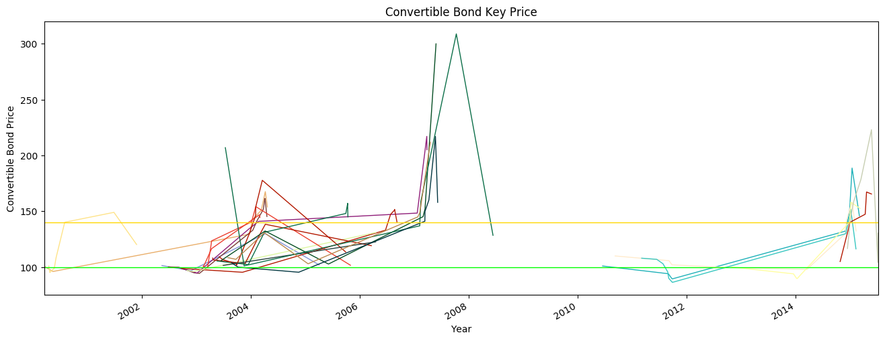
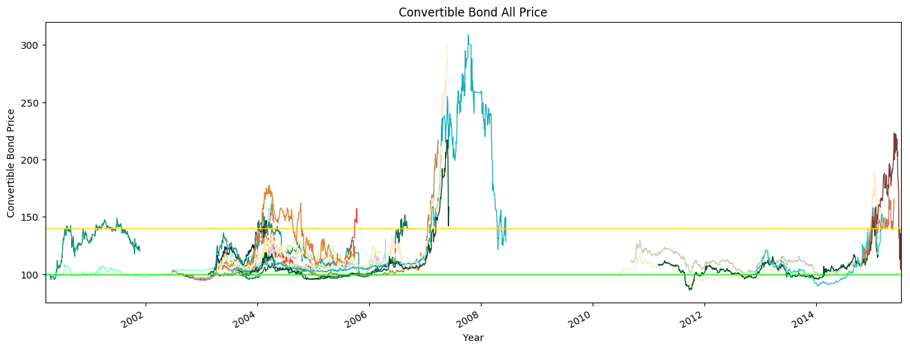

```python
import numpy as np
import pandas as pd
import matplotlib.pyplot as plt
from random import choice
```


```python
SZ_Data = pd.read_csv('cbcsv/shangzheng_CB.csv')
SZ_Data = SZ_Data.set_index('date')
SZ_Data.index = pd.to_datetime(SZ_Data.index)
SZ_Data = SZ_Data.sort_index(axis=0, ascending=True)
```


```python
# 步骤：xls → csv → CB_import_py → CB_import_All_py → CB_Data_Line_Close → CB_code_OK.csv → Convertible_Bond
```


```python
# 历史可转债列表获取，生成数组
CB_Code = pd.read_csv('cbcsv/CB_code_OK.csv', encoding='gbk')
CB_Code = ['%d'%i for i in CB_Code['CB_code']]
```


```python
# 随机颜色16位码获取，生成数组
CB_color = pd.read_csv('../datacsv/color.csv')
CB_color = ['%s'%j for j in CB_color['colorcode']]
```


```python
# 将所有可转债整理合并到CB_import_All_py.py文件，引用即可
import CB_import_All_py as AP
```


```python
# 将一些数据的清洗整理成CB_Data_Line_Close.py文件，引用即可
import CB_Data_Line_Close as DLC
```


```python
# 这种嵌套引用，可以保护了一些核心的算法，只留下数据合并、图形显示的基础算法
```


```python
# 将各个可转债提取的数据表合并起来，并用to_datatime、sort函数进行时间格式化和排序
CB_Data = pd.concat(DLC.CB_Code_Data, axis=1)
CB_Data.index = pd.to_datetime(CB_Data.index)
CB_Data = CB_Data.sort_index(axis=0, ascending=True)
```


```python
plt.figure(1, figsize=(16,6), dpi=100)
ax1 = plt.subplot(111)
```


```python
# 用for循环语句，将已合并的表CB_Data_Line中的各个转债曲线画出来，并用随机颜色显示
# CB_Data表中有很多NaN空值，用dropna()将各个转债的空值行删除，不然曲线就会出现很多断裂
# 原来思考过NaN空值处刻意用完整交易数据来填补，但还是会出现由于停牌、原始数据某些交易日缺失等难以弥补的情况，
# 若用前值替代也并不能反应真实交易，终究是会出现不同程度的曲线断裂，那么既然这是KeyPrice的表，
# 索性就用最少的KeyPrince形成曲线，了解一个简要的趋势即可，而详细的数据曲线见下面的ALLPrice曲线图。
for m in CB_Code:
    CB_Data[m].dropna().plot(color = choice(CB_color), linewidth=1.0, linestyle="-")
```


```python
plt.axhline(y=100, color='Lime', linewidth='1.0')
plt.axhline(y=140, color='Gold', linewidth='1.0') 
```


    <matplotlib.lines.Line2D at 0xccd8240>


```python
plt.title('Convertible Bond Key Price')
plt.xlabel('Year') 
plt.ylabel('Convertible Bond Price')
```


    <matplotlib.text.Text at 0xccd8550>


```python
# plt.savefig('D:/Python/iPython/CB/CB1.png', dpi=600)
```


```python
plt.show()
```





```python
# 将各个可转债全部交易数据表合并起来，Close字段名替换成可转债代码，并用to_datatime、sort函数进行时间格式化和排序
CB_Data_CLose = pd.concat(DLC.CB_Code_CLose, axis=1)
CB_Data_CLose.columns = CB_Code
CB_Data_CLose.index = pd.to_datetime(CB_Data_CLose.index)
CB_Data_CLose = CB_Data_CLose.sort_index(axis=0, ascending=True)
```


```python
plt.figure(2, figsize=(16,6), dpi=100)
ax2 = plt.subplot(111)
```


```python
# 用for循环语句，将已合并的表CB_Data_CLose中的各个转债曲线画出来，并用随机颜色显示
# CB_Data_CLose表中有很多NaN空值，用dropna()将各个转债的空值行删除，不然曲线就会出现很多断裂
for n in CB_Code:
    CB_Data_CLose[n].dropna().plot(color = choice(CB_color), linewidth=1.0, linestyle="-")
```


```python
plt.axhline(y=100, color='Lime', linewidth='1.0')
plt.axhline(y=140, color='Gold', linewidth='1.0') 
```


    <matplotlib.lines.Line2D at 0xd4e7128>


```python
#ax3 = ax2.twinx()
#SZ_Data['close'].plot(color = 'orange', linewidth=1.0, linestyle="-")
```


```python
plt.title('Convertible Bond All Price')
plt.xlabel('Year') 
plt.ylabel('Convertible Bond Price')
```


    <matplotlib.text.Text at 0xceb5320>


```python
# plt.savefig('D:/Python/iPython/CB/CB2.png', dpi=600)
```


```python
plt.show()
```




