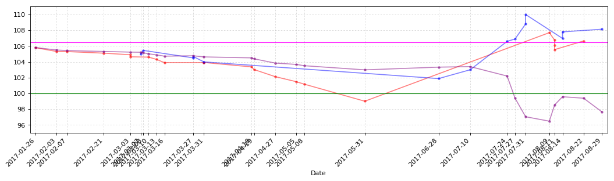

```python
import pandas as pd
import numpy as np
import matplotlib
import matplotlib.pyplot as plt
import matplotlib.dates as mdates
```


```python
import lanbiao
lanbiao.CB_TD.tail(10)
```


<div>
<table border="1" class="dataframe">
  <thead>
    <tr style="text-align: right;">
      <th></th>
      <th>发生日期</th>
      <th>业务名称</th>
      <th>证券代码</th>
      <th>证券名称</th>
      <th>成交均价</th>
      <th>成交数量</th>
      <th>成交金额</th>
      <th>股份余额</th>
      <th>手续费</th>
      <th>发生金额</th>
      <th>成本</th>
    </tr>
  </thead>
  <tbody>
    <tr>
      <th>22</th>
      <td>2017-7-12</td>
      <td>证券买入清算</td>
      <td>123001</td>
      <td>蓝标转债</td>
      <td>104.801</td>
      <td>10</td>
      <td>1048.01</td>
      <td>40</td>
      <td>0.21</td>
      <td>-1048.22</td>
      <td>99.884250</td>
    </tr>
    <tr>
      <th>23</th>
      <td>2017-7-17</td>
      <td>证券买入清算</td>
      <td>123001</td>
      <td>蓝标转债</td>
      <td>103.540</td>
      <td>10</td>
      <td>1035.40</td>
      <td>50</td>
      <td>0.21</td>
      <td>-1035.61</td>
      <td>100.619600</td>
    </tr>
    <tr>
      <th>24</th>
      <td>2017-7-27</td>
      <td>证券卖出清算</td>
      <td>123001</td>
      <td>蓝标转债</td>
      <td>105.720</td>
      <td>-10</td>
      <td>1057.20</td>
      <td>40</td>
      <td>0.21</td>
      <td>1056.99</td>
      <td>99.349750</td>
    </tr>
    <tr>
      <th>25</th>
      <td>2017-7-31</td>
      <td>证券卖出清算</td>
      <td>123001</td>
      <td>蓝标转债</td>
      <td>106.400</td>
      <td>-10</td>
      <td>1064.00</td>
      <td>30</td>
      <td>0.21</td>
      <td>1063.79</td>
      <td>97.006667</td>
    </tr>
    <tr>
      <th>26</th>
      <td>2017-8-3</td>
      <td>证券卖出清算</td>
      <td>123001</td>
      <td>蓝标转债</td>
      <td>107.600</td>
      <td>-10</td>
      <td>1076.00</td>
      <td>20</td>
      <td>0.22</td>
      <td>1075.78</td>
      <td>91.721000</td>
    </tr>
    <tr>
      <th>27</th>
      <td>2017-8-10</td>
      <td>证券买入清算</td>
      <td>123001</td>
      <td>蓝标转债</td>
      <td>105.640</td>
      <td>10</td>
      <td>1056.40</td>
      <td>30</td>
      <td>0.21</td>
      <td>-1056.61</td>
      <td>96.367667</td>
    </tr>
    <tr>
      <th>28</th>
      <td>2017-8-16</td>
      <td>证券卖出清算</td>
      <td>123001</td>
      <td>蓝标转债</td>
      <td>107.400</td>
      <td>-10</td>
      <td>1074.00</td>
      <td>20</td>
      <td>0.22</td>
      <td>1073.78</td>
      <td>90.862500</td>
    </tr>
    <tr>
      <th>29</th>
      <td>2017-8-22</td>
      <td>证券买入清算</td>
      <td>123001</td>
      <td>蓝标转债</td>
      <td>107.012</td>
      <td>10</td>
      <td>1070.12</td>
      <td>30</td>
      <td>0.21</td>
      <td>-1070.33</td>
      <td>96.252667</td>
    </tr>
    <tr>
      <th>30</th>
      <td>2017-8-23</td>
      <td>证券买入清算</td>
      <td>123001</td>
      <td>蓝标转债</td>
      <td>106.410</td>
      <td>10</td>
      <td>1064.10</td>
      <td>40</td>
      <td>0.21</td>
      <td>-1064.31</td>
      <td>98.797250</td>
    </tr>
    <tr>
      <th>31</th>
      <td>2017-9-5</td>
      <td>证券卖出清算</td>
      <td>123001</td>
      <td>蓝标转债</td>
      <td>109.010</td>
      <td>-10</td>
      <td>1090.10</td>
      <td>30</td>
      <td>0.22</td>
      <td>1089.88</td>
      <td>95.400333</td>
    </tr>
  </tbody>
</table>
</div>


```python
plt.axhline(y=110, color='Magenta', linewidth='1.0')
plt.axhline(y=101.8, color='Green', linewidth='1.0')
plt.ylim(90,111,1)
```


    (90, 111)


```python
lanbiao.CB_TD_cost.round(3)
```


<div>
<table border="1" class="dataframe">
  <thead>
    <tr style="text-align: right;">
      <th></th>
      <th>发生金额</th>
      <th>成交数量</th>
      <th>持仓成本</th>
      <th>起息日</th>
      <th>剩余年限</th>
    </tr>
  </thead>
  <tbody>
    <tr>
      <th>蓝标转债</th>
      <td>-2862.01</td>
      <td>30.0</td>
      <td>95.4</td>
      <td>2015-12-18</td>
      <td>4年94天</td>
    </tr>
  </tbody>
</table>
</div>


```python
plt.show()
```


```python
import huifeng
huifeng.CB_TD.tail(10)
```


<div>
<table border="1" class="dataframe">
  <thead>
    <tr style="text-align: right;">
      <th></th>
      <th>发生日期</th>
      <th>业务名称</th>
      <th>证券代码</th>
      <th>证券名称</th>
      <th>成交均价</th>
      <th>成交数量</th>
      <th>成交金额</th>
      <th>股份余额</th>
      <th>手续费</th>
      <th>发生金额</th>
      <th>成本</th>
    </tr>
  </thead>
  <tbody>
    <tr>
      <th>27</th>
      <td>2017-7-31</td>
      <td>证券卖出清算</td>
      <td>128012</td>
      <td>辉丰转债</td>
      <td>108.800</td>
      <td>-10</td>
      <td>1088.00</td>
      <td>40</td>
      <td>0.22</td>
      <td>1087.78</td>
      <td>97.044500</td>
    </tr>
    <tr>
      <th>28</th>
      <td>2017-7-31</td>
      <td>证券卖出清算</td>
      <td>128012</td>
      <td>辉丰转债</td>
      <td>110.000</td>
      <td>-10</td>
      <td>1100.00</td>
      <td>30</td>
      <td>0.22</td>
      <td>1099.78</td>
      <td>92.733333</td>
    </tr>
    <tr>
      <th>29</th>
      <td>2017-8-9</td>
      <td>证券买入清算</td>
      <td>128012</td>
      <td>辉丰转债</td>
      <td>107.700</td>
      <td>10</td>
      <td>1077.00</td>
      <td>40</td>
      <td>0.22</td>
      <td>-1077.22</td>
      <td>96.480500</td>
    </tr>
    <tr>
      <th>30</th>
      <td>2017-8-11</td>
      <td>证券买入清算</td>
      <td>128012</td>
      <td>辉丰转债</td>
      <td>106.753</td>
      <td>10</td>
      <td>1067.53</td>
      <td>50</td>
      <td>0.21</td>
      <td>-1067.74</td>
      <td>98.539200</td>
    </tr>
    <tr>
      <th>31</th>
      <td>2017-8-11</td>
      <td>证券买入清算</td>
      <td>128012</td>
      <td>辉丰转债</td>
      <td>106.123</td>
      <td>10</td>
      <td>1061.23</td>
      <td>60</td>
      <td>0.21</td>
      <td>-1061.44</td>
      <td>99.806667</td>
    </tr>
    <tr>
      <th>32</th>
      <td>2017-8-11</td>
      <td>证券买入清算</td>
      <td>128012</td>
      <td>辉丰转债</td>
      <td>105.550</td>
      <td>10</td>
      <td>1055.50</td>
      <td>70</td>
      <td>0.21</td>
      <td>-1055.71</td>
      <td>100.630143</td>
    </tr>
    <tr>
      <th>33</th>
      <td>2017-8-14</td>
      <td>证券卖出清算</td>
      <td>128012</td>
      <td>辉丰转债</td>
      <td>106.970</td>
      <td>-10</td>
      <td>1069.70</td>
      <td>60</td>
      <td>0.21</td>
      <td>1069.49</td>
      <td>99.577000</td>
    </tr>
    <tr>
      <th>34</th>
      <td>2017-8-14</td>
      <td>证券卖出清算</td>
      <td>128012</td>
      <td>辉丰转债</td>
      <td>107.800</td>
      <td>-10</td>
      <td>1078.00</td>
      <td>50</td>
      <td>0.22</td>
      <td>1077.78</td>
      <td>97.936800</td>
    </tr>
    <tr>
      <th>35</th>
      <td>2017-8-22</td>
      <td>证券买入清算</td>
      <td>128012</td>
      <td>辉丰转债</td>
      <td>106.650</td>
      <td>10</td>
      <td>1066.50</td>
      <td>60</td>
      <td>0.21</td>
      <td>-1066.71</td>
      <td>99.392500</td>
    </tr>
    <tr>
      <th>36</th>
      <td>2017-8-29</td>
      <td>证券卖出清算</td>
      <td>128012</td>
      <td>辉丰转债</td>
      <td>108.136</td>
      <td>-10</td>
      <td>1081.36</td>
      <td>50</td>
      <td>0.22</td>
      <td>1081.14</td>
      <td>97.648200</td>
    </tr>
  </tbody>
</table>
</div>


```python
plt.axhline(y=106.44, color='Magenta', linewidth='1.0')
plt.axhline(y=100, color='Green', linewidth='1.0')
plt.ylim(95,111,1)
```


    (95, 111)


```python
huifeng.CB_TD_cost.round(3)
```


<div>
<table border="1" class="dataframe">
  <thead>
    <tr style="text-align: right;">
      <th></th>
      <th>发生金额</th>
      <th>成交数量</th>
      <th>持仓成本</th>
      <th>起息日</th>
      <th>剩余年限</th>
    </tr>
  </thead>
  <tbody>
    <tr>
      <th>辉丰转债</th>
      <td>-4882.41</td>
      <td>50.0</td>
      <td>97.648</td>
      <td>2016-4-21</td>
      <td>4年218天</td>
    </tr>
  </tbody>
</table>
</div>


```python
plt.show()
```





```python
import hongtao
hongtao.CB_TD.tail(10)
```


<div>
<table border="1" class="dataframe">
  <thead>
    <tr style="text-align: right;">
      <th></th>
      <th>发生日期</th>
      <th>业务名称</th>
      <th>证券代码</th>
      <th>证券名称</th>
      <th>成交均价</th>
      <th>成交数量</th>
      <th>成交金额</th>
      <th>股份余额</th>
      <th>手续费</th>
      <th>发生金额</th>
      <th>成本</th>
    </tr>
  </thead>
  <tbody>
    <tr>
      <th>25</th>
      <td>2017-5-16</td>
      <td>证券买入清算</td>
      <td>128013</td>
      <td>洪涛转债</td>
      <td>99.999</td>
      <td>20</td>
      <td>1999.98</td>
      <td>270</td>
      <td>0.40</td>
      <td>-2000.38</td>
      <td>105.000037</td>
    </tr>
    <tr>
      <th>26</th>
      <td>2017-5-31</td>
      <td>证券买入清算</td>
      <td>128013</td>
      <td>洪涛转债</td>
      <td>99.003</td>
      <td>20</td>
      <td>1980.06</td>
      <td>290</td>
      <td>0.40</td>
      <td>-1980.46</td>
      <td>104.587828</td>
    </tr>
    <tr>
      <th>27</th>
      <td>2017-6-28</td>
      <td>证券卖出清算</td>
      <td>128013</td>
      <td>洪涛转债</td>
      <td>103.880</td>
      <td>-40</td>
      <td>4155.20</td>
      <td>250</td>
      <td>0.83</td>
      <td>4154.37</td>
      <td>104.704400</td>
    </tr>
    <tr>
      <th>28</th>
      <td>2017-6-28</td>
      <td>证券卖出清算</td>
      <td>128013</td>
      <td>洪涛转债</td>
      <td>103.560</td>
      <td>-10</td>
      <td>1035.60</td>
      <td>240</td>
      <td>0.21</td>
      <td>1035.39</td>
      <td>104.752958</td>
    </tr>
    <tr>
      <th>29</th>
      <td>2017-7-24</td>
      <td>证券卖出清算</td>
      <td>128013</td>
      <td>洪涛转债</td>
      <td>103.421</td>
      <td>-20</td>
      <td>2068.42</td>
      <td>220</td>
      <td>0.41</td>
      <td>2068.01</td>
      <td>104.875909</td>
    </tr>
    <tr>
      <th>30</th>
      <td>2017-7-28</td>
      <td>证券卖出清算</td>
      <td>128013</td>
      <td>洪涛转债</td>
      <td>103.701</td>
      <td>-20</td>
      <td>2074.02</td>
      <td>200</td>
      <td>0.41</td>
      <td>2073.61</td>
      <td>104.995450</td>
    </tr>
    <tr>
      <th>31</th>
      <td>2017-7-28</td>
      <td>债券兑息</td>
      <td>128013</td>
      <td>洪涛转债</td>
      <td>0.000</td>
      <td>0</td>
      <td>80.00</td>
      <td>0</td>
      <td>0.00</td>
      <td>64.00</td>
      <td>inf</td>
    </tr>
    <tr>
      <th>32</th>
      <td>2017-8-3</td>
      <td>证券卖出清算</td>
      <td>128013</td>
      <td>洪涛转债</td>
      <td>105.510</td>
      <td>-20</td>
      <td>2110.20</td>
      <td>180</td>
      <td>0.42</td>
      <td>2109.78</td>
      <td>104.585056</td>
    </tr>
    <tr>
      <th>33</th>
      <td>2017-8-18</td>
      <td>证券买入清算</td>
      <td>128013</td>
      <td>洪涛转债</td>
      <td>104.007</td>
      <td>20</td>
      <td>2080.14</td>
      <td>200</td>
      <td>0.42</td>
      <td>-2080.56</td>
      <td>104.529350</td>
    </tr>
    <tr>
      <th>34</th>
      <td>2017-8-25</td>
      <td>证券买入清算</td>
      <td>128013</td>
      <td>洪涛转债</td>
      <td>103.233</td>
      <td>20</td>
      <td>2064.66</td>
      <td>220</td>
      <td>0.41</td>
      <td>-2065.07</td>
      <td>104.413364</td>
    </tr>
  </tbody>
</table>
</div>


```python
plt.axhline(y=108, color='Magenta', linewidth='1.0')
plt.axhline(y=100, color='Green', linewidth='1.0')
plt.ylim(95,111,1)
```


    (95, 111)


```python
hongtao.CB_TD_cost.round(3)
```


<div>
<table border="1" class="dataframe">
  <thead>
    <tr style="text-align: right;">
      <th></th>
      <th>发生金额</th>
      <th>成交数量</th>
      <th>持仓成本</th>
      <th>起息日</th>
      <th>剩余年限</th>
    </tr>
  </thead>
  <tbody>
    <tr>
      <th>洪涛转债</th>
      <td>-22970.94</td>
      <td>220.0</td>
      <td>104.413</td>
      <td>2016-7-29</td>
      <td>4年317天</td>
    </tr>
  </tbody>
</table>
</div>


```python
plt.show()
```


```python
import hangxin
hangxin.CB_TD.tail(10)
```


<div>
<table border="1" class="dataframe">
  <thead>
    <tr style="text-align: right;">
      <th></th>
      <th>发生日期</th>
      <th>业务名称</th>
      <th>证券代码</th>
      <th>证券名称</th>
      <th>成交均价</th>
      <th>成交数量</th>
      <th>成交金额</th>
      <th>股份余额</th>
      <th>手续费</th>
      <th>发生金额</th>
      <th>成本</th>
    </tr>
  </thead>
  <tbody>
    <tr>
      <th>10</th>
      <td>2017-4-7</td>
      <td>证券卖出清算</td>
      <td>110031</td>
      <td>航信转债</td>
      <td>104.46</td>
      <td>-10</td>
      <td>1044.6</td>
      <td>80</td>
      <td>1.00</td>
      <td>1043.60</td>
      <td>106.060000</td>
    </tr>
    <tr>
      <th>11</th>
      <td>2017-4-7</td>
      <td>证券卖出清算</td>
      <td>110031</td>
      <td>航信转债</td>
      <td>104.55</td>
      <td>-10</td>
      <td>1045.5</td>
      <td>70</td>
      <td>1.00</td>
      <td>1044.50</td>
      <td>106.290000</td>
    </tr>
    <tr>
      <th>12</th>
      <td>2017-4-7</td>
      <td>证券卖出清算</td>
      <td>110031</td>
      <td>航信转债</td>
      <td>104.80</td>
      <td>-20</td>
      <td>2096.0</td>
      <td>50</td>
      <td>1.00</td>
      <td>2095.00</td>
      <td>106.906000</td>
    </tr>
    <tr>
      <th>13</th>
      <td>2017-4-14</td>
      <td>证券买入清算</td>
      <td>110031</td>
      <td>航信转债</td>
      <td>104.01</td>
      <td>20</td>
      <td>2080.2</td>
      <td>70</td>
      <td>1.00</td>
      <td>-2081.20</td>
      <td>106.092857</td>
    </tr>
    <tr>
      <th>14</th>
      <td>2017-4-19</td>
      <td>证券买入清算</td>
      <td>110031</td>
      <td>航信转债</td>
      <td>103.61</td>
      <td>20</td>
      <td>2072.2</td>
      <td>90</td>
      <td>1.00</td>
      <td>-2073.20</td>
      <td>105.552222</td>
    </tr>
    <tr>
      <th>15</th>
      <td>2017-4-24</td>
      <td>证券买入清算</td>
      <td>110031</td>
      <td>航信转债</td>
      <td>102.95</td>
      <td>10</td>
      <td>1029.5</td>
      <td>100</td>
      <td>1.00</td>
      <td>-1030.50</td>
      <td>105.302000</td>
    </tr>
    <tr>
      <th>16</th>
      <td>2017-5-16</td>
      <td>证券买入清算</td>
      <td>110031</td>
      <td>航信转债</td>
      <td>99.98</td>
      <td>20</td>
      <td>1999.6</td>
      <td>120</td>
      <td>1.00</td>
      <td>-2000.60</td>
      <td>104.423333</td>
    </tr>
    <tr>
      <th>17</th>
      <td>2017-6-16</td>
      <td>债券兑息</td>
      <td>110031</td>
      <td>航信转债</td>
      <td>0.00</td>
      <td>0</td>
      <td>60.0</td>
      <td>120</td>
      <td>0.00</td>
      <td>48.00</td>
      <td>104.023333</td>
    </tr>
    <tr>
      <th>18</th>
      <td>2017-6-28</td>
      <td>证券卖出清算</td>
      <td>110031</td>
      <td>航信转债</td>
      <td>104.09</td>
      <td>-70</td>
      <td>7286.3</td>
      <td>50</td>
      <td>1.46</td>
      <td>7284.84</td>
      <td>103.959200</td>
    </tr>
    <tr>
      <th>19</th>
      <td>2017-7-24</td>
      <td>证券卖出清算</td>
      <td>110031</td>
      <td>航信转债</td>
      <td>104.51</td>
      <td>-30</td>
      <td>3135.3</td>
      <td>20</td>
      <td>1.00</td>
      <td>3134.30</td>
      <td>103.183000</td>
    </tr>
  </tbody>
</table>
</div>


```python
plt.axhline(y=107, color='Magenta', linewidth='1.0')
plt.axhline(y=101.5, color='Green', linewidth='1.0')
plt.ylim(95,111,1)
```


    (95, 111)


```python
hangxin.CB_TD_cost.round(3)
```


<div>
<table border="1" class="dataframe">
  <thead>
    <tr style="text-align: right;">
      <th></th>
      <th>发生金额</th>
      <th>成交数量</th>
      <th>持仓成本</th>
      <th>起息日</th>
      <th>剩余年限</th>
    </tr>
  </thead>
  <tbody>
    <tr>
      <th>航信转债</th>
      <td>-2063.66</td>
      <td>20.0</td>
      <td>103.183</td>
      <td>2015-6-12</td>
      <td>3年269天</td>
    </tr>
  </tbody>
</table>
</div>


```python
plt.show()
```


```python
import haiyin
haiyin.CB_TD.tail(10)
```


<div>
<table border="1" class="dataframe">
  <thead>
    <tr style="text-align: right;">
      <th></th>
      <th>发生日期</th>
      <th>业务名称</th>
      <th>证券代码</th>
      <th>证券名称</th>
      <th>成交均价</th>
      <th>成交数量</th>
      <th>成交金额</th>
      <th>股份余额</th>
      <th>手续费</th>
      <th>发生金额</th>
      <th>成本</th>
    </tr>
  </thead>
  <tbody>
    <tr>
      <th>1</th>
      <td>2017-4-7</td>
      <td>证券买入清算</td>
      <td>127003</td>
      <td>海印转债</td>
      <td>106.410</td>
      <td>10</td>
      <td>1064.10</td>
      <td>20</td>
      <td>0.21</td>
      <td>-1064.31</td>
      <td>106.731500</td>
    </tr>
    <tr>
      <th>2</th>
      <td>2017-4-18</td>
      <td>证券买入清算</td>
      <td>127003</td>
      <td>海印转债</td>
      <td>104.890</td>
      <td>10</td>
      <td>1048.90</td>
      <td>30</td>
      <td>0.21</td>
      <td>-1049.11</td>
      <td>106.124667</td>
    </tr>
    <tr>
      <th>3</th>
      <td>2017-4-27</td>
      <td>证券买入清算</td>
      <td>127003</td>
      <td>海印转债</td>
      <td>103.300</td>
      <td>10</td>
      <td>1033.00</td>
      <td>40</td>
      <td>0.21</td>
      <td>-1033.21</td>
      <td>105.423750</td>
    </tr>
    <tr>
      <th>4</th>
      <td>2017-5-4</td>
      <td>证券买入清算</td>
      <td>127003</td>
      <td>海印转债</td>
      <td>102.960</td>
      <td>10</td>
      <td>1029.60</td>
      <td>50</td>
      <td>0.21</td>
      <td>-1029.81</td>
      <td>104.935200</td>
    </tr>
    <tr>
      <th>5</th>
      <td>2017-5-8</td>
      <td>证券买入清算</td>
      <td>127003</td>
      <td>海印转债</td>
      <td>102.101</td>
      <td>10</td>
      <td>1021.01</td>
      <td>60</td>
      <td>0.20</td>
      <td>-1021.21</td>
      <td>104.466167</td>
    </tr>
    <tr>
      <th>6</th>
      <td>2017-5-16</td>
      <td>证券买入清算</td>
      <td>127003</td>
      <td>海印转债</td>
      <td>100.000</td>
      <td>20</td>
      <td>2000.00</td>
      <td>80</td>
      <td>0.40</td>
      <td>-2000.40</td>
      <td>103.354625</td>
    </tr>
    <tr>
      <th>7</th>
      <td>2017-7-7</td>
      <td>证券卖出清算</td>
      <td>127003</td>
      <td>海印转债</td>
      <td>102.500</td>
      <td>-30</td>
      <td>3075.00</td>
      <td>50</td>
      <td>0.62</td>
      <td>3074.38</td>
      <td>103.879800</td>
    </tr>
    <tr>
      <th>8</th>
      <td>2017-7-24</td>
      <td>证券卖出清算</td>
      <td>127003</td>
      <td>海印转债</td>
      <td>103.790</td>
      <td>-20</td>
      <td>2075.80</td>
      <td>30</td>
      <td>0.42</td>
      <td>2075.38</td>
      <td>103.953667</td>
    </tr>
    <tr>
      <th>9</th>
      <td>2017-7-31</td>
      <td>证券卖出清算</td>
      <td>127003</td>
      <td>海印转债</td>
      <td>105.390</td>
      <td>-10</td>
      <td>1053.90</td>
      <td>20</td>
      <td>0.21</td>
      <td>1053.69</td>
      <td>103.246000</td>
    </tr>
    <tr>
      <th>10</th>
      <td>2017-8-11</td>
      <td>证券买入清算</td>
      <td>127003</td>
      <td>海印转债</td>
      <td>103.450</td>
      <td>10</td>
      <td>1034.50</td>
      <td>30</td>
      <td>0.21</td>
      <td>-1034.71</td>
      <td>103.321000</td>
    </tr>
  </tbody>
</table>
</div>


```python
plt.axhline(y=110, color='Magenta', linewidth='1.0')
plt.axhline(y=100, color='Green', linewidth='1.0')
plt.ylim(90,111,1)
```


    (90, 111)


```python
haiyin.CB_TD_cost.round(3)
```


<div>
<table border="1" class="dataframe">
  <thead>
    <tr style="text-align: right;">
      <th></th>
      <th>发生金额</th>
      <th>成交数量</th>
      <th>持仓成本</th>
      <th>起息日</th>
      <th>剩余年限</th>
    </tr>
  </thead>
  <tbody>
    <tr>
      <th>海印转债</th>
      <td>-3099.63</td>
      <td>30.0</td>
      <td>103.321</td>
      <td>2016-6-8</td>
      <td>4年267天</td>
    </tr>
  </tbody>
</table>
</div>


```python
plt.show()
```


```python
import guangda
guangda.CB_TD.tail(10)
```


<div>
<table border="1" class="dataframe">
  <thead>
    <tr style="text-align: right;">
      <th></th>
      <th>发生日期</th>
      <th>业务名称</th>
      <th>证券代码</th>
      <th>证券名称</th>
      <th>成交均价</th>
      <th>成交数量</th>
      <th>成交金额</th>
      <th>股份余额</th>
      <th>手续费</th>
      <th>发生金额</th>
      <th>成本</th>
    </tr>
  </thead>
  <tbody>
    <tr>
      <th>0</th>
      <td>2017-3-16</td>
      <td>配股权证到帐</td>
      <td>764818</td>
      <td>光大转债</td>
      <td>100.00</td>
      <td>10</td>
      <td>1000.0</td>
      <td>10</td>
      <td>0.0</td>
      <td>-1000.0</td>
      <td>100.000000</td>
    </tr>
    <tr>
      <th>1</th>
      <td>2017-4-19</td>
      <td>证券买入清算</td>
      <td>113011</td>
      <td>光大转债</td>
      <td>101.25</td>
      <td>10</td>
      <td>1012.5</td>
      <td>20</td>
      <td>1.0</td>
      <td>-1013.5</td>
      <td>100.675000</td>
    </tr>
    <tr>
      <th>2</th>
      <td>2017-5-8</td>
      <td>证券买入清算</td>
      <td>113011</td>
      <td>光大转债</td>
      <td>100.11</td>
      <td>10</td>
      <td>1001.1</td>
      <td>30</td>
      <td>1.0</td>
      <td>-1002.1</td>
      <td>100.520000</td>
    </tr>
    <tr>
      <th>3</th>
      <td>2017-5-8</td>
      <td>证券买入清算</td>
      <td>113011</td>
      <td>光大转债</td>
      <td>99.90</td>
      <td>10</td>
      <td>999.0</td>
      <td>40</td>
      <td>1.0</td>
      <td>-1000.0</td>
      <td>100.390000</td>
    </tr>
    <tr>
      <th>4</th>
      <td>2017-6-28</td>
      <td>证券卖出清算</td>
      <td>113011</td>
      <td>光大转债</td>
      <td>106.01</td>
      <td>-20</td>
      <td>2120.2</td>
      <td>20</td>
      <td>1.0</td>
      <td>2119.2</td>
      <td>94.820000</td>
    </tr>
    <tr>
      <th>5</th>
      <td>2017-7-13</td>
      <td>证券卖出清算</td>
      <td>113011</td>
      <td>光大转债</td>
      <td>107.22</td>
      <td>-10</td>
      <td>1072.2</td>
      <td>10</td>
      <td>1.0</td>
      <td>1071.2</td>
      <td>82.520000</td>
    </tr>
    <tr>
      <th>6</th>
      <td>2017-7-17</td>
      <td>证券卖出清算</td>
      <td>113011</td>
      <td>光大转债</td>
      <td>110.95</td>
      <td>-10</td>
      <td>1109.5</td>
      <td>0</td>
      <td>1.0</td>
      <td>1108.5</td>
      <td>-inf</td>
    </tr>
  </tbody>
</table>
</div>


```python
plt.axhline(y=101, color='Magenta', linewidth='1.0')
plt.axhline(y=96, color='Green', linewidth='1.0')
plt.ylim(80,115,1)
```


    (80, 115)


```python
guangda.CB_TD_cost.round(3)
```


<div>
<table border="1" class="dataframe">
  <thead>
    <tr style="text-align: right;">
      <th></th>
      <th>发生金额</th>
      <th>成交数量</th>
      <th>持仓成本</th>
      <th>起息日</th>
      <th>剩余年限</th>
    </tr>
  </thead>
  <tbody>
    <tr>
      <th>光大转债</th>
      <td>283.3</td>
      <td>0.0</td>
      <td>0</td>
      <td>2017-3-17</td>
      <td>5年183天</td>
    </tr>
  </tbody>
</table>
</div>


```python
plt.show()
```


```python
CB_Transaction_Data_Cost_T = pd.concat([lanbiao.CB_TD_cost.T,huifeng.CB_TD_cost.T,hongtao.CB_TD_cost.T,hangxin.CB_TD_cost.T,
                                        haiyin.CB_TD_cost.T], axis=1)
CB_Transaction_Data_Cost = CB_Transaction_Data_Cost_T.T
```


```python
plt.figure(2,figsize=(8,6), dpi=80)
ax2 = plt.subplot(111)
```


```python
Yahei = matplotlib.font_manager.FontProperties(fname='C:\Windows\Fonts\msyh.ttf')
k = len(CB_Transaction_Data_Cost)
x_ticks_num = np.arange(0,k)
x_ticks_name = CB_Transaction_Data_Cost.index
y_ticks_values = CB_Transaction_Data_Cost[u'持仓成本'].values
y_ticks_num = CB_Transaction_Data_Cost[u'成交数量'].values
total_width = 0.7
num_bar = 2
w = total_width/num_bar
x_ticks_b = x_ticks_num - (total_width - w)/2
af = 0.8
x_ticks_num
```


    array([0, 1, 2, 3, 4])


```python
ax2.bar(x_ticks_num+w, y_ticks_values, facecolor='orange', width=w, label=u'持仓成本', alpha=af)
plt.axhline(y=100, color='red', linewidth='1.0')
plt.legend(prop={'family':'Microsoft YaHei','size':12}, loc=(0.02,0.9))
plt.ylim(90,110,1)
plt.xticks(x_ticks_num+1.5*w, x_ticks_name, fontproperties=Yahei)
plt.grid(linestyle=':', alpha=0.5)
```


```python
ax3 = ax2.twinx()
ax3.bar(x_ticks_num+2.1*w, y_ticks_num, facecolor='FireBrick', width=w, label=u'持仓数量', alpha=af)
plt.legend(prop={'family':'Microsoft YaHei','size':12}, loc=(0.02,0.8))
plt.ylim(0,250,1)
```


    (0, 250)


```python
for a,b in zip(x_ticks_num,y_ticks_values):
    ax2.text(a+w, b+0.2, '%.3f' % b, ha='center', va= 'bottom')
```


```python
for c,d in zip(x_ticks_num,y_ticks_num):
    ax3.text(c+2.1*w, d+1, '%.0f' % d, ha='center', va= 'bottom')
```


```python
CB_Transaction_Data_Cost.round(3)
```


<div>
<table border="1" class="dataframe">
  <thead>
    <tr style="text-align: right;">
      <th></th>
      <th>发生金额</th>
      <th>成交数量</th>
      <th>持仓成本</th>
      <th>起息日</th>
      <th>剩余年限</th>
    </tr>
  </thead>
  <tbody>
    <tr>
      <th>蓝标转债</th>
      <td>-2862.01</td>
      <td>30</td>
      <td>95.4003</td>
      <td>2015-12-18</td>
      <td>4年94天</td>
    </tr>
    <tr>
      <th>辉丰转债</th>
      <td>-4882.41</td>
      <td>50</td>
      <td>97.6482</td>
      <td>2016-4-21</td>
      <td>4年218天</td>
    </tr>
    <tr>
      <th>洪涛转债</th>
      <td>-22970.9</td>
      <td>220</td>
      <td>104.413</td>
      <td>2016-7-29</td>
      <td>4年317天</td>
    </tr>
    <tr>
      <th>航信转债</th>
      <td>-2063.66</td>
      <td>20</td>
      <td>103.183</td>
      <td>2015-6-12</td>
      <td>3年269天</td>
    </tr>
    <tr>
      <th>海印转债</th>
      <td>-3099.63</td>
      <td>30</td>
      <td>103.321</td>
      <td>2016-6-8</td>
      <td>4年267天</td>
    </tr>
  </tbody>
</table>
</div>


```python
plt.savefig('D:/Python/iPython/CB/CB_TD.png', dpi=600)
```


```python
plt.show()
```


```python
CB_TD_lanbiao_last = lanbiao.CB_TD.tail(2).T
CB_TD_huifeng_last = huifeng.CB_TD.tail(2).T
CB_TD_hongtao_last = hongtao.CB_TD.tail(2).T
CB_TD_hangxin_last = hangxin.CB_TD.tail(2).T
CB_TD_haiyin_last = haiyin.CB_TD.tail(2).T
CB_TD_guangda_last = guangda.CB_TD.tail(2).T
```


```python
CB_Transaction_Data_last_T = pd.concat([CB_TD_lanbiao_last,CB_TD_huifeng_last,CB_TD_hongtao_last,CB_TD_hangxin_last,CB_TD_haiyin_last,CB_TD_guangda_last], axis=1)
CB_Transaction_Data_last = CB_Transaction_Data_last_T.T.reset_index(drop=True)
CB_Transaction_Data_last
```


<div>
<table border="1" class="dataframe">
  <thead>
    <tr style="text-align: right;">
      <th></th>
      <th>发生日期</th>
      <th>业务名称</th>
      <th>证券代码</th>
      <th>证券名称</th>
      <th>成交均价</th>
      <th>成交数量</th>
      <th>成交金额</th>
      <th>股份余额</th>
      <th>手续费</th>
      <th>发生金额</th>
      <th>成本</th>
    </tr>
  </thead>
  <tbody>
    <tr>
      <th>0</th>
      <td>2017-8-23</td>
      <td>证券买入清算</td>
      <td>123001</td>
      <td>蓝标转债</td>
      <td>106.41</td>
      <td>10</td>
      <td>1064.1</td>
      <td>40</td>
      <td>0.21</td>
      <td>-1064.31</td>
      <td>98.7972</td>
    </tr>
    <tr>
      <th>1</th>
      <td>2017-9-5</td>
      <td>证券卖出清算</td>
      <td>123001</td>
      <td>蓝标转债</td>
      <td>109.01</td>
      <td>-10</td>
      <td>1090.1</td>
      <td>30</td>
      <td>0.22</td>
      <td>1089.88</td>
      <td>95.4003</td>
    </tr>
    <tr>
      <th>2</th>
      <td>2017-8-22</td>
      <td>证券买入清算</td>
      <td>128012</td>
      <td>辉丰转债</td>
      <td>106.65</td>
      <td>10</td>
      <td>1066.5</td>
      <td>60</td>
      <td>0.21</td>
      <td>-1066.71</td>
      <td>99.3925</td>
    </tr>
    <tr>
      <th>3</th>
      <td>2017-8-29</td>
      <td>证券卖出清算</td>
      <td>128012</td>
      <td>辉丰转债</td>
      <td>108.136</td>
      <td>-10</td>
      <td>1081.36</td>
      <td>50</td>
      <td>0.22</td>
      <td>1081.14</td>
      <td>97.6482</td>
    </tr>
    <tr>
      <th>4</th>
      <td>2017-8-18</td>
      <td>证券买入清算</td>
      <td>128013</td>
      <td>洪涛转债</td>
      <td>104.007</td>
      <td>20</td>
      <td>2080.14</td>
      <td>200</td>
      <td>0.42</td>
      <td>-2080.56</td>
      <td>104.529</td>
    </tr>
    <tr>
      <th>5</th>
      <td>2017-8-25</td>
      <td>证券买入清算</td>
      <td>128013</td>
      <td>洪涛转债</td>
      <td>103.233</td>
      <td>20</td>
      <td>2064.66</td>
      <td>220</td>
      <td>0.41</td>
      <td>-2065.07</td>
      <td>104.413</td>
    </tr>
    <tr>
      <th>6</th>
      <td>2017-6-28</td>
      <td>证券卖出清算</td>
      <td>110031</td>
      <td>航信转债</td>
      <td>104.09</td>
      <td>-70</td>
      <td>7286.3</td>
      <td>50</td>
      <td>1.46</td>
      <td>7284.84</td>
      <td>103.959</td>
    </tr>
    <tr>
      <th>7</th>
      <td>2017-7-24</td>
      <td>证券卖出清算</td>
      <td>110031</td>
      <td>航信转债</td>
      <td>104.51</td>
      <td>-30</td>
      <td>3135.3</td>
      <td>20</td>
      <td>1</td>
      <td>3134.3</td>
      <td>103.183</td>
    </tr>
    <tr>
      <th>8</th>
      <td>2017-7-31</td>
      <td>证券卖出清算</td>
      <td>127003</td>
      <td>海印转债</td>
      <td>105.39</td>
      <td>-10</td>
      <td>1053.9</td>
      <td>20</td>
      <td>0.21</td>
      <td>1053.69</td>
      <td>103.246</td>
    </tr>
    <tr>
      <th>9</th>
      <td>2017-8-11</td>
      <td>证券买入清算</td>
      <td>127003</td>
      <td>海印转债</td>
      <td>103.45</td>
      <td>10</td>
      <td>1034.5</td>
      <td>30</td>
      <td>0.21</td>
      <td>-1034.71</td>
      <td>103.321</td>
    </tr>
    <tr>
      <th>10</th>
      <td>2017-7-13</td>
      <td>证券卖出清算</td>
      <td>113011</td>
      <td>光大转债</td>
      <td>107.22</td>
      <td>-10</td>
      <td>1072.2</td>
      <td>10</td>
      <td>1</td>
      <td>1071.2</td>
      <td>82.52</td>
    </tr>
    <tr>
      <th>11</th>
      <td>2017-7-17</td>
      <td>证券卖出清算</td>
      <td>113011</td>
      <td>光大转债</td>
      <td>110.95</td>
      <td>-10</td>
      <td>1109.5</td>
      <td>0</td>
      <td>1</td>
      <td>1108.5</td>
      <td>-inf</td>
    </tr>
  </tbody>
</table>
</div>


