```python
import pandas as pd
import numpy as np
import matplotlib
import matplotlib.pyplot as plt
```


```python
import CB_Transaction_Functions
```

[蓝标转债](#蓝标转债123001)、[辉丰转债](#辉丰转债128012)、[洪涛转债](#洪涛转债128013)、[航信转债](#航信转债110031)、[海印转债](#海印转债127003)、[光大转债](#光大转债113011)、[模塑转债](#模塑转债127004)、[江南转债](#江南转债113010)、[电气转债](#电气转债113008)

### 蓝标转债123001


```python
lanbiao = u'蓝标转债'
lanbiao_date = '2015-12-18'
# 2017年11月5日更新三线
y1 = 108.00
y2 = 101.80
y3 = 90
y4 = 110.00
```


```python
lanbiao_CB_TD = CB_Transaction_Functions.CB_Transaction_Data(lanbiao)
lanbiao_CB_TD.sort_values(by=u'成交均价').head()
```


<div>
<table border="1" class="dataframe">
  <thead>
    <tr style="text-align: right;">
      <th></th>
      <th>发生日期</th>
      <th>业务名称</th>
      <th>证券代码</th>
      <th>证券名称</th>
      <th>成交均价</th>
      <th>成交数量</th>
      <th>成交金额</th>
      <th>股份余额</th>
      <th>手续费</th>
      <th>发生金额</th>
      <th>成本</th>
    </tr>
  </thead>
  <tbody>
    <tr>
      <th>14</th>
      <td>2017-04-27</td>
      <td>证券买入清算</td>
      <td>123001</td>
      <td>蓝标转债</td>
      <td>101.511</td>
      <td>10</td>
      <td>1015.11</td>
      <td>150</td>
      <td>0.20</td>
      <td>-1015.31</td>
      <td>104.649200</td>
    </tr>
    <tr>
      <th>13</th>
      <td>2017-04-19</td>
      <td>证券买入清算</td>
      <td>123001</td>
      <td>蓝标转债</td>
      <td>101.561</td>
      <td>10</td>
      <td>1015.61</td>
      <td>140</td>
      <td>0.20</td>
      <td>-1015.81</td>
      <td>104.871929</td>
    </tr>
    <tr>
      <th>38</th>
      <td>2017-11-03</td>
      <td>证券买入清算</td>
      <td>123001</td>
      <td>蓝标转债</td>
      <td>101.938</td>
      <td>10</td>
      <td>1019.38</td>
      <td>100</td>
      <td>0.20</td>
      <td>-1019.58</td>
      <td>101.687000</td>
    </tr>
    <tr>
      <th>12</th>
      <td>2017-04-18</td>
      <td>证券买入清算</td>
      <td>123001</td>
      <td>蓝标转债</td>
      <td>102.195</td>
      <td>10</td>
      <td>1021.95</td>
      <td>130</td>
      <td>0.20</td>
      <td>-1022.15</td>
      <td>105.125077</td>
    </tr>
    <tr>
      <th>37</th>
      <td>2017-10-31</td>
      <td>证券买入清算</td>
      <td>123001</td>
      <td>蓝标转债</td>
      <td>102.553</td>
      <td>10</td>
      <td>1025.53</td>
      <td>90</td>
      <td>0.21</td>
      <td>-1025.74</td>
      <td>101.656889</td>
    </tr>
  </tbody>
</table>
</div>


```python
lanbiao_CB_TD.tail(10)
```


<div>
<table border="1" class="dataframe">
  <thead>
    <tr style="text-align: right;">
      <th></th>
      <th>发生日期</th>
      <th>业务名称</th>
      <th>证券代码</th>
      <th>证券名称</th>
      <th>成交均价</th>
      <th>成交数量</th>
      <th>成交金额</th>
      <th>股份余额</th>
      <th>手续费</th>
      <th>发生金额</th>
      <th>成本</th>
    </tr>
  </thead>
  <tbody>
    <tr>
      <th>29</th>
      <td>2017-08-22</td>
      <td>证券买入清算</td>
      <td>123001</td>
      <td>蓝标转债</td>
      <td>107.012</td>
      <td>10</td>
      <td>1070.12</td>
      <td>30</td>
      <td>0.21</td>
      <td>-1070.33</td>
      <td>96.252667</td>
    </tr>
    <tr>
      <th>30</th>
      <td>2017-08-23</td>
      <td>证券买入清算</td>
      <td>123001</td>
      <td>蓝标转债</td>
      <td>106.410</td>
      <td>10</td>
      <td>1064.10</td>
      <td>40</td>
      <td>0.21</td>
      <td>-1064.31</td>
      <td>98.797250</td>
    </tr>
    <tr>
      <th>31</th>
      <td>2017-09-05</td>
      <td>证券卖出清算</td>
      <td>123001</td>
      <td>蓝标转债</td>
      <td>109.010</td>
      <td>-10</td>
      <td>1090.10</td>
      <td>30</td>
      <td>0.22</td>
      <td>1089.88</td>
      <td>95.400333</td>
    </tr>
    <tr>
      <th>32</th>
      <td>2017-09-15</td>
      <td>证券买入清算</td>
      <td>123001</td>
      <td>蓝标转债</td>
      <td>107.810</td>
      <td>10</td>
      <td>1078.10</td>
      <td>40</td>
      <td>0.22</td>
      <td>-1078.32</td>
      <td>98.508250</td>
    </tr>
    <tr>
      <th>33</th>
      <td>2017-09-25</td>
      <td>证券买入清算</td>
      <td>123001</td>
      <td>蓝标转债</td>
      <td>106.011</td>
      <td>10</td>
      <td>1060.11</td>
      <td>50</td>
      <td>0.21</td>
      <td>-1060.32</td>
      <td>100.013000</td>
    </tr>
    <tr>
      <th>34</th>
      <td>2017-09-26</td>
      <td>证券买入清算</td>
      <td>123001</td>
      <td>蓝标转债</td>
      <td>105.110</td>
      <td>10</td>
      <td>1051.10</td>
      <td>60</td>
      <td>0.21</td>
      <td>-1051.31</td>
      <td>100.866000</td>
    </tr>
    <tr>
      <th>35</th>
      <td>2017-10-26</td>
      <td>证券买入清算</td>
      <td>123001</td>
      <td>蓝标转债</td>
      <td>103.900</td>
      <td>10</td>
      <td>1039.00</td>
      <td>70</td>
      <td>0.21</td>
      <td>-1039.21</td>
      <td>101.302429</td>
    </tr>
    <tr>
      <th>36</th>
      <td>2017-10-30</td>
      <td>证券买入清算</td>
      <td>123001</td>
      <td>蓝标转债</td>
      <td>103.200</td>
      <td>10</td>
      <td>1032.00</td>
      <td>80</td>
      <td>0.21</td>
      <td>-1032.21</td>
      <td>101.542250</td>
    </tr>
    <tr>
      <th>37</th>
      <td>2017-10-31</td>
      <td>证券买入清算</td>
      <td>123001</td>
      <td>蓝标转债</td>
      <td>102.553</td>
      <td>10</td>
      <td>1025.53</td>
      <td>90</td>
      <td>0.21</td>
      <td>-1025.74</td>
      <td>101.656889</td>
    </tr>
    <tr>
      <th>38</th>
      <td>2017-11-03</td>
      <td>证券买入清算</td>
      <td>123001</td>
      <td>蓝标转债</td>
      <td>101.938</td>
      <td>10</td>
      <td>1019.38</td>
      <td>100</td>
      <td>0.20</td>
      <td>-1019.58</td>
      <td>101.687000</td>
    </tr>
  </tbody>
</table>
</div>


```python
lanbiao_CB_TD_cost = CB_Transaction_Functions.CB_TD_cost(lanbiao,lanbiao_CB_TD,lanbiao_date)
lanbiao_CB_TD_cost.round(3)
```


<div>
<table border="1" class="dataframe">
  <thead>
    <tr style="text-align: right;">
      <th></th>
      <th>持仓金额</th>
      <th>成交数量</th>
      <th>持仓成本</th>
      <th>起息日</th>
      <th>剩余年限</th>
    </tr>
  </thead>
  <tbody>
    <tr>
      <th>蓝标转债</th>
      <td>10168.7</td>
      <td>100.0</td>
      <td>101.687</td>
      <td>2015-12-18</td>
      <td>4年38天</td>
    </tr>
  </tbody>
</table>
</div>


```python
CB_Transaction_Functions.CB_TD_plt(lanbiao_CB_TD,y1,y2,y3,y4)
```


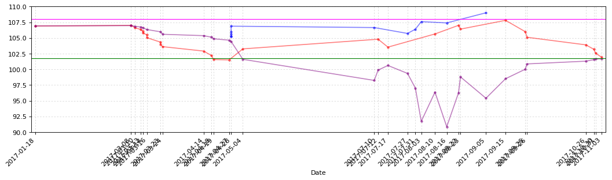


```python
CB_Transaction_Functions.CB_TD_cost_plt(lanbiao_CB_TD)
```


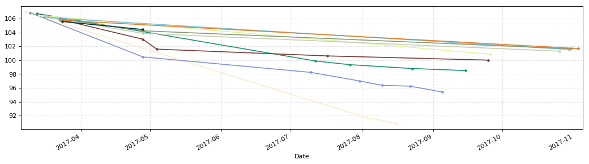


### 辉丰转债128012


```python
huifeng = u'辉丰转债'
huifeng_date = '2016-4-21'
# 2017年11月5日更新三线
y1 = 106.44
y2 = 100.00
y3 = 93.00
y4 = 112.00
```


```python
huifeng_CB_TD = CB_Transaction_Functions.CB_Transaction_Data(huifeng)
huifeng_CB_TD.sort_values(by=u'成交均价').head()
```


<div>
<table border="1" class="dataframe">
  <thead>
    <tr style="text-align: right;">
      <th></th>
      <th>发生日期</th>
      <th>业务名称</th>
      <th>证券代码</th>
      <th>证券名称</th>
      <th>成交均价</th>
      <th>成交数量</th>
      <th>成交金额</th>
      <th>股份余额</th>
      <th>手续费</th>
      <th>发生金额</th>
      <th>成本</th>
    </tr>
  </thead>
  <tbody>
    <tr>
      <th>18</th>
      <td>2017-04-20</td>
      <td>债券兑息</td>
      <td>128012</td>
      <td>辉丰转债</td>
      <td>0.000</td>
      <td>0</td>
      <td>60.00</td>
      <td>0</td>
      <td>0.00</td>
      <td>48.00</td>
      <td>inf</td>
    </tr>
    <tr>
      <th>22</th>
      <td>2017-05-31</td>
      <td>证券买入清算</td>
      <td>128012</td>
      <td>辉丰转债</td>
      <td>99.010</td>
      <td>20</td>
      <td>1980.20</td>
      <td>170</td>
      <td>0.40</td>
      <td>-1980.60</td>
      <td>102.983824</td>
    </tr>
    <tr>
      <th>21</th>
      <td>2017-05-08</td>
      <td>证券买入清算</td>
      <td>128012</td>
      <td>辉丰转债</td>
      <td>101.175</td>
      <td>10</td>
      <td>1011.75</td>
      <td>150</td>
      <td>0.20</td>
      <td>-1011.95</td>
      <td>103.511000</td>
    </tr>
    <tr>
      <th>20</th>
      <td>2017-05-05</td>
      <td>证券买入清算</td>
      <td>128012</td>
      <td>辉丰转债</td>
      <td>101.486</td>
      <td>10</td>
      <td>1014.86</td>
      <td>140</td>
      <td>0.20</td>
      <td>-1015.06</td>
      <td>103.676429</td>
    </tr>
    <tr>
      <th>23</th>
      <td>2017-06-28</td>
      <td>证券卖出清算</td>
      <td>128012</td>
      <td>辉丰转债</td>
      <td>101.880</td>
      <td>-40</td>
      <td>4075.20</td>
      <td>130</td>
      <td>0.82</td>
      <td>4074.38</td>
      <td>103.329769</td>
    </tr>
  </tbody>
</table>
</div>


```python
huifeng_CB_TD.tail(10)
```


<div>
<table border="1" class="dataframe">
  <thead>
    <tr style="text-align: right;">
      <th></th>
      <th>发生日期</th>
      <th>业务名称</th>
      <th>证券代码</th>
      <th>证券名称</th>
      <th>成交均价</th>
      <th>成交数量</th>
      <th>成交金额</th>
      <th>股份余额</th>
      <th>手续费</th>
      <th>发生金额</th>
      <th>成本</th>
    </tr>
  </thead>
  <tbody>
    <tr>
      <th>31</th>
      <td>2017-08-11</td>
      <td>证券买入清算</td>
      <td>128012</td>
      <td>辉丰转债</td>
      <td>106.123</td>
      <td>10</td>
      <td>1061.23</td>
      <td>60</td>
      <td>0.21</td>
      <td>-1061.44</td>
      <td>99.806667</td>
    </tr>
    <tr>
      <th>32</th>
      <td>2017-08-11</td>
      <td>证券买入清算</td>
      <td>128012</td>
      <td>辉丰转债</td>
      <td>105.550</td>
      <td>10</td>
      <td>1055.50</td>
      <td>70</td>
      <td>0.21</td>
      <td>-1055.71</td>
      <td>100.630143</td>
    </tr>
    <tr>
      <th>33</th>
      <td>2017-08-14</td>
      <td>证券卖出清算</td>
      <td>128012</td>
      <td>辉丰转债</td>
      <td>106.970</td>
      <td>-10</td>
      <td>1069.70</td>
      <td>60</td>
      <td>0.21</td>
      <td>1069.49</td>
      <td>99.577000</td>
    </tr>
    <tr>
      <th>34</th>
      <td>2017-08-14</td>
      <td>证券卖出清算</td>
      <td>128012</td>
      <td>辉丰转债</td>
      <td>107.800</td>
      <td>-10</td>
      <td>1078.00</td>
      <td>50</td>
      <td>0.22</td>
      <td>1077.78</td>
      <td>97.936800</td>
    </tr>
    <tr>
      <th>35</th>
      <td>2017-08-22</td>
      <td>证券买入清算</td>
      <td>128012</td>
      <td>辉丰转债</td>
      <td>106.650</td>
      <td>10</td>
      <td>1066.50</td>
      <td>60</td>
      <td>0.21</td>
      <td>-1066.71</td>
      <td>99.392500</td>
    </tr>
    <tr>
      <th>36</th>
      <td>2017-08-29</td>
      <td>证券卖出清算</td>
      <td>128012</td>
      <td>辉丰转债</td>
      <td>108.136</td>
      <td>-10</td>
      <td>1081.36</td>
      <td>50</td>
      <td>0.22</td>
      <td>1081.14</td>
      <td>97.648200</td>
    </tr>
    <tr>
      <th>37</th>
      <td>2017-09-14</td>
      <td>证券买入清算</td>
      <td>128012</td>
      <td>辉丰转债</td>
      <td>105.820</td>
      <td>10</td>
      <td>1058.20</td>
      <td>60</td>
      <td>0.21</td>
      <td>-1058.41</td>
      <td>99.013667</td>
    </tr>
    <tr>
      <th>38</th>
      <td>2017-09-14</td>
      <td>证券买入清算</td>
      <td>128012</td>
      <td>辉丰转债</td>
      <td>104.980</td>
      <td>10</td>
      <td>1049.80</td>
      <td>70</td>
      <td>0.21</td>
      <td>-1050.01</td>
      <td>99.869000</td>
    </tr>
    <tr>
      <th>39</th>
      <td>2017-09-25</td>
      <td>证券买入清算</td>
      <td>128012</td>
      <td>辉丰转债</td>
      <td>103.100</td>
      <td>10</td>
      <td>1031.00</td>
      <td>80</td>
      <td>0.21</td>
      <td>-1031.21</td>
      <td>100.275500</td>
    </tr>
    <tr>
      <th>40</th>
      <td>2017-09-27</td>
      <td>证券买入清算</td>
      <td>128012</td>
      <td>辉丰转债</td>
      <td>102.020</td>
      <td>10</td>
      <td>1020.20</td>
      <td>90</td>
      <td>0.20</td>
      <td>-1020.40</td>
      <td>100.471556</td>
    </tr>
  </tbody>
</table>
</div>


```python
huifeng_CB_TD_cost = CB_Transaction_Functions.CB_TD_cost(huifeng,huifeng_CB_TD,huifeng_date)
huifeng_CB_TD_cost.round(3)
```


<div>
<table border="1" class="dataframe">
  <thead>
    <tr style="text-align: right;">
      <th></th>
      <th>持仓金额</th>
      <th>成交数量</th>
      <th>持仓成本</th>
      <th>起息日</th>
      <th>剩余年限</th>
    </tr>
  </thead>
  <tbody>
    <tr>
      <th>辉丰转债</th>
      <td>9042.44</td>
      <td>90.0</td>
      <td>100.472</td>
      <td>2016-4-21</td>
      <td>4年164天</td>
    </tr>
  </tbody>
</table>
</div>


```python
CB_Transaction_Functions.CB_TD_plt(huifeng_CB_TD,y1,y2,y3,y4)
```


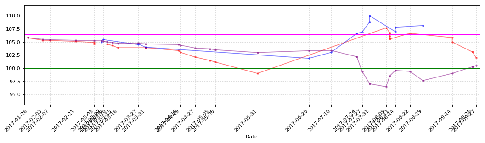


```python
CB_Transaction_Functions.CB_TD_cost_plt(huifeng_CB_TD)
```


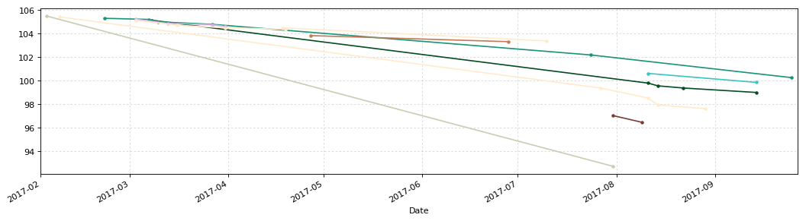


### 洪涛转债128013


```python
hongtao = u'洪涛转债'
hongtao_date = '2016-7-29'
# 2017年11月5日更新三线
y1 = 108.00
y2 = 98.00
y3 = 93.00
y4 = 110.00
```


```python
hongtao_CB_TD = CB_Transaction_Functions.CB_Transaction_Data(hongtao)
hongtao_CB_TD.sort_values(by=u'成交均价').head()
```


<div>
<table border="1" class="dataframe">
  <thead>
    <tr style="text-align: right;">
      <th></th>
      <th>发生日期</th>
      <th>业务名称</th>
      <th>证券代码</th>
      <th>证券名称</th>
      <th>成交均价</th>
      <th>成交数量</th>
      <th>成交金额</th>
      <th>股份余额</th>
      <th>手续费</th>
      <th>发生金额</th>
      <th>成本</th>
    </tr>
  </thead>
  <tbody>
    <tr>
      <th>31</th>
      <td>2017-07-28</td>
      <td>债券兑息</td>
      <td>128013</td>
      <td>洪涛转债</td>
      <td>0.000</td>
      <td>0</td>
      <td>80.00</td>
      <td>0</td>
      <td>0.0</td>
      <td>64.00</td>
      <td>inf</td>
    </tr>
    <tr>
      <th>26</th>
      <td>2017-05-31</td>
      <td>证券买入清算</td>
      <td>128013</td>
      <td>洪涛转债</td>
      <td>99.003</td>
      <td>20</td>
      <td>1980.06</td>
      <td>290</td>
      <td>0.4</td>
      <td>-1980.46</td>
      <td>104.587828</td>
    </tr>
    <tr>
      <th>40</th>
      <td>2017-11-03</td>
      <td>证券买入清算</td>
      <td>128013</td>
      <td>洪涛转债</td>
      <td>99.901</td>
      <td>20</td>
      <td>1998.02</td>
      <td>320</td>
      <td>0.4</td>
      <td>-1998.42</td>
      <td>103.437187</td>
    </tr>
    <tr>
      <th>25</th>
      <td>2017-05-16</td>
      <td>证券买入清算</td>
      <td>128013</td>
      <td>洪涛转债</td>
      <td>99.999</td>
      <td>20</td>
      <td>1999.98</td>
      <td>270</td>
      <td>0.4</td>
      <td>-2000.38</td>
      <td>105.000037</td>
    </tr>
    <tr>
      <th>39</th>
      <td>2017-10-30</td>
      <td>证券买入清算</td>
      <td>128013</td>
      <td>洪涛转债</td>
      <td>100.190</td>
      <td>10</td>
      <td>1001.90</td>
      <td>300</td>
      <td>0.2</td>
      <td>-1002.10</td>
      <td>103.671600</td>
    </tr>
  </tbody>
</table>
</div>


```python
hongtao_CB_TD.tail(10)
```


<div>
<table border="1" class="dataframe">
  <thead>
    <tr style="text-align: right;">
      <th></th>
      <th>发生日期</th>
      <th>业务名称</th>
      <th>证券代码</th>
      <th>证券名称</th>
      <th>成交均价</th>
      <th>成交数量</th>
      <th>成交金额</th>
      <th>股份余额</th>
      <th>手续费</th>
      <th>发生金额</th>
      <th>成本</th>
    </tr>
  </thead>
  <tbody>
    <tr>
      <th>31</th>
      <td>2017-07-28</td>
      <td>债券兑息</td>
      <td>128013</td>
      <td>洪涛转债</td>
      <td>0.000</td>
      <td>0</td>
      <td>80.00</td>
      <td>0</td>
      <td>0.00</td>
      <td>64.00</td>
      <td>inf</td>
    </tr>
    <tr>
      <th>32</th>
      <td>2017-08-03</td>
      <td>证券卖出清算</td>
      <td>128013</td>
      <td>洪涛转债</td>
      <td>105.510</td>
      <td>-20</td>
      <td>2110.20</td>
      <td>180</td>
      <td>0.42</td>
      <td>2109.78</td>
      <td>104.585056</td>
    </tr>
    <tr>
      <th>33</th>
      <td>2017-08-18</td>
      <td>证券买入清算</td>
      <td>128013</td>
      <td>洪涛转债</td>
      <td>104.007</td>
      <td>20</td>
      <td>2080.14</td>
      <td>200</td>
      <td>0.42</td>
      <td>-2080.56</td>
      <td>104.529350</td>
    </tr>
    <tr>
      <th>34</th>
      <td>2017-08-25</td>
      <td>证券买入清算</td>
      <td>128013</td>
      <td>洪涛转债</td>
      <td>103.233</td>
      <td>20</td>
      <td>2064.66</td>
      <td>220</td>
      <td>0.41</td>
      <td>-2065.07</td>
      <td>104.413364</td>
    </tr>
    <tr>
      <th>35</th>
      <td>2017-09-14</td>
      <td>证券买入清算</td>
      <td>128013</td>
      <td>洪涛转债</td>
      <td>102.820</td>
      <td>20</td>
      <td>2056.40</td>
      <td>240</td>
      <td>0.41</td>
      <td>-2056.81</td>
      <td>104.282292</td>
    </tr>
    <tr>
      <th>36</th>
      <td>2017-09-25</td>
      <td>证券买入清算</td>
      <td>128013</td>
      <td>洪涛转债</td>
      <td>101.980</td>
      <td>20</td>
      <td>2039.60</td>
      <td>260</td>
      <td>0.41</td>
      <td>-2040.01</td>
      <td>104.106769</td>
    </tr>
    <tr>
      <th>37</th>
      <td>2017-09-26</td>
      <td>证券买入清算</td>
      <td>128013</td>
      <td>洪涛转债</td>
      <td>101.161</td>
      <td>20</td>
      <td>2023.22</td>
      <td>280</td>
      <td>0.40</td>
      <td>-2023.62</td>
      <td>103.897786</td>
    </tr>
    <tr>
      <th>38</th>
      <td>2017-10-27</td>
      <td>证券买入清算</td>
      <td>128013</td>
      <td>洪涛转债</td>
      <td>100.780</td>
      <td>10</td>
      <td>1007.80</td>
      <td>290</td>
      <td>0.20</td>
      <td>-1008.00</td>
      <td>103.790966</td>
    </tr>
    <tr>
      <th>39</th>
      <td>2017-10-30</td>
      <td>证券买入清算</td>
      <td>128013</td>
      <td>洪涛转债</td>
      <td>100.190</td>
      <td>10</td>
      <td>1001.90</td>
      <td>300</td>
      <td>0.20</td>
      <td>-1002.10</td>
      <td>103.671600</td>
    </tr>
    <tr>
      <th>40</th>
      <td>2017-11-03</td>
      <td>证券买入清算</td>
      <td>128013</td>
      <td>洪涛转债</td>
      <td>99.901</td>
      <td>20</td>
      <td>1998.02</td>
      <td>320</td>
      <td>0.40</td>
      <td>-1998.42</td>
      <td>103.437187</td>
    </tr>
  </tbody>
</table>
</div>


```python
hongtao_CB_TD_cost = CB_Transaction_Functions.CB_TD_cost(hongtao,hongtao_CB_TD,hongtao_date)
hongtao_CB_TD_cost.round(3)
```


<div>
<table border="1" class="dataframe">
  <thead>
    <tr style="text-align: right;">
      <th></th>
      <th>持仓金额</th>
      <th>成交数量</th>
      <th>持仓成本</th>
      <th>起息日</th>
      <th>剩余年限</th>
    </tr>
  </thead>
  <tbody>
    <tr>
      <th>洪涛转债</th>
      <td>33099.9</td>
      <td>320.0</td>
      <td>103.437</td>
      <td>2016-7-29</td>
      <td>4年263天</td>
    </tr>
  </tbody>
</table>
</div>


```python
CB_Transaction_Functions.CB_TD_plt(hongtao_CB_TD,y1,y2,y3,y4)
```


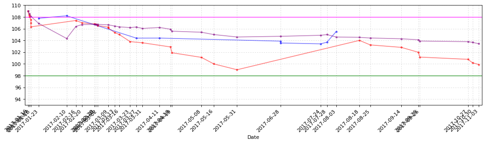


```python
CB_Transaction_Functions.CB_TD_cost_plt(hongtao_CB_TD)
```


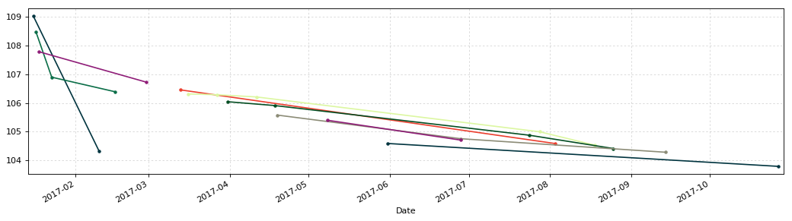


### 航信转债110031


```python
hangxin = u'航信转债'
hangxin_date = '2015-6-12'
# 2017年11月5日更新三线
y1 = 107.00
y2 = 100.00
y3 = 95.00
y4 = 108.00
```


```python
hangxin_CB_TD = CB_Transaction_Functions.CB_Transaction_Data(hangxin)
hangxin_CB_TD.sort_values(by=u'成交均价').head()
```


<div>
<table border="1" class="dataframe">
  <thead>
    <tr style="text-align: right;">
      <th></th>
      <th>发生日期</th>
      <th>业务名称</th>
      <th>证券代码</th>
      <th>证券名称</th>
      <th>成交均价</th>
      <th>成交数量</th>
      <th>成交金额</th>
      <th>股份余额</th>
      <th>手续费</th>
      <th>发生金额</th>
      <th>成本</th>
    </tr>
  </thead>
  <tbody>
    <tr>
      <th>17</th>
      <td>2017-06-16</td>
      <td>债券兑息</td>
      <td>110031</td>
      <td>航信转债</td>
      <td>0.00</td>
      <td>0</td>
      <td>60.0</td>
      <td>120</td>
      <td>0.0</td>
      <td>48.0</td>
      <td>104.023333</td>
    </tr>
    <tr>
      <th>16</th>
      <td>2017-05-16</td>
      <td>证券买入清算</td>
      <td>110031</td>
      <td>航信转债</td>
      <td>99.98</td>
      <td>20</td>
      <td>1999.6</td>
      <td>120</td>
      <td>1.0</td>
      <td>-2000.6</td>
      <td>104.423333</td>
    </tr>
    <tr>
      <th>15</th>
      <td>2017-04-24</td>
      <td>证券买入清算</td>
      <td>110031</td>
      <td>航信转债</td>
      <td>102.95</td>
      <td>10</td>
      <td>1029.5</td>
      <td>100</td>
      <td>1.0</td>
      <td>-1030.5</td>
      <td>105.302000</td>
    </tr>
    <tr>
      <th>14</th>
      <td>2017-04-19</td>
      <td>证券买入清算</td>
      <td>110031</td>
      <td>航信转债</td>
      <td>103.61</td>
      <td>20</td>
      <td>2072.2</td>
      <td>90</td>
      <td>1.0</td>
      <td>-2073.2</td>
      <td>105.552222</td>
    </tr>
    <tr>
      <th>20</th>
      <td>2017-09-26</td>
      <td>证券买入清算</td>
      <td>110031</td>
      <td>航信转债</td>
      <td>103.72</td>
      <td>20</td>
      <td>2074.4</td>
      <td>40</td>
      <td>1.0</td>
      <td>-2075.4</td>
      <td>103.476500</td>
    </tr>
  </tbody>
</table>
</div>


```python
hangxin_CB_TD.tail()
```


<div>
<table border="1" class="dataframe">
  <thead>
    <tr style="text-align: right;">
      <th></th>
      <th>发生日期</th>
      <th>业务名称</th>
      <th>证券代码</th>
      <th>证券名称</th>
      <th>成交均价</th>
      <th>成交数量</th>
      <th>成交金额</th>
      <th>股份余额</th>
      <th>手续费</th>
      <th>发生金额</th>
      <th>成本</th>
    </tr>
  </thead>
  <tbody>
    <tr>
      <th>16</th>
      <td>2017-05-16</td>
      <td>证券买入清算</td>
      <td>110031</td>
      <td>航信转债</td>
      <td>99.98</td>
      <td>20</td>
      <td>1999.6</td>
      <td>120</td>
      <td>1.00</td>
      <td>-2000.60</td>
      <td>104.423333</td>
    </tr>
    <tr>
      <th>17</th>
      <td>2017-06-16</td>
      <td>债券兑息</td>
      <td>110031</td>
      <td>航信转债</td>
      <td>0.00</td>
      <td>0</td>
      <td>60.0</td>
      <td>120</td>
      <td>0.00</td>
      <td>48.00</td>
      <td>104.023333</td>
    </tr>
    <tr>
      <th>18</th>
      <td>2017-06-28</td>
      <td>证券卖出清算</td>
      <td>110031</td>
      <td>航信转债</td>
      <td>104.09</td>
      <td>-70</td>
      <td>7286.3</td>
      <td>50</td>
      <td>1.46</td>
      <td>7284.84</td>
      <td>103.959200</td>
    </tr>
    <tr>
      <th>19</th>
      <td>2017-07-24</td>
      <td>证券卖出清算</td>
      <td>110031</td>
      <td>航信转债</td>
      <td>104.51</td>
      <td>-30</td>
      <td>3135.3</td>
      <td>20</td>
      <td>1.00</td>
      <td>3134.30</td>
      <td>103.183000</td>
    </tr>
    <tr>
      <th>20</th>
      <td>2017-09-26</td>
      <td>证券买入清算</td>
      <td>110031</td>
      <td>航信转债</td>
      <td>103.72</td>
      <td>20</td>
      <td>2074.4</td>
      <td>40</td>
      <td>1.00</td>
      <td>-2075.40</td>
      <td>103.476500</td>
    </tr>
  </tbody>
</table>
</div>


```python
hangxin_CB_TD_cost = CB_Transaction_Functions.CB_TD_cost(hangxin,hangxin_CB_TD,hangxin_date)
hangxin_CB_TD_cost.round(3)
```


<div>
<table border="1" class="dataframe">
  <thead>
    <tr style="text-align: right;">
      <th></th>
      <th>持仓金额</th>
      <th>成交数量</th>
      <th>持仓成本</th>
      <th>起息日</th>
      <th>剩余年限</th>
    </tr>
  </thead>
  <tbody>
    <tr>
      <th>航信转债</th>
      <td>4139.06</td>
      <td>40.0</td>
      <td>103.476</td>
      <td>2015-6-12</td>
      <td>3年215天</td>
    </tr>
  </tbody>
</table>
</div>


```python
CB_Transaction_Functions.CB_TD_plt(hangxin_CB_TD,y1,y2,y3,y4)
```


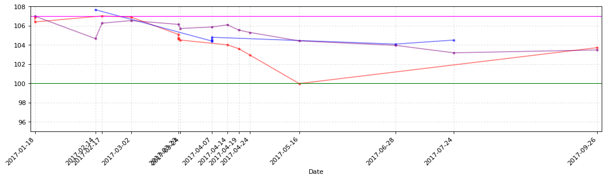


```python
CB_Transaction_Functions.CB_TD_cost_plt(hangxin_CB_TD)
```


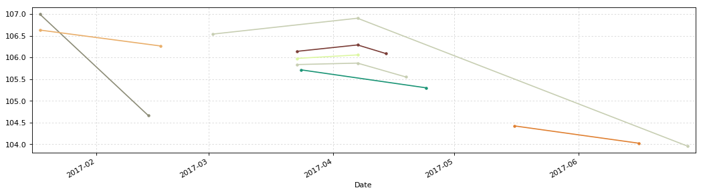


### 海印转债127003


```python
haiyin = u'海印转债'
haiyin_date = '2016-6-8'
# 2017年11月5日更新三线
y1 = 104.36
y2 = 96.30
y3 = 92.00
y4 = 108.00
```


```python
haiyin_CB_TD = CB_Transaction_Functions.CB_Transaction_Data(haiyin)
haiyin_CB_TD.sort_values(by=u'成交均价').head()
```


<div>
<table border="1" class="dataframe">
  <thead>
    <tr style="text-align: right;">
      <th></th>
      <th>发生日期</th>
      <th>业务名称</th>
      <th>证券代码</th>
      <th>证券名称</th>
      <th>成交均价</th>
      <th>成交数量</th>
      <th>成交金额</th>
      <th>股份余额</th>
      <th>手续费</th>
      <th>发生金额</th>
      <th>成本</th>
    </tr>
  </thead>
  <tbody>
    <tr>
      <th>18</th>
      <td>2017-11-02</td>
      <td>证券买入清算</td>
      <td>127003</td>
      <td>海印转债</td>
      <td>99.983</td>
      <td>10</td>
      <td>999.83</td>
      <td>110</td>
      <td>0.2</td>
      <td>-1000.03</td>
      <td>101.643545</td>
    </tr>
    <tr>
      <th>6</th>
      <td>2017-05-16</td>
      <td>证券买入清算</td>
      <td>127003</td>
      <td>海印转债</td>
      <td>100.000</td>
      <td>20</td>
      <td>2000.00</td>
      <td>80</td>
      <td>0.4</td>
      <td>-2000.40</td>
      <td>103.354625</td>
    </tr>
    <tr>
      <th>17</th>
      <td>2017-10-31</td>
      <td>证券买入清算</td>
      <td>127003</td>
      <td>海印转债</td>
      <td>100.020</td>
      <td>10</td>
      <td>1000.20</td>
      <td>100</td>
      <td>0.2</td>
      <td>-1000.40</td>
      <td>101.807600</td>
    </tr>
    <tr>
      <th>16</th>
      <td>2017-10-30</td>
      <td>证券买入清算</td>
      <td>127003</td>
      <td>海印转债</td>
      <td>100.422</td>
      <td>10</td>
      <td>1004.22</td>
      <td>90</td>
      <td>0.2</td>
      <td>-1004.42</td>
      <td>102.004000</td>
    </tr>
    <tr>
      <th>15</th>
      <td>2017-10-27</td>
      <td>证券买入清算</td>
      <td>127003</td>
      <td>海印转债</td>
      <td>100.780</td>
      <td>10</td>
      <td>1007.80</td>
      <td>80</td>
      <td>0.2</td>
      <td>-1008.00</td>
      <td>102.199250</td>
    </tr>
  </tbody>
</table>
</div>


```python
haiyin_CB_TD.tail()
```


<div>
<table border="1" class="dataframe">
  <thead>
    <tr style="text-align: right;">
      <th></th>
      <th>发生日期</th>
      <th>业务名称</th>
      <th>证券代码</th>
      <th>证券名称</th>
      <th>成交均价</th>
      <th>成交数量</th>
      <th>成交金额</th>
      <th>股份余额</th>
      <th>手续费</th>
      <th>发生金额</th>
      <th>成本</th>
    </tr>
  </thead>
  <tbody>
    <tr>
      <th>14</th>
      <td>2017-10-26</td>
      <td>证券买入清算</td>
      <td>127003</td>
      <td>海印转债</td>
      <td>100.940</td>
      <td>10</td>
      <td>1009.40</td>
      <td>70</td>
      <td>0.2</td>
      <td>-1009.60</td>
      <td>102.399143</td>
    </tr>
    <tr>
      <th>15</th>
      <td>2017-10-27</td>
      <td>证券买入清算</td>
      <td>127003</td>
      <td>海印转债</td>
      <td>100.780</td>
      <td>10</td>
      <td>1007.80</td>
      <td>80</td>
      <td>0.2</td>
      <td>-1008.00</td>
      <td>102.199250</td>
    </tr>
    <tr>
      <th>16</th>
      <td>2017-10-30</td>
      <td>证券买入清算</td>
      <td>127003</td>
      <td>海印转债</td>
      <td>100.422</td>
      <td>10</td>
      <td>1004.22</td>
      <td>90</td>
      <td>0.2</td>
      <td>-1004.42</td>
      <td>102.004000</td>
    </tr>
    <tr>
      <th>17</th>
      <td>2017-10-31</td>
      <td>证券买入清算</td>
      <td>127003</td>
      <td>海印转债</td>
      <td>100.020</td>
      <td>10</td>
      <td>1000.20</td>
      <td>100</td>
      <td>0.2</td>
      <td>-1000.40</td>
      <td>101.807600</td>
    </tr>
    <tr>
      <th>18</th>
      <td>2017-11-02</td>
      <td>证券买入清算</td>
      <td>127003</td>
      <td>海印转债</td>
      <td>99.983</td>
      <td>10</td>
      <td>999.83</td>
      <td>110</td>
      <td>0.2</td>
      <td>-1000.03</td>
      <td>101.643545</td>
    </tr>
  </tbody>
</table>
</div>


```python
haiyin_CB_TD_cost = CB_Transaction_Functions.CB_TD_cost(haiyin,haiyin_CB_TD,haiyin_date)
haiyin_CB_TD_cost.round(3)
```


<div>
<table border="1" class="dataframe">
  <thead>
    <tr style="text-align: right;">
      <th></th>
      <th>持仓金额</th>
      <th>成交数量</th>
      <th>持仓成本</th>
      <th>起息日</th>
      <th>剩余年限</th>
    </tr>
  </thead>
  <tbody>
    <tr>
      <th>海印转债</th>
      <td>11180.79</td>
      <td>110.0</td>
      <td>101.644</td>
      <td>2016-6-8</td>
      <td>4年211天</td>
    </tr>
  </tbody>
</table>
</div>


```python
CB_Transaction_Functions.CB_TD_plt(haiyin_CB_TD,y1,y2,y3,y4)
```


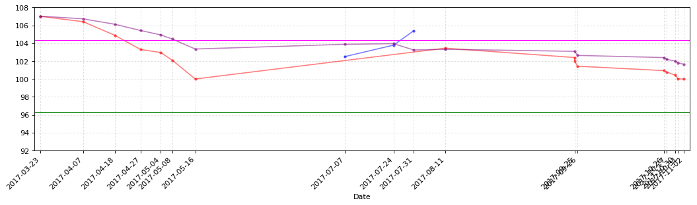


```python
CB_Transaction_Functions.CB_TD_cost_plt(haiyin_CB_TD)
```


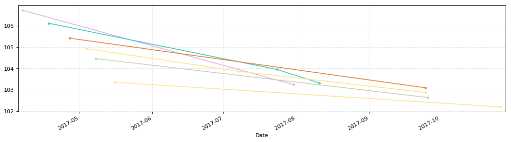


### 光大转债113011


```python
guangda = u'光大转债'
guangda_date = '2017-3-17'
# 2017年11月5日更新三线
y1 = 100.00
y2 = 93.88
y3 = 80.00
y4 = 112.00
```


```python
guangda_CB_TD = CB_Transaction_Functions.CB_Transaction_Data(guangda)
guangda_CB_TD
```


<div>
<table border="1" class="dataframe">
  <thead>
    <tr style="text-align: right;">
      <th></th>
      <th>发生日期</th>
      <th>业务名称</th>
      <th>证券代码</th>
      <th>证券名称</th>
      <th>成交均价</th>
      <th>成交数量</th>
      <th>成交金额</th>
      <th>股份余额</th>
      <th>手续费</th>
      <th>发生金额</th>
      <th>成本</th>
    </tr>
  </thead>
  <tbody>
    <tr>
      <th>0</th>
      <td>2017-03-16</td>
      <td>配股权证到帐</td>
      <td>764818</td>
      <td>光大转债</td>
      <td>100.00</td>
      <td>10</td>
      <td>1000.0</td>
      <td>10</td>
      <td>0.0</td>
      <td>-1000.0</td>
      <td>100.000000</td>
    </tr>
    <tr>
      <th>1</th>
      <td>2017-04-19</td>
      <td>证券买入清算</td>
      <td>113011</td>
      <td>光大转债</td>
      <td>101.25</td>
      <td>10</td>
      <td>1012.5</td>
      <td>20</td>
      <td>1.0</td>
      <td>-1013.5</td>
      <td>100.675000</td>
    </tr>
    <tr>
      <th>2</th>
      <td>2017-05-08</td>
      <td>证券买入清算</td>
      <td>113011</td>
      <td>光大转债</td>
      <td>100.11</td>
      <td>10</td>
      <td>1001.1</td>
      <td>30</td>
      <td>1.0</td>
      <td>-1002.1</td>
      <td>100.520000</td>
    </tr>
    <tr>
      <th>3</th>
      <td>2017-05-08</td>
      <td>证券买入清算</td>
      <td>113011</td>
      <td>光大转债</td>
      <td>99.90</td>
      <td>10</td>
      <td>999.0</td>
      <td>40</td>
      <td>1.0</td>
      <td>-1000.0</td>
      <td>100.390000</td>
    </tr>
    <tr>
      <th>4</th>
      <td>2017-06-28</td>
      <td>证券卖出清算</td>
      <td>113011</td>
      <td>光大转债</td>
      <td>106.01</td>
      <td>-20</td>
      <td>2120.2</td>
      <td>20</td>
      <td>1.0</td>
      <td>2119.2</td>
      <td>94.820000</td>
    </tr>
    <tr>
      <th>5</th>
      <td>2017-07-13</td>
      <td>证券卖出清算</td>
      <td>113011</td>
      <td>光大转债</td>
      <td>107.22</td>
      <td>-10</td>
      <td>1072.2</td>
      <td>10</td>
      <td>1.0</td>
      <td>1071.2</td>
      <td>82.520000</td>
    </tr>
    <tr>
      <th>6</th>
      <td>2017-07-17</td>
      <td>证券卖出清算</td>
      <td>113011</td>
      <td>光大转债</td>
      <td>110.95</td>
      <td>-10</td>
      <td>1109.5</td>
      <td>0</td>
      <td>1.0</td>
      <td>1108.5</td>
      <td>-inf</td>
    </tr>
  </tbody>
</table>
</div>


```python
guangda_CB_TD_cost = CB_Transaction_Functions.CB_TD_cost(guangda,guangda_CB_TD,guangda_date)
guangda_CB_TD_cost.round(3)
```


<div>
<table border="1" class="dataframe">
  <thead>
    <tr style="text-align: right;">
      <th></th>
      <th>持仓金额</th>
      <th>成交数量</th>
      <th>持仓成本</th>
      <th>起息日</th>
      <th>剩余年限</th>
    </tr>
  </thead>
  <tbody>
    <tr>
      <th>光大转债</th>
      <td>-283.3</td>
      <td>0.0</td>
      <td>0</td>
      <td>2017-3-17</td>
      <td>5年128天</td>
    </tr>
  </tbody>
</table>
</div>


```python
CB_Transaction_Functions.CB_TD_plt(guangda_CB_TD,y1,y2,y3,y4)
```


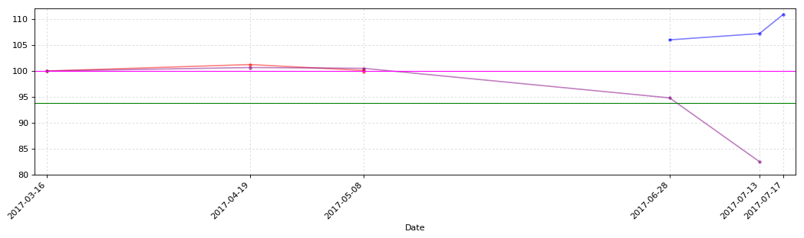


```python
CB_Transaction_Functions.CB_TD_cost_plt(guangda_CB_TD)
```


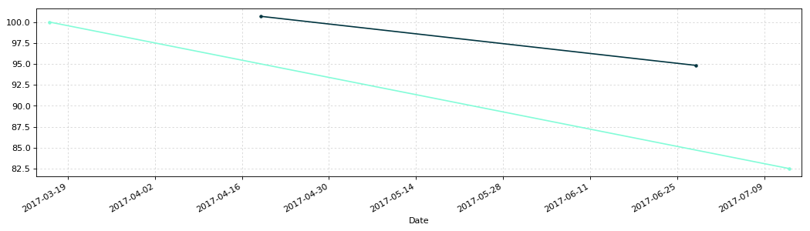


### 模塑转债127004


```python
mosu = u'模塑转债'
mosu_date = '2017-6-2'
# 2017年11月5日更新三线
y1 = 110.00
y2 = 101.80
y3 = 90.00
y4 = 120.00
```


```python
mosu_CB_TD = CB_Transaction_Functions.CB_Transaction_Data(mosu)
mosu_CB_TD
```


<div>
<table border="1" class="dataframe">
  <thead>
    <tr style="text-align: right;">
      <th></th>
      <th>发生日期</th>
      <th>业务名称</th>
      <th>证券代码</th>
      <th>证券名称</th>
      <th>成交均价</th>
      <th>成交数量</th>
      <th>成交金额</th>
      <th>股份余额</th>
      <th>手续费</th>
      <th>发生金额</th>
      <th>成本</th>
    </tr>
  </thead>
  <tbody>
    <tr>
      <th>0</th>
      <td>2017-10-30</td>
      <td>证券买入清算</td>
      <td>127004</td>
      <td>模塑转债</td>
      <td>106.201</td>
      <td>10</td>
      <td>1062.01</td>
      <td>10</td>
      <td>0.21</td>
      <td>-1062.22</td>
      <td>106.222000</td>
    </tr>
    <tr>
      <th>1</th>
      <td>2017-10-31</td>
      <td>证券买入清算</td>
      <td>127004</td>
      <td>模塑转债</td>
      <td>105.861</td>
      <td>10</td>
      <td>1058.61</td>
      <td>20</td>
      <td>0.21</td>
      <td>-1058.82</td>
      <td>106.052000</td>
    </tr>
    <tr>
      <th>2</th>
      <td>2017-11-02</td>
      <td>证券买入清算</td>
      <td>127004</td>
      <td>模塑转债</td>
      <td>105.015</td>
      <td>10</td>
      <td>1050.15</td>
      <td>30</td>
      <td>0.21</td>
      <td>-1050.36</td>
      <td>105.713333</td>
    </tr>
    <tr>
      <th>3</th>
      <td>2017-11-03</td>
      <td>证券买入清算</td>
      <td>127004</td>
      <td>模塑转债</td>
      <td>104.301</td>
      <td>10</td>
      <td>1043.01</td>
      <td>40</td>
      <td>0.21</td>
      <td>-1043.22</td>
      <td>105.365500</td>
    </tr>
    <tr>
      <th>4</th>
      <td>2017-11-06</td>
      <td>证券买入清算</td>
      <td>127004</td>
      <td>模塑转债</td>
      <td>103.467</td>
      <td>10</td>
      <td>1034.67</td>
      <td>50</td>
      <td>0.21</td>
      <td>-1034.88</td>
      <td>104.990000</td>
    </tr>
    <tr>
      <th>5</th>
      <td>2017-11-07</td>
      <td>证券买入清算</td>
      <td>127004</td>
      <td>模塑转债</td>
      <td>101.920</td>
      <td>20</td>
      <td>2038.40</td>
      <td>70</td>
      <td>0.41</td>
      <td>-2038.81</td>
      <td>104.118714</td>
    </tr>
  </tbody>
</table>
</div>


```python
mosu_CB_TD_cost = CB_Transaction_Functions.CB_TD_cost(mosu,mosu_CB_TD,mosu_date)
mosu_CB_TD_cost.round(3)
```


<div>
<table border="1" class="dataframe">
  <thead>
    <tr style="text-align: right;">
      <th></th>
      <th>持仓金额</th>
      <th>成交数量</th>
      <th>持仓成本</th>
      <th>起息日</th>
      <th>剩余年限</th>
    </tr>
  </thead>
  <tbody>
    <tr>
      <th>模塑转债</th>
      <td>7288.31</td>
      <td>70.0</td>
      <td>104.119</td>
      <td>2017-6-2</td>
      <td>5年206天</td>
    </tr>
  </tbody>
</table>
</div>


```python
# CB_Transaction_Functions.CB_TD_plt(mosu_CB_TD,y1,y2,y3,y4)
```


```python
# CB_Transaction_Functions.CB_TD_cost_plt(mosu_CB_TD)
```

### 江南转债113010


```python
jiangnan = u'江南转债'
jiangnan_date = '2016-3-18'
# 2017年11月5日更新三线
y1 = 110.00
y2 = 103.00
y3 = 95.00
y4 = 110.00
```


```python
jiangnan_CB_TD = CB_Transaction_Functions.CB_Transaction_Data(jiangnan)
jiangnan_CB_TD
```


<div>
<table border="1" class="dataframe">
  <thead>
    <tr style="text-align: right;">
      <th></th>
      <th>发生日期</th>
      <th>业务名称</th>
      <th>证券代码</th>
      <th>证券名称</th>
      <th>成交均价</th>
      <th>成交数量</th>
      <th>成交金额</th>
      <th>股份余额</th>
      <th>手续费</th>
      <th>发生金额</th>
      <th>成本</th>
    </tr>
  </thead>
  <tbody>
    <tr>
      <th>0</th>
      <td>2017-10-26</td>
      <td>证券买入清算</td>
      <td>113010</td>
      <td>江南转债</td>
      <td>105.46</td>
      <td>10</td>
      <td>1054.6</td>
      <td>10</td>
      <td>1.0</td>
      <td>-1055.6</td>
      <td>105.560</td>
    </tr>
    <tr>
      <th>1</th>
      <td>2017-10-30</td>
      <td>证券买入清算</td>
      <td>113010</td>
      <td>江南转债</td>
      <td>104.75</td>
      <td>10</td>
      <td>1047.5</td>
      <td>20</td>
      <td>1.0</td>
      <td>-1048.5</td>
      <td>105.205</td>
    </tr>
  </tbody>
</table>
</div>


```python
jiangnan_CB_TD_cost = CB_Transaction_Functions.CB_TD_cost(jiangnan,jiangnan_CB_TD,jiangnan_date)
jiangnan_CB_TD_cost.round(3)
```


<div>
<table border="1" class="dataframe">
  <thead>
    <tr style="text-align: right;">
      <th></th>
      <th>持仓金额</th>
      <th>成交数量</th>
      <th>持仓成本</th>
      <th>起息日</th>
      <th>剩余年限</th>
    </tr>
  </thead>
  <tbody>
    <tr>
      <th>江南转债</th>
      <td>2104.1</td>
      <td>20.0</td>
      <td>105.205</td>
      <td>2016-3-18</td>
      <td>4年130天</td>
    </tr>
  </tbody>
</table>
</div>


```python
# CB_Transaction_Functions.CB_TD_plt(jiangnan_CB_TD,y1,y2,y3,y4)
```


```python
# CB_Transaction_Functions.CB_TD_cost_plt(jiangnan_CB_TD)
```

### 电气转债113008


```python
dianqi = u'电气转债'
dianqi_date = '2015-02-02'
y1 = 109.80
y2 = 100.00
y3 = 95.00
y4 = 110.00
```


```python
dianqi_CB_TD = CB_Transaction_Functions.CB_Transaction_Data(dianqi)
dianqi_CB_TD
```


<div>
<table border="1" class="dataframe">
  <thead>
    <tr style="text-align: right;">
      <th></th>
      <th>发生日期</th>
      <th>业务名称</th>
      <th>证券代码</th>
      <th>证券名称</th>
      <th>成交均价</th>
      <th>成交数量</th>
      <th>成交金额</th>
      <th>股份余额</th>
      <th>手续费</th>
      <th>发生金额</th>
      <th>成本</th>
    </tr>
  </thead>
  <tbody>
    <tr>
      <th>0</th>
      <td>2017-11-03</td>
      <td>证券买入清算</td>
      <td>113008</td>
      <td>电气转债</td>
      <td>105.69</td>
      <td>10</td>
      <td>1056.9</td>
      <td>10</td>
      <td>1.0</td>
      <td>-1057.9</td>
      <td>105.79</td>
    </tr>
  </tbody>
</table>
</div>


```python
dianqi_CB_TD_cost = CB_Transaction_Functions.CB_TD_cost(dianqi,dianqi_CB_TD,dianqi_date)
dianqi_CB_TD_cost.round(3)
```


<div>
<table border="1" class="dataframe">
  <thead>
    <tr style="text-align: right;">
      <th></th>
      <th>持仓金额</th>
      <th>成交数量</th>
      <th>持仓成本</th>
      <th>起息日</th>
      <th>剩余年限</th>
    </tr>
  </thead>
  <tbody>
    <tr>
      <th>电气转债</th>
      <td>1057.9</td>
      <td>10.0</td>
      <td>105.79</td>
      <td>2015-02-02</td>
      <td>3年85天</td>
    </tr>
  </tbody>
</table>
</div>


```python
# CB_Transaction_Functions.CB_TD_plt(dianqi_CB_TD,y1,y2,y3,y4)
```


```python
# CB_Transaction_Functions.CB_TD_cost_plt(dianqi_CB_TD)
```


```python
CB_Transaction_Data_Cost_T = pd.concat([lanbiao_CB_TD_cost.T,huifeng_CB_TD_cost.T,hongtao_CB_TD_cost.T,hangxin_CB_TD_cost.T,
                                        haiyin_CB_TD_cost.T,mosu_CB_TD_cost.T,jiangnan_CB_TD_cost.T], axis=1)
CB_Transaction_Data_Cost = CB_Transaction_Data_Cost_T.T
CB_Transaction_Data_Cost[u'总成本'] = CB_Transaction_Data_Cost[u'成交数量']*CB_Transaction_Data_Cost[u'持仓成本']
```


```python
plt.figure(3,figsize=(10,6), dpi=80)
ax3 = plt.subplot(111)
```


```python
Yahei = matplotlib.font_manager.FontProperties(fname='C:\Windows\Fonts\msyh.ttf')
k = len(CB_Transaction_Data_Cost)
x_ticks_num = np.arange(0,k)
x_ticks_name = CB_Transaction_Data_Cost.index
y_ticks_values = CB_Transaction_Data_Cost[u'持仓成本'].values
y_ticks_num = CB_Transaction_Data_Cost[u'成交数量'].values
total_width = 0.7
num_bar = 2
w = total_width/num_bar
x_ticks_b = x_ticks_num - (total_width - w)/2
af = 0.8
x_ticks_num
```


    array([0, 1, 2, 3, 4, 5, 6])


```python
ax3.bar(x_ticks_num+w, y_ticks_values, facecolor='orange', width=w, label=u'持仓成本', alpha=af)
plt.axhline(y=100, color='red', linewidth='1.0')
plt.legend(prop={'family':'Microsoft YaHei','size':12}, loc=(0.02,0.9))
plt.ylim(90,110,1)
plt.xticks(x_ticks_num+1.5*w, x_ticks_name, fontproperties=Yahei)
plt.grid(linestyle=':', alpha=0.5)
```


```python
ax4 = ax3.twinx()
ax4.bar(x_ticks_num+2.1*w, y_ticks_num, facecolor='FireBrick', width=w, label=u'持仓数量', alpha=af)
plt.legend(prop={'family':'Microsoft YaHei','size':12}, loc=(0.02,0.8))
plt.ylim(0,350,1)
```


    (0, 350)


```python
for a,b in zip(x_ticks_num,y_ticks_values):
    ax3.text(a+w, b+0.2, '%.3f' % b, ha='center', va= 'bottom')
```


```python
for c,d in zip(x_ticks_num,y_ticks_num):
    ax4.text(c+2.1*w, d+1, '%.0f' % d, ha='center', va= 'bottom')
```


```python
CB_Transaction_Data_Cost.round(3)
```


<div>
<table border="1" class="dataframe">
  <thead>
    <tr style="text-align: right;">
      <th></th>
      <th>持仓金额</th>
      <th>成交数量</th>
      <th>持仓成本</th>
      <th>起息日</th>
      <th>剩余年限</th>
      <th>总成本</th>
    </tr>
  </thead>
  <tbody>
    <tr>
      <th>蓝标转债</th>
      <td>10168.7</td>
      <td>100</td>
      <td>101.687</td>
      <td>2015-12-18</td>
      <td>4年38天</td>
      <td>10168.7</td>
    </tr>
    <tr>
      <th>辉丰转债</th>
      <td>9042.44</td>
      <td>90</td>
      <td>100.472</td>
      <td>2016-4-21</td>
      <td>4年164天</td>
      <td>9042.44</td>
    </tr>
    <tr>
      <th>洪涛转债</th>
      <td>33099.9</td>
      <td>320</td>
      <td>103.437</td>
      <td>2016-7-29</td>
      <td>4年263天</td>
      <td>33099.9</td>
    </tr>
    <tr>
      <th>航信转债</th>
      <td>4139.06</td>
      <td>40</td>
      <td>103.476</td>
      <td>2015-6-12</td>
      <td>3年215天</td>
      <td>4139.06</td>
    </tr>
    <tr>
      <th>海印转债</th>
      <td>11180.8</td>
      <td>110</td>
      <td>101.644</td>
      <td>2016-6-8</td>
      <td>4年211天</td>
      <td>11180.8</td>
    </tr>
    <tr>
      <th>模塑转债</th>
      <td>7288.31</td>
      <td>70</td>
      <td>104.119</td>
      <td>2017-6-2</td>
      <td>5年206天</td>
      <td>7288.31</td>
    </tr>
    <tr>
      <th>江南转债</th>
      <td>2104.1</td>
      <td>20</td>
      <td>105.205</td>
      <td>2016-3-18</td>
      <td>4年130天</td>
      <td>2104.1</td>
    </tr>
  </tbody>
</table>
</div>


```python
plt.savefig('D:/Python/iPython/CB/CB_TD.png', dpi=600)
```


```python
plt.show()
```


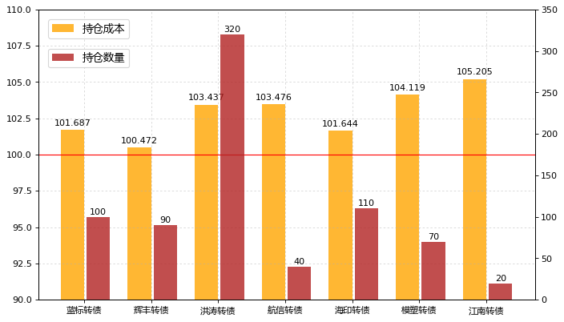


```python
ALL_Cost = CB_Transaction_Data_Cost.loc[:,[u'总成本']]
ALL_Cost.loc[u'合计'] = ALL_Cost.apply(lambda x: x.sum())
ALL_Cost
```


<div>
<table border="1" class="dataframe">
  <thead>
    <tr style="text-align: right;">
      <th></th>
      <th>总成本</th>
    </tr>
  </thead>
  <tbody>
    <tr>
      <th>蓝标转债</th>
      <td>10168.7</td>
    </tr>
    <tr>
      <th>辉丰转债</th>
      <td>9042.44</td>
    </tr>
    <tr>
      <th>洪涛转债</th>
      <td>33099.9</td>
    </tr>
    <tr>
      <th>航信转债</th>
      <td>4139.06</td>
    </tr>
    <tr>
      <th>海印转债</th>
      <td>11180.8</td>
    </tr>
    <tr>
      <th>模塑转债</th>
      <td>7288.31</td>
    </tr>
    <tr>
      <th>江南转债</th>
      <td>2104.1</td>
    </tr>
    <tr>
      <th>合计</th>
      <td>77023.3</td>
    </tr>
  </tbody>
</table>
</div>


```python
CB_TD_lanbiao_last = lanbiao_CB_TD.tail(2).T
CB_TD_huifeng_last = huifeng_CB_TD.tail(2).T
CB_TD_hongtao_last = hongtao_CB_TD.tail(2).T
CB_TD_hangxin_last = hangxin_CB_TD.tail(2).T
CB_TD_haiyin_last = haiyin_CB_TD.tail(2).T
CB_TD_guangda_last = guangda_CB_TD.tail(2).T
```


```python
CB_Transaction_Data_last_T = pd.concat([CB_TD_lanbiao_last,CB_TD_huifeng_last,CB_TD_hongtao_last,CB_TD_hangxin_last,CB_TD_haiyin_last,CB_TD_guangda_last], axis=1)
CB_Transaction_Data_last = CB_Transaction_Data_last_T.T.reset_index(drop=True)
CB_Transaction_Data_last
```


<div>
<table border="1" class="dataframe">
  <thead>
    <tr style="text-align: right;">
      <th></th>
      <th>发生日期</th>
      <th>业务名称</th>
      <th>证券代码</th>
      <th>证券名称</th>
      <th>成交均价</th>
      <th>成交数量</th>
      <th>成交金额</th>
      <th>股份余额</th>
      <th>手续费</th>
      <th>发生金额</th>
      <th>成本</th>
    </tr>
  </thead>
  <tbody>
    <tr>
      <th>0</th>
      <td>2017-10-31 00:00:00</td>
      <td>证券买入清算</td>
      <td>123001</td>
      <td>蓝标转债</td>
      <td>102.553</td>
      <td>10</td>
      <td>1025.53</td>
      <td>90</td>
      <td>0.21</td>
      <td>-1025.74</td>
      <td>101.657</td>
    </tr>
    <tr>
      <th>1</th>
      <td>2017-11-03 00:00:00</td>
      <td>证券买入清算</td>
      <td>123001</td>
      <td>蓝标转债</td>
      <td>101.938</td>
      <td>10</td>
      <td>1019.38</td>
      <td>100</td>
      <td>0.2</td>
      <td>-1019.58</td>
      <td>101.687</td>
    </tr>
    <tr>
      <th>2</th>
      <td>2017-09-25 00:00:00</td>
      <td>证券买入清算</td>
      <td>128012</td>
      <td>辉丰转债</td>
      <td>103.1</td>
      <td>10</td>
      <td>1031</td>
      <td>80</td>
      <td>0.21</td>
      <td>-1031.21</td>
      <td>100.275</td>
    </tr>
    <tr>
      <th>3</th>
      <td>2017-09-27 00:00:00</td>
      <td>证券买入清算</td>
      <td>128012</td>
      <td>辉丰转债</td>
      <td>102.02</td>
      <td>10</td>
      <td>1020.2</td>
      <td>90</td>
      <td>0.2</td>
      <td>-1020.4</td>
      <td>100.472</td>
    </tr>
    <tr>
      <th>4</th>
      <td>2017-10-30 00:00:00</td>
      <td>证券买入清算</td>
      <td>128013</td>
      <td>洪涛转债</td>
      <td>100.19</td>
      <td>10</td>
      <td>1001.9</td>
      <td>300</td>
      <td>0.2</td>
      <td>-1002.1</td>
      <td>103.672</td>
    </tr>
    <tr>
      <th>5</th>
      <td>2017-11-03 00:00:00</td>
      <td>证券买入清算</td>
      <td>128013</td>
      <td>洪涛转债</td>
      <td>99.901</td>
      <td>20</td>
      <td>1998.02</td>
      <td>320</td>
      <td>0.4</td>
      <td>-1998.42</td>
      <td>103.437</td>
    </tr>
    <tr>
      <th>6</th>
      <td>2017-07-24 00:00:00</td>
      <td>证券卖出清算</td>
      <td>110031</td>
      <td>航信转债</td>
      <td>104.51</td>
      <td>-30</td>
      <td>3135.3</td>
      <td>20</td>
      <td>1</td>
      <td>3134.3</td>
      <td>103.183</td>
    </tr>
    <tr>
      <th>7</th>
      <td>2017-09-26 00:00:00</td>
      <td>证券买入清算</td>
      <td>110031</td>
      <td>航信转债</td>
      <td>103.72</td>
      <td>20</td>
      <td>2074.4</td>
      <td>40</td>
      <td>1</td>
      <td>-2075.4</td>
      <td>103.476</td>
    </tr>
    <tr>
      <th>8</th>
      <td>2017-10-31 00:00:00</td>
      <td>证券买入清算</td>
      <td>127003</td>
      <td>海印转债</td>
      <td>100.02</td>
      <td>10</td>
      <td>1000.2</td>
      <td>100</td>
      <td>0.2</td>
      <td>-1000.4</td>
      <td>101.808</td>
    </tr>
    <tr>
      <th>9</th>
      <td>2017-11-02 00:00:00</td>
      <td>证券买入清算</td>
      <td>127003</td>
      <td>海印转债</td>
      <td>99.983</td>
      <td>10</td>
      <td>999.83</td>
      <td>110</td>
      <td>0.2</td>
      <td>-1000.03</td>
      <td>101.644</td>
    </tr>
    <tr>
      <th>10</th>
      <td>2017-07-13 00:00:00</td>
      <td>证券卖出清算</td>
      <td>113011</td>
      <td>光大转债</td>
      <td>107.22</td>
      <td>-10</td>
      <td>1072.2</td>
      <td>10</td>
      <td>1</td>
      <td>1071.2</td>
      <td>82.52</td>
    </tr>
    <tr>
      <th>11</th>
      <td>2017-07-17 00:00:00</td>
      <td>证券卖出清算</td>
      <td>113011</td>
      <td>光大转债</td>
      <td>110.95</td>
      <td>-10</td>
      <td>1109.5</td>
      <td>0</td>
      <td>1</td>
      <td>1108.5</td>
      <td>-inf</td>
    </tr>
  </tbody>
</table>
</div>


