## CB_Transaction_Data_PLOT_F（2018-04-30）


```python
import pandas as pd
import numpy as np
import matplotlib
import matplotlib.pyplot as plt
```


```python
import CB_Transaction_Functions
```

[蓝标转债](#蓝标转债123001)、[辉丰转债](#辉丰转债128012)、[洪涛转债](#洪涛转债128013)、[航信转债](#航信转债110031)、[海印转债](#海印转债127003)、[光大转债](#光大转债113011)、[模塑转债](#模塑转债127004)、[江南转债](#江南转债113010)、[电气转债](#电气转债113008)、[格力转债](#格力转债110030)、[久其转债](#久其转债128015)、[嘉澳转债](#嘉澳转债113502)、[小康转债](#小康转债113016)、[时达转债](#时达转债128018)、[骆驼转债](#骆驼转债113012)、[蒙电转债](#蒙电转债110041)、[吉视转债](#吉视转债113017)、[迪龙转债](#迪龙转债128033)、[永东转债](#永东转债128014)、[众兴转债](#众兴转债128026)、[水晶转债](#水晶转债128020)、[亚太转债](#亚太转债128023)、[久立转2](#久立转2128019)、[双环转债](#双环转债128032)、[江银转债](#江银转债128034)、[无锡转债](#无锡转债110043)

### 蓝标转债123001


```python
lanbiao = u'蓝标转债'
lanbiao_date = '2015-12-18'
# 2017年11月26日更新三线（108.00，100.00，90.00，110.00）
# 2018年1月21日更新三线
y1 = 101.00
y2 = 97.02
y3 = 93.21
y4 = 110.00
```


```python
lanbiao_CB_TD = CB_Transaction_Functions.CB_Transaction_Data(lanbiao)
lanbiao_CB_TD_sort = lanbiao_CB_TD.loc[lanbiao_CB_TD[u'股份余额']<>0,:]
lanbiao_CB_TD_sort.sort_values(by=u'成交均价').head()
```


<div>


<table border="1" class="dataframe">
  <thead>
    <tr style="text-align: right;">
      <th></th>
      <th>发生日期</th>
      <th>业务名称</th>
      <th>证券代码</th>
      <th>证券名称</th>
      <th>成交均价</th>
      <th>成交数量</th>
      <th>成交金额</th>
      <th>股份余额</th>
      <th>手续费</th>
      <th>发生金额</th>
      <th>成本</th>
    </tr>
  </thead>
  <tbody>
    <tr>
      <th>40</th>
      <td>2017-12-07</td>
      <td>证券买入清算</td>
      <td>123001</td>
      <td>蓝标转债</td>
      <td>98.660</td>
      <td>10</td>
      <td>986.60</td>
      <td>120</td>
      <td>0.2</td>
      <td>-986.80</td>
      <td>101.348333</td>
    </tr>
    <tr>
      <th>42</th>
      <td>2018-01-25</td>
      <td>证券卖出清算</td>
      <td>123001</td>
      <td>蓝标转债</td>
      <td>100.341</td>
      <td>-10</td>
      <td>1003.41</td>
      <td>110</td>
      <td>0.2</td>
      <td>1003.21</td>
      <td>100.830818</td>
    </tr>
    <tr>
      <th>39</th>
      <td>2017-11-21</td>
      <td>证券买入清算</td>
      <td>123001</td>
      <td>蓝标转债</td>
      <td>100.610</td>
      <td>10</td>
      <td>1006.10</td>
      <td>110</td>
      <td>0.2</td>
      <td>-1006.30</td>
      <td>101.590909</td>
    </tr>
    <tr>
      <th>14</th>
      <td>2017-04-27</td>
      <td>证券买入清算</td>
      <td>123001</td>
      <td>蓝标转债</td>
      <td>101.511</td>
      <td>10</td>
      <td>1015.11</td>
      <td>150</td>
      <td>0.2</td>
      <td>-1015.31</td>
      <td>104.649200</td>
    </tr>
    <tr>
      <th>13</th>
      <td>2017-04-19</td>
      <td>证券买入清算</td>
      <td>123001</td>
      <td>蓝标转债</td>
      <td>101.561</td>
      <td>10</td>
      <td>1015.61</td>
      <td>140</td>
      <td>0.2</td>
      <td>-1015.81</td>
      <td>104.871929</td>
    </tr>
  </tbody>
</table>
</div>


```python
lanbiao_CB_TD.tail(20)
```


<div>


<table border="1" class="dataframe">
  <thead>
    <tr style="text-align: right;">
      <th></th>
      <th>发生日期</th>
      <th>业务名称</th>
      <th>证券代码</th>
      <th>证券名称</th>
      <th>成交均价</th>
      <th>成交数量</th>
      <th>成交金额</th>
      <th>股份余额</th>
      <th>手续费</th>
      <th>发生金额</th>
      <th>成本</th>
    </tr>
  </thead>
  <tbody>
    <tr>
      <th>24</th>
      <td>2017-07-27</td>
      <td>证券卖出清算</td>
      <td>123001</td>
      <td>蓝标转债</td>
      <td>105.720</td>
      <td>-10</td>
      <td>1057.20</td>
      <td>40</td>
      <td>0.21</td>
      <td>1056.99</td>
      <td>99.349750</td>
    </tr>
    <tr>
      <th>25</th>
      <td>2017-07-31</td>
      <td>证券卖出清算</td>
      <td>123001</td>
      <td>蓝标转债</td>
      <td>106.400</td>
      <td>-10</td>
      <td>1064.00</td>
      <td>30</td>
      <td>0.21</td>
      <td>1063.79</td>
      <td>97.006667</td>
    </tr>
    <tr>
      <th>26</th>
      <td>2017-08-03</td>
      <td>证券卖出清算</td>
      <td>123001</td>
      <td>蓝标转债</td>
      <td>107.600</td>
      <td>-10</td>
      <td>1076.00</td>
      <td>20</td>
      <td>0.22</td>
      <td>1075.78</td>
      <td>91.721000</td>
    </tr>
    <tr>
      <th>27</th>
      <td>2017-08-10</td>
      <td>证券买入清算</td>
      <td>123001</td>
      <td>蓝标转债</td>
      <td>105.640</td>
      <td>10</td>
      <td>1056.40</td>
      <td>30</td>
      <td>0.21</td>
      <td>-1056.61</td>
      <td>96.367667</td>
    </tr>
    <tr>
      <th>28</th>
      <td>2017-08-16</td>
      <td>证券卖出清算</td>
      <td>123001</td>
      <td>蓝标转债</td>
      <td>107.400</td>
      <td>-10</td>
      <td>1074.00</td>
      <td>20</td>
      <td>0.22</td>
      <td>1073.78</td>
      <td>90.862500</td>
    </tr>
    <tr>
      <th>29</th>
      <td>2017-08-22</td>
      <td>证券买入清算</td>
      <td>123001</td>
      <td>蓝标转债</td>
      <td>107.012</td>
      <td>10</td>
      <td>1070.12</td>
      <td>30</td>
      <td>0.21</td>
      <td>-1070.33</td>
      <td>96.252667</td>
    </tr>
    <tr>
      <th>30</th>
      <td>2017-08-23</td>
      <td>证券买入清算</td>
      <td>123001</td>
      <td>蓝标转债</td>
      <td>106.410</td>
      <td>10</td>
      <td>1064.10</td>
      <td>40</td>
      <td>0.21</td>
      <td>-1064.31</td>
      <td>98.797250</td>
    </tr>
    <tr>
      <th>31</th>
      <td>2017-09-05</td>
      <td>证券卖出清算</td>
      <td>123001</td>
      <td>蓝标转债</td>
      <td>109.010</td>
      <td>-10</td>
      <td>1090.10</td>
      <td>30</td>
      <td>0.22</td>
      <td>1089.88</td>
      <td>95.400333</td>
    </tr>
    <tr>
      <th>32</th>
      <td>2017-09-15</td>
      <td>证券买入清算</td>
      <td>123001</td>
      <td>蓝标转债</td>
      <td>107.810</td>
      <td>10</td>
      <td>1078.10</td>
      <td>40</td>
      <td>0.22</td>
      <td>-1078.32</td>
      <td>98.508250</td>
    </tr>
    <tr>
      <th>33</th>
      <td>2017-09-25</td>
      <td>证券买入清算</td>
      <td>123001</td>
      <td>蓝标转债</td>
      <td>106.011</td>
      <td>10</td>
      <td>1060.11</td>
      <td>50</td>
      <td>0.21</td>
      <td>-1060.32</td>
      <td>100.013000</td>
    </tr>
    <tr>
      <th>34</th>
      <td>2017-09-26</td>
      <td>证券买入清算</td>
      <td>123001</td>
      <td>蓝标转债</td>
      <td>105.110</td>
      <td>10</td>
      <td>1051.10</td>
      <td>60</td>
      <td>0.21</td>
      <td>-1051.31</td>
      <td>100.866000</td>
    </tr>
    <tr>
      <th>35</th>
      <td>2017-10-26</td>
      <td>证券买入清算</td>
      <td>123001</td>
      <td>蓝标转债</td>
      <td>103.900</td>
      <td>10</td>
      <td>1039.00</td>
      <td>70</td>
      <td>0.21</td>
      <td>-1039.21</td>
      <td>101.302429</td>
    </tr>
    <tr>
      <th>36</th>
      <td>2017-10-30</td>
      <td>证券买入清算</td>
      <td>123001</td>
      <td>蓝标转债</td>
      <td>103.200</td>
      <td>10</td>
      <td>1032.00</td>
      <td>80</td>
      <td>0.21</td>
      <td>-1032.21</td>
      <td>101.542250</td>
    </tr>
    <tr>
      <th>37</th>
      <td>2017-10-31</td>
      <td>证券买入清算</td>
      <td>123001</td>
      <td>蓝标转债</td>
      <td>102.553</td>
      <td>10</td>
      <td>1025.53</td>
      <td>90</td>
      <td>0.21</td>
      <td>-1025.74</td>
      <td>101.656889</td>
    </tr>
    <tr>
      <th>38</th>
      <td>2017-11-03</td>
      <td>证券买入清算</td>
      <td>123001</td>
      <td>蓝标转债</td>
      <td>101.938</td>
      <td>10</td>
      <td>1019.38</td>
      <td>100</td>
      <td>0.20</td>
      <td>-1019.58</td>
      <td>101.687000</td>
    </tr>
    <tr>
      <th>39</th>
      <td>2017-11-21</td>
      <td>证券买入清算</td>
      <td>123001</td>
      <td>蓝标转债</td>
      <td>100.610</td>
      <td>10</td>
      <td>1006.10</td>
      <td>110</td>
      <td>0.20</td>
      <td>-1006.30</td>
      <td>101.590909</td>
    </tr>
    <tr>
      <th>40</th>
      <td>2017-12-07</td>
      <td>证券买入清算</td>
      <td>123001</td>
      <td>蓝标转债</td>
      <td>98.660</td>
      <td>10</td>
      <td>986.60</td>
      <td>120</td>
      <td>0.20</td>
      <td>-986.80</td>
      <td>101.348333</td>
    </tr>
    <tr>
      <th>41</th>
      <td>2017-12-15</td>
      <td>债券兑息</td>
      <td>123001</td>
      <td>蓝标转债</td>
      <td>0.000</td>
      <td>0</td>
      <td>84.00</td>
      <td>0</td>
      <td>16.80</td>
      <td>67.20</td>
      <td>inf</td>
    </tr>
    <tr>
      <th>42</th>
      <td>2018-01-25</td>
      <td>证券卖出清算</td>
      <td>123001</td>
      <td>蓝标转债</td>
      <td>100.341</td>
      <td>-10</td>
      <td>1003.41</td>
      <td>110</td>
      <td>0.20</td>
      <td>1003.21</td>
      <td>100.830818</td>
    </tr>
    <tr>
      <th>43</th>
      <td>2018-01-26</td>
      <td>证券卖出清算</td>
      <td>123001</td>
      <td>蓝标转债</td>
      <td>101.890</td>
      <td>-10</td>
      <td>1018.90</td>
      <td>100</td>
      <td>0.20</td>
      <td>1018.70</td>
      <td>100.726900</td>
    </tr>
  </tbody>
</table>
</div>


```python
lanbiao_CB_TD_cost = CB_Transaction_Functions.CB_TD_cost(lanbiao,lanbiao_CB_TD,lanbiao_date)
lanbiao_CB_TD_cost.round(3)
```


<div>


<table border="1" class="dataframe">
  <thead>
    <tr style="text-align: right;">
      <th></th>
      <th>持仓金额</th>
      <th>成交数量</th>
      <th>持仓成本</th>
      <th>起息日</th>
      <th>剩余年限</th>
      <th>证券代码</th>
      <th>成交金额</th>
      <th>买卖数量</th>
      <th>交易时间</th>
    </tr>
  </thead>
  <tbody>
    <tr>
      <th>蓝标转债</th>
      <td>10072.69</td>
      <td>100.0</td>
      <td>100.727</td>
      <td>2015-12-18</td>
      <td>3年229天</td>
      <td>123001</td>
      <td>101.89</td>
      <td>-10</td>
      <td>2018-01-26</td>
    </tr>
  </tbody>
</table>
</div>


```python
CB_Transaction_Functions.CB_TD_plt(lanbiao_CB_TD,y1,y2,y3,y4)
```


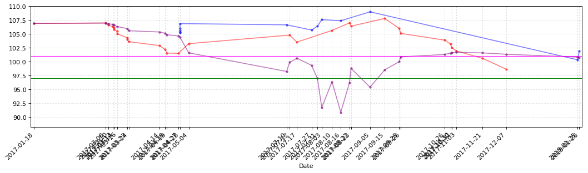


```python
CB_Transaction_Functions.CB_TD_cost_plt(lanbiao_CB_TD)
```


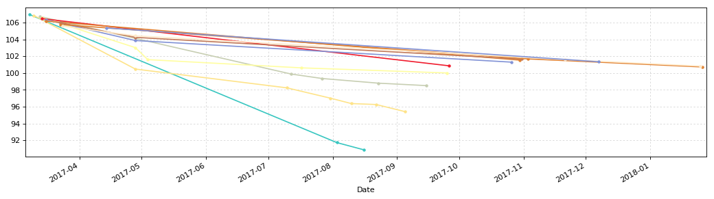


### 辉丰转债128012


```python
huifeng = u'辉丰转债'
huifeng_date = '2016-04-21'
# 2017年11月26日更新三线（106.44，100.00，93.96，112.00）
# 2018年1月21日更新三线
y1 = 103.00
y2 = 94.39
y3 = 87.77
y4 = 112.00
```

[辉丰可转债募集说明书要点](https://github.com/bitbyte27/PythonQuant/blob/master/ConvertibleBond/CB_specification/%E8%BE%89%E4%B8%B0%E8%82%A1%E4%BB%BD%E5%8F%AF%E8%BD%AC%E5%80%BA%E5%8B%9F%E9%9B%86%E8%AF%B4%E6%98%8E%E4%B9%A6%E8%A6%81%E7%82%B9.md)


```python
huifeng_CB_TD = CB_Transaction_Functions.CB_Transaction_Data(huifeng)
huifeng_CB_TD_sort = huifeng_CB_TD.loc[huifeng_CB_TD[u'股份余额']<>0,:]
huifeng_CB_TD_sort.sort_values(by=u'成交均价').head()
```


<div>


<table border="1" class="dataframe">
  <thead>
    <tr style="text-align: right;">
      <th></th>
      <th>发生日期</th>
      <th>业务名称</th>
      <th>证券代码</th>
      <th>证券名称</th>
      <th>成交均价</th>
      <th>成交数量</th>
      <th>成交金额</th>
      <th>股份余额</th>
      <th>手续费</th>
      <th>发生金额</th>
      <th>成本</th>
    </tr>
  </thead>
  <tbody>
    <tr>
      <th>54</th>
      <td>2018-04-24</td>
      <td>证券买入清算</td>
      <td>128012</td>
      <td>辉丰转债</td>
      <td>83.55</td>
      <td>10</td>
      <td>835.5</td>
      <td>170</td>
      <td>0.17</td>
      <td>-835.67</td>
      <td>94.955824</td>
    </tr>
    <tr>
      <th>53</th>
      <td>2018-04-23</td>
      <td>证券买入清算</td>
      <td>128012</td>
      <td>辉丰转债</td>
      <td>86.88</td>
      <td>10</td>
      <td>868.8</td>
      <td>160</td>
      <td>0.17</td>
      <td>-868.97</td>
      <td>95.667625</td>
    </tr>
    <tr>
      <th>52</th>
      <td>2018-04-23</td>
      <td>证券买入清算</td>
      <td>128012</td>
      <td>辉丰转债</td>
      <td>88.21</td>
      <td>10</td>
      <td>882.1</td>
      <td>150</td>
      <td>0.18</td>
      <td>-882.28</td>
      <td>96.252333</td>
    </tr>
    <tr>
      <th>51</th>
      <td>2018-04-23</td>
      <td>证券买入清算</td>
      <td>128012</td>
      <td>辉丰转债</td>
      <td>90.60</td>
      <td>10</td>
      <td>906.0</td>
      <td>140</td>
      <td>0.18</td>
      <td>-906.18</td>
      <td>96.825500</td>
    </tr>
    <tr>
      <th>50</th>
      <td>2018-04-23</td>
      <td>证券买入清算</td>
      <td>128012</td>
      <td>辉丰转债</td>
      <td>90.80</td>
      <td>10</td>
      <td>908.0</td>
      <td>130</td>
      <td>0.18</td>
      <td>-908.18</td>
      <td>97.303000</td>
    </tr>
  </tbody>
</table>
</div>


```python
huifeng_CB_TD.tail(20)
```


<div>


<table border="1" class="dataframe">
  <thead>
    <tr style="text-align: right;">
      <th></th>
      <th>发生日期</th>
      <th>业务名称</th>
      <th>证券代码</th>
      <th>证券名称</th>
      <th>成交均价</th>
      <th>成交数量</th>
      <th>成交金额</th>
      <th>股份余额</th>
      <th>手续费</th>
      <th>发生金额</th>
      <th>成本</th>
    </tr>
  </thead>
  <tbody>
    <tr>
      <th>35</th>
      <td>2017-08-22</td>
      <td>证券买入清算</td>
      <td>128012</td>
      <td>辉丰转债</td>
      <td>106.650</td>
      <td>10</td>
      <td>1066.50</td>
      <td>60</td>
      <td>0.21</td>
      <td>-1066.71</td>
      <td>99.392500</td>
    </tr>
    <tr>
      <th>36</th>
      <td>2017-08-29</td>
      <td>证券卖出清算</td>
      <td>128012</td>
      <td>辉丰转债</td>
      <td>108.136</td>
      <td>-10</td>
      <td>1081.36</td>
      <td>50</td>
      <td>0.22</td>
      <td>1081.14</td>
      <td>97.648200</td>
    </tr>
    <tr>
      <th>37</th>
      <td>2017-09-14</td>
      <td>证券买入清算</td>
      <td>128012</td>
      <td>辉丰转债</td>
      <td>105.820</td>
      <td>10</td>
      <td>1058.20</td>
      <td>60</td>
      <td>0.21</td>
      <td>-1058.41</td>
      <td>99.013667</td>
    </tr>
    <tr>
      <th>38</th>
      <td>2017-09-14</td>
      <td>证券买入清算</td>
      <td>128012</td>
      <td>辉丰转债</td>
      <td>104.980</td>
      <td>10</td>
      <td>1049.80</td>
      <td>70</td>
      <td>0.21</td>
      <td>-1050.01</td>
      <td>99.869000</td>
    </tr>
    <tr>
      <th>39</th>
      <td>2017-09-25</td>
      <td>证券买入清算</td>
      <td>128012</td>
      <td>辉丰转债</td>
      <td>103.100</td>
      <td>10</td>
      <td>1031.00</td>
      <td>80</td>
      <td>0.21</td>
      <td>-1031.21</td>
      <td>100.275500</td>
    </tr>
    <tr>
      <th>40</th>
      <td>2017-09-27</td>
      <td>证券买入清算</td>
      <td>128012</td>
      <td>辉丰转债</td>
      <td>102.020</td>
      <td>10</td>
      <td>1020.20</td>
      <td>90</td>
      <td>0.20</td>
      <td>-1020.40</td>
      <td>100.471556</td>
    </tr>
    <tr>
      <th>41</th>
      <td>2017-11-24</td>
      <td>证券买入清算</td>
      <td>128012</td>
      <td>辉丰转债</td>
      <td>99.492</td>
      <td>10</td>
      <td>994.92</td>
      <td>100</td>
      <td>0.20</td>
      <td>-995.12</td>
      <td>100.375600</td>
    </tr>
    <tr>
      <th>42</th>
      <td>2017-11-29</td>
      <td>证券买入清算</td>
      <td>128012</td>
      <td>辉丰转债</td>
      <td>98.118</td>
      <td>10</td>
      <td>981.18</td>
      <td>110</td>
      <td>0.20</td>
      <td>-981.38</td>
      <td>100.172182</td>
    </tr>
    <tr>
      <th>43</th>
      <td>2017-12-07</td>
      <td>证券买入清算</td>
      <td>128012</td>
      <td>辉丰转债</td>
      <td>94.900</td>
      <td>20</td>
      <td>1898.00</td>
      <td>130</td>
      <td>0.38</td>
      <td>-1898.38</td>
      <td>99.364000</td>
    </tr>
    <tr>
      <th>44</th>
      <td>2018-01-04</td>
      <td>证券卖出清算</td>
      <td>128012</td>
      <td>辉丰转债</td>
      <td>97.060</td>
      <td>-20</td>
      <td>1941.20</td>
      <td>110</td>
      <td>0.39</td>
      <td>1940.81</td>
      <td>99.786455</td>
    </tr>
    <tr>
      <th>45</th>
      <td>2018-01-25</td>
      <td>证券卖出清算</td>
      <td>128012</td>
      <td>辉丰转债</td>
      <td>102.448</td>
      <td>-20</td>
      <td>2048.96</td>
      <td>90</td>
      <td>0.41</td>
      <td>2048.55</td>
      <td>99.199556</td>
    </tr>
    <tr>
      <th>46</th>
      <td>2018-02-08</td>
      <td>证券买入清算</td>
      <td>128012</td>
      <td>辉丰转债</td>
      <td>97.332</td>
      <td>10</td>
      <td>973.32</td>
      <td>100</td>
      <td>0.19</td>
      <td>-973.51</td>
      <td>99.014700</td>
    </tr>
    <tr>
      <th>47</th>
      <td>2018-02-09</td>
      <td>证券买入清算</td>
      <td>128012</td>
      <td>辉丰转债</td>
      <td>96.086</td>
      <td>10</td>
      <td>960.86</td>
      <td>110</td>
      <td>0.19</td>
      <td>-961.05</td>
      <td>98.750182</td>
    </tr>
    <tr>
      <th>48</th>
      <td>2018-03-29</td>
      <td>证券买入清算</td>
      <td>128012</td>
      <td>辉丰转债</td>
      <td>94.570</td>
      <td>10</td>
      <td>945.70</td>
      <td>120</td>
      <td>0.19</td>
      <td>-945.89</td>
      <td>98.403417</td>
    </tr>
    <tr>
      <th>49</th>
      <td>2018-04-20</td>
      <td>债券兑息</td>
      <td>128012</td>
      <td>辉丰转债</td>
      <td>0.000</td>
      <td>0</td>
      <td>84.00</td>
      <td>0</td>
      <td>0.00</td>
      <td>67.20</td>
      <td>inf</td>
    </tr>
    <tr>
      <th>50</th>
      <td>2018-04-23</td>
      <td>证券买入清算</td>
      <td>128012</td>
      <td>辉丰转债</td>
      <td>90.800</td>
      <td>10</td>
      <td>908.00</td>
      <td>130</td>
      <td>0.18</td>
      <td>-908.18</td>
      <td>97.303000</td>
    </tr>
    <tr>
      <th>51</th>
      <td>2018-04-23</td>
      <td>证券买入清算</td>
      <td>128012</td>
      <td>辉丰转债</td>
      <td>90.600</td>
      <td>10</td>
      <td>906.00</td>
      <td>140</td>
      <td>0.18</td>
      <td>-906.18</td>
      <td>96.825500</td>
    </tr>
    <tr>
      <th>52</th>
      <td>2018-04-23</td>
      <td>证券买入清算</td>
      <td>128012</td>
      <td>辉丰转债</td>
      <td>88.210</td>
      <td>10</td>
      <td>882.10</td>
      <td>150</td>
      <td>0.18</td>
      <td>-882.28</td>
      <td>96.252333</td>
    </tr>
    <tr>
      <th>53</th>
      <td>2018-04-23</td>
      <td>证券买入清算</td>
      <td>128012</td>
      <td>辉丰转债</td>
      <td>86.880</td>
      <td>10</td>
      <td>868.80</td>
      <td>160</td>
      <td>0.17</td>
      <td>-868.97</td>
      <td>95.667625</td>
    </tr>
    <tr>
      <th>54</th>
      <td>2018-04-24</td>
      <td>证券买入清算</td>
      <td>128012</td>
      <td>辉丰转债</td>
      <td>83.550</td>
      <td>10</td>
      <td>835.50</td>
      <td>170</td>
      <td>0.17</td>
      <td>-835.67</td>
      <td>94.955824</td>
    </tr>
  </tbody>
</table>
</div>


```python
huifeng_CB_TD_cost = CB_Transaction_Functions.CB_TD_cost(huifeng,huifeng_CB_TD,huifeng_date)
huifeng_CB_TD_cost.round(3)
```


<div>


<table border="1" class="dataframe">
  <thead>
    <tr style="text-align: right;">
      <th></th>
      <th>持仓金额</th>
      <th>成交数量</th>
      <th>持仓成本</th>
      <th>起息日</th>
      <th>剩余年限</th>
      <th>证券代码</th>
      <th>成交金额</th>
      <th>买卖数量</th>
      <th>交易时间</th>
    </tr>
  </thead>
  <tbody>
    <tr>
      <th>辉丰转债</th>
      <td>16142.49</td>
      <td>170.0</td>
      <td>94.956</td>
      <td>2016-04-21</td>
      <td>3年354天</td>
      <td>128012</td>
      <td>83.55</td>
      <td>10</td>
      <td>2018-04-24</td>
    </tr>
  </tbody>
</table>
</div>


```python
CB_Transaction_Functions.CB_TD_plt(huifeng_CB_TD,y1,y2,y3,y4)
```


```python
CB_Transaction_Functions.CB_TD_cost_plt(huifeng_CB_TD)
```


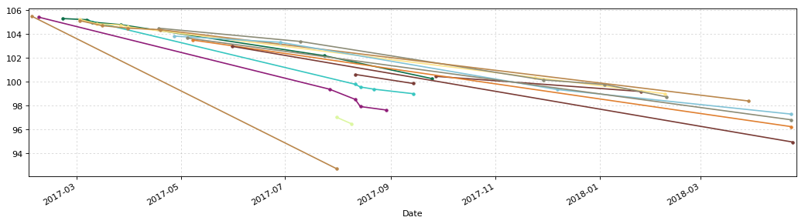


### 洪涛转债128013


```python
hongtao = u'洪涛转债'
hongtao_date = '2016-07-29'
# 2017年11月26日更新三线（108.00，94.22，87.32，110.00）
# 2018年1月21日更新三线
y1 = 100.00
y2 = 94.77
y3 = 88.03
y4 = 110.00
```

[洪涛股份可转债募集说明书要点](https://github.com/bitbyte27/PythonQuant/blob/master/ConvertibleBond/CB_specification/%E6%B4%AA%E6%B6%9B%E8%82%A1%E4%BB%BD%E5%8F%AF%E8%BD%AC%E5%80%BA%E5%8B%9F%E9%9B%86%E8%AF%B4%E6%98%8E%E4%B9%A6%E8%A6%81%E7%82%B9.md)


```python
hongtao_CB_TD = CB_Transaction_Functions.CB_Transaction_Data(hongtao)
hongtao_CB_TD.sort_values(by=u'成交均价').head()
```


<div>


<table border="1" class="dataframe">
  <thead>
    <tr style="text-align: right;">
      <th></th>
      <th>发生日期</th>
      <th>业务名称</th>
      <th>证券代码</th>
      <th>证券名称</th>
      <th>成交均价</th>
      <th>成交数量</th>
      <th>成交金额</th>
      <th>股份余额</th>
      <th>手续费</th>
      <th>发生金额</th>
      <th>成本</th>
    </tr>
  </thead>
  <tbody>
    <tr>
      <th>31</th>
      <td>2017-07-28</td>
      <td>债券兑息</td>
      <td>128013</td>
      <td>洪涛转债</td>
      <td>0.000</td>
      <td>0</td>
      <td>80.00</td>
      <td>0</td>
      <td>16.00</td>
      <td>64.00</td>
      <td>inf</td>
    </tr>
    <tr>
      <th>46</th>
      <td>2017-12-07</td>
      <td>证券买入清算</td>
      <td>128013</td>
      <td>洪涛转债</td>
      <td>93.279</td>
      <td>10</td>
      <td>932.79</td>
      <td>400</td>
      <td>0.19</td>
      <td>-932.98</td>
      <td>102.076100</td>
    </tr>
    <tr>
      <th>45</th>
      <td>2017-11-29</td>
      <td>证券买入清算</td>
      <td>128013</td>
      <td>洪涛转债</td>
      <td>95.954</td>
      <td>10</td>
      <td>959.54</td>
      <td>390</td>
      <td>0.19</td>
      <td>-959.73</td>
      <td>102.301179</td>
    </tr>
    <tr>
      <th>44</th>
      <td>2017-11-21</td>
      <td>证券买入清算</td>
      <td>128013</td>
      <td>洪涛转债</td>
      <td>96.070</td>
      <td>20</td>
      <td>1921.40</td>
      <td>380</td>
      <td>0.38</td>
      <td>-1921.78</td>
      <td>102.467711</td>
    </tr>
    <tr>
      <th>43</th>
      <td>2017-11-21</td>
      <td>证券买入清算</td>
      <td>128013</td>
      <td>洪涛转债</td>
      <td>97.010</td>
      <td>20</td>
      <td>1940.20</td>
      <td>360</td>
      <td>0.39</td>
      <td>-1940.59</td>
      <td>102.822083</td>
    </tr>
  </tbody>
</table>
</div>


```python
hongtao_CB_TD.tail(20)
```


<div>


<table border="1" class="dataframe">
  <thead>
    <tr style="text-align: right;">
      <th></th>
      <th>发生日期</th>
      <th>业务名称</th>
      <th>证券代码</th>
      <th>证券名称</th>
      <th>成交均价</th>
      <th>成交数量</th>
      <th>成交金额</th>
      <th>股份余额</th>
      <th>手续费</th>
      <th>发生金额</th>
      <th>成本</th>
    </tr>
  </thead>
  <tbody>
    <tr>
      <th>27</th>
      <td>2017-06-28</td>
      <td>证券卖出清算</td>
      <td>128013</td>
      <td>洪涛转债</td>
      <td>103.880</td>
      <td>-40</td>
      <td>4155.20</td>
      <td>250</td>
      <td>0.83</td>
      <td>4154.37</td>
      <td>104.704400</td>
    </tr>
    <tr>
      <th>28</th>
      <td>2017-06-28</td>
      <td>证券卖出清算</td>
      <td>128013</td>
      <td>洪涛转债</td>
      <td>103.560</td>
      <td>-10</td>
      <td>1035.60</td>
      <td>240</td>
      <td>0.21</td>
      <td>1035.39</td>
      <td>104.752958</td>
    </tr>
    <tr>
      <th>29</th>
      <td>2017-07-24</td>
      <td>证券卖出清算</td>
      <td>128013</td>
      <td>洪涛转债</td>
      <td>103.421</td>
      <td>-20</td>
      <td>2068.42</td>
      <td>220</td>
      <td>0.41</td>
      <td>2068.01</td>
      <td>104.875909</td>
    </tr>
    <tr>
      <th>30</th>
      <td>2017-07-28</td>
      <td>证券卖出清算</td>
      <td>128013</td>
      <td>洪涛转债</td>
      <td>103.701</td>
      <td>-20</td>
      <td>2074.02</td>
      <td>200</td>
      <td>0.41</td>
      <td>2073.61</td>
      <td>104.995450</td>
    </tr>
    <tr>
      <th>31</th>
      <td>2017-07-28</td>
      <td>债券兑息</td>
      <td>128013</td>
      <td>洪涛转债</td>
      <td>0.000</td>
      <td>0</td>
      <td>80.00</td>
      <td>0</td>
      <td>16.00</td>
      <td>64.00</td>
      <td>inf</td>
    </tr>
    <tr>
      <th>32</th>
      <td>2017-08-03</td>
      <td>证券卖出清算</td>
      <td>128013</td>
      <td>洪涛转债</td>
      <td>105.510</td>
      <td>-20</td>
      <td>2110.20</td>
      <td>180</td>
      <td>0.42</td>
      <td>2109.78</td>
      <td>104.585056</td>
    </tr>
    <tr>
      <th>33</th>
      <td>2017-08-18</td>
      <td>证券买入清算</td>
      <td>128013</td>
      <td>洪涛转债</td>
      <td>104.007</td>
      <td>20</td>
      <td>2080.14</td>
      <td>200</td>
      <td>0.42</td>
      <td>-2080.56</td>
      <td>104.529350</td>
    </tr>
    <tr>
      <th>34</th>
      <td>2017-08-25</td>
      <td>证券买入清算</td>
      <td>128013</td>
      <td>洪涛转债</td>
      <td>103.233</td>
      <td>20</td>
      <td>2064.66</td>
      <td>220</td>
      <td>0.41</td>
      <td>-2065.07</td>
      <td>104.413364</td>
    </tr>
    <tr>
      <th>35</th>
      <td>2017-09-14</td>
      <td>证券买入清算</td>
      <td>128013</td>
      <td>洪涛转债</td>
      <td>102.820</td>
      <td>20</td>
      <td>2056.40</td>
      <td>240</td>
      <td>0.41</td>
      <td>-2056.81</td>
      <td>104.282292</td>
    </tr>
    <tr>
      <th>36</th>
      <td>2017-09-25</td>
      <td>证券买入清算</td>
      <td>128013</td>
      <td>洪涛转债</td>
      <td>101.980</td>
      <td>20</td>
      <td>2039.60</td>
      <td>260</td>
      <td>0.41</td>
      <td>-2040.01</td>
      <td>104.106769</td>
    </tr>
    <tr>
      <th>37</th>
      <td>2017-09-26</td>
      <td>证券买入清算</td>
      <td>128013</td>
      <td>洪涛转债</td>
      <td>101.161</td>
      <td>20</td>
      <td>2023.22</td>
      <td>280</td>
      <td>0.40</td>
      <td>-2023.62</td>
      <td>103.897786</td>
    </tr>
    <tr>
      <th>38</th>
      <td>2017-10-27</td>
      <td>证券买入清算</td>
      <td>128013</td>
      <td>洪涛转债</td>
      <td>100.780</td>
      <td>10</td>
      <td>1007.80</td>
      <td>290</td>
      <td>0.20</td>
      <td>-1008.00</td>
      <td>103.790966</td>
    </tr>
    <tr>
      <th>39</th>
      <td>2017-10-30</td>
      <td>证券买入清算</td>
      <td>128013</td>
      <td>洪涛转债</td>
      <td>100.190</td>
      <td>10</td>
      <td>1001.90</td>
      <td>300</td>
      <td>0.20</td>
      <td>-1002.10</td>
      <td>103.671600</td>
    </tr>
    <tr>
      <th>40</th>
      <td>2017-11-03</td>
      <td>证券买入清算</td>
      <td>128013</td>
      <td>洪涛转债</td>
      <td>99.901</td>
      <td>20</td>
      <td>1998.02</td>
      <td>320</td>
      <td>0.40</td>
      <td>-1998.42</td>
      <td>103.437187</td>
    </tr>
    <tr>
      <th>41</th>
      <td>2017-11-15</td>
      <td>证券买入清算</td>
      <td>128013</td>
      <td>洪涛转债</td>
      <td>98.983</td>
      <td>10</td>
      <td>989.83</td>
      <td>330</td>
      <td>0.20</td>
      <td>-990.03</td>
      <td>103.302818</td>
    </tr>
    <tr>
      <th>42</th>
      <td>2017-11-16</td>
      <td>证券买入清算</td>
      <td>128013</td>
      <td>洪涛转债</td>
      <td>98.523</td>
      <td>10</td>
      <td>985.23</td>
      <td>340</td>
      <td>0.20</td>
      <td>-985.43</td>
      <td>103.162824</td>
    </tr>
    <tr>
      <th>43</th>
      <td>2017-11-21</td>
      <td>证券买入清算</td>
      <td>128013</td>
      <td>洪涛转债</td>
      <td>97.010</td>
      <td>20</td>
      <td>1940.20</td>
      <td>360</td>
      <td>0.39</td>
      <td>-1940.59</td>
      <td>102.822083</td>
    </tr>
    <tr>
      <th>44</th>
      <td>2017-11-21</td>
      <td>证券买入清算</td>
      <td>128013</td>
      <td>洪涛转债</td>
      <td>96.070</td>
      <td>20</td>
      <td>1921.40</td>
      <td>380</td>
      <td>0.38</td>
      <td>-1921.78</td>
      <td>102.467711</td>
    </tr>
    <tr>
      <th>45</th>
      <td>2017-11-29</td>
      <td>证券买入清算</td>
      <td>128013</td>
      <td>洪涛转债</td>
      <td>95.954</td>
      <td>10</td>
      <td>959.54</td>
      <td>390</td>
      <td>0.19</td>
      <td>-959.73</td>
      <td>102.301179</td>
    </tr>
    <tr>
      <th>46</th>
      <td>2017-12-07</td>
      <td>证券买入清算</td>
      <td>128013</td>
      <td>洪涛转债</td>
      <td>93.279</td>
      <td>10</td>
      <td>932.79</td>
      <td>400</td>
      <td>0.19</td>
      <td>-932.98</td>
      <td>102.076100</td>
    </tr>
  </tbody>
</table>
</div>


```python
hongtao_CB_TD_cost = CB_Transaction_Functions.CB_TD_cost(hongtao,hongtao_CB_TD,hongtao_date)
hongtao_CB_TD_cost.round(3)
```


<div>


<table border="1" class="dataframe">
  <thead>
    <tr style="text-align: right;">
      <th></th>
      <th>持仓金额</th>
      <th>成交数量</th>
      <th>持仓成本</th>
      <th>起息日</th>
      <th>剩余年限</th>
      <th>证券代码</th>
      <th>成交金额</th>
      <th>买卖数量</th>
      <th>交易时间</th>
    </tr>
  </thead>
  <tbody>
    <tr>
      <th>洪涛转债</th>
      <td>40830.44</td>
      <td>400.0</td>
      <td>102.076</td>
      <td>2016-07-29</td>
      <td>4年89天</td>
      <td>128013</td>
      <td>93.279</td>
      <td>10</td>
      <td>2017-12-07</td>
    </tr>
  </tbody>
</table>
</div>


```python
CB_Transaction_Functions.CB_TD_plt(hongtao_CB_TD,y1,y2,y3,y4)
```


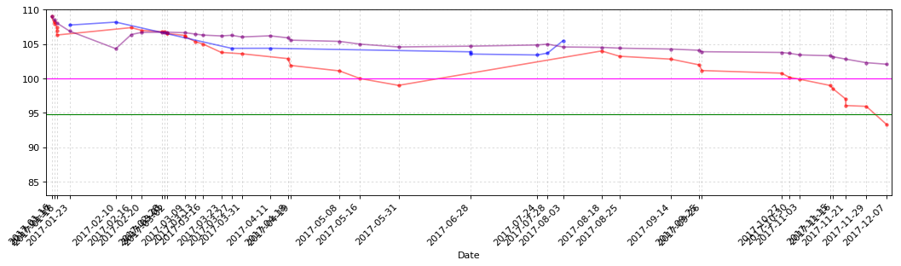


```python
CB_Transaction_Functions.CB_TD_cost_plt(hongtao_CB_TD)
```


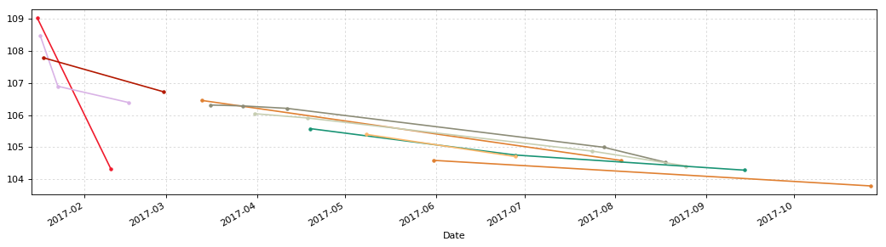


### 航信转债110031


```python
hangxin = u'航信转债'
hangxin_date = '2015-06-12'
# 2017年11月26日更新三线（107.00，100.00，93.51，108.00）
# 2018年1月21日更新三线
y1 = 101.50
y2 = 97.02
y3 = 94.20
y4 = 108.00
```


```python
hangxin_CB_TD = CB_Transaction_Functions.CB_Transaction_Data(hangxin)
hangxin_CB_TD.sort_values(by=u'成交均价').head()
```


<div>


<table border="1" class="dataframe">
  <thead>
    <tr style="text-align: right;">
      <th></th>
      <th>发生日期</th>
      <th>业务名称</th>
      <th>证券代码</th>
      <th>证券名称</th>
      <th>成交均价</th>
      <th>成交数量</th>
      <th>成交金额</th>
      <th>股份余额</th>
      <th>手续费</th>
      <th>发生金额</th>
      <th>成本</th>
    </tr>
  </thead>
  <tbody>
    <tr>
      <th>17</th>
      <td>2017-06-16</td>
      <td>债券兑息</td>
      <td>110031</td>
      <td>航信转债</td>
      <td>0.00</td>
      <td>0</td>
      <td>60.0</td>
      <td>120</td>
      <td>0.0</td>
      <td>48.0</td>
      <td>104.023333</td>
    </tr>
    <tr>
      <th>16</th>
      <td>2017-05-16</td>
      <td>证券买入清算</td>
      <td>110031</td>
      <td>航信转债</td>
      <td>99.98</td>
      <td>20</td>
      <td>1999.6</td>
      <td>120</td>
      <td>1.0</td>
      <td>-2000.6</td>
      <td>104.423333</td>
    </tr>
    <tr>
      <th>24</th>
      <td>2017-12-07</td>
      <td>证券买入清算</td>
      <td>110031</td>
      <td>航信转债</td>
      <td>100.29</td>
      <td>10</td>
      <td>1002.9</td>
      <td>100</td>
      <td>1.0</td>
      <td>-1003.9</td>
      <td>102.380600</td>
    </tr>
    <tr>
      <th>23</th>
      <td>2017-11-29</td>
      <td>证券买入清算</td>
      <td>110031</td>
      <td>航信转债</td>
      <td>100.69</td>
      <td>10</td>
      <td>1006.9</td>
      <td>90</td>
      <td>1.0</td>
      <td>-1007.9</td>
      <td>102.601778</td>
    </tr>
    <tr>
      <th>22</th>
      <td>2017-11-29</td>
      <td>证券买入清算</td>
      <td>110031</td>
      <td>航信转债</td>
      <td>101.83</td>
      <td>20</td>
      <td>2036.6</td>
      <td>80</td>
      <td>1.0</td>
      <td>-2037.6</td>
      <td>102.828250</td>
    </tr>
  </tbody>
</table>
</div>


```python
hangxin_CB_TD.tail(20)
```


<div>


<table border="1" class="dataframe">
  <thead>
    <tr style="text-align: right;">
      <th></th>
      <th>发生日期</th>
      <th>业务名称</th>
      <th>证券代码</th>
      <th>证券名称</th>
      <th>成交均价</th>
      <th>成交数量</th>
      <th>成交金额</th>
      <th>股份余额</th>
      <th>手续费</th>
      <th>发生金额</th>
      <th>成本</th>
    </tr>
  </thead>
  <tbody>
    <tr>
      <th>9</th>
      <td>2017-04-07</td>
      <td>证券卖出清算</td>
      <td>110031</td>
      <td>航信转债</td>
      <td>104.41</td>
      <td>-10</td>
      <td>1044.1</td>
      <td>90</td>
      <td>1.00</td>
      <td>1043.10</td>
      <td>105.871111</td>
    </tr>
    <tr>
      <th>10</th>
      <td>2017-04-07</td>
      <td>证券卖出清算</td>
      <td>110031</td>
      <td>航信转债</td>
      <td>104.46</td>
      <td>-10</td>
      <td>1044.6</td>
      <td>80</td>
      <td>1.00</td>
      <td>1043.60</td>
      <td>106.060000</td>
    </tr>
    <tr>
      <th>11</th>
      <td>2017-04-07</td>
      <td>证券卖出清算</td>
      <td>110031</td>
      <td>航信转债</td>
      <td>104.55</td>
      <td>-10</td>
      <td>1045.5</td>
      <td>70</td>
      <td>1.00</td>
      <td>1044.50</td>
      <td>106.290000</td>
    </tr>
    <tr>
      <th>12</th>
      <td>2017-04-07</td>
      <td>证券卖出清算</td>
      <td>110031</td>
      <td>航信转债</td>
      <td>104.80</td>
      <td>-20</td>
      <td>2096.0</td>
      <td>50</td>
      <td>1.00</td>
      <td>2095.00</td>
      <td>106.906000</td>
    </tr>
    <tr>
      <th>13</th>
      <td>2017-04-14</td>
      <td>证券买入清算</td>
      <td>110031</td>
      <td>航信转债</td>
      <td>104.01</td>
      <td>20</td>
      <td>2080.2</td>
      <td>70</td>
      <td>1.00</td>
      <td>-2081.20</td>
      <td>106.092857</td>
    </tr>
    <tr>
      <th>14</th>
      <td>2017-04-19</td>
      <td>证券买入清算</td>
      <td>110031</td>
      <td>航信转债</td>
      <td>103.61</td>
      <td>20</td>
      <td>2072.2</td>
      <td>90</td>
      <td>1.00</td>
      <td>-2073.20</td>
      <td>105.552222</td>
    </tr>
    <tr>
      <th>15</th>
      <td>2017-04-24</td>
      <td>证券买入清算</td>
      <td>110031</td>
      <td>航信转债</td>
      <td>102.95</td>
      <td>10</td>
      <td>1029.5</td>
      <td>100</td>
      <td>1.00</td>
      <td>-1030.50</td>
      <td>105.302000</td>
    </tr>
    <tr>
      <th>16</th>
      <td>2017-05-16</td>
      <td>证券买入清算</td>
      <td>110031</td>
      <td>航信转债</td>
      <td>99.98</td>
      <td>20</td>
      <td>1999.6</td>
      <td>120</td>
      <td>1.00</td>
      <td>-2000.60</td>
      <td>104.423333</td>
    </tr>
    <tr>
      <th>17</th>
      <td>2017-06-16</td>
      <td>债券兑息</td>
      <td>110031</td>
      <td>航信转债</td>
      <td>0.00</td>
      <td>0</td>
      <td>60.0</td>
      <td>120</td>
      <td>0.00</td>
      <td>48.00</td>
      <td>104.023333</td>
    </tr>
    <tr>
      <th>18</th>
      <td>2017-06-28</td>
      <td>证券卖出清算</td>
      <td>110031</td>
      <td>航信转债</td>
      <td>104.09</td>
      <td>-70</td>
      <td>7286.3</td>
      <td>50</td>
      <td>1.46</td>
      <td>7284.84</td>
      <td>103.959200</td>
    </tr>
    <tr>
      <th>19</th>
      <td>2017-07-24</td>
      <td>证券卖出清算</td>
      <td>110031</td>
      <td>航信转债</td>
      <td>104.51</td>
      <td>-30</td>
      <td>3135.3</td>
      <td>20</td>
      <td>1.00</td>
      <td>3134.30</td>
      <td>103.183000</td>
    </tr>
    <tr>
      <th>20</th>
      <td>2017-09-26</td>
      <td>证券买入清算</td>
      <td>110031</td>
      <td>航信转债</td>
      <td>103.72</td>
      <td>20</td>
      <td>2074.4</td>
      <td>40</td>
      <td>1.00</td>
      <td>-2075.40</td>
      <td>103.476500</td>
    </tr>
    <tr>
      <th>21</th>
      <td>2017-11-27</td>
      <td>证券买入清算</td>
      <td>110031</td>
      <td>航信转债</td>
      <td>102.43</td>
      <td>20</td>
      <td>2048.6</td>
      <td>60</td>
      <td>1.00</td>
      <td>-2049.60</td>
      <td>103.144333</td>
    </tr>
    <tr>
      <th>22</th>
      <td>2017-11-29</td>
      <td>证券买入清算</td>
      <td>110031</td>
      <td>航信转债</td>
      <td>101.83</td>
      <td>20</td>
      <td>2036.6</td>
      <td>80</td>
      <td>1.00</td>
      <td>-2037.60</td>
      <td>102.828250</td>
    </tr>
    <tr>
      <th>23</th>
      <td>2017-11-29</td>
      <td>证券买入清算</td>
      <td>110031</td>
      <td>航信转债</td>
      <td>100.69</td>
      <td>10</td>
      <td>1006.9</td>
      <td>90</td>
      <td>1.00</td>
      <td>-1007.90</td>
      <td>102.601778</td>
    </tr>
    <tr>
      <th>24</th>
      <td>2017-12-07</td>
      <td>证券买入清算</td>
      <td>110031</td>
      <td>航信转债</td>
      <td>100.29</td>
      <td>10</td>
      <td>1002.9</td>
      <td>100</td>
      <td>1.00</td>
      <td>-1003.90</td>
      <td>102.380600</td>
    </tr>
    <tr>
      <th>25</th>
      <td>2018-01-25</td>
      <td>证券卖出清算</td>
      <td>110031</td>
      <td>航信转债</td>
      <td>102.35</td>
      <td>-20</td>
      <td>2047.0</td>
      <td>80</td>
      <td>1.00</td>
      <td>2046.00</td>
      <td>102.400750</td>
    </tr>
    <tr>
      <th>26</th>
      <td>2018-03-30</td>
      <td>证券卖出清算</td>
      <td>110031</td>
      <td>航信转债</td>
      <td>105.42</td>
      <td>-10</td>
      <td>1054.2</td>
      <td>70</td>
      <td>1.00</td>
      <td>1053.20</td>
      <td>101.983714</td>
    </tr>
    <tr>
      <th>27</th>
      <td>2018-04-19</td>
      <td>证券卖出清算</td>
      <td>110031</td>
      <td>航信转债</td>
      <td>106.24</td>
      <td>-20</td>
      <td>2124.8</td>
      <td>50</td>
      <td>1.00</td>
      <td>2123.80</td>
      <td>100.301200</td>
    </tr>
    <tr>
      <th>28</th>
      <td>2018-04-20</td>
      <td>证券卖出清算</td>
      <td>110031</td>
      <td>航信转债</td>
      <td>107.51</td>
      <td>-10</td>
      <td>1075.1</td>
      <td>40</td>
      <td>1.00</td>
      <td>1074.10</td>
      <td>98.524000</td>
    </tr>
  </tbody>
</table>
</div>


```python
hangxin_CB_TD_cost = CB_Transaction_Functions.CB_TD_cost(hangxin,hangxin_CB_TD,hangxin_date)
hangxin_CB_TD_cost.round(3)
```


<div>


<table border="1" class="dataframe">
  <thead>
    <tr style="text-align: right;">
      <th></th>
      <th>持仓金额</th>
      <th>成交数量</th>
      <th>持仓成本</th>
      <th>起息日</th>
      <th>剩余年限</th>
      <th>证券代码</th>
      <th>成交金额</th>
      <th>买卖数量</th>
      <th>交易时间</th>
    </tr>
  </thead>
  <tbody>
    <tr>
      <th>航信转债</th>
      <td>3940.96</td>
      <td>40.0</td>
      <td>98.524</td>
      <td>2015-06-12</td>
      <td>3年41天</td>
      <td>110031</td>
      <td>107.51</td>
      <td>-10</td>
      <td>2018-04-20</td>
    </tr>
  </tbody>
</table>
</div>


```python
CB_Transaction_Functions.CB_TD_plt(hangxin_CB_TD,y1,y2,y3,y4)
```


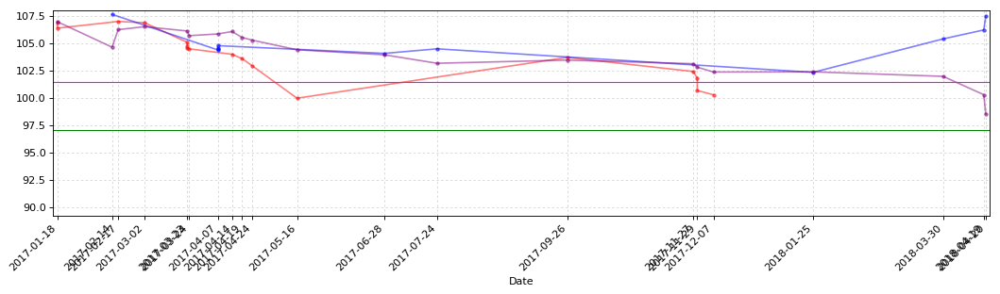


```python
CB_Transaction_Functions.CB_TD_cost_plt(hangxin_CB_TD)
```


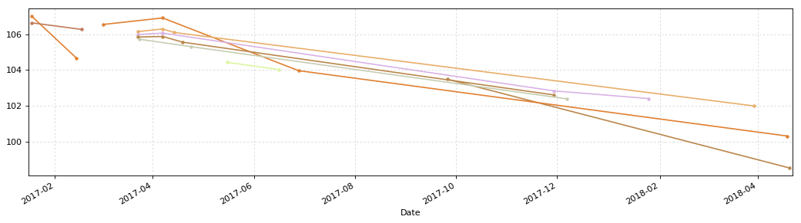


### 海印转债127003


```python
haiyin = u'海印转债'
haiyin_date = '2016-06-08'
# 2017年11月5日更新三线（104.36，96.30，92.85，108.00）
# 2018年1月21日更新三线
y1 = 100.00
y2 = 93.51
y3 = 88
y4 = 108.00
```


```python
haiyin_CB_TD = CB_Transaction_Functions.CB_Transaction_Data(haiyin)
haiyin_CB_TD.sort_values(by=u'成交均价').head()
```


<div>


<table border="1" class="dataframe">
  <thead>
    <tr style="text-align: right;">
      <th></th>
      <th>发生日期</th>
      <th>业务名称</th>
      <th>证券代码</th>
      <th>证券名称</th>
      <th>成交均价</th>
      <th>成交数量</th>
      <th>成交金额</th>
      <th>股份余额</th>
      <th>手续费</th>
      <th>发生金额</th>
      <th>成本</th>
    </tr>
  </thead>
  <tbody>
    <tr>
      <th>26</th>
      <td>2018-02-09</td>
      <td>证券买入清算</td>
      <td>127003</td>
      <td>海印转债</td>
      <td>93.000</td>
      <td>10</td>
      <td>930.00</td>
      <td>170</td>
      <td>0.19</td>
      <td>-930.19</td>
      <td>99.822353</td>
    </tr>
    <tr>
      <th>24</th>
      <td>2017-12-07</td>
      <td>证券买入清算</td>
      <td>127003</td>
      <td>海印转债</td>
      <td>93.730</td>
      <td>10</td>
      <td>937.30</td>
      <td>170</td>
      <td>0.19</td>
      <td>-937.49</td>
      <td>99.894529</td>
    </tr>
    <tr>
      <th>25</th>
      <td>2018-01-25</td>
      <td>证券卖出清算</td>
      <td>127003</td>
      <td>海印转债</td>
      <td>94.265</td>
      <td>-10</td>
      <td>942.65</td>
      <td>160</td>
      <td>0.19</td>
      <td>942.46</td>
      <td>100.247563</td>
    </tr>
    <tr>
      <th>23</th>
      <td>2017-11-24</td>
      <td>证券买入清算</td>
      <td>127003</td>
      <td>海印转债</td>
      <td>95.788</td>
      <td>10</td>
      <td>957.88</td>
      <td>160</td>
      <td>0.19</td>
      <td>-958.07</td>
      <td>100.278625</td>
    </tr>
    <tr>
      <th>22</th>
      <td>2017-11-21</td>
      <td>证券买入清算</td>
      <td>127003</td>
      <td>海印转债</td>
      <td>96.135</td>
      <td>10</td>
      <td>961.35</td>
      <td>150</td>
      <td>0.19</td>
      <td>-961.54</td>
      <td>100.576733</td>
    </tr>
  </tbody>
</table>
</div>


```python
haiyin_CB_TD.tail(10)
```


<div>


<table border="1" class="dataframe">
  <thead>
    <tr style="text-align: right;">
      <th></th>
      <th>发生日期</th>
      <th>业务名称</th>
      <th>证券代码</th>
      <th>证券名称</th>
      <th>成交均价</th>
      <th>成交数量</th>
      <th>成交金额</th>
      <th>股份余额</th>
      <th>手续费</th>
      <th>发生金额</th>
      <th>成本</th>
    </tr>
  </thead>
  <tbody>
    <tr>
      <th>17</th>
      <td>2017-10-31</td>
      <td>证券买入清算</td>
      <td>127003</td>
      <td>海印转债</td>
      <td>100.020</td>
      <td>10</td>
      <td>1000.20</td>
      <td>100</td>
      <td>0.20</td>
      <td>-1000.40</td>
      <td>101.807600</td>
    </tr>
    <tr>
      <th>18</th>
      <td>2017-11-02</td>
      <td>证券买入清算</td>
      <td>127003</td>
      <td>海印转债</td>
      <td>99.983</td>
      <td>10</td>
      <td>999.83</td>
      <td>110</td>
      <td>0.20</td>
      <td>-1000.03</td>
      <td>101.643545</td>
    </tr>
    <tr>
      <th>19</th>
      <td>2017-11-15</td>
      <td>证券买入清算</td>
      <td>127003</td>
      <td>海印转债</td>
      <td>98.949</td>
      <td>10</td>
      <td>989.49</td>
      <td>120</td>
      <td>0.20</td>
      <td>-989.69</td>
      <td>101.420667</td>
    </tr>
    <tr>
      <th>20</th>
      <td>2017-11-17</td>
      <td>证券买入清算</td>
      <td>127003</td>
      <td>海印转债</td>
      <td>98.400</td>
      <td>10</td>
      <td>984.00</td>
      <td>130</td>
      <td>0.20</td>
      <td>-984.20</td>
      <td>101.189846</td>
    </tr>
    <tr>
      <th>21</th>
      <td>2017-11-21</td>
      <td>证券买入清算</td>
      <td>127003</td>
      <td>海印转债</td>
      <td>97.010</td>
      <td>10</td>
      <td>970.10</td>
      <td>140</td>
      <td>0.19</td>
      <td>-970.29</td>
      <td>100.892643</td>
    </tr>
    <tr>
      <th>22</th>
      <td>2017-11-21</td>
      <td>证券买入清算</td>
      <td>127003</td>
      <td>海印转债</td>
      <td>96.135</td>
      <td>10</td>
      <td>961.35</td>
      <td>150</td>
      <td>0.19</td>
      <td>-961.54</td>
      <td>100.576733</td>
    </tr>
    <tr>
      <th>23</th>
      <td>2017-11-24</td>
      <td>证券买入清算</td>
      <td>127003</td>
      <td>海印转债</td>
      <td>95.788</td>
      <td>10</td>
      <td>957.88</td>
      <td>160</td>
      <td>0.19</td>
      <td>-958.07</td>
      <td>100.278625</td>
    </tr>
    <tr>
      <th>24</th>
      <td>2017-12-07</td>
      <td>证券买入清算</td>
      <td>127003</td>
      <td>海印转债</td>
      <td>93.730</td>
      <td>10</td>
      <td>937.30</td>
      <td>170</td>
      <td>0.19</td>
      <td>-937.49</td>
      <td>99.894529</td>
    </tr>
    <tr>
      <th>25</th>
      <td>2018-01-25</td>
      <td>证券卖出清算</td>
      <td>127003</td>
      <td>海印转债</td>
      <td>94.265</td>
      <td>-10</td>
      <td>942.65</td>
      <td>160</td>
      <td>0.19</td>
      <td>942.46</td>
      <td>100.247563</td>
    </tr>
    <tr>
      <th>26</th>
      <td>2018-02-09</td>
      <td>证券买入清算</td>
      <td>127003</td>
      <td>海印转债</td>
      <td>93.000</td>
      <td>10</td>
      <td>930.00</td>
      <td>170</td>
      <td>0.19</td>
      <td>-930.19</td>
      <td>99.822353</td>
    </tr>
  </tbody>
</table>
</div>


```python
haiyin_CB_TD_cost = CB_Transaction_Functions.CB_TD_cost(haiyin,haiyin_CB_TD,haiyin_date)
haiyin_CB_TD_cost.round(3)
```


<div>


<table border="1" class="dataframe">
  <thead>
    <tr style="text-align: right;">
      <th></th>
      <th>持仓金额</th>
      <th>成交数量</th>
      <th>持仓成本</th>
      <th>起息日</th>
      <th>剩余年限</th>
      <th>证券代码</th>
      <th>成交金额</th>
      <th>买卖数量</th>
      <th>交易时间</th>
    </tr>
  </thead>
  <tbody>
    <tr>
      <th>海印转债</th>
      <td>16969.8</td>
      <td>170.0</td>
      <td>99.822</td>
      <td>2016-06-08</td>
      <td>4年38天</td>
      <td>127003</td>
      <td>93.0</td>
      <td>10</td>
      <td>2018-02-09</td>
    </tr>
  </tbody>
</table>
</div>


```python
CB_Transaction_Functions.CB_TD_plt(haiyin_CB_TD,y1,y2,y3,y4)
```


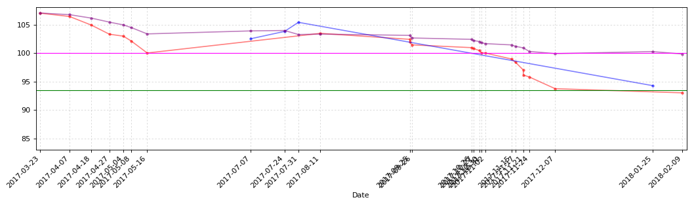


```python
CB_Transaction_Functions.CB_TD_cost_plt(haiyin_CB_TD)
```


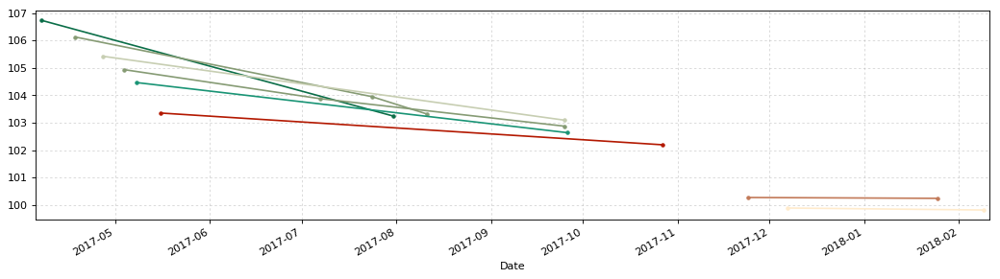


### 光大转债113011


```python
guangda = u'光大转债'
guangda_date = '2017-03-17'
# 2017年11月26日更新三线（100.00，93.88，80.00，112.00）
# 2018年1月21日更新三线
y1 = 103.66
y2 = 98.81
y3 = 80.36
# y3 = 90.36
y4 = 112.00
```


```python
guangda_CB_TD = CB_Transaction_Functions.CB_Transaction_Data(guangda)
guangda_CB_TD
```


<div>


<table border="1" class="dataframe">
  <thead>
    <tr style="text-align: right;">
      <th></th>
      <th>发生日期</th>
      <th>业务名称</th>
      <th>证券代码</th>
      <th>证券名称</th>
      <th>成交均价</th>
      <th>成交数量</th>
      <th>成交金额</th>
      <th>股份余额</th>
      <th>手续费</th>
      <th>发生金额</th>
      <th>成本</th>
    </tr>
  </thead>
  <tbody>
    <tr>
      <th>0</th>
      <td>2017-03-16</td>
      <td>配股权证到帐</td>
      <td>764818</td>
      <td>光大转债</td>
      <td>100.00</td>
      <td>10</td>
      <td>1000.0</td>
      <td>10</td>
      <td>0.0</td>
      <td>-1000.0</td>
      <td>100.000000</td>
    </tr>
    <tr>
      <th>1</th>
      <td>2017-04-19</td>
      <td>证券买入清算</td>
      <td>113011</td>
      <td>光大转债</td>
      <td>101.25</td>
      <td>10</td>
      <td>1012.5</td>
      <td>20</td>
      <td>1.0</td>
      <td>-1013.5</td>
      <td>100.675000</td>
    </tr>
    <tr>
      <th>2</th>
      <td>2017-05-08</td>
      <td>证券买入清算</td>
      <td>113011</td>
      <td>光大转债</td>
      <td>100.11</td>
      <td>10</td>
      <td>1001.1</td>
      <td>30</td>
      <td>1.0</td>
      <td>-1002.1</td>
      <td>100.520000</td>
    </tr>
    <tr>
      <th>3</th>
      <td>2017-05-08</td>
      <td>证券买入清算</td>
      <td>113011</td>
      <td>光大转债</td>
      <td>99.90</td>
      <td>10</td>
      <td>999.0</td>
      <td>40</td>
      <td>1.0</td>
      <td>-1000.0</td>
      <td>100.390000</td>
    </tr>
    <tr>
      <th>4</th>
      <td>2017-06-28</td>
      <td>证券卖出清算</td>
      <td>113011</td>
      <td>光大转债</td>
      <td>106.01</td>
      <td>-20</td>
      <td>2120.2</td>
      <td>20</td>
      <td>1.0</td>
      <td>2119.2</td>
      <td>94.820000</td>
    </tr>
    <tr>
      <th>5</th>
      <td>2017-07-13</td>
      <td>证券卖出清算</td>
      <td>113011</td>
      <td>光大转债</td>
      <td>107.22</td>
      <td>-10</td>
      <td>1072.2</td>
      <td>10</td>
      <td>1.0</td>
      <td>1071.2</td>
      <td>82.520000</td>
    </tr>
    <tr>
      <th>6</th>
      <td>2017-07-17</td>
      <td>证券卖出清算</td>
      <td>113011</td>
      <td>光大转债</td>
      <td>110.95</td>
      <td>-10</td>
      <td>1109.5</td>
      <td>0</td>
      <td>1.0</td>
      <td>1108.5</td>
      <td>-inf</td>
    </tr>
  </tbody>
</table>
</div>


```python
guangda_CB_TD_cost = CB_Transaction_Functions.CB_TD_cost(guangda,guangda_CB_TD,guangda_date)
guangda_CB_TD_cost.round(3)
```


<div>


<table border="1" class="dataframe">
  <thead>
    <tr style="text-align: right;">
      <th></th>
      <th>持仓金额</th>
      <th>成交数量</th>
      <th>持仓成本</th>
      <th>起息日</th>
      <th>剩余年限</th>
      <th>证券代码</th>
      <th>成交金额</th>
      <th>买卖数量</th>
      <th>交易时间</th>
    </tr>
  </thead>
  <tbody>
    <tr>
      <th>光大转债</th>
      <td>-283.3</td>
      <td>0.0</td>
      <td>0</td>
      <td>2017-03-17</td>
      <td>4年320天</td>
      <td>113011</td>
      <td>110.95</td>
      <td>-10</td>
      <td>2017-07-17</td>
    </tr>
  </tbody>
</table>
</div>


```python
CB_Transaction_Functions.CB_TD_plt(guangda_CB_TD,y1,y2,y3,y4)
```


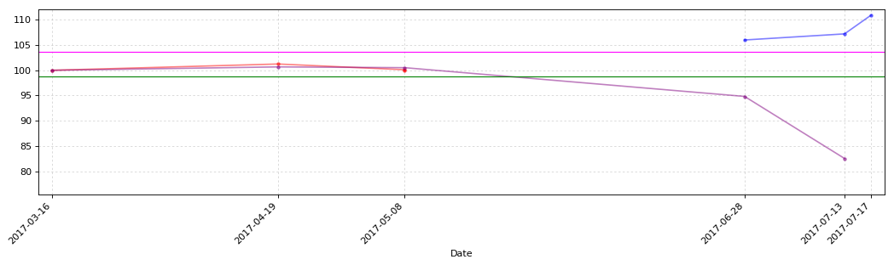


```python
CB_Transaction_Functions.CB_TD_cost_plt(guangda_CB_TD)
```


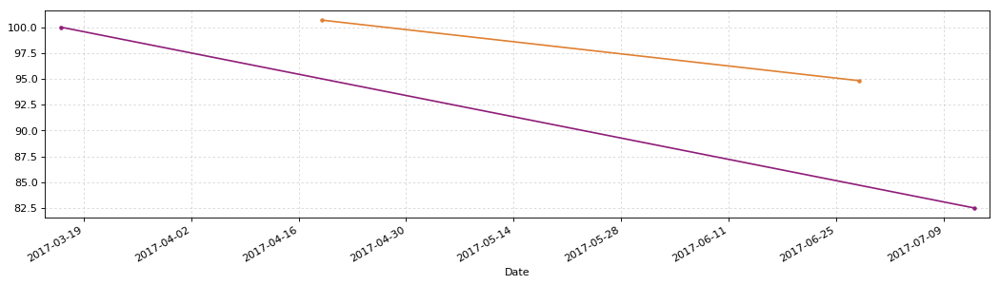


### 模塑转债127004


```python
mosu = u'模塑转债'
mosu_date = '2017-06-02'
# 2017年11月26日更新三线（110.00，100.00，93.59，120.00）
# 2018年1月21日更新三线
y1 = 101.80
y2 = 94.12
y3 = 90.13
y4 = 120.00
```


```python
mosu_CB_TD = CB_Transaction_Functions.CB_Transaction_Data(mosu)
mosu_CB_TD
```


<div>


<table border="1" class="dataframe">
  <thead>
    <tr style="text-align: right;">
      <th></th>
      <th>发生日期</th>
      <th>业务名称</th>
      <th>证券代码</th>
      <th>证券名称</th>
      <th>成交均价</th>
      <th>成交数量</th>
      <th>成交金额</th>
      <th>股份余额</th>
      <th>手续费</th>
      <th>发生金额</th>
      <th>成本</th>
    </tr>
  </thead>
  <tbody>
    <tr>
      <th>0</th>
      <td>2017-10-30</td>
      <td>证券买入清算</td>
      <td>127004</td>
      <td>模塑转债</td>
      <td>106.201</td>
      <td>10</td>
      <td>1062.01</td>
      <td>10</td>
      <td>0.21</td>
      <td>-1062.22</td>
      <td>106.222000</td>
    </tr>
    <tr>
      <th>1</th>
      <td>2017-10-31</td>
      <td>证券买入清算</td>
      <td>127004</td>
      <td>模塑转债</td>
      <td>105.861</td>
      <td>10</td>
      <td>1058.61</td>
      <td>20</td>
      <td>0.21</td>
      <td>-1058.82</td>
      <td>106.052000</td>
    </tr>
    <tr>
      <th>2</th>
      <td>2017-11-02</td>
      <td>证券买入清算</td>
      <td>127004</td>
      <td>模塑转债</td>
      <td>105.015</td>
      <td>10</td>
      <td>1050.15</td>
      <td>30</td>
      <td>0.21</td>
      <td>-1050.36</td>
      <td>105.713333</td>
    </tr>
    <tr>
      <th>3</th>
      <td>2017-11-03</td>
      <td>证券买入清算</td>
      <td>127004</td>
      <td>模塑转债</td>
      <td>104.301</td>
      <td>10</td>
      <td>1043.01</td>
      <td>40</td>
      <td>0.21</td>
      <td>-1043.22</td>
      <td>105.365500</td>
    </tr>
    <tr>
      <th>4</th>
      <td>2017-11-06</td>
      <td>证券买入清算</td>
      <td>127004</td>
      <td>模塑转债</td>
      <td>103.467</td>
      <td>10</td>
      <td>1034.67</td>
      <td>50</td>
      <td>0.21</td>
      <td>-1034.88</td>
      <td>104.990000</td>
    </tr>
    <tr>
      <th>5</th>
      <td>2017-11-07</td>
      <td>证券买入清算</td>
      <td>127004</td>
      <td>模塑转债</td>
      <td>101.920</td>
      <td>20</td>
      <td>2038.40</td>
      <td>70</td>
      <td>0.41</td>
      <td>-2038.81</td>
      <td>104.118714</td>
    </tr>
    <tr>
      <th>6</th>
      <td>2017-11-24</td>
      <td>证券买入清算</td>
      <td>127004</td>
      <td>模塑转债</td>
      <td>99.974</td>
      <td>10</td>
      <td>999.74</td>
      <td>80</td>
      <td>0.20</td>
      <td>-999.94</td>
      <td>103.603125</td>
    </tr>
    <tr>
      <th>7</th>
      <td>2017-11-27</td>
      <td>证券买入清算</td>
      <td>127004</td>
      <td>模塑转债</td>
      <td>98.972</td>
      <td>10</td>
      <td>989.72</td>
      <td>90</td>
      <td>0.20</td>
      <td>-989.92</td>
      <td>103.090778</td>
    </tr>
    <tr>
      <th>8</th>
      <td>2017-11-29</td>
      <td>证券买入清算</td>
      <td>127004</td>
      <td>模塑转债</td>
      <td>97.050</td>
      <td>20</td>
      <td>1941.00</td>
      <td>110</td>
      <td>0.39</td>
      <td>-1941.39</td>
      <td>101.996000</td>
    </tr>
    <tr>
      <th>9</th>
      <td>2017-12-07</td>
      <td>证券买入清算</td>
      <td>127004</td>
      <td>模塑转债</td>
      <td>93.988</td>
      <td>10</td>
      <td>939.88</td>
      <td>120</td>
      <td>0.19</td>
      <td>-940.07</td>
      <td>101.330250</td>
    </tr>
    <tr>
      <th>10</th>
      <td>2018-01-25</td>
      <td>证券卖出清算</td>
      <td>127004</td>
      <td>模塑转债</td>
      <td>96.582</td>
      <td>-10</td>
      <td>965.82</td>
      <td>110</td>
      <td>0.19</td>
      <td>965.63</td>
      <td>101.763636</td>
    </tr>
  </tbody>
</table>
</div>


```python
mosu_CB_TD_cost = CB_Transaction_Functions.CB_TD_cost(mosu,mosu_CB_TD,mosu_date)
mosu_CB_TD_cost.round(3)
```


<div>


<table border="1" class="dataframe">
  <thead>
    <tr style="text-align: right;">
      <th></th>
      <th>持仓金额</th>
      <th>成交数量</th>
      <th>持仓成本</th>
      <th>起息日</th>
      <th>剩余年限</th>
      <th>证券代码</th>
      <th>成交金额</th>
      <th>买卖数量</th>
      <th>交易时间</th>
    </tr>
  </thead>
  <tbody>
    <tr>
      <th>模塑转债</th>
      <td>11194.0</td>
      <td>110.0</td>
      <td>101.764</td>
      <td>2017-06-02</td>
      <td>5年31天</td>
      <td>127004</td>
      <td>96.582</td>
      <td>-10</td>
      <td>2018-01-25</td>
    </tr>
  </tbody>
</table>
</div>


```python
CB_Transaction_Functions.CB_TD_plt(mosu_CB_TD,y1,y2,y3,y4)
```


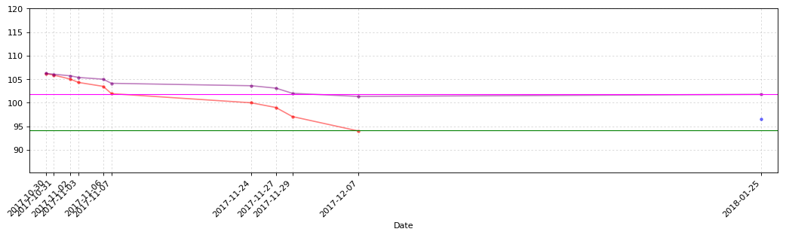


```python
CB_Transaction_Functions.CB_TD_cost_plt(mosu_CB_TD)
```


### 江南转债113010


```python
jiangnan = u'江南转债'
jiangnan_date = '2016-03-18'
# 2017年11月26日更新三线（108.00，100.00，91.93）
# 2018年1月21日更新三线
y1 = 103
y2 = 99.43
y3 = 92.59
y4 = 110.00
```


```python
jiangnan_CB_TD = CB_Transaction_Functions.CB_Transaction_Data(jiangnan)
jiangnan_CB_TD
```


<div>


<table border="1" class="dataframe">
  <thead>
    <tr style="text-align: right;">
      <th></th>
      <th>发生日期</th>
      <th>业务名称</th>
      <th>证券代码</th>
      <th>证券名称</th>
      <th>成交均价</th>
      <th>成交数量</th>
      <th>成交金额</th>
      <th>股份余额</th>
      <th>手续费</th>
      <th>发生金额</th>
      <th>成本</th>
    </tr>
  </thead>
  <tbody>
    <tr>
      <th>0</th>
      <td>2017-10-26</td>
      <td>证券买入清算</td>
      <td>113010</td>
      <td>江南转债</td>
      <td>105.46</td>
      <td>10</td>
      <td>1054.6</td>
      <td>10</td>
      <td>1.0</td>
      <td>-1055.6</td>
      <td>105.560000</td>
    </tr>
    <tr>
      <th>1</th>
      <td>2017-10-30</td>
      <td>证券买入清算</td>
      <td>113010</td>
      <td>江南转债</td>
      <td>104.75</td>
      <td>10</td>
      <td>1047.5</td>
      <td>20</td>
      <td>1.0</td>
      <td>-1048.5</td>
      <td>105.205000</td>
    </tr>
    <tr>
      <th>2</th>
      <td>2018-01-04</td>
      <td>证券买入清算</td>
      <td>113010</td>
      <td>江南转债</td>
      <td>103.29</td>
      <td>10</td>
      <td>1032.9</td>
      <td>30</td>
      <td>1.0</td>
      <td>-1033.9</td>
      <td>104.600000</td>
    </tr>
    <tr>
      <th>3</th>
      <td>2018-03-22</td>
      <td>债券兑息</td>
      <td>113010</td>
      <td>江南转债</td>
      <td>0.00</td>
      <td>0</td>
      <td>15.0</td>
      <td>0</td>
      <td>3.0</td>
      <td>12.0</td>
      <td>inf</td>
    </tr>
  </tbody>
</table>
</div>


```python
jiangnan_CB_TD_cost = CB_Transaction_Functions.CB_TD_cost(jiangnan,jiangnan_CB_TD,jiangnan_date)
jiangnan_CB_TD_cost.round(3)
```


<div>


<table border="1" class="dataframe">
  <thead>
    <tr style="text-align: right;">
      <th></th>
      <th>持仓金额</th>
      <th>成交数量</th>
      <th>持仓成本</th>
      <th>起息日</th>
      <th>剩余年限</th>
      <th>证券代码</th>
      <th>成交金额</th>
      <th>买卖数量</th>
      <th>交易时间</th>
    </tr>
  </thead>
  <tbody>
    <tr>
      <th>江南转债</th>
      <td>3126.0</td>
      <td>30.0</td>
      <td>104.2</td>
      <td>2016-03-18</td>
      <td>3年321天</td>
      <td>113010</td>
      <td>0.0</td>
      <td>0</td>
      <td>2018-03-22</td>
    </tr>
  </tbody>
</table>
</div>


```python
# CB_Transaction_Functions.CB_TD_plt(jiangnan_CB_TD,y1,y2,y3,y4)
```


```python
# CB_Transaction_Functions.CB_TD_cost_plt(jiangnan_CB_TD)
```

### 电气转债113008


```python
dianqi = u'电气转债'
dianqi_date = '2015-02-02'
# 2017年11月26日更新三线（109.80，100.00，94.61，110.00）
# 2018年1月21日更新三线
y1 = 103.00
y2 = 100.00
y3 = 95.32
y4 = 110.00
```


```python
dianqi_CB_TD = CB_Transaction_Functions.CB_Transaction_Data(dianqi)
dianqi_CB_TD
```


<div>


<table border="1" class="dataframe">
  <thead>
    <tr style="text-align: right;">
      <th></th>
      <th>发生日期</th>
      <th>业务名称</th>
      <th>证券代码</th>
      <th>证券名称</th>
      <th>成交均价</th>
      <th>成交数量</th>
      <th>成交金额</th>
      <th>股份余额</th>
      <th>手续费</th>
      <th>发生金额</th>
      <th>成本</th>
    </tr>
  </thead>
  <tbody>
    <tr>
      <th>0</th>
      <td>2017-11-03</td>
      <td>证券买入清算</td>
      <td>113008</td>
      <td>电气转债</td>
      <td>105.69</td>
      <td>10</td>
      <td>1056.9</td>
      <td>10</td>
      <td>1.0</td>
      <td>-1057.9</td>
      <td>105.790000</td>
    </tr>
    <tr>
      <th>1</th>
      <td>2017-11-15</td>
      <td>证券买入清算</td>
      <td>113008</td>
      <td>电气转债</td>
      <td>102.91</td>
      <td>20</td>
      <td>2058.2</td>
      <td>30</td>
      <td>1.0</td>
      <td>-2059.2</td>
      <td>103.903333</td>
    </tr>
    <tr>
      <th>2</th>
      <td>2017-11-21</td>
      <td>证券买入清算</td>
      <td>113008</td>
      <td>电气转债</td>
      <td>101.56</td>
      <td>10</td>
      <td>1015.6</td>
      <td>40</td>
      <td>1.0</td>
      <td>-1016.6</td>
      <td>103.342500</td>
    </tr>
    <tr>
      <th>3</th>
      <td>2017-11-24</td>
      <td>证券买入清算</td>
      <td>113008</td>
      <td>电气转债</td>
      <td>100.85</td>
      <td>10</td>
      <td>1008.5</td>
      <td>50</td>
      <td>1.0</td>
      <td>-1009.5</td>
      <td>102.864000</td>
    </tr>
    <tr>
      <th>4</th>
      <td>2017-11-29</td>
      <td>证券买入清算</td>
      <td>113008</td>
      <td>电气转债</td>
      <td>100.02</td>
      <td>10</td>
      <td>1000.2</td>
      <td>60</td>
      <td>1.0</td>
      <td>-1001.2</td>
      <td>102.406667</td>
    </tr>
    <tr>
      <th>5</th>
      <td>2018-01-25</td>
      <td>证券卖出清算</td>
      <td>113008</td>
      <td>电气转债</td>
      <td>102.09</td>
      <td>-10</td>
      <td>1020.9</td>
      <td>50</td>
      <td>1.0</td>
      <td>1019.9</td>
      <td>102.490000</td>
    </tr>
    <tr>
      <th>6</th>
      <td>2018-02-02</td>
      <td>证券买入清算</td>
      <td>113008</td>
      <td>电气转债</td>
      <td>100.01</td>
      <td>10</td>
      <td>1000.1</td>
      <td>60</td>
      <td>1.0</td>
      <td>-1001.1</td>
      <td>102.093333</td>
    </tr>
    <tr>
      <th>7</th>
      <td>2018-02-07</td>
      <td>债券兑息</td>
      <td>113008</td>
      <td>电气转债</td>
      <td>0.00</td>
      <td>0</td>
      <td>50.0</td>
      <td>0</td>
      <td>10.0</td>
      <td>40.0</td>
      <td>inf</td>
    </tr>
  </tbody>
</table>
</div>


```python
dianqi_CB_TD_cost = CB_Transaction_Functions.CB_TD_cost(dianqi,dianqi_CB_TD,dianqi_date)
dianqi_CB_TD_cost.round(3)
```


<div>


<table border="1" class="dataframe">
  <thead>
    <tr style="text-align: right;">
      <th></th>
      <th>持仓金额</th>
      <th>成交数量</th>
      <th>持仓成本</th>
      <th>起息日</th>
      <th>剩余年限</th>
      <th>证券代码</th>
      <th>成交金额</th>
      <th>买卖数量</th>
      <th>交易时间</th>
    </tr>
  </thead>
  <tbody>
    <tr>
      <th>电气转债</th>
      <td>6085.6</td>
      <td>60.0</td>
      <td>101.427</td>
      <td>2015-02-02</td>
      <td>2年276天</td>
      <td>113008</td>
      <td>0.0</td>
      <td>0</td>
      <td>2018-02-07</td>
    </tr>
  </tbody>
</table>
</div>


```python
CB_Transaction_Functions.CB_TD_plt(dianqi_CB_TD,y1,y2,y3,y4)
```


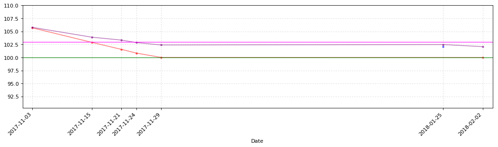


```python
CB_Transaction_Functions.CB_TD_cost_plt(dianqi_CB_TD)
```


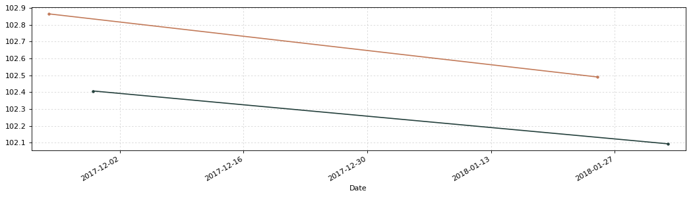


### 格力转债110030


```python
geli = u'格力转债'
geli_date = '2014-12-25'
# 2017年11月26日更新三线（108.00，103.00，100.00，110.00）
# 2018年1月21日更新三线
y1 = 107.20
y2 = 103.00
y3 = 100.00
y4 = 110.00
```

[格力地产可转债募集说明书要点](https://github.com/bitbyte27/PythonQuant/blob/master/ConvertibleBond/CB_specification/%E6%A0%BC%E5%8A%9B%E5%9C%B0%E4%BA%A7%E5%8F%AF%E8%BD%AC%E5%80%BA%E5%8B%9F%E9%9B%86%E8%AF%B4%E6%98%8E%E4%B9%A6%E8%A6%81%E7%82%B9.md)


```python
geli_CB_TD = CB_Transaction_Functions.CB_Transaction_Data(geli)
geli_CB_TD
```


<div>


<table border="1" class="dataframe">
  <thead>
    <tr style="text-align: right;">
      <th></th>
      <th>发生日期</th>
      <th>业务名称</th>
      <th>证券代码</th>
      <th>证券名称</th>
      <th>成交均价</th>
      <th>成交数量</th>
      <th>成交金额</th>
      <th>股份余额</th>
      <th>手续费</th>
      <th>发生金额</th>
      <th>成本</th>
    </tr>
  </thead>
  <tbody>
    <tr>
      <th>0</th>
      <td>2017-11-21</td>
      <td>证券买入清算</td>
      <td>110030</td>
      <td>格力转债</td>
      <td>107.35</td>
      <td>10</td>
      <td>1073.5</td>
      <td>10</td>
      <td>1.0</td>
      <td>-1074.5</td>
      <td>107.450000</td>
    </tr>
    <tr>
      <th>1</th>
      <td>2017-11-21</td>
      <td>证券买入清算</td>
      <td>110030</td>
      <td>格力转债</td>
      <td>106.61</td>
      <td>10</td>
      <td>1066.1</td>
      <td>20</td>
      <td>1.0</td>
      <td>-1067.1</td>
      <td>107.080000</td>
    </tr>
    <tr>
      <th>2</th>
      <td>2017-12-27</td>
      <td>证券买入清算</td>
      <td>110030</td>
      <td>格力转债</td>
      <td>104.89</td>
      <td>10</td>
      <td>1048.9</td>
      <td>30</td>
      <td>1.0</td>
      <td>-1049.9</td>
      <td>106.383333</td>
    </tr>
    <tr>
      <th>3</th>
      <td>2017-12-28</td>
      <td>债券兑息</td>
      <td>110030</td>
      <td>格力转债</td>
      <td>0.00</td>
      <td>0</td>
      <td>20.0</td>
      <td>0</td>
      <td>4.0</td>
      <td>16.0</td>
      <td>inf</td>
    </tr>
    <tr>
      <th>4</th>
      <td>2018-01-25</td>
      <td>证券卖出清算</td>
      <td>110030</td>
      <td>格力转债</td>
      <td>111.03</td>
      <td>-10</td>
      <td>1110.3</td>
      <td>20</td>
      <td>1.0</td>
      <td>1109.3</td>
      <td>103.310000</td>
    </tr>
    <tr>
      <th>5</th>
      <td>2018-02-07</td>
      <td>证券买入清算</td>
      <td>110030</td>
      <td>格力转债</td>
      <td>106.50</td>
      <td>10</td>
      <td>1065.0</td>
      <td>30</td>
      <td>1.0</td>
      <td>-1066.0</td>
      <td>104.406667</td>
    </tr>
  </tbody>
</table>
</div>


```python
geli_CB_TD_cost = CB_Transaction_Functions.CB_TD_cost(geli,geli_CB_TD,geli_date)
geli_CB_TD_cost.round(3)
```


<div>


<table border="1" class="dataframe">
  <thead>
    <tr style="text-align: right;">
      <th></th>
      <th>持仓金额</th>
      <th>成交数量</th>
      <th>持仓成本</th>
      <th>起息日</th>
      <th>剩余年限</th>
      <th>证券代码</th>
      <th>成交金额</th>
      <th>买卖数量</th>
      <th>交易时间</th>
    </tr>
  </thead>
  <tbody>
    <tr>
      <th>格力转债</th>
      <td>3132.2</td>
      <td>30.0</td>
      <td>104.407</td>
      <td>2014-12-25</td>
      <td>2年237天</td>
      <td>110030</td>
      <td>106.5</td>
      <td>10</td>
      <td>2018-02-07</td>
    </tr>
  </tbody>
</table>
</div>


```python
CB_Transaction_Functions.CB_TD_plt(geli_CB_TD,y1,y2,y3,y4)
```


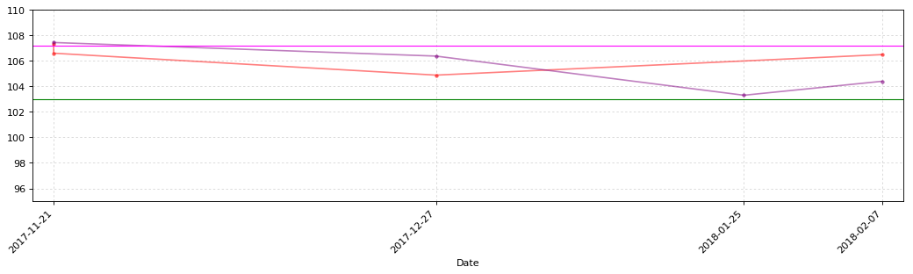


```python
CB_Transaction_Functions.CB_TD_cost_plt(geli_CB_TD)
```


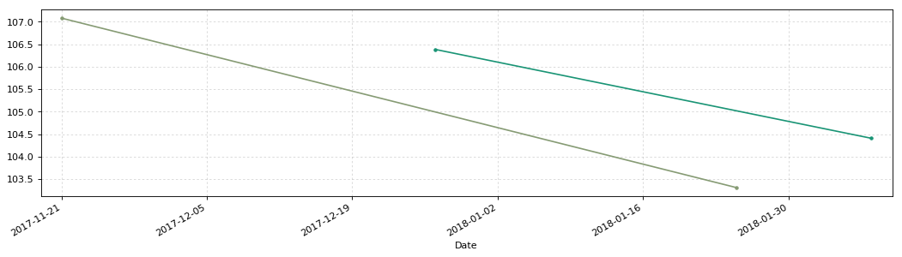


### 久其转债128015


```python
jiuqi = u'久其转债'
jiuqi_date = '2017-06-08'
# 2017年11月26日更新三线（110.00，103.68，91.36，120.00）
# 2018年1月21日更新三线
y1 = 103.98
y2 = 96.14
y3 = 91.88
y4 = 120.00
```


```python
jiuqi_CB_TD = CB_Transaction_Functions.CB_Transaction_Data(jiuqi)
jiuqi_CB_TD
```


<div>


<table border="1" class="dataframe">
  <thead>
    <tr style="text-align: right;">
      <th></th>
      <th>发生日期</th>
      <th>业务名称</th>
      <th>证券代码</th>
      <th>证券名称</th>
      <th>成交均价</th>
      <th>成交数量</th>
      <th>成交金额</th>
      <th>股份余额</th>
      <th>手续费</th>
      <th>发生金额</th>
      <th>成本</th>
    </tr>
  </thead>
  <tbody>
    <tr>
      <th>0</th>
      <td>2017-11-27</td>
      <td>证券买入清算</td>
      <td>128015</td>
      <td>久其转债</td>
      <td>100.890</td>
      <td>10</td>
      <td>1008.90</td>
      <td>10</td>
      <td>0.20</td>
      <td>-1009.10</td>
      <td>100.910000</td>
    </tr>
    <tr>
      <th>1</th>
      <td>2017-11-29</td>
      <td>证券买入清算</td>
      <td>128015</td>
      <td>久其转债</td>
      <td>99.959</td>
      <td>10</td>
      <td>999.59</td>
      <td>20</td>
      <td>0.20</td>
      <td>-999.79</td>
      <td>100.444500</td>
    </tr>
    <tr>
      <th>2</th>
      <td>2017-12-07</td>
      <td>证券买入清算</td>
      <td>128015</td>
      <td>久其转债</td>
      <td>96.250</td>
      <td>10</td>
      <td>962.50</td>
      <td>30</td>
      <td>0.19</td>
      <td>-962.69</td>
      <td>99.052667</td>
    </tr>
    <tr>
      <th>3</th>
      <td>2018-01-04</td>
      <td>证券卖出清算</td>
      <td>128015</td>
      <td>久其转债</td>
      <td>97.278</td>
      <td>-10</td>
      <td>972.78</td>
      <td>20</td>
      <td>0.19</td>
      <td>972.59</td>
      <td>99.949500</td>
    </tr>
    <tr>
      <th>4</th>
      <td>2018-01-25</td>
      <td>证券卖出清算</td>
      <td>128015</td>
      <td>久其转债</td>
      <td>100.849</td>
      <td>-10</td>
      <td>1008.49</td>
      <td>10</td>
      <td>0.20</td>
      <td>1008.29</td>
      <td>99.070000</td>
    </tr>
    <tr>
      <th>5</th>
      <td>2018-01-26</td>
      <td>证券卖出清算</td>
      <td>128015</td>
      <td>久其转债</td>
      <td>102.450</td>
      <td>-10</td>
      <td>1024.50</td>
      <td>0</td>
      <td>0.20</td>
      <td>1024.30</td>
      <td>-inf</td>
    </tr>
    <tr>
      <th>6</th>
      <td>2018-01-31</td>
      <td>证券买入清算</td>
      <td>128015</td>
      <td>久其转债</td>
      <td>98.010</td>
      <td>10</td>
      <td>980.10</td>
      <td>10</td>
      <td>0.20</td>
      <td>-980.30</td>
      <td>94.670000</td>
    </tr>
    <tr>
      <th>7</th>
      <td>2018-02-14</td>
      <td>证券卖出清算</td>
      <td>128015</td>
      <td>久其转债</td>
      <td>100.097</td>
      <td>-10</td>
      <td>1000.97</td>
      <td>0</td>
      <td>0.20</td>
      <td>1000.77</td>
      <td>-inf</td>
    </tr>
  </tbody>
</table>
</div>


```python
jiuqi_CB_TD_cost = CB_Transaction_Functions.CB_TD_cost(jiuqi,jiuqi_CB_TD,jiuqi_date)
jiuqi_CB_TD_cost.round(3)
```


<div>


<table border="1" class="dataframe">
  <thead>
    <tr style="text-align: right;">
      <th></th>
      <th>持仓金额</th>
      <th>成交数量</th>
      <th>持仓成本</th>
      <th>起息日</th>
      <th>剩余年限</th>
      <th>证券代码</th>
      <th>成交金额</th>
      <th>买卖数量</th>
      <th>交易时间</th>
    </tr>
  </thead>
  <tbody>
    <tr>
      <th>久其转债</th>
      <td>-54.07</td>
      <td>0.0</td>
      <td>0</td>
      <td>2017-06-08</td>
      <td>5年38天</td>
      <td>128015</td>
      <td>100.097</td>
      <td>-10</td>
      <td>2018-02-14</td>
    </tr>
  </tbody>
</table>
</div>


```python
CB_Transaction_Functions.CB_TD_plt(jiuqi_CB_TD,y1,y2,y3,y4)
```


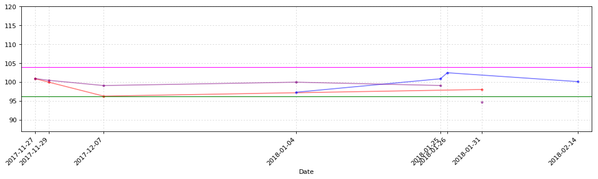


```python
CB_Transaction_Functions.CB_TD_cost_plt(jiuqi_CB_TD)
```


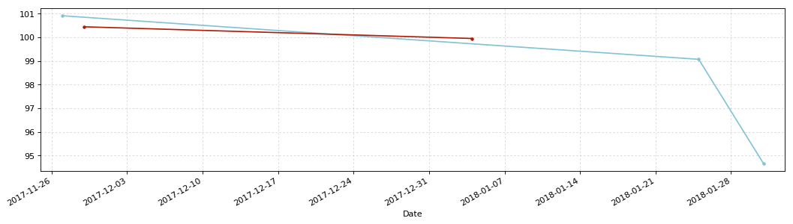


### 嘉澳转债113502


```python
jiaao = u'嘉澳转债'
jiaao_date = '2017-11-10'
# 2018年1月21日更新三线
y1 = 101.80
y2 = 95.58
y3 = 86.98
y4 = 120.00
```


```python
jiaao_CB_TD = CB_Transaction_Functions.CB_Transaction_Data(jiaao)
jiaao_CB_TD
```


<div>


<table border="1" class="dataframe">
  <thead>
    <tr style="text-align: right;">
      <th></th>
      <th>发生日期</th>
      <th>业务名称</th>
      <th>证券代码</th>
      <th>证券名称</th>
      <th>成交均价</th>
      <th>成交数量</th>
      <th>成交金额</th>
      <th>股份余额</th>
      <th>手续费</th>
      <th>发生金额</th>
      <th>成本</th>
    </tr>
  </thead>
  <tbody>
    <tr>
      <th>0</th>
      <td>2017-11-29</td>
      <td>证券买入清算</td>
      <td>113502</td>
      <td>嘉澳转债</td>
      <td>101.78</td>
      <td>10</td>
      <td>1017.8</td>
      <td>10</td>
      <td>1.0</td>
      <td>-1018.8</td>
      <td>101.88</td>
    </tr>
    <tr>
      <th>1</th>
      <td>2017-12-07</td>
      <td>证券买入清算</td>
      <td>113502</td>
      <td>嘉澳转债</td>
      <td>96.12</td>
      <td>10</td>
      <td>961.2</td>
      <td>20</td>
      <td>1.0</td>
      <td>-962.2</td>
      <td>99.05</td>
    </tr>
  </tbody>
</table>
</div>


```python
jiaao_CB_TD_cost = CB_Transaction_Functions.CB_TD_cost(jiaao,jiaao_CB_TD,jiaao_date)
jiaao_CB_TD_cost.round(3)
```


<div>


<table border="1" class="dataframe">
  <thead>
    <tr style="text-align: right;">
      <th></th>
      <th>持仓金额</th>
      <th>成交数量</th>
      <th>持仓成本</th>
      <th>起息日</th>
      <th>剩余年限</th>
      <th>证券代码</th>
      <th>成交金额</th>
      <th>买卖数量</th>
      <th>交易时间</th>
    </tr>
  </thead>
  <tbody>
    <tr>
      <th>嘉澳转债</th>
      <td>1981.0</td>
      <td>20.0</td>
      <td>99.05</td>
      <td>2017-11-10</td>
      <td>5年192天</td>
      <td>113502</td>
      <td>96.12</td>
      <td>10</td>
      <td>2017-12-07</td>
    </tr>
  </tbody>
</table>
</div>


```python
# CB_Transaction_Functions.CB_TD_plt(jiaao_CB_TD,y1,y2,y3,y4)
```


```python
# CB_Transaction_Functions.CB_TD_cost_plt(jiaao_CB_TD)
```

### 小康转债113016


```python
xiaokang = u'小康转债'
xiaokang_date = '2017-11-06'
# 2018年1月21日更新三线
y1 = 100.00
y2 = 89.35
y3 = 85
y4 = 120.00
```


```python
xiaokang_CB_TD = CB_Transaction_Functions.CB_Transaction_Data(xiaokang)
xiaokang_CB_TD
```


<div>


<table border="1" class="dataframe">
  <thead>
    <tr style="text-align: right;">
      <th></th>
      <th>发生日期</th>
      <th>业务名称</th>
      <th>证券代码</th>
      <th>证券名称</th>
      <th>成交均价</th>
      <th>成交数量</th>
      <th>成交金额</th>
      <th>股份余额</th>
      <th>手续费</th>
      <th>发生金额</th>
      <th>成本</th>
    </tr>
  </thead>
  <tbody>
    <tr>
      <th>0</th>
      <td>2017-11-29</td>
      <td>证券买入清算</td>
      <td>113016</td>
      <td>小康转债</td>
      <td>100.38</td>
      <td>10</td>
      <td>1003.8</td>
      <td>10</td>
      <td>1.0</td>
      <td>-1004.8</td>
      <td>100.480000</td>
    </tr>
    <tr>
      <th>1</th>
      <td>2017-12-07</td>
      <td>证券买入清算</td>
      <td>113016</td>
      <td>小康转债</td>
      <td>96.75</td>
      <td>10</td>
      <td>967.5</td>
      <td>20</td>
      <td>1.0</td>
      <td>-968.5</td>
      <td>98.665000</td>
    </tr>
    <tr>
      <th>2</th>
      <td>2018-01-04</td>
      <td>证券卖出清算</td>
      <td>113016</td>
      <td>小康转债</td>
      <td>100.40</td>
      <td>-20</td>
      <td>2008.0</td>
      <td>0</td>
      <td>1.0</td>
      <td>2007.0</td>
      <td>-inf</td>
    </tr>
    <tr>
      <th>3</th>
      <td>2018-02-01</td>
      <td>证券买入清算</td>
      <td>113016</td>
      <td>小康转债</td>
      <td>95.70</td>
      <td>10</td>
      <td>957.0</td>
      <td>10</td>
      <td>1.0</td>
      <td>-958.0</td>
      <td>92.430000</td>
    </tr>
    <tr>
      <th>4</th>
      <td>2018-03-06</td>
      <td>证券卖出清算</td>
      <td>113016</td>
      <td>小康转债</td>
      <td>98.52</td>
      <td>-10</td>
      <td>985.2</td>
      <td>0</td>
      <td>1.0</td>
      <td>984.2</td>
      <td>-inf</td>
    </tr>
  </tbody>
</table>
</div>


```python
xiaokang_CB_TD_cost = CB_Transaction_Functions.CB_TD_cost(xiaokang,xiaokang_CB_TD,xiaokang_date)
xiaokang_CB_TD_cost.round(3)
```


<div>


<table border="1" class="dataframe">
  <thead>
    <tr style="text-align: right;">
      <th></th>
      <th>持仓金额</th>
      <th>成交数量</th>
      <th>持仓成本</th>
      <th>起息日</th>
      <th>剩余年限</th>
      <th>证券代码</th>
      <th>成交金额</th>
      <th>买卖数量</th>
      <th>交易时间</th>
    </tr>
  </thead>
  <tbody>
    <tr>
      <th>小康转债</th>
      <td>-59.9</td>
      <td>0.0</td>
      <td>0</td>
      <td>2017-11-06</td>
      <td>5年189天</td>
      <td>113016</td>
      <td>98.52</td>
      <td>-10</td>
      <td>2018-03-06</td>
    </tr>
  </tbody>
</table>
</div>


```python
CB_Transaction_Functions.CB_TD_plt(xiaokang_CB_TD,y1,y2,y3,y4)
```


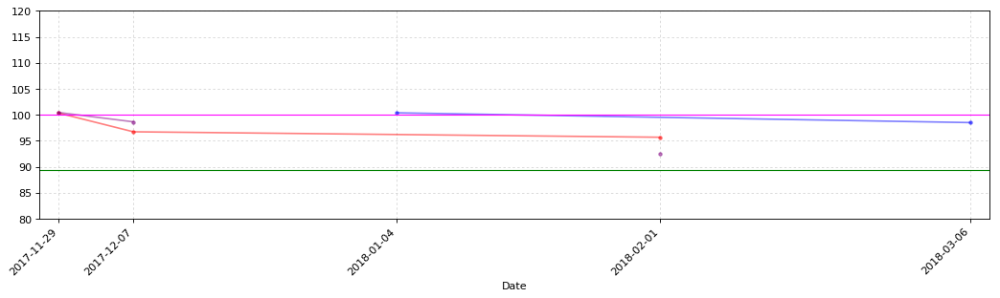


```python
CB_Transaction_Functions.CB_TD_cost_plt(xiaokang_CB_TD)
```


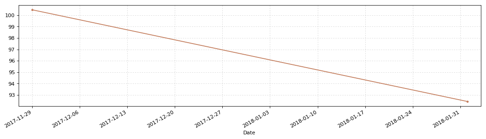


### 时达转债128018


```python
shida = u'时达转债'
shida_date = '2017-11-06'
# 2018年1月21日更新三线
y1 = 93.76
y2 = 85.33
y3 = 80.00
y4 = 120.00
```


```python
shida_CB_TD = CB_Transaction_Functions.CB_Transaction_Data(shida)
shida_CB_TD
```


<div>


<table border="1" class="dataframe">
  <thead>
    <tr style="text-align: right;">
      <th></th>
      <th>发生日期</th>
      <th>业务名称</th>
      <th>证券代码</th>
      <th>证券名称</th>
      <th>成交均价</th>
      <th>成交数量</th>
      <th>成交金额</th>
      <th>股份余额</th>
      <th>手续费</th>
      <th>发生金额</th>
      <th>成本</th>
    </tr>
  </thead>
  <tbody>
    <tr>
      <th>0</th>
      <td>2017-12-07</td>
      <td>证券买入清算</td>
      <td>128018</td>
      <td>时达转债</td>
      <td>96.002</td>
      <td>10</td>
      <td>960.02</td>
      <td>10</td>
      <td>0.19</td>
      <td>-960.21</td>
      <td>96.021000</td>
    </tr>
    <tr>
      <th>1</th>
      <td>2018-01-25</td>
      <td>证券卖出清算</td>
      <td>128018</td>
      <td>时达转债</td>
      <td>97.717</td>
      <td>-10</td>
      <td>977.17</td>
      <td>0</td>
      <td>0.20</td>
      <td>976.97</td>
      <td>-inf</td>
    </tr>
    <tr>
      <th>2</th>
      <td>2018-02-06</td>
      <td>证券买入清算</td>
      <td>128018</td>
      <td>时达转债</td>
      <td>94.980</td>
      <td>10</td>
      <td>949.80</td>
      <td>10</td>
      <td>0.19</td>
      <td>-949.99</td>
      <td>93.323000</td>
    </tr>
    <tr>
      <th>3</th>
      <td>2018-03-13</td>
      <td>证券卖出清算</td>
      <td>128018</td>
      <td>时达转债</td>
      <td>96.650</td>
      <td>-10</td>
      <td>966.50</td>
      <td>0</td>
      <td>0.19</td>
      <td>966.31</td>
      <td>-inf</td>
    </tr>
    <tr>
      <th>4</th>
      <td>2018-03-23</td>
      <td>证券买入清算</td>
      <td>128018</td>
      <td>时达转债</td>
      <td>94.711</td>
      <td>10</td>
      <td>947.11</td>
      <td>10</td>
      <td>0.19</td>
      <td>-947.30</td>
      <td>91.422000</td>
    </tr>
    <tr>
      <th>5</th>
      <td>2018-03-29</td>
      <td>证券卖出清算</td>
      <td>128018</td>
      <td>时达转债</td>
      <td>95.300</td>
      <td>-10</td>
      <td>953.00</td>
      <td>0</td>
      <td>0.19</td>
      <td>952.81</td>
      <td>-inf</td>
    </tr>
    <tr>
      <th>6</th>
      <td>2018-04-24</td>
      <td>证券买入清算</td>
      <td>128018</td>
      <td>时达转债</td>
      <td>93.628</td>
      <td>10</td>
      <td>936.28</td>
      <td>10</td>
      <td>0.19</td>
      <td>-936.47</td>
      <td>89.788000</td>
    </tr>
    <tr>
      <th>7</th>
      <td>2018-04-26</td>
      <td>证券买入清算</td>
      <td>128018</td>
      <td>时达转债</td>
      <td>92.611</td>
      <td>10</td>
      <td>926.11</td>
      <td>20</td>
      <td>0.19</td>
      <td>-926.30</td>
      <td>91.209000</td>
    </tr>
  </tbody>
</table>
</div>


```python
shida_CB_TD_cost = CB_Transaction_Functions.CB_TD_cost(shida,shida_CB_TD,shida_date)
shida_CB_TD_cost.round(3)
```


<div>


<table border="1" class="dataframe">
  <thead>
    <tr style="text-align: right;">
      <th></th>
      <th>持仓金额</th>
      <th>成交数量</th>
      <th>持仓成本</th>
      <th>起息日</th>
      <th>剩余年限</th>
      <th>证券代码</th>
      <th>成交金额</th>
      <th>买卖数量</th>
      <th>交易时间</th>
    </tr>
  </thead>
  <tbody>
    <tr>
      <th>时达转债</th>
      <td>1824.18</td>
      <td>20.0</td>
      <td>91.209</td>
      <td>2017-11-06</td>
      <td>5年189天</td>
      <td>128018</td>
      <td>92.611</td>
      <td>10</td>
      <td>2018-04-26</td>
    </tr>
  </tbody>
</table>
</div>


```python
CB_Transaction_Functions.CB_TD_plt(shida_CB_TD,y1,y2,y3,y4)
```


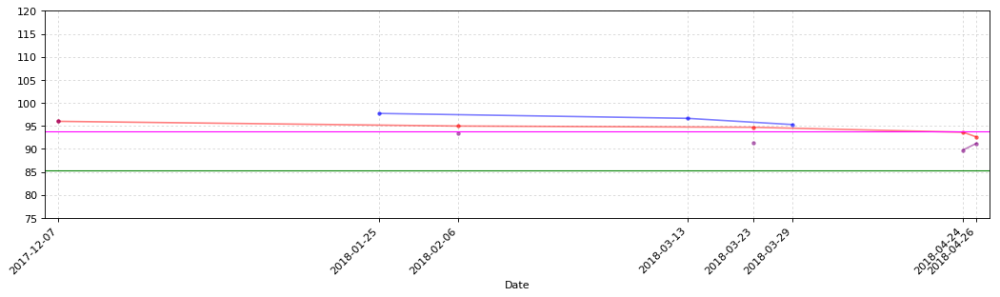


```python
CB_Transaction_Functions.CB_TD_cost_plt(shida_CB_TD)
```


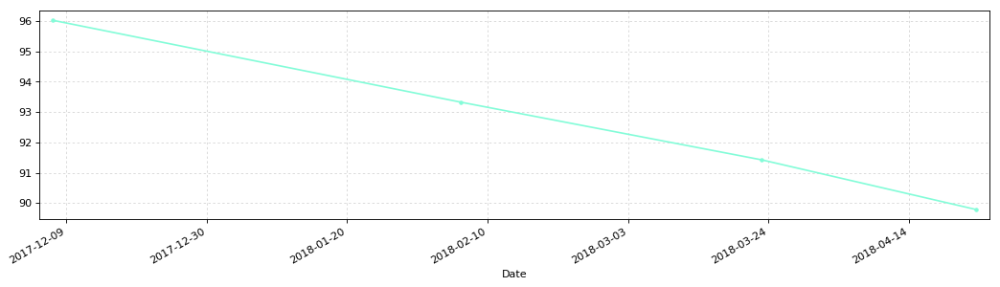


### 骆驼转债113012


```python
luotuo = u'骆驼转债'
luotuo_date = '2017-03-24'
# 2018年1月21日更新三线
y1 = 100.00
y2 = 94.07
y3 = 86.34
y4 = 120.00
```


```python
luotuo_CB_TD = CB_Transaction_Functions.CB_Transaction_Data(luotuo)
luotuo_CB_TD
```


<div>


<table border="1" class="dataframe">
  <thead>
    <tr style="text-align: right;">
      <th></th>
      <th>发生日期</th>
      <th>业务名称</th>
      <th>证券代码</th>
      <th>证券名称</th>
      <th>成交均价</th>
      <th>成交数量</th>
      <th>成交金额</th>
      <th>股份余额</th>
      <th>手续费</th>
      <th>发生金额</th>
      <th>成本</th>
    </tr>
  </thead>
  <tbody>
    <tr>
      <th>0</th>
      <td>2017-12-07</td>
      <td>证券买入清算</td>
      <td>113012</td>
      <td>骆驼转债</td>
      <td>97.38</td>
      <td>10</td>
      <td>973.8</td>
      <td>10</td>
      <td>1.0</td>
      <td>-974.8</td>
      <td>97.480000</td>
    </tr>
    <tr>
      <th>1</th>
      <td>2018-01-25</td>
      <td>证券卖出清算</td>
      <td>113012</td>
      <td>骆驼转债</td>
      <td>98.94</td>
      <td>-10</td>
      <td>989.4</td>
      <td>0</td>
      <td>1.0</td>
      <td>988.4</td>
      <td>-inf</td>
    </tr>
    <tr>
      <th>2</th>
      <td>2018-02-01</td>
      <td>证券买入清算</td>
      <td>113012</td>
      <td>骆驼转债</td>
      <td>95.56</td>
      <td>10</td>
      <td>955.6</td>
      <td>10</td>
      <td>1.0</td>
      <td>-956.6</td>
      <td>94.300000</td>
    </tr>
    <tr>
      <th>3</th>
      <td>2018-03-09</td>
      <td>证券卖出清算</td>
      <td>113012</td>
      <td>骆驼转债</td>
      <td>98.68</td>
      <td>-10</td>
      <td>986.8</td>
      <td>0</td>
      <td>1.0</td>
      <td>985.8</td>
      <td>-inf</td>
    </tr>
  </tbody>
</table>
</div>


```python
luotuo_CB_TD_cost = CB_Transaction_Functions.CB_TD_cost(luotuo,luotuo_CB_TD,luotuo_date)
luotuo_CB_TD_cost.round(3)
```


<div>


<table border="1" class="dataframe">
  <thead>
    <tr style="text-align: right;">
      <th></th>
      <th>持仓金额</th>
      <th>成交数量</th>
      <th>持仓成本</th>
      <th>起息日</th>
      <th>剩余年限</th>
      <th>证券代码</th>
      <th>成交金额</th>
      <th>买卖数量</th>
      <th>交易时间</th>
    </tr>
  </thead>
  <tbody>
    <tr>
      <th>骆驼转债</th>
      <td>-42.8</td>
      <td>0.0</td>
      <td>0</td>
      <td>2017-03-24</td>
      <td>4年326天</td>
      <td>113012</td>
      <td>98.68</td>
      <td>-10</td>
      <td>2018-03-09</td>
    </tr>
  </tbody>
</table>
</div>


```python
CB_Transaction_Functions.CB_TD_plt(luotuo_CB_TD,y1,y2,y3,y4)
```


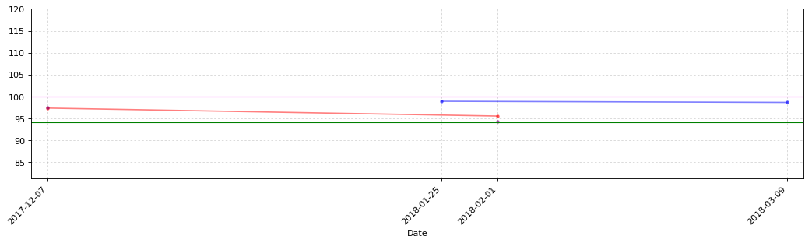


```python
CB_Transaction_Functions.CB_TD_cost_plt(luotuo_CB_TD)
```


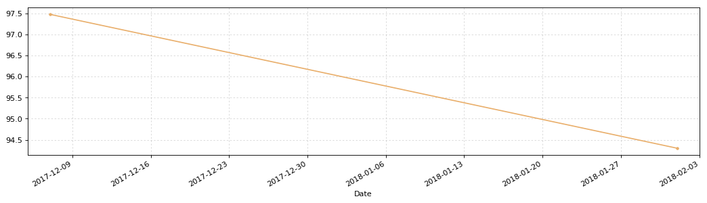


### 蒙电转债110041


```python
mengdian = u'蒙电转债'
mengdian_date = '2017-12-22'
# 2018年1月21日更新三线
y1 = 93.61
y2 = 85.05
y3 = 80.00
y4 = 110.00
```


```python
mengdian_CB_TD = CB_Transaction_Functions.CB_Transaction_Data(mengdian)
mengdian_CB_TD
```


<div>


<table border="1" class="dataframe">
  <thead>
    <tr style="text-align: right;">
      <th></th>
      <th>发生日期</th>
      <th>业务名称</th>
      <th>证券代码</th>
      <th>证券名称</th>
      <th>成交均价</th>
      <th>成交数量</th>
      <th>成交金额</th>
      <th>股份余额</th>
      <th>手续费</th>
      <th>发生金额</th>
      <th>成本</th>
    </tr>
  </thead>
  <tbody>
    <tr>
      <th>0</th>
      <td>2017-12-26</td>
      <td>市值认购资金扣收</td>
      <td>110041</td>
      <td>蒙电转债</td>
      <td>100.00</td>
      <td>10</td>
      <td>1000.0</td>
      <td>10</td>
      <td>0.0</td>
      <td>-1000.0</td>
      <td>100.000000</td>
    </tr>
    <tr>
      <th>1</th>
      <td>2018-01-25</td>
      <td>证券卖出清算</td>
      <td>110041</td>
      <td>蒙电转债</td>
      <td>104.60</td>
      <td>-10</td>
      <td>1046.0</td>
      <td>0</td>
      <td>1.0</td>
      <td>1045.0</td>
      <td>-inf</td>
    </tr>
    <tr>
      <th>2</th>
      <td>2018-02-09</td>
      <td>证券买入清算</td>
      <td>110041</td>
      <td>蒙电转债</td>
      <td>98.35</td>
      <td>10</td>
      <td>983.5</td>
      <td>10</td>
      <td>1.0</td>
      <td>-984.5</td>
      <td>93.950000</td>
    </tr>
    <tr>
      <th>3</th>
      <td>2018-02-13</td>
      <td>证券卖出清算</td>
      <td>110041</td>
      <td>蒙电转债</td>
      <td>100.51</td>
      <td>-10</td>
      <td>1005.1</td>
      <td>0</td>
      <td>1.0</td>
      <td>1004.1</td>
      <td>-inf</td>
    </tr>
  </tbody>
</table>
</div>


```python
mengdian_CB_TD_cost = CB_Transaction_Functions.CB_TD_cost(mengdian,mengdian_CB_TD,mengdian_date)
mengdian_CB_TD_cost.round(3)
```


<div>


<table border="1" class="dataframe">
  <thead>
    <tr style="text-align: right;">
      <th></th>
      <th>持仓金额</th>
      <th>成交数量</th>
      <th>持仓成本</th>
      <th>起息日</th>
      <th>剩余年限</th>
      <th>证券代码</th>
      <th>成交金额</th>
      <th>买卖数量</th>
      <th>交易时间</th>
    </tr>
  </thead>
  <tbody>
    <tr>
      <th>蒙电转债</th>
      <td>-64.6</td>
      <td>0.0</td>
      <td>0</td>
      <td>2017-12-22</td>
      <td>5年235天</td>
      <td>110041</td>
      <td>100.51</td>
      <td>-10</td>
      <td>2018-02-13</td>
    </tr>
  </tbody>
</table>
</div>


```python
CB_Transaction_Functions.CB_TD_plt(mengdian_CB_TD,y1,y2,y3,y4)
```


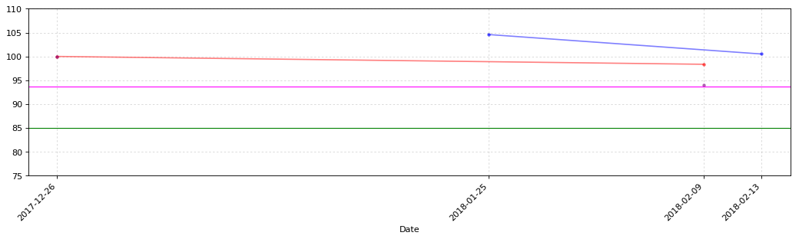


```python
CB_Transaction_Functions.CB_TD_cost_plt(mengdian_CB_TD)
```


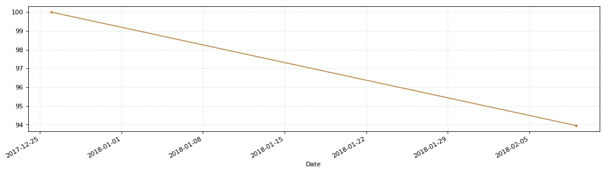


### 吉视转债113017


```python
jishi = u'吉视转债'
jishi_date = '2017-12-27'
# 2018年1月21日更新三线
y1 = 93.09
y2 = 80.86
y3 = 80.00
y4 = 110.00
```


```python
jishi_CB_TD = CB_Transaction_Functions.CB_Transaction_Data(jishi)
jishi_CB_TD
```


<div>


<table border="1" class="dataframe">
  <thead>
    <tr style="text-align: right;">
      <th></th>
      <th>发生日期</th>
      <th>业务名称</th>
      <th>证券代码</th>
      <th>证券名称</th>
      <th>成交均价</th>
      <th>成交数量</th>
      <th>成交金额</th>
      <th>股份余额</th>
      <th>手续费</th>
      <th>发生金额</th>
      <th>成本</th>
    </tr>
  </thead>
  <tbody>
    <tr>
      <th>0</th>
      <td>2017-12-29</td>
      <td>市值认购资金扣收</td>
      <td>113017</td>
      <td>吉视转债</td>
      <td>100.00</td>
      <td>30</td>
      <td>3000.0</td>
      <td>30</td>
      <td>0.0</td>
      <td>-3000.0</td>
      <td>100.00</td>
    </tr>
    <tr>
      <th>1</th>
      <td>2018-01-25</td>
      <td>证券卖出清算</td>
      <td>113017</td>
      <td>吉视转债</td>
      <td>106.50</td>
      <td>-10</td>
      <td>1065.0</td>
      <td>20</td>
      <td>1.0</td>
      <td>1064.0</td>
      <td>96.80</td>
    </tr>
    <tr>
      <th>2</th>
      <td>2018-02-07</td>
      <td>证券买入清算</td>
      <td>113017</td>
      <td>吉视转债</td>
      <td>98.53</td>
      <td>10</td>
      <td>985.3</td>
      <td>30</td>
      <td>1.0</td>
      <td>-986.3</td>
      <td>97.41</td>
    </tr>
    <tr>
      <th>3</th>
      <td>2018-02-26</td>
      <td>证券卖出清算</td>
      <td>113017</td>
      <td>吉视转债</td>
      <td>100.65</td>
      <td>-10</td>
      <td>1006.5</td>
      <td>20</td>
      <td>1.0</td>
      <td>1005.5</td>
      <td>95.84</td>
    </tr>
  </tbody>
</table>
</div>


```python
jishi_CB_TD_cost = CB_Transaction_Functions.CB_TD_cost(jishi,jishi_CB_TD,jishi_date)
jishi_CB_TD_cost.round(3)
```


<div>


<table border="1" class="dataframe">
  <thead>
    <tr style="text-align: right;">
      <th></th>
      <th>持仓金额</th>
      <th>成交数量</th>
      <th>持仓成本</th>
      <th>起息日</th>
      <th>剩余年限</th>
      <th>证券代码</th>
      <th>成交金额</th>
      <th>买卖数量</th>
      <th>交易时间</th>
    </tr>
  </thead>
  <tbody>
    <tr>
      <th>吉视转债</th>
      <td>1916.8</td>
      <td>20.0</td>
      <td>95.84</td>
      <td>2017-12-27</td>
      <td>5年240天</td>
      <td>113017</td>
      <td>100.65</td>
      <td>-10</td>
      <td>2018-02-26</td>
    </tr>
  </tbody>
</table>
</div>


```python
CB_Transaction_Functions.CB_TD_plt(jishi_CB_TD,y1,y2,y3,y4)
```


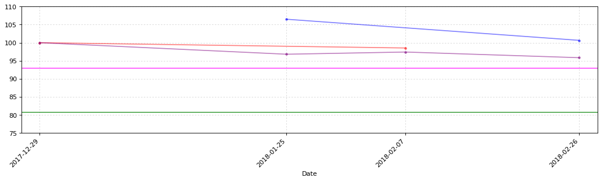


```python
CB_Transaction_Functions.CB_TD_cost_plt(jishi_CB_TD)
```


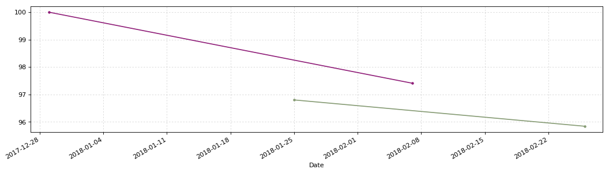


### 迪龙转债128033


```python
dilong = u'迪龙转债'
dilong_date = '2017-12-27'
# 2018年1月21日更新三线
y1 = 106.00
y2 = 100.00
y3 = 88.68
y4 = 110.00
```


```python
dilong_CB_TD = CB_Transaction_Functions.CB_Transaction_Data(dilong)
dilong_CB_TD
```


<div>


<table border="1" class="dataframe">
  <thead>
    <tr style="text-align: right;">
      <th></th>
      <th>发生日期</th>
      <th>业务名称</th>
      <th>证券代码</th>
      <th>证券名称</th>
      <th>成交均价</th>
      <th>成交数量</th>
      <th>成交金额</th>
      <th>股份余额</th>
      <th>手续费</th>
      <th>发生金额</th>
      <th>成本</th>
    </tr>
  </thead>
  <tbody>
    <tr>
      <th>0</th>
      <td>2017-12-29</td>
      <td>市值认购资金扣收</td>
      <td>72658</td>
      <td>迪龙转债</td>
      <td>100.000</td>
      <td>10</td>
      <td>1000.00</td>
      <td>10</td>
      <td>0.00</td>
      <td>-1000.00</td>
      <td>100.000000</td>
    </tr>
    <tr>
      <th>1</th>
      <td>2018-01-29</td>
      <td>证券卖出清算</td>
      <td>128033</td>
      <td>迪龙转债</td>
      <td>103.808</td>
      <td>-10</td>
      <td>1038.08</td>
      <td>0</td>
      <td>0.21</td>
      <td>1037.87</td>
      <td>-inf</td>
    </tr>
    <tr>
      <th>2</th>
      <td>2018-02-09</td>
      <td>证券买入清算</td>
      <td>128033</td>
      <td>迪龙转债</td>
      <td>97.318</td>
      <td>10</td>
      <td>973.18</td>
      <td>10</td>
      <td>0.19</td>
      <td>-973.37</td>
      <td>93.550000</td>
    </tr>
    <tr>
      <th>3</th>
      <td>2018-03-14</td>
      <td>证券卖出清算</td>
      <td>128033</td>
      <td>迪龙转债</td>
      <td>102.000</td>
      <td>-10</td>
      <td>1020.00</td>
      <td>0</td>
      <td>0.20</td>
      <td>1019.80</td>
      <td>-inf</td>
    </tr>
    <tr>
      <th>4</th>
      <td>2018-04-23</td>
      <td>证券买入清算</td>
      <td>128033</td>
      <td>迪龙转债</td>
      <td>97.521</td>
      <td>10</td>
      <td>975.21</td>
      <td>10</td>
      <td>0.20</td>
      <td>-975.41</td>
      <td>89.111000</td>
    </tr>
  </tbody>
</table>
</div>


```python
dilong_CB_TD_cost = CB_Transaction_Functions.CB_TD_cost(dilong,dilong_CB_TD,dilong_date)
dilong_CB_TD_cost.round(3)
```


<div>


<table border="1" class="dataframe">
  <thead>
    <tr style="text-align: right;">
      <th></th>
      <th>持仓金额</th>
      <th>成交数量</th>
      <th>持仓成本</th>
      <th>起息日</th>
      <th>剩余年限</th>
      <th>证券代码</th>
      <th>成交金额</th>
      <th>买卖数量</th>
      <th>交易时间</th>
    </tr>
  </thead>
  <tbody>
    <tr>
      <th>迪龙转债</th>
      <td>891.11</td>
      <td>10.0</td>
      <td>89.111</td>
      <td>2017-12-27</td>
      <td>5年240天</td>
      <td>128033</td>
      <td>97.521</td>
      <td>10</td>
      <td>2018-04-23</td>
    </tr>
  </tbody>
</table>
</div>


```python
CB_Transaction_Functions.CB_TD_plt(dilong_CB_TD,y1,y2,y3,y4)
```


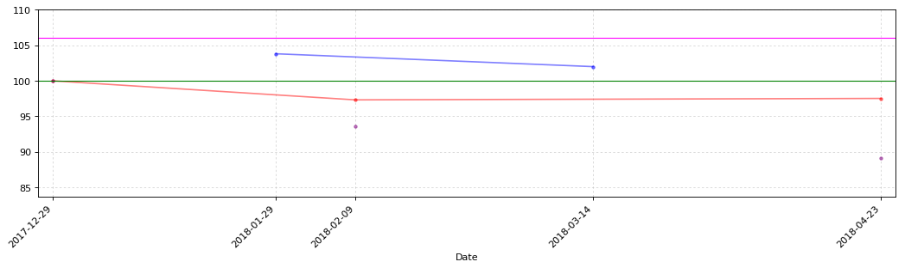


```python
CB_Transaction_Functions.CB_TD_cost_plt(dilong_CB_TD)
```


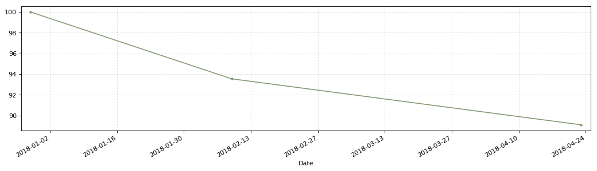


### 永东转债128014


```python
yongdong = u'永东转债'
yongdong_date = '2017-04-17'
# 2018年2月4日更新三线
y1 = 108.00
y2 = 104.76
y3 = 97.22
y4 = 110.00
```


```python
yongdong_CB_TD = CB_Transaction_Functions.CB_Transaction_Data(yongdong)
yongdong_CB_TD
```


<div>


<table border="1" class="dataframe">
  <thead>
    <tr style="text-align: right;">
      <th></th>
      <th>发生日期</th>
      <th>业务名称</th>
      <th>证券代码</th>
      <th>证券名称</th>
      <th>成交均价</th>
      <th>成交数量</th>
      <th>成交金额</th>
      <th>股份余额</th>
      <th>手续费</th>
      <th>发生金额</th>
      <th>成本</th>
    </tr>
  </thead>
  <tbody>
    <tr>
      <th>0</th>
      <td>2018-02-02</td>
      <td>证券买入清算</td>
      <td>128014</td>
      <td>永东转债</td>
      <td>104.407</td>
      <td>10</td>
      <td>1044.07</td>
      <td>10</td>
      <td>0.21</td>
      <td>-1044.28</td>
      <td>104.428000</td>
    </tr>
    <tr>
      <th>1</th>
      <td>2018-02-02</td>
      <td>证券买入清算</td>
      <td>128014</td>
      <td>永东转债</td>
      <td>103.101</td>
      <td>10</td>
      <td>1031.01</td>
      <td>20</td>
      <td>0.21</td>
      <td>-1031.22</td>
      <td>103.775000</td>
    </tr>
    <tr>
      <th>2</th>
      <td>2018-02-06</td>
      <td>证券买入清算</td>
      <td>128014</td>
      <td>永东转债</td>
      <td>102.012</td>
      <td>10</td>
      <td>1020.12</td>
      <td>30</td>
      <td>0.20</td>
      <td>-1020.32</td>
      <td>103.194000</td>
    </tr>
    <tr>
      <th>3</th>
      <td>2018-04-16</td>
      <td>债券兑息</td>
      <td>128014</td>
      <td>永东转债</td>
      <td>0.000</td>
      <td>0</td>
      <td>15.00</td>
      <td>0</td>
      <td>3.00</td>
      <td>12.00</td>
      <td>inf</td>
    </tr>
  </tbody>
</table>
</div>


```python
yongdong_CB_TD_cost = CB_Transaction_Functions.CB_TD_cost(yongdong,yongdong_CB_TD,yongdong_date)
yongdong_CB_TD_cost.round(3)
```


<div>


<table border="1" class="dataframe">
  <thead>
    <tr style="text-align: right;">
      <th></th>
      <th>持仓金额</th>
      <th>成交数量</th>
      <th>持仓成本</th>
      <th>起息日</th>
      <th>剩余年限</th>
      <th>证券代码</th>
      <th>成交金额</th>
      <th>买卖数量</th>
      <th>交易时间</th>
    </tr>
  </thead>
  <tbody>
    <tr>
      <th>永东转债</th>
      <td>3083.82</td>
      <td>30.0</td>
      <td>102.794</td>
      <td>2017-04-17</td>
      <td>4年351天</td>
      <td>128014</td>
      <td>0.0</td>
      <td>0</td>
      <td>2018-04-16</td>
    </tr>
  </tbody>
</table>
</div>


```python
# CB_Transaction_Functions.CB_TD_plt(yongdong_CB_TD,y1,y2,y3,y4)
```


```python
# CB_Transaction_Functions.CB_TD_cost_plt(yongdong_CB_TD)
```

### 众兴转债128026


```python
zhongxing = u'众兴转债'
zhongxing_date = '2017-12-13'
# 2018年2月4日更新三线
y1 = 100.00
y2 = 93.76
y3 = 85.26
y4 = 110.00
```


```python
zhongxing_CB_TD = CB_Transaction_Functions.CB_Transaction_Data(zhongxing)
zhongxing_CB_TD
```


<div>


<table border="1" class="dataframe">
  <thead>
    <tr style="text-align: right;">
      <th></th>
      <th>发生日期</th>
      <th>业务名称</th>
      <th>证券代码</th>
      <th>证券名称</th>
      <th>成交均价</th>
      <th>成交数量</th>
      <th>成交金额</th>
      <th>股份余额</th>
      <th>手续费</th>
      <th>发生金额</th>
      <th>成本</th>
    </tr>
  </thead>
  <tbody>
    <tr>
      <th>0</th>
      <td>2018-02-06</td>
      <td>证券买入清算</td>
      <td>128026</td>
      <td>众兴转债</td>
      <td>95.56</td>
      <td>10</td>
      <td>955.6</td>
      <td>10</td>
      <td>0.19</td>
      <td>-955.79</td>
      <td>95.579000</td>
    </tr>
    <tr>
      <th>1</th>
      <td>2018-03-13</td>
      <td>证券卖出清算</td>
      <td>128026</td>
      <td>众兴转债</td>
      <td>97.00</td>
      <td>-10</td>
      <td>970.0</td>
      <td>0</td>
      <td>0.19</td>
      <td>969.81</td>
      <td>-inf</td>
    </tr>
    <tr>
      <th>2</th>
      <td>2018-04-20</td>
      <td>证券买入清算</td>
      <td>128026</td>
      <td>众兴转债</td>
      <td>95.00</td>
      <td>10</td>
      <td>950.0</td>
      <td>10</td>
      <td>0.19</td>
      <td>-950.19</td>
      <td>93.617000</td>
    </tr>
  </tbody>
</table>
</div>


```python
zhongxing_CB_TD_cost = CB_Transaction_Functions.CB_TD_cost(zhongxing,zhongxing_CB_TD,zhongxing_date)
zhongxing_CB_TD_cost.round(3)
```


<div>


<table border="1" class="dataframe">
  <thead>
    <tr style="text-align: right;">
      <th></th>
      <th>持仓金额</th>
      <th>成交数量</th>
      <th>持仓成本</th>
      <th>起息日</th>
      <th>剩余年限</th>
      <th>证券代码</th>
      <th>成交金额</th>
      <th>买卖数量</th>
      <th>交易时间</th>
    </tr>
  </thead>
  <tbody>
    <tr>
      <th>众兴转债</th>
      <td>936.17</td>
      <td>10.0</td>
      <td>93.617</td>
      <td>2017-12-13</td>
      <td>5年226天</td>
      <td>128026</td>
      <td>95.0</td>
      <td>10</td>
      <td>2018-04-20</td>
    </tr>
  </tbody>
</table>
</div>


```python
# CB_Transaction_Functions.CB_TD_plt(zhongxing_CB_TD,y1,y2,y3,y4)
```


```python
# CB_Transaction_Functions.CB_TD_cost_plt(zhongxing_CB_TD)
```

### 水晶转债128020


```python
shuijing = u'水晶转债'
shuijing_date = '2017-11-17'
# 2018年2月4日更新三线
y1 = 101.300
y2 = 94.68
y3 = 89.13
y4 = 110.00
```


```python
shuijing_CB_TD = CB_Transaction_Functions.CB_Transaction_Data(shuijing)
shuijing_CB_TD
```


<div>


<table border="1" class="dataframe">
  <thead>
    <tr style="text-align: right;">
      <th></th>
      <th>发生日期</th>
      <th>业务名称</th>
      <th>证券代码</th>
      <th>证券名称</th>
      <th>成交均价</th>
      <th>成交数量</th>
      <th>成交金额</th>
      <th>股份余额</th>
      <th>手续费</th>
      <th>发生金额</th>
      <th>成本</th>
    </tr>
  </thead>
  <tbody>
    <tr>
      <th>0</th>
      <td>2018-02-06</td>
      <td>证券买入清算</td>
      <td>128020</td>
      <td>水晶转债</td>
      <td>97.001</td>
      <td>10</td>
      <td>970.01</td>
      <td>10</td>
      <td>0.19</td>
      <td>-970.20</td>
      <td>97.020000</td>
    </tr>
    <tr>
      <th>1</th>
      <td>2018-02-08</td>
      <td>证券买入清算</td>
      <td>128020</td>
      <td>水晶转债</td>
      <td>95.062</td>
      <td>10</td>
      <td>950.62</td>
      <td>20</td>
      <td>0.19</td>
      <td>-950.81</td>
      <td>96.050500</td>
    </tr>
    <tr>
      <th>2</th>
      <td>2018-02-22</td>
      <td>证券卖出清算</td>
      <td>128020</td>
      <td>水晶转债</td>
      <td>96.526</td>
      <td>-10</td>
      <td>965.26</td>
      <td>10</td>
      <td>0.19</td>
      <td>965.07</td>
      <td>95.594000</td>
    </tr>
    <tr>
      <th>3</th>
      <td>2018-03-13</td>
      <td>证券卖出清算</td>
      <td>128020</td>
      <td>水晶转债</td>
      <td>99.620</td>
      <td>-10</td>
      <td>996.20</td>
      <td>0</td>
      <td>0.20</td>
      <td>996.00</td>
      <td>-inf</td>
    </tr>
    <tr>
      <th>4</th>
      <td>2018-04-23</td>
      <td>证券买入清算</td>
      <td>128020</td>
      <td>水晶转债</td>
      <td>94.201</td>
      <td>10</td>
      <td>942.01</td>
      <td>10</td>
      <td>0.19</td>
      <td>-942.20</td>
      <td>90.214000</td>
    </tr>
  </tbody>
</table>
</div>


```python
shuijing_CB_TD_cost = CB_Transaction_Functions.CB_TD_cost(shuijing,shuijing_CB_TD,shuijing_date)
shuijing_CB_TD_cost.round(3)
```


<div>


<table border="1" class="dataframe">
  <thead>
    <tr style="text-align: right;">
      <th></th>
      <th>持仓金额</th>
      <th>成交数量</th>
      <th>持仓成本</th>
      <th>起息日</th>
      <th>剩余年限</th>
      <th>证券代码</th>
      <th>成交金额</th>
      <th>买卖数量</th>
      <th>交易时间</th>
    </tr>
  </thead>
  <tbody>
    <tr>
      <th>水晶转债</th>
      <td>902.14</td>
      <td>10.0</td>
      <td>90.214</td>
      <td>2017-11-17</td>
      <td>5年200天</td>
      <td>128020</td>
      <td>94.201</td>
      <td>10</td>
      <td>2018-04-23</td>
    </tr>
  </tbody>
</table>
</div>


```python
CB_Transaction_Functions.CB_TD_plt(shuijing_CB_TD,y1,y2,y3,y4)
```


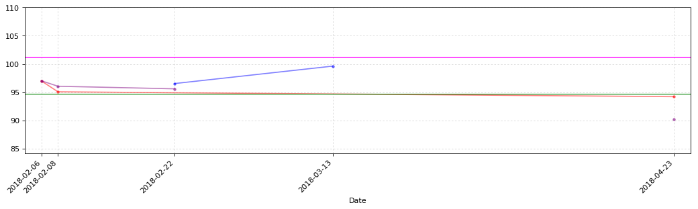


```python
CB_Transaction_Functions.CB_TD_cost_plt(shuijing_CB_TD)
```


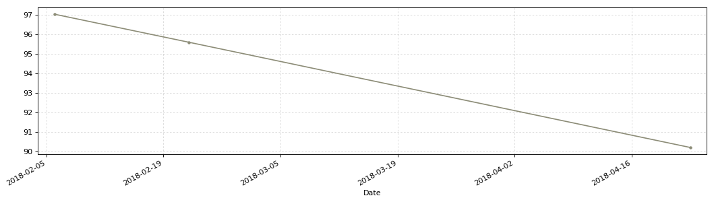


### 亚太转债128023


```python
yatai = u'亚太转债'
yatai_date = '2017-12-04'
# 2018年2月4日更新三线
y1 = 95.35
y2 = 86.73
y3 = 80
y4 = 110.00
```


```python
yatai_CB_TD = CB_Transaction_Functions.CB_Transaction_Data(yatai)
yatai_CB_TD
```


<div>


<table border="1" class="dataframe">
  <thead>
    <tr style="text-align: right;">
      <th></th>
      <th>发生日期</th>
      <th>业务名称</th>
      <th>证券代码</th>
      <th>证券名称</th>
      <th>成交均价</th>
      <th>成交数量</th>
      <th>成交金额</th>
      <th>股份余额</th>
      <th>手续费</th>
      <th>发生金额</th>
      <th>成本</th>
    </tr>
  </thead>
  <tbody>
    <tr>
      <th>0</th>
      <td>2018-02-08</td>
      <td>证券买入清算</td>
      <td>128023</td>
      <td>亚太转债</td>
      <td>94.202</td>
      <td>10</td>
      <td>942.02</td>
      <td>10</td>
      <td>0.19</td>
      <td>-942.21</td>
      <td>94.221</td>
    </tr>
    <tr>
      <th>1</th>
      <td>2018-02-09</td>
      <td>证券买入清算</td>
      <td>128023</td>
      <td>亚太转债</td>
      <td>93.210</td>
      <td>10</td>
      <td>932.10</td>
      <td>20</td>
      <td>0.19</td>
      <td>-932.29</td>
      <td>93.725</td>
    </tr>
  </tbody>
</table>
</div>


```python
yatai_CB_TD_cost = CB_Transaction_Functions.CB_TD_cost(yatai,yatai_CB_TD,yatai_date)
yatai_CB_TD_cost.round(3)
```


<div>


<table border="1" class="dataframe">
  <thead>
    <tr style="text-align: right;">
      <th></th>
      <th>持仓金额</th>
      <th>成交数量</th>
      <th>持仓成本</th>
      <th>起息日</th>
      <th>剩余年限</th>
      <th>证券代码</th>
      <th>成交金额</th>
      <th>买卖数量</th>
      <th>交易时间</th>
    </tr>
  </thead>
  <tbody>
    <tr>
      <th>亚太转债</th>
      <td>1874.5</td>
      <td>20.0</td>
      <td>93.725</td>
      <td>2017-12-04</td>
      <td>5年217天</td>
      <td>128023</td>
      <td>93.21</td>
      <td>10</td>
      <td>2018-02-09</td>
    </tr>
  </tbody>
</table>
</div>


```python
# CB_Transaction_Functions.CB_TD_plt(yatai_CB_TD,y1,y2,y3,y4)
```


```python
# CB_Transaction_Functions.CB_TD_cost_plt(yatai_CB_TD)
```

### 久立转2128019


```python
jiuli = u'久立转2'
jiuli_date = '2017-11-08'
# 2018年2月4日更新三线
y1 = 95.35
y2 = 86.73
y3 = 80
y4 = 110.00
```


```python
jiuli_CB_TD = CB_Transaction_Functions.CB_Transaction_Data(jiuli)
jiuli_CB_TD
```


<div>


<table border="1" class="dataframe">
  <thead>
    <tr style="text-align: right;">
      <th></th>
      <th>发生日期</th>
      <th>业务名称</th>
      <th>证券代码</th>
      <th>证券名称</th>
      <th>成交均价</th>
      <th>成交数量</th>
      <th>成交金额</th>
      <th>股份余额</th>
      <th>手续费</th>
      <th>发生金额</th>
      <th>成本</th>
    </tr>
  </thead>
  <tbody>
    <tr>
      <th>0</th>
      <td>2018-02-09</td>
      <td>证券买入清算</td>
      <td>128019</td>
      <td>久立转2</td>
      <td>94.911</td>
      <td>10</td>
      <td>949.11</td>
      <td>10</td>
      <td>0.19</td>
      <td>-949.3</td>
      <td>94.930000</td>
    </tr>
    <tr>
      <th>1</th>
      <td>2018-03-13</td>
      <td>证券卖出清算</td>
      <td>128019</td>
      <td>久立转2</td>
      <td>99.000</td>
      <td>-10</td>
      <td>990.00</td>
      <td>0</td>
      <td>0.20</td>
      <td>989.8</td>
      <td>-inf</td>
    </tr>
  </tbody>
</table>
</div>


```python
jiuli_CB_TD_cost = CB_Transaction_Functions.CB_TD_cost(jiuli,jiuli_CB_TD,jiuli_date)
jiuli_CB_TD_cost.round(3)
```


<div>


<table border="1" class="dataframe">
  <thead>
    <tr style="text-align: right;">
      <th></th>
      <th>持仓金额</th>
      <th>成交数量</th>
      <th>持仓成本</th>
      <th>起息日</th>
      <th>剩余年限</th>
      <th>证券代码</th>
      <th>成交金额</th>
      <th>买卖数量</th>
      <th>交易时间</th>
    </tr>
  </thead>
  <tbody>
    <tr>
      <th>久立转2</th>
      <td>-40.5</td>
      <td>0.0</td>
      <td>0</td>
      <td>2017-11-08</td>
      <td>5年191天</td>
      <td>128019</td>
      <td>99.0</td>
      <td>-10</td>
      <td>2018-03-13</td>
    </tr>
  </tbody>
</table>
</div>


```python
# CB_Transaction_Functions.CB_TD_plt(jiuli_CB_TD,y1,y2,y3,y4)
```


```python
# CB_Transaction_Functions.CB_TD_cost_plt(jiuli_CB_TD)
```

### 双环转债128032


```python
shuanghuan = u'双环转债'
shuanghuan_date = '2017-12-25'
# 2018年2月4日更新三线
y1 = 106.00
y2 = 98.47
y3 = 89.08
y4 = 110.00
```


```python
shuanghuan_CB_TD = CB_Transaction_Functions.CB_Transaction_Data(shuanghuan)
shuanghuan_CB_TD
```


<div>


<table border="1" class="dataframe">
  <thead>
    <tr style="text-align: right;">
      <th></th>
      <th>发生日期</th>
      <th>业务名称</th>
      <th>证券代码</th>
      <th>证券名称</th>
      <th>成交均价</th>
      <th>成交数量</th>
      <th>成交金额</th>
      <th>股份余额</th>
      <th>手续费</th>
      <th>发生金额</th>
      <th>成本</th>
    </tr>
  </thead>
  <tbody>
    <tr>
      <th>0</th>
      <td>2018-02-09</td>
      <td>证券买入清算</td>
      <td>128032</td>
      <td>双环转债</td>
      <td>97.348</td>
      <td>10</td>
      <td>973.48</td>
      <td>10</td>
      <td>0.19</td>
      <td>-973.67</td>
      <td>97.367000</td>
    </tr>
    <tr>
      <th>1</th>
      <td>2018-03-13</td>
      <td>证券卖出清算</td>
      <td>128032</td>
      <td>双环转债</td>
      <td>104.610</td>
      <td>-10</td>
      <td>1046.10</td>
      <td>0</td>
      <td>0.21</td>
      <td>1045.89</td>
      <td>-inf</td>
    </tr>
  </tbody>
</table>
</div>


```python
shuanghuan_CB_TD_cost = CB_Transaction_Functions.CB_TD_cost(shuanghuan,shuanghuan_CB_TD,shuanghuan_date)
shuanghuan_CB_TD_cost.round(3)
```


<div>


<table border="1" class="dataframe">
  <thead>
    <tr style="text-align: right;">
      <th></th>
      <th>持仓金额</th>
      <th>成交数量</th>
      <th>持仓成本</th>
      <th>起息日</th>
      <th>剩余年限</th>
      <th>证券代码</th>
      <th>成交金额</th>
      <th>买卖数量</th>
      <th>交易时间</th>
    </tr>
  </thead>
  <tbody>
    <tr>
      <th>双环转债</th>
      <td>-72.22</td>
      <td>0.0</td>
      <td>0</td>
      <td>2017-12-25</td>
      <td>5年237天</td>
      <td>128032</td>
      <td>104.61</td>
      <td>-10</td>
      <td>2018-03-13</td>
    </tr>
  </tbody>
</table>
</div>


```python
# CB_Transaction_Functions.CB_TD_plt(shuanghuan_CB_TD,y1,y2,y3,y4)
```


```python
# CB_Transaction_Functions.CB_TD_cost_plt(shuanghuan_CB_TD)
```

### 江银转债128034


```python
jiangyin = u'江银转债'
jiangyin_date = '2018-01-26'
# 2018年2月4日更新三线
y1 = 106.00
y2 = 98.47
y3 = 89.08
y4 = 110.00
```


```python
jiangyin_CB_TD = CB_Transaction_Functions.CB_Transaction_Data(jiangyin)
jiangyin_CB_TD
```


<div>


<table border="1" class="dataframe">
  <thead>
    <tr style="text-align: right;">
      <th></th>
      <th>发生日期</th>
      <th>业务名称</th>
      <th>证券代码</th>
      <th>证券名称</th>
      <th>成交均价</th>
      <th>成交数量</th>
      <th>成交金额</th>
      <th>股份余额</th>
      <th>手续费</th>
      <th>发生金额</th>
      <th>成本</th>
    </tr>
  </thead>
  <tbody>
    <tr>
      <th>0</th>
      <td>2018-01-30</td>
      <td>市值认购资金扣收</td>
      <td>128034</td>
      <td>江银转债</td>
      <td>100.000</td>
      <td>10</td>
      <td>1000.00</td>
      <td>10</td>
      <td>0.00</td>
      <td>-1000.00</td>
      <td>100.000000</td>
    </tr>
    <tr>
      <th>1</th>
      <td>2018-03-15</td>
      <td>证券买入清算</td>
      <td>128034</td>
      <td>江银转债</td>
      <td>96.880</td>
      <td>10</td>
      <td>968.80</td>
      <td>20</td>
      <td>0.19</td>
      <td>-968.99</td>
      <td>98.449500</td>
    </tr>
    <tr>
      <th>2</th>
      <td>2018-03-15</td>
      <td>证券买入清算</td>
      <td>128034</td>
      <td>江银转债</td>
      <td>95.547</td>
      <td>10</td>
      <td>968.80</td>
      <td>30</td>
      <td>0.19</td>
      <td>-955.66</td>
      <td>97.488333</td>
    </tr>
    <tr>
      <th>3</th>
      <td>2018-03-23</td>
      <td>证券买入清算</td>
      <td>128034</td>
      <td>江银转债</td>
      <td>94.082</td>
      <td>10</td>
      <td>940.82</td>
      <td>40</td>
      <td>0.19</td>
      <td>-941.01</td>
      <td>96.641500</td>
    </tr>
    <tr>
      <th>4</th>
      <td>2018-03-26</td>
      <td>证券买入清算</td>
      <td>128034</td>
      <td>江银转债</td>
      <td>93.165</td>
      <td>10</td>
      <td>931.65</td>
      <td>50</td>
      <td>0.19</td>
      <td>-931.84</td>
      <td>95.950000</td>
    </tr>
    <tr>
      <th>5</th>
      <td>2018-04-17</td>
      <td>证券卖出清算</td>
      <td>128034</td>
      <td>江银转债</td>
      <td>97.150</td>
      <td>-10</td>
      <td>971.50</td>
      <td>40</td>
      <td>0.19</td>
      <td>971.31</td>
      <td>95.654750</td>
    </tr>
    <tr>
      <th>6</th>
      <td>2018-04-17</td>
      <td>证券卖出清算</td>
      <td>128034</td>
      <td>江银转债</td>
      <td>98.001</td>
      <td>-10</td>
      <td>980.01</td>
      <td>30</td>
      <td>0.20</td>
      <td>979.81</td>
      <td>94.879333</td>
    </tr>
    <tr>
      <th>7</th>
      <td>2018-04-19</td>
      <td>证券卖出清算</td>
      <td>128034</td>
      <td>江银转债</td>
      <td>98.205</td>
      <td>-10</td>
      <td>982.05</td>
      <td>20</td>
      <td>0.20</td>
      <td>981.85</td>
      <td>93.226500</td>
    </tr>
  </tbody>
</table>
</div>


```python
jiangyin_CB_TD_cost = CB_Transaction_Functions.CB_TD_cost(jiangyin,jiangyin_CB_TD,jiangyin_date)
jiangyin_CB_TD_cost.round(3)
```


<div>


<table border="1" class="dataframe">
  <thead>
    <tr style="text-align: right;">
      <th></th>
      <th>持仓金额</th>
      <th>成交数量</th>
      <th>持仓成本</th>
      <th>起息日</th>
      <th>剩余年限</th>
      <th>证券代码</th>
      <th>成交金额</th>
      <th>买卖数量</th>
      <th>交易时间</th>
    </tr>
  </thead>
  <tbody>
    <tr>
      <th>江银转债</th>
      <td>1864.53</td>
      <td>20.0</td>
      <td>93.227</td>
      <td>2018-01-26</td>
      <td>5年270天</td>
      <td>128034</td>
      <td>98.205</td>
      <td>-10</td>
      <td>2018-04-19</td>
    </tr>
  </tbody>
</table>
</div>


```python
CB_Transaction_Functions.CB_TD_plt(jiangyin_CB_TD,y1,y2,y3,y4)
```


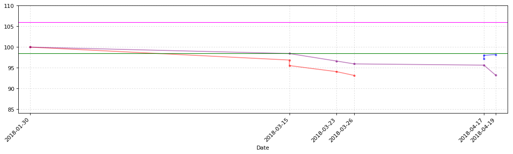


```python
CB_Transaction_Functions.CB_TD_cost_plt(jiangyin_CB_TD)
```


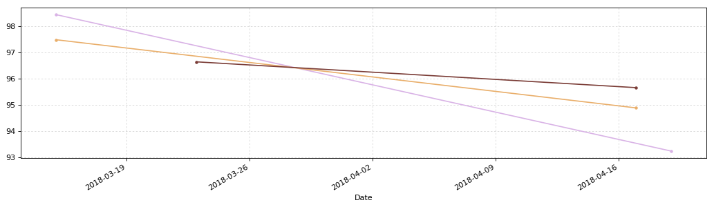


### 无锡转债110043


```python
wuxi = u'无锡转债'
wuxi_date = '2018-01-30'
# 2018年2月4日更新三线
y1 = 101.00
y2 = 92.76
y3 = 84.33
y4 = 110.00
```


```python
wuxi_CB_TD = CB_Transaction_Functions.CB_Transaction_Data(wuxi)
wuxi_CB_TD
```


<div>


<table border="1" class="dataframe">
  <thead>
    <tr style="text-align: right;">
      <th></th>
      <th>发生日期</th>
      <th>业务名称</th>
      <th>证券代码</th>
      <th>证券名称</th>
      <th>成交均价</th>
      <th>成交数量</th>
      <th>成交金额</th>
      <th>股份余额</th>
      <th>手续费</th>
      <th>发生金额</th>
      <th>成本</th>
    </tr>
  </thead>
  <tbody>
    <tr>
      <th>0</th>
      <td>2018-02-01</td>
      <td>市值认购资金扣收</td>
      <td>110043</td>
      <td>无锡转债</td>
      <td>100.00</td>
      <td>20</td>
      <td>2000.0</td>
      <td>20</td>
      <td>0.0</td>
      <td>-2000.0</td>
      <td>100.000000</td>
    </tr>
    <tr>
      <th>1</th>
      <td>2018-03-15</td>
      <td>证券买入清算</td>
      <td>110043</td>
      <td>无锡转债</td>
      <td>96.97</td>
      <td>10</td>
      <td>969.7</td>
      <td>30</td>
      <td>1.0</td>
      <td>-970.7</td>
      <td>99.023333</td>
    </tr>
    <tr>
      <th>2</th>
      <td>2018-03-23</td>
      <td>证券买入清算</td>
      <td>110043</td>
      <td>无锡转债</td>
      <td>94.74</td>
      <td>10</td>
      <td>947.4</td>
      <td>40</td>
      <td>1.0</td>
      <td>-948.4</td>
      <td>97.977500</td>
    </tr>
  </tbody>
</table>
</div>


```python
wuxi_CB_TD_cost = CB_Transaction_Functions.CB_TD_cost(wuxi,wuxi_CB_TD,wuxi_date)
wuxi_CB_TD_cost.round(3)
```


<div>


<table border="1" class="dataframe">
  <thead>
    <tr style="text-align: right;">
      <th></th>
      <th>持仓金额</th>
      <th>成交数量</th>
      <th>持仓成本</th>
      <th>起息日</th>
      <th>剩余年限</th>
      <th>证券代码</th>
      <th>成交金额</th>
      <th>买卖数量</th>
      <th>交易时间</th>
    </tr>
  </thead>
  <tbody>
    <tr>
      <th>无锡转债</th>
      <td>3919.1</td>
      <td>40.0</td>
      <td>97.977</td>
      <td>2018-01-30</td>
      <td>5年273天</td>
      <td>110043</td>
      <td>94.74</td>
      <td>10</td>
      <td>2018-03-23</td>
    </tr>
  </tbody>
</table>
</div>


```python
# CB_Transaction_Functions.CB_TD_plt(wuxi_CB_TD,y1,y2,y3,y4)
```


```python
# CB_Transaction_Functions.CB_TD_cost_plt(wuxi_CB_TD)
```


```python
CB_Transaction_Data_Cost_T = pd.concat([lanbiao_CB_TD_cost.T,huifeng_CB_TD_cost.T,hongtao_CB_TD_cost.T,hangxin_CB_TD_cost.T,
                                        haiyin_CB_TD_cost.T,mosu_CB_TD_cost.T,jiangnan_CB_TD_cost.T,dianqi_CB_TD_cost.T,
                                        geli_CB_TD_cost.T,jiaao_CB_TD_cost.T,dilong_CB_TD_cost.T,
                                        jishi_CB_TD_cost.T,yongdong_CB_TD_cost.T,shuijing_CB_TD_cost.T,
                                        yatai_CB_TD_cost.T,shida_CB_TD_cost.T,zhongxing_CB_TD_cost.T,
                                        jiangyin_CB_TD_cost.T,wuxi_CB_TD_cost.T], axis=1)
# shida_CB_TD_cost.T,mengdian_CB_TD_cost.T,
# geli_CB_TD_cost.T,jiuqi_CB_TD_cost.T,
# luotuo_CB_TD_cost.T,xiaokang_CB_TD_cost.T,
# jiuli_CB_TD_cost.T,
# shuanghuan_CB_TD_cost.T,
CB_Transaction_Data_Cost = CB_Transaction_Data_Cost_T.T
CB_Transaction_Data_Cost[u'总成本'] = CB_Transaction_Data_Cost[u'成交数量']*CB_Transaction_Data_Cost[u'持仓成本']
```


```python
plt.figure(3,figsize=(24,6), dpi=80)
ax3 = plt.subplot(111)
```


```python
Yahei = matplotlib.font_manager.FontProperties(fname='C:\Windows\Fonts\msyh.ttf')
k = len(CB_Transaction_Data_Cost)
x_ticks_num = np.arange(0,k)
x_ticks_name = CB_Transaction_Data_Cost.index
y_ticks_values = CB_Transaction_Data_Cost[u'持仓成本'].values
y_ticks_num = CB_Transaction_Data_Cost[u'成交数量'].values
total_width = 0.7
num_bar = 2
w = total_width/num_bar
x_ticks_b = x_ticks_num - (total_width - w)/2
af = 0.8
x_ticks_num
```


    array([ 0,  1,  2,  3,  4,  5,  6,  7,  8,  9, 10, 11, 12, 13, 14, 15, 16,
           17, 18])


```python
ax3.bar(x_ticks_num+w, y_ticks_values, facecolor='orange', width=w, label=u'持仓成本', alpha=af)
plt.axhline(y=100, color='red', linewidth='1.0')
plt.legend(prop={'family':'Microsoft YaHei','size':12}, loc=(0.02,0.9))
plt.ylim(85,110,1)
plt.xticks(x_ticks_num+1.5*w, x_ticks_name, fontproperties=Yahei)
plt.grid(linestyle=':', alpha=0.5)
```


```python
ax4 = ax3.twinx()
ax4.bar(x_ticks_num+2.1*w, y_ticks_num, facecolor='FireBrick', width=w, label=u'持仓数量', alpha=af)
plt.legend(prop={'family':'Microsoft YaHei','size':12}, loc=(0.02,0.8))
plt.ylim(0,450,1)
```


    (0, 450)


```python
for a,b in zip(x_ticks_num,y_ticks_values):
    ax3.text(a+w, b+0.2, '%.3f' % b, ha='center', va= 'bottom')
```


```python
for c,d in zip(x_ticks_num,y_ticks_num):
    ax4.text(c+2.1*w, d+1, '%.0f' % d, ha='center', va= 'bottom')
```


```python
CB_Transaction_Data_Cost[u'交易时间'] = pd.to_datetime(CB_Transaction_Data_Cost[u'交易时间'].values)
CB_Transaction_Data_Cost_R = CB_Transaction_Data_Cost.sort_values(by=u'持仓成本', ascending=True)
CB_Transaction_Data_Cost_R[u'可转债'] = CB_Transaction_Data_Cost_R.index
CB_Transaction_Data_Cost_R = CB_Transaction_Data_Cost_R.reset_index(drop=True)
CB_Transaction_Data_Cost_R = CB_Transaction_Data_Cost_R[[u'证券代码',u'可转债',u'持仓成本',u'成交数量',u'总成本',u'交易时间',u'成交金额',u'买卖数量',u'起息日',u'剩余年限']]
CB_Transaction_Data_Cost_R
```


<div>


<table border="1" class="dataframe">
  <thead>
    <tr style="text-align: right;">
      <th></th>
      <th>证券代码</th>
      <th>可转债</th>
      <th>持仓成本</th>
      <th>成交数量</th>
      <th>总成本</th>
      <th>交易时间</th>
      <th>成交金额</th>
      <th>买卖数量</th>
      <th>起息日</th>
      <th>剩余年限</th>
    </tr>
  </thead>
  <tbody>
    <tr>
      <th>0</th>
      <td>128033</td>
      <td>迪龙转债</td>
      <td>89.111</td>
      <td>10</td>
      <td>891.11</td>
      <td>2018-04-23</td>
      <td>97.521</td>
      <td>10</td>
      <td>2017-12-27</td>
      <td>5年240天</td>
    </tr>
    <tr>
      <th>1</th>
      <td>128020</td>
      <td>水晶转债</td>
      <td>90.214</td>
      <td>10</td>
      <td>902.14</td>
      <td>2018-04-23</td>
      <td>94.201</td>
      <td>10</td>
      <td>2017-11-17</td>
      <td>5年200天</td>
    </tr>
    <tr>
      <th>2</th>
      <td>128018</td>
      <td>时达转债</td>
      <td>91.209</td>
      <td>20</td>
      <td>1824.18</td>
      <td>2018-04-26</td>
      <td>92.611</td>
      <td>10</td>
      <td>2017-11-06</td>
      <td>5年189天</td>
    </tr>
    <tr>
      <th>3</th>
      <td>128034</td>
      <td>江银转债</td>
      <td>93.2265</td>
      <td>20</td>
      <td>1864.53</td>
      <td>2018-04-19</td>
      <td>98.205</td>
      <td>-10</td>
      <td>2018-01-26</td>
      <td>5年270天</td>
    </tr>
    <tr>
      <th>4</th>
      <td>128026</td>
      <td>众兴转债</td>
      <td>93.617</td>
      <td>10</td>
      <td>936.17</td>
      <td>2018-04-20</td>
      <td>95</td>
      <td>10</td>
      <td>2017-12-13</td>
      <td>5年226天</td>
    </tr>
    <tr>
      <th>5</th>
      <td>128023</td>
      <td>亚太转债</td>
      <td>93.725</td>
      <td>20</td>
      <td>1874.5</td>
      <td>2018-02-09</td>
      <td>93.21</td>
      <td>10</td>
      <td>2017-12-04</td>
      <td>5年217天</td>
    </tr>
    <tr>
      <th>6</th>
      <td>128012</td>
      <td>辉丰转债</td>
      <td>94.9558</td>
      <td>170</td>
      <td>16142.5</td>
      <td>2018-04-24</td>
      <td>83.55</td>
      <td>10</td>
      <td>2016-04-21</td>
      <td>3年354天</td>
    </tr>
    <tr>
      <th>7</th>
      <td>113017</td>
      <td>吉视转债</td>
      <td>95.84</td>
      <td>20</td>
      <td>1916.8</td>
      <td>2018-02-26</td>
      <td>100.65</td>
      <td>-10</td>
      <td>2017-12-27</td>
      <td>5年240天</td>
    </tr>
    <tr>
      <th>8</th>
      <td>110043</td>
      <td>无锡转债</td>
      <td>97.9775</td>
      <td>40</td>
      <td>3919.1</td>
      <td>2018-03-23</td>
      <td>94.74</td>
      <td>10</td>
      <td>2018-01-30</td>
      <td>5年273天</td>
    </tr>
    <tr>
      <th>9</th>
      <td>110031</td>
      <td>航信转债</td>
      <td>98.524</td>
      <td>40</td>
      <td>3940.96</td>
      <td>2018-04-20</td>
      <td>107.51</td>
      <td>-10</td>
      <td>2015-06-12</td>
      <td>3年41天</td>
    </tr>
    <tr>
      <th>10</th>
      <td>113502</td>
      <td>嘉澳转债</td>
      <td>99.05</td>
      <td>20</td>
      <td>1981</td>
      <td>2017-12-07</td>
      <td>96.12</td>
      <td>10</td>
      <td>2017-11-10</td>
      <td>5年192天</td>
    </tr>
    <tr>
      <th>11</th>
      <td>127003</td>
      <td>海印转债</td>
      <td>99.8224</td>
      <td>170</td>
      <td>16969.8</td>
      <td>2018-02-09</td>
      <td>93</td>
      <td>10</td>
      <td>2016-06-08</td>
      <td>4年38天</td>
    </tr>
    <tr>
      <th>12</th>
      <td>123001</td>
      <td>蓝标转债</td>
      <td>100.727</td>
      <td>100</td>
      <td>10072.7</td>
      <td>2018-01-26</td>
      <td>101.89</td>
      <td>-10</td>
      <td>2015-12-18</td>
      <td>3年229天</td>
    </tr>
    <tr>
      <th>13</th>
      <td>113008</td>
      <td>电气转债</td>
      <td>101.427</td>
      <td>60</td>
      <td>6085.6</td>
      <td>2018-02-07</td>
      <td>0</td>
      <td>0</td>
      <td>2015-02-02</td>
      <td>2年276天</td>
    </tr>
    <tr>
      <th>14</th>
      <td>127004</td>
      <td>模塑转债</td>
      <td>101.764</td>
      <td>110</td>
      <td>11194</td>
      <td>2018-01-25</td>
      <td>96.582</td>
      <td>-10</td>
      <td>2017-06-02</td>
      <td>5年31天</td>
    </tr>
    <tr>
      <th>15</th>
      <td>128013</td>
      <td>洪涛转债</td>
      <td>102.076</td>
      <td>400</td>
      <td>40830.4</td>
      <td>2017-12-07</td>
      <td>93.279</td>
      <td>10</td>
      <td>2016-07-29</td>
      <td>4年89天</td>
    </tr>
    <tr>
      <th>16</th>
      <td>128014</td>
      <td>永东转债</td>
      <td>102.794</td>
      <td>30</td>
      <td>3083.82</td>
      <td>2018-04-16</td>
      <td>0</td>
      <td>0</td>
      <td>2017-04-17</td>
      <td>4年351天</td>
    </tr>
    <tr>
      <th>17</th>
      <td>113010</td>
      <td>江南转债</td>
      <td>104.2</td>
      <td>30</td>
      <td>3126</td>
      <td>2018-03-22</td>
      <td>0</td>
      <td>0</td>
      <td>2016-03-18</td>
      <td>3年321天</td>
    </tr>
    <tr>
      <th>18</th>
      <td>110030</td>
      <td>格力转债</td>
      <td>104.407</td>
      <td>30</td>
      <td>3132.2</td>
      <td>2018-02-07</td>
      <td>106.5</td>
      <td>10</td>
      <td>2014-12-25</td>
      <td>2年237天</td>
    </tr>
  </tbody>
</table>
</div>


```python
CB_Transaction_Data_Cost_R.to_csv('cbcsv/CB_Transaction_Data_Cost.csv',encoding='gbk',index=False)
```


```python
plt.savefig('D:/Python/iPython/CB/CB_TD.png', dpi=600)
```


```python
plt.show()
```


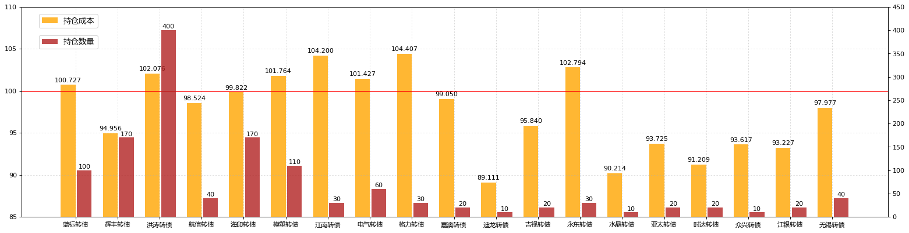


[蓝标转债](#蓝标转债123001)、[辉丰转债](#辉丰转债128012)、[洪涛转债](#洪涛转债128013)、[航信转债](#航信转债110031)、[海印转债](#海印转债127003)、[光大转债](#光大转债113011)、[模塑转债](#模塑转债127004)、[江南转债](#江南转债113010)、[电气转债](#电气转债113008)、[格力转债](#格力转债110030)、[久其转债](#久其转债128015)、[嘉澳转债](#嘉澳转债113502)、[小康转债](#小康转债113016)、[时达转债](#时达转债128018)、[骆驼转债](#骆驼转债113012)、[蒙电转债](#蒙电转债110041)、[吉视转债](#吉视转债113017)、[迪龙转债](#迪龙转债128033)、[永东转债](#永东转债128014)、[众兴转债](#众兴转债128026)、[水晶转债](#水晶转债128020)、[亚太转债](#亚太转债128023)、[久立转2](#久立转2128019)、[双环转债](#双环转债128032)、[江银转债](#江银转债128034)、[无锡转债](#无锡转债110043)


```python
ALL_Cost = CB_Transaction_Data_Cost.loc[:,[u'总成本']]
ALL_Cost.loc[u'合计'] = ALL_Cost.apply(lambda x: x.sum())
# ALL_Cost.sort_values(by=u'总成本', ascending=True).T
ALL_Cost.T[[u'合计']]
```


<div>


<table border="1" class="dataframe">
  <thead>
    <tr style="text-align: right;">
      <th></th>
      <th>合计</th>
    </tr>
  </thead>
  <tbody>
    <tr>
      <th>总成本</th>
      <td>130688</td>
    </tr>
  </tbody>
</table>
</div>


```python
CB_Transaction_Data = pd.read_csv('cbcsv/CB_Transaction_Data.csv', encoding='gbk')
CB_Transaction_Data[u'发生日期'] = pd.to_datetime(CB_Transaction_Data[u'发生日期'].values)
CB_Transaction_Data.tail(10)
```


<div>


<table border="1" class="dataframe">
  <thead>
    <tr style="text-align: right;">
      <th></th>
      <th>发生日期</th>
      <th>业务名称</th>
      <th>证券代码</th>
      <th>证券名称</th>
      <th>成交均价</th>
      <th>成交数量</th>
      <th>成交金额</th>
      <th>股份余额</th>
      <th>手续费</th>
      <th>发生金额</th>
    </tr>
  </thead>
  <tbody>
    <tr>
      <th>299</th>
      <td>2018-04-20</td>
      <td>证券买入清算</td>
      <td>128036</td>
      <td>金农转债</td>
      <td>96.000</td>
      <td>10</td>
      <td>960.00</td>
      <td>10</td>
      <td>0.19</td>
      <td>-960.19</td>
    </tr>
    <tr>
      <th>300</th>
      <td>2018-04-23</td>
      <td>证券买入清算</td>
      <td>128012</td>
      <td>辉丰转债</td>
      <td>90.800</td>
      <td>10</td>
      <td>908.00</td>
      <td>130</td>
      <td>0.18</td>
      <td>-908.18</td>
    </tr>
    <tr>
      <th>301</th>
      <td>2018-04-23</td>
      <td>证券买入清算</td>
      <td>128012</td>
      <td>辉丰转债</td>
      <td>90.600</td>
      <td>10</td>
      <td>906.00</td>
      <td>140</td>
      <td>0.18</td>
      <td>-906.18</td>
    </tr>
    <tr>
      <th>302</th>
      <td>2018-04-23</td>
      <td>证券买入清算</td>
      <td>128033</td>
      <td>迪龙转债</td>
      <td>97.521</td>
      <td>10</td>
      <td>975.21</td>
      <td>10</td>
      <td>0.20</td>
      <td>-975.41</td>
    </tr>
    <tr>
      <th>303</th>
      <td>2018-04-23</td>
      <td>证券买入清算</td>
      <td>128012</td>
      <td>辉丰转债</td>
      <td>88.210</td>
      <td>10</td>
      <td>882.10</td>
      <td>150</td>
      <td>0.18</td>
      <td>-882.28</td>
    </tr>
    <tr>
      <th>304</th>
      <td>2018-04-23</td>
      <td>证券买入清算</td>
      <td>128012</td>
      <td>辉丰转债</td>
      <td>86.880</td>
      <td>10</td>
      <td>868.80</td>
      <td>160</td>
      <td>0.17</td>
      <td>-868.97</td>
    </tr>
    <tr>
      <th>305</th>
      <td>2018-04-23</td>
      <td>证券买入清算</td>
      <td>128020</td>
      <td>水晶转债</td>
      <td>94.201</td>
      <td>10</td>
      <td>942.01</td>
      <td>10</td>
      <td>0.19</td>
      <td>-942.20</td>
    </tr>
    <tr>
      <th>306</th>
      <td>2018-04-24</td>
      <td>证券买入清算</td>
      <td>128012</td>
      <td>辉丰转债</td>
      <td>83.550</td>
      <td>10</td>
      <td>835.50</td>
      <td>170</td>
      <td>0.17</td>
      <td>-835.67</td>
    </tr>
    <tr>
      <th>307</th>
      <td>2018-04-24</td>
      <td>证券买入清算</td>
      <td>128018</td>
      <td>时达转债</td>
      <td>93.628</td>
      <td>10</td>
      <td>936.28</td>
      <td>10</td>
      <td>0.19</td>
      <td>-936.47</td>
    </tr>
    <tr>
      <th>308</th>
      <td>2018-04-26</td>
      <td>证券买入清算</td>
      <td>128018</td>
      <td>时达转债</td>
      <td>92.611</td>
      <td>10</td>
      <td>926.11</td>
      <td>20</td>
      <td>0.19</td>
      <td>-926.30</td>
    </tr>
  </tbody>
</table>
</div>


