```python
import pandas as pd
import numpy as np
import matplotlib
import matplotlib.pyplot as plt
```


```python
import CB_Transaction_Functions
```


```python
lanbiao = u'蓝标转债'
lanbiao_date = '2015-12-18'
y1 = 110.00
y2 = 101.80
y3 = 90.00
y4 = 111.00
```


```python
lanbiao_CB_TD = CB_Transaction_Functions.CB_Transaction_Data(lanbiao)
lanbiao_CB_TD.tail(10)
```


<div>


<table border="1" class="dataframe">
  <thead>
    <tr style="text-align: right;">
      <th></th>
      <th>发生日期</th>
      <th>业务名称</th>
      <th>证券代码</th>
      <th>证券名称</th>
      <th>成交均价</th>
      <th>成交数量</th>
      <th>成交金额</th>
      <th>股份余额</th>
      <th>手续费</th>
      <th>发生金额</th>
      <th>成本</th>
    </tr>
  </thead>
  <tbody>
    <tr>
      <th>23</th>
      <td>2017-07-17</td>
      <td>证券买入清算</td>
      <td>123001</td>
      <td>蓝标转债</td>
      <td>103.540</td>
      <td>10</td>
      <td>1035.40</td>
      <td>50</td>
      <td>0.21</td>
      <td>-1035.61</td>
      <td>100.619600</td>
    </tr>
    <tr>
      <th>24</th>
      <td>2017-07-27</td>
      <td>证券卖出清算</td>
      <td>123001</td>
      <td>蓝标转债</td>
      <td>105.720</td>
      <td>-10</td>
      <td>1057.20</td>
      <td>40</td>
      <td>0.21</td>
      <td>1056.99</td>
      <td>99.349750</td>
    </tr>
    <tr>
      <th>25</th>
      <td>2017-07-31</td>
      <td>证券卖出清算</td>
      <td>123001</td>
      <td>蓝标转债</td>
      <td>106.400</td>
      <td>-10</td>
      <td>1064.00</td>
      <td>30</td>
      <td>0.21</td>
      <td>1063.79</td>
      <td>97.006667</td>
    </tr>
    <tr>
      <th>26</th>
      <td>2017-08-03</td>
      <td>证券卖出清算</td>
      <td>123001</td>
      <td>蓝标转债</td>
      <td>107.600</td>
      <td>-10</td>
      <td>1076.00</td>
      <td>20</td>
      <td>0.22</td>
      <td>1075.78</td>
      <td>91.721000</td>
    </tr>
    <tr>
      <th>27</th>
      <td>2017-08-10</td>
      <td>证券买入清算</td>
      <td>123001</td>
      <td>蓝标转债</td>
      <td>105.640</td>
      <td>10</td>
      <td>1056.40</td>
      <td>30</td>
      <td>0.21</td>
      <td>-1056.61</td>
      <td>96.367667</td>
    </tr>
    <tr>
      <th>28</th>
      <td>2017-08-16</td>
      <td>证券卖出清算</td>
      <td>123001</td>
      <td>蓝标转债</td>
      <td>107.400</td>
      <td>-10</td>
      <td>1074.00</td>
      <td>20</td>
      <td>0.22</td>
      <td>1073.78</td>
      <td>90.862500</td>
    </tr>
    <tr>
      <th>29</th>
      <td>2017-08-22</td>
      <td>证券买入清算</td>
      <td>123001</td>
      <td>蓝标转债</td>
      <td>107.012</td>
      <td>10</td>
      <td>1070.12</td>
      <td>30</td>
      <td>0.21</td>
      <td>-1070.33</td>
      <td>96.252667</td>
    </tr>
    <tr>
      <th>30</th>
      <td>2017-08-23</td>
      <td>证券买入清算</td>
      <td>123001</td>
      <td>蓝标转债</td>
      <td>106.410</td>
      <td>10</td>
      <td>1064.10</td>
      <td>40</td>
      <td>0.21</td>
      <td>-1064.31</td>
      <td>98.797250</td>
    </tr>
    <tr>
      <th>31</th>
      <td>2017-09-05</td>
      <td>证券卖出清算</td>
      <td>123001</td>
      <td>蓝标转债</td>
      <td>109.010</td>
      <td>-10</td>
      <td>1090.10</td>
      <td>30</td>
      <td>0.22</td>
      <td>1089.88</td>
      <td>95.400333</td>
    </tr>
    <tr>
      <th>32</th>
      <td>2017-09-15</td>
      <td>证券买入清算</td>
      <td>123001</td>
      <td>蓝标转债</td>
      <td>107.810</td>
      <td>10</td>
      <td>1078.10</td>
      <td>40</td>
      <td>0.22</td>
      <td>-1078.32</td>
      <td>98.508250</td>
    </tr>
  </tbody>
</table>
</div>


```python
lanbiao_CB_TD_cost = CB_Transaction_Functions.CB_TD_cost(lanbiao,lanbiao_CB_TD,lanbiao_date)
lanbiao_CB_TD_cost.round(3)
```


<div>


<table border="1" class="dataframe">
  <thead>
    <tr style="text-align: right;">
      <th></th>
      <th>持仓金额</th>
      <th>成交数量</th>
      <th>持仓成本</th>
      <th>起息日</th>
      <th>剩余年限</th>
    </tr>
  </thead>
  <tbody>
    <tr>
      <th>蓝标转债</th>
      <td>3940.33</td>
      <td>40.0</td>
      <td>98.508</td>
      <td>2015-12-18</td>
      <td>4年89天</td>
    </tr>
  </tbody>
</table>
</div>


```python
CB_Transaction_Functions.CB_TD_plt(lanbiao_CB_TD,y1,y2,y3,y4)
```


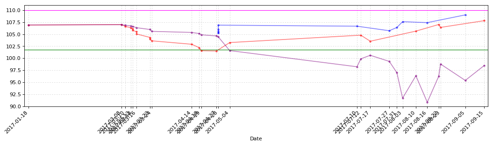


```python
CB_Transaction_Functions.CB_TD_cost_plt(lanbiao_CB_TD)
```


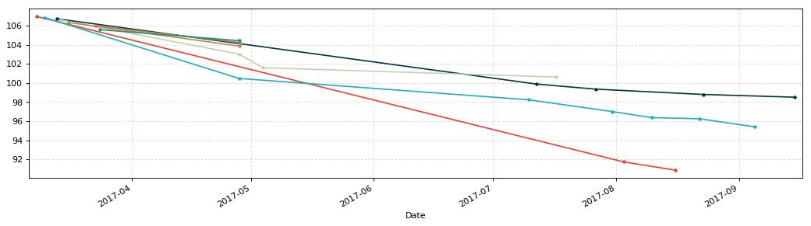


```python
huifeng = u'辉丰转债'
huifeng_date = '2016-4-21'
y1 = 106.44
y2 = 100.00
y3 = 95.00
y4 = 111.00
```


```python
huifeng_CB_TD = CB_Transaction_Functions.CB_Transaction_Data(huifeng)
huifeng_CB_TD
```


<div>


<table border="1" class="dataframe">
  <thead>
    <tr style="text-align: right;">
      <th></th>
      <th>发生日期</th>
      <th>业务名称</th>
      <th>证券代码</th>
      <th>证券名称</th>
      <th>成交均价</th>
      <th>成交数量</th>
      <th>成交金额</th>
      <th>股份余额</th>
      <th>手续费</th>
      <th>发生金额</th>
      <th>成本</th>
    </tr>
  </thead>
  <tbody>
    <tr>
      <th>0</th>
      <td>2017-01-26</td>
      <td>证券买入清算</td>
      <td>128012</td>
      <td>辉丰转债</td>
      <td>105.799</td>
      <td>10</td>
      <td>1057.99</td>
      <td>10</td>
      <td>0.21</td>
      <td>-1058.20</td>
      <td>105.820000</td>
    </tr>
    <tr>
      <th>1</th>
      <td>2017-02-03</td>
      <td>证券买入清算</td>
      <td>128012</td>
      <td>辉丰转债</td>
      <td>105.320</td>
      <td>20</td>
      <td>2106.40</td>
      <td>30</td>
      <td>0.42</td>
      <td>-2106.82</td>
      <td>105.500667</td>
    </tr>
    <tr>
      <th>2</th>
      <td>2017-02-07</td>
      <td>证券买入清算</td>
      <td>128012</td>
      <td>辉丰转债</td>
      <td>105.300</td>
      <td>20</td>
      <td>2106.00</td>
      <td>50</td>
      <td>0.42</td>
      <td>-2106.42</td>
      <td>105.428800</td>
    </tr>
    <tr>
      <th>3</th>
      <td>2017-02-21</td>
      <td>证券买入清算</td>
      <td>128012</td>
      <td>辉丰转债</td>
      <td>105.100</td>
      <td>30</td>
      <td>3153.00</td>
      <td>80</td>
      <td>0.63</td>
      <td>-3153.63</td>
      <td>105.313375</td>
    </tr>
    <tr>
      <th>4</th>
      <td>2017-03-03</td>
      <td>证券买入清算</td>
      <td>128012</td>
      <td>辉丰转债</td>
      <td>104.898</td>
      <td>20</td>
      <td>2097.96</td>
      <td>100</td>
      <td>0.42</td>
      <td>-2098.38</td>
      <td>105.234500</td>
    </tr>
    <tr>
      <th>5</th>
      <td>2017-03-03</td>
      <td>证券买入清算</td>
      <td>128012</td>
      <td>辉丰转债</td>
      <td>104.639</td>
      <td>20</td>
      <td>2092.78</td>
      <td>120</td>
      <td>0.42</td>
      <td>-2093.20</td>
      <td>105.138750</td>
    </tr>
    <tr>
      <th>6</th>
      <td>2017-03-07</td>
      <td>证券卖出清算</td>
      <td>128012</td>
      <td>辉丰转债</td>
      <td>104.998</td>
      <td>-40</td>
      <td>4199.92</td>
      <td>80</td>
      <td>0.84</td>
      <td>4199.08</td>
      <td>105.219625</td>
    </tr>
    <tr>
      <th>7</th>
      <td>2017-03-08</td>
      <td>证券卖出清算</td>
      <td>128012</td>
      <td>辉丰转债</td>
      <td>105.450</td>
      <td>-20</td>
      <td>2109.00</td>
      <td>60</td>
      <td>0.42</td>
      <td>2108.58</td>
      <td>105.149833</td>
    </tr>
    <tr>
      <th>8</th>
      <td>2017-03-10</td>
      <td>证券买入清算</td>
      <td>128012</td>
      <td>辉丰转债</td>
      <td>104.600</td>
      <td>20</td>
      <td>2092.00</td>
      <td>80</td>
      <td>0.42</td>
      <td>-2092.42</td>
      <td>105.017625</td>
    </tr>
    <tr>
      <th>9</th>
      <td>2017-03-13</td>
      <td>证券买入清算</td>
      <td>128012</td>
      <td>辉丰转债</td>
      <td>104.311</td>
      <td>20</td>
      <td>2086.22</td>
      <td>100</td>
      <td>0.42</td>
      <td>-2086.64</td>
      <td>104.880500</td>
    </tr>
    <tr>
      <th>10</th>
      <td>2017-03-16</td>
      <td>证券买入清算</td>
      <td>128012</td>
      <td>辉丰转债</td>
      <td>103.900</td>
      <td>20</td>
      <td>2078.00</td>
      <td>120</td>
      <td>0.42</td>
      <td>-2078.42</td>
      <td>104.720583</td>
    </tr>
    <tr>
      <th>11</th>
      <td>2017-03-27</td>
      <td>证券卖出清算</td>
      <td>128012</td>
      <td>辉丰转债</td>
      <td>104.500</td>
      <td>-20</td>
      <td>2090.00</td>
      <td>100</td>
      <td>0.42</td>
      <td>2089.58</td>
      <td>104.768900</td>
    </tr>
    <tr>
      <th>12</th>
      <td>2017-03-27</td>
      <td>证券卖出清算</td>
      <td>128012</td>
      <td>辉丰转债</td>
      <td>104.660</td>
      <td>-20</td>
      <td>2093.20</td>
      <td>80</td>
      <td>0.42</td>
      <td>2092.78</td>
      <td>104.801375</td>
    </tr>
    <tr>
      <th>13</th>
      <td>2017-03-31</td>
      <td>证券买入清算</td>
      <td>128012</td>
      <td>辉丰转债</td>
      <td>103.900</td>
      <td>20</td>
      <td>2078.00</td>
      <td>100</td>
      <td>0.42</td>
      <td>-2078.42</td>
      <td>104.625300</td>
    </tr>
    <tr>
      <th>14</th>
      <td>2017-03-31</td>
      <td>证券买入清算</td>
      <td>128012</td>
      <td>辉丰转债</td>
      <td>103.921</td>
      <td>20</td>
      <td>2078.42</td>
      <td>120</td>
      <td>0.42</td>
      <td>-2078.84</td>
      <td>104.511417</td>
    </tr>
    <tr>
      <th>15</th>
      <td>2017-03-31</td>
      <td>证券卖出清算</td>
      <td>128012</td>
      <td>辉丰转债</td>
      <td>103.994</td>
      <td>-20</td>
      <td>2079.88</td>
      <td>100</td>
      <td>0.42</td>
      <td>2079.46</td>
      <td>104.619100</td>
    </tr>
    <tr>
      <th>16</th>
      <td>2017-04-18</td>
      <td>证券买入清算</td>
      <td>128012</td>
      <td>辉丰转债</td>
      <td>103.361</td>
      <td>10</td>
      <td>1033.61</td>
      <td>110</td>
      <td>0.21</td>
      <td>-1033.82</td>
      <td>104.506636</td>
    </tr>
    <tr>
      <th>17</th>
      <td>2017-04-19</td>
      <td>证券买入清算</td>
      <td>128012</td>
      <td>辉丰转债</td>
      <td>103.023</td>
      <td>10</td>
      <td>1030.23</td>
      <td>120</td>
      <td>0.21</td>
      <td>-1030.44</td>
      <td>104.384750</td>
    </tr>
    <tr>
      <th>18</th>
      <td>2017-04-20</td>
      <td>债券兑息</td>
      <td>128012</td>
      <td>辉丰转债</td>
      <td>0.000</td>
      <td>0</td>
      <td>60.00</td>
      <td>0</td>
      <td>0.00</td>
      <td>48.00</td>
      <td>inf</td>
    </tr>
    <tr>
      <th>19</th>
      <td>2017-04-27</td>
      <td>证券买入清算</td>
      <td>128012</td>
      <td>辉丰转债</td>
      <td>102.127</td>
      <td>10</td>
      <td>1021.27</td>
      <td>130</td>
      <td>0.20</td>
      <td>-1021.47</td>
      <td>103.843385</td>
    </tr>
    <tr>
      <th>20</th>
      <td>2017-05-05</td>
      <td>证券买入清算</td>
      <td>128012</td>
      <td>辉丰转债</td>
      <td>101.486</td>
      <td>10</td>
      <td>1014.86</td>
      <td>140</td>
      <td>0.20</td>
      <td>-1015.06</td>
      <td>103.676429</td>
    </tr>
    <tr>
      <th>21</th>
      <td>2017-05-08</td>
      <td>证券买入清算</td>
      <td>128012</td>
      <td>辉丰转债</td>
      <td>101.175</td>
      <td>10</td>
      <td>1011.75</td>
      <td>150</td>
      <td>0.20</td>
      <td>-1011.95</td>
      <td>103.511000</td>
    </tr>
    <tr>
      <th>22</th>
      <td>2017-05-31</td>
      <td>证券买入清算</td>
      <td>128012</td>
      <td>辉丰转债</td>
      <td>99.010</td>
      <td>20</td>
      <td>1980.20</td>
      <td>170</td>
      <td>0.40</td>
      <td>-1980.60</td>
      <td>102.983824</td>
    </tr>
    <tr>
      <th>23</th>
      <td>2017-06-28</td>
      <td>证券卖出清算</td>
      <td>128012</td>
      <td>辉丰转债</td>
      <td>101.880</td>
      <td>-40</td>
      <td>4075.20</td>
      <td>130</td>
      <td>0.82</td>
      <td>4074.38</td>
      <td>103.329769</td>
    </tr>
    <tr>
      <th>24</th>
      <td>2017-07-10</td>
      <td>证券卖出清算</td>
      <td>128012</td>
      <td>辉丰转债</td>
      <td>103.000</td>
      <td>-20</td>
      <td>2060.00</td>
      <td>110</td>
      <td>0.41</td>
      <td>2059.59</td>
      <td>103.393455</td>
    </tr>
    <tr>
      <th>25</th>
      <td>2017-07-24</td>
      <td>证券卖出清算</td>
      <td>128012</td>
      <td>辉丰转债</td>
      <td>106.600</td>
      <td>-30</td>
      <td>3198.00</td>
      <td>80</td>
      <td>0.64</td>
      <td>3197.36</td>
      <td>102.199000</td>
    </tr>
    <tr>
      <th>26</th>
      <td>2017-07-27</td>
      <td>证券卖出清算</td>
      <td>128012</td>
      <td>辉丰转债</td>
      <td>106.900</td>
      <td>-30</td>
      <td>3207.00</td>
      <td>50</td>
      <td>0.64</td>
      <td>3206.36</td>
      <td>99.391200</td>
    </tr>
    <tr>
      <th>27</th>
      <td>2017-07-31</td>
      <td>证券卖出清算</td>
      <td>128012</td>
      <td>辉丰转债</td>
      <td>108.800</td>
      <td>-10</td>
      <td>1088.00</td>
      <td>40</td>
      <td>0.22</td>
      <td>1087.78</td>
      <td>97.044500</td>
    </tr>
    <tr>
      <th>28</th>
      <td>2017-07-31</td>
      <td>证券卖出清算</td>
      <td>128012</td>
      <td>辉丰转债</td>
      <td>110.000</td>
      <td>-10</td>
      <td>1100.00</td>
      <td>30</td>
      <td>0.22</td>
      <td>1099.78</td>
      <td>92.733333</td>
    </tr>
    <tr>
      <th>29</th>
      <td>2017-08-09</td>
      <td>证券买入清算</td>
      <td>128012</td>
      <td>辉丰转债</td>
      <td>107.700</td>
      <td>10</td>
      <td>1077.00</td>
      <td>40</td>
      <td>0.22</td>
      <td>-1077.22</td>
      <td>96.480500</td>
    </tr>
    <tr>
      <th>30</th>
      <td>2017-08-11</td>
      <td>证券买入清算</td>
      <td>128012</td>
      <td>辉丰转债</td>
      <td>106.753</td>
      <td>10</td>
      <td>1067.53</td>
      <td>50</td>
      <td>0.21</td>
      <td>-1067.74</td>
      <td>98.539200</td>
    </tr>
    <tr>
      <th>31</th>
      <td>2017-08-11</td>
      <td>证券买入清算</td>
      <td>128012</td>
      <td>辉丰转债</td>
      <td>106.123</td>
      <td>10</td>
      <td>1061.23</td>
      <td>60</td>
      <td>0.21</td>
      <td>-1061.44</td>
      <td>99.806667</td>
    </tr>
    <tr>
      <th>32</th>
      <td>2017-08-11</td>
      <td>证券买入清算</td>
      <td>128012</td>
      <td>辉丰转债</td>
      <td>105.550</td>
      <td>10</td>
      <td>1055.50</td>
      <td>70</td>
      <td>0.21</td>
      <td>-1055.71</td>
      <td>100.630143</td>
    </tr>
    <tr>
      <th>33</th>
      <td>2017-08-14</td>
      <td>证券卖出清算</td>
      <td>128012</td>
      <td>辉丰转债</td>
      <td>106.970</td>
      <td>-10</td>
      <td>1069.70</td>
      <td>60</td>
      <td>0.21</td>
      <td>1069.49</td>
      <td>99.577000</td>
    </tr>
    <tr>
      <th>34</th>
      <td>2017-08-14</td>
      <td>证券卖出清算</td>
      <td>128012</td>
      <td>辉丰转债</td>
      <td>107.800</td>
      <td>-10</td>
      <td>1078.00</td>
      <td>50</td>
      <td>0.22</td>
      <td>1077.78</td>
      <td>97.936800</td>
    </tr>
    <tr>
      <th>35</th>
      <td>2017-08-22</td>
      <td>证券买入清算</td>
      <td>128012</td>
      <td>辉丰转债</td>
      <td>106.650</td>
      <td>10</td>
      <td>1066.50</td>
      <td>60</td>
      <td>0.21</td>
      <td>-1066.71</td>
      <td>99.392500</td>
    </tr>
    <tr>
      <th>36</th>
      <td>2017-08-29</td>
      <td>证券卖出清算</td>
      <td>128012</td>
      <td>辉丰转债</td>
      <td>108.136</td>
      <td>-10</td>
      <td>1081.36</td>
      <td>50</td>
      <td>0.22</td>
      <td>1081.14</td>
      <td>97.648200</td>
    </tr>
    <tr>
      <th>37</th>
      <td>2017-09-14</td>
      <td>证券买入清算</td>
      <td>128012</td>
      <td>辉丰转债</td>
      <td>105.820</td>
      <td>10</td>
      <td>1058.20</td>
      <td>60</td>
      <td>0.21</td>
      <td>-1058.41</td>
      <td>99.013667</td>
    </tr>
    <tr>
      <th>38</th>
      <td>2017-09-14</td>
      <td>证券买入清算</td>
      <td>128012</td>
      <td>辉丰转债</td>
      <td>104.980</td>
      <td>10</td>
      <td>1049.80</td>
      <td>70</td>
      <td>0.21</td>
      <td>-1050.01</td>
      <td>99.869000</td>
    </tr>
  </tbody>
</table>
</div>


```python
huifeng_CB_TD_cost = CB_Transaction_Functions.CB_TD_cost(huifeng,huifeng_CB_TD,huifeng_date)
huifeng_CB_TD_cost.round(3)
```


<div>


<table border="1" class="dataframe">
  <thead>
    <tr style="text-align: right;">
      <th></th>
      <th>持仓金额</th>
      <th>成交数量</th>
      <th>持仓成本</th>
      <th>起息日</th>
      <th>剩余年限</th>
    </tr>
  </thead>
  <tbody>
    <tr>
      <th>辉丰转债</th>
      <td>6990.83</td>
      <td>70.0</td>
      <td>99.869</td>
      <td>2016-4-21</td>
      <td>4年214天</td>
    </tr>
  </tbody>
</table>
</div>


```python
CB_Transaction_Functions.CB_TD_plt(huifeng_CB_TD,y1,y2,y3,y4)
```


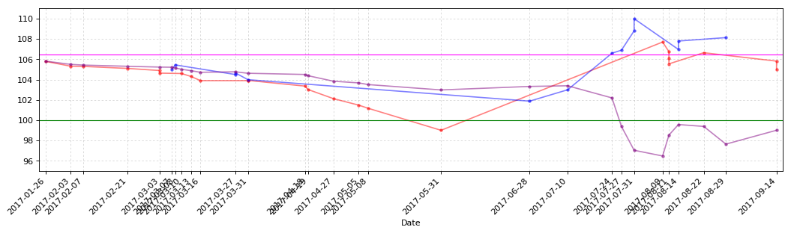


```python
CB_Transaction_Functions.CB_TD_cost_plt(huifeng_CB_TD)
```


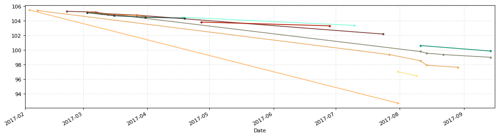


```python
hongtao = u'洪涛转债'
hongtao_date = '2016-7-29'
y1 = 108.00
y2 = 100.00
y3 = 95.00
y4 = 111.00
```


```python
hongtao_CB_TD = CB_Transaction_Functions.CB_Transaction_Data(hongtao)
hongtao_CB_TD
```


<div>


<table border="1" class="dataframe">
  <thead>
    <tr style="text-align: right;">
      <th></th>
      <th>发生日期</th>
      <th>业务名称</th>
      <th>证券代码</th>
      <th>证券名称</th>
      <th>成交均价</th>
      <th>成交数量</th>
      <th>成交金额</th>
      <th>股份余额</th>
      <th>手续费</th>
      <th>发生金额</th>
      <th>成本</th>
    </tr>
  </thead>
  <tbody>
    <tr>
      <th>0</th>
      <td>2017-01-16</td>
      <td>证券买入清算</td>
      <td>128013</td>
      <td>洪涛转债</td>
      <td>109.000</td>
      <td>10</td>
      <td>1090.00</td>
      <td>10</td>
      <td>0.22</td>
      <td>-1090.22</td>
      <td>109.022000</td>
    </tr>
    <tr>
      <th>1</th>
      <td>2017-01-17</td>
      <td>证券买入清算</td>
      <td>128013</td>
      <td>洪涛转债</td>
      <td>108.000</td>
      <td>10</td>
      <td>1080.00</td>
      <td>20</td>
      <td>0.22</td>
      <td>-1080.22</td>
      <td>108.522000</td>
    </tr>
    <tr>
      <th>2</th>
      <td>2017-01-17</td>
      <td>证券买入清算</td>
      <td>128013</td>
      <td>洪涛转债</td>
      <td>108.350</td>
      <td>10</td>
      <td>1083.50</td>
      <td>30</td>
      <td>0.22</td>
      <td>-1083.72</td>
      <td>108.472000</td>
    </tr>
    <tr>
      <th>3</th>
      <td>2017-01-18</td>
      <td>证券买入清算</td>
      <td>128013</td>
      <td>洪涛转债</td>
      <td>107.500</td>
      <td>20</td>
      <td>2150.00</td>
      <td>50</td>
      <td>0.43</td>
      <td>-2150.43</td>
      <td>108.091800</td>
    </tr>
    <tr>
      <th>4</th>
      <td>2017-01-18</td>
      <td>证券买入清算</td>
      <td>128013</td>
      <td>洪涛转债</td>
      <td>107.000</td>
      <td>20</td>
      <td>2140.00</td>
      <td>70</td>
      <td>0.43</td>
      <td>-2140.43</td>
      <td>107.786000</td>
    </tr>
    <tr>
      <th>5</th>
      <td>2017-01-18</td>
      <td>证券买入清算</td>
      <td>128013</td>
      <td>洪涛转债</td>
      <td>106.320</td>
      <td>20</td>
      <td>2126.40</td>
      <td>90</td>
      <td>0.43</td>
      <td>-2126.83</td>
      <td>107.465000</td>
    </tr>
    <tr>
      <th>6</th>
      <td>2017-01-23</td>
      <td>证券卖出清算</td>
      <td>128013</td>
      <td>洪涛转债</td>
      <td>107.771</td>
      <td>-60</td>
      <td>6466.26</td>
      <td>30</td>
      <td>1.29</td>
      <td>6464.97</td>
      <td>106.896000</td>
    </tr>
    <tr>
      <th>7</th>
      <td>2017-02-10</td>
      <td>证券卖出清算</td>
      <td>128013</td>
      <td>洪涛转债</td>
      <td>108.199</td>
      <td>-20</td>
      <td>2163.98</td>
      <td>10</td>
      <td>0.43</td>
      <td>2163.55</td>
      <td>104.333000</td>
    </tr>
    <tr>
      <th>8</th>
      <td>2017-02-16</td>
      <td>证券买入清算</td>
      <td>128013</td>
      <td>洪涛转债</td>
      <td>107.400</td>
      <td>20</td>
      <td>2148.00</td>
      <td>30</td>
      <td>0.43</td>
      <td>-2148.43</td>
      <td>106.392000</td>
    </tr>
    <tr>
      <th>9</th>
      <td>2017-02-20</td>
      <td>证券买入清算</td>
      <td>128013</td>
      <td>洪涛转债</td>
      <td>107.001</td>
      <td>30</td>
      <td>3210.03</td>
      <td>60</td>
      <td>0.64</td>
      <td>-3210.67</td>
      <td>106.707167</td>
    </tr>
    <tr>
      <th>10</th>
      <td>2017-02-28</td>
      <td>证券买入清算</td>
      <td>128013</td>
      <td>洪涛转债</td>
      <td>106.810</td>
      <td>10</td>
      <td>1068.10</td>
      <td>70</td>
      <td>0.21</td>
      <td>-1068.31</td>
      <td>106.724857</td>
    </tr>
    <tr>
      <th>11</th>
      <td>2017-03-01</td>
      <td>证券买入清算</td>
      <td>128013</td>
      <td>洪涛转债</td>
      <td>106.775</td>
      <td>30</td>
      <td>3203.25</td>
      <td>100</td>
      <td>0.64</td>
      <td>-3203.89</td>
      <td>106.746300</td>
    </tr>
    <tr>
      <th>12</th>
      <td>2017-03-02</td>
      <td>证券买入清算</td>
      <td>128013</td>
      <td>洪涛转债</td>
      <td>106.602</td>
      <td>10</td>
      <td>1066.02</td>
      <td>110</td>
      <td>0.21</td>
      <td>-1066.23</td>
      <td>106.735091</td>
    </tr>
    <tr>
      <th>13</th>
      <td>2017-03-02</td>
      <td>证券买入清算</td>
      <td>128013</td>
      <td>洪涛转债</td>
      <td>106.528</td>
      <td>10</td>
      <td>1065.28</td>
      <td>120</td>
      <td>0.21</td>
      <td>-1065.49</td>
      <td>106.719583</td>
    </tr>
    <tr>
      <th>14</th>
      <td>2017-03-09</td>
      <td>证券买入清算</td>
      <td>128013</td>
      <td>洪涛转债</td>
      <td>106.261</td>
      <td>20</td>
      <td>2125.22</td>
      <td>140</td>
      <td>0.43</td>
      <td>-2125.65</td>
      <td>106.657143</td>
    </tr>
    <tr>
      <th>15</th>
      <td>2017-03-09</td>
      <td>证券买入清算</td>
      <td>128013</td>
      <td>洪涛转债</td>
      <td>106.101</td>
      <td>20</td>
      <td>2122.02</td>
      <td>160</td>
      <td>0.42</td>
      <td>-2122.44</td>
      <td>106.590250</td>
    </tr>
    <tr>
      <th>16</th>
      <td>2017-03-13</td>
      <td>证券买入清算</td>
      <td>128013</td>
      <td>洪涛转债</td>
      <td>105.351</td>
      <td>20</td>
      <td>2107.02</td>
      <td>180</td>
      <td>0.42</td>
      <td>-2107.44</td>
      <td>106.454889</td>
    </tr>
    <tr>
      <th>17</th>
      <td>2017-03-16</td>
      <td>证券买入清算</td>
      <td>128013</td>
      <td>洪涛转债</td>
      <td>105.000</td>
      <td>20</td>
      <td>2100.00</td>
      <td>200</td>
      <td>0.42</td>
      <td>-2100.42</td>
      <td>106.311500</td>
    </tr>
    <tr>
      <th>18</th>
      <td>2017-03-23</td>
      <td>证券买入清算</td>
      <td>128013</td>
      <td>洪涛转债</td>
      <td>103.798</td>
      <td>10</td>
      <td>1037.98</td>
      <td>210</td>
      <td>0.21</td>
      <td>-1038.19</td>
      <td>106.192810</td>
    </tr>
    <tr>
      <th>19</th>
      <td>2017-03-27</td>
      <td>证券卖出清算</td>
      <td>128013</td>
      <td>洪涛转债</td>
      <td>104.390</td>
      <td>-10</td>
      <td>1043.90</td>
      <td>200</td>
      <td>0.21</td>
      <td>1043.69</td>
      <td>106.284000</td>
    </tr>
    <tr>
      <th>20</th>
      <td>2017-03-31</td>
      <td>证券买入清算</td>
      <td>128013</td>
      <td>洪涛转债</td>
      <td>103.600</td>
      <td>20</td>
      <td>2072.00</td>
      <td>220</td>
      <td>0.41</td>
      <td>-2072.41</td>
      <td>106.041864</td>
    </tr>
    <tr>
      <th>21</th>
      <td>2017-04-11</td>
      <td>证券卖出清算</td>
      <td>128013</td>
      <td>洪涛转债</td>
      <td>104.400</td>
      <td>-20</td>
      <td>2088.00</td>
      <td>200</td>
      <td>0.42</td>
      <td>2087.58</td>
      <td>106.208150</td>
    </tr>
    <tr>
      <th>22</th>
      <td>2017-04-18</td>
      <td>证券买入清算</td>
      <td>128013</td>
      <td>洪涛转债</td>
      <td>102.891</td>
      <td>20</td>
      <td>2057.82</td>
      <td>220</td>
      <td>0.41</td>
      <td>-2058.23</td>
      <td>105.908455</td>
    </tr>
    <tr>
      <th>23</th>
      <td>2017-04-19</td>
      <td>证券买入清算</td>
      <td>128013</td>
      <td>洪涛转债</td>
      <td>101.903</td>
      <td>20</td>
      <td>2038.06</td>
      <td>240</td>
      <td>0.41</td>
      <td>-2038.47</td>
      <td>105.576375</td>
    </tr>
    <tr>
      <th>24</th>
      <td>2017-05-08</td>
      <td>证券买入清算</td>
      <td>128013</td>
      <td>洪涛转债</td>
      <td>101.110</td>
      <td>10</td>
      <td>1011.10</td>
      <td>250</td>
      <td>0.20</td>
      <td>-1011.30</td>
      <td>105.398520</td>
    </tr>
    <tr>
      <th>25</th>
      <td>2017-05-16</td>
      <td>证券买入清算</td>
      <td>128013</td>
      <td>洪涛转债</td>
      <td>99.999</td>
      <td>20</td>
      <td>1999.98</td>
      <td>270</td>
      <td>0.40</td>
      <td>-2000.38</td>
      <td>105.000037</td>
    </tr>
    <tr>
      <th>26</th>
      <td>2017-05-31</td>
      <td>证券买入清算</td>
      <td>128013</td>
      <td>洪涛转债</td>
      <td>99.003</td>
      <td>20</td>
      <td>1980.06</td>
      <td>290</td>
      <td>0.40</td>
      <td>-1980.46</td>
      <td>104.587828</td>
    </tr>
    <tr>
      <th>27</th>
      <td>2017-06-28</td>
      <td>证券卖出清算</td>
      <td>128013</td>
      <td>洪涛转债</td>
      <td>103.880</td>
      <td>-40</td>
      <td>4155.20</td>
      <td>250</td>
      <td>0.83</td>
      <td>4154.37</td>
      <td>104.704400</td>
    </tr>
    <tr>
      <th>28</th>
      <td>2017-06-28</td>
      <td>证券卖出清算</td>
      <td>128013</td>
      <td>洪涛转债</td>
      <td>103.560</td>
      <td>-10</td>
      <td>1035.60</td>
      <td>240</td>
      <td>0.21</td>
      <td>1035.39</td>
      <td>104.752958</td>
    </tr>
    <tr>
      <th>29</th>
      <td>2017-07-24</td>
      <td>证券卖出清算</td>
      <td>128013</td>
      <td>洪涛转债</td>
      <td>103.421</td>
      <td>-20</td>
      <td>2068.42</td>
      <td>220</td>
      <td>0.41</td>
      <td>2068.01</td>
      <td>104.875909</td>
    </tr>
    <tr>
      <th>30</th>
      <td>2017-07-28</td>
      <td>证券卖出清算</td>
      <td>128013</td>
      <td>洪涛转债</td>
      <td>103.701</td>
      <td>-20</td>
      <td>2074.02</td>
      <td>200</td>
      <td>0.41</td>
      <td>2073.61</td>
      <td>104.995450</td>
    </tr>
    <tr>
      <th>31</th>
      <td>2017-07-28</td>
      <td>债券兑息</td>
      <td>128013</td>
      <td>洪涛转债</td>
      <td>0.000</td>
      <td>0</td>
      <td>80.00</td>
      <td>0</td>
      <td>0.00</td>
      <td>64.00</td>
      <td>inf</td>
    </tr>
    <tr>
      <th>32</th>
      <td>2017-08-03</td>
      <td>证券卖出清算</td>
      <td>128013</td>
      <td>洪涛转债</td>
      <td>105.510</td>
      <td>-20</td>
      <td>2110.20</td>
      <td>180</td>
      <td>0.42</td>
      <td>2109.78</td>
      <td>104.585056</td>
    </tr>
    <tr>
      <th>33</th>
      <td>2017-08-18</td>
      <td>证券买入清算</td>
      <td>128013</td>
      <td>洪涛转债</td>
      <td>104.007</td>
      <td>20</td>
      <td>2080.14</td>
      <td>200</td>
      <td>0.42</td>
      <td>-2080.56</td>
      <td>104.529350</td>
    </tr>
    <tr>
      <th>34</th>
      <td>2017-08-25</td>
      <td>证券买入清算</td>
      <td>128013</td>
      <td>洪涛转债</td>
      <td>103.233</td>
      <td>20</td>
      <td>2064.66</td>
      <td>220</td>
      <td>0.41</td>
      <td>-2065.07</td>
      <td>104.413364</td>
    </tr>
    <tr>
      <th>35</th>
      <td>2017-09-14</td>
      <td>证券买入清算</td>
      <td>128013</td>
      <td>洪涛转债</td>
      <td>102.820</td>
      <td>20</td>
      <td>2056.40</td>
      <td>240</td>
      <td>0.41</td>
      <td>-2056.81</td>
      <td>104.282292</td>
    </tr>
  </tbody>
</table>
</div>


```python
hongtao_CB_TD_cost = CB_Transaction_Functions.CB_TD_cost(hongtao,hongtao_CB_TD,hongtao_date)
hongtao_CB_TD_cost.round(3)
```


<div>


<table border="1" class="dataframe">
  <thead>
    <tr style="text-align: right;">
      <th></th>
      <th>持仓金额</th>
      <th>成交数量</th>
      <th>持仓成本</th>
      <th>起息日</th>
      <th>剩余年限</th>
    </tr>
  </thead>
  <tbody>
    <tr>
      <th>洪涛转债</th>
      <td>25027.75</td>
      <td>240.0</td>
      <td>104.282</td>
      <td>2016-7-29</td>
      <td>4年313天</td>
    </tr>
  </tbody>
</table>
</div>


```python
CB_Transaction_Functions.CB_TD_plt(hongtao_CB_TD,y1,y2,y3,y4)
```


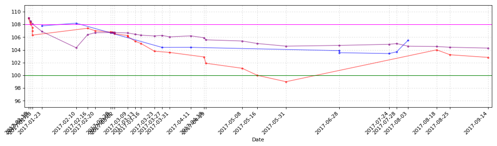


```python
CB_Transaction_Functions.CB_TD_cost_plt(hongtao_CB_TD)
```


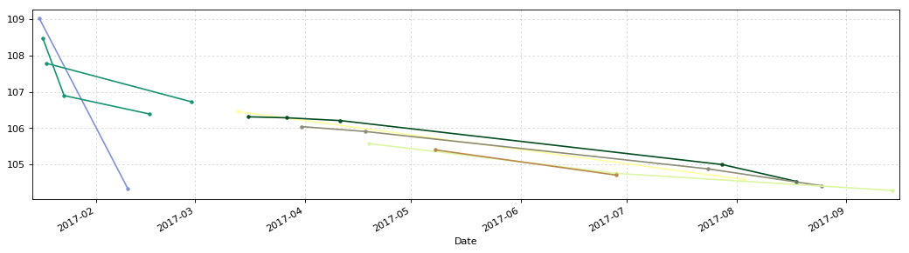


```python
hangxin = u'航信转债'
hangxin_date = '2015-6-12'
y1 = 107.00
y2 = 101.50
y3 = 95.00
y4 = 111.00
```


```python
hangxin_CB_TD = CB_Transaction_Functions.CB_Transaction_Data(hangxin)
hangxin_CB_TD.tail(10)
```


<div>


<table border="1" class="dataframe">
  <thead>
    <tr style="text-align: right;">
      <th></th>
      <th>发生日期</th>
      <th>业务名称</th>
      <th>证券代码</th>
      <th>证券名称</th>
      <th>成交均价</th>
      <th>成交数量</th>
      <th>成交金额</th>
      <th>股份余额</th>
      <th>手续费</th>
      <th>发生金额</th>
      <th>成本</th>
    </tr>
  </thead>
  <tbody>
    <tr>
      <th>10</th>
      <td>2017-04-07</td>
      <td>证券卖出清算</td>
      <td>110031</td>
      <td>航信转债</td>
      <td>104.46</td>
      <td>-10</td>
      <td>1044.6</td>
      <td>80</td>
      <td>1.00</td>
      <td>1043.60</td>
      <td>106.060000</td>
    </tr>
    <tr>
      <th>11</th>
      <td>2017-04-07</td>
      <td>证券卖出清算</td>
      <td>110031</td>
      <td>航信转债</td>
      <td>104.55</td>
      <td>-10</td>
      <td>1045.5</td>
      <td>70</td>
      <td>1.00</td>
      <td>1044.50</td>
      <td>106.290000</td>
    </tr>
    <tr>
      <th>12</th>
      <td>2017-04-07</td>
      <td>证券卖出清算</td>
      <td>110031</td>
      <td>航信转债</td>
      <td>104.80</td>
      <td>-20</td>
      <td>2096.0</td>
      <td>50</td>
      <td>1.00</td>
      <td>2095.00</td>
      <td>106.906000</td>
    </tr>
    <tr>
      <th>13</th>
      <td>2017-04-14</td>
      <td>证券买入清算</td>
      <td>110031</td>
      <td>航信转债</td>
      <td>104.01</td>
      <td>20</td>
      <td>2080.2</td>
      <td>70</td>
      <td>1.00</td>
      <td>-2081.20</td>
      <td>106.092857</td>
    </tr>
    <tr>
      <th>14</th>
      <td>2017-04-19</td>
      <td>证券买入清算</td>
      <td>110031</td>
      <td>航信转债</td>
      <td>103.61</td>
      <td>20</td>
      <td>2072.2</td>
      <td>90</td>
      <td>1.00</td>
      <td>-2073.20</td>
      <td>105.552222</td>
    </tr>
    <tr>
      <th>15</th>
      <td>2017-04-24</td>
      <td>证券买入清算</td>
      <td>110031</td>
      <td>航信转债</td>
      <td>102.95</td>
      <td>10</td>
      <td>1029.5</td>
      <td>100</td>
      <td>1.00</td>
      <td>-1030.50</td>
      <td>105.302000</td>
    </tr>
    <tr>
      <th>16</th>
      <td>2017-05-16</td>
      <td>证券买入清算</td>
      <td>110031</td>
      <td>航信转债</td>
      <td>99.98</td>
      <td>20</td>
      <td>1999.6</td>
      <td>120</td>
      <td>1.00</td>
      <td>-2000.60</td>
      <td>104.423333</td>
    </tr>
    <tr>
      <th>17</th>
      <td>2017-06-16</td>
      <td>债券兑息</td>
      <td>110031</td>
      <td>航信转债</td>
      <td>0.00</td>
      <td>0</td>
      <td>60.0</td>
      <td>120</td>
      <td>0.00</td>
      <td>48.00</td>
      <td>104.023333</td>
    </tr>
    <tr>
      <th>18</th>
      <td>2017-06-28</td>
      <td>证券卖出清算</td>
      <td>110031</td>
      <td>航信转债</td>
      <td>104.09</td>
      <td>-70</td>
      <td>7286.3</td>
      <td>50</td>
      <td>1.46</td>
      <td>7284.84</td>
      <td>103.959200</td>
    </tr>
    <tr>
      <th>19</th>
      <td>2017-07-24</td>
      <td>证券卖出清算</td>
      <td>110031</td>
      <td>航信转债</td>
      <td>104.51</td>
      <td>-30</td>
      <td>3135.3</td>
      <td>20</td>
      <td>1.00</td>
      <td>3134.30</td>
      <td>103.183000</td>
    </tr>
  </tbody>
</table>
</div>


```python
hangxin_CB_TD_cost = CB_Transaction_Functions.CB_TD_cost(hangxin,hangxin_CB_TD,hangxin_date)
hangxin_CB_TD_cost.round(3)
```


<div>


<table border="1" class="dataframe">
  <thead>
    <tr style="text-align: right;">
      <th></th>
      <th>持仓金额</th>
      <th>成交数量</th>
      <th>持仓成本</th>
      <th>起息日</th>
      <th>剩余年限</th>
    </tr>
  </thead>
  <tbody>
    <tr>
      <th>航信转债</th>
      <td>2063.66</td>
      <td>20.0</td>
      <td>103.183</td>
      <td>2015-6-12</td>
      <td>3年264天</td>
    </tr>
  </tbody>
</table>
</div>


```python
CB_Transaction_Functions.CB_TD_plt(hangxin_CB_TD,y1,y2,y3,y4)
```


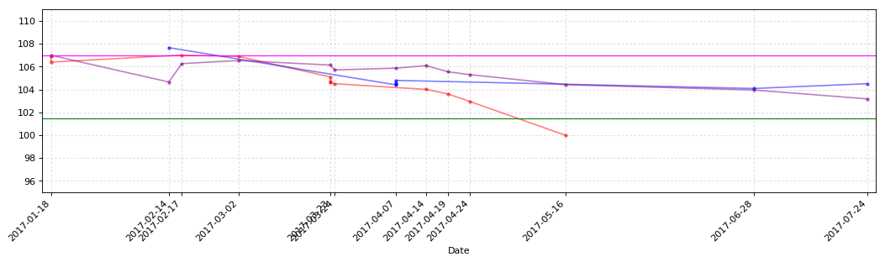


```python
CB_Transaction_Functions.CB_TD_cost_plt(hangxin_CB_TD)
```


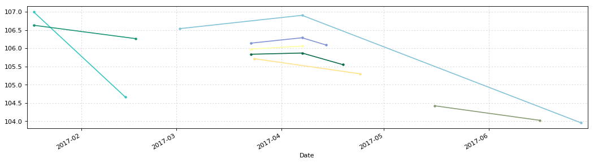


```python
haiyin = u'海印转债'
haiyin_date = '2016-6-8'
y1 = 110.00
y2 = 100.00
y3 = 90.00
y4 = 111.00
```


```python
haiyin_CB_TD = CB_Transaction_Functions.CB_Transaction_Data(haiyin)
haiyin_CB_TD.tail(10)
```


<div>


<table border="1" class="dataframe">
  <thead>
    <tr style="text-align: right;">
      <th></th>
      <th>发生日期</th>
      <th>业务名称</th>
      <th>证券代码</th>
      <th>证券名称</th>
      <th>成交均价</th>
      <th>成交数量</th>
      <th>成交金额</th>
      <th>股份余额</th>
      <th>手续费</th>
      <th>发生金额</th>
      <th>成本</th>
    </tr>
  </thead>
  <tbody>
    <tr>
      <th>1</th>
      <td>2017-04-07</td>
      <td>证券买入清算</td>
      <td>127003</td>
      <td>海印转债</td>
      <td>106.410</td>
      <td>10</td>
      <td>1064.10</td>
      <td>20</td>
      <td>0.21</td>
      <td>-1064.31</td>
      <td>106.731500</td>
    </tr>
    <tr>
      <th>2</th>
      <td>2017-04-18</td>
      <td>证券买入清算</td>
      <td>127003</td>
      <td>海印转债</td>
      <td>104.890</td>
      <td>10</td>
      <td>1048.90</td>
      <td>30</td>
      <td>0.21</td>
      <td>-1049.11</td>
      <td>106.124667</td>
    </tr>
    <tr>
      <th>3</th>
      <td>2017-04-27</td>
      <td>证券买入清算</td>
      <td>127003</td>
      <td>海印转债</td>
      <td>103.300</td>
      <td>10</td>
      <td>1033.00</td>
      <td>40</td>
      <td>0.21</td>
      <td>-1033.21</td>
      <td>105.423750</td>
    </tr>
    <tr>
      <th>4</th>
      <td>2017-05-04</td>
      <td>证券买入清算</td>
      <td>127003</td>
      <td>海印转债</td>
      <td>102.960</td>
      <td>10</td>
      <td>1029.60</td>
      <td>50</td>
      <td>0.21</td>
      <td>-1029.81</td>
      <td>104.935200</td>
    </tr>
    <tr>
      <th>5</th>
      <td>2017-05-08</td>
      <td>证券买入清算</td>
      <td>127003</td>
      <td>海印转债</td>
      <td>102.101</td>
      <td>10</td>
      <td>1021.01</td>
      <td>60</td>
      <td>0.20</td>
      <td>-1021.21</td>
      <td>104.466167</td>
    </tr>
    <tr>
      <th>6</th>
      <td>2017-05-16</td>
      <td>证券买入清算</td>
      <td>127003</td>
      <td>海印转债</td>
      <td>100.000</td>
      <td>20</td>
      <td>2000.00</td>
      <td>80</td>
      <td>0.40</td>
      <td>-2000.40</td>
      <td>103.354625</td>
    </tr>
    <tr>
      <th>7</th>
      <td>2017-07-07</td>
      <td>证券卖出清算</td>
      <td>127003</td>
      <td>海印转债</td>
      <td>102.500</td>
      <td>-30</td>
      <td>3075.00</td>
      <td>50</td>
      <td>0.62</td>
      <td>3074.38</td>
      <td>103.879800</td>
    </tr>
    <tr>
      <th>8</th>
      <td>2017-07-24</td>
      <td>证券卖出清算</td>
      <td>127003</td>
      <td>海印转债</td>
      <td>103.790</td>
      <td>-20</td>
      <td>2075.80</td>
      <td>30</td>
      <td>0.42</td>
      <td>2075.38</td>
      <td>103.953667</td>
    </tr>
    <tr>
      <th>9</th>
      <td>2017-07-31</td>
      <td>证券卖出清算</td>
      <td>127003</td>
      <td>海印转债</td>
      <td>105.390</td>
      <td>-10</td>
      <td>1053.90</td>
      <td>20</td>
      <td>0.21</td>
      <td>1053.69</td>
      <td>103.246000</td>
    </tr>
    <tr>
      <th>10</th>
      <td>2017-08-11</td>
      <td>证券买入清算</td>
      <td>127003</td>
      <td>海印转债</td>
      <td>103.450</td>
      <td>10</td>
      <td>1034.50</td>
      <td>30</td>
      <td>0.21</td>
      <td>-1034.71</td>
      <td>103.321000</td>
    </tr>
  </tbody>
</table>
</div>


```python
haiyin_CB_TD_cost = CB_Transaction_Functions.CB_TD_cost(haiyin,haiyin_CB_TD,haiyin_date)
haiyin_CB_TD_cost.round(3)
```


<div>


<table border="1" class="dataframe">
  <thead>
    <tr style="text-align: right;">
      <th></th>
      <th>持仓金额</th>
      <th>成交数量</th>
      <th>持仓成本</th>
      <th>起息日</th>
      <th>剩余年限</th>
    </tr>
  </thead>
  <tbody>
    <tr>
      <th>海印转债</th>
      <td>3099.63</td>
      <td>30.0</td>
      <td>103.321</td>
      <td>2016-6-8</td>
      <td>4年261天</td>
    </tr>
  </tbody>
</table>
</div>


```python
CB_Transaction_Functions.CB_TD_plt(haiyin_CB_TD,y1,y2,y3,y4)
```


```python
CB_Transaction_Functions.CB_TD_cost_plt(haiyin_CB_TD)
```


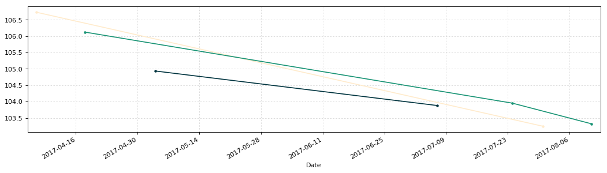


```python
guangda = u'光大转债'
guangda_date = '2017-3-17'
y1 = 101.00
y2 = 96.00
y3 = 80.00
y4 = 115.00
```


```python
guangda_CB_TD = CB_Transaction_Functions.CB_Transaction_Data(guangda)
guangda_CB_TD.tail(10)
```


<div>


<table border="1" class="dataframe">
  <thead>
    <tr style="text-align: right;">
      <th></th>
      <th>发生日期</th>
      <th>业务名称</th>
      <th>证券代码</th>
      <th>证券名称</th>
      <th>成交均价</th>
      <th>成交数量</th>
      <th>成交金额</th>
      <th>股份余额</th>
      <th>手续费</th>
      <th>发生金额</th>
      <th>成本</th>
    </tr>
  </thead>
  <tbody>
    <tr>
      <th>0</th>
      <td>2017-03-16</td>
      <td>配股权证到帐</td>
      <td>764818</td>
      <td>光大转债</td>
      <td>100.00</td>
      <td>10</td>
      <td>1000.0</td>
      <td>10</td>
      <td>0.0</td>
      <td>-1000.0</td>
      <td>100.000000</td>
    </tr>
    <tr>
      <th>1</th>
      <td>2017-04-19</td>
      <td>证券买入清算</td>
      <td>113011</td>
      <td>光大转债</td>
      <td>101.25</td>
      <td>10</td>
      <td>1012.5</td>
      <td>20</td>
      <td>1.0</td>
      <td>-1013.5</td>
      <td>100.675000</td>
    </tr>
    <tr>
      <th>2</th>
      <td>2017-05-08</td>
      <td>证券买入清算</td>
      <td>113011</td>
      <td>光大转债</td>
      <td>100.11</td>
      <td>10</td>
      <td>1001.1</td>
      <td>30</td>
      <td>1.0</td>
      <td>-1002.1</td>
      <td>100.520000</td>
    </tr>
    <tr>
      <th>3</th>
      <td>2017-05-08</td>
      <td>证券买入清算</td>
      <td>113011</td>
      <td>光大转债</td>
      <td>99.90</td>
      <td>10</td>
      <td>999.0</td>
      <td>40</td>
      <td>1.0</td>
      <td>-1000.0</td>
      <td>100.390000</td>
    </tr>
    <tr>
      <th>4</th>
      <td>2017-06-28</td>
      <td>证券卖出清算</td>
      <td>113011</td>
      <td>光大转债</td>
      <td>106.01</td>
      <td>-20</td>
      <td>2120.2</td>
      <td>20</td>
      <td>1.0</td>
      <td>2119.2</td>
      <td>94.820000</td>
    </tr>
    <tr>
      <th>5</th>
      <td>2017-07-13</td>
      <td>证券卖出清算</td>
      <td>113011</td>
      <td>光大转债</td>
      <td>107.22</td>
      <td>-10</td>
      <td>1072.2</td>
      <td>10</td>
      <td>1.0</td>
      <td>1071.2</td>
      <td>82.520000</td>
    </tr>
    <tr>
      <th>6</th>
      <td>2017-07-17</td>
      <td>证券卖出清算</td>
      <td>113011</td>
      <td>光大转债</td>
      <td>110.95</td>
      <td>-10</td>
      <td>1109.5</td>
      <td>0</td>
      <td>1.0</td>
      <td>1108.5</td>
      <td>-inf</td>
    </tr>
  </tbody>
</table>
</div>


```python
guangda_CB_TD_cost = CB_Transaction_Functions.CB_TD_cost(guangda,guangda_CB_TD,guangda_date)
guangda_CB_TD_cost.round(3)
```


<div>


<table border="1" class="dataframe">
  <thead>
    <tr style="text-align: right;">
      <th></th>
      <th>持仓金额</th>
      <th>成交数量</th>
      <th>持仓成本</th>
      <th>起息日</th>
      <th>剩余年限</th>
    </tr>
  </thead>
  <tbody>
    <tr>
      <th>光大转债</th>
      <td>-283.3</td>
      <td>0.0</td>
      <td>0</td>
      <td>2017-3-17</td>
      <td>5年179天</td>
    </tr>
  </tbody>
</table>
</div>


```python
CB_Transaction_Functions.CB_TD_plt(guangda_CB_TD,y1,y2,y3,y4)
```


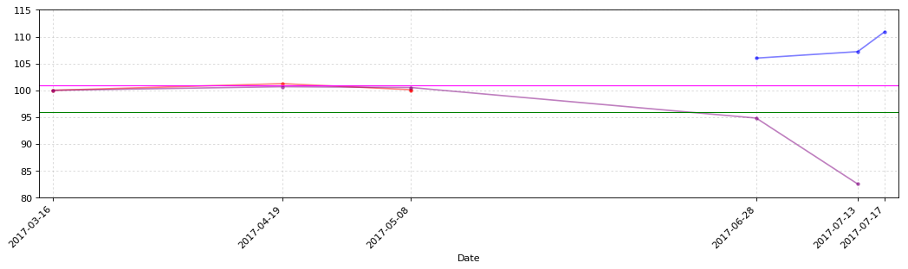


```python
CB_Transaction_Functions.CB_TD_cost_plt(guangda_CB_TD)
```


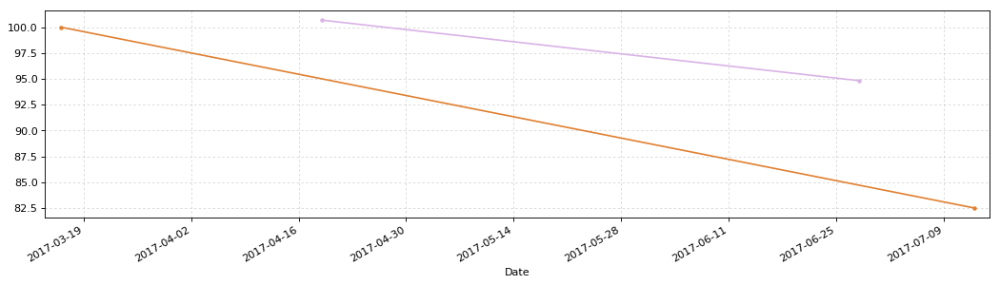


```python
CB_Transaction_Data_Cost_T = pd.concat([lanbiao_CB_TD_cost.T,huifeng_CB_TD_cost.T,hongtao_CB_TD_cost.T,hangxin_CB_TD_cost.T,
                                        haiyin_CB_TD_cost.T], axis=1)
CB_Transaction_Data_Cost = CB_Transaction_Data_Cost_T.T
```


```python
plt.figure(3,figsize=(8,6), dpi=80)
ax3 = plt.subplot(111)
```


```python
Yahei = matplotlib.font_manager.FontProperties(fname='C:\Windows\Fonts\msyh.ttf')
k = len(CB_Transaction_Data_Cost)
x_ticks_num = np.arange(0,k)
x_ticks_name = CB_Transaction_Data_Cost.index
y_ticks_values = CB_Transaction_Data_Cost[u'持仓成本'].values
y_ticks_num = CB_Transaction_Data_Cost[u'成交数量'].values
total_width = 0.7
num_bar = 2
w = total_width/num_bar
x_ticks_b = x_ticks_num - (total_width - w)/2
af = 0.8
x_ticks_num
```


    array([0, 1, 2, 3, 4])


```python
ax3.bar(x_ticks_num+w, y_ticks_values, facecolor='orange', width=w, label=u'持仓成本', alpha=af)
plt.axhline(y=100, color='red', linewidth='1.0')
plt.legend(prop={'family':'Microsoft YaHei','size':12}, loc=(0.02,0.9))
plt.ylim(90,110,1)
plt.xticks(x_ticks_num+1.5*w, x_ticks_name, fontproperties=Yahei)
plt.grid(linestyle=':', alpha=0.5)
```


```python
ax4 = ax3.twinx()
ax4.bar(x_ticks_num+2.1*w, y_ticks_num, facecolor='FireBrick', width=w, label=u'持仓数量', alpha=af)
plt.legend(prop={'family':'Microsoft YaHei','size':12}, loc=(0.02,0.8))
plt.ylim(0,280,1)
```


    (0, 280)


```python
for a,b in zip(x_ticks_num,y_ticks_values):
    ax3.text(a+w, b+0.2, '%.3f' % b, ha='center', va= 'bottom')
```


```python
for c,d in zip(x_ticks_num,y_ticks_num):
    ax4.text(c+2.1*w, d+1, '%.0f' % d, ha='center', va= 'bottom')
```


```python
CB_Transaction_Data_Cost.round(3)
```


<div>


<table border="1" class="dataframe">
  <thead>
    <tr style="text-align: right;">
      <th></th>
      <th>持仓金额</th>
      <th>成交数量</th>
      <th>持仓成本</th>
      <th>起息日</th>
      <th>剩余年限</th>
    </tr>
  </thead>
  <tbody>
    <tr>
      <th>蓝标转债</th>
      <td>3940.33</td>
      <td>40</td>
      <td>98.5082</td>
      <td>2015-12-18</td>
      <td>4年89天</td>
    </tr>
    <tr>
      <th>辉丰转债</th>
      <td>6990.83</td>
      <td>70</td>
      <td>99.869</td>
      <td>2016-4-21</td>
      <td>4年214天</td>
    </tr>
    <tr>
      <th>洪涛转债</th>
      <td>25027.8</td>
      <td>240</td>
      <td>104.282</td>
      <td>2016-7-29</td>
      <td>4年313天</td>
    </tr>
    <tr>
      <th>航信转债</th>
      <td>2063.66</td>
      <td>20</td>
      <td>103.183</td>
      <td>2015-6-12</td>
      <td>3年264天</td>
    </tr>
    <tr>
      <th>海印转债</th>
      <td>3099.63</td>
      <td>30</td>
      <td>103.321</td>
      <td>2016-6-8</td>
      <td>4年261天</td>
    </tr>
  </tbody>
</table>
</div>


```python
plt.savefig('D:/Python/iPython/CB/CB_TD.png', dpi=600)
```


```python
plt.show()
```


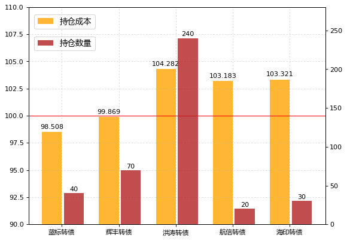


```python
CB_TD_lanbiao_last = lanbiao_CB_TD.tail(2).T
CB_TD_huifeng_last = huifeng_CB_TD.tail(2).T
CB_TD_hongtao_last = hongtao_CB_TD.tail(2).T
CB_TD_hangxin_last = hangxin_CB_TD.tail(2).T
CB_TD_haiyin_last = haiyin_CB_TD.tail(2).T
CB_TD_guangda_last = guangda_CB_TD.tail(2).T
```


```python
CB_Transaction_Data_last_T = pd.concat([CB_TD_lanbiao_last,CB_TD_huifeng_last,CB_TD_hongtao_last,CB_TD_hangxin_last,CB_TD_haiyin_last,CB_TD_guangda_last], axis=1)
CB_Transaction_Data_last = CB_Transaction_Data_last_T.T.reset_index(drop=True)
CB_Transaction_Data_last
```


<div>


<table border="1" class="dataframe">
  <thead>
    <tr style="text-align: right;">
      <th></th>
      <th>发生日期</th>
      <th>业务名称</th>
      <th>证券代码</th>
      <th>证券名称</th>
      <th>成交均价</th>
      <th>成交数量</th>
      <th>成交金额</th>
      <th>股份余额</th>
      <th>手续费</th>
      <th>发生金额</th>
      <th>成本</th>
    </tr>
  </thead>
  <tbody>
    <tr>
      <th>0</th>
      <td>2017-09-05 00:00:00</td>
      <td>证券卖出清算</td>
      <td>123001</td>
      <td>蓝标转债</td>
      <td>109.01</td>
      <td>-10</td>
      <td>1090.1</td>
      <td>30</td>
      <td>0.22</td>
      <td>1089.88</td>
      <td>95.4003</td>
    </tr>
    <tr>
      <th>1</th>
      <td>2017-09-15 00:00:00</td>
      <td>证券买入清算</td>
      <td>123001</td>
      <td>蓝标转债</td>
      <td>107.81</td>
      <td>10</td>
      <td>1078.1</td>
      <td>40</td>
      <td>0.22</td>
      <td>-1078.32</td>
      <td>98.5083</td>
    </tr>
    <tr>
      <th>2</th>
      <td>2017-09-14 00:00:00</td>
      <td>证券买入清算</td>
      <td>128012</td>
      <td>辉丰转债</td>
      <td>105.82</td>
      <td>10</td>
      <td>1058.2</td>
      <td>60</td>
      <td>0.21</td>
      <td>-1058.41</td>
      <td>99.0137</td>
    </tr>
    <tr>
      <th>3</th>
      <td>2017-09-14 00:00:00</td>
      <td>证券买入清算</td>
      <td>128012</td>
      <td>辉丰转债</td>
      <td>104.98</td>
      <td>10</td>
      <td>1049.8</td>
      <td>70</td>
      <td>0.21</td>
      <td>-1050.01</td>
      <td>99.869</td>
    </tr>
    <tr>
      <th>4</th>
      <td>2017-08-25 00:00:00</td>
      <td>证券买入清算</td>
      <td>128013</td>
      <td>洪涛转债</td>
      <td>103.233</td>
      <td>20</td>
      <td>2064.66</td>
      <td>220</td>
      <td>0.41</td>
      <td>-2065.07</td>
      <td>104.413</td>
    </tr>
    <tr>
      <th>5</th>
      <td>2017-09-14 00:00:00</td>
      <td>证券买入清算</td>
      <td>128013</td>
      <td>洪涛转债</td>
      <td>102.82</td>
      <td>20</td>
      <td>2056.4</td>
      <td>240</td>
      <td>0.41</td>
      <td>-2056.81</td>
      <td>104.282</td>
    </tr>
    <tr>
      <th>6</th>
      <td>2017-06-28 00:00:00</td>
      <td>证券卖出清算</td>
      <td>110031</td>
      <td>航信转债</td>
      <td>104.09</td>
      <td>-70</td>
      <td>7286.3</td>
      <td>50</td>
      <td>1.46</td>
      <td>7284.84</td>
      <td>103.959</td>
    </tr>
    <tr>
      <th>7</th>
      <td>2017-07-24 00:00:00</td>
      <td>证券卖出清算</td>
      <td>110031</td>
      <td>航信转债</td>
      <td>104.51</td>
      <td>-30</td>
      <td>3135.3</td>
      <td>20</td>
      <td>1</td>
      <td>3134.3</td>
      <td>103.183</td>
    </tr>
    <tr>
      <th>8</th>
      <td>2017-07-31 00:00:00</td>
      <td>证券卖出清算</td>
      <td>127003</td>
      <td>海印转债</td>
      <td>105.39</td>
      <td>-10</td>
      <td>1053.9</td>
      <td>20</td>
      <td>0.21</td>
      <td>1053.69</td>
      <td>103.246</td>
    </tr>
    <tr>
      <th>9</th>
      <td>2017-08-11 00:00:00</td>
      <td>证券买入清算</td>
      <td>127003</td>
      <td>海印转债</td>
      <td>103.45</td>
      <td>10</td>
      <td>1034.5</td>
      <td>30</td>
      <td>0.21</td>
      <td>-1034.71</td>
      <td>103.321</td>
    </tr>
    <tr>
      <th>10</th>
      <td>2017-07-13 00:00:00</td>
      <td>证券卖出清算</td>
      <td>113011</td>
      <td>光大转债</td>
      <td>107.22</td>
      <td>-10</td>
      <td>1072.2</td>
      <td>10</td>
      <td>1</td>
      <td>1071.2</td>
      <td>82.52</td>
    </tr>
    <tr>
      <th>11</th>
      <td>2017-07-17 00:00:00</td>
      <td>证券卖出清算</td>
      <td>113011</td>
      <td>光大转债</td>
      <td>110.95</td>
      <td>-10</td>
      <td>1109.5</td>
      <td>0</td>
      <td>1</td>
      <td>1108.5</td>
      <td>-inf</td>
    </tr>
  </tbody>
</table>
</div>


