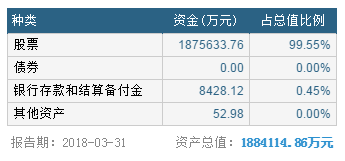
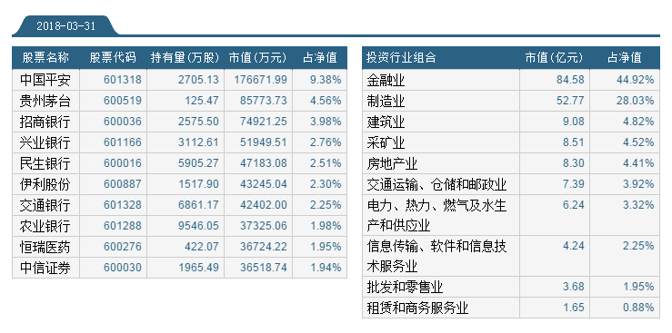
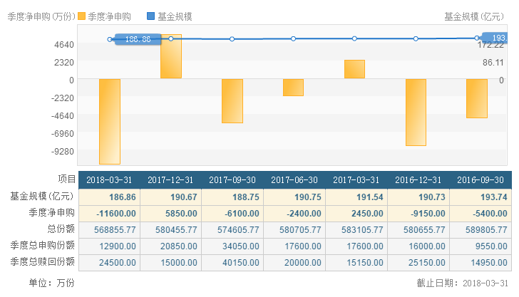
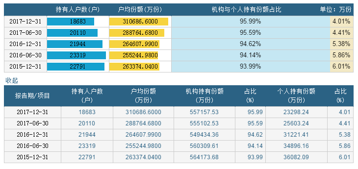
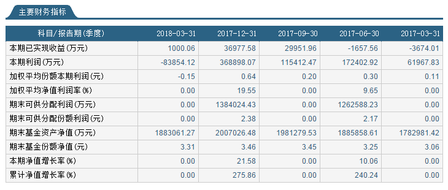
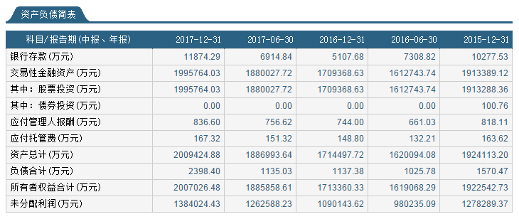
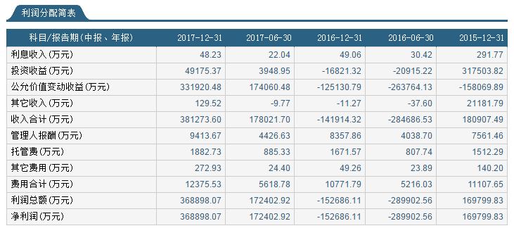

## 180ETF概况（510180）
* 华安上证180ETF成立于2006-04-13，基金规模：183.85亿元（截止2018-06-07）。
* 华安上证180ETF自成立以来，共分红7次，每年11月份，近4年分红金额0.5元左右。

* 180ETF资产配置（2018-03-31）

* 180ETF十大重仓股与行业占比（2018-03-31），重仓在金融业（中国平安、银行、证券），制造业（茅台、伊利）。

* 180ETF份额与规模（2018-03-31）

* 180ETF持有人户数与结构（2017-12-31）

* 180ETF财务数据（2018-03-31）

