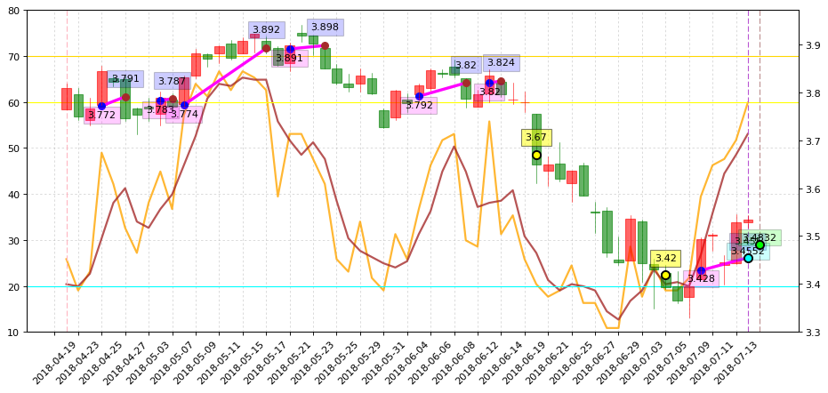
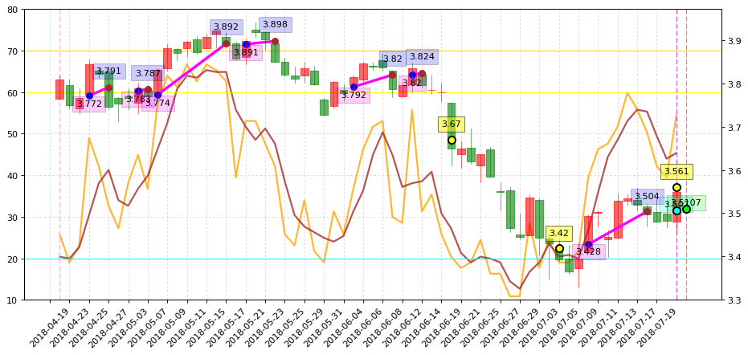

### [2018.06.19_510300ETF](http://nbviewer.jupyter.org/github/bitbyte27/PythonQuant/tree/master/ETF/2018.06.19_510300ETF/)
* [2018.07.12_510300ETF_2018-7-20](http://nbviewer.jupyter.org/github/bitbyte27/PythonQuant/blob/master/ETF/2018.06.19_510300ETF/2018.07.12_510300ETF_2018-7-20.ipynb)

### 300ETF（2018-7-13）

### 300ETF（2018-7-20）

### 300ETF（2018-8-28）

