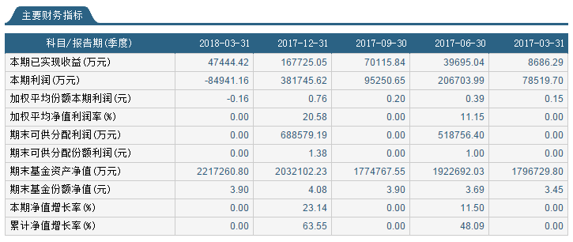

## 300ETF概况（510300）
* 华泰柏瑞沪深300ETF成立于2012-05-04，基金规模：212.41亿元（截止2018-06-08）
* 华泰柏瑞沪深300ETF自成立以来，共分红6次，每年11月份，近4年分红金额0.5元左右。

* 300ETF资产配置（2018-03-31）

* 300ETF十大重仓股与行业占比（2018-03-31），重仓在制造业39.45%（茅台、美的、格力、伊利），金融业44.92%（中国平安、银行）。

* 300ETF份额与规模（2018-03-31）

* 300ETF持有人户数与结构（2017-12-31）

* 300ETF财务数据（2018-03-31）

