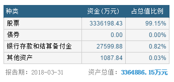
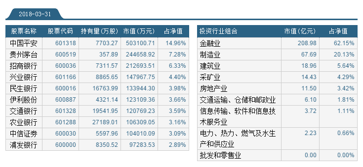
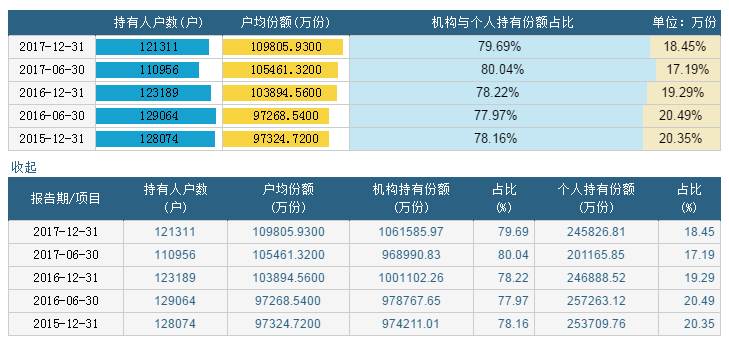
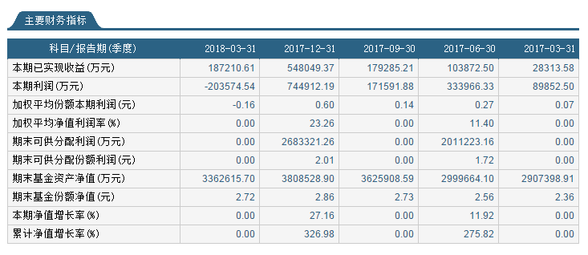
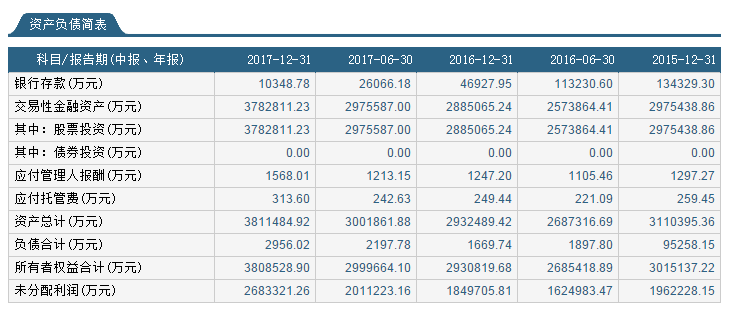
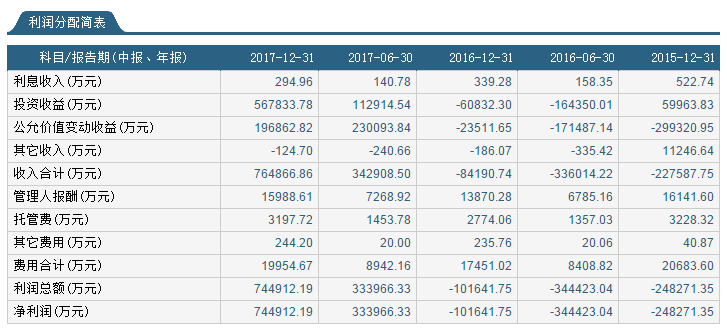

## 50ETF概况
* 华夏上证50ET成立于2004-12-30，基金规模：359.38亿元（截止2018-06-07）
* 华夏上证50ETF自成立以来，共分红10次，每年11月份，近4年分红金额0.5元左右。

* 50ETF资产配置（2018-03-31）

* 50ETF十大重仓股与行业占比（2018-03-31），重仓在金融业（中国平安、银行、证券），制造业（茅台、伊利）

* 50ETF持有人户数与结构（2017-12-31）

* 50ETF财务数据（2018-03-31）

