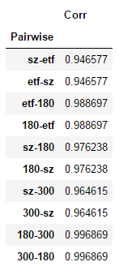
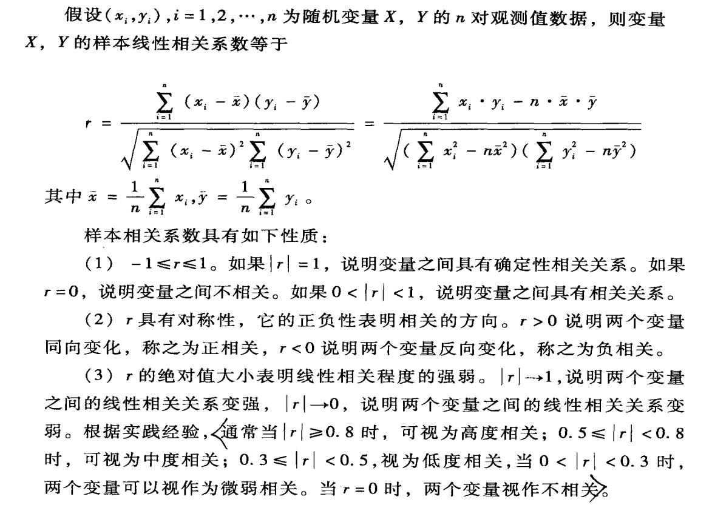

## ETF
* [50ETF概况（510050）](https://github.com/bitbyte27/PythonQuant/blob/master/ETF/50ETF/50ETF.md)
* [180ETF概况（510180）](https://github.com/bitbyte27/PythonQuant/blob/master/ETF/180ETF/180ETF.md)
* [300ETF概况（510300）](https://github.com/bitbyte27/PythonQuant/blob/master/ETF/300ETF/300ETF.md)

* [510180【180ETF】交易记录及分析（2018-6-7）](https://github.com/bitbyte27/PythonQuant/blob/master/ETF/510180_Transaction_Record_2018-6-7.md)
* [510300【300ETF】行情与指标](https://github.com/bitbyte27/PythonQuant/blob/master/ETF/2018.06.19_510300ETF/README.md)

> 50ETF（510050）、180ETF（510180）、300ETF（510300）与上证综指、上证50、上证180、沪深300的相关性研究：
> [2018.06.08_ETF_corr](http://nbviewer.jupyter.org/github/bitbyte27/PythonQuant/blob/master/ETF/2018.06.08_ETF_corr.ipynb)

> Karl Pearson 相关系数

