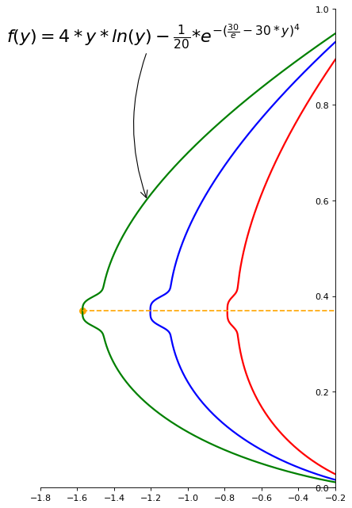

```python
import numpy as np
```


```python
import matplotlib.pyplot as plt
```


```python
plt.figure(figsize=(6,10), dpi=80)
```


    <matplotlib.figure.Figure at 0xb038c88>


```python
plt.subplot(111)
```


    <matplotlib.axes._subplots.AxesSubplot at 0x9e14ba8>


```python
X = np.linspace(0.01, 1.2, 1000,endpoint=True)
```


```python
D = 4*X*np.log(X)-(np.exp(-(30/np.exp(1)-30*X)**4))/10
```


```python
plt.plot(D, X, color="Green", linewidth=2.0, linestyle="-")
```


    [<matplotlib.lines.Line2D at 0xb186b38>]


```python
C = 3*X*np.log(X)-(np.exp(-(30/np.exp(1)-30*X)**4))/10
```


```python
plt.plot(C, X, color="blue", linewidth=2.0, linestyle="-")
```


    [<matplotlib.lines.Line2D at 0xb19f128>]


```python
B = 2*X*np.log(X)-(np.exp(-(30/np.exp(1)-30*X)**4))/20
```


```python
plt.plot(B, X, color="red", linewidth=2.0, linestyle="-")
```


    [<matplotlib.lines.Line2D at 0xb19f6a0>]


```python
t = 0.37
```


```python
K = 4*t*np.log(t)-(np.exp(-(30/np.exp(1)-30*t)**4))/10
```


```python
plt.plot([K,0],[t,t], color ='orange', linewidth=1.5, linestyle="--")
```


    [<matplotlib.lines.Line2D at 0xb19fcc0>]


```python
plt.scatter([K,],[t,], 50, color ='orange')
```


    <matplotlib.collections.PathCollection at 0xb19ff60>


```python
plt.annotate(r'${f}({y})={4*y*ln(y)-\frac{1}{20}{*}e^{-(\frac{30}{e}-30*y)^{4}}}$',
             xy=(-1.22, 0.6), xycoords='data',
             xytext=(-160, 180), textcoords='offset points', fontsize=20,
             arrowprops=dict(arrowstyle="->", connectionstyle="arc3,rad=.2"))
```


    <matplotlib.text.Annotation at 0xb1afc18>


```python
ax = plt.gca()
```


```python
ax.spines['right'].set_color('none')
```


```python
ax.spines['top'].set_color('none')
```


```python
ax.xaxis.set_ticks_position('bottom')
```


```python
ax.spines['bottom'].set_position(('data',0))
```


```python
ax.yaxis.set_ticks_position('left')
```


```python
ax.spines['left'].set_position(('data',-0.2))
```


```python
plt.xlim(-1.8,-0.2)
```


    (-1.8, -0.2)


```python
plt.ylim(0,1)
```


    (0, 1)


```python
plt.show()
```





```python

```
