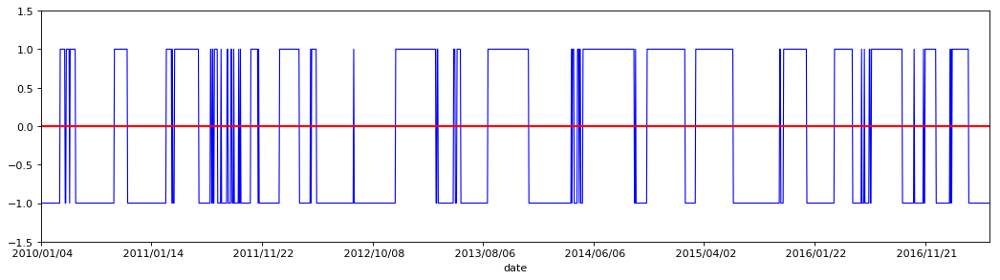
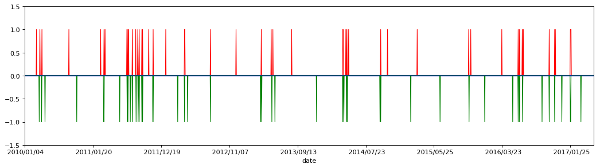
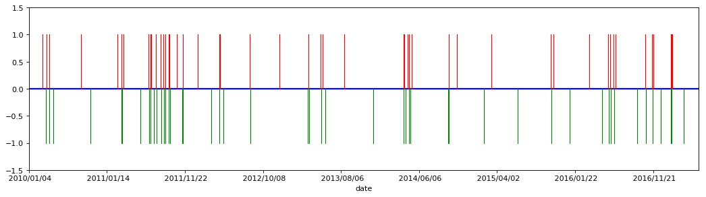
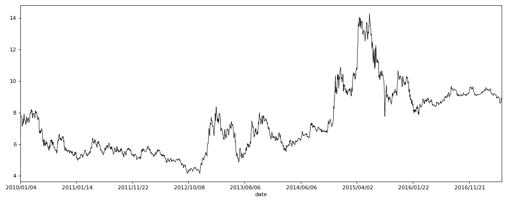
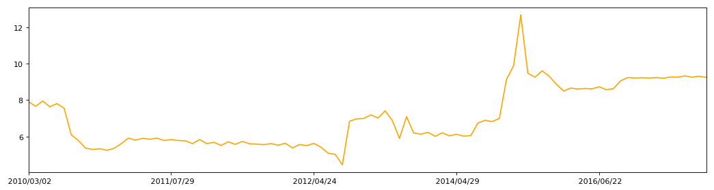

```python
import pandas as pd
import matplotlib.pyplot as plt
import numpy as np
```


```python
stock_data0 = pd.read_csv('datacsv/sz000001.csv')
# 读取csv，昨天看到的一个例子，csv里预先将数据处理好，应该就是数据清洗的阶段
```


```python
stock_data0 = stock_data0.set_index('date')
# 设置date为索引
```


```python
MA60 = stock_data0['close'].rolling(window=60).mean()
# 求收盘价的60天均价
```


```python
close_MA60 = pd.concat([stock_data0['close'], MA60], axis=1)
# 合并一个收盘价，均价的表格
```


```python
close_MA60.columns = ['close','MA60']
# 设置表格字段名称为close和MA60
```


```python
close_MA60 = close_MA60[pd.to_datetime(close_MA60.index) >= pd.to_datetime('20100101')]
# 选择时间为2010年1月1日之后的交易信息
```


```python
close_MA60.describe()
# 数据统计describe()
```


<div>

<table border="1" class="dataframe">
  <thead>
    <tr style="text-align: right;">
      <th></th>
      <th>close</th>
      <th>MA60</th>
    </tr>
  </thead>
  <tbody>
    <tr>
      <th>count</th>
      <td>1717.000000</td>
      <td>1717.000000</td>
    </tr>
    <tr>
      <th>mean</th>
      <td>7.318189</td>
      <td>7.307038</td>
    </tr>
    <tr>
      <th>std</th>
      <td>2.049082</td>
      <td>1.960859</td>
    </tr>
    <tr>
      <th>min</th>
      <td>4.130000</td>
      <td>4.387833</td>
    </tr>
    <tr>
      <th>25%</th>
      <td>5.610000</td>
      <td>5.679000</td>
    </tr>
    <tr>
      <th>50%</th>
      <td>6.820000</td>
      <td>6.859000</td>
    </tr>
    <tr>
      <th>75%</th>
      <td>8.990000</td>
      <td>9.040500</td>
    </tr>
    <tr>
      <th>max</th>
      <td>14.280000</td>
      <td>13.100667</td>
    </tr>
  </tbody>
</table>
</div>


```python
close_price = close_MA60['close']
```


```python
close_MA60['difference'] = close_MA60['close'] - close_MA60['MA60']
# 求收盘价与MA60的差，为判断收盘价在60天均价之上或之下
```


```python
buy_Point_date = close_MA60[close_MA60['close'] > close_MA60['MA60']].index
# 选择close大于MA60的行，并获取时间索引，形成数组buy_Point_date
```


```python
close_MA60.loc[buy_Point_date,'point'] = 1
# 在表close_MA60中，按照数组buy_Point_date中的时间设置一个新字段，字段名设置为point，记录值设置为1
```


```python
sell_Point_date = close_MA60[close_MA60['close'] <= close_MA60['MA60']].index
# 选择close小于等于MA60的行，并获取时间索引，形成数组sell_Point_date
```


```python
close_MA60.loc[sell_Point_date,'point'] = -1
# 在表close_MA60中，按照数组sell_Point_date中的时间，字段名为point，记录值设置为-1
# point的意义是判断持仓阶段，1为持有仓位，-1为空仓
```


```python
close_MA60.describe()
```


<div>

<table border="1" class="dataframe">
  <thead>
    <tr style="text-align: right;">
      <th></th>
      <th>close</th>
      <th>MA60</th>
      <th>difference</th>
      <th>point</th>
    </tr>
  </thead>
  <tbody>
    <tr>
      <th>count</th>
      <td>1717.000000</td>
      <td>1717.000000</td>
      <td>1717.000000</td>
      <td>1717.000000</td>
    </tr>
    <tr>
      <th>mean</th>
      <td>7.318189</td>
      <td>7.307038</td>
      <td>0.011151</td>
      <td>-0.100757</td>
    </tr>
    <tr>
      <th>std</th>
      <td>2.049082</td>
      <td>1.960859</td>
      <td>0.805369</td>
      <td>0.995201</td>
    </tr>
    <tr>
      <th>min</th>
      <td>4.130000</td>
      <td>4.387833</td>
      <td>-3.648167</td>
      <td>-1.000000</td>
    </tr>
    <tr>
      <th>25%</th>
      <td>5.610000</td>
      <td>5.679000</td>
      <td>-0.339833</td>
      <td>-1.000000</td>
    </tr>
    <tr>
      <th>50%</th>
      <td>6.820000</td>
      <td>6.859000</td>
      <td>-0.056833</td>
      <td>-1.000000</td>
    </tr>
    <tr>
      <th>75%</th>
      <td>8.990000</td>
      <td>9.040500</td>
      <td>0.308333</td>
      <td>1.000000</td>
    </tr>
    <tr>
      <th>max</th>
      <td>14.280000</td>
      <td>13.100667</td>
      <td>3.835500</td>
      <td>1.000000</td>
    </tr>
  </tbody>
</table>
</div>


```python
plt.figure(1, figsize=(16,4), dpi=80)
plt.subplot(111)
```


    <matplotlib.axes._subplots.AxesSubplot at 0xcc0bcc0>


```python
close_MA60['point'].plot(color='blue', linewidth='1').axhline(y=0, color='red', linewidth='2')
# 将表close_MA60中的point字段画出曲线，看到其交易阶段
# axhline,画一条y=0的红线
plt.ylim(-1.5,1.5)
```


    (-1.5, 1.5)


```python
plt.show()
```





```python
close_MA60['point'].value_counts()
# 统计买卖点的数量
```


    -1.0    945
     1.0    772
    Name: point, dtype: int64


```python
close_MA60['shift'] = close_MA60['point'].shift(1)
# 设置向下错位了一行，shift测试
```


```python
close_MA60['BS_point'] = (close_MA60['point'] - close_MA60['point'].shift(1))/2
# 设置字段BS_point，判断买卖点位，通过持有仓位的起始和空仓的起始来判断买卖的时间点与收盘价
```


```python
close_MA60['BS_point'] = close_MA60['BS_point'].fillna(0)
# fillna函数，将NaN替换为0
```


```python
close_MA60['BS_point'].value_counts()
# 统计买卖点数量
```


     0.0    1621
    -1.0      48
     1.0      48
    Name: BS_point, dtype: int64


```python
k = len(close_MA60)
# 表的总记录行数
```


```python
close_MA60.describe()
```


<div>

<table border="1" class="dataframe">
  <thead>
    <tr style="text-align: right;">
      <th></th>
      <th>close</th>
      <th>MA60</th>
      <th>difference</th>
      <th>point</th>
      <th>shift</th>
      <th>BS_point</th>
    </tr>
  </thead>
  <tbody>
    <tr>
      <th>count</th>
      <td>1717.000000</td>
      <td>1717.000000</td>
      <td>1717.000000</td>
      <td>1717.000000</td>
      <td>1716.000000</td>
      <td>1717.000000</td>
    </tr>
    <tr>
      <th>mean</th>
      <td>7.318189</td>
      <td>7.307038</td>
      <td>0.011151</td>
      <td>-0.100757</td>
      <td>-0.100233</td>
      <td>0.000000</td>
    </tr>
    <tr>
      <th>std</th>
      <td>2.049082</td>
      <td>1.960859</td>
      <td>0.805369</td>
      <td>0.995201</td>
      <td>0.995254</td>
      <td>0.236525</td>
    </tr>
    <tr>
      <th>min</th>
      <td>4.130000</td>
      <td>4.387833</td>
      <td>-3.648167</td>
      <td>-1.000000</td>
      <td>-1.000000</td>
      <td>-1.000000</td>
    </tr>
    <tr>
      <th>25%</th>
      <td>5.610000</td>
      <td>5.679000</td>
      <td>-0.339833</td>
      <td>-1.000000</td>
      <td>-1.000000</td>
      <td>0.000000</td>
    </tr>
    <tr>
      <th>50%</th>
      <td>6.820000</td>
      <td>6.859000</td>
      <td>-0.056833</td>
      <td>-1.000000</td>
      <td>-1.000000</td>
      <td>0.000000</td>
    </tr>
    <tr>
      <th>75%</th>
      <td>8.990000</td>
      <td>9.040500</td>
      <td>0.308333</td>
      <td>1.000000</td>
      <td>1.000000</td>
      <td>0.000000</td>
    </tr>
    <tr>
      <th>max</th>
      <td>14.280000</td>
      <td>13.100667</td>
      <td>3.835500</td>
      <td>1.000000</td>
      <td>1.000000</td>
      <td>1.000000</td>
    </tr>
  </tbody>
</table>
</div>


```python
close_MA60['order'] = np.arange(0,k,1)
# 设置一个order列，起到序列作用，原因是plt.polt出来的坐标，是按照0-k的序列来的，
# 只不过显示成索引的时间列，并非时间序列；如果是时间序列，由于时间是连续的，
# 时间轴依然要显示非交易日，这就出现y轴的空值，而时间作为索引显示，则不会显示非交易日。
# 此时的序列是0-k的序列，所以用一个order列作为隐形索引，为的是使x轴的值和表数据的时间索引对应上。
```


```python
close_MA60.tail()
# 显示出0-（k-1）的order列，作为隐形索引
```


<div>

<table border="1" class="dataframe">
  <thead>
    <tr style="text-align: right;">
      <th></th>
      <th>close</th>
      <th>MA60</th>
      <th>difference</th>
      <th>point</th>
      <th>shift</th>
      <th>BS_point</th>
      <th>order</th>
    </tr>
    <tr>
      <th>date</th>
      <th></th>
      <th></th>
      <th></th>
      <th></th>
      <th></th>
      <th></th>
      <th></th>
    </tr>
  </thead>
  <tbody>
    <tr>
      <th>2017/05/09</th>
      <td>8.64</td>
      <td>9.214167</td>
      <td>-0.574167</td>
      <td>-1.0</td>
      <td>-1.0</td>
      <td>0.0</td>
      <td>1712</td>
    </tr>
    <tr>
      <th>2017/05/10</th>
      <td>8.67</td>
      <td>9.203167</td>
      <td>-0.533167</td>
      <td>-1.0</td>
      <td>-1.0</td>
      <td>0.0</td>
      <td>1713</td>
    </tr>
    <tr>
      <th>2017/05/11</th>
      <td>8.70</td>
      <td>9.191333</td>
      <td>-0.491333</td>
      <td>-1.0</td>
      <td>-1.0</td>
      <td>0.0</td>
      <td>1714</td>
    </tr>
    <tr>
      <th>2017/05/12</th>
      <td>8.90</td>
      <td>9.183000</td>
      <td>-0.283000</td>
      <td>-1.0</td>
      <td>-1.0</td>
      <td>0.0</td>
      <td>1715</td>
    </tr>
    <tr>
      <th>2017/05/15</th>
      <td>8.87</td>
      <td>9.173333</td>
      <td>-0.303333</td>
      <td>-1.0</td>
      <td>-1.0</td>
      <td>0.0</td>
      <td>1716</td>
    </tr>
  </tbody>
</table>
</div>


```python
buy_Point = close_MA60[close_MA60['BS_point'] >= 0]
sell_Point = close_MA60[close_MA60['BS_point'] <= 0]
# 选择所有大于等于0的记录，则为买点，设置包括等于0的数据，是因为要在画图突出买卖点
# 选择所有小于等于0 的记录，则为卖点
```


```python
buy_Point.head()
```


<div>

<table border="1" class="dataframe">
  <thead>
    <tr style="text-align: right;">
      <th></th>
      <th>close</th>
      <th>MA60</th>
      <th>difference</th>
      <th>point</th>
      <th>shift</th>
      <th>BS_point</th>
      <th>order</th>
    </tr>
    <tr>
      <th>date</th>
      <th></th>
      <th></th>
      <th></th>
      <th></th>
      <th></th>
      <th></th>
      <th></th>
    </tr>
  </thead>
  <tbody>
    <tr>
      <th>2010/01/04</th>
      <td>8.14</td>
      <td>8.205500</td>
      <td>-0.065500</td>
      <td>-1.0</td>
      <td>NaN</td>
      <td>0.0</td>
      <td>0</td>
    </tr>
    <tr>
      <th>2010/01/05</th>
      <td>7.99</td>
      <td>8.225333</td>
      <td>-0.235333</td>
      <td>-1.0</td>
      <td>-1.0</td>
      <td>0.0</td>
      <td>1</td>
    </tr>
    <tr>
      <th>2010/01/06</th>
      <td>7.84</td>
      <td>8.236333</td>
      <td>-0.396333</td>
      <td>-1.0</td>
      <td>-1.0</td>
      <td>0.0</td>
      <td>2</td>
    </tr>
    <tr>
      <th>2010/01/07</th>
      <td>7.75</td>
      <td>8.246333</td>
      <td>-0.496333</td>
      <td>-1.0</td>
      <td>-1.0</td>
      <td>0.0</td>
      <td>3</td>
    </tr>
    <tr>
      <th>2010/01/08</th>
      <td>7.74</td>
      <td>8.255333</td>
      <td>-0.515333</td>
      <td>-1.0</td>
      <td>-1.0</td>
      <td>0.0</td>
      <td>4</td>
    </tr>
  </tbody>
</table>
</div>


```python
plt.figure(2, figsize=(16,4), dpi=80)
plt.subplot(111)
```


    <matplotlib.axes._subplots.AxesSubplot at 0xc341d30>


```python
buy_Point['BS_point'].plot(color='red', linewidth='1').axhline(y=0, color='blue', linewidth='2')
sell_Point['BS_point'].plot(color='green', linewidth='1')
# 买卖点画图
# axhline,画一条y=0的红线
# 这个买卖点有一个缺陷，就是出现连续几天有买有卖，
# 第一天买第二天卖第三天买……如此循环的话，就会变成一条买的直线和卖的直线
```


    <matplotlib.axes._subplots.AxesSubplot at 0xc341d30>


```python
plt.ylim(-1.5,1.5)
```


    (-1.5, 1.5)


```python
plt.show()
```





```python
plt.figure(3, figsize=(16,4), dpi=80)
plt.subplot(111)
```


    <matplotlib.axes._subplots.AxesSubplot at 0xcf0ee48>


```python
buy_Point0 = close_MA60[close_MA60['BS_point'] > 0]
sell_Point0 = close_MA60[close_MA60['BS_point'] < 0]
buy_Point0 = buy_Point0['order']
sell_Point0 = sell_Point0['order']
```


```python
close_MA60['point'].plot(color='white', linewidth='1').axhline(y=0, color='blue', linewidth='2')
plt.plot([buy_Point0,buy_Point0],[0,1], color ='red', linewidth=1, linestyle="-")
plt.plot([sell_Point0,sell_Point0],[0,-1], color ='green', linewidth=1, linestyle="-")
```


    [<matplotlib.lines.Line2D at 0xe7c3c18>,
     <matplotlib.lines.Line2D at 0xe871ef0>,
     <matplotlib.lines.Line2D at 0xe87f048>,
     <matplotlib.lines.Line2D at 0xe87f128>,
     <matplotlib.lines.Line2D at 0xe87f240>,
     <matplotlib.lines.Line2D at 0xe87f358>,
     <matplotlib.lines.Line2D at 0xe87f470>,
     <matplotlib.lines.Line2D at 0xe87f588>,
     <matplotlib.lines.Line2D at 0xe87f6a0>,
     <matplotlib.lines.Line2D at 0xe87f7b8>,
     <matplotlib.lines.Line2D at 0xe87f8d0>,
     <matplotlib.lines.Line2D at 0xe87f9e8>,
     <matplotlib.lines.Line2D at 0xe87fb00>,
     <matplotlib.lines.Line2D at 0xe87fc18>,
     <matplotlib.lines.Line2D at 0xe87fd30>,
     <matplotlib.lines.Line2D at 0xe87fe48>,
     <matplotlib.lines.Line2D at 0xe87ff60>,
     <matplotlib.lines.Line2D at 0xe90c0b8>,
     <matplotlib.lines.Line2D at 0xe90c1d0>,
     <matplotlib.lines.Line2D at 0xe90c2e8>,
     <matplotlib.lines.Line2D at 0xe90c400>,
     <matplotlib.lines.Line2D at 0xe90c518>,
     <matplotlib.lines.Line2D at 0xe90c630>,
     <matplotlib.lines.Line2D at 0xe90c748>,
     <matplotlib.lines.Line2D at 0xe90c860>,
     <matplotlib.lines.Line2D at 0xe90c978>,
     <matplotlib.lines.Line2D at 0xe90ca90>,
     <matplotlib.lines.Line2D at 0xe90cba8>,
     <matplotlib.lines.Line2D at 0xe90ccc0>,
     <matplotlib.lines.Line2D at 0xe90cdd8>,
     <matplotlib.lines.Line2D at 0xe90cef0>,
     <matplotlib.lines.Line2D at 0xe917048>,
     <matplotlib.lines.Line2D at 0xe917160>,
     <matplotlib.lines.Line2D at 0xe917278>,
     <matplotlib.lines.Line2D at 0xe917390>,
     <matplotlib.lines.Line2D at 0xe9174a8>,
     <matplotlib.lines.Line2D at 0xe9175c0>,
     <matplotlib.lines.Line2D at 0xe9176d8>,
     <matplotlib.lines.Line2D at 0xe9177f0>,
     <matplotlib.lines.Line2D at 0xe917908>,
     <matplotlib.lines.Line2D at 0xe917a20>,
     <matplotlib.lines.Line2D at 0xe917b38>,
     <matplotlib.lines.Line2D at 0xe917c50>,
     <matplotlib.lines.Line2D at 0xe917d68>,
     <matplotlib.lines.Line2D at 0xe917e80>,
     <matplotlib.lines.Line2D at 0xe917f98>,
     <matplotlib.lines.Line2D at 0xe9240f0>,
     <matplotlib.lines.Line2D at 0xe924208>]


```python
plt.ylim(-1.5,1.5)
plt.show()
```





```python
plt.figure(4, figsize=(16,6), dpi=80)
plt.subplot(111)
```


    <matplotlib.axes._subplots.AxesSubplot at 0xeb17978>


```python
close_price.plot(color ='black', linewidth=0.8, linestyle="-")
```


    <matplotlib.axes._subplots.AxesSubplot at 0xeb17978>


```python
plt.show()
```





```python
BP_price = close_MA60.loc[close_MA60['BS_point'] == 1, ['close','BS_point']]
# 读取出买点出现时的日期、收盘价
```


```python
SP_price = close_MA60.loc[close_MA60['BS_point'] == -1, ['close','BS_point']]
# 读取出卖点出现时的日期、收盘价
```


```python
# 第一种收益率数据清洗方法
```


```python
close_MA60_signals = pd.concat([BP_price,SP_price], axis=1)
# 买卖点出现时的日期、收盘价合并成一张表，此时会出现NaN空值
```


```python
close_MA60_signals.columns = ['close_B','Buy_point','close_S','Sell_point']
# 对列的字段重命名
```


```python
close_MA60_signals = close_MA60_signals.fillna(0)
# 将表数据中的空值NaN替换为0，使之可以计算
```


```python
close_MA60_signals['close_BS'] = close_MA60_signals['close_B']+close_MA60_signals['close_S']
# 将买卖点出现的收盘价合并成一个字段
```


```python
close_MA60_signals['point_BS'] = close_MA60_signals['Buy_point']+close_MA60_signals['Sell_point']
# 将买卖点出现的信号合并成一个字段
```


```python
close_MA60_signals = close_MA60_signals[['close_BS','point_BS']]
# 提取并形成两个字段显示的买卖价格与信号，
# 形成的表数据为一行买一行卖，如此循环
```


```python
close_MA60_signals.head()
```


<div>

<table border="1" class="dataframe">
  <thead>
    <tr style="text-align: right;">
      <th></th>
      <th>close_BS</th>
      <th>point_BS</th>
    </tr>
  </thead>
  <tbody>
    <tr>
      <th>2010/03/02</th>
      <td>7.92</td>
      <td>1.0</td>
    </tr>
    <tr>
      <th>2010/03/15</th>
      <td>7.66</td>
      <td>-1.0</td>
    </tr>
    <tr>
      <th>2010/03/17</th>
      <td>7.95</td>
      <td>1.0</td>
    </tr>
    <tr>
      <th>2010/03/25</th>
      <td>7.63</td>
      <td>-1.0</td>
    </tr>
    <tr>
      <th>2010/03/26</th>
      <td>7.81</td>
      <td>1.0</td>
    </tr>
  </tbody>
</table>
</div>


```python
plt.figure(5, figsize=(16,4), dpi=80)
plt.subplot(111)
```


    <matplotlib.axes._subplots.AxesSubplot at 0xec8e710>


```python
close_MA60_signals['close_BS'].plot(color ='orange', linewidth=1.5, linestyle="-")
```


    <matplotlib.axes._subplots.AxesSubplot at 0xec8e710>


```python
plt.show()
```





```python
# 第二种收益率数据清洗方法
```


```python
BP_price.head()
```


<div>

<table border="1" class="dataframe">
  <thead>
    <tr style="text-align: right;">
      <th></th>
      <th>close</th>
      <th>BS_point</th>
    </tr>
    <tr>
      <th>date</th>
      <th></th>
      <th></th>
    </tr>
  </thead>
  <tbody>
    <tr>
      <th>2010/03/02</th>
      <td>7.92</td>
      <td>1.0</td>
    </tr>
    <tr>
      <th>2010/03/17</th>
      <td>7.95</td>
      <td>1.0</td>
    </tr>
    <tr>
      <th>2010/03/26</th>
      <td>7.81</td>
      <td>1.0</td>
    </tr>
    <tr>
      <th>2010/10/11</th>
      <td>6.09</td>
      <td>1.0</td>
    </tr>
    <tr>
      <th>2011/03/01</th>
      <td>5.36</td>
      <td>1.0</td>
    </tr>
  </tbody>
</table>
</div>


```python
SP_price.head()
```


<div>

<table border="1" class="dataframe">
  <thead>
    <tr style="text-align: right;">
      <th></th>
      <th>close</th>
      <th>BS_point</th>
    </tr>
    <tr>
      <th>date</th>
      <th></th>
      <th></th>
    </tr>
  </thead>
  <tbody>
    <tr>
      <th>2010/03/15</th>
      <td>7.66</td>
      <td>-1.0</td>
    </tr>
    <tr>
      <th>2010/03/25</th>
      <td>7.63</td>
      <td>-1.0</td>
    </tr>
    <tr>
      <th>2010/04/12</th>
      <td>7.55</td>
      <td>-1.0</td>
    </tr>
    <tr>
      <th>2010/11/12</th>
      <td>5.78</td>
      <td>-1.0</td>
    </tr>
    <tr>
      <th>2011/03/15</th>
      <td>5.29</td>
      <td>-1.0</td>
    </tr>
  </tbody>
</table>
</div>


```python
BP_price['startdate'] = BP_price.index
```


```python
BP_Profit = BP_price[['startdate','close','BS_point']]
```


```python
BP_Profit.columns = ['Start_date','Buy_close','Buy_point']
```


```python
BP_Profit = BP_Profit.reset_index(drop=True)
```


```python
BP_Profit.head()
```


<div>

<table border="1" class="dataframe">
  <thead>
    <tr style="text-align: right;">
      <th></th>
      <th>Start_date</th>
      <th>Buy_close</th>
      <th>Buy_point</th>
    </tr>
  </thead>
  <tbody>
    <tr>
      <th>0</th>
      <td>2010/03/02</td>
      <td>7.92</td>
      <td>1.0</td>
    </tr>
    <tr>
      <th>1</th>
      <td>2010/03/17</td>
      <td>7.95</td>
      <td>1.0</td>
    </tr>
    <tr>
      <th>2</th>
      <td>2010/03/26</td>
      <td>7.81</td>
      <td>1.0</td>
    </tr>
    <tr>
      <th>3</th>
      <td>2010/10/11</td>
      <td>6.09</td>
      <td>1.0</td>
    </tr>
    <tr>
      <th>4</th>
      <td>2011/03/01</td>
      <td>5.36</td>
      <td>1.0</td>
    </tr>
  </tbody>
</table>
</div>


```python
BP_Profit.index
```


    RangeIndex(start=0, stop=48, step=1)


```python
SP_price['enddate'] = SP_price.index
```


```python
SP_Profit = SP_price[['enddate','close','BS_point']]
```


```python
SP_Profit.columns = ['End_date','Sell_close','Sell_point']
```


```python
SP_Profit = SP_Profit.reset_index(drop=True)
```


```python
SP_Profit.head()
```


<div>

<table border="1" class="dataframe">
  <thead>
    <tr style="text-align: right;">
      <th></th>
      <th>End_date</th>
      <th>Sell_close</th>
      <th>Sell_point</th>
    </tr>
  </thead>
  <tbody>
    <tr>
      <th>0</th>
      <td>2010/03/15</td>
      <td>7.66</td>
      <td>-1.0</td>
    </tr>
    <tr>
      <th>1</th>
      <td>2010/03/25</td>
      <td>7.63</td>
      <td>-1.0</td>
    </tr>
    <tr>
      <th>2</th>
      <td>2010/04/12</td>
      <td>7.55</td>
      <td>-1.0</td>
    </tr>
    <tr>
      <th>3</th>
      <td>2010/11/12</td>
      <td>5.78</td>
      <td>-1.0</td>
    </tr>
    <tr>
      <th>4</th>
      <td>2011/03/15</td>
      <td>5.29</td>
      <td>-1.0</td>
    </tr>
  </tbody>
</table>
</div>


```python
SP_Profit.index
```


    RangeIndex(start=0, stop=48, step=1)


```python
close_MA60_Profit = pd.concat([BP_Profit, SP_Profit], axis=1, join_axes=[BP_Profit.index])
```


```python
close_MA60_Profit = close_MA60_Profit[['Start_date','End_date','Buy_close','Sell_close']]
```


```python
close_MA60_Profit['Profit'] = (close_MA60_Profit['Sell_close']-close_MA60_Profit['Buy_close'])/(close_MA60_Profit['Buy_close'])
```


```python
# close_MA60_Profit['Profit'] = close_MA60_Profit['Profit'].values*100
```


```python
close_MA60_Profit
```


<div>

<table border="1" class="dataframe">
  <thead>
    <tr style="text-align: right;">
      <th></th>
      <th>Start_date</th>
      <th>End_date</th>
      <th>Buy_close</th>
      <th>Sell_close</th>
      <th>Profit</th>
    </tr>
  </thead>
  <tbody>
    <tr>
      <th>0</th>
      <td>2010/03/02</td>
      <td>2010/03/15</td>
      <td>7.92</td>
      <td>7.66</td>
      <td>-0.032828</td>
    </tr>
    <tr>
      <th>1</th>
      <td>2010/03/17</td>
      <td>2010/03/25</td>
      <td>7.95</td>
      <td>7.63</td>
      <td>-0.040252</td>
    </tr>
    <tr>
      <th>2</th>
      <td>2010/03/26</td>
      <td>2010/04/12</td>
      <td>7.81</td>
      <td>7.55</td>
      <td>-0.033291</td>
    </tr>
    <tr>
      <th>3</th>
      <td>2010/10/11</td>
      <td>2010/11/12</td>
      <td>6.09</td>
      <td>5.78</td>
      <td>-0.050903</td>
    </tr>
    <tr>
      <th>4</th>
      <td>2011/03/01</td>
      <td>2011/03/15</td>
      <td>5.36</td>
      <td>5.29</td>
      <td>-0.013060</td>
    </tr>
    <tr>
      <th>5</th>
      <td>2011/03/16</td>
      <td>2011/03/17</td>
      <td>5.33</td>
      <td>5.24</td>
      <td>-0.016886</td>
    </tr>
    <tr>
      <th>6</th>
      <td>2011/03/22</td>
      <td>2011/06/02</td>
      <td>5.35</td>
      <td>5.60</td>
      <td>0.046729</td>
    </tr>
    <tr>
      <th>7</th>
      <td>2011/07/04</td>
      <td>2011/07/06</td>
      <td>5.91</td>
      <td>5.80</td>
      <td>-0.018613</td>
    </tr>
    <tr>
      <th>8</th>
      <td>2011/07/08</td>
      <td>2011/07/11</td>
      <td>5.90</td>
      <td>5.85</td>
      <td>-0.008475</td>
    </tr>
    <tr>
      <th>9</th>
      <td>2011/07/13</td>
      <td>2011/07/21</td>
      <td>5.91</td>
      <td>5.78</td>
      <td>-0.021997</td>
    </tr>
    <tr>
      <th>10</th>
      <td>2011/07/29</td>
      <td>2011/08/01</td>
      <td>5.83</td>
      <td>5.78</td>
      <td>-0.008576</td>
    </tr>
    <tr>
      <th>11</th>
      <td>2011/08/15</td>
      <td>2011/08/18</td>
      <td>5.76</td>
      <td>5.61</td>
      <td>-0.026042</td>
    </tr>
    <tr>
      <th>12</th>
      <td>2011/08/25</td>
      <td>2011/08/29</td>
      <td>5.83</td>
      <td>5.61</td>
      <td>-0.037736</td>
    </tr>
    <tr>
      <th>13</th>
      <td>2011/09/01</td>
      <td>2011/09/05</td>
      <td>5.68</td>
      <td>5.51</td>
      <td>-0.029930</td>
    </tr>
    <tr>
      <th>14</th>
      <td>2011/09/16</td>
      <td>2011/09/19</td>
      <td>5.71</td>
      <td>5.57</td>
      <td>-0.024518</td>
    </tr>
    <tr>
      <th>15</th>
      <td>2011/09/21</td>
      <td>2011/09/22</td>
      <td>5.73</td>
      <td>5.60</td>
      <td>-0.022688</td>
    </tr>
    <tr>
      <th>16</th>
      <td>2011/10/25</td>
      <td>2011/11/11</td>
      <td>5.58</td>
      <td>5.55</td>
      <td>-0.005376</td>
    </tr>
    <tr>
      <th>17</th>
      <td>2011/11/14</td>
      <td>2011/11/15</td>
      <td>5.61</td>
      <td>5.52</td>
      <td>-0.016043</td>
    </tr>
    <tr>
      <th>18</th>
      <td>2012/01/20</td>
      <td>2012/03/20</td>
      <td>5.63</td>
      <td>5.37</td>
      <td>-0.046181</td>
    </tr>
    <tr>
      <th>19</th>
      <td>2012/04/20</td>
      <td>2012/04/23</td>
      <td>5.56</td>
      <td>5.50</td>
      <td>-0.010791</td>
    </tr>
    <tr>
      <th>20</th>
      <td>2012/04/24</td>
      <td>2012/05/09</td>
      <td>5.62</td>
      <td>5.41</td>
      <td>-0.037367</td>
    </tr>
    <tr>
      <th>21</th>
      <td>2012/08/14</td>
      <td>2012/08/15</td>
      <td>5.08</td>
      <td>5.02</td>
      <td>-0.011811</td>
    </tr>
    <tr>
      <th>22</th>
      <td>2012/12/05</td>
      <td>2013/03/28</td>
      <td>4.44</td>
      <td>6.84</td>
      <td>0.540541</td>
    </tr>
    <tr>
      <th>23</th>
      <td>2013/04/01</td>
      <td>2013/04/03</td>
      <td>6.97</td>
      <td>6.99</td>
      <td>0.002869</td>
    </tr>
    <tr>
      <th>24</th>
      <td>2013/05/20</td>
      <td>2013/05/23</td>
      <td>7.19</td>
      <td>7.02</td>
      <td>-0.023644</td>
    </tr>
    <tr>
      <th>25</th>
      <td>2013/05/28</td>
      <td>2013/06/06</td>
      <td>7.41</td>
      <td>6.88</td>
      <td>-0.071525</td>
    </tr>
    <tr>
      <th>26</th>
      <td>2013/08/19</td>
      <td>2013/12/11</td>
      <td>5.90</td>
      <td>7.09</td>
      <td>0.201695</td>
    </tr>
    <tr>
      <th>27</th>
      <td>2014/04/08</td>
      <td>2014/04/09</td>
      <td>6.19</td>
      <td>6.13</td>
      <td>-0.009693</td>
    </tr>
    <tr>
      <th>28</th>
      <td>2014/04/10</td>
      <td>2014/04/15</td>
      <td>6.23</td>
      <td>6.01</td>
      <td>-0.035313</td>
    </tr>
    <tr>
      <th>29</th>
      <td>2014/04/23</td>
      <td>2014/04/28</td>
      <td>6.20</td>
      <td>6.04</td>
      <td>-0.025806</td>
    </tr>
    <tr>
      <th>30</th>
      <td>2014/04/29</td>
      <td>2014/05/05</td>
      <td>6.12</td>
      <td>6.02</td>
      <td>-0.016340</td>
    </tr>
    <tr>
      <th>31</th>
      <td>2014/05/09</td>
      <td>2014/09/22</td>
      <td>6.05</td>
      <td>6.74</td>
      <td>0.114050</td>
    </tr>
    <tr>
      <th>32</th>
      <td>2014/09/24</td>
      <td>2014/09/25</td>
      <td>6.89</td>
      <td>6.82</td>
      <td>-0.010160</td>
    </tr>
    <tr>
      <th>33</th>
      <td>2014/10/30</td>
      <td>2015/02/06</td>
      <td>6.99</td>
      <td>9.13</td>
      <td>0.306152</td>
    </tr>
    <tr>
      <th>34</th>
      <td>2015/03/12</td>
      <td>2015/06/18</td>
      <td>9.89</td>
      <td>12.69</td>
      <td>0.283114</td>
    </tr>
    <tr>
      <th>35</th>
      <td>2015/10/26</td>
      <td>2015/10/28</td>
      <td>9.47</td>
      <td>9.26</td>
      <td>-0.022175</td>
    </tr>
    <tr>
      <th>36</th>
      <td>2015/11/04</td>
      <td>2016/01/04</td>
      <td>9.61</td>
      <td>9.31</td>
      <td>-0.031217</td>
    </tr>
    <tr>
      <th>37</th>
      <td>2016/03/21</td>
      <td>2016/05/09</td>
      <td>8.87</td>
      <td>8.50</td>
      <td>-0.041714</td>
    </tr>
    <tr>
      <th>38</th>
      <td>2016/05/31</td>
      <td>2016/06/01</td>
      <td>8.66</td>
      <td>8.61</td>
      <td>-0.005774</td>
    </tr>
    <tr>
      <th>39</th>
      <td>2016/06/07</td>
      <td>2016/06/08</td>
      <td>8.64</td>
      <td>8.62</td>
      <td>-0.002315</td>
    </tr>
    <tr>
      <th>40</th>
      <td>2016/06/22</td>
      <td>2016/06/24</td>
      <td>8.73</td>
      <td>8.57</td>
      <td>-0.018328</td>
    </tr>
    <tr>
      <th>41</th>
      <td>2016/06/28</td>
      <td>2016/09/14</td>
      <td>8.63</td>
      <td>9.06</td>
      <td>0.049826</td>
    </tr>
    <tr>
      <th>42</th>
      <td>2016/10/24</td>
      <td>2016/10/25</td>
      <td>9.24</td>
      <td>9.21</td>
      <td>-0.003247</td>
    </tr>
    <tr>
      <th>43</th>
      <td>2016/11/16</td>
      <td>2016/11/17</td>
      <td>9.23</td>
      <td>9.21</td>
      <td>-0.002167</td>
    </tr>
    <tr>
      <th>44</th>
      <td>2016/11/21</td>
      <td>2016/12/19</td>
      <td>9.24</td>
      <td>9.20</td>
      <td>-0.004329</td>
    </tr>
    <tr>
      <th>45</th>
      <td>2017/01/24</td>
      <td>2017/01/25</td>
      <td>9.27</td>
      <td>9.26</td>
      <td>-0.001079</td>
    </tr>
    <tr>
      <th>46</th>
      <td>2017/01/26</td>
      <td>2017/02/03</td>
      <td>9.33</td>
      <td>9.26</td>
      <td>-0.007503</td>
    </tr>
    <tr>
      <th>47</th>
      <td>2017/02/06</td>
      <td>2017/03/20</td>
      <td>9.31</td>
      <td>9.25</td>
      <td>-0.006445</td>
    </tr>
  </tbody>
</table>
</div>


