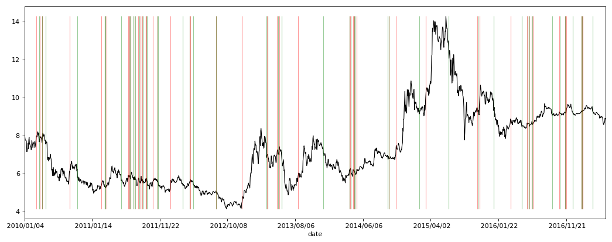
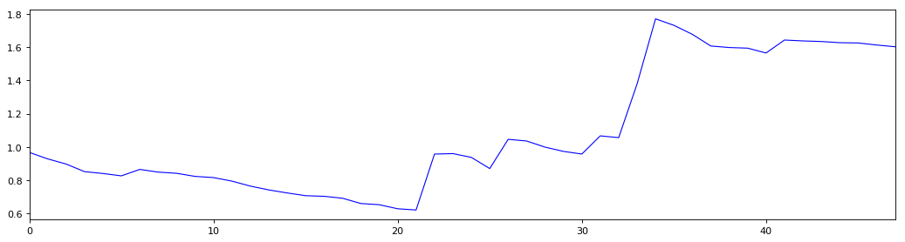

```python
import pandas as pd
import matplotlib.pyplot as plt
import numpy as np
```


```python
stock_data0 = pd.read_csv('datacsv/sz000001.csv')
# 读取csv，昨天看到的一个例子，csv里预先将数据处理好，应该就是数据清洗的阶段
```


```python
stock_data0 = stock_data0.set_index('date')
# 设置date为索引
```


```python
MA60 = stock_data0['close'].rolling(window=60).mean()
# 求收盘价的60天均价
```


```python
close_MA60 = pd.concat([stock_data0['close'], MA60], axis=1)
# 合并一个收盘价，均价的表格
```


```python
close_MA60.columns = ['close','MA60']
# 设置表格字段名称为close和MA60
```


```python
close_MA60 = close_MA60[pd.to_datetime(close_MA60.index) >= pd.to_datetime('20100101')]
# 选择时间为2010年1月1日之后的交易信息
```


```python
close_price = close_MA60['close']
```


```python
buy_Point_date = close_MA60[close_MA60['close'] > close_MA60['MA60']].index
# 选择close大于MA60的行，并获取时间索引，形成数组buy_Point_date
```


```python
close_MA60.loc[buy_Point_date,'point'] = 1
# 在表close_MA60中，按照数组buy_Point_date中的时间设置一个新字段，字段名设置为point，记录值设置为1
```


```python
sell_Point_date = close_MA60[close_MA60['close'] <= close_MA60['MA60']].index
# 选择close小于等于MA60的行，并获取时间索引，形成数组sell_Point_date
```


```python
close_MA60.loc[sell_Point_date,'point'] = -1
# 在表close_MA60中，按照数组sell_Point_date中的时间，字段名为point，记录值设置为-1
# point的意义是判断持仓阶段，1为持有仓位，-1为空仓
```


```python
close_MA60['BS_point'] = (close_MA60['point'] - close_MA60['point'].shift(1))/2
# 设置字段BS_point，判断买卖点位，通过持有仓位的起始和空仓的起始来判断买卖的时间点与收盘价
```


```python
close_MA60['BS_point'] = close_MA60['BS_point'].fillna(0)
# fillna函数，将NaN替换为0
```


```python
k = len(close_MA60)
# 表的总记录行数
```


```python
close_MA60['order'] = np.arange(0,k,1)
# 设置一个order列，起到序列作用，原因是plt.polt出来的坐标，是按照0-k的序列来的，
# 只不过显示成索引的时间列，并非时间序列；如果是时间序列，由于时间是连续的，
# 时间轴依然要显示非交易日，这就出现y轴的空值，而时间作为索引显示，则不会显示非交易日。
# 此时的序列是0-k的序列，所以用一个order列作为隐形索引，为的是使x轴的值和表数据的时间索引对应上。
```


```python
buy_Point = close_MA60[close_MA60['BS_point'] > 0]
sell_Point = close_MA60[close_MA60['BS_point'] < 0]
# 将买卖分割成两个表buy_Point和sell_Point
buy_Point_O = buy_Point['order']
sell_Point_O = sell_Point['order']
close_MA60_MAX = close_MA60['close'].max()
close_MA60_MIN = close_MA60['close'].min()
```


```python
plt.figure(1, figsize=(16,6), dpi=80)
plt.subplot(111)
```


    <matplotlib.axes._subplots.AxesSubplot at 0xc342320>


```python
close_MA60['close'].plot(color='black', linewidth='1')#.axhline(y=0, color='blue', linewidth='2')
plt.plot([buy_Point_O,buy_Point_O],[close_MA60_MIN,close_MA60_MAX], color ='red', linewidth=1, linestyle="-", alpha=0.4)
plt.plot([sell_Point_O,sell_Point_O],[close_MA60_MIN,close_MA60_MAX], color ='green', linewidth=1, linestyle="-", alpha=0.4)
```


    [<matplotlib.lines.Line2D at 0x3a463c8>,
     <matplotlib.lines.Line2D at 0xc894c18>,
     <matplotlib.lines.Line2D at 0xc894cf8>,
     <matplotlib.lines.Line2D at 0xc894e10>,
     <matplotlib.lines.Line2D at 0xc894f28>,
     <matplotlib.lines.Line2D at 0xc8a1080>,
     <matplotlib.lines.Line2D at 0xc8a1198>,
     <matplotlib.lines.Line2D at 0xc8a12b0>,
     <matplotlib.lines.Line2D at 0xc8a13c8>,
     <matplotlib.lines.Line2D at 0xc8a14e0>,
     <matplotlib.lines.Line2D at 0xc8a15f8>,
     <matplotlib.lines.Line2D at 0xc8a1710>,
     <matplotlib.lines.Line2D at 0xc8a1828>,
     <matplotlib.lines.Line2D at 0xc8a1940>,
     <matplotlib.lines.Line2D at 0xc8a1a58>,
     <matplotlib.lines.Line2D at 0xc8a1b70>,
     <matplotlib.lines.Line2D at 0xc8a1c88>,
     <matplotlib.lines.Line2D at 0xc8a1da0>,
     <matplotlib.lines.Line2D at 0xc8a1eb8>,
     <matplotlib.lines.Line2D at 0xc8a1fd0>,
     <matplotlib.lines.Line2D at 0xc8ae128>,
     <matplotlib.lines.Line2D at 0xc8ae240>,
     <matplotlib.lines.Line2D at 0xc8ae358>,
     <matplotlib.lines.Line2D at 0xc8ae470>,
     <matplotlib.lines.Line2D at 0xc8ae588>,
     <matplotlib.lines.Line2D at 0xc8ae6a0>,
     <matplotlib.lines.Line2D at 0xc8ae7b8>,
     <matplotlib.lines.Line2D at 0xc8ae8d0>,
     <matplotlib.lines.Line2D at 0xc8ae9e8>,
     <matplotlib.lines.Line2D at 0xc8aeb00>,
     <matplotlib.lines.Line2D at 0xc8aec18>,
     <matplotlib.lines.Line2D at 0xc8aed30>,
     <matplotlib.lines.Line2D at 0xc8aee48>,
     <matplotlib.lines.Line2D at 0xc8aef60>,
     <matplotlib.lines.Line2D at 0xc8b90b8>,
     <matplotlib.lines.Line2D at 0xc8b91d0>,
     <matplotlib.lines.Line2D at 0xc8b92e8>,
     <matplotlib.lines.Line2D at 0xc8b9400>,
     <matplotlib.lines.Line2D at 0xc8b9518>,
     <matplotlib.lines.Line2D at 0xc8b9630>,
     <matplotlib.lines.Line2D at 0xc8b9748>,
     <matplotlib.lines.Line2D at 0xc8b9860>,
     <matplotlib.lines.Line2D at 0xc8b9978>,
     <matplotlib.lines.Line2D at 0xc8b9a90>,
     <matplotlib.lines.Line2D at 0xc8b9ba8>,
     <matplotlib.lines.Line2D at 0xc8b9cc0>,
     <matplotlib.lines.Line2D at 0xc8b9dd8>,
     <matplotlib.lines.Line2D at 0xc8b9ef0>]


```python
plt.show()
```





```python
close_MA60[43:48]
```


<div>
<style>
    .dataframe thead tr:only-child th {
        text-align: right;
    }

    .dataframe thead th {
        text-align: left;
    }

    .dataframe tbody tr th {
        vertical-align: top;
    }
</style>
<table border="1" class="dataframe">
  <thead>
    <tr style="text-align: right;">
      <th></th>
      <th>close</th>
      <th>MA60</th>
      <th>point</th>
      <th>BS_point</th>
      <th>order</th>
    </tr>
    <tr>
      <th>date</th>
      <th></th>
      <th></th>
      <th></th>
      <th></th>
      <th></th>
    </tr>
  </thead>
  <tbody>
    <tr>
      <th>2010/03/12</th>
      <td>7.85</td>
      <td>7.831000</td>
      <td>1.0</td>
      <td>0.0</td>
      <td>43</td>
    </tr>
    <tr>
      <th>2010/03/15</th>
      <td>7.66</td>
      <td>7.816667</td>
      <td>-1.0</td>
      <td>-1.0</td>
      <td>44</td>
    </tr>
    <tr>
      <th>2010/03/16</th>
      <td>7.72</td>
      <td>7.804000</td>
      <td>-1.0</td>
      <td>0.0</td>
      <td>45</td>
    </tr>
    <tr>
      <th>2010/03/17</th>
      <td>7.95</td>
      <td>7.793833</td>
      <td>1.0</td>
      <td>1.0</td>
      <td>46</td>
    </tr>
    <tr>
      <th>2010/03/18</th>
      <td>7.90</td>
      <td>7.782167</td>
      <td>1.0</td>
      <td>0.0</td>
      <td>47</td>
    </tr>
  </tbody>
</table>
</div>


```python
BP_price = close_MA60.loc[close_MA60['BS_point'] == 1, ['close','BS_point','order']]
# 读取出买点出现时的日期、收盘价
```


```python
SP_price = close_MA60.loc[close_MA60['BS_point'] == -1, ['close','BS_point','order']]
# 读取出卖点出现时的日期、收盘价
```


```python
close_MA60_signals = pd.concat([BP_price,SP_price], axis=1)
# 买卖点出现时的日期、收盘价合并成一张表，此时会出现NaN空值
```


```python
close_MA60_signals.columns = ['close_B','Buy_point','Buy_order','close_S','Sell_point','Sell_order']
# 对列的字段重命名
```


```python
close_MA60_signals = close_MA60_signals.fillna(0)
# 将表数据中的空值NaN替换为0，使之可以计算
```


```python
close_MA60_signals['close_BS'] = close_MA60_signals['close_B']+close_MA60_signals['close_S']
# 将买卖点出现的收盘价合并成一个字段
```


```python
close_MA60_signals['point_BS'] = close_MA60_signals['Buy_point']+close_MA60_signals['Sell_point']
# 将买卖点出现的信号合并成一个字段
```


```python
close_MA60_signals['order_BS'] = close_MA60_signals['Buy_order']+close_MA60_signals['Sell_order']
# 将买卖点出现的序号合并成一个字段
```


```python
close_MA60_signals = close_MA60_signals[['close_BS','point_BS','order_BS']]
# 提取并形成两个字段显示的买卖价格与信号，
# 形成的表数据为一行买一行卖，如此循环。
```


```python
close_MA60_signals.head()
```


<div>
<style>
    .dataframe thead tr:only-child th {
        text-align: right;
    }

    .dataframe thead th {
        text-align: left;
    }

    .dataframe tbody tr th {
        vertical-align: top;
    }
</style>
<table border="1" class="dataframe">
  <thead>
    <tr style="text-align: right;">
      <th></th>
      <th>close_BS</th>
      <th>point_BS</th>
      <th>order_BS</th>
    </tr>
  </thead>
  <tbody>
    <tr>
      <th>2010/03/02</th>
      <td>7.92</td>
      <td>1.0</td>
      <td>35.0</td>
    </tr>
    <tr>
      <th>2010/03/15</th>
      <td>7.66</td>
      <td>-1.0</td>
      <td>44.0</td>
    </tr>
    <tr>
      <th>2010/03/17</th>
      <td>7.95</td>
      <td>1.0</td>
      <td>46.0</td>
    </tr>
    <tr>
      <th>2010/03/25</th>
      <td>7.63</td>
      <td>-1.0</td>
      <td>52.0</td>
    </tr>
    <tr>
      <th>2010/03/26</th>
      <td>7.81</td>
      <td>1.0</td>
      <td>53.0</td>
    </tr>
  </tbody>
</table>
</div>


```python
cash =10000
batch = 100
# 现金10万（如果用1万的话，大于100元的股票就不能买到1手了），一手等于100股
```


```python
BP_price['shares'] = (cash/batch)//BP_price['close']*batch
# //双除号取整，可购买的股数测试
```


```python
BP_price['surplus'] = cash-(cash/batch)//BP_price['close']*batch*BP_price['close']
# 买点购买后剩余的现金测试
```


```python
BP_price.head()
# 这段仅作为股数和剩余现金的测试，因为每次完整买卖后，剩余的现金都是不等的，并非这样计算
```


<div>
<style>
    .dataframe thead tr:only-child th {
        text-align: right;
    }

    .dataframe thead th {
        text-align: left;
    }

    .dataframe tbody tr th {
        vertical-align: top;
    }
</style>
<table border="1" class="dataframe">
  <thead>
    <tr style="text-align: right;">
      <th></th>
      <th>close</th>
      <th>BS_point</th>
      <th>order</th>
      <th>shares</th>
      <th>surplus</th>
    </tr>
    <tr>
      <th>date</th>
      <th></th>
      <th></th>
      <th></th>
      <th></th>
      <th></th>
    </tr>
  </thead>
  <tbody>
    <tr>
      <th>2010/03/02</th>
      <td>7.92</td>
      <td>1.0</td>
      <td>35</td>
      <td>1200.0</td>
      <td>496.0</td>
    </tr>
    <tr>
      <th>2010/03/17</th>
      <td>7.95</td>
      <td>1.0</td>
      <td>46</td>
      <td>1200.0</td>
      <td>460.0</td>
    </tr>
    <tr>
      <th>2010/03/26</th>
      <td>7.81</td>
      <td>1.0</td>
      <td>53</td>
      <td>1200.0</td>
      <td>628.0</td>
    </tr>
    <tr>
      <th>2010/10/11</th>
      <td>6.09</td>
      <td>1.0</td>
      <td>133</td>
      <td>1600.0</td>
      <td>256.0</td>
    </tr>
    <tr>
      <th>2011/03/01</th>
      <td>5.36</td>
      <td>1.0</td>
      <td>227</td>
      <td>1800.0</td>
      <td>352.0</td>
    </tr>
  </tbody>
</table>
</div>


```python
BP_price['startdate'] = BP_price.index
BP_Profit = BP_price[['startdate','close','BS_point']]
BP_Profit.columns = ['Start_date','Buy_close','Buy_point']
BP_Profit = BP_Profit.reset_index(drop=True)
BP_Profit.head()
# 将买点时间、买点价格、买点信号合并成一个表
```


<div>
<style>
    .dataframe thead tr:only-child th {
        text-align: right;
    }

    .dataframe thead th {
        text-align: left;
    }

    .dataframe tbody tr th {
        vertical-align: top;
    }
</style>
<table border="1" class="dataframe">
  <thead>
    <tr style="text-align: right;">
      <th></th>
      <th>Start_date</th>
      <th>Buy_close</th>
      <th>Buy_point</th>
    </tr>
  </thead>
  <tbody>
    <tr>
      <th>0</th>
      <td>2010/03/02</td>
      <td>7.92</td>
      <td>1.0</td>
    </tr>
    <tr>
      <th>1</th>
      <td>2010/03/17</td>
      <td>7.95</td>
      <td>1.0</td>
    </tr>
    <tr>
      <th>2</th>
      <td>2010/03/26</td>
      <td>7.81</td>
      <td>1.0</td>
    </tr>
    <tr>
      <th>3</th>
      <td>2010/10/11</td>
      <td>6.09</td>
      <td>1.0</td>
    </tr>
    <tr>
      <th>4</th>
      <td>2011/03/01</td>
      <td>5.36</td>
      <td>1.0</td>
    </tr>
  </tbody>
</table>
</div>


```python
SP_price['enddate'] = SP_price.index
SP_Profit = SP_price[['enddate','close','BS_point']]
SP_Profit.columns = ['End_date','Sell_close','Sell_point']
SP_Profit = SP_Profit.reset_index(drop=True)
SP_Profit.head()
# 将卖点时间、卖点价格、卖点信号合并成一个表
# 这两个表的目的是为了合成一个买卖时间及价格、收益在同一行记录的表所做的准备
```


<div>
<style>
    .dataframe thead tr:only-child th {
        text-align: right;
    }

    .dataframe thead th {
        text-align: left;
    }

    .dataframe tbody tr th {
        vertical-align: top;
    }
</style>
<table border="1" class="dataframe">
  <thead>
    <tr style="text-align: right;">
      <th></th>
      <th>End_date</th>
      <th>Sell_close</th>
      <th>Sell_point</th>
    </tr>
  </thead>
  <tbody>
    <tr>
      <th>0</th>
      <td>2010/03/15</td>
      <td>7.66</td>
      <td>-1.0</td>
    </tr>
    <tr>
      <th>1</th>
      <td>2010/03/25</td>
      <td>7.63</td>
      <td>-1.0</td>
    </tr>
    <tr>
      <th>2</th>
      <td>2010/04/12</td>
      <td>7.55</td>
      <td>-1.0</td>
    </tr>
    <tr>
      <th>3</th>
      <td>2010/11/12</td>
      <td>5.78</td>
      <td>-1.0</td>
    </tr>
    <tr>
      <th>4</th>
      <td>2011/03/15</td>
      <td>5.29</td>
      <td>-1.0</td>
    </tr>
  </tbody>
</table>
</div>


```python
close_MA60_Profit = pd.concat([BP_Profit, SP_Profit], axis=1, join_axes=[BP_Profit.index])
close_MA60_Profit = close_MA60_Profit[['Start_date','End_date','Buy_close','Sell_close']]
close_MA60_Profit['Profit'] = (close_MA60_Profit['Sell_close']-close_MA60_Profit['Buy_close'])/(close_MA60_Profit['Buy_close'])
close_MA60_Profit.head()
# 将上述两个表合并成收益表，并计算每次买卖交易的利润
```


<div>
<style>
    .dataframe thead tr:only-child th {
        text-align: right;
    }

    .dataframe thead th {
        text-align: left;
    }

    .dataframe tbody tr th {
        vertical-align: top;
    }
</style>
<table border="1" class="dataframe">
  <thead>
    <tr style="text-align: right;">
      <th></th>
      <th>Start_date</th>
      <th>End_date</th>
      <th>Buy_close</th>
      <th>Sell_close</th>
      <th>Profit</th>
    </tr>
  </thead>
  <tbody>
    <tr>
      <th>0</th>
      <td>2010/03/02</td>
      <td>2010/03/15</td>
      <td>7.92</td>
      <td>7.66</td>
      <td>-0.032828</td>
    </tr>
    <tr>
      <th>1</th>
      <td>2010/03/17</td>
      <td>2010/03/25</td>
      <td>7.95</td>
      <td>7.63</td>
      <td>-0.040252</td>
    </tr>
    <tr>
      <th>2</th>
      <td>2010/03/26</td>
      <td>2010/04/12</td>
      <td>7.81</td>
      <td>7.55</td>
      <td>-0.033291</td>
    </tr>
    <tr>
      <th>3</th>
      <td>2010/10/11</td>
      <td>2010/11/12</td>
      <td>6.09</td>
      <td>5.78</td>
      <td>-0.050903</td>
    </tr>
    <tr>
      <th>4</th>
      <td>2011/03/01</td>
      <td>2011/03/15</td>
      <td>5.36</td>
      <td>5.29</td>
      <td>-0.013060</td>
    </tr>
  </tbody>
</table>
</div>


```python
close_MA60_Profit['Line'] = (close_MA60_Profit['Profit']+1).cumprod()
# 通过cumprod累乘积函数，将上一个利润与下一个利润累乘，形成总收益
# 通过Excel表验证一致
```


```python
close_MA60_Profit.head()
```


<div>
<style>
    .dataframe thead tr:only-child th {
        text-align: right;
    }

    .dataframe thead th {
        text-align: left;
    }

    .dataframe tbody tr th {
        vertical-align: top;
    }
</style>
<table border="1" class="dataframe">
  <thead>
    <tr style="text-align: right;">
      <th></th>
      <th>Start_date</th>
      <th>End_date</th>
      <th>Buy_close</th>
      <th>Sell_close</th>
      <th>Profit</th>
      <th>Line</th>
    </tr>
  </thead>
  <tbody>
    <tr>
      <th>0</th>
      <td>2010/03/02</td>
      <td>2010/03/15</td>
      <td>7.92</td>
      <td>7.66</td>
      <td>-0.032828</td>
      <td>0.967172</td>
    </tr>
    <tr>
      <th>1</th>
      <td>2010/03/17</td>
      <td>2010/03/25</td>
      <td>7.95</td>
      <td>7.63</td>
      <td>-0.040252</td>
      <td>0.928242</td>
    </tr>
    <tr>
      <th>2</th>
      <td>2010/03/26</td>
      <td>2010/04/12</td>
      <td>7.81</td>
      <td>7.55</td>
      <td>-0.033291</td>
      <td>0.897340</td>
    </tr>
    <tr>
      <th>3</th>
      <td>2010/10/11</td>
      <td>2010/11/12</td>
      <td>6.09</td>
      <td>5.78</td>
      <td>-0.050903</td>
      <td>0.851662</td>
    </tr>
    <tr>
      <th>4</th>
      <td>2011/03/01</td>
      <td>2011/03/15</td>
      <td>5.36</td>
      <td>5.29</td>
      <td>-0.013060</td>
      <td>0.840540</td>
    </tr>
  </tbody>
</table>
</div>


```python
plt.figure(2, figsize=(16,4), dpi=80)
plt.subplot(111)
```


    <matplotlib.axes._subplots.AxesSubplot at 0xcb39588>


```python
close_MA60_Profit['Line'].plot(color='blue', linewidth='1')
```


    <matplotlib.axes._subplots.AxesSubplot at 0xcb39588>


```python
plt.show()
```





```python
# 这里未能解决的是每次买入股票都是有最低交易股数的限制的，
# 比如400多元的茅台，100股1手起购，就是4万多，10万元最多买200股2手，
# 剩余的资金是不参与涨跌的，那么计算出来的利润是与10万元全部计算存在偏差的。
# 因此，要用cash、batch、shares、surplus来处理，
# Excel数据已做好，如何用Python做出来，有待研究！
```
