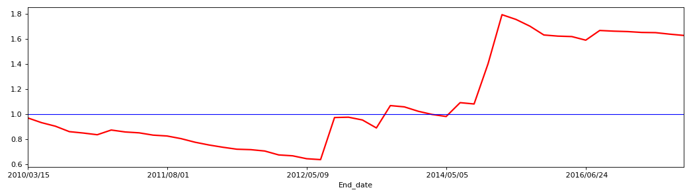
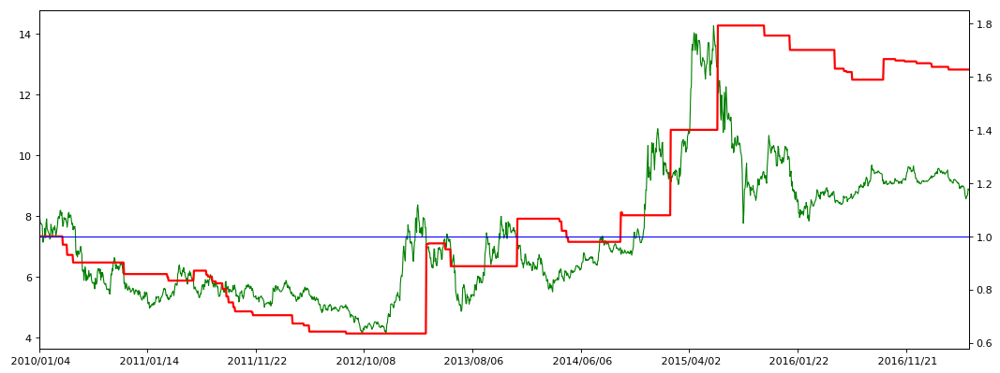

```python
import pandas as pd
import matplotlib.pyplot as plt
import numpy as np
```


```python
stock_data0 = pd.read_csv('datacsv/sz000001.csv')
# 读取csv，在csv里预先将数据处理好，应该就是数据清洗
```


```python
stock_data0 = stock_data0.set_index('date')
# 设置date为索引
```


```python
MA60 = stock_data0['close'].rolling(window=60).mean()
# 求收盘价的60天均价
close_MA60 = pd.concat([stock_data0['close'], MA60], axis=1)
# 合并一个收盘价，均价的表格
close_MA60.columns = ['close','MA60']
# 设置表格字段名称为close和MA60
```


```python
close_MA60 = close_MA60[pd.to_datetime(close_MA60.index) >= pd.to_datetime('20100101')]
# 选择时间为2010年1月1日之后的交易信息
```


```python
buy_Point_date = close_MA60[close_MA60['close'] > close_MA60['MA60']].index
# 选择close大于MA60的行，并获取时间索引，形成数组buy_Point_date
close_MA60.loc[buy_Point_date,'point'] = 1
# 在表close_MA60中，按照数组buy_Point_date中的时间设置一个新字段，字段名设置为point，记录值设置为1
```


```python
sell_Point_date = close_MA60[close_MA60['close'] <= close_MA60['MA60']].index
# 选择close小于等于MA60的行，并获取时间索引，形成数组sell_Point_date
close_MA60.loc[sell_Point_date,'point'] = -1
# 在表close_MA60中，按照数组sell_Point_date中的时间，字段名为point，记录值设置为-1
# point的意义是判断持仓阶段，1为持有仓位，-1为空仓
```


```python
close_MA60['BS_point'] = (close_MA60['point'] - close_MA60['point'].shift(1))/2
# 设置字段BS_point，判断买卖点位，通过持有仓位的起始和空仓的起始来判断买卖的时间点与收盘价
close_MA60['BS_point'] = close_MA60['BS_point'].fillna(0)
# fillna函数，将NaN替换为0
```


```python
k = len(close_MA60)
# 表的总记录行数
close_MA60['order'] = np.arange(0,k,1)
# 设置一个order列，起到序列作用，原因是plt.polt出来的坐标，是按照0-k的序列来的，
# 只不过显示成索引的时间列，并非时间序列；如果是时间序列，由于时间是连续的，
# 时间轴依然要显示非交易日，这就出现y轴的空值，而时间作为索引显示，则不会显示非交易日。
# 此时的序列是0-k的序列，所以用一个order列作为隐形索引，为的是使x轴的值和表数据的时间索引对应上。
close_MA60.head()
```


<div>

<table border="1" class="dataframe">
  <thead>
    <tr style="text-align: right;">
      <th></th>
      <th>close</th>
      <th>MA60</th>
      <th>point</th>
      <th>BS_point</th>
      <th>order</th>
    </tr>
    <tr>
      <th>date</th>
      <th></th>
      <th></th>
      <th></th>
      <th></th>
      <th></th>
    </tr>
  </thead>
  <tbody>
    <tr>
      <th>2010/01/04</th>
      <td>8.14</td>
      <td>8.205500</td>
      <td>-1.0</td>
      <td>0.0</td>
      <td>0</td>
    </tr>
    <tr>
      <th>2010/01/05</th>
      <td>7.99</td>
      <td>8.225333</td>
      <td>-1.0</td>
      <td>0.0</td>
      <td>1</td>
    </tr>
    <tr>
      <th>2010/01/06</th>
      <td>7.84</td>
      <td>8.236333</td>
      <td>-1.0</td>
      <td>0.0</td>
      <td>2</td>
    </tr>
    <tr>
      <th>2010/01/07</th>
      <td>7.75</td>
      <td>8.246333</td>
      <td>-1.0</td>
      <td>0.0</td>
      <td>3</td>
    </tr>
    <tr>
      <th>2010/01/08</th>
      <td>7.74</td>
      <td>8.255333</td>
      <td>-1.0</td>
      <td>0.0</td>
      <td>4</td>
    </tr>
  </tbody>
</table>
</div>


```python
BP_price = close_MA60.loc[close_MA60['BS_point'] == 1, ['close','BS_point','order']]
# 读取出买点出现时的日期、收盘价
SP_price = close_MA60.loc[close_MA60['BS_point'] == -1, ['close','BS_point','order']]
# 读取出卖点出现时的日期、收盘价
close_MA60_signals = pd.concat([BP_price,SP_price], axis=1)
# 买卖点出现时的日期、收盘价合并成一张表，此时会出现NaN空值
close_MA60_signals.columns = ['close_B','Buy_point','Buy_order','close_S','Sell_point','Sell_order']
# 对列的字段重命名
close_MA60_signals = close_MA60_signals.fillna(0)
# 将表数据中的空值NaN替换为0，使之可以计算
```


```python
close_MA60_signals['close_BS'] = close_MA60_signals['close_B']+close_MA60_signals['close_S']
# 将买卖点出现的收盘价合并成一个字段
close_MA60_signals['point_BS'] = close_MA60_signals['Buy_point']+close_MA60_signals['Sell_point']
# 将买卖点出现的信号合并成一个字段
close_MA60_signals['order_BS'] = close_MA60_signals['Buy_order']+close_MA60_signals['Sell_order']
# 将买卖点出现的序号合并成一个字段
close_MA60_signals = close_MA60_signals[['close_BS','point_BS','order_BS']]
# 提取并形成两个字段显示的买卖价格与信号，
# 形成的表数据为一行买一行卖，如此循环。
```


```python
BP_price['startdate'] = BP_price.index
BP_Profit = BP_price[['startdate','close','BS_point']]
BP_Profit.columns = ['Start_date','Buy_close','Buy_point']
BP_Profit = BP_Profit.reset_index(drop=True)
# 将买点时间、买点价格、买点信号合并成一个表
```


```python
SP_price['enddate'] = SP_price.index
SP_Profit = SP_price[['enddate','close','BS_point']]
SP_Profit.columns = ['End_date','Sell_close','Sell_point']
SP_Profit = SP_Profit.reset_index(drop=True)
# 将卖点时间、卖点价格、卖点信号合并成一个表
# 这两个表的目的是为了合成一个买卖时间及价格、收益在同一行记录的表所做的准备
```


```python
close_MA60_Profit = pd.concat([BP_Profit, SP_Profit], axis=1, join_axes=[BP_Profit.index])
close_MA60_Profit = close_MA60_Profit[['Start_date','End_date','Buy_close','Sell_close']]
close_MA60_Profit['Profit'] = (close_MA60_Profit['Sell_close']-close_MA60_Profit['Buy_close'])/(close_MA60_Profit['Buy_close'])
# 将上述买表和卖表两个表合并成收益表，并计算每次买卖交易的利润
```


```python
close_MA60_Profit['Line'] = (close_MA60_Profit['Profit']+1).cumprod()
# 通过cumprod累乘积函数，将上一个利润与下一个利润累乘，形成总收益
# 通过Excel表验证一致
p = len(close_MA60_Profit)
# close_MA60_Profit['order'] = np.arange(1,p+1,1)
# close_MA60_Profit = close_MA60_Profit.set_index('order')
close_MA60_Profit.head()
# 这里未能解决的是每次买入股票都是有最低交易股数的限制的，
# 比如400多元的茅台，100股1手起购，就是4万多，10万元最多买200股2手，
# 剩余的资金是不参与涨跌的，那么计算出来的利润是与10万元全部计算存在偏差的。
# 下面通过cash、batch、shares、surplus来处理实际交易问题
```


<div>

<table border="1" class="dataframe">
  <thead>
    <tr style="text-align: right;">
      <th></th>
      <th>Start_date</th>
      <th>End_date</th>
      <th>Buy_close</th>
      <th>Sell_close</th>
      <th>Profit</th>
      <th>Line</th>
    </tr>
  </thead>
  <tbody>
    <tr>
      <th>0</th>
      <td>2010/03/02</td>
      <td>2010/03/15</td>
      <td>7.92</td>
      <td>7.66</td>
      <td>-0.032828</td>
      <td>0.967172</td>
    </tr>
    <tr>
      <th>1</th>
      <td>2010/03/17</td>
      <td>2010/03/25</td>
      <td>7.95</td>
      <td>7.63</td>
      <td>-0.040252</td>
      <td>0.928242</td>
    </tr>
    <tr>
      <th>2</th>
      <td>2010/03/26</td>
      <td>2010/04/12</td>
      <td>7.81</td>
      <td>7.55</td>
      <td>-0.033291</td>
      <td>0.897340</td>
    </tr>
    <tr>
      <th>3</th>
      <td>2010/10/11</td>
      <td>2010/11/12</td>
      <td>6.09</td>
      <td>5.78</td>
      <td>-0.050903</td>
      <td>0.851662</td>
    </tr>
    <tr>
      <th>4</th>
      <td>2011/03/01</td>
      <td>2011/03/15</td>
      <td>5.36</td>
      <td>5.29</td>
      <td>-0.013060</td>
      <td>0.840540</td>
    </tr>
  </tbody>
</table>
</div>


```python
cash = 10000
# 设置一个起始总资金
close_MA60_Profit.loc[0:0,'Startcash'] = cash
# 在表中插入每次实际交易后的资金池列，将其第一个记录设置为起始总资金
Startcash = close_MA60_Profit['Startcash'][0]
# 第一个记录为未交易的初始资金，第二个记录需要在第一次交易结束后，方知道资金池的剩余总资金
batch = 100
# 起始交易数量：100股为1手
close_MA60_Profit.head(2)
```


<div>

<table border="1" class="dataframe">
  <thead>
    <tr style="text-align: right;">
      <th></th>
      <th>Start_date</th>
      <th>End_date</th>
      <th>Buy_close</th>
      <th>Sell_close</th>
      <th>Profit</th>
      <th>Line</th>
      <th>Startcash</th>
    </tr>
  </thead>
  <tbody>
    <tr>
      <th>0</th>
      <td>2010/03/02</td>
      <td>2010/03/15</td>
      <td>7.92</td>
      <td>7.66</td>
      <td>-0.032828</td>
      <td>0.967172</td>
      <td>10000.0</td>
    </tr>
    <tr>
      <th>1</th>
      <td>2010/03/17</td>
      <td>2010/03/25</td>
      <td>7.95</td>
      <td>7.63</td>
      <td>-0.040252</td>
      <td>0.928242</td>
      <td>NaN</td>
    </tr>
  </tbody>
</table>
</div>


```python
close_MA60_Profit.loc[:0,'Shares'] = (Startcash/batch)//close_MA60_Profit['Buy_close']*batch
# 参与交易的股数，正如上述的，7.92元的买入价，1万元只能买到1200股（12手，Shares=1200）
close_MA60_Profit.loc[:0,'Price'] = close_MA60_Profit['Buy_close']*close_MA60_Profit['Shares']
# 参与交易的资金额，1200*7.92=9504
close_MA60_Profit.loc[:0,'Surplus'] = close_MA60_Profit['Startcash'] - close_MA60_Profit['Price']
# 剩余未参与交易的资金额，10000-9504=496
close_MA60_Profit.loc[:0,'AlphaCat'] = close_MA60_Profit['Price']*(1+close_MA60_Profit['Profit'])
# 参与交易的资金额经过本次交易后的剩余金额，9504*（1-0.032828）=9192.0，亏损3.2828%，312元
close_MA60_Profit.loc[:0,'Endcash'] = close_MA60_Profit['AlphaCat'] + close_MA60_Profit['Surplus']
# 此时交易后的剩余资金额为，9192+496=9688
close_MA60_Profit.loc[1:1,'Startcash'] = close_MA60_Profit['Endcash'][0]
# 第二次交易开始前，资金池的资金为上个交易结束后的剩余资金
```


```python
for i in range(1,p):
    # 为什么要从1（第2条记录）开始采用循环运算，而不是从0（第1条记录）开始呢，这样不就可以省去上面计算1条记录的篇幅吗？
    # 我所理解的原因有两个，一是i如果从0开始，则无法追溯到-1；二是等号的右侧很可能是不能有计算性的变量，只能赋值性的变量
    close_MA60_Profit.loc[:i,'Shares'] = (close_MA60_Profit['Startcash']/batch)//close_MA60_Profit['Buy_close']*batch
    close_MA60_Profit.loc[:i,'Price'] = close_MA60_Profit['Buy_close']*close_MA60_Profit['Shares']
    close_MA60_Profit.loc[:i,'Surplus'] = close_MA60_Profit['Startcash'] - close_MA60_Profit['Price']
    close_MA60_Profit.loc[:i,'AlphaCat'] = close_MA60_Profit['Price']*(1+close_MA60_Profit['Profit'])
    close_MA60_Profit.loc[:i,'Endcash'] = close_MA60_Profit['AlphaCat'] + close_MA60_Profit['Surplus']
    close_MA60_Profit.loc[i+1:i+1,'Startcash'] = close_MA60_Profit['Endcash'][i]
    # 计算方案同上第1条记录的公式
```


```python
close_MA60_Profit['Profit_real'] = close_MA60_Profit['Endcash']/cash
# 设定收益率
close_MA60_Profit.head()
```


<div>

<table border="1" class="dataframe">
  <thead>
    <tr style="text-align: right;">
      <th></th>
      <th>Start_date</th>
      <th>End_date</th>
      <th>Buy_close</th>
      <th>Sell_close</th>
      <th>Profit</th>
      <th>Line</th>
      <th>Startcash</th>
      <th>Shares</th>
      <th>Price</th>
      <th>Surplus</th>
      <th>AlphaCat</th>
      <th>Endcash</th>
      <th>Profit_real</th>
    </tr>
  </thead>
  <tbody>
    <tr>
      <th>0</th>
      <td>2010/03/02</td>
      <td>2010/03/15</td>
      <td>7.92</td>
      <td>7.66</td>
      <td>-0.032828</td>
      <td>0.967172</td>
      <td>10000.0</td>
      <td>1200.0</td>
      <td>9504.0</td>
      <td>496.0</td>
      <td>9192.0</td>
      <td>9688.0</td>
      <td>0.9688</td>
    </tr>
    <tr>
      <th>1</th>
      <td>2010/03/17</td>
      <td>2010/03/25</td>
      <td>7.95</td>
      <td>7.63</td>
      <td>-0.040252</td>
      <td>0.928242</td>
      <td>9688.0</td>
      <td>1200.0</td>
      <td>9540.0</td>
      <td>148.0</td>
      <td>9156.0</td>
      <td>9304.0</td>
      <td>0.9304</td>
    </tr>
    <tr>
      <th>2</th>
      <td>2010/03/26</td>
      <td>2010/04/12</td>
      <td>7.81</td>
      <td>7.55</td>
      <td>-0.033291</td>
      <td>0.897340</td>
      <td>9304.0</td>
      <td>1100.0</td>
      <td>8591.0</td>
      <td>713.0</td>
      <td>8305.0</td>
      <td>9018.0</td>
      <td>0.9018</td>
    </tr>
    <tr>
      <th>3</th>
      <td>2010/10/11</td>
      <td>2010/11/12</td>
      <td>6.09</td>
      <td>5.78</td>
      <td>-0.050903</td>
      <td>0.851662</td>
      <td>9018.0</td>
      <td>1400.0</td>
      <td>8526.0</td>
      <td>492.0</td>
      <td>8092.0</td>
      <td>8584.0</td>
      <td>0.8584</td>
    </tr>
    <tr>
      <th>4</th>
      <td>2011/03/01</td>
      <td>2011/03/15</td>
      <td>5.36</td>
      <td>5.29</td>
      <td>-0.013060</td>
      <td>0.840540</td>
      <td>8584.0</td>
      <td>1600.0</td>
      <td>8576.0</td>
      <td>8.0</td>
      <td>8464.0</td>
      <td>8472.0</td>
      <td>0.8472</td>
    </tr>
  </tbody>
</table>
</div>


```python
close_MA60_Profit_real = close_MA60_Profit[['End_date','Profit_real']]
close_MA60_Profit_real = close_MA60_Profit_real.set_index('End_date')
```


```python
plt.figure(1, figsize=(16,4), dpi=80)
plt.subplot(111)
close_MA60_Profit_real['Profit_real'].plot(color='red', linewidth='2').axhline(y=1, color='blue', linewidth='1')
```


    <matplotlib.lines.Line2D at 0xc4f8710>


```python
plt.show()
```





```python
close_MA60_Profit_real_ALL = pd.concat([close_MA60,close_MA60_Profit_real], axis=1)
# close_MA60_Profit_real_ALL = close_MA60_Profit_real_ALL.fillna(1) #测试用，将NaN设为1
close_MA60_Profit_real_ALL.iloc[0,5] = 1
# 当int型索引时，使用loc选取第几行记录
# 当非int索引时，如时间索引，时间序列索引，选取第几行记录，用iloc，其中的i可以理解为index
```


```python
for j in range(1,k):
    r = close_MA60_Profit_real_ALL.iloc[j-1,5]
    q = close_MA60_Profit_real_ALL.iloc[j,3]
    if q >= 0.0:
        close_MA60_Profit_real_ALL.iloc[j,5] = r
```


```python
close_MA60_Profit_real_ALL[42:68]
```


<div>

<table border="1" class="dataframe">
  <thead>
    <tr style="text-align: right;">
      <th></th>
      <th>close</th>
      <th>MA60</th>
      <th>point</th>
      <th>BS_point</th>
      <th>order</th>
      <th>Profit_real</th>
    </tr>
  </thead>
  <tbody>
    <tr>
      <th>2010/03/11</th>
      <td>8.12</td>
      <td>7.845667</td>
      <td>1.0</td>
      <td>0.0</td>
      <td>42</td>
      <td>1.0000</td>
    </tr>
    <tr>
      <th>2010/03/12</th>
      <td>7.85</td>
      <td>7.831000</td>
      <td>1.0</td>
      <td>0.0</td>
      <td>43</td>
      <td>1.0000</td>
    </tr>
    <tr>
      <th>2010/03/15</th>
      <td>7.66</td>
      <td>7.816667</td>
      <td>-1.0</td>
      <td>-1.0</td>
      <td>44</td>
      <td>0.9688</td>
    </tr>
    <tr>
      <th>2010/03/16</th>
      <td>7.72</td>
      <td>7.804000</td>
      <td>-1.0</td>
      <td>0.0</td>
      <td>45</td>
      <td>0.9688</td>
    </tr>
    <tr>
      <th>2010/03/17</th>
      <td>7.95</td>
      <td>7.793833</td>
      <td>1.0</td>
      <td>1.0</td>
      <td>46</td>
      <td>0.9688</td>
    </tr>
    <tr>
      <th>2010/03/18</th>
      <td>7.90</td>
      <td>7.782167</td>
      <td>1.0</td>
      <td>0.0</td>
      <td>47</td>
      <td>0.9688</td>
    </tr>
    <tr>
      <th>2010/03/19</th>
      <td>7.89</td>
      <td>7.767333</td>
      <td>1.0</td>
      <td>0.0</td>
      <td>48</td>
      <td>0.9688</td>
    </tr>
    <tr>
      <th>2010/03/22</th>
      <td>7.93</td>
      <td>7.755667</td>
      <td>1.0</td>
      <td>0.0</td>
      <td>49</td>
      <td>0.9688</td>
    </tr>
    <tr>
      <th>2010/03/23</th>
      <td>7.82</td>
      <td>7.743500</td>
      <td>1.0</td>
      <td>0.0</td>
      <td>50</td>
      <td>0.9688</td>
    </tr>
    <tr>
      <th>2010/03/24</th>
      <td>7.81</td>
      <td>7.733167</td>
      <td>1.0</td>
      <td>0.0</td>
      <td>51</td>
      <td>0.9688</td>
    </tr>
    <tr>
      <th>2010/03/25</th>
      <td>7.63</td>
      <td>7.723333</td>
      <td>-1.0</td>
      <td>-1.0</td>
      <td>52</td>
      <td>0.9304</td>
    </tr>
    <tr>
      <th>2010/03/26</th>
      <td>7.81</td>
      <td>7.718833</td>
      <td>1.0</td>
      <td>1.0</td>
      <td>53</td>
      <td>0.9304</td>
    </tr>
    <tr>
      <th>2010/03/29</th>
      <td>8.08</td>
      <td>7.723833</td>
      <td>1.0</td>
      <td>0.0</td>
      <td>54</td>
      <td>0.9304</td>
    </tr>
    <tr>
      <th>2010/03/30</th>
      <td>8.12</td>
      <td>7.730500</td>
      <td>1.0</td>
      <td>0.0</td>
      <td>55</td>
      <td>0.9304</td>
    </tr>
    <tr>
      <th>2010/03/31</th>
      <td>7.95</td>
      <td>7.730000</td>
      <td>1.0</td>
      <td>0.0</td>
      <td>56</td>
      <td>0.9304</td>
    </tr>
    <tr>
      <th>2010/04/01</th>
      <td>8.02</td>
      <td>7.728833</td>
      <td>1.0</td>
      <td>0.0</td>
      <td>57</td>
      <td>0.9304</td>
    </tr>
    <tr>
      <th>2010/04/02</th>
      <td>8.04</td>
      <td>7.723167</td>
      <td>1.0</td>
      <td>0.0</td>
      <td>58</td>
      <td>0.9304</td>
    </tr>
    <tr>
      <th>2010/04/06</th>
      <td>8.01</td>
      <td>7.717000</td>
      <td>1.0</td>
      <td>0.0</td>
      <td>59</td>
      <td>0.9304</td>
    </tr>
    <tr>
      <th>2010/04/07</th>
      <td>7.83</td>
      <td>7.711833</td>
      <td>1.0</td>
      <td>0.0</td>
      <td>60</td>
      <td>0.9304</td>
    </tr>
    <tr>
      <th>2010/04/08</th>
      <td>7.72</td>
      <td>7.707333</td>
      <td>1.0</td>
      <td>0.0</td>
      <td>61</td>
      <td>0.9304</td>
    </tr>
    <tr>
      <th>2010/04/09</th>
      <td>7.76</td>
      <td>7.706000</td>
      <td>1.0</td>
      <td>0.0</td>
      <td>62</td>
      <td>0.9304</td>
    </tr>
    <tr>
      <th>2010/04/12</th>
      <td>7.55</td>
      <td>7.702667</td>
      <td>-1.0</td>
      <td>-1.0</td>
      <td>63</td>
      <td>0.9018</td>
    </tr>
    <tr>
      <th>2010/04/13</th>
      <td>7.66</td>
      <td>7.701333</td>
      <td>-1.0</td>
      <td>0.0</td>
      <td>64</td>
      <td>0.9018</td>
    </tr>
    <tr>
      <th>2010/04/14</th>
      <td>7.60</td>
      <td>7.699000</td>
      <td>-1.0</td>
      <td>0.0</td>
      <td>65</td>
      <td>0.9018</td>
    </tr>
    <tr>
      <th>2010/04/15</th>
      <td>7.66</td>
      <td>7.698667</td>
      <td>-1.0</td>
      <td>0.0</td>
      <td>66</td>
      <td>0.9018</td>
    </tr>
    <tr>
      <th>2010/04/16</th>
      <td>7.52</td>
      <td>7.705000</td>
      <td>-1.0</td>
      <td>0.0</td>
      <td>67</td>
      <td>0.9018</td>
    </tr>
  </tbody>
</table>
</div>


```python
plt.figure(2, figsize=(16,6), dpi=80)
ax1 = plt.subplot(111)
close_MA60_Profit_real_ALL['close'].plot(color='green', linewidth='1')
ax2 = ax1.twinx()
# 设置双坐标系
close_MA60_Profit_real_ALL['Profit_real'].plot(color='red', linewidth='2').axhline(y=1, color='blue', linewidth='1')
```


    <matplotlib.lines.Line2D at 0xc680a58>


```python
plt.show()
```




