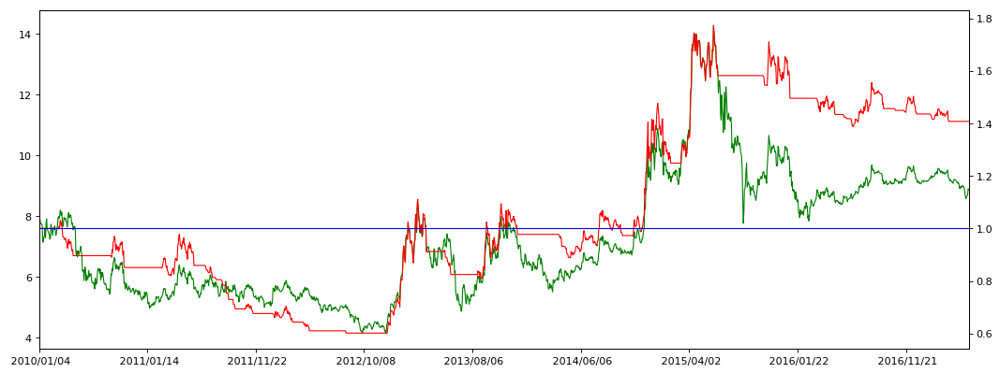

```python
import pandas as pd
import matplotlib.pyplot as plt
import numpy as np
```


```python
stock_data0 = pd.read_csv('datacsv/sz000001.csv')
stock_data0 = stock_data0.set_index('date')
# 读取csv,设置date为索引
```


```python
MA60 = stock_data0['close'].rolling(window=60).mean()
# 求收盘价的60天均价
close_MA60 = pd.concat([stock_data0['close'], MA60], axis=1)
# 合并一个收盘价，均价的表格
close_MA60.columns = ['close','MA60']
# 设置表格字段名称为close和MA60
close_MA60[100:105]
```


<div>

<table border="1" class="dataframe">
  <thead>
    <tr style="text-align: right;">
      <th></th>
      <th>close</th>
      <th>MA60</th>
    </tr>
    <tr>
      <th>date</th>
      <th></th>
      <th></th>
    </tr>
  </thead>
  <tbody>
    <tr>
      <th>1996/04/17</th>
      <td>0.39</td>
      <td>0.273500</td>
    </tr>
    <tr>
      <th>1996/04/18</th>
      <td>0.43</td>
      <td>0.277333</td>
    </tr>
    <tr>
      <th>1996/04/19</th>
      <td>0.48</td>
      <td>0.281833</td>
    </tr>
    <tr>
      <th>1996/04/22</th>
      <td>0.46</td>
      <td>0.286000</td>
    </tr>
    <tr>
      <th>1996/04/23</th>
      <td>0.48</td>
      <td>0.290500</td>
    </tr>
  </tbody>
</table>
</div>


```python
close_MA60 = close_MA60[pd.to_datetime(close_MA60.index) >= pd.to_datetime('20100101')]
# 选择时间为2010年1月1日之后的交易信息
```


```python
buy_Point_date = close_MA60[close_MA60['close'] > close_MA60['MA60']].index
# 选择close大于MA60的行，并获取时间索引，形成数组buy_Point_date
close_MA60.loc[buy_Point_date,'point'] = 1
# 在表close_MA60中，按照数组buy_Point_date中的时间设置一个新字段，字段名设置为point，记录值设置为1
```


```python
buy_Point_date
```


    Index([u' 2010/03/02', u' 2010/03/03', u' 2010/03/04', u' 2010/03/05',
           u' 2010/03/08', u' 2010/03/09', u' 2010/03/10', u' 2010/03/11',
           u' 2010/03/12', u' 2010/03/17',
           ...
           u' 2017/03/06', u' 2017/03/07', u' 2017/03/08', u' 2017/03/09',
           u' 2017/03/10', u' 2017/03/13', u' 2017/03/14', u' 2017/03/15',
           u' 2017/03/16', u' 2017/03/17'],
          dtype='object', name=u'date', length=772)


```python
close_MA60.head()
```


<div>

<table border="1" class="dataframe">
  <thead>
    <tr style="text-align: right;">
      <th></th>
      <th>close</th>
      <th>MA60</th>
      <th>point</th>
    </tr>
    <tr>
      <th>date</th>
      <th></th>
      <th></th>
      <th></th>
    </tr>
  </thead>
  <tbody>
    <tr>
      <th>2010/01/04</th>
      <td>8.14</td>
      <td>8.205500</td>
      <td>NaN</td>
    </tr>
    <tr>
      <th>2010/01/05</th>
      <td>7.99</td>
      <td>8.225333</td>
      <td>NaN</td>
    </tr>
    <tr>
      <th>2010/01/06</th>
      <td>7.84</td>
      <td>8.236333</td>
      <td>NaN</td>
    </tr>
    <tr>
      <th>2010/01/07</th>
      <td>7.75</td>
      <td>8.246333</td>
      <td>NaN</td>
    </tr>
    <tr>
      <th>2010/01/08</th>
      <td>7.74</td>
      <td>8.255333</td>
      <td>NaN</td>
    </tr>
  </tbody>
</table>
</div>


```python
close_MA60[32:48]
# 这个表只处理出来买入点和持仓段，卖出点和空仓段还是空值NaN
```


<div>

<table border="1" class="dataframe">
  <thead>
    <tr style="text-align: right;">
      <th></th>
      <th>close</th>
      <th>MA60</th>
      <th>point</th>
    </tr>
    <tr>
      <th>date</th>
      <th></th>
      <th></th>
      <th></th>
    </tr>
  </thead>
  <tbody>
    <tr>
      <th>2010/02/24</th>
      <td>7.41</td>
      <td>7.923333</td>
      <td>NaN</td>
    </tr>
    <tr>
      <th>2010/02/25</th>
      <td>7.57</td>
      <td>7.902833</td>
      <td>NaN</td>
    </tr>
    <tr>
      <th>2010/02/26</th>
      <td>7.68</td>
      <td>7.886500</td>
      <td>NaN</td>
    </tr>
    <tr>
      <th>2010/03/02</th>
      <td>7.92</td>
      <td>7.874000</td>
      <td>1.0</td>
    </tr>
    <tr>
      <th>2010/03/03</th>
      <td>7.99</td>
      <td>7.871500</td>
      <td>1.0</td>
    </tr>
    <tr>
      <th>2010/03/04</th>
      <td>7.92</td>
      <td>7.870167</td>
      <td>1.0</td>
    </tr>
    <tr>
      <th>2010/03/05</th>
      <td>7.98</td>
      <td>7.864167</td>
      <td>1.0</td>
    </tr>
    <tr>
      <th>2010/03/08</th>
      <td>8.19</td>
      <td>7.862167</td>
      <td>1.0</td>
    </tr>
    <tr>
      <th>2010/03/09</th>
      <td>8.18</td>
      <td>7.858833</td>
      <td>1.0</td>
    </tr>
    <tr>
      <th>2010/03/10</th>
      <td>8.02</td>
      <td>7.855500</td>
      <td>1.0</td>
    </tr>
    <tr>
      <th>2010/03/11</th>
      <td>8.12</td>
      <td>7.845667</td>
      <td>1.0</td>
    </tr>
    <tr>
      <th>2010/03/12</th>
      <td>7.85</td>
      <td>7.831000</td>
      <td>1.0</td>
    </tr>
    <tr>
      <th>2010/03/15</th>
      <td>7.66</td>
      <td>7.816667</td>
      <td>NaN</td>
    </tr>
    <tr>
      <th>2010/03/16</th>
      <td>7.72</td>
      <td>7.804000</td>
      <td>NaN</td>
    </tr>
    <tr>
      <th>2010/03/17</th>
      <td>7.95</td>
      <td>7.793833</td>
      <td>1.0</td>
    </tr>
    <tr>
      <th>2010/03/18</th>
      <td>7.90</td>
      <td>7.782167</td>
      <td>1.0</td>
    </tr>
  </tbody>
</table>
</div>


```python
sell_Point_date = close_MA60[close_MA60['close'] <= close_MA60['MA60']].index
# 选择close小于等于MA60的行，并获取时间索引，形成数组sell_Point_date
close_MA60.loc[sell_Point_date,'point'] = -1
# 在表close_MA60中，按照数组sell_Point_date中的时间，字段名为point，记录值设置为-1
# point的意义是判断持仓阶段，1为持有仓位，-1为空仓
```


```python
sell_Point_date
```


    Index([u' 2010/01/04', u' 2010/01/05', u' 2010/01/06', u' 2010/01/07',
           u' 2010/01/08', u' 2010/01/11', u' 2010/01/12', u' 2010/01/13',
           u' 2010/01/14', u' 2010/01/15',
           ...
           u' 2017/05/02', u' 2017/05/03', u' 2017/05/04', u' 2017/05/05',
           u' 2017/05/08', u' 2017/05/09', u' 2017/05/10', u' 2017/05/11',
           u' 2017/05/12', u' 2017/05/15'],
          dtype='object', name=u'date', length=945)


```python
close_MA60.head()
```


<div>

<table border="1" class="dataframe">
  <thead>
    <tr style="text-align: right;">
      <th></th>
      <th>close</th>
      <th>MA60</th>
      <th>point</th>
    </tr>
    <tr>
      <th>date</th>
      <th></th>
      <th></th>
      <th></th>
    </tr>
  </thead>
  <tbody>
    <tr>
      <th>2010/01/04</th>
      <td>8.14</td>
      <td>8.205500</td>
      <td>-1.0</td>
    </tr>
    <tr>
      <th>2010/01/05</th>
      <td>7.99</td>
      <td>8.225333</td>
      <td>-1.0</td>
    </tr>
    <tr>
      <th>2010/01/06</th>
      <td>7.84</td>
      <td>8.236333</td>
      <td>-1.0</td>
    </tr>
    <tr>
      <th>2010/01/07</th>
      <td>7.75</td>
      <td>8.246333</td>
      <td>-1.0</td>
    </tr>
    <tr>
      <th>2010/01/08</th>
      <td>7.74</td>
      <td>8.255333</td>
      <td>-1.0</td>
    </tr>
  </tbody>
</table>
</div>


```python
close_MA60[32:48]
# 可以看到2010.3.2是买入的时间点，2010.3.3～2010.3.12是持仓时间段；
# 而2010.3.15是卖出的时间点，2010.3.16是空仓时间段。
# 因此，要把这些买入或卖出的时间点给分离出来，用错位减法。
```


<div>

<table border="1" class="dataframe">
  <thead>
    <tr style="text-align: right;">
      <th></th>
      <th>close</th>
      <th>MA60</th>
      <th>point</th>
    </tr>
    <tr>
      <th>date</th>
      <th></th>
      <th></th>
      <th></th>
    </tr>
  </thead>
  <tbody>
    <tr>
      <th>2010/02/24</th>
      <td>7.41</td>
      <td>7.923333</td>
      <td>-1.0</td>
    </tr>
    <tr>
      <th>2010/02/25</th>
      <td>7.57</td>
      <td>7.902833</td>
      <td>-1.0</td>
    </tr>
    <tr>
      <th>2010/02/26</th>
      <td>7.68</td>
      <td>7.886500</td>
      <td>-1.0</td>
    </tr>
    <tr>
      <th>2010/03/02</th>
      <td>7.92</td>
      <td>7.874000</td>
      <td>1.0</td>
    </tr>
    <tr>
      <th>2010/03/03</th>
      <td>7.99</td>
      <td>7.871500</td>
      <td>1.0</td>
    </tr>
    <tr>
      <th>2010/03/04</th>
      <td>7.92</td>
      <td>7.870167</td>
      <td>1.0</td>
    </tr>
    <tr>
      <th>2010/03/05</th>
      <td>7.98</td>
      <td>7.864167</td>
      <td>1.0</td>
    </tr>
    <tr>
      <th>2010/03/08</th>
      <td>8.19</td>
      <td>7.862167</td>
      <td>1.0</td>
    </tr>
    <tr>
      <th>2010/03/09</th>
      <td>8.18</td>
      <td>7.858833</td>
      <td>1.0</td>
    </tr>
    <tr>
      <th>2010/03/10</th>
      <td>8.02</td>
      <td>7.855500</td>
      <td>1.0</td>
    </tr>
    <tr>
      <th>2010/03/11</th>
      <td>8.12</td>
      <td>7.845667</td>
      <td>1.0</td>
    </tr>
    <tr>
      <th>2010/03/12</th>
      <td>7.85</td>
      <td>7.831000</td>
      <td>1.0</td>
    </tr>
    <tr>
      <th>2010/03/15</th>
      <td>7.66</td>
      <td>7.816667</td>
      <td>-1.0</td>
    </tr>
    <tr>
      <th>2010/03/16</th>
      <td>7.72</td>
      <td>7.804000</td>
      <td>-1.0</td>
    </tr>
    <tr>
      <th>2010/03/17</th>
      <td>7.95</td>
      <td>7.793833</td>
      <td>1.0</td>
    </tr>
    <tr>
      <th>2010/03/18</th>
      <td>7.90</td>
      <td>7.782167</td>
      <td>1.0</td>
    </tr>
  </tbody>
</table>
</div>


```python
# close_MA60['BS_point'] = (close_MA60['point'] - close_MA60['point'].shift(1))/2
# 设置字段BS_point，判断买卖点位，通过持有仓位的起始和空仓的起始来判断买卖的时间点与收盘价
close_MA60['BS_point'] = close_MA60['point'].shift(1)
close_MA60['BS_point'] = close_MA60['BS_point'].fillna(-1)
close_MA60['BS_point'] = (close_MA60['point'] - close_MA60['BS_point'])/2
close_MA60.head()
# 第一个买点应当在第一个卖点之前，才能形成先买后卖的序列，所以要对第一个错位值设置为-1,；
# 如果第一个记录是买入或者持仓，则1-（-1）=2/2=1，为买入的起始点；
# 如果第一个记录是卖出或者空仓，则-1-（-1）=0，为空仓时间段。
```


<div>

<table border="1" class="dataframe">
  <thead>
    <tr style="text-align: right;">
      <th></th>
      <th>close</th>
      <th>MA60</th>
      <th>point</th>
      <th>BS_point</th>
    </tr>
    <tr>
      <th>date</th>
      <th></th>
      <th></th>
      <th></th>
      <th></th>
    </tr>
  </thead>
  <tbody>
    <tr>
      <th>2010/01/04</th>
      <td>8.14</td>
      <td>8.205500</td>
      <td>-1.0</td>
      <td>0.0</td>
    </tr>
    <tr>
      <th>2010/01/05</th>
      <td>7.99</td>
      <td>8.225333</td>
      <td>-1.0</td>
      <td>0.0</td>
    </tr>
    <tr>
      <th>2010/01/06</th>
      <td>7.84</td>
      <td>8.236333</td>
      <td>-1.0</td>
      <td>0.0</td>
    </tr>
    <tr>
      <th>2010/01/07</th>
      <td>7.75</td>
      <td>8.246333</td>
      <td>-1.0</td>
      <td>0.0</td>
    </tr>
    <tr>
      <th>2010/01/08</th>
      <td>7.74</td>
      <td>8.255333</td>
      <td>-1.0</td>
      <td>0.0</td>
    </tr>
  </tbody>
</table>
</div>


```python
close_MA60[32:48]
# 可以看到BS_point列，2010.3.2的买入时间点和2010.3.15的卖出时间点已经被分离出来，分别为1和-1
# 接下来，需要把这些买卖时间点单独分离出来形成新表，也就是去掉持仓时间段和空仓时间段。
```


<div>

<table border="1" class="dataframe">
  <thead>
    <tr style="text-align: right;">
      <th></th>
      <th>close</th>
      <th>MA60</th>
      <th>point</th>
      <th>BS_point</th>
    </tr>
    <tr>
      <th>date</th>
      <th></th>
      <th></th>
      <th></th>
      <th></th>
    </tr>
  </thead>
  <tbody>
    <tr>
      <th>2010/02/24</th>
      <td>7.41</td>
      <td>7.923333</td>
      <td>-1.0</td>
      <td>0.0</td>
    </tr>
    <tr>
      <th>2010/02/25</th>
      <td>7.57</td>
      <td>7.902833</td>
      <td>-1.0</td>
      <td>0.0</td>
    </tr>
    <tr>
      <th>2010/02/26</th>
      <td>7.68</td>
      <td>7.886500</td>
      <td>-1.0</td>
      <td>0.0</td>
    </tr>
    <tr>
      <th>2010/03/02</th>
      <td>7.92</td>
      <td>7.874000</td>
      <td>1.0</td>
      <td>1.0</td>
    </tr>
    <tr>
      <th>2010/03/03</th>
      <td>7.99</td>
      <td>7.871500</td>
      <td>1.0</td>
      <td>0.0</td>
    </tr>
    <tr>
      <th>2010/03/04</th>
      <td>7.92</td>
      <td>7.870167</td>
      <td>1.0</td>
      <td>0.0</td>
    </tr>
    <tr>
      <th>2010/03/05</th>
      <td>7.98</td>
      <td>7.864167</td>
      <td>1.0</td>
      <td>0.0</td>
    </tr>
    <tr>
      <th>2010/03/08</th>
      <td>8.19</td>
      <td>7.862167</td>
      <td>1.0</td>
      <td>0.0</td>
    </tr>
    <tr>
      <th>2010/03/09</th>
      <td>8.18</td>
      <td>7.858833</td>
      <td>1.0</td>
      <td>0.0</td>
    </tr>
    <tr>
      <th>2010/03/10</th>
      <td>8.02</td>
      <td>7.855500</td>
      <td>1.0</td>
      <td>0.0</td>
    </tr>
    <tr>
      <th>2010/03/11</th>
      <td>8.12</td>
      <td>7.845667</td>
      <td>1.0</td>
      <td>0.0</td>
    </tr>
    <tr>
      <th>2010/03/12</th>
      <td>7.85</td>
      <td>7.831000</td>
      <td>1.0</td>
      <td>0.0</td>
    </tr>
    <tr>
      <th>2010/03/15</th>
      <td>7.66</td>
      <td>7.816667</td>
      <td>-1.0</td>
      <td>-1.0</td>
    </tr>
    <tr>
      <th>2010/03/16</th>
      <td>7.72</td>
      <td>7.804000</td>
      <td>-1.0</td>
      <td>0.0</td>
    </tr>
    <tr>
      <th>2010/03/17</th>
      <td>7.95</td>
      <td>7.793833</td>
      <td>1.0</td>
      <td>1.0</td>
    </tr>
    <tr>
      <th>2010/03/18</th>
      <td>7.90</td>
      <td>7.782167</td>
      <td>1.0</td>
      <td>0.0</td>
    </tr>
  </tbody>
</table>
</div>


```python
k = len(close_MA60)
# 表的总记录行数
close_MA60['order'] = np.arange(0,k,1)
# 设置一个order列，起到序列作用，原因是plt.polt出来的坐标，是按照0-k的序列来的，
# 只不过显示成索引的时间列，并非时间序列；如果是时间序列，由于时间是连续的，
# 时间轴依然要显示非交易日，这就出现y轴的空值，而时间作为索引显示，则不会显示非交易日。
# 此时的序列是0-k的序列，所以用一个order列作为隐形索引，为的是使x轴的值和表数据的时间索引对应上。
close_MA60[32:48]
```


<div>

<table border="1" class="dataframe">
  <thead>
    <tr style="text-align: right;">
      <th></th>
      <th>close</th>
      <th>MA60</th>
      <th>point</th>
      <th>BS_point</th>
      <th>order</th>
    </tr>
    <tr>
      <th>date</th>
      <th></th>
      <th></th>
      <th></th>
      <th></th>
      <th></th>
    </tr>
  </thead>
  <tbody>
    <tr>
      <th>2010/02/24</th>
      <td>7.41</td>
      <td>7.923333</td>
      <td>-1.0</td>
      <td>0.0</td>
      <td>32</td>
    </tr>
    <tr>
      <th>2010/02/25</th>
      <td>7.57</td>
      <td>7.902833</td>
      <td>-1.0</td>
      <td>0.0</td>
      <td>33</td>
    </tr>
    <tr>
      <th>2010/02/26</th>
      <td>7.68</td>
      <td>7.886500</td>
      <td>-1.0</td>
      <td>0.0</td>
      <td>34</td>
    </tr>
    <tr>
      <th>2010/03/02</th>
      <td>7.92</td>
      <td>7.874000</td>
      <td>1.0</td>
      <td>1.0</td>
      <td>35</td>
    </tr>
    <tr>
      <th>2010/03/03</th>
      <td>7.99</td>
      <td>7.871500</td>
      <td>1.0</td>
      <td>0.0</td>
      <td>36</td>
    </tr>
    <tr>
      <th>2010/03/04</th>
      <td>7.92</td>
      <td>7.870167</td>
      <td>1.0</td>
      <td>0.0</td>
      <td>37</td>
    </tr>
    <tr>
      <th>2010/03/05</th>
      <td>7.98</td>
      <td>7.864167</td>
      <td>1.0</td>
      <td>0.0</td>
      <td>38</td>
    </tr>
    <tr>
      <th>2010/03/08</th>
      <td>8.19</td>
      <td>7.862167</td>
      <td>1.0</td>
      <td>0.0</td>
      <td>39</td>
    </tr>
    <tr>
      <th>2010/03/09</th>
      <td>8.18</td>
      <td>7.858833</td>
      <td>1.0</td>
      <td>0.0</td>
      <td>40</td>
    </tr>
    <tr>
      <th>2010/03/10</th>
      <td>8.02</td>
      <td>7.855500</td>
      <td>1.0</td>
      <td>0.0</td>
      <td>41</td>
    </tr>
    <tr>
      <th>2010/03/11</th>
      <td>8.12</td>
      <td>7.845667</td>
      <td>1.0</td>
      <td>0.0</td>
      <td>42</td>
    </tr>
    <tr>
      <th>2010/03/12</th>
      <td>7.85</td>
      <td>7.831000</td>
      <td>1.0</td>
      <td>0.0</td>
      <td>43</td>
    </tr>
    <tr>
      <th>2010/03/15</th>
      <td>7.66</td>
      <td>7.816667</td>
      <td>-1.0</td>
      <td>-1.0</td>
      <td>44</td>
    </tr>
    <tr>
      <th>2010/03/16</th>
      <td>7.72</td>
      <td>7.804000</td>
      <td>-1.0</td>
      <td>0.0</td>
      <td>45</td>
    </tr>
    <tr>
      <th>2010/03/17</th>
      <td>7.95</td>
      <td>7.793833</td>
      <td>1.0</td>
      <td>1.0</td>
      <td>46</td>
    </tr>
    <tr>
      <th>2010/03/18</th>
      <td>7.90</td>
      <td>7.782167</td>
      <td>1.0</td>
      <td>0.0</td>
      <td>47</td>
    </tr>
  </tbody>
</table>
</div>


```python
BP_price = close_MA60.loc[close_MA60['BS_point'] == 1, ['close','BS_point','order']]
# 读取出买点出现时的日期、收盘价
SP_price = close_MA60.loc[close_MA60['BS_point'] == -1, ['close','BS_point','order']]
# 读取出卖点出现时的日期、收盘价
close_MA60_signals = pd.concat([BP_price,SP_price], axis=1)
# 买卖点出现时的日期、收盘价合并成一张表，此时会出现NaN空值
close_MA60_signals.columns = ['close_B','Buy_point','Buy_order','close_S','Sell_point','Sell_order']
# 对列的字段重命名
close_MA60_signals = close_MA60_signals.fillna(0)
# 将表数据中的空值NaN替换为0，使之可以计算
```


```python
BP_price.head()
```


<div>

<table border="1" class="dataframe">
  <thead>
    <tr style="text-align: right;">
      <th></th>
      <th>close</th>
      <th>BS_point</th>
      <th>order</th>
    </tr>
    <tr>
      <th>date</th>
      <th></th>
      <th></th>
      <th></th>
    </tr>
  </thead>
  <tbody>
    <tr>
      <th>2010/03/02</th>
      <td>7.92</td>
      <td>1.0</td>
      <td>35</td>
    </tr>
    <tr>
      <th>2010/03/17</th>
      <td>7.95</td>
      <td>1.0</td>
      <td>46</td>
    </tr>
    <tr>
      <th>2010/03/26</th>
      <td>7.81</td>
      <td>1.0</td>
      <td>53</td>
    </tr>
    <tr>
      <th>2010/10/11</th>
      <td>6.09</td>
      <td>1.0</td>
      <td>133</td>
    </tr>
    <tr>
      <th>2011/03/01</th>
      <td>5.36</td>
      <td>1.0</td>
      <td>227</td>
    </tr>
  </tbody>
</table>
</div>


```python
SP_price.head()
```


<div>

<table border="1" class="dataframe">
  <thead>
    <tr style="text-align: right;">
      <th></th>
      <th>close</th>
      <th>BS_point</th>
      <th>order</th>
    </tr>
    <tr>
      <th>date</th>
      <th></th>
      <th></th>
      <th></th>
    </tr>
  </thead>
  <tbody>
    <tr>
      <th>2010/03/15</th>
      <td>7.66</td>
      <td>-1.0</td>
      <td>44</td>
    </tr>
    <tr>
      <th>2010/03/25</th>
      <td>7.63</td>
      <td>-1.0</td>
      <td>52</td>
    </tr>
    <tr>
      <th>2010/04/12</th>
      <td>7.55</td>
      <td>-1.0</td>
      <td>63</td>
    </tr>
    <tr>
      <th>2010/11/12</th>
      <td>5.78</td>
      <td>-1.0</td>
      <td>157</td>
    </tr>
    <tr>
      <th>2011/03/15</th>
      <td>5.29</td>
      <td>-1.0</td>
      <td>237</td>
    </tr>
  </tbody>
</table>
</div>


```python
close_MA60_signals.head(6)
```


<div>

<table border="1" class="dataframe">
  <thead>
    <tr style="text-align: right;">
      <th></th>
      <th>close_B</th>
      <th>Buy_point</th>
      <th>Buy_order</th>
      <th>close_S</th>
      <th>Sell_point</th>
      <th>Sell_order</th>
    </tr>
  </thead>
  <tbody>
    <tr>
      <th>2010/03/02</th>
      <td>7.92</td>
      <td>1.0</td>
      <td>35.0</td>
      <td>0.00</td>
      <td>0.0</td>
      <td>0.0</td>
    </tr>
    <tr>
      <th>2010/03/15</th>
      <td>0.00</td>
      <td>0.0</td>
      <td>0.0</td>
      <td>7.66</td>
      <td>-1.0</td>
      <td>44.0</td>
    </tr>
    <tr>
      <th>2010/03/17</th>
      <td>7.95</td>
      <td>1.0</td>
      <td>46.0</td>
      <td>0.00</td>
      <td>0.0</td>
      <td>0.0</td>
    </tr>
    <tr>
      <th>2010/03/25</th>
      <td>0.00</td>
      <td>0.0</td>
      <td>0.0</td>
      <td>7.63</td>
      <td>-1.0</td>
      <td>52.0</td>
    </tr>
    <tr>
      <th>2010/03/26</th>
      <td>7.81</td>
      <td>1.0</td>
      <td>53.0</td>
      <td>0.00</td>
      <td>0.0</td>
      <td>0.0</td>
    </tr>
    <tr>
      <th>2010/04/12</th>
      <td>0.00</td>
      <td>0.0</td>
      <td>0.0</td>
      <td>7.55</td>
      <td>-1.0</td>
      <td>63.0</td>
    </tr>
  </tbody>
</table>
</div>


```python
close_MA60_signals['close_BS'] = close_MA60_signals['close_B']+close_MA60_signals['close_S']
# 将买卖点出现的收盘价合并成一个字段
close_MA60_signals['point_BS'] = close_MA60_signals['Buy_point']+close_MA60_signals['Sell_point']
# 将买卖点出现的信号合并成一个字段
close_MA60_signals['order_BS'] = close_MA60_signals['Buy_order']+close_MA60_signals['Sell_order']
# 将买卖点出现的序号合并成一个字段
close_MA60_signals = close_MA60_signals[['close_BS','point_BS','order_BS']]
# 提取并形成两个字段显示的买卖价格与信号，
# 形成的表数据为一行买一行卖，如此循环。
```


```python
close_MA60_signals.head()
```


<div>

<table border="1" class="dataframe">
  <thead>
    <tr style="text-align: right;">
      <th></th>
      <th>close_BS</th>
      <th>point_BS</th>
      <th>order_BS</th>
    </tr>
  </thead>
  <tbody>
    <tr>
      <th>2010/03/02</th>
      <td>7.92</td>
      <td>1.0</td>
      <td>35.0</td>
    </tr>
    <tr>
      <th>2010/03/15</th>
      <td>7.66</td>
      <td>-1.0</td>
      <td>44.0</td>
    </tr>
    <tr>
      <th>2010/03/17</th>
      <td>7.95</td>
      <td>1.0</td>
      <td>46.0</td>
    </tr>
    <tr>
      <th>2010/03/25</th>
      <td>7.63</td>
      <td>-1.0</td>
      <td>52.0</td>
    </tr>
    <tr>
      <th>2010/03/26</th>
      <td>7.81</td>
      <td>1.0</td>
      <td>53.0</td>
    </tr>
  </tbody>
</table>
</div>


```python
# 第二种“一行买一行卖”的数据处理，从第13-17代码块缩减为第19代码块
close_MA60_signals2 = close_MA60.loc[close_MA60['BS_point'] != 0, ['close','MA60','BS_point','order']]
close_MA60_signals2.columns = ['close_BS','MA60','point_BS','order_BS']
close_MA60_signals2.head()
```


<div>

<table border="1" class="dataframe">
  <thead>
    <tr style="text-align: right;">
      <th></th>
      <th>close_BS</th>
      <th>MA60</th>
      <th>point_BS</th>
      <th>order_BS</th>
    </tr>
    <tr>
      <th>date</th>
      <th></th>
      <th></th>
      <th></th>
      <th></th>
    </tr>
  </thead>
  <tbody>
    <tr>
      <th>2010/03/02</th>
      <td>7.92</td>
      <td>7.874000</td>
      <td>1.0</td>
      <td>35</td>
    </tr>
    <tr>
      <th>2010/03/15</th>
      <td>7.66</td>
      <td>7.816667</td>
      <td>-1.0</td>
      <td>44</td>
    </tr>
    <tr>
      <th>2010/03/17</th>
      <td>7.95</td>
      <td>7.793833</td>
      <td>1.0</td>
      <td>46</td>
    </tr>
    <tr>
      <th>2010/03/25</th>
      <td>7.63</td>
      <td>7.723333</td>
      <td>-1.0</td>
      <td>52</td>
    </tr>
    <tr>
      <th>2010/03/26</th>
      <td>7.81</td>
      <td>7.718833</td>
      <td>1.0</td>
      <td>53</td>
    </tr>
  </tbody>
</table>
</div>


```python
BP_price['startdate'] = BP_price.index
BP_Profit = BP_price[['startdate','close','BS_point']]
BP_Profit.columns = ['Start_date','Buy_close','Buy_point']
BP_Profit = BP_Profit.reset_index(drop=True)
# 将买点时间、买点价格、买点信号合并成一个表
BP_Profit.head()
```


<div>

<table border="1" class="dataframe">
  <thead>
    <tr style="text-align: right;">
      <th></th>
      <th>Start_date</th>
      <th>Buy_close</th>
      <th>Buy_point</th>
    </tr>
  </thead>
  <tbody>
    <tr>
      <th>0</th>
      <td>2010/03/02</td>
      <td>7.92</td>
      <td>1.0</td>
    </tr>
    <tr>
      <th>1</th>
      <td>2010/03/17</td>
      <td>7.95</td>
      <td>1.0</td>
    </tr>
    <tr>
      <th>2</th>
      <td>2010/03/26</td>
      <td>7.81</td>
      <td>1.0</td>
    </tr>
    <tr>
      <th>3</th>
      <td>2010/10/11</td>
      <td>6.09</td>
      <td>1.0</td>
    </tr>
    <tr>
      <th>4</th>
      <td>2011/03/01</td>
      <td>5.36</td>
      <td>1.0</td>
    </tr>
  </tbody>
</table>
</div>


```python
SP_price['enddate'] = SP_price.index
SP_Profit = SP_price[['enddate','close','BS_point']]
SP_Profit.columns = ['End_date','Sell_close','Sell_point']
SP_Profit = SP_Profit.reset_index(drop=True)
# 将卖点时间、卖点价格、卖点信号合并成一个表
# 这两个表的目的是为了合成一个买卖时间及价格、收益在同一行记录的表所做的准备
SP_Profit.head()
```


<div>

<table border="1" class="dataframe">
  <thead>
    <tr style="text-align: right;">
      <th></th>
      <th>End_date</th>
      <th>Sell_close</th>
      <th>Sell_point</th>
    </tr>
  </thead>
  <tbody>
    <tr>
      <th>0</th>
      <td>2010/03/15</td>
      <td>7.66</td>
      <td>-1.0</td>
    </tr>
    <tr>
      <th>1</th>
      <td>2010/03/25</td>
      <td>7.63</td>
      <td>-1.0</td>
    </tr>
    <tr>
      <th>2</th>
      <td>2010/04/12</td>
      <td>7.55</td>
      <td>-1.0</td>
    </tr>
    <tr>
      <th>3</th>
      <td>2010/11/12</td>
      <td>5.78</td>
      <td>-1.0</td>
    </tr>
    <tr>
      <th>4</th>
      <td>2011/03/15</td>
      <td>5.29</td>
      <td>-1.0</td>
    </tr>
  </tbody>
</table>
</div>


```python
close_MA60_Profit = pd.concat([BP_Profit, SP_Profit], axis=1, join_axes=[BP_Profit.index])
close_MA60_Profit = close_MA60_Profit[['Start_date','End_date','Buy_close','Sell_close']]
close_MA60_Profit.head()
```


<div>

<table border="1" class="dataframe">
  <thead>
    <tr style="text-align: right;">
      <th></th>
      <th>Start_date</th>
      <th>End_date</th>
      <th>Buy_close</th>
      <th>Sell_close</th>
    </tr>
  </thead>
  <tbody>
    <tr>
      <th>0</th>
      <td>2010/03/02</td>
      <td>2010/03/15</td>
      <td>7.92</td>
      <td>7.66</td>
    </tr>
    <tr>
      <th>1</th>
      <td>2010/03/17</td>
      <td>2010/03/25</td>
      <td>7.95</td>
      <td>7.63</td>
    </tr>
    <tr>
      <th>2</th>
      <td>2010/03/26</td>
      <td>2010/04/12</td>
      <td>7.81</td>
      <td>7.55</td>
    </tr>
    <tr>
      <th>3</th>
      <td>2010/10/11</td>
      <td>2010/11/12</td>
      <td>6.09</td>
      <td>5.78</td>
    </tr>
    <tr>
      <th>4</th>
      <td>2011/03/01</td>
      <td>2011/03/15</td>
      <td>5.36</td>
      <td>5.29</td>
    </tr>
  </tbody>
</table>
</div>


```python
# 第二种“合成一个买卖时间及价格、收益在同一行记录的表”的数据处理，
# 从第20-22代码块缩减为第23代码块
close_MA60_signals2['SE_date'] = close_MA60_signals2.index
close_MA60_Profit2 = close_MA60_signals2[['SE_date','close_BS','point_BS']]
close_MA60_Profit2 = close_MA60_Profit2.reset_index(drop=True)
close_MA60_Profit2['Start_date'] = close_MA60_Profit2['SE_date'].shift(1)
close_MA60_Profit2['Buy_close'] = close_MA60_Profit2['close_BS'].shift(1)
close_MA60_Profit2 = close_MA60_Profit2.loc[close_MA60_Profit2['point_BS'] == -1,['Start_date','SE_date','Buy_close','close_BS']]
close_MA60_Profit2.columns = ['Start_date','End_date','Buy_close','Sell_close']
close_MA60_Profit2 = close_MA60_Profit2.reset_index(drop=True)
close_MA60_Profit2['Profit'] = (close_MA60_Profit2['Sell_close']-close_MA60_Profit2['Buy_close'])/(close_MA60_Profit2['Buy_close'])
# 将上述买表和卖表两个表合并成收益表，并计算每次买卖交易的利润
close_MA60_Profit2['Profit_approximation'] = (close_MA60_Profit2['Profit']+1).cumprod()
# 通过cumprod累乘积函数，将上一个利润与下一个利润累乘，形成总收益
close_MA60_Profit2.head()
```


<div>

<table border="1" class="dataframe">
  <thead>
    <tr style="text-align: right;">
      <th></th>
      <th>Start_date</th>
      <th>End_date</th>
      <th>Buy_close</th>
      <th>Sell_close</th>
      <th>Profit</th>
      <th>Profit_approximation</th>
    </tr>
  </thead>
  <tbody>
    <tr>
      <th>0</th>
      <td>2010/03/02</td>
      <td>2010/03/15</td>
      <td>7.92</td>
      <td>7.66</td>
      <td>-0.032828</td>
      <td>0.967172</td>
    </tr>
    <tr>
      <th>1</th>
      <td>2010/03/17</td>
      <td>2010/03/25</td>
      <td>7.95</td>
      <td>7.63</td>
      <td>-0.040252</td>
      <td>0.928242</td>
    </tr>
    <tr>
      <th>2</th>
      <td>2010/03/26</td>
      <td>2010/04/12</td>
      <td>7.81</td>
      <td>7.55</td>
      <td>-0.033291</td>
      <td>0.897340</td>
    </tr>
    <tr>
      <th>3</th>
      <td>2010/10/11</td>
      <td>2010/11/12</td>
      <td>6.09</td>
      <td>5.78</td>
      <td>-0.050903</td>
      <td>0.851662</td>
    </tr>
    <tr>
      <th>4</th>
      <td>2011/03/01</td>
      <td>2011/03/15</td>
      <td>5.36</td>
      <td>5.29</td>
      <td>-0.013060</td>
      <td>0.840540</td>
    </tr>
  </tbody>
</table>
</div>


```python
p = len(close_MA60_Profit)
cash = 10000
# 设置一个起始总资金和交易总次数
close_MA60_Profit.loc[0:0,'Startcash'] = cash
# 在表中插入每次实际交易后的资金池列，将其第一个记录设置为起始总资金
Startcash = close_MA60_Profit['Startcash'][0]
# 第一个记录为未交易的初始资金，第二个记录需要在第一次交易结束后，方知道资金池的剩余总资金
batch = 100
# 起始交易数量：100股为1手
brokerage = 2.5
# 佣金，万分之2.5
close_MA60_Profit.head(3)
```


<div>

<table border="1" class="dataframe">
  <thead>
    <tr style="text-align: right;">
      <th></th>
      <th>Start_date</th>
      <th>End_date</th>
      <th>Buy_close</th>
      <th>Sell_close</th>
      <th>Startcash</th>
    </tr>
  </thead>
  <tbody>
    <tr>
      <th>0</th>
      <td>2010/03/02</td>
      <td>2010/03/15</td>
      <td>7.92</td>
      <td>7.66</td>
      <td>10000.0</td>
    </tr>
    <tr>
      <th>1</th>
      <td>2010/03/17</td>
      <td>2010/03/25</td>
      <td>7.95</td>
      <td>7.63</td>
      <td>NaN</td>
    </tr>
    <tr>
      <th>2</th>
      <td>2010/03/26</td>
      <td>2010/04/12</td>
      <td>7.81</td>
      <td>7.55</td>
      <td>NaN</td>
    </tr>
  </tbody>
</table>
</div>


```python
close_MA60_Profit.loc[0:0,'Shares'] = (Startcash/batch)//close_MA60_Profit['Buy_close']*batch
# 参与交易的股数，正如上述的，7.92元的买入价，1万元只能买到1200股（12手，Shares=1200）
close_MA60_Profit.loc[0:0,'Price'] = close_MA60_Profit['Buy_close']*close_MA60_Profit['Shares']
# 参与交易的资金额，1200*7.92=9504
bb = close_MA60_Profit['Price'][0]*brokerage/10000
if bb > 5:
    close_MA60_Profit.loc[0:0,'Buy_Brokerage'] = bb
else:
    close_MA60_Profit.loc[0:0,'Buy_Brokerage'] = 5
# 券商收佣金有最低5元起的要求，双向收费，买卖都要收佣金
close_MA60_Profit.loc[0:0,'Surplus'] = close_MA60_Profit['Startcash'] - close_MA60_Profit['Price'] - close_MA60_Profit['Buy_Brokerage']
# 剩余未参与交易的资金额，10000-9504-5=491
close_MA60_Profit.loc[0:0,'AlphaCat'] = close_MA60_Profit['Sell_close']*close_MA60_Profit['Shares']
# 参与交易的资金额经过本次交易后的剩余金额，9504*（1-0.032828）=9192.0，亏损3.2828%，312元
sb = close_MA60_Profit['AlphaCat'][0]*brokerage/10000
if bb > 5:
    close_MA60_Profit.loc[0:0,'Sell_Brokerage'] = sb
else:
    close_MA60_Profit.loc[0:0,'Sell_Brokerage'] = 5
# 券商收佣金有最低5元起的要求，双向收费，买卖都要收佣金
close_MA60_Profit.loc[0:0,'Tax'] = close_MA60_Profit['AlphaCat']*1.0/1000
# 印花税单向收取，只在卖出时收取
close_MA60_Profit.loc[0:0,'Endcash'] = close_MA60_Profit['AlphaCat'] + close_MA60_Profit['Surplus'] - close_MA60_Profit['Sell_Brokerage'] - close_MA60_Profit['Tax']
# 此时交易后的剩余资金额为，9192+491-5-9.192=9668.8080
close_MA60_Profit.loc[1:1,'Startcash'] = close_MA60_Profit['Endcash'][0]
# 第二次交易开始前，资金池的资金为上个交易结束后的剩余资金
close_MA60_Profit.head(3)
```


<div>

<table border="1" class="dataframe">
  <thead>
    <tr style="text-align: right;">
      <th></th>
      <th>Start_date</th>
      <th>End_date</th>
      <th>Buy_close</th>
      <th>Sell_close</th>
      <th>Startcash</th>
      <th>Shares</th>
      <th>Price</th>
      <th>Buy_Brokerage</th>
      <th>Surplus</th>
      <th>AlphaCat</th>
      <th>Sell_Brokerage</th>
      <th>Tax</th>
      <th>Endcash</th>
    </tr>
  </thead>
  <tbody>
    <tr>
      <th>0</th>
      <td>2010/03/02</td>
      <td>2010/03/15</td>
      <td>7.92</td>
      <td>7.66</td>
      <td>10000.000</td>
      <td>1200.0</td>
      <td>9504.0</td>
      <td>5.0</td>
      <td>491.0</td>
      <td>9192.0</td>
      <td>5.0</td>
      <td>9.192</td>
      <td>9668.808</td>
    </tr>
    <tr>
      <th>1</th>
      <td>2010/03/17</td>
      <td>2010/03/25</td>
      <td>7.95</td>
      <td>7.63</td>
      <td>9668.808</td>
      <td>NaN</td>
      <td>NaN</td>
      <td>NaN</td>
      <td>NaN</td>
      <td>NaN</td>
      <td>NaN</td>
      <td>NaN</td>
      <td>NaN</td>
    </tr>
    <tr>
      <th>2</th>
      <td>2010/03/26</td>
      <td>2010/04/12</td>
      <td>7.81</td>
      <td>7.55</td>
      <td>NaN</td>
      <td>NaN</td>
      <td>NaN</td>
      <td>NaN</td>
      <td>NaN</td>
      <td>NaN</td>
      <td>NaN</td>
      <td>NaN</td>
      <td>NaN</td>
    </tr>
  </tbody>
</table>
</div>


```python
for i in range(1,p):
    # 为什么要从1（第2条记录）开始采用循环运算，而不是从0（第1条记录）开始呢，这样不就可以省去上面计算1条记录的篇幅吗？
    # 我所理解的原因有两个，一是i如果从0开始，则无法追溯到-1；二是等号的右侧很可能是不能有计算性的变量，只能赋值性的变量
    close_MA60_Profit.loc[i:i,'Shares'] = (close_MA60_Profit['Startcash']/batch)//close_MA60_Profit['Buy_close']*batch
    close_MA60_Profit.loc[i:i,'Price'] = close_MA60_Profit['Buy_close']*close_MA60_Profit['Shares']
    bbr = close_MA60_Profit['Price']*brokerage/10000
    if bbr[i-1] > 5:
        close_MA60_Profit.loc[i:i,'Buy_Brokerage'] = bbr[i-1]
    else:
        close_MA60_Profit.loc[i:i,'Buy_Brokerage'] = 5
    close_MA60_Profit.loc[i:i,'Surplus'] = close_MA60_Profit['Startcash'] - close_MA60_Profit['Price'] - close_MA60_Profit['Buy_Brokerage']
    close_MA60_Profit.loc[i:i,'AlphaCat'] = close_MA60_Profit['Sell_close']*close_MA60_Profit['Shares']
    sbr = close_MA60_Profit['AlphaCat']*brokerage/10000
    if sbr[i-1] > 5:
        close_MA60_Profit.loc[i:i,'Sell_Brokerage'] = sbr[i-1]
    else:
        close_MA60_Profit.loc[i:i,'Sell_Brokerage'] = 5
    close_MA60_Profit.loc[i:i,'Tax'] = close_MA60_Profit['AlphaCat']*1.0/1000
    close_MA60_Profit.loc[i:i,'Endcash'] = close_MA60_Profit['AlphaCat'] + close_MA60_Profit['Surplus'] - close_MA60_Profit['Sell_Brokerage'] - close_MA60_Profit['Tax']
    close_MA60_Profit.loc[i+1:i+1,'Startcash'] = close_MA60_Profit['Endcash'][i]
    # 计算方案同上第1条记录的公式
```


```python
close_MA60_Profit.head()
```


<div>

<table border="1" class="dataframe">
  <thead>
    <tr style="text-align: right;">
      <th></th>
      <th>Start_date</th>
      <th>End_date</th>
      <th>Buy_close</th>
      <th>Sell_close</th>
      <th>Startcash</th>
      <th>Shares</th>
      <th>Price</th>
      <th>Buy_Brokerage</th>
      <th>Surplus</th>
      <th>AlphaCat</th>
      <th>Sell_Brokerage</th>
      <th>Tax</th>
      <th>Endcash</th>
    </tr>
  </thead>
  <tbody>
    <tr>
      <th>0</th>
      <td>2010/03/02</td>
      <td>2010/03/15</td>
      <td>7.92</td>
      <td>7.66</td>
      <td>10000.000</td>
      <td>1200.0</td>
      <td>9504.0</td>
      <td>5.0</td>
      <td>491.000</td>
      <td>9192.0</td>
      <td>5.0</td>
      <td>9.192</td>
      <td>9668.808</td>
    </tr>
    <tr>
      <th>1</th>
      <td>2010/03/17</td>
      <td>2010/03/25</td>
      <td>7.95</td>
      <td>7.63</td>
      <td>9668.808</td>
      <td>1200.0</td>
      <td>9540.0</td>
      <td>5.0</td>
      <td>123.808</td>
      <td>9156.0</td>
      <td>5.0</td>
      <td>9.156</td>
      <td>9265.652</td>
    </tr>
    <tr>
      <th>2</th>
      <td>2010/03/26</td>
      <td>2010/04/12</td>
      <td>7.81</td>
      <td>7.55</td>
      <td>9265.652</td>
      <td>1100.0</td>
      <td>8591.0</td>
      <td>5.0</td>
      <td>669.652</td>
      <td>8305.0</td>
      <td>5.0</td>
      <td>8.305</td>
      <td>8961.347</td>
    </tr>
    <tr>
      <th>3</th>
      <td>2010/10/11</td>
      <td>2010/11/12</td>
      <td>6.09</td>
      <td>5.78</td>
      <td>8961.347</td>
      <td>1400.0</td>
      <td>8526.0</td>
      <td>5.0</td>
      <td>430.347</td>
      <td>8092.0</td>
      <td>5.0</td>
      <td>8.092</td>
      <td>8509.255</td>
    </tr>
    <tr>
      <th>4</th>
      <td>2011/03/01</td>
      <td>2011/03/15</td>
      <td>5.36</td>
      <td>5.29</td>
      <td>8509.255</td>
      <td>1500.0</td>
      <td>8040.0</td>
      <td>5.0</td>
      <td>464.255</td>
      <td>7935.0</td>
      <td>5.0</td>
      <td>7.935</td>
      <td>8386.320</td>
    </tr>
  </tbody>
</table>
</div>


```python
close_MA60_Profit2['Profit_real'] = close_MA60_Profit['Endcash']/cash
# 对比估算收益率（Profit_approximation）与实际收益率（Profit_real）的差额
close_MA60_Profit2.head()
```


<div>

<table border="1" class="dataframe">
  <thead>
    <tr style="text-align: right;">
      <th></th>
      <th>Start_date</th>
      <th>End_date</th>
      <th>Buy_close</th>
      <th>Sell_close</th>
      <th>Profit</th>
      <th>Profit_approximation</th>
      <th>Profit_real</th>
    </tr>
  </thead>
  <tbody>
    <tr>
      <th>0</th>
      <td>2010/03/02</td>
      <td>2010/03/15</td>
      <td>7.92</td>
      <td>7.66</td>
      <td>-0.032828</td>
      <td>0.967172</td>
      <td>0.966881</td>
    </tr>
    <tr>
      <th>1</th>
      <td>2010/03/17</td>
      <td>2010/03/25</td>
      <td>7.95</td>
      <td>7.63</td>
      <td>-0.040252</td>
      <td>0.928242</td>
      <td>0.926565</td>
    </tr>
    <tr>
      <th>2</th>
      <td>2010/03/26</td>
      <td>2010/04/12</td>
      <td>7.81</td>
      <td>7.55</td>
      <td>-0.033291</td>
      <td>0.897340</td>
      <td>0.896135</td>
    </tr>
    <tr>
      <th>3</th>
      <td>2010/10/11</td>
      <td>2010/11/12</td>
      <td>6.09</td>
      <td>5.78</td>
      <td>-0.050903</td>
      <td>0.851662</td>
      <td>0.850925</td>
    </tr>
    <tr>
      <th>4</th>
      <td>2011/03/01</td>
      <td>2011/03/15</td>
      <td>5.36</td>
      <td>5.29</td>
      <td>-0.013060</td>
      <td>0.840540</td>
      <td>0.838632</td>
    </tr>
  </tbody>
</table>
</div>


```python
close_MA60_Profit['Profit_real'] = close_MA60_Profit['Endcash']/cash
# 计算实际收益率：Profit_real
close_MA60_Profit.head()
```


<div>

<table border="1" class="dataframe">
  <thead>
    <tr style="text-align: right;">
      <th></th>
      <th>Start_date</th>
      <th>End_date</th>
      <th>Buy_close</th>
      <th>Sell_close</th>
      <th>Startcash</th>
      <th>Shares</th>
      <th>Price</th>
      <th>Buy_Brokerage</th>
      <th>Surplus</th>
      <th>AlphaCat</th>
      <th>Sell_Brokerage</th>
      <th>Tax</th>
      <th>Endcash</th>
      <th>Profit_real</th>
    </tr>
  </thead>
  <tbody>
    <tr>
      <th>0</th>
      <td>2010/03/02</td>
      <td>2010/03/15</td>
      <td>7.92</td>
      <td>7.66</td>
      <td>10000.000</td>
      <td>1200.0</td>
      <td>9504.0</td>
      <td>5.0</td>
      <td>491.000</td>
      <td>9192.0</td>
      <td>5.0</td>
      <td>9.192</td>
      <td>9668.808</td>
      <td>0.966881</td>
    </tr>
    <tr>
      <th>1</th>
      <td>2010/03/17</td>
      <td>2010/03/25</td>
      <td>7.95</td>
      <td>7.63</td>
      <td>9668.808</td>
      <td>1200.0</td>
      <td>9540.0</td>
      <td>5.0</td>
      <td>123.808</td>
      <td>9156.0</td>
      <td>5.0</td>
      <td>9.156</td>
      <td>9265.652</td>
      <td>0.926565</td>
    </tr>
    <tr>
      <th>2</th>
      <td>2010/03/26</td>
      <td>2010/04/12</td>
      <td>7.81</td>
      <td>7.55</td>
      <td>9265.652</td>
      <td>1100.0</td>
      <td>8591.0</td>
      <td>5.0</td>
      <td>669.652</td>
      <td>8305.0</td>
      <td>5.0</td>
      <td>8.305</td>
      <td>8961.347</td>
      <td>0.896135</td>
    </tr>
    <tr>
      <th>3</th>
      <td>2010/10/11</td>
      <td>2010/11/12</td>
      <td>6.09</td>
      <td>5.78</td>
      <td>8961.347</td>
      <td>1400.0</td>
      <td>8526.0</td>
      <td>5.0</td>
      <td>430.347</td>
      <td>8092.0</td>
      <td>5.0</td>
      <td>8.092</td>
      <td>8509.255</td>
      <td>0.850925</td>
    </tr>
    <tr>
      <th>4</th>
      <td>2011/03/01</td>
      <td>2011/03/15</td>
      <td>5.36</td>
      <td>5.29</td>
      <td>8509.255</td>
      <td>1500.0</td>
      <td>8040.0</td>
      <td>5.0</td>
      <td>464.255</td>
      <td>7935.0</td>
      <td>5.0</td>
      <td>7.935</td>
      <td>8386.320</td>
      <td>0.838632</td>
    </tr>
  </tbody>
</table>
</div>


```python
# 以下是为了做出在买入点之后到卖出点之间的持仓阶段的收益率，而在卖出点之后到下个买入点的空仓阶段的保持收益率不变的收益率曲线
close_MA60_Profit_Buy = close_MA60_Profit[['Start_date','Buy_close','Shares','Buy_Brokerage','Surplus','Sell_Brokerage']]
close_MA60_Profit_Buy = close_MA60_Profit_Buy.set_index('Start_date')
close_MA60_Profit_Sell = close_MA60_Profit[['End_date','Tax','Profit_real','Endcash']]
close_MA60_Profit_Sell = close_MA60_Profit_Sell.set_index('End_date')
# 将买入点时、卖出点时所涉及到的字段分别提取成两个表
```


```python
close_MA60_Profit_Buy.head()
```


<div>

<table border="1" class="dataframe">
  <thead>
    <tr style="text-align: right;">
      <th></th>
      <th>Buy_close</th>
      <th>Shares</th>
      <th>Buy_Brokerage</th>
      <th>Surplus</th>
      <th>Sell_Brokerage</th>
    </tr>
    <tr>
      <th>Start_date</th>
      <th></th>
      <th></th>
      <th></th>
      <th></th>
      <th></th>
    </tr>
  </thead>
  <tbody>
    <tr>
      <th>2010/03/02</th>
      <td>7.92</td>
      <td>1200.0</td>
      <td>5.0</td>
      <td>491.000</td>
      <td>5.0</td>
    </tr>
    <tr>
      <th>2010/03/17</th>
      <td>7.95</td>
      <td>1200.0</td>
      <td>5.0</td>
      <td>123.808</td>
      <td>5.0</td>
    </tr>
    <tr>
      <th>2010/03/26</th>
      <td>7.81</td>
      <td>1100.0</td>
      <td>5.0</td>
      <td>669.652</td>
      <td>5.0</td>
    </tr>
    <tr>
      <th>2010/10/11</th>
      <td>6.09</td>
      <td>1400.0</td>
      <td>5.0</td>
      <td>430.347</td>
      <td>5.0</td>
    </tr>
    <tr>
      <th>2011/03/01</th>
      <td>5.36</td>
      <td>1500.0</td>
      <td>5.0</td>
      <td>464.255</td>
      <td>5.0</td>
    </tr>
  </tbody>
</table>
</div>


```python
close_MA60_Profit_Sell.head()
```


<div>

<table border="1" class="dataframe">
  <thead>
    <tr style="text-align: right;">
      <th></th>
      <th>Tax</th>
      <th>Profit_real</th>
      <th>Endcash</th>
    </tr>
    <tr>
      <th>End_date</th>
      <th></th>
      <th></th>
      <th></th>
    </tr>
  </thead>
  <tbody>
    <tr>
      <th>2010/03/15</th>
      <td>9.192</td>
      <td>0.966881</td>
      <td>9668.808</td>
    </tr>
    <tr>
      <th>2010/03/25</th>
      <td>9.156</td>
      <td>0.926565</td>
      <td>9265.652</td>
    </tr>
    <tr>
      <th>2010/04/12</th>
      <td>8.305</td>
      <td>0.896135</td>
      <td>8961.347</td>
    </tr>
    <tr>
      <th>2010/11/12</th>
      <td>8.092</td>
      <td>0.850925</td>
      <td>8509.255</td>
    </tr>
    <tr>
      <th>2011/03/15</th>
      <td>7.935</td>
      <td>0.838632</td>
      <td>8386.320</td>
    </tr>
  </tbody>
</table>
</div>


```python
close_MA60_Profit_real_ALL = pd.concat([close_MA60,close_MA60_Profit_Buy], axis=1)
# 将买入点时表与时序总表合并，形成含有买入点时的总表
close_MA60_Profit_real_ALL['BS_point'] = close_MA60_Profit_real_ALL['BS_point']+close_MA60_Profit_real_ALL['point']
# 用于判断买卖与仓位情况：-1空仓，1持仓，-2卖点，2买点
close_MA60_Profit_real_ALL[32:66]
```


<div>

<table border="1" class="dataframe">
  <thead>
    <tr style="text-align: right;">
      <th></th>
      <th>close</th>
      <th>MA60</th>
      <th>point</th>
      <th>BS_point</th>
      <th>order</th>
      <th>Buy_close</th>
      <th>Shares</th>
      <th>Buy_Brokerage</th>
      <th>Surplus</th>
      <th>Sell_Brokerage</th>
    </tr>
  </thead>
  <tbody>
    <tr>
      <th>2010/02/24</th>
      <td>7.41</td>
      <td>7.923333</td>
      <td>-1.0</td>
      <td>-1.0</td>
      <td>32</td>
      <td>NaN</td>
      <td>NaN</td>
      <td>NaN</td>
      <td>NaN</td>
      <td>NaN</td>
    </tr>
    <tr>
      <th>2010/02/25</th>
      <td>7.57</td>
      <td>7.902833</td>
      <td>-1.0</td>
      <td>-1.0</td>
      <td>33</td>
      <td>NaN</td>
      <td>NaN</td>
      <td>NaN</td>
      <td>NaN</td>
      <td>NaN</td>
    </tr>
    <tr>
      <th>2010/02/26</th>
      <td>7.68</td>
      <td>7.886500</td>
      <td>-1.0</td>
      <td>-1.0</td>
      <td>34</td>
      <td>NaN</td>
      <td>NaN</td>
      <td>NaN</td>
      <td>NaN</td>
      <td>NaN</td>
    </tr>
    <tr>
      <th>2010/03/02</th>
      <td>7.92</td>
      <td>7.874000</td>
      <td>1.0</td>
      <td>2.0</td>
      <td>35</td>
      <td>7.92</td>
      <td>1200.0</td>
      <td>5.0</td>
      <td>491.000</td>
      <td>5.0</td>
    </tr>
    <tr>
      <th>2010/03/03</th>
      <td>7.99</td>
      <td>7.871500</td>
      <td>1.0</td>
      <td>1.0</td>
      <td>36</td>
      <td>NaN</td>
      <td>NaN</td>
      <td>NaN</td>
      <td>NaN</td>
      <td>NaN</td>
    </tr>
    <tr>
      <th>2010/03/04</th>
      <td>7.92</td>
      <td>7.870167</td>
      <td>1.0</td>
      <td>1.0</td>
      <td>37</td>
      <td>NaN</td>
      <td>NaN</td>
      <td>NaN</td>
      <td>NaN</td>
      <td>NaN</td>
    </tr>
    <tr>
      <th>2010/03/05</th>
      <td>7.98</td>
      <td>7.864167</td>
      <td>1.0</td>
      <td>1.0</td>
      <td>38</td>
      <td>NaN</td>
      <td>NaN</td>
      <td>NaN</td>
      <td>NaN</td>
      <td>NaN</td>
    </tr>
    <tr>
      <th>2010/03/08</th>
      <td>8.19</td>
      <td>7.862167</td>
      <td>1.0</td>
      <td>1.0</td>
      <td>39</td>
      <td>NaN</td>
      <td>NaN</td>
      <td>NaN</td>
      <td>NaN</td>
      <td>NaN</td>
    </tr>
    <tr>
      <th>2010/03/09</th>
      <td>8.18</td>
      <td>7.858833</td>
      <td>1.0</td>
      <td>1.0</td>
      <td>40</td>
      <td>NaN</td>
      <td>NaN</td>
      <td>NaN</td>
      <td>NaN</td>
      <td>NaN</td>
    </tr>
    <tr>
      <th>2010/03/10</th>
      <td>8.02</td>
      <td>7.855500</td>
      <td>1.0</td>
      <td>1.0</td>
      <td>41</td>
      <td>NaN</td>
      <td>NaN</td>
      <td>NaN</td>
      <td>NaN</td>
      <td>NaN</td>
    </tr>
    <tr>
      <th>2010/03/11</th>
      <td>8.12</td>
      <td>7.845667</td>
      <td>1.0</td>
      <td>1.0</td>
      <td>42</td>
      <td>NaN</td>
      <td>NaN</td>
      <td>NaN</td>
      <td>NaN</td>
      <td>NaN</td>
    </tr>
    <tr>
      <th>2010/03/12</th>
      <td>7.85</td>
      <td>7.831000</td>
      <td>1.0</td>
      <td>1.0</td>
      <td>43</td>
      <td>NaN</td>
      <td>NaN</td>
      <td>NaN</td>
      <td>NaN</td>
      <td>NaN</td>
    </tr>
    <tr>
      <th>2010/03/15</th>
      <td>7.66</td>
      <td>7.816667</td>
      <td>-1.0</td>
      <td>-2.0</td>
      <td>44</td>
      <td>NaN</td>
      <td>NaN</td>
      <td>NaN</td>
      <td>NaN</td>
      <td>NaN</td>
    </tr>
    <tr>
      <th>2010/03/16</th>
      <td>7.72</td>
      <td>7.804000</td>
      <td>-1.0</td>
      <td>-1.0</td>
      <td>45</td>
      <td>NaN</td>
      <td>NaN</td>
      <td>NaN</td>
      <td>NaN</td>
      <td>NaN</td>
    </tr>
    <tr>
      <th>2010/03/17</th>
      <td>7.95</td>
      <td>7.793833</td>
      <td>1.0</td>
      <td>2.0</td>
      <td>46</td>
      <td>7.95</td>
      <td>1200.0</td>
      <td>5.0</td>
      <td>123.808</td>
      <td>5.0</td>
    </tr>
    <tr>
      <th>2010/03/18</th>
      <td>7.90</td>
      <td>7.782167</td>
      <td>1.0</td>
      <td>1.0</td>
      <td>47</td>
      <td>NaN</td>
      <td>NaN</td>
      <td>NaN</td>
      <td>NaN</td>
      <td>NaN</td>
    </tr>
    <tr>
      <th>2010/03/19</th>
      <td>7.89</td>
      <td>7.767333</td>
      <td>1.0</td>
      <td>1.0</td>
      <td>48</td>
      <td>NaN</td>
      <td>NaN</td>
      <td>NaN</td>
      <td>NaN</td>
      <td>NaN</td>
    </tr>
    <tr>
      <th>2010/03/22</th>
      <td>7.93</td>
      <td>7.755667</td>
      <td>1.0</td>
      <td>1.0</td>
      <td>49</td>
      <td>NaN</td>
      <td>NaN</td>
      <td>NaN</td>
      <td>NaN</td>
      <td>NaN</td>
    </tr>
    <tr>
      <th>2010/03/23</th>
      <td>7.82</td>
      <td>7.743500</td>
      <td>1.0</td>
      <td>1.0</td>
      <td>50</td>
      <td>NaN</td>
      <td>NaN</td>
      <td>NaN</td>
      <td>NaN</td>
      <td>NaN</td>
    </tr>
    <tr>
      <th>2010/03/24</th>
      <td>7.81</td>
      <td>7.733167</td>
      <td>1.0</td>
      <td>1.0</td>
      <td>51</td>
      <td>NaN</td>
      <td>NaN</td>
      <td>NaN</td>
      <td>NaN</td>
      <td>NaN</td>
    </tr>
    <tr>
      <th>2010/03/25</th>
      <td>7.63</td>
      <td>7.723333</td>
      <td>-1.0</td>
      <td>-2.0</td>
      <td>52</td>
      <td>NaN</td>
      <td>NaN</td>
      <td>NaN</td>
      <td>NaN</td>
      <td>NaN</td>
    </tr>
    <tr>
      <th>2010/03/26</th>
      <td>7.81</td>
      <td>7.718833</td>
      <td>1.0</td>
      <td>2.0</td>
      <td>53</td>
      <td>7.81</td>
      <td>1100.0</td>
      <td>5.0</td>
      <td>669.652</td>
      <td>5.0</td>
    </tr>
    <tr>
      <th>2010/03/29</th>
      <td>8.08</td>
      <td>7.723833</td>
      <td>1.0</td>
      <td>1.0</td>
      <td>54</td>
      <td>NaN</td>
      <td>NaN</td>
      <td>NaN</td>
      <td>NaN</td>
      <td>NaN</td>
    </tr>
    <tr>
      <th>2010/03/30</th>
      <td>8.12</td>
      <td>7.730500</td>
      <td>1.0</td>
      <td>1.0</td>
      <td>55</td>
      <td>NaN</td>
      <td>NaN</td>
      <td>NaN</td>
      <td>NaN</td>
      <td>NaN</td>
    </tr>
    <tr>
      <th>2010/03/31</th>
      <td>7.95</td>
      <td>7.730000</td>
      <td>1.0</td>
      <td>1.0</td>
      <td>56</td>
      <td>NaN</td>
      <td>NaN</td>
      <td>NaN</td>
      <td>NaN</td>
      <td>NaN</td>
    </tr>
    <tr>
      <th>2010/04/01</th>
      <td>8.02</td>
      <td>7.728833</td>
      <td>1.0</td>
      <td>1.0</td>
      <td>57</td>
      <td>NaN</td>
      <td>NaN</td>
      <td>NaN</td>
      <td>NaN</td>
      <td>NaN</td>
    </tr>
    <tr>
      <th>2010/04/02</th>
      <td>8.04</td>
      <td>7.723167</td>
      <td>1.0</td>
      <td>1.0</td>
      <td>58</td>
      <td>NaN</td>
      <td>NaN</td>
      <td>NaN</td>
      <td>NaN</td>
      <td>NaN</td>
    </tr>
    <tr>
      <th>2010/04/06</th>
      <td>8.01</td>
      <td>7.717000</td>
      <td>1.0</td>
      <td>1.0</td>
      <td>59</td>
      <td>NaN</td>
      <td>NaN</td>
      <td>NaN</td>
      <td>NaN</td>
      <td>NaN</td>
    </tr>
    <tr>
      <th>2010/04/07</th>
      <td>7.83</td>
      <td>7.711833</td>
      <td>1.0</td>
      <td>1.0</td>
      <td>60</td>
      <td>NaN</td>
      <td>NaN</td>
      <td>NaN</td>
      <td>NaN</td>
      <td>NaN</td>
    </tr>
    <tr>
      <th>2010/04/08</th>
      <td>7.72</td>
      <td>7.707333</td>
      <td>1.0</td>
      <td>1.0</td>
      <td>61</td>
      <td>NaN</td>
      <td>NaN</td>
      <td>NaN</td>
      <td>NaN</td>
      <td>NaN</td>
    </tr>
    <tr>
      <th>2010/04/09</th>
      <td>7.76</td>
      <td>7.706000</td>
      <td>1.0</td>
      <td>1.0</td>
      <td>62</td>
      <td>NaN</td>
      <td>NaN</td>
      <td>NaN</td>
      <td>NaN</td>
      <td>NaN</td>
    </tr>
    <tr>
      <th>2010/04/12</th>
      <td>7.55</td>
      <td>7.702667</td>
      <td>-1.0</td>
      <td>-2.0</td>
      <td>63</td>
      <td>NaN</td>
      <td>NaN</td>
      <td>NaN</td>
      <td>NaN</td>
      <td>NaN</td>
    </tr>
    <tr>
      <th>2010/04/13</th>
      <td>7.66</td>
      <td>7.701333</td>
      <td>-1.0</td>
      <td>-1.0</td>
      <td>64</td>
      <td>NaN</td>
      <td>NaN</td>
      <td>NaN</td>
      <td>NaN</td>
      <td>NaN</td>
    </tr>
    <tr>
      <th>2010/04/14</th>
      <td>7.60</td>
      <td>7.699000</td>
      <td>-1.0</td>
      <td>-1.0</td>
      <td>65</td>
      <td>NaN</td>
      <td>NaN</td>
      <td>NaN</td>
      <td>NaN</td>
      <td>NaN</td>
    </tr>
  </tbody>
</table>
</div>


```python
close_MA60_Profit_real_ALL = pd.concat([close_MA60_Profit_real_ALL,close_MA60_Profit_Sell], axis=1)
# 将含有买入点时的总表与卖出点时表合并，形成有买卖点时的总表
# ==========================================================
# close_MA60_Profit_real_ALL['Tax0'] = close_MA60_Profit_real_ALL['Tax']
# close_MA60_Profit_real_ALL['Profit_real0'] = close_MA60_Profit_real_ALL['Profit_real']
# close_MA60_Profit_real_ALL = close_MA60_Profit_real_ALL[['order','Shares','Buy_close','Buy_Brokerage','Surplus','close','MA60','Sell_Brokerage','Tax','Tax0','Endcash','Profit_real','Profit_real0','BS_point']]
# 中间数据验证的过程，作为校对的数据
close_MA60_Profit_real_ALL = close_MA60_Profit_real_ALL[['order','Shares','Buy_close','Buy_Brokerage','Surplus','close','MA60','Sell_Brokerage','Tax','Endcash','Profit_real','BS_point']]
# 提取所需的字段
close_MA60_Profit_real_ALL[32:66]
```


<div>

<table border="1" class="dataframe">
  <thead>
    <tr style="text-align: right;">
      <th></th>
      <th>order</th>
      <th>Shares</th>
      <th>Buy_close</th>
      <th>Buy_Brokerage</th>
      <th>Surplus</th>
      <th>close</th>
      <th>MA60</th>
      <th>Sell_Brokerage</th>
      <th>Tax</th>
      <th>Endcash</th>
      <th>Profit_real</th>
      <th>BS_point</th>
    </tr>
  </thead>
  <tbody>
    <tr>
      <th>2010/02/24</th>
      <td>32</td>
      <td>NaN</td>
      <td>NaN</td>
      <td>NaN</td>
      <td>NaN</td>
      <td>7.41</td>
      <td>7.923333</td>
      <td>NaN</td>
      <td>NaN</td>
      <td>NaN</td>
      <td>NaN</td>
      <td>-1.0</td>
    </tr>
    <tr>
      <th>2010/02/25</th>
      <td>33</td>
      <td>NaN</td>
      <td>NaN</td>
      <td>NaN</td>
      <td>NaN</td>
      <td>7.57</td>
      <td>7.902833</td>
      <td>NaN</td>
      <td>NaN</td>
      <td>NaN</td>
      <td>NaN</td>
      <td>-1.0</td>
    </tr>
    <tr>
      <th>2010/02/26</th>
      <td>34</td>
      <td>NaN</td>
      <td>NaN</td>
      <td>NaN</td>
      <td>NaN</td>
      <td>7.68</td>
      <td>7.886500</td>
      <td>NaN</td>
      <td>NaN</td>
      <td>NaN</td>
      <td>NaN</td>
      <td>-1.0</td>
    </tr>
    <tr>
      <th>2010/03/02</th>
      <td>35</td>
      <td>1200.0</td>
      <td>7.92</td>
      <td>5.0</td>
      <td>491.000</td>
      <td>7.92</td>
      <td>7.874000</td>
      <td>5.0</td>
      <td>NaN</td>
      <td>NaN</td>
      <td>NaN</td>
      <td>2.0</td>
    </tr>
    <tr>
      <th>2010/03/03</th>
      <td>36</td>
      <td>NaN</td>
      <td>NaN</td>
      <td>NaN</td>
      <td>NaN</td>
      <td>7.99</td>
      <td>7.871500</td>
      <td>NaN</td>
      <td>NaN</td>
      <td>NaN</td>
      <td>NaN</td>
      <td>1.0</td>
    </tr>
    <tr>
      <th>2010/03/04</th>
      <td>37</td>
      <td>NaN</td>
      <td>NaN</td>
      <td>NaN</td>
      <td>NaN</td>
      <td>7.92</td>
      <td>7.870167</td>
      <td>NaN</td>
      <td>NaN</td>
      <td>NaN</td>
      <td>NaN</td>
      <td>1.0</td>
    </tr>
    <tr>
      <th>2010/03/05</th>
      <td>38</td>
      <td>NaN</td>
      <td>NaN</td>
      <td>NaN</td>
      <td>NaN</td>
      <td>7.98</td>
      <td>7.864167</td>
      <td>NaN</td>
      <td>NaN</td>
      <td>NaN</td>
      <td>NaN</td>
      <td>1.0</td>
    </tr>
    <tr>
      <th>2010/03/08</th>
      <td>39</td>
      <td>NaN</td>
      <td>NaN</td>
      <td>NaN</td>
      <td>NaN</td>
      <td>8.19</td>
      <td>7.862167</td>
      <td>NaN</td>
      <td>NaN</td>
      <td>NaN</td>
      <td>NaN</td>
      <td>1.0</td>
    </tr>
    <tr>
      <th>2010/03/09</th>
      <td>40</td>
      <td>NaN</td>
      <td>NaN</td>
      <td>NaN</td>
      <td>NaN</td>
      <td>8.18</td>
      <td>7.858833</td>
      <td>NaN</td>
      <td>NaN</td>
      <td>NaN</td>
      <td>NaN</td>
      <td>1.0</td>
    </tr>
    <tr>
      <th>2010/03/10</th>
      <td>41</td>
      <td>NaN</td>
      <td>NaN</td>
      <td>NaN</td>
      <td>NaN</td>
      <td>8.02</td>
      <td>7.855500</td>
      <td>NaN</td>
      <td>NaN</td>
      <td>NaN</td>
      <td>NaN</td>
      <td>1.0</td>
    </tr>
    <tr>
      <th>2010/03/11</th>
      <td>42</td>
      <td>NaN</td>
      <td>NaN</td>
      <td>NaN</td>
      <td>NaN</td>
      <td>8.12</td>
      <td>7.845667</td>
      <td>NaN</td>
      <td>NaN</td>
      <td>NaN</td>
      <td>NaN</td>
      <td>1.0</td>
    </tr>
    <tr>
      <th>2010/03/12</th>
      <td>43</td>
      <td>NaN</td>
      <td>NaN</td>
      <td>NaN</td>
      <td>NaN</td>
      <td>7.85</td>
      <td>7.831000</td>
      <td>NaN</td>
      <td>NaN</td>
      <td>NaN</td>
      <td>NaN</td>
      <td>1.0</td>
    </tr>
    <tr>
      <th>2010/03/15</th>
      <td>44</td>
      <td>NaN</td>
      <td>NaN</td>
      <td>NaN</td>
      <td>NaN</td>
      <td>7.66</td>
      <td>7.816667</td>
      <td>NaN</td>
      <td>9.192</td>
      <td>9668.808</td>
      <td>0.966881</td>
      <td>-2.0</td>
    </tr>
    <tr>
      <th>2010/03/16</th>
      <td>45</td>
      <td>NaN</td>
      <td>NaN</td>
      <td>NaN</td>
      <td>NaN</td>
      <td>7.72</td>
      <td>7.804000</td>
      <td>NaN</td>
      <td>NaN</td>
      <td>NaN</td>
      <td>NaN</td>
      <td>-1.0</td>
    </tr>
    <tr>
      <th>2010/03/17</th>
      <td>46</td>
      <td>1200.0</td>
      <td>7.95</td>
      <td>5.0</td>
      <td>123.808</td>
      <td>7.95</td>
      <td>7.793833</td>
      <td>5.0</td>
      <td>NaN</td>
      <td>NaN</td>
      <td>NaN</td>
      <td>2.0</td>
    </tr>
    <tr>
      <th>2010/03/18</th>
      <td>47</td>
      <td>NaN</td>
      <td>NaN</td>
      <td>NaN</td>
      <td>NaN</td>
      <td>7.90</td>
      <td>7.782167</td>
      <td>NaN</td>
      <td>NaN</td>
      <td>NaN</td>
      <td>NaN</td>
      <td>1.0</td>
    </tr>
    <tr>
      <th>2010/03/19</th>
      <td>48</td>
      <td>NaN</td>
      <td>NaN</td>
      <td>NaN</td>
      <td>NaN</td>
      <td>7.89</td>
      <td>7.767333</td>
      <td>NaN</td>
      <td>NaN</td>
      <td>NaN</td>
      <td>NaN</td>
      <td>1.0</td>
    </tr>
    <tr>
      <th>2010/03/22</th>
      <td>49</td>
      <td>NaN</td>
      <td>NaN</td>
      <td>NaN</td>
      <td>NaN</td>
      <td>7.93</td>
      <td>7.755667</td>
      <td>NaN</td>
      <td>NaN</td>
      <td>NaN</td>
      <td>NaN</td>
      <td>1.0</td>
    </tr>
    <tr>
      <th>2010/03/23</th>
      <td>50</td>
      <td>NaN</td>
      <td>NaN</td>
      <td>NaN</td>
      <td>NaN</td>
      <td>7.82</td>
      <td>7.743500</td>
      <td>NaN</td>
      <td>NaN</td>
      <td>NaN</td>
      <td>NaN</td>
      <td>1.0</td>
    </tr>
    <tr>
      <th>2010/03/24</th>
      <td>51</td>
      <td>NaN</td>
      <td>NaN</td>
      <td>NaN</td>
      <td>NaN</td>
      <td>7.81</td>
      <td>7.733167</td>
      <td>NaN</td>
      <td>NaN</td>
      <td>NaN</td>
      <td>NaN</td>
      <td>1.0</td>
    </tr>
    <tr>
      <th>2010/03/25</th>
      <td>52</td>
      <td>NaN</td>
      <td>NaN</td>
      <td>NaN</td>
      <td>NaN</td>
      <td>7.63</td>
      <td>7.723333</td>
      <td>NaN</td>
      <td>9.156</td>
      <td>9265.652</td>
      <td>0.926565</td>
      <td>-2.0</td>
    </tr>
    <tr>
      <th>2010/03/26</th>
      <td>53</td>
      <td>1100.0</td>
      <td>7.81</td>
      <td>5.0</td>
      <td>669.652</td>
      <td>7.81</td>
      <td>7.718833</td>
      <td>5.0</td>
      <td>NaN</td>
      <td>NaN</td>
      <td>NaN</td>
      <td>2.0</td>
    </tr>
    <tr>
      <th>2010/03/29</th>
      <td>54</td>
      <td>NaN</td>
      <td>NaN</td>
      <td>NaN</td>
      <td>NaN</td>
      <td>8.08</td>
      <td>7.723833</td>
      <td>NaN</td>
      <td>NaN</td>
      <td>NaN</td>
      <td>NaN</td>
      <td>1.0</td>
    </tr>
    <tr>
      <th>2010/03/30</th>
      <td>55</td>
      <td>NaN</td>
      <td>NaN</td>
      <td>NaN</td>
      <td>NaN</td>
      <td>8.12</td>
      <td>7.730500</td>
      <td>NaN</td>
      <td>NaN</td>
      <td>NaN</td>
      <td>NaN</td>
      <td>1.0</td>
    </tr>
    <tr>
      <th>2010/03/31</th>
      <td>56</td>
      <td>NaN</td>
      <td>NaN</td>
      <td>NaN</td>
      <td>NaN</td>
      <td>7.95</td>
      <td>7.730000</td>
      <td>NaN</td>
      <td>NaN</td>
      <td>NaN</td>
      <td>NaN</td>
      <td>1.0</td>
    </tr>
    <tr>
      <th>2010/04/01</th>
      <td>57</td>
      <td>NaN</td>
      <td>NaN</td>
      <td>NaN</td>
      <td>NaN</td>
      <td>8.02</td>
      <td>7.728833</td>
      <td>NaN</td>
      <td>NaN</td>
      <td>NaN</td>
      <td>NaN</td>
      <td>1.0</td>
    </tr>
    <tr>
      <th>2010/04/02</th>
      <td>58</td>
      <td>NaN</td>
      <td>NaN</td>
      <td>NaN</td>
      <td>NaN</td>
      <td>8.04</td>
      <td>7.723167</td>
      <td>NaN</td>
      <td>NaN</td>
      <td>NaN</td>
      <td>NaN</td>
      <td>1.0</td>
    </tr>
    <tr>
      <th>2010/04/06</th>
      <td>59</td>
      <td>NaN</td>
      <td>NaN</td>
      <td>NaN</td>
      <td>NaN</td>
      <td>8.01</td>
      <td>7.717000</td>
      <td>NaN</td>
      <td>NaN</td>
      <td>NaN</td>
      <td>NaN</td>
      <td>1.0</td>
    </tr>
    <tr>
      <th>2010/04/07</th>
      <td>60</td>
      <td>NaN</td>
      <td>NaN</td>
      <td>NaN</td>
      <td>NaN</td>
      <td>7.83</td>
      <td>7.711833</td>
      <td>NaN</td>
      <td>NaN</td>
      <td>NaN</td>
      <td>NaN</td>
      <td>1.0</td>
    </tr>
    <tr>
      <th>2010/04/08</th>
      <td>61</td>
      <td>NaN</td>
      <td>NaN</td>
      <td>NaN</td>
      <td>NaN</td>
      <td>7.72</td>
      <td>7.707333</td>
      <td>NaN</td>
      <td>NaN</td>
      <td>NaN</td>
      <td>NaN</td>
      <td>1.0</td>
    </tr>
    <tr>
      <th>2010/04/09</th>
      <td>62</td>
      <td>NaN</td>
      <td>NaN</td>
      <td>NaN</td>
      <td>NaN</td>
      <td>7.76</td>
      <td>7.706000</td>
      <td>NaN</td>
      <td>NaN</td>
      <td>NaN</td>
      <td>NaN</td>
      <td>1.0</td>
    </tr>
    <tr>
      <th>2010/04/12</th>
      <td>63</td>
      <td>NaN</td>
      <td>NaN</td>
      <td>NaN</td>
      <td>NaN</td>
      <td>7.55</td>
      <td>7.702667</td>
      <td>NaN</td>
      <td>8.305</td>
      <td>8961.347</td>
      <td>0.896135</td>
      <td>-2.0</td>
    </tr>
    <tr>
      <th>2010/04/13</th>
      <td>64</td>
      <td>NaN</td>
      <td>NaN</td>
      <td>NaN</td>
      <td>NaN</td>
      <td>7.66</td>
      <td>7.701333</td>
      <td>NaN</td>
      <td>NaN</td>
      <td>NaN</td>
      <td>NaN</td>
      <td>-1.0</td>
    </tr>
    <tr>
      <th>2010/04/14</th>
      <td>65</td>
      <td>NaN</td>
      <td>NaN</td>
      <td>NaN</td>
      <td>NaN</td>
      <td>7.60</td>
      <td>7.699000</td>
      <td>NaN</td>
      <td>NaN</td>
      <td>NaN</td>
      <td>NaN</td>
      <td>-1.0</td>
    </tr>
  </tbody>
</table>
</div>


```python
if close_MA60_Profit_real_ALL.loc[close_MA60_Profit_real_ALL['order'] == 0,'BS_point'].values != 2:
    # 排除买入信号为第一行记录时的第一行记录数据建立，新闻当买入信号2出现时，第一行已经有相应的数据了。
    close_MA60_Profit_real_ALL.loc[close_MA60_Profit_real_ALL['order'] == 0,['Buy_close','Buy_Brokerage','Sell_Brokerage','Tax','Shares']] = 0
    close_MA60_Profit_real_ALL.loc[close_MA60_Profit_real_ALL['order'] == 0,['Surplus','Endcash']] = cash
    close_MA60_Profit_real_ALL.loc[close_MA60_Profit_real_ALL['order'] == 0,'Profit_real'] = 1
# 可测试2010/03/02日，买入时间点的if语句执行情况
```


```python
close_MA60_Profit_real_ALL.head(3)
```


<div>

<table border="1" class="dataframe">
  <thead>
    <tr style="text-align: right;">
      <th></th>
      <th>order</th>
      <th>Shares</th>
      <th>Buy_close</th>
      <th>Buy_Brokerage</th>
      <th>Surplus</th>
      <th>close</th>
      <th>MA60</th>
      <th>Sell_Brokerage</th>
      <th>Tax</th>
      <th>Endcash</th>
      <th>Profit_real</th>
      <th>BS_point</th>
    </tr>
  </thead>
  <tbody>
    <tr>
      <th>2010/01/04</th>
      <td>0</td>
      <td>0.0</td>
      <td>0.0</td>
      <td>0.0</td>
      <td>10000.0</td>
      <td>8.14</td>
      <td>8.205500</td>
      <td>0.0</td>
      <td>0.0</td>
      <td>10000.0</td>
      <td>1.0</td>
      <td>-1.0</td>
    </tr>
    <tr>
      <th>2010/01/05</th>
      <td>1</td>
      <td>NaN</td>
      <td>NaN</td>
      <td>NaN</td>
      <td>NaN</td>
      <td>7.99</td>
      <td>8.225333</td>
      <td>NaN</td>
      <td>NaN</td>
      <td>NaN</td>
      <td>NaN</td>
      <td>-1.0</td>
    </tr>
    <tr>
      <th>2010/01/06</th>
      <td>2</td>
      <td>NaN</td>
      <td>NaN</td>
      <td>NaN</td>
      <td>NaN</td>
      <td>7.84</td>
      <td>8.236333</td>
      <td>NaN</td>
      <td>NaN</td>
      <td>NaN</td>
      <td>NaN</td>
      <td>-1.0</td>
    </tr>
  </tbody>
</table>
</div>


```python
for j in range(1,k):
    sh = close_MA60_Profit_real_ALL.loc[close_MA60_Profit_real_ALL['order'] == j-1,'Shares'].values
    bc = close_MA60_Profit_real_ALL.loc[close_MA60_Profit_real_ALL['order'] == j-1,'Buy_close'].values
    bbk = close_MA60_Profit_real_ALL.loc[close_MA60_Profit_real_ALL['order'] == j-1,'Buy_Brokerage'].values
    sp = close_MA60_Profit_real_ALL.loc[close_MA60_Profit_real_ALL['order'] == j-1,'Surplus'].values
    sbk = close_MA60_Profit_real_ALL.loc[close_MA60_Profit_real_ALL['order'] == j-1,'Sell_Brokerage'].values
    ec = close_MA60_Profit_real_ALL.loc[close_MA60_Profit_real_ALL['order'] == j-1,'Endcash'].values
    #
    bsp = close_MA60_Profit_real_ALL.loc[close_MA60_Profit_real_ALL['order'] == j,'BS_point'].values
    if bsp == 1.0 or bsp == -2:
        close_MA60_Profit_real_ALL.loc[close_MA60_Profit_real_ALL['order'] == j,'Shares'] = sh
        close_MA60_Profit_real_ALL.loc[close_MA60_Profit_real_ALL['order'] == j,'Buy_close'] = bc
        close_MA60_Profit_real_ALL.loc[close_MA60_Profit_real_ALL['order'] == j,'Buy_Brokerage'] = bbk
        close_MA60_Profit_real_ALL.loc[close_MA60_Profit_real_ALL['order'] == j,'Surplus'] = sp
        close_MA60_Profit_real_ALL.loc[close_MA60_Profit_real_ALL['order'] == j,'Sell_Brokerage'] = sbk
    if bsp == -1.0:
        close_MA60_Profit_real_ALL.loc[close_MA60_Profit_real_ALL['order'] == j,'Shares'] = 0
        close_MA60_Profit_real_ALL.loc[close_MA60_Profit_real_ALL['order'] == j,'Buy_close'] = 0
        close_MA60_Profit_real_ALL.loc[close_MA60_Profit_real_ALL['order'] == j,'Buy_Brokerage'] = 0
        close_MA60_Profit_real_ALL.loc[close_MA60_Profit_real_ALL['order'] == j,'Surplus'] = ec        
        close_MA60_Profit_real_ALL.loc[close_MA60_Profit_real_ALL['order'] == j,'Endcash'] = ec
        close_MA60_Profit_real_ALL.loc[close_MA60_Profit_real_ALL['order'] == j,'Sell_Brokerage'] = 0
```


```python
if bsp >= -1.0:
    close_MA60_Profit_real_ALL.loc[0:k,'Tax'] = close_MA60_Profit_real_ALL['close']*close_MA60_Profit_real_ALL['Shares']/1000
    close_MA60_Profit_real_ALL.loc[0:k,'Profit_real'] = (close_MA60_Profit_real_ALL['close']*close_MA60_Profit_real_ALL['Shares']+close_MA60_Profit_real_ALL['Surplus']-close_MA60_Profit_real_ALL['Sell_Brokerage']-close_MA60_Profit_real_ALL['Tax'])/cash
```


```python
# close_MA60_Profit_real_ALL[32:68]
close_MA60_Profit_real_ALL.head(20)
```


<div>

<table border="1" class="dataframe">
  <thead>
    <tr style="text-align: right;">
      <th></th>
      <th>order</th>
      <th>Shares</th>
      <th>Buy_close</th>
      <th>Buy_Brokerage</th>
      <th>Surplus</th>
      <th>close</th>
      <th>MA60</th>
      <th>Sell_Brokerage</th>
      <th>Tax</th>
      <th>Endcash</th>
      <th>Profit_real</th>
      <th>BS_point</th>
    </tr>
  </thead>
  <tbody>
    <tr>
      <th>2010/01/04</th>
      <td>0</td>
      <td>0.0</td>
      <td>0.0</td>
      <td>0.0</td>
      <td>10000.0</td>
      <td>8.14</td>
      <td>8.205500</td>
      <td>0.0</td>
      <td>0.0</td>
      <td>10000.0</td>
      <td>1.0</td>
      <td>-1.0</td>
    </tr>
    <tr>
      <th>2010/01/05</th>
      <td>1</td>
      <td>0.0</td>
      <td>0.0</td>
      <td>0.0</td>
      <td>10000.0</td>
      <td>7.99</td>
      <td>8.225333</td>
      <td>0.0</td>
      <td>0.0</td>
      <td>10000.0</td>
      <td>1.0</td>
      <td>-1.0</td>
    </tr>
    <tr>
      <th>2010/01/06</th>
      <td>2</td>
      <td>0.0</td>
      <td>0.0</td>
      <td>0.0</td>
      <td>10000.0</td>
      <td>7.84</td>
      <td>8.236333</td>
      <td>0.0</td>
      <td>0.0</td>
      <td>10000.0</td>
      <td>1.0</td>
      <td>-1.0</td>
    </tr>
    <tr>
      <th>2010/01/07</th>
      <td>3</td>
      <td>0.0</td>
      <td>0.0</td>
      <td>0.0</td>
      <td>10000.0</td>
      <td>7.75</td>
      <td>8.246333</td>
      <td>0.0</td>
      <td>0.0</td>
      <td>10000.0</td>
      <td>1.0</td>
      <td>-1.0</td>
    </tr>
    <tr>
      <th>2010/01/08</th>
      <td>4</td>
      <td>0.0</td>
      <td>0.0</td>
      <td>0.0</td>
      <td>10000.0</td>
      <td>7.74</td>
      <td>8.255333</td>
      <td>0.0</td>
      <td>0.0</td>
      <td>10000.0</td>
      <td>1.0</td>
      <td>-1.0</td>
    </tr>
    <tr>
      <th>2010/01/11</th>
      <td>5</td>
      <td>0.0</td>
      <td>0.0</td>
      <td>0.0</td>
      <td>10000.0</td>
      <td>7.74</td>
      <td>8.263667</td>
      <td>0.0</td>
      <td>0.0</td>
      <td>10000.0</td>
      <td>1.0</td>
      <td>-1.0</td>
    </tr>
    <tr>
      <th>2010/01/12</th>
      <td>6</td>
      <td>0.0</td>
      <td>0.0</td>
      <td>0.0</td>
      <td>10000.0</td>
      <td>7.68</td>
      <td>8.269833</td>
      <td>0.0</td>
      <td>0.0</td>
      <td>10000.0</td>
      <td>1.0</td>
      <td>-1.0</td>
    </tr>
    <tr>
      <th>2010/01/13</th>
      <td>7</td>
      <td>0.0</td>
      <td>0.0</td>
      <td>0.0</td>
      <td>10000.0</td>
      <td>7.14</td>
      <td>8.267667</td>
      <td>0.0</td>
      <td>0.0</td>
      <td>10000.0</td>
      <td>1.0</td>
      <td>-1.0</td>
    </tr>
    <tr>
      <th>2010/01/14</th>
      <td>8</td>
      <td>0.0</td>
      <td>0.0</td>
      <td>0.0</td>
      <td>10000.0</td>
      <td>7.15</td>
      <td>8.261167</td>
      <td>0.0</td>
      <td>0.0</td>
      <td>10000.0</td>
      <td>1.0</td>
      <td>-1.0</td>
    </tr>
    <tr>
      <th>2010/01/15</th>
      <td>9</td>
      <td>0.0</td>
      <td>0.0</td>
      <td>0.0</td>
      <td>10000.0</td>
      <td>7.31</td>
      <td>8.255333</td>
      <td>0.0</td>
      <td>0.0</td>
      <td>10000.0</td>
      <td>1.0</td>
      <td>-1.0</td>
    </tr>
    <tr>
      <th>2010/01/18</th>
      <td>10</td>
      <td>0.0</td>
      <td>0.0</td>
      <td>0.0</td>
      <td>10000.0</td>
      <td>7.33</td>
      <td>8.248500</td>
      <td>0.0</td>
      <td>0.0</td>
      <td>10000.0</td>
      <td>1.0</td>
      <td>-1.0</td>
    </tr>
    <tr>
      <th>2010/01/19</th>
      <td>11</td>
      <td>0.0</td>
      <td>0.0</td>
      <td>0.0</td>
      <td>10000.0</td>
      <td>7.60</td>
      <td>8.248500</td>
      <td>0.0</td>
      <td>0.0</td>
      <td>10000.0</td>
      <td>1.0</td>
      <td>-1.0</td>
    </tr>
    <tr>
      <th>2010/01/20</th>
      <td>12</td>
      <td>0.0</td>
      <td>0.0</td>
      <td>0.0</td>
      <td>10000.0</td>
      <td>7.29</td>
      <td>8.239833</td>
      <td>0.0</td>
      <td>0.0</td>
      <td>10000.0</td>
      <td>1.0</td>
      <td>-1.0</td>
    </tr>
    <tr>
      <th>2010/01/21</th>
      <td>13</td>
      <td>0.0</td>
      <td>0.0</td>
      <td>0.0</td>
      <td>10000.0</td>
      <td>7.76</td>
      <td>8.239000</td>
      <td>0.0</td>
      <td>0.0</td>
      <td>10000.0</td>
      <td>1.0</td>
      <td>-1.0</td>
    </tr>
    <tr>
      <th>2010/01/22</th>
      <td>14</td>
      <td>0.0</td>
      <td>0.0</td>
      <td>0.0</td>
      <td>10000.0</td>
      <td>7.91</td>
      <td>8.245500</td>
      <td>0.0</td>
      <td>0.0</td>
      <td>10000.0</td>
      <td>1.0</td>
      <td>-1.0</td>
    </tr>
    <tr>
      <th>2010/01/25</th>
      <td>15</td>
      <td>0.0</td>
      <td>0.0</td>
      <td>0.0</td>
      <td>10000.0</td>
      <td>7.59</td>
      <td>8.247333</td>
      <td>0.0</td>
      <td>0.0</td>
      <td>10000.0</td>
      <td>1.0</td>
      <td>-1.0</td>
    </tr>
    <tr>
      <th>2010/01/26</th>
      <td>16</td>
      <td>0.0</td>
      <td>0.0</td>
      <td>0.0</td>
      <td>10000.0</td>
      <td>7.54</td>
      <td>8.246500</td>
      <td>0.0</td>
      <td>0.0</td>
      <td>10000.0</td>
      <td>1.0</td>
      <td>-1.0</td>
    </tr>
    <tr>
      <th>2010/01/27</th>
      <td>17</td>
      <td>0.0</td>
      <td>0.0</td>
      <td>0.0</td>
      <td>10000.0</td>
      <td>7.49</td>
      <td>8.243167</td>
      <td>0.0</td>
      <td>0.0</td>
      <td>10000.0</td>
      <td>1.0</td>
      <td>-1.0</td>
    </tr>
    <tr>
      <th>2010/01/28</th>
      <td>18</td>
      <td>0.0</td>
      <td>0.0</td>
      <td>0.0</td>
      <td>10000.0</td>
      <td>7.43</td>
      <td>8.225167</td>
      <td>0.0</td>
      <td>0.0</td>
      <td>10000.0</td>
      <td>1.0</td>
      <td>-1.0</td>
    </tr>
    <tr>
      <th>2010/01/29</th>
      <td>19</td>
      <td>0.0</td>
      <td>0.0</td>
      <td>0.0</td>
      <td>10000.0</td>
      <td>7.41</td>
      <td>8.205667</td>
      <td>0.0</td>
      <td>0.0</td>
      <td>10000.0</td>
      <td>1.0</td>
      <td>-1.0</td>
    </tr>
  </tbody>
</table>
</div>


```python
plt.figure(2, figsize=(16,6), dpi=80)
ax1 = plt.subplot(111)
close_MA60_Profit_real_ALL['close'].plot(color='green', linewidth='1')
ax2 = ax1.twinx()
# 设置双坐标系
close_MA60_Profit_real_ALL['Profit_real'].plot(color='red', linewidth='1').axhline(y=1, color='blue', linewidth='1')
```


    <matplotlib.lines.Line2D at 0xc7d8f98>


```python
plt.show()
```




