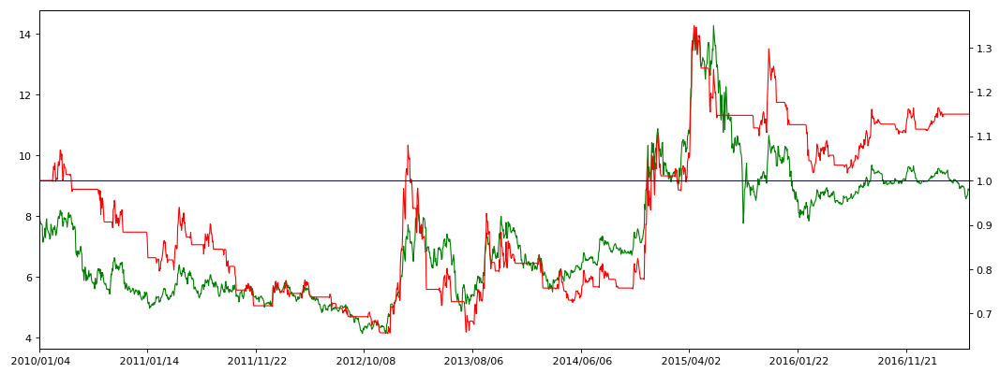



```python
import pandas as pd
import matplotlib.pyplot as plt
import numpy as np
```


```python
stock_data = pd.read_csv('datacsv/sz000001.csv')
stock_data = stock_data.set_index('date')
```


```python
MA_D1 = 5
MA_D2 = 20
```


```python
MA_1 = stock_data['close'].rolling(window=MA_D1).mean()
MA_2 = stock_data['close'].rolling(window=MA_D2).mean()
close_MA1 = pd.concat([stock_data['close'], MA_1], axis=1)
close_MA1_MA2 = pd.concat([close_MA1, MA_2], axis=1)
close_MA1_MA2.columns = ['close','MA1','MA2']
```


```python
Strategy_data = close_MA1_MA2[pd.to_datetime(close_MA1_MA2.index) >= pd.to_datetime('20100101')]
```


```python
Buy_Point = Strategy_data.loc[Strategy_data['MA1'] > Strategy_data['MA2'],['close','MA1','MA2']]
Buy_Point.loc[0:,'point'] = 1
Buy_Point.columns = ['Buy_close','Buy_MA1','Buy_MA2','Buy_point']
```


```python
Sell_Point = Strategy_data.loc[Strategy_data['MA1'] <= Strategy_data['MA2'],['close','MA1','MA2']]
Sell_Point.loc[0:,'point'] = -1
Sell_Point.columns = ['Sell_close','Sell_MA1','Sell_MA2','Sell_point']
```


```python
Strategy_point_data = pd.concat([Buy_Point, Sell_Point], axis=1)
Strategy_point_data = Strategy_point_data.fillna(0)
Strategy_point_data['BS_close'] = Strategy_point_data['Buy_close']+Strategy_point_data['Sell_close']
Strategy_point_data['BS_MA1'] = Strategy_point_data['Buy_MA1']+Strategy_point_data['Sell_MA1']
Strategy_point_data['BS_MA2'] = Strategy_point_data['Buy_MA2']+Strategy_point_data['Sell_MA2']
Strategy_point_data['Points'] = Strategy_point_data['Buy_point']+Strategy_point_data['Sell_point']
Strategy_point_data = Strategy_point_data[['BS_close','BS_MA1','BS_MA2','Points']]
```


```python
Strategy_point_data['BS_point'] = Strategy_point_data['Points'].shift(1)
Strategy_point_data['BS_point'] = Strategy_point_data['BS_point'].fillna(-1)
Strategy_point_data['BS_point'] = (Strategy_point_data['Points'] - Strategy_point_data['BS_point'])/2
Strategy_point_data.head()
```


<div>

<table border="1" class="dataframe">
  <thead>
    <tr style="text-align: right;">
      <th></th>
      <th>BS_close</th>
      <th>BS_MA1</th>
      <th>BS_MA2</th>
      <th>Points</th>
      <th>BS_point</th>
    </tr>
  </thead>
  <tbody>
    <tr>
      <th>2010/01/04</th>
      <td>8.14</td>
      <td>8.194</td>
      <td>8.3490</td>
      <td>-1.0</td>
      <td>0.0</td>
    </tr>
    <tr>
      <th>2010/01/05</th>
      <td>7.99</td>
      <td>8.196</td>
      <td>8.3375</td>
      <td>-1.0</td>
      <td>0.0</td>
    </tr>
    <tr>
      <th>2010/01/06</th>
      <td>7.84</td>
      <td>8.146</td>
      <td>8.2940</td>
      <td>-1.0</td>
      <td>0.0</td>
    </tr>
    <tr>
      <th>2010/01/07</th>
      <td>7.75</td>
      <td>8.020</td>
      <td>8.2450</td>
      <td>-1.0</td>
      <td>0.0</td>
    </tr>
    <tr>
      <th>2010/01/08</th>
      <td>7.74</td>
      <td>7.892</td>
      <td>8.2060</td>
      <td>-1.0</td>
      <td>0.0</td>
    </tr>
  </tbody>
</table>
</div>


```python
k = len(Strategy_point_data)
Strategy_point_data['order'] = np.arange(0,k,1)
```


```python
Strategy_signals = Strategy_point_data.loc[Strategy_point_data['BS_point'] != 0, ['BS_close','BS_MA1','BS_MA2','BS_point','order']]
Strategy_signals.columns = ['BS_close','BS_MA1','BS_MA2','point_BS','order_BS']
Strategy_signals.head()
```


<div>

<table border="1" class="dataframe">
  <thead>
    <tr style="text-align: right;">
      <th></th>
      <th>BS_close</th>
      <th>BS_MA1</th>
      <th>BS_MA2</th>
      <th>point_BS</th>
      <th>order_BS</th>
    </tr>
  </thead>
  <tbody>
    <tr>
      <th>2010/02/08</th>
      <td>7.36</td>
      <td>7.498</td>
      <td>7.4680</td>
      <td>1.0</td>
      <td>25</td>
    </tr>
    <tr>
      <th>2010/02/24</th>
      <td>7.41</td>
      <td>7.512</td>
      <td>7.5280</td>
      <td>-1.0</td>
      <td>32</td>
    </tr>
    <tr>
      <th>2010/02/26</th>
      <td>7.68</td>
      <td>7.514</td>
      <td>7.5070</td>
      <td>1.0</td>
      <td>34</td>
    </tr>
    <tr>
      <th>2010/03/19</th>
      <td>7.89</td>
      <td>7.824</td>
      <td>7.8270</td>
      <td>-1.0</td>
      <td>48</td>
    </tr>
    <tr>
      <th>2010/03/22</th>
      <td>7.93</td>
      <td>7.878</td>
      <td>7.8395</td>
      <td>1.0</td>
      <td>49</td>
    </tr>
  </tbody>
</table>
</div>


```python
BP_price = Strategy_point_data.loc[Strategy_point_data['BS_point'] == 1, ['BS_close','BS_point','order']]
SP_price = Strategy_point_data.loc[Strategy_point_data['BS_point'] == -1, ['BS_close','BS_point','order']]
```


```python
BP_price['startdate'] = BP_price.index
BP_Profit = BP_price[['startdate','BS_close','BS_point']]
BP_Profit.columns = ['Start_date','Buy_close','Buy_point']
BP_Profit = BP_Profit.reset_index(drop=True)
```


```python
SP_price['enddate'] = SP_price.index
SP_Profit = SP_price[['enddate','BS_close','BS_point']]
SP_Profit.columns = ['End_date','Sell_close','Sell_point']
SP_Profit = SP_Profit.reset_index(drop=True)
```


```python
Strategy_Profit = pd.concat([BP_Profit, SP_Profit], axis=1, join_axes=[BP_Profit.index])
Strategy_Profit = Strategy_Profit[['Start_date','End_date','Buy_close','Sell_close']]
Strategy_Profit.head()
```


<div>

<table border="1" class="dataframe">
  <thead>
    <tr style="text-align: right;">
      <th></th>
      <th>Start_date</th>
      <th>End_date</th>
      <th>Buy_close</th>
      <th>Sell_close</th>
    </tr>
  </thead>
  <tbody>
    <tr>
      <th>0</th>
      <td>2010/02/08</td>
      <td>2010/02/24</td>
      <td>7.36</td>
      <td>7.41</td>
    </tr>
    <tr>
      <th>1</th>
      <td>2010/02/26</td>
      <td>2010/03/19</td>
      <td>7.68</td>
      <td>7.89</td>
    </tr>
    <tr>
      <th>2</th>
      <td>2010/03/22</td>
      <td>2010/03/24</td>
      <td>7.93</td>
      <td>7.81</td>
    </tr>
    <tr>
      <th>3</th>
      <td>2010/04/01</td>
      <td>2010/04/09</td>
      <td>8.02</td>
      <td>7.76</td>
    </tr>
    <tr>
      <th>4</th>
      <td>2010/06/22</td>
      <td>2010/09/10</td>
      <td>6.26</td>
      <td>5.78</td>
    </tr>
  </tbody>
</table>
</div>


```python
p = len(Strategy_Profit)
cash = 10000
Strategy_Profit.loc[0:0,'Startcash'] = cash
Startcash = Strategy_Profit['Startcash'][0]
batch = 100
brokerage = 2.5
Strategy_Profit.head(3)
```


<div>

<table border="1" class="dataframe">
  <thead>
    <tr style="text-align: right;">
      <th></th>
      <th>Start_date</th>
      <th>End_date</th>
      <th>Buy_close</th>
      <th>Sell_close</th>
      <th>Startcash</th>
    </tr>
  </thead>
  <tbody>
    <tr>
      <th>0</th>
      <td>2010/02/08</td>
      <td>2010/02/24</td>
      <td>7.36</td>
      <td>7.41</td>
      <td>10000.0</td>
    </tr>
    <tr>
      <th>1</th>
      <td>2010/02/26</td>
      <td>2010/03/19</td>
      <td>7.68</td>
      <td>7.89</td>
      <td>NaN</td>
    </tr>
    <tr>
      <th>2</th>
      <td>2010/03/22</td>
      <td>2010/03/24</td>
      <td>7.93</td>
      <td>7.81</td>
      <td>NaN</td>
    </tr>
  </tbody>
</table>
</div>


```python
Strategy_Profit.loc[0:0,'Shares'] = (Startcash/batch)//Strategy_Profit['Buy_close']*batch
Strategy_Profit.loc[0:0,'Price'] = Strategy_Profit['Buy_close']*Strategy_Profit['Shares']
bb = Strategy_Profit['Price'][0]*brokerage/10000
if bb > 5:
    Strategy_Profit.loc[0:0,'Buy_Brokerage'] = bb
else:
    Strategy_Profit.loc[0:0,'Buy_Brokerage'] = 5
Strategy_Profit.loc[0:0,'Surplus'] = Strategy_Profit['Startcash'] - Strategy_Profit['Price'] - Strategy_Profit['Buy_Brokerage']
Strategy_Profit.loc[0:0,'AlphaCat'] = Strategy_Profit['Sell_close']*Strategy_Profit['Shares']
sb = Strategy_Profit['AlphaCat'][0]*brokerage/10000
if bb > 5:
    Strategy_Profit.loc[0:0,'Sell_Brokerage'] = sb
else:
    Strategy_Profit.loc[0:0,'Sell_Brokerage'] = 5
Strategy_Profit.loc[0:0,'Tax'] = Strategy_Profit['AlphaCat']*1.0/1000
Strategy_Profit.loc[0:0,'Endcash'] = Strategy_Profit['AlphaCat'] + Strategy_Profit['Surplus'] - Strategy_Profit['Sell_Brokerage'] - Strategy_Profit['Tax']
Strategy_Profit.loc[1:1,'Startcash'] = Strategy_Profit['Endcash'][0]
Strategy_Profit.head(3)
```


<div>

<table border="1" class="dataframe">
  <thead>
    <tr style="text-align: right;">
      <th></th>
      <th>Start_date</th>
      <th>End_date</th>
      <th>Buy_close</th>
      <th>Sell_close</th>
      <th>Startcash</th>
      <th>Shares</th>
      <th>Price</th>
      <th>Buy_Brokerage</th>
      <th>Surplus</th>
      <th>AlphaCat</th>
      <th>Sell_Brokerage</th>
      <th>Tax</th>
      <th>Endcash</th>
    </tr>
  </thead>
  <tbody>
    <tr>
      <th>0</th>
      <td>2010/02/08</td>
      <td>2010/02/24</td>
      <td>7.36</td>
      <td>7.41</td>
      <td>10000.000</td>
      <td>1300.0</td>
      <td>9568.0</td>
      <td>5.0</td>
      <td>427.0</td>
      <td>9633.0</td>
      <td>5.0</td>
      <td>9.633</td>
      <td>10045.367</td>
    </tr>
    <tr>
      <th>1</th>
      <td>2010/02/26</td>
      <td>2010/03/19</td>
      <td>7.68</td>
      <td>7.89</td>
      <td>10045.367</td>
      <td>NaN</td>
      <td>NaN</td>
      <td>NaN</td>
      <td>NaN</td>
      <td>NaN</td>
      <td>NaN</td>
      <td>NaN</td>
      <td>NaN</td>
    </tr>
    <tr>
      <th>2</th>
      <td>2010/03/22</td>
      <td>2010/03/24</td>
      <td>7.93</td>
      <td>7.81</td>
      <td>NaN</td>
      <td>NaN</td>
      <td>NaN</td>
      <td>NaN</td>
      <td>NaN</td>
      <td>NaN</td>
      <td>NaN</td>
      <td>NaN</td>
      <td>NaN</td>
    </tr>
  </tbody>
</table>
</div>


```python
for i in range(1,p):
    Strategy_Profit.loc[i:i,'Shares'] = (Strategy_Profit['Startcash']/batch)//Strategy_Profit['Buy_close']*batch
    Strategy_Profit.loc[i:i,'Price'] = Strategy_Profit['Buy_close']*Strategy_Profit['Shares']
    bbr = Strategy_Profit['Price']*brokerage/10000
    if bbr[i-1] > 5:
        Strategy_Profit.loc[i:i,'Buy_Brokerage'] = bbr[i-1]
    else:
        Strategy_Profit.loc[i:i,'Buy_Brokerage'] = 5
    Strategy_Profit.loc[i:i,'Surplus'] = Strategy_Profit['Startcash'] - Strategy_Profit['Price'] - Strategy_Profit['Buy_Brokerage']
    Strategy_Profit.loc[i:i,'AlphaCat'] = Strategy_Profit['Sell_close']*Strategy_Profit['Shares']
    sbr = Strategy_Profit['AlphaCat']*brokerage/10000
    if sbr[i-1] > 5:
        Strategy_Profit.loc[i:i,'Sell_Brokerage'] = sbr[i-1]
    else:
        Strategy_Profit.loc[i:i,'Sell_Brokerage'] = 5
    Strategy_Profit.loc[i:i,'Tax'] = Strategy_Profit['AlphaCat']*1.0/1000
    Strategy_Profit.loc[i:i,'Endcash'] = Strategy_Profit['AlphaCat'] + Strategy_Profit['Surplus'] - Strategy_Profit['Sell_Brokerage'] - Strategy_Profit['Tax']
    Strategy_Profit.loc[i+1:i+1,'Startcash'] = Strategy_Profit['Endcash'][i]
```


```python
Strategy_Profit['Profit_real'] = Strategy_Profit['Endcash']/cash
Strategy_Profit.head()
```


<div>

<table border="1" class="dataframe">
  <thead>
    <tr style="text-align: right;">
      <th></th>
      <th>Start_date</th>
      <th>End_date</th>
      <th>Buy_close</th>
      <th>Sell_close</th>
      <th>Startcash</th>
      <th>Shares</th>
      <th>Price</th>
      <th>Buy_Brokerage</th>
      <th>Surplus</th>
      <th>AlphaCat</th>
      <th>Sell_Brokerage</th>
      <th>Tax</th>
      <th>Endcash</th>
      <th>Profit_real</th>
    </tr>
  </thead>
  <tbody>
    <tr>
      <th>0</th>
      <td>2010/02/08</td>
      <td>2010/02/24</td>
      <td>7.36</td>
      <td>7.41</td>
      <td>10000.000</td>
      <td>1300.0</td>
      <td>9568.0</td>
      <td>5.0</td>
      <td>427.000</td>
      <td>9633.0</td>
      <td>5.0</td>
      <td>9.633</td>
      <td>10045.367</td>
      <td>1.004537</td>
    </tr>
    <tr>
      <th>1</th>
      <td>2010/02/26</td>
      <td>2010/03/19</td>
      <td>7.68</td>
      <td>7.89</td>
      <td>10045.367</td>
      <td>1300.0</td>
      <td>9984.0</td>
      <td>5.0</td>
      <td>56.367</td>
      <td>10257.0</td>
      <td>5.0</td>
      <td>10.257</td>
      <td>10298.110</td>
      <td>1.029811</td>
    </tr>
    <tr>
      <th>2</th>
      <td>2010/03/22</td>
      <td>2010/03/24</td>
      <td>7.93</td>
      <td>7.81</td>
      <td>10298.110</td>
      <td>1200.0</td>
      <td>9516.0</td>
      <td>5.0</td>
      <td>777.110</td>
      <td>9372.0</td>
      <td>5.0</td>
      <td>9.372</td>
      <td>10134.738</td>
      <td>1.013474</td>
    </tr>
    <tr>
      <th>3</th>
      <td>2010/04/01</td>
      <td>2010/04/09</td>
      <td>8.02</td>
      <td>7.76</td>
      <td>10134.738</td>
      <td>1200.0</td>
      <td>9624.0</td>
      <td>5.0</td>
      <td>505.738</td>
      <td>9312.0</td>
      <td>5.0</td>
      <td>9.312</td>
      <td>9803.426</td>
      <td>0.980343</td>
    </tr>
    <tr>
      <th>4</th>
      <td>2010/06/22</td>
      <td>2010/09/10</td>
      <td>6.26</td>
      <td>5.78</td>
      <td>9803.426</td>
      <td>1500.0</td>
      <td>9390.0</td>
      <td>5.0</td>
      <td>408.426</td>
      <td>8670.0</td>
      <td>5.0</td>
      <td>8.670</td>
      <td>9064.756</td>
      <td>0.906476</td>
    </tr>
  </tbody>
</table>
</div>


```python
Strategy_Profit_Buy = Strategy_Profit[['Start_date','Buy_close','Shares','Buy_Brokerage','Surplus','Sell_Brokerage']]
Strategy_Profit_Buy = Strategy_Profit_Buy.set_index('Start_date')
Strategy_Profit_Sell = Strategy_Profit[['End_date','Tax','Profit_real','Endcash']]
Strategy_Profit_Sell = Strategy_Profit_Sell.set_index('End_date')
Strategy_Profit_real_ALL = pd.concat([Strategy_point_data,Strategy_Profit_Buy], axis=1)
Strategy_Profit_real_ALL['BS_point'] = Strategy_Profit_real_ALL['BS_point']+Strategy_Profit_real_ALL['Points']
```


```python
Strategy_Profit_real_ALL = pd.concat([Strategy_Profit_real_ALL,Strategy_Profit_Sell], axis=1)
Strategy_Profit_real_ALL = Strategy_Profit_real_ALL[['order','Shares','Buy_close','Buy_Brokerage','Surplus','BS_close','BS_MA1','BS_MA2','Sell_Brokerage','Tax','Endcash','Profit_real','BS_point']]
```


```python
if Strategy_Profit_real_ALL.loc[Strategy_Profit_real_ALL['order'] == 0,'BS_point'].values != 2:
    Strategy_Profit_real_ALL.loc[Strategy_Profit_real_ALL['order'] == 0,['Buy_close','Buy_Brokerage','Sell_Brokerage','Tax','Shares']] = 0
    Strategy_Profit_real_ALL.loc[Strategy_Profit_real_ALL['order'] == 0,['Surplus','Endcash']] = cash
    Strategy_Profit_real_ALL.loc[Strategy_Profit_real_ALL['order'] == 0,'Profit_real'] = 1
```


```python
for j in range(1,k):
    sh = Strategy_Profit_real_ALL.loc[Strategy_Profit_real_ALL['order'] == j-1,'Shares'].values
    bc = Strategy_Profit_real_ALL.loc[Strategy_Profit_real_ALL['order'] == j-1,'Buy_close'].values
    bbk = Strategy_Profit_real_ALL.loc[Strategy_Profit_real_ALL['order'] == j-1,'Buy_Brokerage'].values
    sp = Strategy_Profit_real_ALL.loc[Strategy_Profit_real_ALL['order'] == j-1,'Surplus'].values
    sbk = Strategy_Profit_real_ALL.loc[Strategy_Profit_real_ALL['order'] == j-1,'Sell_Brokerage'].values
    ec = Strategy_Profit_real_ALL.loc[Strategy_Profit_real_ALL['order'] == j-1,'Endcash'].values
    #
    bsp = Strategy_Profit_real_ALL.loc[Strategy_Profit_real_ALL['order'] == j,'BS_point'].values
    if bsp == 1.0 or bsp == -2:
        Strategy_Profit_real_ALL.loc[Strategy_Profit_real_ALL['order'] == j,'Shares'] = sh
        Strategy_Profit_real_ALL.loc[Strategy_Profit_real_ALL['order'] == j,'Buy_close'] = bc
        Strategy_Profit_real_ALL.loc[Strategy_Profit_real_ALL['order'] == j,'Buy_Brokerage'] = bbk
        Strategy_Profit_real_ALL.loc[Strategy_Profit_real_ALL['order'] == j,'Surplus'] = sp
        Strategy_Profit_real_ALL.loc[Strategy_Profit_real_ALL['order'] == j,'Sell_Brokerage'] = sbk
    if bsp == -1.0:
        Strategy_Profit_real_ALL.loc[Strategy_Profit_real_ALL['order'] == j,'Shares'] = 0
        Strategy_Profit_real_ALL.loc[Strategy_Profit_real_ALL['order'] == j,'Buy_close'] = 0
        Strategy_Profit_real_ALL.loc[Strategy_Profit_real_ALL['order'] == j,'Buy_Brokerage'] = 0
        Strategy_Profit_real_ALL.loc[Strategy_Profit_real_ALL['order'] == j,'Surplus'] = ec        
        Strategy_Profit_real_ALL.loc[Strategy_Profit_real_ALL['order'] == j,'Endcash'] = ec
        Strategy_Profit_real_ALL.loc[Strategy_Profit_real_ALL['order'] == j,'Sell_Brokerage'] = 0
```


```python
if bsp >= -1.0:
    Strategy_Profit_real_ALL.loc[0:k,'Tax'] = Strategy_Profit_real_ALL['BS_close']*Strategy_Profit_real_ALL['Shares']/1000
    Strategy_Profit_real_ALL.loc[0:k,'Profit_real'] = (Strategy_Profit_real_ALL['BS_close']*Strategy_Profit_real_ALL['Shares']+Strategy_Profit_real_ALL['Surplus']-Strategy_Profit_real_ALL['Sell_Brokerage']-Strategy_Profit_real_ALL['Tax'])/cash
```


```python
Strategy_Profit_real_ALL[337:354]
# 2011/08/15～2011/09/08
```


<div>

<table border="1" class="dataframe">
  <thead>
    <tr style="text-align: right;">
      <th></th>
      <th>order</th>
      <th>Shares</th>
      <th>Buy_close</th>
      <th>Buy_Brokerage</th>
      <th>Surplus</th>
      <th>BS_close</th>
      <th>BS_MA1</th>
      <th>BS_MA2</th>
      <th>Sell_Brokerage</th>
      <th>Tax</th>
      <th>Endcash</th>
      <th>Profit_real</th>
      <th>BS_point</th>
    </tr>
  </thead>
  <tbody>
    <tr>
      <th>2011/08/15</th>
      <td>337</td>
      <td>0.0</td>
      <td>0.00</td>
      <td>0.0</td>
      <td>8449.501</td>
      <td>5.76</td>
      <td>5.516</td>
      <td>5.6660</td>
      <td>0.0</td>
      <td>0.000</td>
      <td>8449.501</td>
      <td>0.844950</td>
      <td>-1.0</td>
    </tr>
    <tr>
      <th>2011/08/16</th>
      <td>338</td>
      <td>0.0</td>
      <td>0.00</td>
      <td>0.0</td>
      <td>8449.501</td>
      <td>5.73</td>
      <td>5.590</td>
      <td>5.6570</td>
      <td>0.0</td>
      <td>0.000</td>
      <td>8449.501</td>
      <td>0.844950</td>
      <td>-1.0</td>
    </tr>
    <tr>
      <th>2011/08/18</th>
      <td>339</td>
      <td>0.0</td>
      <td>0.00</td>
      <td>0.0</td>
      <td>8449.501</td>
      <td>5.61</td>
      <td>5.636</td>
      <td>5.6420</td>
      <td>0.0</td>
      <td>0.000</td>
      <td>8449.501</td>
      <td>0.844950</td>
      <td>-1.0</td>
    </tr>
    <tr>
      <th>2011/08/19</th>
      <td>340</td>
      <td>1500.0</td>
      <td>5.57</td>
      <td>5.0</td>
      <td>89.501</td>
      <td>5.57</td>
      <td>5.650</td>
      <td>5.6315</td>
      <td>5.0</td>
      <td>8.355</td>
      <td>NaN</td>
      <td>0.843115</td>
      <td>2.0</td>
    </tr>
    <tr>
      <th>2011/08/22</th>
      <td>341</td>
      <td>1500.0</td>
      <td>5.57</td>
      <td>5.0</td>
      <td>89.501</td>
      <td>5.50</td>
      <td>5.634</td>
      <td>5.6170</td>
      <td>5.0</td>
      <td>8.250</td>
      <td>NaN</td>
      <td>0.832625</td>
      <td>1.0</td>
    </tr>
    <tr>
      <th>2011/08/23</th>
      <td>342</td>
      <td>1500.0</td>
      <td>5.57</td>
      <td>5.0</td>
      <td>89.501</td>
      <td>5.58</td>
      <td>5.598</td>
      <td>5.6130</td>
      <td>5.0</td>
      <td>8.370</td>
      <td>8446.131</td>
      <td>0.844613</td>
      <td>-2.0</td>
    </tr>
    <tr>
      <th>2011/08/24</th>
      <td>343</td>
      <td>0.0</td>
      <td>0.00</td>
      <td>0.0</td>
      <td>8446.131</td>
      <td>5.49</td>
      <td>5.550</td>
      <td>5.5980</td>
      <td>0.0</td>
      <td>0.000</td>
      <td>8446.131</td>
      <td>0.844613</td>
      <td>-1.0</td>
    </tr>
    <tr>
      <th>2011/08/25</th>
      <td>344</td>
      <td>0.0</td>
      <td>0.00</td>
      <td>0.0</td>
      <td>8446.131</td>
      <td>5.83</td>
      <td>5.594</td>
      <td>5.6005</td>
      <td>0.0</td>
      <td>0.000</td>
      <td>8446.131</td>
      <td>0.844613</td>
      <td>-1.0</td>
    </tr>
    <tr>
      <th>2011/08/26</th>
      <td>345</td>
      <td>1400.0</td>
      <td>5.85</td>
      <td>5.0</td>
      <td>251.131</td>
      <td>5.85</td>
      <td>5.650</td>
      <td>5.6100</td>
      <td>5.0</td>
      <td>8.190</td>
      <td>NaN</td>
      <td>0.842794</td>
      <td>2.0</td>
    </tr>
    <tr>
      <th>2011/08/29</th>
      <td>346</td>
      <td>1400.0</td>
      <td>5.85</td>
      <td>5.0</td>
      <td>251.131</td>
      <td>5.61</td>
      <td>5.672</td>
      <td>5.5990</td>
      <td>5.0</td>
      <td>7.854</td>
      <td>NaN</td>
      <td>0.809228</td>
      <td>1.0</td>
    </tr>
    <tr>
      <th>2011/08/30</th>
      <td>347</td>
      <td>1400.0</td>
      <td>5.85</td>
      <td>5.0</td>
      <td>251.131</td>
      <td>5.59</td>
      <td>5.674</td>
      <td>5.5895</td>
      <td>5.0</td>
      <td>7.826</td>
      <td>NaN</td>
      <td>0.806431</td>
      <td>1.0</td>
    </tr>
    <tr>
      <th>2011/08/31</th>
      <td>348</td>
      <td>1400.0</td>
      <td>5.85</td>
      <td>5.0</td>
      <td>251.131</td>
      <td>5.66</td>
      <td>5.708</td>
      <td>5.5870</td>
      <td>5.0</td>
      <td>7.924</td>
      <td>NaN</td>
      <td>0.816221</td>
      <td>1.0</td>
    </tr>
    <tr>
      <th>2011/09/01</th>
      <td>349</td>
      <td>1400.0</td>
      <td>5.85</td>
      <td>5.0</td>
      <td>251.131</td>
      <td>5.68</td>
      <td>5.678</td>
      <td>5.5880</td>
      <td>5.0</td>
      <td>7.952</td>
      <td>NaN</td>
      <td>0.819018</td>
      <td>1.0</td>
    </tr>
    <tr>
      <th>2011/09/05</th>
      <td>350</td>
      <td>1400.0</td>
      <td>5.85</td>
      <td>5.0</td>
      <td>251.131</td>
      <td>5.51</td>
      <td>5.610</td>
      <td>5.5800</td>
      <td>5.0</td>
      <td>7.714</td>
      <td>NaN</td>
      <td>0.795242</td>
      <td>1.0</td>
    </tr>
    <tr>
      <th>2011/09/06</th>
      <td>351</td>
      <td>1400.0</td>
      <td>5.85</td>
      <td>5.0</td>
      <td>251.131</td>
      <td>5.48</td>
      <td>5.584</td>
      <td>5.5810</td>
      <td>5.0</td>
      <td>7.672</td>
      <td>NaN</td>
      <td>0.791046</td>
      <td>1.0</td>
    </tr>
    <tr>
      <th>2011/09/07</th>
      <td>352</td>
      <td>1400.0</td>
      <td>5.85</td>
      <td>5.0</td>
      <td>251.131</td>
      <td>5.59</td>
      <td>5.584</td>
      <td>5.5930</td>
      <td>5.0</td>
      <td>7.826</td>
      <td>8064.305</td>
      <td>0.806431</td>
      <td>-2.0</td>
    </tr>
    <tr>
      <th>2011/09/08</th>
      <td>353</td>
      <td>0.0</td>
      <td>0.00</td>
      <td>0.0</td>
      <td>8064.305</td>
      <td>5.55</td>
      <td>5.562</td>
      <td>5.6025</td>
      <td>0.0</td>
      <td>0.000</td>
      <td>8064.305</td>
      <td>0.806431</td>
      <td>-1.0</td>
    </tr>
  </tbody>
</table>
</div>


```python
plt.figure(2, figsize=(16,6), dpi=80)
ax1 = plt.subplot(111)
Strategy_Profit_real_ALL['BS_close'].plot(color='green', linewidth='1')
ax2 = ax1.twinx()
Strategy_Profit_real_ALL['Profit_real'].plot(color='red', linewidth='1').axhline(y=1, color='blue', linewidth='1')
```


    <matplotlib.lines.Line2D at 0xc541358>


```python
plt.show()
```




