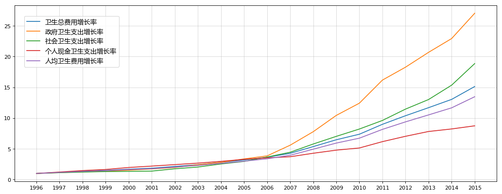
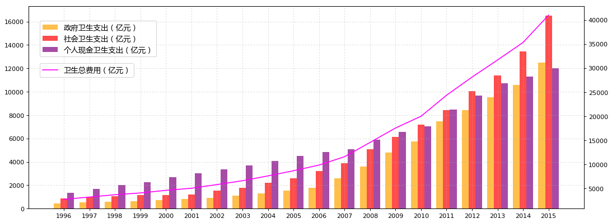

```python
import pandas as pd
import numpy as np
import matplotlib.pyplot as plt
```


```python
# 国家统计局：1996年～2015年卫生费用支出数据
medical_expense = pd.read_csv('datacsv/medical_expense.csv', encoding='gbk')
medical_expense = medical_expense.set_index(u'指标')
```


```python
medical_expense_T = medical_expense.T
medical_expense_T = medical_expense_T.sort_index(axis=0, ascending=True)
k = len(medical_expense_T)
```


```python
medical_expense.iloc[0:,0:k/2]
```


<div>

<table border="1" class="dataframe">
  <thead>
    <tr style="text-align: right;">
      <th></th>
      <th>2015</th>
      <th>2014</th>
      <th>2013</th>
      <th>2012</th>
      <th>2011</th>
      <th>2010</th>
      <th>2009</th>
      <th>2008</th>
      <th>2007</th>
      <th>2006</th>
    </tr>
    <tr>
      <th>指标</th>
      <th></th>
      <th></th>
      <th></th>
      <th></th>
      <th></th>
      <th></th>
      <th></th>
      <th></th>
      <th></th>
      <th></th>
    </tr>
  </thead>
  <tbody>
    <tr>
      <th>卫生总费用（亿元）</th>
      <td>40974.64</td>
      <td>35312.40</td>
      <td>31668.95</td>
      <td>28119.00</td>
      <td>24345.91</td>
      <td>19980.39</td>
      <td>17541.92</td>
      <td>14535.40</td>
      <td>11573.97</td>
      <td>9843.34</td>
    </tr>
    <tr>
      <th>政府卫生支出（亿元）</th>
      <td>12475.28</td>
      <td>10579.23</td>
      <td>9545.81</td>
      <td>8431.98</td>
      <td>7464.18</td>
      <td>5732.49</td>
      <td>4816.26</td>
      <td>3593.94</td>
      <td>2581.58</td>
      <td>1778.86</td>
    </tr>
    <tr>
      <th>社会卫生支出（亿元）</th>
      <td>16506.71</td>
      <td>13437.75</td>
      <td>11393.79</td>
      <td>10030.70</td>
      <td>8416.45</td>
      <td>7196.61</td>
      <td>6154.49</td>
      <td>5065.60</td>
      <td>3893.72</td>
      <td>3210.92</td>
    </tr>
    <tr>
      <th>个人现金卫生支出（亿元）</th>
      <td>11992.65</td>
      <td>11295.41</td>
      <td>10729.34</td>
      <td>9656.32</td>
      <td>8465.28</td>
      <td>7051.29</td>
      <td>6571.16</td>
      <td>5875.86</td>
      <td>5098.66</td>
      <td>4853.56</td>
    </tr>
    <tr>
      <th>人均卫生费用（元）</th>
      <td>2980.80</td>
      <td>2581.66</td>
      <td>2327.37</td>
      <td>2076.67</td>
      <td>1806.95</td>
      <td>1490.06</td>
      <td>1314.26</td>
      <td>1094.52</td>
      <td>875.96</td>
      <td>748.84</td>
    </tr>
  </tbody>
</table>
</div>


```python
medical_expense.iloc[0:,k/2:k]
```


<div>

<table border="1" class="dataframe">
  <thead>
    <tr style="text-align: right;">
      <th></th>
      <th>2005</th>
      <th>2004</th>
      <th>2003</th>
      <th>2002</th>
      <th>2001</th>
      <th>2000</th>
      <th>1999</th>
      <th>1998</th>
      <th>1997</th>
      <th>1996</th>
    </tr>
    <tr>
      <th>指标</th>
      <th></th>
      <th></th>
      <th></th>
      <th></th>
      <th></th>
      <th></th>
      <th></th>
      <th></th>
      <th></th>
      <th></th>
    </tr>
  </thead>
  <tbody>
    <tr>
      <th>卫生总费用（亿元）</th>
      <td>8659.91</td>
      <td>7590.29</td>
      <td>6584.10</td>
      <td>5790.03</td>
      <td>5025.93</td>
      <td>4586.63</td>
      <td>4047.50</td>
      <td>3678.72</td>
      <td>3196.71</td>
      <td>2709.42</td>
    </tr>
    <tr>
      <th>政府卫生支出（亿元）</th>
      <td>1552.53</td>
      <td>1293.58</td>
      <td>1116.94</td>
      <td>908.51</td>
      <td>800.61</td>
      <td>709.52</td>
      <td>640.96</td>
      <td>590.06</td>
      <td>523.56</td>
      <td>461.61</td>
    </tr>
    <tr>
      <th>社会卫生支出（亿元）</th>
      <td>2586.40</td>
      <td>2225.35</td>
      <td>1788.50</td>
      <td>1539.38</td>
      <td>1211.43</td>
      <td>1171.94</td>
      <td>1145.99</td>
      <td>1071.03</td>
      <td>984.06</td>
      <td>875.66</td>
    </tr>
    <tr>
      <th>个人现金卫生支出（亿元）</th>
      <td>4520.98</td>
      <td>4071.35</td>
      <td>3678.67</td>
      <td>3342.14</td>
      <td>3013.88</td>
      <td>2705.17</td>
      <td>2260.55</td>
      <td>2017.63</td>
      <td>1689.09</td>
      <td>1372.15</td>
    </tr>
    <tr>
      <th>人均卫生费用（元）</th>
      <td>662.30</td>
      <td>583.92</td>
      <td>509.50</td>
      <td>450.75</td>
      <td>393.80</td>
      <td>361.88</td>
      <td>321.78</td>
      <td>294.86</td>
      <td>258.58</td>
      <td>221.38</td>
    </tr>
  </tbody>
</table>
</div>


```python
# 卫生总费用：是指一个国家或地区在一定时期内，为开展卫生服务活动从全社会筹集的卫生资源的货币总额，按来源法核算。它反映一定经济条件下，政府、社会和居民个人对卫生保健的重视程度和费用负担水平，以及卫生筹资模式的主要特征和卫生筹资的公平性合理性。

# 政府卫生支出：是指各级政府用于医疗卫生服务、医疗保障补助、卫生和医疗保险行政管理、人口与计划生育事务支出等各项事业的经费。

# 社会卫生支出：是指政府支出外的社会各界对卫生事业的资金投入。包括社会医疗保障支出、商业健康保险费、社会办医支出、社会捐赠援助、行政事业性收费收入等。

# 个人现金卫生支出：是指城乡居民在接受各类医疗卫生服务时的现金支付，包括享受各种医疗保险制度的居民就医时自付的费用。可分为城镇居民、农村居民个人现金卫生支出，反映城乡居民医疗卫生费用的负担程度。

# 人均卫生费用：即某年卫生总费用与同期平均人口数之比。
```


```python
# 1996年～2015年卫生费用支出的复合增长率
# 复合增长率CAGR =（现有价值/基础价值）^（1/年数） - 1
a = int(medical_expense_T.index[-1])
b = 1.0/(a-1996)
medical_expense_i = medical_expense.iloc[0:,0:k]
medical_expense_i['increase'] = (medical_expense_i['2015']/medical_expense_i['1996'])**b-1
# medical_expense_i[['increase']].round(3)
# 仅为显示小数点位数，而实际数据位数不变
medical_expense_i['CAGR_increase'] = medical_expense_i['increase'].apply(lambda x: format(x, '.3%'))
# 将数值转换为百分比，数据必须是Series类型，得到百分比数据后再用DataFrame类型输出即可：data[['w']]
medical_expense_CAGR = medical_expense_i[['CAGR_increase']]
medical_expense_CAGR.columns = [u'年复合增长率']
medical_expense_CAGR
```


<div>

<table border="1" class="dataframe">
  <thead>
    <tr style="text-align: right;">
      <th></th>
      <th>年复合增长率</th>
    </tr>
    <tr>
      <th>指标</th>
      <th></th>
    </tr>
  </thead>
  <tbody>
    <tr>
      <th>卫生总费用（亿元）</th>
      <td>15.368%</td>
    </tr>
    <tr>
      <th>政府卫生支出（亿元）</th>
      <td>18.948%</td>
    </tr>
    <tr>
      <th>社会卫生支出（亿元）</th>
      <td>16.714%</td>
    </tr>
    <tr>
      <th>个人现金卫生支出（亿元）</th>
      <td>12.087%</td>
    </tr>
    <tr>
      <th>人均卫生费用（元）</th>
      <td>14.665%</td>
    </tr>
  </tbody>
</table>
</div>


```python
medical_expense_P1 = medical_expense_T[u'卫生总费用（亿元）']/medical_expense_T.iloc[0:1,0].values
medical_expense_P2 = medical_expense_T[u'政府卫生支出（亿元）']/medical_expense_T.iloc[0:1,1].values
medical_expense_P3 = medical_expense_T[u'社会卫生支出（亿元）']/medical_expense_T.iloc[0:1,2].values
medical_expense_P4 = medical_expense_T[u'个人现金卫生支出（亿元）']/medical_expense_T.iloc[0:1,3].values
medical_expense_P5 = medical_expense_T[u'人均卫生费用（元）']/medical_expense_T.iloc[0:1,4].values
medical_expense_P = pd.concat([medical_expense_P1,medical_expense_P2,medical_expense_P3,medical_expense_P4,medical_expense_P5], axis=1)
medical_expense_P.columns = [u'卫生总费用增长率',u'政府卫生支出增长率',u'社会卫生支出增长率',u'个人现金卫生支出增长率',u'人均卫生费用增长率']
medical_expense_P.tail()
```


<div>

<table border="1" class="dataframe">
  <thead>
    <tr style="text-align: right;">
      <th></th>
      <th>卫生总费用增长率</th>
      <th>政府卫生支出增长率</th>
      <th>社会卫生支出增长率</th>
      <th>个人现金卫生支出增长率</th>
      <th>人均卫生费用增长率</th>
    </tr>
  </thead>
  <tbody>
    <tr>
      <th>2011</th>
      <td>8.985654</td>
      <td>16.169884</td>
      <td>9.611550</td>
      <td>6.169355</td>
      <td>8.162210</td>
    </tr>
    <tr>
      <th>2012</th>
      <td>10.378236</td>
      <td>18.266459</td>
      <td>11.455017</td>
      <td>7.037365</td>
      <td>9.380567</td>
    </tr>
    <tr>
      <th>2013</th>
      <td>11.688461</td>
      <td>20.679383</td>
      <td>13.011660</td>
      <td>7.819364</td>
      <td>10.513009</td>
    </tr>
    <tr>
      <th>2014</th>
      <td>13.033195</td>
      <td>22.918113</td>
      <td>15.345853</td>
      <td>8.231906</td>
      <td>11.661668</td>
    </tr>
    <tr>
      <th>2015</th>
      <td>15.123030</td>
      <td>27.025584</td>
      <td>18.850593</td>
      <td>8.740043</td>
      <td>13.464631</td>
    </tr>
  </tbody>
</table>
</div>


```python
plt.figure(1,figsize=(16,6), dpi=80)
ax1 = plt.subplot(111)
```


```python
ax1.plot(medical_expense_P, alpha=1)
plt.legend((u'卫生总费用增长率',u'政府卫生支出增长率',u'社会卫生支出增长率',u'个人现金卫生支出增长率',u'人均卫生费用增长率'), prop={'family':'Microsoft YaHei','size':12}, loc=(0.02,0.65))
plt.grid(alpha=0.5)
```


```python
x_ticks = medical_expense_T.index
x_ticks = x_ticks.astype(np.int)
plt.xticks(x_ticks)
```


    ([<matplotlib.axis.XTick at 0xc559d68>,
      <matplotlib.axis.XTick at 0xc47a128>,
      <matplotlib.axis.XTick at 0x99d8ac8>,
      <matplotlib.axis.XTick at 0xc696a20>,
      <matplotlib.axis.XTick at 0xc6b06a0>,
      <matplotlib.axis.XTick at 0xc6b0cf8>,
      <matplotlib.axis.XTick at 0xc70a390>,
      <matplotlib.axis.XTick at 0xc70a9e8>,
      <matplotlib.axis.XTick at 0xc718048>,
      <matplotlib.axis.XTick at 0xc7186a0>,
      <matplotlib.axis.XTick at 0xc718cf8>,
      <matplotlib.axis.XTick at 0xc723390>,
      <matplotlib.axis.XTick at 0xc7239e8>,
      <matplotlib.axis.XTick at 0xc5ce0b8>,
      <matplotlib.axis.XTick at 0xc5bc588>,
      <matplotlib.axis.XTick at 0xc5ba470>,
      <matplotlib.axis.XTick at 0xc731208>,
      <matplotlib.axis.XTick at 0xc731860>,
      <matplotlib.axis.XTick at 0xc731eb8>,
      <matplotlib.axis.XTick at 0xc73b550>],
     <a list of 20 Text xticklabel objects>)


```python
plt.show()
```





```python
plt.figure(2,figsize=(16,6), dpi=80)
ax2 = plt.subplot(111)
```


```python
total_width = 0.8
num_bar = 3
w = total_width/num_bar
x_ticks_b = x_ticks - (total_width - w)/2
af = 0.7
```


```python
plt.bar(x_ticks_b, medical_expense_T[u'政府卫生支出（亿元）'].values, facecolor='orange', width=w, label=u'政府卫生支出（亿元）', alpha=af)
plt.bar(x_ticks_b+w, medical_expense_T[u'社会卫生支出（亿元）'].values, facecolor='red', width=w, label=u'社会卫生支出（亿元）', alpha=af)
plt.bar(x_ticks_b+2*w, medical_expense_T[u'个人现金卫生支出（亿元）'].values, facecolor='purple', width=w, label=u'个人现金卫生支出（亿元）', alpha=af)
plt.legend(prop={'family':'Microsoft YaHei','size':12}, loc=(0.02,0.75))
plt.xticks(x_ticks)
plt.grid(linestyle=':', alpha=0.5)
```


```python
ax3 = ax2.twinx()
ax3.plot(medical_expense_T[u'卫生总费用（亿元）'], color='magenta', label=u'卫生总费用（亿元）', alpha=1)
plt.legend(prop={'family':'Microsoft YaHei','size':12}, loc=(0.02,0.65))
```


    <matplotlib.legend.Legend at 0xcf76fd0>


```python
plt.show()
```




