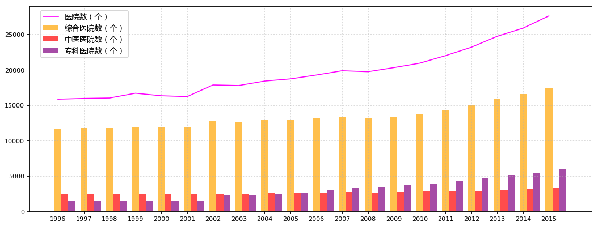

```python
import pandas as pd
import numpy as np
import matplotlib.pyplot as plt
```


```python
# 国家统计局：1996年～2015年医疗卫生机构数据
medical_institution = pd.read_csv('datacsv/medical_institution.csv', encoding='gbk')
medical_institution = medical_institution.set_index(u'指标')
```


```python
medical_institution_T = medical_institution.T
medical_institution_T = medical_institution_T.sort_index(axis=0, ascending=True)
k = len(medical_institution_T)
```


```python
medical_institution.iloc[0:,0:k/2]
```


<div>

<table border="1" class="dataframe">
  <thead>
    <tr style="text-align: right;">
      <th></th>
      <th>2015</th>
      <th>2014</th>
      <th>2013</th>
      <th>2012</th>
      <th>2011</th>
      <th>2010</th>
      <th>2009</th>
      <th>2008</th>
      <th>2007</th>
      <th>2006</th>
    </tr>
    <tr>
      <th>指标</th>
      <th></th>
      <th></th>
      <th></th>
      <th></th>
      <th></th>
      <th></th>
      <th></th>
      <th></th>
      <th></th>
      <th></th>
    </tr>
  </thead>
  <tbody>
    <tr>
      <th>医疗卫生机构数（个）</th>
      <td>983528</td>
      <td>981432</td>
      <td>974398</td>
      <td>950297</td>
      <td>954389</td>
      <td>936927</td>
      <td>916571</td>
      <td>891480</td>
      <td>912263</td>
      <td>918097</td>
    </tr>
    <tr>
      <th>医院数（个）</th>
      <td>27587</td>
      <td>25860</td>
      <td>24709</td>
      <td>23170</td>
      <td>21979</td>
      <td>20918</td>
      <td>20291</td>
      <td>19712</td>
      <td>19852</td>
      <td>19246</td>
    </tr>
    <tr>
      <th>综合医院数（个）</th>
      <td>17430</td>
      <td>16524</td>
      <td>15887</td>
      <td>15021</td>
      <td>14328</td>
      <td>13681</td>
      <td>13364</td>
      <td>13119</td>
      <td>13372</td>
      <td>13120</td>
    </tr>
    <tr>
      <th>中医医院数（个）</th>
      <td>3267</td>
      <td>3115</td>
      <td>3015</td>
      <td>2889</td>
      <td>2831</td>
      <td>2778</td>
      <td>2728</td>
      <td>2688</td>
      <td>2720</td>
      <td>2665</td>
    </tr>
    <tr>
      <th>专科医院数（个）</th>
      <td>6023</td>
      <td>5478</td>
      <td>5127</td>
      <td>4665</td>
      <td>4283</td>
      <td>3956</td>
      <td>3716</td>
      <td>3437</td>
      <td>3282</td>
      <td>3022</td>
    </tr>
    <tr>
      <th>疾病预防控制中心数（个）</th>
      <td>3478</td>
      <td>3490</td>
      <td>3516</td>
      <td>3490</td>
      <td>3484</td>
      <td>3513</td>
      <td>3536</td>
      <td>3534</td>
      <td>3585</td>
      <td>3548</td>
    </tr>
    <tr>
      <th>妇幼保健院（所/站）数（个）</th>
      <td>3078</td>
      <td>3098</td>
      <td>3144</td>
      <td>3044</td>
      <td>3036</td>
      <td>3025</td>
      <td>3020</td>
      <td>3011</td>
      <td>3051</td>
      <td>3003</td>
    </tr>
  </tbody>
</table>
</div>


```python
medical_institution.iloc[0:,k/2:k]
```


<div>

<table border="1" class="dataframe">
  <thead>
    <tr style="text-align: right;">
      <th></th>
      <th>2005</th>
      <th>2004</th>
      <th>2003</th>
      <th>2002</th>
      <th>2001</th>
      <th>2000</th>
      <th>1999</th>
      <th>1998</th>
      <th>1997</th>
      <th>1996</th>
    </tr>
    <tr>
      <th>指标</th>
      <th></th>
      <th></th>
      <th></th>
      <th></th>
      <th></th>
      <th></th>
      <th></th>
      <th></th>
      <th></th>
      <th></th>
    </tr>
  </thead>
  <tbody>
    <tr>
      <th>医疗卫生机构数（个）</th>
      <td>882206</td>
      <td>849140</td>
      <td>806243</td>
      <td>1005004</td>
      <td>1029314</td>
      <td>1034229</td>
      <td>1017673</td>
      <td>1042885</td>
      <td>1048657</td>
      <td>1078131</td>
    </tr>
    <tr>
      <th>医院数（个）</th>
      <td>18703</td>
      <td>18393</td>
      <td>17764</td>
      <td>17844</td>
      <td>16197</td>
      <td>16318</td>
      <td>16678</td>
      <td>16001</td>
      <td>15944</td>
      <td>15833</td>
    </tr>
    <tr>
      <th>综合医院数（个）</th>
      <td>12982</td>
      <td>12900</td>
      <td>12599</td>
      <td>12716</td>
      <td>11834</td>
      <td>11872</td>
      <td>11868</td>
      <td>11779</td>
      <td>11771</td>
      <td>11696</td>
    </tr>
    <tr>
      <th>中医医院数（个）</th>
      <td>2620</td>
      <td>2611</td>
      <td>2518</td>
      <td>2492</td>
      <td>2478</td>
      <td>2453</td>
      <td>2441</td>
      <td>2443</td>
      <td>2413</td>
      <td>2405</td>
    </tr>
    <tr>
      <th>专科医院数（个）</th>
      <td>2682</td>
      <td>2492</td>
      <td>2271</td>
      <td>2237</td>
      <td>1576</td>
      <td>1543</td>
      <td>1533</td>
      <td>1495</td>
      <td>1488</td>
      <td>1473</td>
    </tr>
    <tr>
      <th>疾病预防控制中心数（个）</th>
      <td>3585</td>
      <td>3588</td>
      <td>3584</td>
      <td>3580</td>
      <td>3813</td>
      <td>3741</td>
      <td>3763</td>
      <td>3746</td>
      <td>3747</td>
      <td>3737</td>
    </tr>
    <tr>
      <th>妇幼保健院（所/站）数（个）</th>
      <td>3021</td>
      <td>2998</td>
      <td>3033</td>
      <td>3067</td>
      <td>3132</td>
      <td>3163</td>
      <td>3180</td>
      <td>3191</td>
      <td>3180</td>
      <td>3172</td>
    </tr>
  </tbody>
</table>
</div>


```python
x_ticks = medical_institution_T.index
x_ticks = x_ticks.astype(np.int)
total_width = 0.8
num_bar = 3
w = total_width/num_bar
x_ticks_b = x_ticks - (total_width - w)/2
af = 0.7
```


```python
plt.figure(1,figsize=(16,6), dpi=80)
ax1 = plt.subplot(111)
```


```python
# plt.bar(x_ticks_b, medical_institution_T[u'医院数（个）'].values, facecolor='red', width=w, label=u'医院数（个）', alpha=af)
ax1.plot(medical_institution_T[u'医院数（个）'], color='magenta', label=u'医院数（个）', alpha=1)
plt.bar(x_ticks_b+w, medical_institution_T[u'综合医院数（个）'].values, facecolor='orange', width=w, label=u'综合医院数（个）', alpha=af)
plt.bar(x_ticks_b+2*w, medical_institution_T[u'中医医院数（个）'].values, facecolor='red', width=w, label=u'中医医院数（个）', alpha=af)
plt.bar(x_ticks_b+3*w, medical_institution_T[u'专科医院数（个）'].values, facecolor='purple', width=w, label=u'专科医院数（个）', alpha=af)
plt.legend(prop={'family':'Microsoft YaHei','size':12}, loc=(0.02,0.75))
plt.xticks(x_ticks)
plt.grid(linestyle=':', alpha=0.5)
```


```python
plt.show()
```




