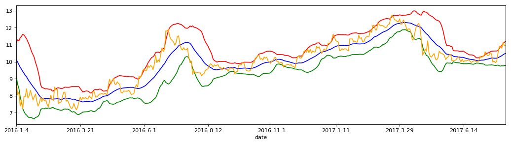

```python
import numpy as np
import pandas as pd
import matplotlib.pyplot as plt
```


```python
stock_data = pd.read_csv('datacsv/002210.csv')
stock_data = stock_data.set_index('date')
```


```python
N = 20
M = 2
```


```python
stadate = '20160101'
enddate = '20170731'
```


```python
MB = stock_data['close'].rolling(window=N).mean()
```


```python
# pandas的std是无偏标准差，而numpy的std是有偏标准差
MD = stock_data['close'].rolling(window=N).std()
```


```python
UP = MB+2*MD
DN = MB-2*MD
```


```python
BOLL = pd.concat([stock_data[['open','high','low','close']], UP, MB, DN], axis=1)
BOLL.columns = ['open','high','low','close','UP','MB','DN']
BOLL.tail()
```


<div>
<style>
    .dataframe thead tr:only-child th {
        text-align: right;
    }

    .dataframe thead th {
        text-align: left;
    }

    .dataframe tbody tr th {
        vertical-align: top;
    }
</style>
<table border="1" class="dataframe">
  <thead>
    <tr style="text-align: right;">
      <th></th>
      <th>open</th>
      <th>high</th>
      <th>low</th>
      <th>close</th>
      <th>UP</th>
      <th>MB</th>
      <th>DN</th>
    </tr>
    <tr>
      <th>date</th>
      <th></th>
      <th></th>
      <th></th>
      <th></th>
      <th></th>
      <th></th>
      <th></th>
    </tr>
  </thead>
  <tbody>
    <tr>
      <th>2017-7-27</th>
      <td>10.85</td>
      <td>11.21</td>
      <td>10.81</td>
      <td>11.13</td>
      <td>11.074453</td>
      <td>10.4115</td>
      <td>9.748547</td>
    </tr>
    <tr>
      <th>2017-7-28</th>
      <td>10.95</td>
      <td>11.20</td>
      <td>10.79</td>
      <td>10.95</td>
      <td>11.137282</td>
      <td>10.4570</td>
      <td>9.776718</td>
    </tr>
    <tr>
      <th>2017-7-31</th>
      <td>10.90</td>
      <td>11.02</td>
      <td>10.81</td>
      <td>10.97</td>
      <td>11.203495</td>
      <td>10.4895</td>
      <td>9.775505</td>
    </tr>
    <tr>
      <th>2017-8-1</th>
      <td>10.84</td>
      <td>11.05</td>
      <td>10.75</td>
      <td>10.90</td>
      <td>11.249418</td>
      <td>10.5215</td>
      <td>9.793582</td>
    </tr>
    <tr>
      <th>2017-8-2</th>
      <td>10.97</td>
      <td>11.05</td>
      <td>10.84</td>
      <td>11.04</td>
      <td>11.313728</td>
      <td>10.5585</td>
      <td>9.803272</td>
    </tr>
  </tbody>
</table>
</div>


```python
BOLL = BOLL[pd.to_datetime(BOLL.index) >= pd.to_datetime(stadate)]
BOLL = BOLL[pd.to_datetime(BOLL.index) <= pd.to_datetime(enddate)]
```


```python
plt.figure(1,figsize=(16,4), dpi=80)
ax1 = plt.subplot(111)
```


```python
BOLL['UP'].plot(color='red', alpha=1)
BOLL['MB'].plot(color='blue', alpha=1)
BOLL['DN'].plot(color='green', alpha=1)
BOLL['close'].plot(color='orange', alpha=1) # marker='.'
```


    <matplotlib.axes._subplots.AxesSubplot at 0xc250c18>


```python
plt.show()
```




