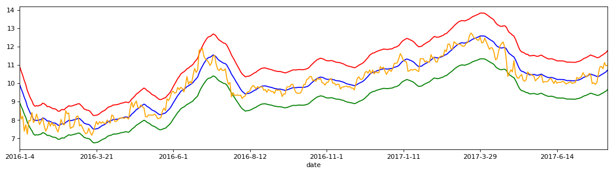

```python
import numpy as np
import pandas as pd
import matplotlib.pyplot as plt
```


```python
stock_data = pd.read_csv('datacsv/002210.csv')
stock_data = stock_data.set_index('date')
```


```python
N = 10
M1 = 11
M2 = 9
```


```python
stadate = '20160101'
enddate = '20170731'
```


```python
MA = stock_data['close'].rolling(window=N).mean()
stock_data['UPPER'] = (1.0+M1/100.0)
stock_data['LOWER'] = (1.0-M2/100.0)
```


```python
UPPER = stock_data['UPPER']*MA
LOWER = stock_data['LOWER']*MA
ULENE = (UPPER+LOWER)/2
```


```python
ENE = pd.concat([stock_data[['open','high','low','close']], UPPER, ULENE, LOWER], axis=1)
ENE.columns = ['open','high','low','close','UPPER','ULENE','LOWER']
ENE.tail()
```


<div>
<style>
    .dataframe thead tr:only-child th {
        text-align: right;
    }

    .dataframe thead th {
        text-align: left;
    }

    .dataframe tbody tr th {
        vertical-align: top;
    }
</style>
<table border="1" class="dataframe">
  <thead>
    <tr style="text-align: right;">
      <th></th>
      <th>open</th>
      <th>high</th>
      <th>low</th>
      <th>close</th>
      <th>UPPER</th>
      <th>ULENE</th>
      <th>LOWER</th>
    </tr>
    <tr>
      <th>date</th>
      <th></th>
      <th></th>
      <th></th>
      <th></th>
      <th></th>
      <th></th>
      <th></th>
    </tr>
  </thead>
  <tbody>
    <tr>
      <th>2017-7-27</th>
      <td>10.85</td>
      <td>11.21</td>
      <td>10.81</td>
      <td>11.13</td>
      <td>11.61837</td>
      <td>10.57167</td>
      <td>9.52497</td>
    </tr>
    <tr>
      <th>2017-7-28</th>
      <td>10.95</td>
      <td>11.20</td>
      <td>10.79</td>
      <td>10.95</td>
      <td>11.67276</td>
      <td>10.62116</td>
      <td>9.56956</td>
    </tr>
    <tr>
      <th>2017-7-31</th>
      <td>10.90</td>
      <td>11.02</td>
      <td>10.81</td>
      <td>10.97</td>
      <td>11.78265</td>
      <td>10.72115</td>
      <td>9.65965</td>
    </tr>
    <tr>
      <th>2017-8-1</th>
      <td>10.84</td>
      <td>11.05</td>
      <td>10.75</td>
      <td>10.90</td>
      <td>11.87922</td>
      <td>10.80902</td>
      <td>9.73882</td>
    </tr>
    <tr>
      <th>2017-8-2</th>
      <td>10.97</td>
      <td>11.05</td>
      <td>10.84</td>
      <td>11.04</td>
      <td>12.00132</td>
      <td>10.92012</td>
      <td>9.83892</td>
    </tr>
  </tbody>
</table>
</div>


```python
ENE = ENE[pd.to_datetime(ENE.index) >= pd.to_datetime(stadate)]
ENE = ENE[pd.to_datetime(ENE.index) <= pd.to_datetime(enddate)]
```


```python
plt.figure(1,figsize=(16,4), dpi=80)
ax1 = plt.subplot(111)
```


```python
ENE['UPPER'].plot(color='red', alpha=1)
ENE['ULENE'].plot(color='blue', alpha=1)
ENE['LOWER'].plot(color='green', alpha=1)
ENE['close'].plot(color='orange', alpha=1)
```


    <matplotlib.axes._subplots.AxesSubplot at 0xc169f60>


```python
plt.show()
```




