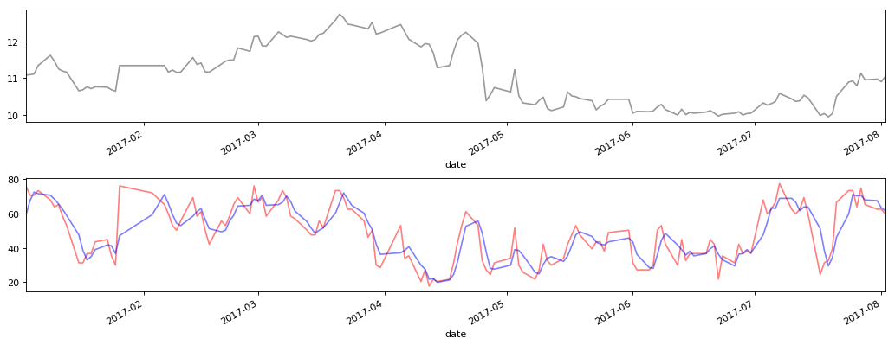

```python
import pandas as pd
import matplotlib.pyplot as plt
import RR
```


```python
RR.Risk_Ratio.index = pd.to_datetime(RR.Risk_Ratio.index)
RR.Risk_Ratio = RR.Risk_Ratio.sort_index(axis=0, ascending=True)
Risk_Ratio_Time = RR.Risk_Ratio[pd.to_datetime(RR.Risk_Ratio.index) >= pd.to_datetime('20170102')]
Risk_Ratio_Time = Risk_Ratio_Time[pd.to_datetime(Risk_Ratio_Time.index) <= pd.to_datetime('20170802')]
```


```python
Risk_Ratio_Time.head()
```


<div>

<table border="1" class="dataframe">
  <thead>
    <tr style="text-align: right;">
      <th></th>
      <th>close</th>
      <th>Decision</th>
      <th>MAJCQX</th>
    </tr>
    <tr>
      <th>date</th>
      <th></th>
      <th></th>
      <th></th>
    </tr>
  </thead>
  <tbody>
    <tr>
      <th>2017-01-03</th>
      <td>11.08</td>
      <td>76.16</td>
      <td>58.933333</td>
    </tr>
    <tr>
      <th>2017-01-04</th>
      <td>11.09</td>
      <td>70.72</td>
      <td>67.546667</td>
    </tr>
    <tr>
      <th>2017-01-05</th>
      <td>11.11</td>
      <td>70.72</td>
      <td>72.533333</td>
    </tr>
    <tr>
      <th>2017-01-06</th>
      <td>11.34</td>
      <td>73.44</td>
      <td>71.626667</td>
    </tr>
    <tr>
      <th>2017-01-09</th>
      <td>11.62</td>
      <td>68</td>
      <td>70.720000</td>
    </tr>
  </tbody>
</table>
</div>


```python
plt.figure(2, figsize=(16,6), dpi=80)
ax1 = plt.subplot(211)
ax2 = plt.subplot(212)
plt.subplots_adjust(hspace=0.5)
```


```python
plt.sca(ax1)
Risk_Ratio_Time['close'].plot(color='gray', alpha=0.8)
```


    <matplotlib.axes._subplots.AxesSubplot at 0xe3e4ef0>


```python
plt.sca(ax2)
Risk_Ratio_Time['Decision'].plot(color='red', alpha=0.5)
Risk_Ratio_Time['MAJCQX'].plot(color='blue', alpha=0.5)
```


    <matplotlib.axes._subplots.AxesSubplot at 0xe3cc080>


```python
plt.show()
```




