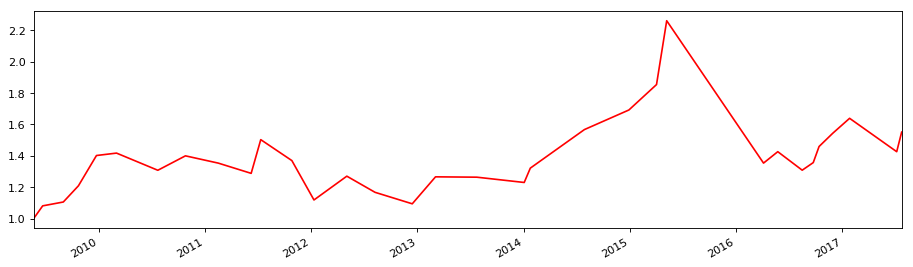

```python
import numpy as np
import pandas as pd
import matplotlib.pyplot as plt
```


```python
stock_data = pd.read_csv('datacsv/002210.csv')
stock_data = stock_data.set_index('date')
stock_data.head()
```


<div>
<table border="1" class="dataframe">
  <thead>
    <tr style="text-align: right;">
      <th></th>
      <th>open</th>
      <th>high</th>
      <th>low</th>
      <th>close</th>
      <th>volume</th>
    </tr>
    <tr>
      <th>date</th>
      <th></th>
      <th></th>
      <th></th>
      <th></th>
      <th></th>
    </tr>
  </thead>
  <tbody>
    <tr>
      <th>2008-1-30</th>
      <td>2.45</td>
      <td>2.62</td>
      <td>2.34</td>
      <td>2.62</td>
      <td>22961270</td>
    </tr>
    <tr>
      <th>2008-1-31</th>
      <td>2.57</td>
      <td>2.71</td>
      <td>2.47</td>
      <td>2.51</td>
      <td>12938149</td>
    </tr>
    <tr>
      <th>2008-2-1</th>
      <td>2.43</td>
      <td>2.43</td>
      <td>2.23</td>
      <td>2.23</td>
      <td>7567562</td>
    </tr>
    <tr>
      <th>2008-2-4</th>
      <td>2.39</td>
      <td>2.45</td>
      <td>2.30</td>
      <td>2.39</td>
      <td>5167033</td>
    </tr>
    <tr>
      <th>2008-2-5</th>
      <td>2.34</td>
      <td>2.49</td>
      <td>2.19</td>
      <td>2.42</td>
      <td>4548010</td>
    </tr>
  </tbody>
</table>
</div>


```python
# 计算风险率指标
import Risk_Ratio_Functions
```


```python
Risk_Ratio = Risk_Ratio_Functions.Risk_Ratio(stock_data)
Risk_Ratio.tail()
```


<div>
<table border="1" class="dataframe">
  <thead>
    <tr style="text-align: right;">
      <th></th>
      <th>close</th>
      <th>Decision</th>
      <th>MAJCQX</th>
    </tr>
    <tr>
      <th>date</th>
      <th></th>
      <th></th>
      <th></th>
    </tr>
  </thead>
  <tbody>
    <tr>
      <th>2017-07-27</th>
      <td>11.13</td>
      <td>74.8</td>
      <td>70.720000</td>
    </tr>
    <tr>
      <th>2017-07-28</th>
      <td>10.95</td>
      <td>65.28</td>
      <td>68.000000</td>
    </tr>
    <tr>
      <th>2017-07-31</th>
      <td>10.97</td>
      <td>62.56</td>
      <td>67.546667</td>
    </tr>
    <tr>
      <th>2017-08-01</th>
      <td>10.90</td>
      <td>62.56</td>
      <td>63.466667</td>
    </tr>
    <tr>
      <th>2017-08-02</th>
      <td>11.04</td>
      <td>59.84</td>
      <td>61.653333</td>
    </tr>
  </tbody>
</table>
</div>


```python
Risk_Ratio_Time = Risk_Ratio[Risk_Ratio.index >= pd.to_datetime('20090101')]
Risk_Ratio_Time = Risk_Ratio_Time[Risk_Ratio_Time.index <= pd.to_datetime('20170802')]
```


```python
Risk_Ratio_Time.head()
```


<div>
<table border="1" class="dataframe">
  <thead>
    <tr style="text-align: right;">
      <th></th>
      <th>close</th>
      <th>Decision</th>
      <th>MAJCQX</th>
    </tr>
    <tr>
      <th>date</th>
      <th></th>
      <th></th>
      <th></th>
    </tr>
  </thead>
  <tbody>
    <tr>
      <th>2009-01-05</th>
      <td>0.67</td>
      <td>65.28</td>
      <td>53.493333</td>
    </tr>
    <tr>
      <th>2009-01-06</th>
      <td>0.68</td>
      <td>68</td>
      <td>62.106667</td>
    </tr>
    <tr>
      <th>2009-01-07</th>
      <td>0.69</td>
      <td>73.44</td>
      <td>68.906667</td>
    </tr>
    <tr>
      <th>2009-01-08</th>
      <td>0.70</td>
      <td>68</td>
      <td>69.813333</td>
    </tr>
    <tr>
      <th>2009-01-09</th>
      <td>0.73</td>
      <td>76.16</td>
      <td>72.533333</td>
    </tr>
  </tbody>
</table>
</div>


```python
import Profit_Functions
```


```python
FirstDF = Risk_Ratio_Time.loc[:,Risk_Ratio_Time.columns]
buy_compare1 = 70
buy_compare2 = Risk_Ratio_Time.loc[:,'Decision']
sell_compare1 = 30
sell_compare2 = Risk_Ratio_Time.loc[:,'Decision']
```


```python
SPD = Profit_Functions.Strategy_Point_risk(FirstDF,buy_compare1,buy_compare2,sell_compare1,sell_compare2)
SPD.head()
```


<div>
<table border="1" class="dataframe">
  <thead>
    <tr style="text-align: right;">
      <th></th>
      <th>close</th>
      <th>Decision</th>
      <th>MAJCQX</th>
      <th>Points</th>
      <th>order</th>
      <th>BS_point</th>
    </tr>
    <tr>
      <th>date</th>
      <th></th>
      <th></th>
      <th></th>
      <th></th>
      <th></th>
      <th></th>
    </tr>
  </thead>
  <tbody>
    <tr>
      <th>2009-01-05</th>
      <td>0.67</td>
      <td>65.28</td>
      <td>53.493333</td>
      <td>0.0</td>
      <td>0</td>
      <td>-1.0</td>
    </tr>
    <tr>
      <th>2009-01-06</th>
      <td>0.68</td>
      <td>68</td>
      <td>62.106667</td>
      <td>0.0</td>
      <td>1</td>
      <td>-1.0</td>
    </tr>
    <tr>
      <th>2009-01-07</th>
      <td>0.69</td>
      <td>73.44</td>
      <td>68.906667</td>
      <td>-1.0</td>
      <td>2</td>
      <td>-1.0</td>
    </tr>
    <tr>
      <th>2009-01-08</th>
      <td>0.70</td>
      <td>68</td>
      <td>69.813333</td>
      <td>0.0</td>
      <td>3</td>
      <td>-1.0</td>
    </tr>
    <tr>
      <th>2009-01-09</th>
      <td>0.73</td>
      <td>76.16</td>
      <td>72.533333</td>
      <td>-1.0</td>
      <td>4</td>
      <td>-1.0</td>
    </tr>
  </tbody>
</table>
</div>


```python
SPD_Time = SPD[SPD.index >= pd.to_datetime('20170712')]
SPD_Time = SPD_Time[SPD_Time.index <= pd.to_datetime('20170727')]
SPD_Time
```


<div>
<table border="1" class="dataframe">
  <thead>
    <tr style="text-align: right;">
      <th></th>
      <th>close</th>
      <th>Decision</th>
      <th>MAJCQX</th>
      <th>Points</th>
      <th>order</th>
      <th>BS_point</th>
    </tr>
    <tr>
      <th>date</th>
      <th></th>
      <th></th>
      <th></th>
      <th></th>
      <th></th>
      <th></th>
    </tr>
  </thead>
  <tbody>
    <tr>
      <th>2017-07-12</th>
      <td>10.38</td>
      <td>62.56</td>
      <td>61.653333</td>
      <td>0.0</td>
      <td>1948</td>
      <td>-1.0</td>
    </tr>
    <tr>
      <th>2017-07-13</th>
      <td>10.53</td>
      <td>69.36</td>
      <td>63.920000</td>
      <td>0.0</td>
      <td>1949</td>
      <td>-1.0</td>
    </tr>
    <tr>
      <th>2017-07-14</th>
      <td>10.46</td>
      <td>59.84</td>
      <td>63.920000</td>
      <td>0.0</td>
      <td>1950</td>
      <td>-1.0</td>
    </tr>
    <tr>
      <th>2017-07-17</th>
      <td>9.98</td>
      <td>24.48</td>
      <td>51.226667</td>
      <td>1.0</td>
      <td>1951</td>
      <td>2.0</td>
    </tr>
    <tr>
      <th>2017-07-18</th>
      <td>10.03</td>
      <td>31.28</td>
      <td>38.533333</td>
      <td>0.0</td>
      <td>1952</td>
      <td>1.0</td>
    </tr>
    <tr>
      <th>2017-07-19</th>
      <td>9.94</td>
      <td>32.64</td>
      <td>29.466667</td>
      <td>0.0</td>
      <td>1953</td>
      <td>1.0</td>
    </tr>
    <tr>
      <th>2017-07-20</th>
      <td>10.03</td>
      <td>39.44</td>
      <td>34.453333</td>
      <td>0.0</td>
      <td>1954</td>
      <td>1.0</td>
    </tr>
    <tr>
      <th>2017-07-21</th>
      <td>10.50</td>
      <td>66.64</td>
      <td>46.240000</td>
      <td>0.0</td>
      <td>1955</td>
      <td>1.0</td>
    </tr>
    <tr>
      <th>2017-07-24</th>
      <td>10.89</td>
      <td>73.44</td>
      <td>59.840000</td>
      <td>-1.0</td>
      <td>1956</td>
      <td>-2.0</td>
    </tr>
    <tr>
      <th>2017-07-25</th>
      <td>10.92</td>
      <td>73.44</td>
      <td>71.173333</td>
      <td>-1.0</td>
      <td>1957</td>
      <td>-1.0</td>
    </tr>
    <tr>
      <th>2017-07-26</th>
      <td>10.79</td>
      <td>63.92</td>
      <td>70.266667</td>
      <td>0.0</td>
      <td>1958</td>
      <td>-1.0</td>
    </tr>
    <tr>
      <th>2017-07-27</th>
      <td>11.13</td>
      <td>74.8</td>
      <td>70.720000</td>
      <td>-1.0</td>
      <td>1959</td>
      <td>-1.0</td>
    </tr>
  </tbody>
</table>
</div>


```python
Buy = 'close'
Sell = 'close'
cash = 10000
brokerage = 2.5
```


```python
SPf = Profit_Functions.Strategy_Profit(SPD,Buy,Sell,cash,brokerage)
SPf
```


<div>
<style>
    .dataframe thead tr:only-child th {
        text-align: right;
    }

    .dataframe thead th {
        text-align: left;
    }

    .dataframe tbody tr th {
        vertical-align: top;
    }
</style>
<table border="1" class="dataframe">
  <thead>
    <tr style="text-align: right;">
      <th></th>
      <th>Start_date</th>
      <th>End_date</th>
      <th>Buy_price</th>
      <th>Sell_price</th>
      <th>Startcash</th>
      <th>Shares</th>
      <th>Price</th>
      <th>Buy_Brokerage</th>
      <th>Surplus</th>
      <th>AlphaCat</th>
      <th>Sell_Brokerage</th>
      <th>Tax</th>
      <th>Endcash</th>
      <th>Profit_real</th>
    </tr>
  </thead>
  <tbody>
    <tr>
      <th>0</th>
      <td>2009-05-22</td>
      <td>2009-06-22</td>
      <td>1.20</td>
      <td>1.30</td>
      <td>10000.000</td>
      <td>8300.0</td>
      <td>9960.0</td>
      <td>5.000</td>
      <td>35.000</td>
      <td>10790.0</td>
      <td>5.000</td>
      <td>10.790</td>
      <td>10809.210</td>
      <td>1.080921</td>
    </tr>
    <tr>
      <th>1</th>
      <td>2009-08-12</td>
      <td>2009-09-01</td>
      <td>1.21</td>
      <td>1.24</td>
      <td>10809.210</td>
      <td>8900.0</td>
      <td>10769.0</td>
      <td>5.000</td>
      <td>35.210</td>
      <td>11036.0</td>
      <td>5.000</td>
      <td>11.036</td>
      <td>11055.174</td>
      <td>1.105517</td>
    </tr>
    <tr>
      <th>2</th>
      <td>2009-09-25</td>
      <td>2009-10-23</td>
      <td>1.15</td>
      <td>1.26</td>
      <td>11055.174</td>
      <td>9600.0</td>
      <td>11040.0</td>
      <td>5.000</td>
      <td>10.174</td>
      <td>12096.0</td>
      <td>5.000</td>
      <td>12.096</td>
      <td>12089.078</td>
      <td>1.208908</td>
    </tr>
    <tr>
      <th>3</th>
      <td>2009-12-18</td>
      <td>2009-12-24</td>
      <td>1.41</td>
      <td>1.64</td>
      <td>12089.078</td>
      <td>8500.0</td>
      <td>11985.0</td>
      <td>5.000</td>
      <td>99.078</td>
      <td>13940.0</td>
      <td>5.000</td>
      <td>13.940</td>
      <td>14020.138</td>
      <td>1.402014</td>
    </tr>
    <tr>
      <th>4</th>
      <td>2010-01-22</td>
      <td>2010-03-03</td>
      <td>1.57</td>
      <td>1.59</td>
      <td>14020.138</td>
      <td>8900.0</td>
      <td>13973.0</td>
      <td>5.000</td>
      <td>42.138</td>
      <td>14151.0</td>
      <td>5.000</td>
      <td>14.151</td>
      <td>14173.987</td>
      <td>1.417399</td>
    </tr>
    <tr>
      <th>5</th>
      <td>2010-04-30</td>
      <td>2010-07-23</td>
      <td>2.10</td>
      <td>1.94</td>
      <td>14173.987</td>
      <td>6700.0</td>
      <td>14070.0</td>
      <td>5.000</td>
      <td>98.987</td>
      <td>12998.0</td>
      <td>5.000</td>
      <td>12.998</td>
      <td>13078.989</td>
      <td>1.307899</td>
    </tr>
    <tr>
      <th>6</th>
      <td>2010-09-21</td>
      <td>2010-10-26</td>
      <td>2.18</td>
      <td>2.34</td>
      <td>13078.989</td>
      <td>5900.0</td>
      <td>12862.0</td>
      <td>5.000</td>
      <td>211.989</td>
      <td>13806.0</td>
      <td>5.000</td>
      <td>13.806</td>
      <td>13999.183</td>
      <td>1.399918</td>
    </tr>
    <tr>
      <th>7</th>
      <td>2010-11-12</td>
      <td>2011-02-16</td>
      <td>2.20</td>
      <td>2.13</td>
      <td>13999.183</td>
      <td>6300.0</td>
      <td>13860.0</td>
      <td>5.000</td>
      <td>134.183</td>
      <td>13419.0</td>
      <td>5.000</td>
      <td>13.419</td>
      <td>13534.764</td>
      <td>1.353476</td>
    </tr>
    <tr>
      <th>8</th>
      <td>2011-03-21</td>
      <td>2011-06-09</td>
      <td>2.13</td>
      <td>2.03</td>
      <td>13534.764</td>
      <td>6300.0</td>
      <td>13419.0</td>
      <td>5.000</td>
      <td>110.764</td>
      <td>12789.0</td>
      <td>5.000</td>
      <td>12.789</td>
      <td>12881.975</td>
      <td>1.288197</td>
    </tr>
    <tr>
      <th>9</th>
      <td>2011-06-17</td>
      <td>2011-07-12</td>
      <td>1.70</td>
      <td>1.99</td>
      <td>12881.975</td>
      <td>7500.0</td>
      <td>12750.0</td>
      <td>5.000</td>
      <td>126.975</td>
      <td>14925.0</td>
      <td>5.000</td>
      <td>14.925</td>
      <td>15032.050</td>
      <td>1.503205</td>
    </tr>
    <tr>
      <th>10</th>
      <td>2011-07-25</td>
      <td>2011-10-27</td>
      <td>1.83</td>
      <td>1.67</td>
      <td>15032.050</td>
      <td>8200.0</td>
      <td>15006.0</td>
      <td>5.000</td>
      <td>21.050</td>
      <td>13694.0</td>
      <td>5.000</td>
      <td>13.694</td>
      <td>13696.356</td>
      <td>1.369636</td>
    </tr>
    <tr>
      <th>11</th>
      <td>2011-11-18</td>
      <td>2012-01-11</td>
      <td>1.64</td>
      <td>1.34</td>
      <td>13696.356</td>
      <td>8300.0</td>
      <td>13612.0</td>
      <td>5.000</td>
      <td>79.356</td>
      <td>11122.0</td>
      <td>5.000</td>
      <td>11.122</td>
      <td>11185.234</td>
      <td>1.118523</td>
    </tr>
    <tr>
      <th>12</th>
      <td>2012-03-15</td>
      <td>2012-05-03</td>
      <td>1.45</td>
      <td>1.65</td>
      <td>11185.234</td>
      <td>7700.0</td>
      <td>11165.0</td>
      <td>5.000</td>
      <td>15.234</td>
      <td>12705.0</td>
      <td>5.000</td>
      <td>12.705</td>
      <td>12702.529</td>
      <td>1.270253</td>
    </tr>
    <tr>
      <th>13</th>
      <td>2012-06-04</td>
      <td>2012-08-08</td>
      <td>1.51</td>
      <td>1.39</td>
      <td>12702.529</td>
      <td>8400.0</td>
      <td>12684.0</td>
      <td>5.000</td>
      <td>13.529</td>
      <td>11676.0</td>
      <td>5.000</td>
      <td>11.676</td>
      <td>11672.853</td>
      <td>1.167285</td>
    </tr>
    <tr>
      <th>14</th>
      <td>2012-08-27</td>
      <td>2012-12-14</td>
      <td>1.30</td>
      <td>1.22</td>
      <td>11672.853</td>
      <td>8900.0</td>
      <td>11570.0</td>
      <td>5.000</td>
      <td>97.853</td>
      <td>10858.0</td>
      <td>5.000</td>
      <td>10.858</td>
      <td>10939.995</td>
      <td>1.093999</td>
    </tr>
    <tr>
      <th>15</th>
      <td>2013-01-25</td>
      <td>2013-03-04</td>
      <td>1.31</td>
      <td>1.52</td>
      <td>10939.995</td>
      <td>8300.0</td>
      <td>10873.0</td>
      <td>5.000</td>
      <td>61.995</td>
      <td>12616.0</td>
      <td>5.000</td>
      <td>12.616</td>
      <td>12660.379</td>
      <td>1.266038</td>
    </tr>
    <tr>
      <th>16</th>
      <td>2013-06-07</td>
      <td>2013-07-24</td>
      <td>1.67</td>
      <td>1.67</td>
      <td>12660.379</td>
      <td>7500.0</td>
      <td>12525.0</td>
      <td>5.000</td>
      <td>130.379</td>
      <td>12525.0</td>
      <td>5.000</td>
      <td>12.525</td>
      <td>12637.854</td>
      <td>1.263785</td>
    </tr>
    <tr>
      <th>17</th>
      <td>2013-09-27</td>
      <td>2014-01-03</td>
      <td>1.99</td>
      <td>1.94</td>
      <td>12637.854</td>
      <td>6300.0</td>
      <td>12537.0</td>
      <td>5.000</td>
      <td>95.854</td>
      <td>12222.0</td>
      <td>5.000</td>
      <td>12.222</td>
      <td>12300.632</td>
      <td>1.230063</td>
    </tr>
    <tr>
      <th>18</th>
      <td>2014-01-08</td>
      <td>2014-01-24</td>
      <td>1.83</td>
      <td>1.97</td>
      <td>12300.632</td>
      <td>6700.0</td>
      <td>12261.0</td>
      <td>5.000</td>
      <td>34.632</td>
      <td>13199.0</td>
      <td>5.000</td>
      <td>13.199</td>
      <td>13215.433</td>
      <td>1.321543</td>
    </tr>
    <tr>
      <th>19</th>
      <td>2014-06-04</td>
      <td>2014-07-29</td>
      <td>3.63</td>
      <td>4.32</td>
      <td>13215.433</td>
      <td>3600.0</td>
      <td>13068.0</td>
      <td>5.000</td>
      <td>142.433</td>
      <td>15552.0</td>
      <td>5.000</td>
      <td>15.552</td>
      <td>15673.881</td>
      <td>1.567388</td>
    </tr>
    <tr>
      <th>20</th>
      <td>2014-12-05</td>
      <td>2014-12-29</td>
      <td>5.25</td>
      <td>5.69</td>
      <td>15673.881</td>
      <td>2900.0</td>
      <td>15225.0</td>
      <td>5.000</td>
      <td>443.881</td>
      <td>16501.0</td>
      <td>5.000</td>
      <td>16.501</td>
      <td>16923.380</td>
      <td>1.692338</td>
    </tr>
    <tr>
      <th>21</th>
      <td>2015-03-30</td>
      <td>2015-04-03</td>
      <td>7.60</td>
      <td>8.35</td>
      <td>16923.380</td>
      <td>2200.0</td>
      <td>16720.0</td>
      <td>5.000</td>
      <td>198.380</td>
      <td>18370.0</td>
      <td>5.000</td>
      <td>18.370</td>
      <td>18545.010</td>
      <td>1.854501</td>
    </tr>
    <tr>
      <th>22</th>
      <td>2015-04-20</td>
      <td>2015-05-08</td>
      <td>7.70</td>
      <td>9.41</td>
      <td>18545.010</td>
      <td>2400.0</td>
      <td>18480.0</td>
      <td>5.000</td>
      <td>60.010</td>
      <td>22584.0</td>
      <td>5.000</td>
      <td>22.584</td>
      <td>22616.426</td>
      <td>2.261643</td>
    </tr>
    <tr>
      <th>23</th>
      <td>2015-06-23</td>
      <td>2016-04-05</td>
      <td>13.93</td>
      <td>8.27</td>
      <td>22616.426</td>
      <td>1600.0</td>
      <td>22288.0</td>
      <td>5.000</td>
      <td>323.426</td>
      <td>13232.0</td>
      <td>5.646</td>
      <td>13.232</td>
      <td>13536.548</td>
      <td>1.353655</td>
    </tr>
    <tr>
      <th>24</th>
      <td>2016-05-06</td>
      <td>2016-05-24</td>
      <td>8.18</td>
      <td>8.65</td>
      <td>13536.548</td>
      <td>1600.0</td>
      <td>13088.0</td>
      <td>5.572</td>
      <td>442.976</td>
      <td>13840.0</td>
      <td>5.000</td>
      <td>13.840</td>
      <td>14264.136</td>
      <td>1.426414</td>
    </tr>
    <tr>
      <th>25</th>
      <td>2016-07-14</td>
      <td>2016-08-16</td>
      <td>10.77</td>
      <td>9.88</td>
      <td>14264.136</td>
      <td>1300.0</td>
      <td>14001.0</td>
      <td>5.000</td>
      <td>258.136</td>
      <td>12844.0</td>
      <td>5.000</td>
      <td>12.844</td>
      <td>13084.292</td>
      <td>1.308429</td>
    </tr>
    <tr>
      <th>26</th>
      <td>2016-09-01</td>
      <td>2016-09-23</td>
      <td>9.55</td>
      <td>9.94</td>
      <td>13084.292</td>
      <td>1300.0</td>
      <td>12415.0</td>
      <td>5.000</td>
      <td>664.292</td>
      <td>12922.0</td>
      <td>5.000</td>
      <td>12.922</td>
      <td>13568.370</td>
      <td>1.356837</td>
    </tr>
    <tr>
      <th>27</th>
      <td>2016-09-29</td>
      <td>2016-10-13</td>
      <td>9.45</td>
      <td>10.20</td>
      <td>13568.370</td>
      <td>1400.0</td>
      <td>13230.0</td>
      <td>5.000</td>
      <td>333.370</td>
      <td>14280.0</td>
      <td>5.000</td>
      <td>14.280</td>
      <td>14594.090</td>
      <td>1.459409</td>
    </tr>
    <tr>
      <th>28</th>
      <td>2016-11-14</td>
      <td>2016-11-29</td>
      <td>9.69</td>
      <td>10.27</td>
      <td>14594.090</td>
      <td>1500.0</td>
      <td>14535.0</td>
      <td>5.000</td>
      <td>54.090</td>
      <td>15405.0</td>
      <td>5.000</td>
      <td>15.405</td>
      <td>15438.685</td>
      <td>1.543868</td>
    </tr>
    <tr>
      <th>29</th>
      <td>2017-01-25</td>
      <td>2017-01-26</td>
      <td>10.64</td>
      <td>11.34</td>
      <td>15438.685</td>
      <td>1400.0</td>
      <td>14896.0</td>
      <td>5.000</td>
      <td>537.685</td>
      <td>15876.0</td>
      <td>5.000</td>
      <td>15.876</td>
      <td>16392.809</td>
      <td>1.639281</td>
    </tr>
    <tr>
      <th>30</th>
      <td>2017-03-30</td>
      <td>2017-07-07</td>
      <td>12.20</td>
      <td>10.58</td>
      <td>16392.809</td>
      <td>1300.0</td>
      <td>15860.0</td>
      <td>5.000</td>
      <td>527.809</td>
      <td>13754.0</td>
      <td>5.000</td>
      <td>13.754</td>
      <td>14263.055</td>
      <td>1.426305</td>
    </tr>
    <tr>
      <th>31</th>
      <td>2017-07-17</td>
      <td>2017-07-24</td>
      <td>9.98</td>
      <td>10.89</td>
      <td>14263.055</td>
      <td>1400.0</td>
      <td>13972.0</td>
      <td>5.000</td>
      <td>286.055</td>
      <td>15246.0</td>
      <td>5.000</td>
      <td>15.246</td>
      <td>15511.809</td>
      <td>1.551181</td>
    </tr>
  </tbody>
</table>
</div>


```python
plt_W = 14
plt_H = 4
plt_C = 'red'
```


```python
Profit_Functions.Strategy_Profit_plt(SPf,plt_W,plt_H,plt_C)
```




