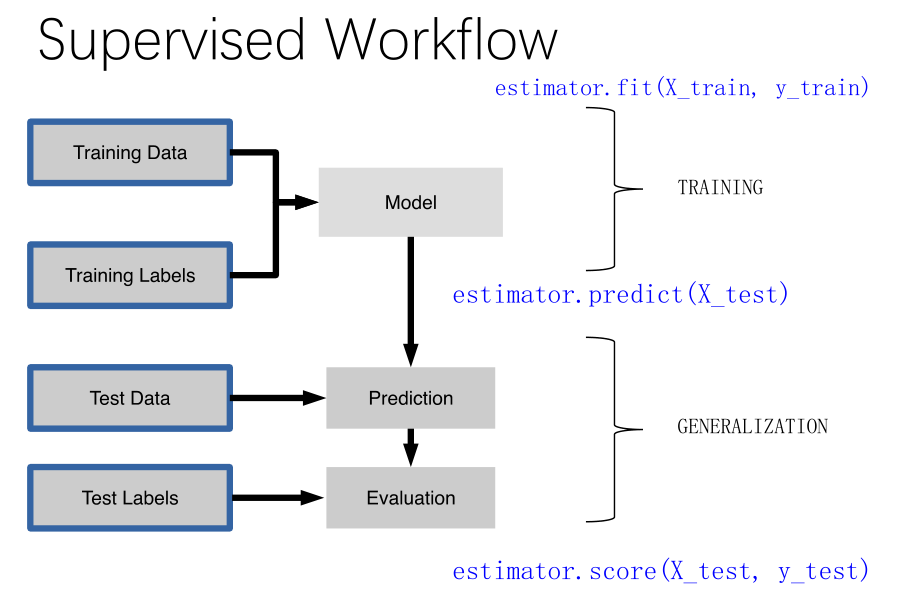

## scikit-learn
### Machine Learning in Python

* [Visualizing the stock market structure](http://scikit-learn.org/stable/auto_examples/applications/plot_stock_market.html#stock-market)

* [2017.11.23_Visualizing_the_stock_market_structure（CB）](https://github.com/bitbyte27/PythonQuant/blob/master/SKLearn/Visualizing%20the%20stock%20market%20structure/2017.11.23_Visualizing_the_stock_market_structure%EF%BC%88CB%EF%BC%89.md)

* [2018.06.13_Feature_SVR_SVM（失败的尝试）](https://github.com/bitbyte27/PythonQuant/blob/master/SKLearn/2018.06.13_Feature_SVR_SVM.ipynb)

* [2018.06.13_classifiers_in_the_iris_dataset](https://github.com/bitbyte27/PythonQuant/blob/master/SKLearn/2018.06.13_classifiers_in_the_iris_dataset.ipynb)
