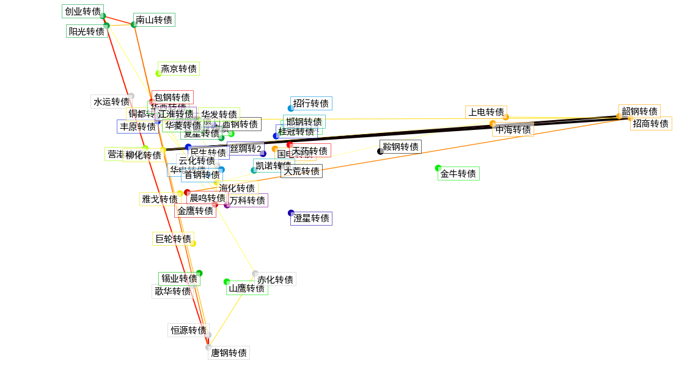
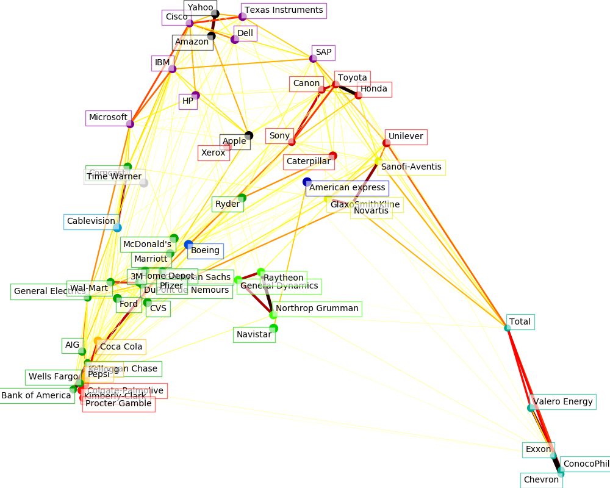
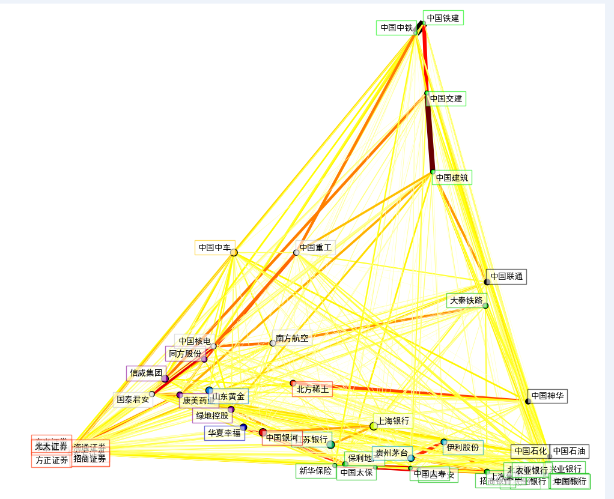
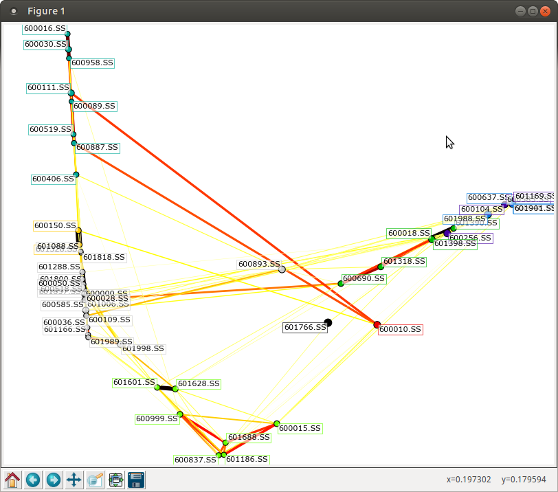

```python
from __future__ import print_function
```


```python
import sys
from datetime import datetime
import numpy as np
import pandas as pd
import matplotlib.pyplot as plt
from matplotlib.collections import LineCollection
```


```python
from six.moves.urllib.request import urlopen
from six.moves.urllib.parse import urlencode
```


```python
from sklearn import cluster, covariance, manifold
```


```python
print(__doc__)
```

    Automatically created module for IPython interactive environment
    


```python
# 历史可转债列表获取，生成数组
CB_Codes = pd.read_csv('../cb/cbcsv/CB_code_OK.csv', encoding='gbk')
CB_Code = ['%d'%i for i in CB_Codes['CB_code']]
```


```python
len(CB_Codes)
```


    72


```python
b =50
CB_Codes = CB_Codes.loc[1:b]
CB_Code = CB_Code[1:b+1]
```


```python
names = CB_Codes.CB_name
```


```python
variation = pd.DataFrame()
```


```python
for code in CB_Code:
    CB = pd.read_csv('../cb/cbcsv/' + code + '.csv')
    CBX = CB.loc[0:200,['close','open']]
    var = CBX['close'] - CBX['open']
    var.name = code
    variation = pd.concat([variation, var], axis=1)
```


```python
variation.tail()
```


<div>


</style>
<table border="1" class="dataframe">
  <thead>
    <tr style="text-align: right;">
      <th></th>
      <th>125898</th>
      <th>100220</th>
      <th>125002</th>
      <th>100087</th>
      <th>126301</th>
      <th>125729</th>
      <th>125629</th>
      <th>100016</th>
      <th>100177</th>
      <th>125930</th>
      <th>...</th>
      <th>128031</th>
      <th>125717</th>
      <th>110078</th>
      <th>125960</th>
      <th>110026</th>
      <th>110567</th>
      <th>110971</th>
      <th>110227</th>
      <th>125709</th>
      <th>110598</th>
    </tr>
  </thead>
  <tbody>
    <tr>
      <th>196</th>
      <td>-1.31</td>
      <td>0.17</td>
      <td>-0.99</td>
      <td>0.01</td>
      <td>0.47</td>
      <td>-0.04</td>
      <td>-2.06</td>
      <td>0.51</td>
      <td>1.10</td>
      <td>0.50</td>
      <td>...</td>
      <td>0.00</td>
      <td>NaN</td>
      <td>-3.51</td>
      <td>-13.91</td>
      <td>NaN</td>
      <td>0.00</td>
      <td>-0.19</td>
      <td>-0.69</td>
      <td>0.15</td>
      <td>-0.50</td>
    </tr>
    <tr>
      <th>197</th>
      <td>0.02</td>
      <td>-0.54</td>
      <td>-4.09</td>
      <td>0.37</td>
      <td>0.14</td>
      <td>-0.11</td>
      <td>-0.82</td>
      <td>5.48</td>
      <td>1.39</td>
      <td>3.00</td>
      <td>...</td>
      <td>3.70</td>
      <td>NaN</td>
      <td>2.38</td>
      <td>0.00</td>
      <td>NaN</td>
      <td>0.16</td>
      <td>-1.76</td>
      <td>0.26</td>
      <td>0.32</td>
      <td>-2.45</td>
    </tr>
    <tr>
      <th>198</th>
      <td>0.70</td>
      <td>0.05</td>
      <td>0.08</td>
      <td>0.19</td>
      <td>0.03</td>
      <td>-0.06</td>
      <td>1.16</td>
      <td>-5.45</td>
      <td>0.02</td>
      <td>0.50</td>
      <td>...</td>
      <td>-3.70</td>
      <td>NaN</td>
      <td>-3.81</td>
      <td>13.87</td>
      <td>NaN</td>
      <td>0.04</td>
      <td>0.00</td>
      <td>0.28</td>
      <td>-0.07</td>
      <td>-0.14</td>
    </tr>
    <tr>
      <th>199</th>
      <td>-2.65</td>
      <td>0.26</td>
      <td>-4.55</td>
      <td>-0.12</td>
      <td>0.23</td>
      <td>-0.07</td>
      <td>1.73</td>
      <td>7.76</td>
      <td>0.85</td>
      <td>2.84</td>
      <td>...</td>
      <td>0.23</td>
      <td>NaN</td>
      <td>-4.73</td>
      <td>4.67</td>
      <td>NaN</td>
      <td>-0.19</td>
      <td>-2.74</td>
      <td>-0.25</td>
      <td>0.49</td>
      <td>-0.97</td>
    </tr>
    <tr>
      <th>200</th>
      <td>-0.03</td>
      <td>-0.21</td>
      <td>-0.03</td>
      <td>-0.08</td>
      <td>0.06</td>
      <td>-0.05</td>
      <td>-1.69</td>
      <td>0.12</td>
      <td>1.15</td>
      <td>0.40</td>
      <td>...</td>
      <td>-0.81</td>
      <td>NaN</td>
      <td>-1.78</td>
      <td>-5.52</td>
      <td>NaN</td>
      <td>-0.03</td>
      <td>-0.03</td>
      <td>0.10</td>
      <td>0.95</td>
      <td>0.57</td>
    </tr>
  </tbody>
</table>
<p>5 rows × 50 columns</p>
</div>


```python
variation.fillna(method='ffill', inplace=True)
```


```python
# Learn a graphical structure from the correlations
edge_model = covariance.GraphLassoCV()
```


```python
# standardize the time series: using correlations rather than covariance
# is more efficient for structure recovery
x = variation/variation.std(0)
```


```python
x.tail()
```


<div>


</style>
<table border="1" class="dataframe">
  <thead>
    <tr style="text-align: right;">
      <th></th>
      <th>125898</th>
      <th>100220</th>
      <th>125002</th>
      <th>100087</th>
      <th>126301</th>
      <th>125729</th>
      <th>125629</th>
      <th>100016</th>
      <th>100177</th>
      <th>125930</th>
      <th>...</th>
      <th>128031</th>
      <th>125717</th>
      <th>110078</th>
      <th>125960</th>
      <th>110026</th>
      <th>110567</th>
      <th>110971</th>
      <th>110227</th>
      <th>125709</th>
      <th>110598</th>
    </tr>
  </thead>
  <tbody>
    <tr>
      <th>196</th>
      <td>-0.602988</td>
      <td>0.405271</td>
      <td>-1.298988</td>
      <td>0.037014</td>
      <td>2.175536</td>
      <td>-0.145371</td>
      <td>-1.849375</td>
      <td>0.302294</td>
      <td>1.232257</td>
      <td>0.884297</td>
      <td>...</td>
      <td>0.000000</td>
      <td>-1.727093</td>
      <td>-1.624481</td>
      <td>-1.638676</td>
      <td>-0.847192</td>
      <td>0.000000</td>
      <td>-0.056756</td>
      <td>-0.280620</td>
      <td>0.067526</td>
      <td>-0.151766</td>
    </tr>
    <tr>
      <th>197</th>
      <td>0.009206</td>
      <td>-1.287330</td>
      <td>-5.366528</td>
      <td>1.369517</td>
      <td>0.648032</td>
      <td>-0.399771</td>
      <td>-0.736159</td>
      <td>3.248177</td>
      <td>1.557125</td>
      <td>5.305780</td>
      <td>...</td>
      <td>0.739194</td>
      <td>-1.727093</td>
      <td>1.101500</td>
      <td>0.000000</td>
      <td>-0.847192</td>
      <td>0.098800</td>
      <td>-0.525741</td>
      <td>0.105741</td>
      <td>0.144055</td>
      <td>-0.743652</td>
    </tr>
    <tr>
      <th>198</th>
      <td>0.322207</td>
      <td>0.119197</td>
      <td>0.104969</td>
      <td>0.703266</td>
      <td>0.138864</td>
      <td>-0.218057</td>
      <td>1.041396</td>
      <td>-3.230395</td>
      <td>0.022405</td>
      <td>0.884297</td>
      <td>...</td>
      <td>-0.739194</td>
      <td>-1.727093</td>
      <td>-1.763325</td>
      <td>1.633964</td>
      <td>-0.847192</td>
      <td>0.024700</td>
      <td>0.000000</td>
      <td>0.113875</td>
      <td>-0.031512</td>
      <td>-0.042494</td>
    </tr>
    <tr>
      <th>199</th>
      <td>-1.219784</td>
      <td>0.619825</td>
      <td>-5.970098</td>
      <td>-0.444168</td>
      <td>1.064624</td>
      <td>-0.254400</td>
      <td>1.553116</td>
      <td>4.599608</td>
      <td>0.952199</td>
      <td>5.022805</td>
      <td>...</td>
      <td>0.045950</td>
      <td>-1.727093</td>
      <td>-2.189115</td>
      <td>0.550152</td>
      <td>-0.847192</td>
      <td>-0.117325</td>
      <td>-0.818484</td>
      <td>-0.101674</td>
      <td>0.220585</td>
      <td>-0.294426</td>
    </tr>
    <tr>
      <th>200</th>
      <td>-0.013809</td>
      <td>-0.500628</td>
      <td>-0.039363</td>
      <td>-0.296112</td>
      <td>0.277728</td>
      <td>-0.181714</td>
      <td>-1.517206</td>
      <td>0.071128</td>
      <td>1.288269</td>
      <td>0.707437</td>
      <td>...</td>
      <td>-0.161824</td>
      <td>-1.727093</td>
      <td>-0.823811</td>
      <td>-0.650287</td>
      <td>-0.847192</td>
      <td>-0.018525</td>
      <td>-0.008962</td>
      <td>0.040670</td>
      <td>0.427665</td>
      <td>0.173013</td>
    </tr>
  </tbody>
</table>
<p>5 rows × 50 columns</p>
</div>


```python
edge_model.fit(x)
```


    GraphLassoCV(alphas=4, assume_centered=False, cv=None, enet_tol=0.0001,
           max_iter=100, mode='cd', n_jobs=1, n_refinements=4, tol=0.0001,
           verbose=False)


```python
# Cluster using affinity propagation
_, labels = cluster.affinity_propagation(edge_model.covariance_)
labels
```


    array([ 0,  6,  1, 14,  2,  9,  8,  3, 10,  3, 10,  4,  8,  3, 11,  0,  8,
           14,  6,  5,  4,  2,  1, 14,  9,  6,  7,  8, 10, 13,  6, 12,  4,  9,
           10,  5, 11, 12, 13, 11, 10, 11,  2,  7, 11,  8, 14, 14, 14,  0], dtype=int64)


```python
n_labels = labels.max()
n_labels
```


    14


```python
for i in range(n_labels + 1):
    print('Cluster %i: %s' % ((i + 1), ', '.join(names[labels == i])))
```

    Cluster 1: 鞍钢转债, 西钢转债, 大荒转债
    Cluster 2: 万科转债, 江淮转债
    Cluster 3: 丝绸转2, 侨城转债, 澄星转债
    Cluster 4: 民生转债, 丰原转债, 桂冠转债
    Cluster 5: 华电转债, 首钢转债, 招行转债
    Cluster 6: 邯钢转债, 凯诺转债
    Cluster 7: 阳光转债, 复星转债, 创业转债, 南山转债
    Cluster 8: 华菱转债, 锡业转债
    Cluster 9: 钢钒转债, 山鹰转债, 华西转债, 金牛转债, 山鹰转债
    Cluster 10: 燕京转债, 营港转债, 华发转债
    Cluster 11: 雅戈转债, 铜都转债, 海化转债, 柳化转债, 巨轮转债
    Cluster 12: 国电转债, 招商转债, 上电转债, 韶钢转债, 中海转债
    Cluster 13: 包钢转债, 天药转债
    Cluster 14: 晨鸣转债, 金鹰转债
    Cluster 15: 水运转债, 云化转债, 歌华转债, 恒源转债, 赤化转债, 唐钢转债
    


```python
# Find a low-dimension embedding for visualization: find the best position of
# the nodes (the stocks) on a 2D plane
```


```python
# We use a dense eigen_solver to achieve reproducibility (arpack is
# initiated with random vectors that we don't control). In addition, we
# use a large number of neighbors to capture the large-scale structure.
node_position_model = manifold.LocallyLinearEmbedding(n_components=2, eigen_solver='dense', n_neighbors=6)
```


```python
embedding = node_position_model.fit_transform(x.T).T
```


```python
font = {'family': 'SimHei',
         'color': 'black',
        'weight': 'normal',
          'size': 18,
    
```


```python
# Visualization
plt.figure(1, facecolor='w', figsize=(15, 8))
plt.clf()
ax = plt.axes([0., 0., 1., 1.])
plt.axis('off')
```


    (0.0, 1.0, 0.0, 1.0)


```python
# Display a graph of the partial correlations
partial_correlations = edge_model.precision_.copy()
d = 1 / np.sqrt(np.diag(partial_correlations))
partial_correlations *= d
partial_correlations *= d[:, np.newaxis]
non_zero = (np.abs(np.triu(partial_correlations, k=1)) > 0.02)
```


```python
# Plot the nodes using the coordinates of our embedding
plt.scatter(embedding[0], embedding[1], s=100 * d ** 2, c=labels,cmap=plt.cm.spectral)
```


    <matplotlib.collections.PathCollection at 0x1e18b860>


```python
# Plot the edges
start_idx, end_idx = np.where(non_zero)
```


```python
# a sequence of (*line0*, *line1*, *line2*), where::
#            linen = (x0, y0), (x1, y1), ... (xm, ym)
segments = [[embedding[:, start], embedding[:, stop]]
            for start, stop in zip(start_idx, end_idx)]
values = np.abs(partial_correlations[non_zero])
lc = LineCollection(segments,
                    zorder=0, cmap=plt.cm.hot_r,
                    norm=plt.Normalize(0, .7 * values.max()))
lc.set_array(values)
lc.set_linewidths(15 * values)
ax.add_collection(lc)
```


    <matplotlib.collections.LineCollection at 0x1e36f6a0>


```python
# Add a label to each node. The challenge here is that we want to
# position the labels to avoid overlap with other labels
for index, (name, label, (x, y)) in enumerate(
        zip(names, labels, embedding.T)):

    dx = x - embedding[0]
    dx[index] = 1
    dy = y - embedding[1]
    dy[index] = 1
    this_dx = dx[np.argmin(np.abs(dy))]
    this_dy = dy[np.argmin(np.abs(dx))]
    if this_dx > 0:
        horizontalalignment = 'left'
        x = x + .002
    else:
        horizontalalignment = 'right'
        x = x - .002
    if this_dy > 0:
        verticalalignment = 'bottom'
        y = y + .002
    else:
        verticalalignment = 'top'
        y = y - .002
    plt.text(x, y, name, fontdict=font, size=15,
             horizontalalignment=horizontalalignment,
             verticalalignment=verticalalignment,
             bbox=dict(facecolor='w',
                       edgecolor=plt.cm.spectral(label / float(n_labels)),
                       alpha=.6))
```


```python
plt.xlim(embedding[0].min() - .15 * embedding[0].ptp(),
         embedding[0].max() + .10 * embedding[0].ptp(),)
plt.ylim(embedding[1].min() - .03 * embedding[1].ptp(),
         embedding[1].max() + .03 * embedding[1].ptp())
```


    (-0.41161460444020065, 0.31054755117148347)


```python
plt.show()
```




```python
# 与下面三个例子的对比
```

### [Visualizing the stock market structure](http://scikit-learn.org/stable/auto_examples/applications/plot_stock_market.html#stock-market)



### [上证50股票数据聚合-简书](http://www.jianshu.com/p/6373df51da19)



### [SkLearn对上证50成分股聚类-CSDN](http://blog.csdn.net/matrix_laboratory/article/details/50738917)


