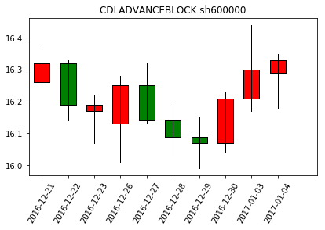

```python
import talib
import numpy as np
import pandas as pd
import Functions
```


```python
# 当列太多时不换行
pd.set_option('expand_frame_repr', False)
# 最多显示行数
pd.set_option('display.max_rows', 10)
```


```python
# 通过pattern_name设定要跑的指标，在此处设定指标名称
pattern_name = 'CDLADVANCEBLOCK'
```


```python
# 导入一只股票的数据，也可以带入指数
code1 = 'sh600000'
df0 = Functions.import_stock_data(code1)
df1 = df0[['交易日期', '股票代码', '开盘价', '最高价', '最低价', '收盘价']]
```


```python
# 选择出现pattern的是时间段
df = df1.iloc[3981:4036]
df.set_index('交易日期', drop=True, inplace=True)
```


```python
# 展示DataFrame中的数据
df
```


<div>
<table border="1" class="dataframe">
  <thead>
    <tr style="text-align: right;">
      <th></th>
      <th>股票代码</th>
      <th>开盘价</th>
      <th>最高价</th>
      <th>最低价</th>
      <th>收盘价</th>
    </tr>
    <tr>
      <th>交易日期</th>
      <th></th>
      <th></th>
      <th></th>
      <th></th>
      <th></th>
    </tr>
  </thead>
  <tbody>
    <tr>
      <th>2016-10-20</th>
      <td>sh600000</td>
      <td>16.27</td>
      <td>16.34</td>
      <td>16.25</td>
      <td>16.29</td>
    </tr>
    <tr>
      <th>2016-10-21</th>
      <td>sh600000</td>
      <td>16.29</td>
      <td>16.34</td>
      <td>16.22</td>
      <td>16.30</td>
    </tr>
    <tr>
      <th>2016-10-24</th>
      <td>sh600000</td>
      <td>16.30</td>
      <td>16.58</td>
      <td>16.27</td>
      <td>16.47</td>
    </tr>
    <tr>
      <th>2016-10-25</th>
      <td>sh600000</td>
      <td>16.48</td>
      <td>16.50</td>
      <td>16.36</td>
      <td>16.42</td>
    </tr>
    <tr>
      <th>2016-10-26</th>
      <td>sh600000</td>
      <td>16.40</td>
      <td>16.42</td>
      <td>16.30</td>
      <td>16.32</td>
    </tr>
    <tr>
      <th>...</th>
      <td>...</td>
      <td>...</td>
      <td>...</td>
      <td>...</td>
      <td>...</td>
    </tr>
    <tr>
      <th>2016-12-29</th>
      <td>sh600000</td>
      <td>16.09</td>
      <td>16.15</td>
      <td>15.99</td>
      <td>16.07</td>
    </tr>
    <tr>
      <th>2016-12-30</th>
      <td>sh600000</td>
      <td>16.07</td>
      <td>16.23</td>
      <td>16.04</td>
      <td>16.21</td>
    </tr>
    <tr>
      <th>2017-01-03</th>
      <td>sh600000</td>
      <td>16.21</td>
      <td>16.44</td>
      <td>16.17</td>
      <td>16.30</td>
    </tr>
    <tr>
      <th>2017-01-04</th>
      <td>sh600000</td>
      <td>16.29</td>
      <td>16.35</td>
      <td>16.18</td>
      <td>16.33</td>
    </tr>
    <tr>
      <th>2017-01-05</th>
      <td>sh600000</td>
      <td>16.30</td>
      <td>16.38</td>
      <td>16.24</td>
      <td>16.30</td>
    </tr>
  </tbody>
</table>
<p>55 rows × 5 columns</p>
</div>


```python
# 赋值开、高、收、低价格，np.array格式。
open_p = df['开盘价'].values
high_p = df['最高价'].values
low_p = df['最低价'].values
close_p = df['收盘价'].values
```


```python
# 展示open_p中的数据
open_p
```


    array([ 16.27,  16.29,  16.3 ,  16.48,  16.4 ,  16.3 ,  16.19,  16.23,
            16.26,  16.21,  16.19,  16.3 ,  16.39,  16.45,  16.47,  16.55,
            16.56,  16.53,  16.59,  16.59,  16.58,  16.59,  16.59,  16.67,
            16.68,  16.93,  16.89,  17.15,  17.21,  17.28,  17.15,  17.1 ,
            16.95,  17.28,  17.17,  17.15,  17.14,  17.34,  17.36,  17.17,
            17.13,  16.7 ,  16.65,  16.52,  16.26,  16.32,  16.17,  16.13,
            16.25,  16.14,  16.09,  16.07,  16.21,  16.29,  16.3 ])


```python
# 调用函数
talib.CDLADVANCEBLOCK(open_p, high_p, low_p, close_p)
```


    array([   0,    0,    0,    0,    0,    0,    0,    0,    0,    0,    0,
              0, -100,    0,    0,    0,    0,    0,    0,    0,    0,    0,
              0,    0,    0,    0,    0,    0,    0,    0,    0,    0,    0,
              0,    0,    0,    0,    0,    0,    0,    0,    0,    0,    0,
              0,    0,    0,    0,    0,    0,    0,    0,    0, -100,    0])


```python
# 计算后复权价，计算指标要用复权价
df0[[i + '_后复权' for i in ['开盘价', '最高价', '最低价', '收盘价']]] = Functions.cal_fuquan_price(df0)
```


```python
df0
```


<div>
<table border="1" class="dataframe">
  <thead>
    <tr style="text-align: right;">
      <th></th>
      <th>交易日期</th>
      <th>股票代码</th>
      <th>开盘价</th>
      <th>最高价</th>
      <th>最低价</th>
      <th>收盘价</th>
      <th>涨跌幅</th>
      <th>成交额</th>
      <th>开盘价_后复权</th>
      <th>最高价_后复权</th>
      <th>最低价_后复权</th>
      <th>收盘价_后复权</th>
    </tr>
  </thead>
  <tbody>
    <tr>
      <th>0</th>
      <td>1999-11-10</td>
      <td>sh600000</td>
      <td>29.50</td>
      <td>29.80</td>
      <td>27.00</td>
      <td>27.75</td>
      <td>1.775000</td>
      <td>4.859102e+09</td>
      <td>29.500000</td>
      <td>29.800000</td>
      <td>27.000000</td>
      <td>27.750000</td>
    </tr>
    <tr>
      <th>1</th>
      <td>1999-11-11</td>
      <td>sh600000</td>
      <td>27.58</td>
      <td>28.38</td>
      <td>27.53</td>
      <td>27.71</td>
      <td>-0.001441</td>
      <td>8.215822e+08</td>
      <td>27.580012</td>
      <td>28.380013</td>
      <td>27.530012</td>
      <td>27.710012</td>
    </tr>
    <tr>
      <th>2</th>
      <td>1999-11-12</td>
      <td>sh600000</td>
      <td>27.86</td>
      <td>28.30</td>
      <td>27.77</td>
      <td>28.05</td>
      <td>0.012270</td>
      <td>4.215916e+08</td>
      <td>27.860014</td>
      <td>28.300014</td>
      <td>27.770014</td>
      <td>28.050014</td>
    </tr>
    <tr>
      <th>3</th>
      <td>1999-11-15</td>
      <td>sh600000</td>
      <td>28.20</td>
      <td>28.25</td>
      <td>27.70</td>
      <td>27.75</td>
      <td>-0.010695</td>
      <td>3.329528e+08</td>
      <td>28.200020</td>
      <td>28.250020</td>
      <td>27.700019</td>
      <td>27.750019</td>
    </tr>
    <tr>
      <th>4</th>
      <td>1999-11-16</td>
      <td>sh600000</td>
      <td>27.88</td>
      <td>27.97</td>
      <td>26.48</td>
      <td>26.55</td>
      <td>-0.043243</td>
      <td>6.289083e+08</td>
      <td>27.880026</td>
      <td>27.970026</td>
      <td>26.480025</td>
      <td>26.550025</td>
    </tr>
    <tr>
      <th>...</th>
      <td>...</td>
      <td>...</td>
      <td>...</td>
      <td>...</td>
      <td>...</td>
      <td>...</td>
      <td>...</td>
      <td>...</td>
      <td>...</td>
      <td>...</td>
      <td>...</td>
      <td>...</td>
    </tr>
    <tr>
      <th>4114</th>
      <td>2017-05-08</td>
      <td>sh600000</td>
      <td>14.78</td>
      <td>14.90</td>
      <td>14.51</td>
      <td>14.86</td>
      <td>-0.004021</td>
      <td>6.387810e+08</td>
      <td>145.404224</td>
      <td>146.584772</td>
      <td>142.747990</td>
      <td>146.191256</td>
    </tr>
    <tr>
      <th>4115</th>
      <td>2017-05-09</td>
      <td>sh600000</td>
      <td>14.69</td>
      <td>14.84</td>
      <td>14.66</td>
      <td>14.76</td>
      <td>-0.006729</td>
      <td>2.838646e+08</td>
      <td>144.518881</td>
      <td>145.994568</td>
      <td>144.223744</td>
      <td>145.207535</td>
    </tr>
    <tr>
      <th>4116</th>
      <td>2017-05-10</td>
      <td>sh600000</td>
      <td>14.76</td>
      <td>14.85</td>
      <td>14.55</td>
      <td>14.61</td>
      <td>-0.010163</td>
      <td>4.182014e+08</td>
      <td>145.207477</td>
      <td>146.092888</td>
      <td>143.141517</td>
      <td>143.731791</td>
    </tr>
    <tr>
      <th>4117</th>
      <td>2017-05-11</td>
      <td>sh600000</td>
      <td>14.57</td>
      <td>14.79</td>
      <td>14.55</td>
      <td>14.75</td>
      <td>0.009582</td>
      <td>4.003139e+08</td>
      <td>143.338207</td>
      <td>145.502545</td>
      <td>143.141449</td>
      <td>145.109029</td>
    </tr>
    <tr>
      <th>4118</th>
      <td>2017-05-12</td>
      <td>sh600000</td>
      <td>14.75</td>
      <td>15.23</td>
      <td>14.73</td>
      <td>15.21</td>
      <td>0.031186</td>
      <td>6.874685e+08</td>
      <td>145.108967</td>
      <td>149.831157</td>
      <td>144.912209</td>
      <td>149.634399</td>
    </tr>
  </tbody>
</table>
<p>4119 rows × 12 columns</p>
</div>


```python
# 计算N天后涨跌幅
for i in [1, 3, 5, 10]:
    df0[str(i)+'天后涨跌幅'] = df0['收盘价_后复权'].shift(-i) / df0['收盘价_后复权'] - 1
```


```python
# 计算技术指标。不同指标此处需要参数可能不同，需要修改。
df0[pattern_name] = getattr(talib, pattern_name)(df0['开盘价_后复权'].values, df0['最高价_后复权'].values,
                                                 df0['最低价_后复权'].values, df0['收盘价_后复权'].values)
```


```python
# 找出符合pattern的日期
pattern_df = df0[df0[pattern_name] != 0]
pattern_df.iloc[:,[0,8,9,10,11,12,13,14,15,16]]
```


<div>
<table border="1" class="dataframe">
  <thead>
    <tr style="text-align: right;">
      <th></th>
      <th>交易日期</th>
      <th>开盘价_后复权</th>
      <th>最高价_后复权</th>
      <th>最低价_后复权</th>
      <th>收盘价_后复权</th>
      <th>1天后涨跌幅</th>
      <th>3天后涨跌幅</th>
      <th>5天后涨跌幅</th>
      <th>10天后涨跌幅</th>
      <th>CDLADVANCEBLOCK</th>
    </tr>
  </thead>
  <tbody>
    <tr>
      <th>280</th>
      <td>2001-01-11</td>
      <td>20.431996</td>
      <td>20.985573</td>
      <td>20.431996</td>
      <td>20.522582</td>
      <td>-0.000981</td>
      <td>-0.014223</td>
      <td>0.007848</td>
      <td>-0.025012</td>
      <td>-100</td>
    </tr>
    <tr>
      <th>759</th>
      <td>2003-01-28</td>
      <td>15.989458</td>
      <td>16.324232</td>
      <td>15.941633</td>
      <td>16.212641</td>
      <td>0.013766</td>
      <td>0.002949</td>
      <td>-0.003934</td>
      <td>-0.021634</td>
      <td>-100</td>
    </tr>
    <tr>
      <th>802</th>
      <td>2003-04-08</td>
      <td>18.045916</td>
      <td>18.412573</td>
      <td>17.870558</td>
      <td>18.125624</td>
      <td>0.029024</td>
      <td>0.044855</td>
      <td>0.095866</td>
      <td>0.067721</td>
      <td>-100</td>
    </tr>
    <tr>
      <th>821</th>
      <td>2003-05-16</td>
      <td>21.425529</td>
      <td>22.142902</td>
      <td>21.170464</td>
      <td>21.584946</td>
      <td>-0.021418</td>
      <td>-0.040620</td>
      <td>0.006647</td>
      <td>-0.010340</td>
      <td>-100</td>
    </tr>
    <tr>
      <th>982</th>
      <td>2004-01-07</td>
      <td>18.326911</td>
      <td>18.937808</td>
      <td>18.262606</td>
      <td>18.584131</td>
      <td>0.006055</td>
      <td>0.033736</td>
      <td>-0.014706</td>
      <td>0.009514</td>
      <td>-100</td>
    </tr>
    <tr>
      <th>...</th>
      <td>...</td>
      <td>...</td>
      <td>...</td>
      <td>...</td>
      <td>...</td>
      <td>...</td>
      <td>...</td>
      <td>...</td>
      <td>...</td>
      <td>...</td>
    </tr>
    <tr>
      <th>3462</th>
      <td>2014-07-16</td>
      <td>74.798732</td>
      <td>75.130802</td>
      <td>74.715715</td>
      <td>74.881750</td>
      <td>-0.003326</td>
      <td>-0.004435</td>
      <td>0.006652</td>
      <td>0.076498</td>
      <td>-100</td>
    </tr>
    <tr>
      <th>3767</th>
      <td>2015-11-06</td>
      <td>152.223249</td>
      <td>157.957686</td>
      <td>152.136363</td>
      <td>155.351124</td>
      <td>0.015101</td>
      <td>-0.008389</td>
      <td>-0.016778</td>
      <td>0.032998</td>
      <td>-100</td>
    </tr>
    <tr>
      <th>3832</th>
      <td>2016-02-15</td>
      <td>156.219829</td>
      <td>160.564096</td>
      <td>154.655893</td>
      <td>160.303440</td>
      <td>-0.080217</td>
      <td>-0.077507</td>
      <td>-0.040651</td>
      <td>-0.039566</td>
      <td>-100</td>
    </tr>
    <tr>
      <th>3993</th>
      <td>2016-11-07</td>
      <td>161.242195</td>
      <td>161.832465</td>
      <td>161.143816</td>
      <td>161.537330</td>
      <td>0.003045</td>
      <td>0.009135</td>
      <td>0.010963</td>
      <td>0.013400</td>
      <td>-100</td>
    </tr>
    <tr>
      <th>4034</th>
      <td>2017-01-04</td>
      <td>160.258762</td>
      <td>160.849034</td>
      <td>159.176598</td>
      <td>160.652277</td>
      <td>-0.001837</td>
      <td>-0.007961</td>
      <td>-0.010410</td>
      <td>0.009185</td>
      <td>-100</td>
    </tr>
  </tbody>
</table>
<p>32 rows × 10 columns</p>
</div>


```python
# 作图
index_num = pattern_df.index[-1]
candle_num = 10
df = df0.iloc[index_num-candle_num+1:index_num+1]
Functions.plot_candle_chart(df, pattern_name + ' ' + code1)
```





```python
print pattern_name + '_' + code1
```

    CDLADVANCEBLOCK_sh600000
    

## 在A股市场效果
遍历A股所有股票（包含退市），考察从上市至2017年1季度，所有出现


```python
code_list = Functions.get_stock_code_list_in_one_dir('../talib_translate/data/input_data/stock_data/') # stock_data,test
```


```python
# 遍历所有股票，并将模式函数下的所有股票信号点合并生产一个CSV数据文件
'''
此过程需要十多分钟……
'''
output = pd.DataFrame()
for code in code_list:
    
    # 导入数据
    df = Functions.import_stock_data(code)

    # 计算后复权价，计算指标要用复权价
    df[[i + '_后复权' for i in ['开盘价', '最高价', '最低价', '收盘价']]] = Functions.cal_fuquan_price(df)

    # 计算N天后涨跌幅
    for i in [1, 3, 5, 10]:
        df[str(i) + '天后涨跌幅'] = df['收盘价_后复权'].shift(-i) / df['收盘价_后复权'] - 1

    # 取2017年1季度之前的数据
    df = df[df['交易日期'] < pd.to_datetime('20170401')]
    if df.empty:
        continue

    # 计算技术指标。不同指标此处需要参数可能不同，需要修改。
    df[pattern_name] = getattr(talib, pattern_name)(df['开盘价_后复权'].values, df['最高价_后复权'].values,
                                                    df['最低价_后复权'].values, df['收盘价_后复权'].values)

    # 去除N天后涨跌幅为空的情况
    for i in [1, 3, 5, 10]:
        df = df[df[str(i)+'天后涨跌幅'].notnull()]

    # 合并数据
    output = output.append(df[df[pattern_name] != 0], ignore_index=True)
```


```python
# 输出数据
output.to_csv(pattern_name + '.csv', index=False)
```


```python
# 读取find_pattern_in_all_stock.py程序运行结果数据
df = pd.read_csv(pattern_name + '.csv')
```


```python
df.iloc[:,[0,8,9,10,11,12,13,14,15,16]]
```


<div>
<table border="1" class="dataframe">
  <thead>
    <tr style="text-align: right;">
      <th></th>
      <th>交易日期</th>
      <th>开盘价_后复权</th>
      <th>最高价_后复权</th>
      <th>最低价_后复权</th>
      <th>收盘价_后复权</th>
      <th>1天后涨跌幅</th>
      <th>3天后涨跌幅</th>
      <th>5天后涨跌幅</th>
      <th>10天后涨跌幅</th>
      <th>CDLADVANCEBLOCK</th>
    </tr>
  </thead>
  <tbody>
    <tr>
      <th>0</th>
      <td>2001-01-11</td>
      <td>20.431996</td>
      <td>20.985573</td>
      <td>20.431996</td>
      <td>20.522582</td>
      <td>-0.000981</td>
      <td>-0.014223</td>
      <td>0.007848</td>
      <td>-0.025012</td>
      <td>-100</td>
    </tr>
    <tr>
      <th>1</th>
      <td>2003-01-28</td>
      <td>15.989458</td>
      <td>16.324232</td>
      <td>15.941633</td>
      <td>16.212641</td>
      <td>0.013766</td>
      <td>0.002949</td>
      <td>-0.003934</td>
      <td>-0.021634</td>
      <td>-100</td>
    </tr>
    <tr>
      <th>2</th>
      <td>2003-04-08</td>
      <td>18.045916</td>
      <td>18.412573</td>
      <td>17.870558</td>
      <td>18.125624</td>
      <td>0.029024</td>
      <td>0.044855</td>
      <td>0.095866</td>
      <td>0.067721</td>
      <td>-100</td>
    </tr>
    <tr>
      <th>3</th>
      <td>2003-05-16</td>
      <td>21.425529</td>
      <td>22.142902</td>
      <td>21.170464</td>
      <td>21.584946</td>
      <td>-0.021418</td>
      <td>-0.040620</td>
      <td>0.006647</td>
      <td>-0.010340</td>
      <td>-100</td>
    </tr>
    <tr>
      <th>4</th>
      <td>2004-01-07</td>
      <td>18.326911</td>
      <td>18.937808</td>
      <td>18.262606</td>
      <td>18.584131</td>
      <td>0.006055</td>
      <td>0.033736</td>
      <td>-0.014706</td>
      <td>0.009514</td>
      <td>-100</td>
    </tr>
    <tr>
      <th>...</th>
      <td>...</td>
      <td>...</td>
      <td>...</td>
      <td>...</td>
      <td>...</td>
      <td>...</td>
      <td>...</td>
      <td>...</td>
      <td>...</td>
      <td>...</td>
    </tr>
    <tr>
      <th>62779</th>
      <td>2017-02-15</td>
      <td>45.479921</td>
      <td>48.899915</td>
      <td>45.309921</td>
      <td>46.239919</td>
      <td>-0.008867</td>
      <td>-0.051038</td>
      <td>-0.039792</td>
      <td>0.006272</td>
      <td>-100</td>
    </tr>
    <tr>
      <th>62780</th>
      <td>2017-02-27</td>
      <td>44.989932</td>
      <td>46.489930</td>
      <td>44.599932</td>
      <td>45.579931</td>
      <td>0.019965</td>
      <td>0.007020</td>
      <td>0.031153</td>
      <td>0.069987</td>
      <td>-100</td>
    </tr>
    <tr>
      <th>62781</th>
      <td>2017-03-08</td>
      <td>55.499984</td>
      <td>57.969983</td>
      <td>55.249984</td>
      <td>56.319984</td>
      <td>-0.020774</td>
      <td>0.010298</td>
      <td>0.159447</td>
      <td>0.186256</td>
      <td>-100</td>
    </tr>
    <tr>
      <th>62782</th>
      <td>2017-03-17</td>
      <td>52.500012</td>
      <td>55.190012</td>
      <td>51.510012</td>
      <td>52.990012</td>
      <td>0.060200</td>
      <td>0.060011</td>
      <td>-0.001699</td>
      <td>-0.171731</td>
      <td>-100</td>
    </tr>
    <tr>
      <th>62783</th>
      <td>2017-03-22</td>
      <td>282.780254</td>
      <td>291.950262</td>
      <td>281.180252</td>
      <td>291.300261</td>
      <td>-0.042911</td>
      <td>-0.041538</td>
      <td>-0.176175</td>
      <td>-0.264984</td>
      <td>-100</td>
    </tr>
  </tbody>
</table>
<p>62784 rows × 10 columns</p>
</div>


```python
# 展现统计结果
df.groupby(pattern_name)[[str(i)+'天后涨跌幅' for i in 1, 3, 5, 10]].describe().stack()
```


<div>
<table border="1" class="dataframe">
  <thead>
    <tr style="text-align: right;">
      <th></th>
      <th></th>
      <th>1天后涨跌幅</th>
      <th>3天后涨跌幅</th>
      <th>5天后涨跌幅</th>
      <th>10天后涨跌幅</th>
    </tr>
    <tr>
      <th>CDLADVANCEBLOCK</th>
      <th></th>
      <th></th>
      <th></th>
      <th></th>
      <th></th>
    </tr>
  </thead>
  <tbody>
    <tr>
      <th rowspan="8" valign="top">-100</th>
      <th>count</th>
      <td>62784.000000</td>
      <td>62784.000000</td>
      <td>62784.000000</td>
      <td>62784.000000</td>
    </tr>
    <tr>
      <th>mean</th>
      <td>0.000119</td>
      <td>0.004523</td>
      <td>0.006442</td>
      <td>0.017072</td>
    </tr>
    <tr>
      <th>std</th>
      <td>0.030498</td>
      <td>0.054688</td>
      <td>0.073876</td>
      <td>0.115896</td>
    </tr>
    <tr>
      <th>min</th>
      <td>-0.275208</td>
      <td>-0.347059</td>
      <td>-0.409694</td>
      <td>-0.571264</td>
    </tr>
    <tr>
      <th>25%</th>
      <td>-0.015102</td>
      <td>-0.024431</td>
      <td>-0.032573</td>
      <td>-0.041165</td>
    </tr>
    <tr>
      <th>50%</th>
      <td>-0.000794</td>
      <td>0.001667</td>
      <td>0.003052</td>
      <td>0.010477</td>
    </tr>
    <tr>
      <th>75%</th>
      <td>0.014002</td>
      <td>0.029456</td>
      <td>0.039598</td>
      <td>0.066041</td>
    </tr>
    <tr>
      <th>max</th>
      <td>0.415842</td>
      <td>0.729107</td>
      <td>4.678090</td>
      <td>8.708289</td>
    </tr>
  </tbody>
</table>
</div>


### 相关文件在此处下载：
* [TALib/PatternRecognition/ipynb](https://github.com/bitbyte27/PythonQuant/tree/master/TALib/PatternRecognition/ipynb)
<br>
### CDLBELTHOLD函数可以参考：
* [Pattern_Recognition_CDLBELTHOLD](http://ooou6mjma.bkt.clouddn.com/Pattern_Recognition_CDLBELTHOLD.html)
<br>
