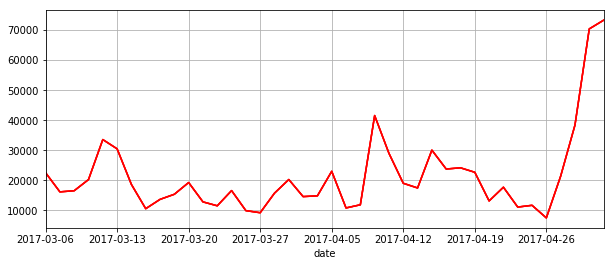

```python
import tushare as ts
```


```python
import matplotlib.pyplot as plt
```


```python
df=ts.get_k_data('600167',end='2017-05-03',start='2017-03-06')
```


```python
df=df.set_index('date')
```


```python
df
```


<div>
<table border="1" class="dataframe">
  <thead>
    <tr style="text-align: right;">
      <th></th>
      <th>open</th>
      <th>close</th>
      <th>high</th>
      <th>low</th>
      <th>volume</th>
      <th>code</th>
    </tr>
    <tr>
      <th>date</th>
      <th></th>
      <th></th>
      <th></th>
      <th></th>
      <th></th>
      <th></th>
    </tr>
  </thead>
  <tbody>
    <tr>
      <th>2017-03-06</th>
      <td>20.95</td>
      <td>21.38</td>
      <td>21.65</td>
      <td>20.95</td>
      <td>22521.0</td>
      <td>600167</td>
    </tr>
    <tr>
      <th>2017-03-07</th>
      <td>21.77</td>
      <td>21.34</td>
      <td>21.77</td>
      <td>21.10</td>
      <td>16147.0</td>
      <td>600167</td>
    </tr>
    <tr>
      <th>2017-03-08</th>
      <td>21.35</td>
      <td>21.40</td>
      <td>21.58</td>
      <td>21.00</td>
      <td>16525.0</td>
      <td>600167</td>
    </tr>
    <tr>
      <th>2017-03-09</th>
      <td>21.45</td>
      <td>21.38</td>
      <td>21.68</td>
      <td>21.15</td>
      <td>20237.0</td>
      <td>600167</td>
    </tr>
    <tr>
      <th>2017-03-10</th>
      <td>21.20</td>
      <td>22.32</td>
      <td>22.37</td>
      <td>21.20</td>
      <td>33558.0</td>
      <td>600167</td>
    </tr>
    <tr>
      <th>2017-03-13</th>
      <td>22.34</td>
      <td>22.82</td>
      <td>22.90</td>
      <td>21.90</td>
      <td>30472.0</td>
      <td>600167</td>
    </tr>
    <tr>
      <th>2017-03-14</th>
      <td>22.74</td>
      <td>22.49</td>
      <td>22.80</td>
      <td>22.29</td>
      <td>18613.0</td>
      <td>600167</td>
    </tr>
    <tr>
      <th>2017-03-15</th>
      <td>22.28</td>
      <td>22.25</td>
      <td>22.53</td>
      <td>22.12</td>
      <td>10547.0</td>
      <td>600167</td>
    </tr>
    <tr>
      <th>2017-03-16</th>
      <td>22.25</td>
      <td>22.29</td>
      <td>22.49</td>
      <td>22.21</td>
      <td>13644.0</td>
      <td>600167</td>
    </tr>
    <tr>
      <th>2017-03-17</th>
      <td>22.55</td>
      <td>22.20</td>
      <td>22.59</td>
      <td>22.01</td>
      <td>15346.0</td>
      <td>600167</td>
    </tr>
    <tr>
      <th>2017-03-20</th>
      <td>22.29</td>
      <td>22.86</td>
      <td>22.99</td>
      <td>22.00</td>
      <td>19254.0</td>
      <td>600167</td>
    </tr>
    <tr>
      <th>2017-03-21</th>
      <td>23.00</td>
      <td>22.78</td>
      <td>23.15</td>
      <td>22.66</td>
      <td>12811.0</td>
      <td>600167</td>
    </tr>
    <tr>
      <th>2017-03-22</th>
      <td>23.10</td>
      <td>22.75</td>
      <td>23.10</td>
      <td>22.38</td>
      <td>11508.0</td>
      <td>600167</td>
    </tr>
    <tr>
      <th>2017-03-23</th>
      <td>22.50</td>
      <td>22.63</td>
      <td>23.34</td>
      <td>22.40</td>
      <td>16571.0</td>
      <td>600167</td>
    </tr>
    <tr>
      <th>2017-03-24</th>
      <td>22.63</td>
      <td>22.76</td>
      <td>22.88</td>
      <td>22.47</td>
      <td>9899.0</td>
      <td>600167</td>
    </tr>
    <tr>
      <th>2017-03-27</th>
      <td>22.78</td>
      <td>22.78</td>
      <td>22.97</td>
      <td>22.58</td>
      <td>9203.0</td>
      <td>600167</td>
    </tr>
    <tr>
      <th>2017-03-28</th>
      <td>22.81</td>
      <td>22.01</td>
      <td>22.81</td>
      <td>21.85</td>
      <td>15716.0</td>
      <td>600167</td>
    </tr>
    <tr>
      <th>2017-03-29</th>
      <td>21.90</td>
      <td>21.90</td>
      <td>22.24</td>
      <td>21.43</td>
      <td>20254.0</td>
      <td>600167</td>
    </tr>
    <tr>
      <th>2017-03-30</th>
      <td>21.64</td>
      <td>21.97</td>
      <td>22.40</td>
      <td>21.64</td>
      <td>14570.0</td>
      <td>600167</td>
    </tr>
    <tr>
      <th>2017-03-31</th>
      <td>21.98</td>
      <td>21.62</td>
      <td>22.24</td>
      <td>21.55</td>
      <td>14829.0</td>
      <td>600167</td>
    </tr>
    <tr>
      <th>2017-04-05</th>
      <td>23.30</td>
      <td>22.19</td>
      <td>23.30</td>
      <td>22.00</td>
      <td>22996.0</td>
      <td>600167</td>
    </tr>
    <tr>
      <th>2017-04-06</th>
      <td>22.23</td>
      <td>22.18</td>
      <td>22.51</td>
      <td>22.11</td>
      <td>10792.0</td>
      <td>600167</td>
    </tr>
    <tr>
      <th>2017-04-07</th>
      <td>21.88</td>
      <td>21.92</td>
      <td>22.18</td>
      <td>21.83</td>
      <td>11848.0</td>
      <td>600167</td>
    </tr>
    <tr>
      <th>2017-04-10</th>
      <td>22.18</td>
      <td>22.86</td>
      <td>23.10</td>
      <td>22.05</td>
      <td>41556.0</td>
      <td>600167</td>
    </tr>
    <tr>
      <th>2017-04-11</th>
      <td>22.86</td>
      <td>22.97</td>
      <td>23.10</td>
      <td>22.51</td>
      <td>28970.0</td>
      <td>600167</td>
    </tr>
    <tr>
      <th>2017-04-12</th>
      <td>22.60</td>
      <td>22.46</td>
      <td>23.00</td>
      <td>22.11</td>
      <td>19007.0</td>
      <td>600167</td>
    </tr>
    <tr>
      <th>2017-04-13</th>
      <td>22.20</td>
      <td>22.62</td>
      <td>22.80</td>
      <td>22.20</td>
      <td>17444.0</td>
      <td>600167</td>
    </tr>
    <tr>
      <th>2017-04-14</th>
      <td>23.10</td>
      <td>22.36</td>
      <td>23.39</td>
      <td>22.25</td>
      <td>30042.0</td>
      <td>600167</td>
    </tr>
    <tr>
      <th>2017-04-17</th>
      <td>22.36</td>
      <td>21.51</td>
      <td>22.36</td>
      <td>21.03</td>
      <td>23753.0</td>
      <td>600167</td>
    </tr>
    <tr>
      <th>2017-04-18</th>
      <td>21.50</td>
      <td>21.56</td>
      <td>22.25</td>
      <td>21.09</td>
      <td>24155.0</td>
      <td>600167</td>
    </tr>
    <tr>
      <th>2017-04-19</th>
      <td>21.53</td>
      <td>21.20</td>
      <td>21.79</td>
      <td>20.92</td>
      <td>22669.0</td>
      <td>600167</td>
    </tr>
    <tr>
      <th>2017-04-20</th>
      <td>21.00</td>
      <td>20.98</td>
      <td>21.39</td>
      <td>20.90</td>
      <td>13128.0</td>
      <td>600167</td>
    </tr>
    <tr>
      <th>2017-04-21</th>
      <td>21.90</td>
      <td>21.47</td>
      <td>21.98</td>
      <td>21.07</td>
      <td>17696.0</td>
      <td>600167</td>
    </tr>
    <tr>
      <th>2017-04-24</th>
      <td>21.11</td>
      <td>21.02</td>
      <td>21.50</td>
      <td>20.94</td>
      <td>11087.0</td>
      <td>600167</td>
    </tr>
    <tr>
      <th>2017-04-25</th>
      <td>21.10</td>
      <td>21.27</td>
      <td>21.57</td>
      <td>21.01</td>
      <td>11672.0</td>
      <td>600167</td>
    </tr>
    <tr>
      <th>2017-04-26</th>
      <td>21.28</td>
      <td>21.33</td>
      <td>21.49</td>
      <td>21.22</td>
      <td>7474.0</td>
      <td>600167</td>
    </tr>
    <tr>
      <th>2017-04-27</th>
      <td>21.43</td>
      <td>22.09</td>
      <td>22.30</td>
      <td>21.00</td>
      <td>21372.0</td>
      <td>600167</td>
    </tr>
    <tr>
      <th>2017-04-28</th>
      <td>21.80</td>
      <td>22.83</td>
      <td>22.90</td>
      <td>21.80</td>
      <td>38375.0</td>
      <td>600167</td>
    </tr>
    <tr>
      <th>2017-05-02</th>
      <td>22.87</td>
      <td>23.63</td>
      <td>24.02</td>
      <td>22.78</td>
      <td>70402.0</td>
      <td>600167</td>
    </tr>
    <tr>
      <th>2017-05-03</th>
      <td>23.79</td>
      <td>23.68</td>
      <td>24.88</td>
      <td>23.30</td>
      <td>73282.0</td>
      <td>600167</td>
    </tr>
  </tbody>
</table>
</div>


```python
df.volume.plot(color='r',figsize=(10,4),grid='on')
```


    <matplotlib.axes._subplots.AxesSubplot at 0xcd8ad30>


```python
plt.show()
```




