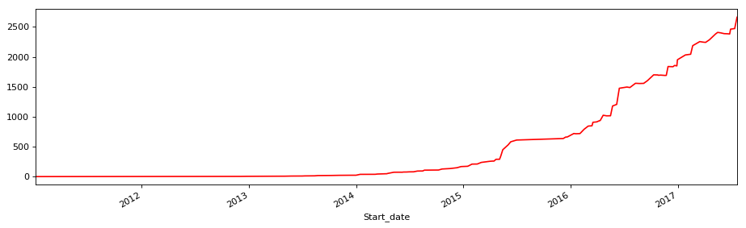

```python
import numpy as np
import pandas as pd
import matplotlib.pyplot as plt
```


```python
stock_data = pd.read_csv('datacsv/002210.csv')
stock_data = stock_data.set_index('date')
stock_data.index = pd.to_datetime(stock_data.index)
stock_data = stock_data.sort_index(axis=0, ascending=True)
```


```python
DA = 6
stadate = '20110101'
enddate = '20170731'
```


```python
LLV_min = stock_data['close'].rolling(window=DA).min()
HHV_max = stock_data['close'].rolling(window=DA).max()
```


```python
HHV_LLV = pd.concat([stock_data['close'], LLV_min, HHV_max], axis=1)
HHV_LLV.columns = ['close','LLV','HHV']
```


```python
HHV_LLV['ABS'] = np.abs(HHV_LLV['HHV']/HHV_LLV['LLV']-1)
HHV_LLV['MAX'] = HHV_LLV['ABS'].rolling(window=DA).max()
```


```python
HHV_LLV['DA'] = DA
HHV_LLV.loc[HHV_LLV['MAX']>0.1,'DA'] = 3
```


```python
HHV_LLV['MM'] = HHV_LLV['close'].rolling(window=DA).mean()
HHV_LLV.loc[HHV_LLV['DA'] == 3,'MM'] = HHV_LLV['close'].rolling(window=3).mean()
HHV_LLV['M1'] = HHV_LLV['MM'].shift(1)
```


```python
HHV_LLV = HHV_LLV[pd.to_datetime(HHV_LLV.index) >= pd.to_datetime(stadate)]
HHV_LLV = HHV_LLV[pd.to_datetime(HHV_LLV.index) <= pd.to_datetime(enddate)]
```


```python
HHV_LLV.tail()
```


<div>
<style>
    .dataframe thead tr:only-child th {
        text-align: right;
    }

    .dataframe thead th {
        text-align: left;
    }

    .dataframe tbody tr th {
        vertical-align: top;
    }
</style>
<table border="1" class="dataframe">
  <thead>
    <tr style="text-align: right;">
      <th></th>
      <th>close</th>
      <th>LLV</th>
      <th>HHV</th>
      <th>ABS</th>
      <th>MAX</th>
      <th>DA</th>
      <th>MM</th>
      <th>M1</th>
    </tr>
    <tr>
      <th>date</th>
      <th></th>
      <th></th>
      <th></th>
      <th></th>
      <th></th>
      <th></th>
      <th></th>
      <th></th>
    </tr>
  </thead>
  <tbody>
    <tr>
      <th>2017-07-25</th>
      <td>10.92</td>
      <td>9.94</td>
      <td>10.92</td>
      <td>0.098592</td>
      <td>0.098592</td>
      <td>6</td>
      <td>10.385000</td>
      <td>10.228333</td>
    </tr>
    <tr>
      <th>2017-07-26</th>
      <td>10.79</td>
      <td>9.94</td>
      <td>10.92</td>
      <td>0.098592</td>
      <td>0.098592</td>
      <td>6</td>
      <td>10.511667</td>
      <td>10.385000</td>
    </tr>
    <tr>
      <th>2017-07-27</th>
      <td>11.13</td>
      <td>10.03</td>
      <td>11.13</td>
      <td>0.109671</td>
      <td>0.109671</td>
      <td>3</td>
      <td>10.946667</td>
      <td>10.511667</td>
    </tr>
    <tr>
      <th>2017-07-28</th>
      <td>10.95</td>
      <td>10.50</td>
      <td>11.13</td>
      <td>0.060000</td>
      <td>0.109671</td>
      <td>3</td>
      <td>10.956667</td>
      <td>10.946667</td>
    </tr>
    <tr>
      <th>2017-07-31</th>
      <td>10.97</td>
      <td>10.79</td>
      <td>11.13</td>
      <td>0.031511</td>
      <td>0.109671</td>
      <td>3</td>
      <td>11.016667</td>
      <td>10.956667</td>
    </tr>
  </tbody>
</table>
</div>


```python
Buy_Point = HHV_LLV.loc[HHV_LLV['close'] > HHV_LLV['M1'],['close','MM','M1']]
Buy_Point.loc[0:,'point'] = 1
Buy_Point.columns = ['Buy_close','Buy_MM','Buy_M1','Buy_point']
```


```python
Sell_Point = HHV_LLV.loc[HHV_LLV['close'] < HHV_LLV['M1'],['close','MM','M1']]
Sell_Point.loc[0:,'point'] = -1
Sell_Point.columns = ['Sell_close','Sell_MM','Sell_M1','Sell_point']
```


```python
Strategy_data = pd.concat([Buy_Point, Sell_Point], axis=1)
Strategy_data = Strategy_data.fillna(0)
Strategy_data['Points'] = Strategy_data['Buy_point']+Strategy_data['Sell_point']
Strategy_point_data = pd.concat([HHV_LLV, Strategy_data['Points']], axis=1)
```


```python
k = len(Strategy_point_data)
Strategy_point_data['order'] = np.arange(0,k,1)
Strategy_point_data.loc[k-1:k,'Points'] = -1
```


```python
Strategy_point_data['BS_point'] = Strategy_point_data['Points'].shift(1)
Strategy_point_data['BS_point'] = Strategy_point_data['BS_point'].fillna(-1)
Strategy_point_data['BS_point'] = (Strategy_point_data['Points'] - Strategy_point_data['BS_point'])/2+Strategy_point_data['Points']
```


```python
BP_price = Strategy_point_data.loc[Strategy_point_data['BS_point'] == 2, ['order','close','M1','BS_point']]
SP_price = Strategy_point_data.loc[Strategy_point_data['BS_point'] == -2, ['order','close','M1','BS_point']]
```


```python
BP_price['startdate'] = BP_price.index
BP_Profit = BP_price[['startdate','close','M1']]
BP_Profit.columns = ['Start_date','Buy_close','Buy_M1']
BP_Profit = BP_Profit.reset_index(drop=True)
```


```python
SP_price['enddate'] = SP_price.index
SP_Profit = SP_price[['enddate','close','M1']]
SP_Profit.columns = ['End_date','Sell_close','Sell_M1']
SP_Profit = SP_Profit.reset_index(drop=True)
```


```python
Strategy_Profit = pd.concat([BP_Profit, SP_Profit], axis=1, join_axes=[BP_Profit.index])
Strategy_Profit = Strategy_Profit[['Start_date','End_date','Buy_close','Sell_close','Buy_M1','Sell_M1']]
```


```python
p = len(Strategy_Profit)
cash = 10000
Strategy_Profit.loc[0:0,'Startcash'] = cash
Startcash = Strategy_Profit['Startcash'][0]
batch = 100
brokerage = 2.5
Strategy_Profit.head()
```


<div>
<style>
    .dataframe thead tr:only-child th {
        text-align: right;
    }

    .dataframe thead th {
        text-align: left;
    }

    .dataframe tbody tr th {
        vertical-align: top;
    }
</style>
<table border="1" class="dataframe">
  <thead>
    <tr style="text-align: right;">
      <th></th>
      <th>Start_date</th>
      <th>End_date</th>
      <th>Buy_close</th>
      <th>Sell_close</th>
      <th>Buy_M1</th>
      <th>Sell_M1</th>
      <th>Startcash</th>
    </tr>
  </thead>
  <tbody>
    <tr>
      <th>0</th>
      <td>2011-01-04</td>
      <td>2011-01-06</td>
      <td>2.33</td>
      <td>2.25</td>
      <td>2.293333</td>
      <td>2.326667</td>
      <td>10000.0</td>
    </tr>
    <tr>
      <th>1</th>
      <td>2011-01-27</td>
      <td>2011-02-22</td>
      <td>1.96</td>
      <td>2.05</td>
      <td>1.933333</td>
      <td>2.118333</td>
      <td>NaN</td>
    </tr>
    <tr>
      <th>2</th>
      <td>2011-02-24</td>
      <td>2011-03-10</td>
      <td>2.12</td>
      <td>2.16</td>
      <td>2.111667</td>
      <td>2.201667</td>
      <td>NaN</td>
    </tr>
    <tr>
      <th>3</th>
      <td>2011-03-14</td>
      <td>2011-03-18</td>
      <td>2.20</td>
      <td>2.20</td>
      <td>2.196667</td>
      <td>2.201667</td>
      <td>NaN</td>
    </tr>
    <tr>
      <th>4</th>
      <td>2011-03-24</td>
      <td>2011-03-31</td>
      <td>2.18</td>
      <td>2.19</td>
      <td>2.166667</td>
      <td>2.203333</td>
      <td>NaN</td>
    </tr>
  </tbody>
</table>
</div>


```python
Strategy_Profit.loc[0:0,'Shares'] = (Startcash/batch)//Strategy_Profit['Buy_M1']*batch
Strategy_Profit.loc[0:0,'Price'] = Strategy_Profit['Buy_M1']*Strategy_Profit['Shares']
bb = Strategy_Profit['Price'][0]*brokerage/10000
if bb > 5:
    Strategy_Profit.loc[0:0,'Buy_Brokerage'] = bb
else:
    Strategy_Profit.loc[0:0,'Buy_Brokerage'] = 5
# ===============================================
Strategy_Profit.loc[0:0,'Surplus'] = Strategy_Profit['Startcash'] - Strategy_Profit['Price'] - Strategy_Profit['Buy_Brokerage']
Strategy_Profit.loc[0:0,'AlphaCat'] = Strategy_Profit['Sell_M1']*Strategy_Profit['Shares']
sb = Strategy_Profit['AlphaCat'][0]*brokerage/10000
if bb > 5:
    Strategy_Profit.loc[0:0,'Sell_Brokerage'] = sb
else:
    Strategy_Profit.loc[0:0,'Sell_Brokerage'] = 5
Strategy_Profit.loc[0:0,'Tax'] = Strategy_Profit['AlphaCat']*1.0/1000
Strategy_Profit.loc[0:0,'Endcash'] = Strategy_Profit['AlphaCat'] + Strategy_Profit['Surplus'] - Strategy_Profit['Sell_Brokerage'] - Strategy_Profit['Tax']
Strategy_Profit.loc[1:1,'Startcash'] = Strategy_Profit['Endcash'][0]

```


```python
for i in range(1,p):
    Strategy_Profit.loc[i:i,'Shares'] = (Strategy_Profit['Startcash']/batch)//Strategy_Profit['Buy_M1']*batch
    Strategy_Profit.loc[i:i,'Price'] = Strategy_Profit['Buy_M1']*Strategy_Profit['Shares']
    bbr = Strategy_Profit['Price']*brokerage/10000
    if bbr[i-1] > 5:
        Strategy_Profit.loc[i:i,'Buy_Brokerage'] = bbr[i-1]
    else:
        Strategy_Profit.loc[i:i,'Buy_Brokerage'] = 5
    Strategy_Profit.loc[i:i,'Surplus'] = Strategy_Profit['Startcash'] - Strategy_Profit['Price'] - Strategy_Profit['Buy_Brokerage']
    Strategy_Profit.loc[i:i,'AlphaCat'] = Strategy_Profit['Sell_M1']*Strategy_Profit['Shares']
    sbr = Strategy_Profit['AlphaCat']*brokerage/10000
    if sbr[i-1] > 5:
        Strategy_Profit.loc[i:i,'Sell_Brokerage'] = sbr[i-1]
    else:
        Strategy_Profit.loc[i:i,'Sell_Brokerage'] = 5
    Strategy_Profit.loc[i:i,'Tax'] = Strategy_Profit['AlphaCat']*1.0/1000
    Strategy_Profit.loc[i:i,'Endcash'] = Strategy_Profit['AlphaCat'] + Strategy_Profit['Surplus'] - Strategy_Profit['Sell_Brokerage'] - Strategy_Profit['Tax']
    Strategy_Profit.loc[i+1:i+1,'Startcash'] = Strategy_Profit['Endcash'][i]
```


```python
Strategy_Profit['Profit_real'] = Strategy_Profit['Endcash']/cash
```


```python
Strategy_Profit_Small = Strategy_Profit[['Start_date','End_date','Buy_M1','Sell_M1','Startcash','Shares','Price','Surplus','AlphaCat','Endcash','Profit_real']]
Strategy_Profit_Small.tail().round(3)
```


<div>
<style>
    .dataframe thead tr:only-child th {
        text-align: right;
    }

    .dataframe thead th {
        text-align: left;
    }

    .dataframe tbody tr th {
        vertical-align: top;
    }
</style>
<table border="1" class="dataframe">
  <thead>
    <tr style="text-align: right;">
      <th></th>
      <th>Start_date</th>
      <th>End_date</th>
      <th>Buy_M1</th>
      <th>Sell_M1</th>
      <th>Startcash</th>
      <th>Shares</th>
      <th>Price</th>
      <th>Surplus</th>
      <th>AlphaCat</th>
      <th>Endcash</th>
      <th>Profit_real</th>
    </tr>
  </thead>
  <tbody>
    <tr>
      <th>196</th>
      <td>2017-06-19</td>
      <td>2017-06-21</td>
      <td>10.063</td>
      <td>10.072</td>
      <td>2.387569e+07</td>
      <td>2372500.0</td>
      <td>2.387526e+07</td>
      <td>-5536.116</td>
      <td>2.389503e+07</td>
      <td>2.385962e+07</td>
      <td>2385.962</td>
    </tr>
    <tr>
      <th>197</th>
      <td>2017-06-26</td>
      <td>2017-06-28</td>
      <td>10.038</td>
      <td>10.040</td>
      <td>2.385962e+07</td>
      <td>2376800.0</td>
      <td>2.385911e+07</td>
      <td>-5459.148</td>
      <td>2.386307e+07</td>
      <td>2.382778e+07</td>
      <td>2382.778</td>
    </tr>
    <tr>
      <th>198</th>
      <td>2017-06-29</td>
      <td>2017-07-11</td>
      <td>10.020</td>
      <td>10.375</td>
      <td>2.382778e+07</td>
      <td>2378000.0</td>
      <td>2.382756e+07</td>
      <td>-5748.755</td>
      <td>2.467175e+07</td>
      <td>2.463536e+07</td>
      <td>2463.536</td>
    </tr>
    <tr>
      <th>199</th>
      <td>2017-07-13</td>
      <td>2017-07-17</td>
      <td>10.402</td>
      <td>10.457</td>
      <td>2.463536e+07</td>
      <td>2368400.0</td>
      <td>2.463531e+07</td>
      <td>-5900.496</td>
      <td>2.476557e+07</td>
      <td>2.472874e+07</td>
      <td>2472.874</td>
    </tr>
    <tr>
      <th>200</th>
      <td>2017-07-21</td>
      <td>2017-07-31</td>
      <td>10.162</td>
      <td>10.957</td>
      <td>2.472874e+07</td>
      <td>2433500.0</td>
      <td>2.472842e+07</td>
      <td>-5839.330</td>
      <td>2.666305e+07</td>
      <td>2.662435e+07</td>
      <td>2662.435</td>
    </tr>
  </tbody>
</table>
</div>


```python
Strategy_Profit_plt = Strategy_Profit[['Start_date','Profit_real']]
Strategy_Profit_plt = Strategy_Profit_plt.set_index('Start_date')
```


```python
plt.figure(2,figsize=(14,4), dpi=80)
ax1 = plt.subplot(111)
```


```python
Strategy_Profit_plt['Profit_real'].plot(color='red', alpha=1)
```


    <matplotlib.axes._subplots.AxesSubplot at 0xc5d1978>


```python
plt.show()
```





```python
Profit = Strategy_Profit_plt.tail(1)['Profit_real'].values
print '策略总收益率：',
print Profit[0].round(3),
print '倍'
```

    策略总收益率： 2662.435 倍
    


```python
StartClose = Strategy_point_data.head(1)['close'].values
EndClose = Strategy_point_data.tail(1)['close'].values
ProfitClose = (EndClose[0] - StartClose[0])/StartClose[0]*100
print '基准收益率：',
print ProfitClose.round(3),
print '％'
```

    基准收益率： 370.815 ％
    


```python
SZ_data = pd.read_csv('datacsv/SZ000000.csv')
SZ_data = SZ_data.set_index('date')
SZ_data.index = pd.to_datetime(SZ_data.index)
SZ_data = SZ_data.sort_index(axis=0, ascending=True)
SZ_data = SZ_data[pd.to_datetime(SZ_data.index) >= pd.to_datetime(stadate)]
SZ_data = SZ_data[pd.to_datetime(SZ_data.index) <= pd.to_datetime(enddate)]
StartSZ = SZ_data.head(1)['close'].values
EndSZ = SZ_data.tail(1)['close'].values
ProfitSZ = (EndSZ[0] - StartSZ[0])/StartSZ[0]*100
print '上证收益率：',
print ProfitSZ.round(3),
print '％'
```

    上证收益率： 14.736 ％
    
