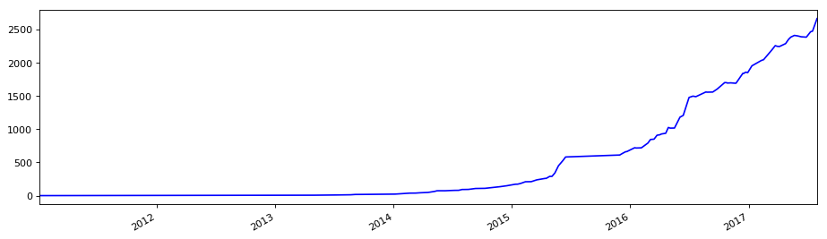

```python
import numpy as np
import pandas as pd
import matplotlib.pyplot as plt
```


```python
stock_data = pd.read_csv('datacsv/002210.csv')
stock_data = stock_data.set_index('date')
stock_data.index = pd.to_datetime(stock_data.index)
stock_data = stock_data.sort_index(axis=0, ascending=True)
```


```python
DA = 6
stadate = '20110101'
enddate = '20170731'
```


```python
LLV_min = stock_data['close'].rolling(window=DA).min()
HHV_max = stock_data['close'].rolling(window=DA).max()
```


```python
HHV_LLV = pd.concat([stock_data['close'], LLV_min, HHV_max], axis=1)
HHV_LLV.columns = ['close','LLV','HHV']
```


```python
HHV_LLV['ABS'] = np.abs(HHV_LLV['HHV']/HHV_LLV['LLV']-1)
HHV_LLV['MAX'] = HHV_LLV['ABS'].rolling(window=DA).max()
```


```python
HHV_LLV['DA'] = DA
HHV_LLV.loc[HHV_LLV['MAX']>0.1,'DA'] = 3
```


```python
HHV_LLV['MM'] = HHV_LLV['close'].rolling(window=DA).mean()
HHV_LLV.loc[HHV_LLV['DA'] == 3,'MM'] = HHV_LLV['close'].rolling(window=3).mean()
HHV_LLV['M1'] = HHV_LLV['MM'].shift(1)
```


```python
HHV_LLV = HHV_LLV[pd.to_datetime(HHV_LLV.index) >= pd.to_datetime(stadate)]
HHV_LLV = HHV_LLV[pd.to_datetime(HHV_LLV.index) <= pd.to_datetime(enddate)]
```


```python
HHV_LLV.tail()
```


<div>
<style>
    .dataframe thead tr:only-child th {
        text-align: right;
    }

    .dataframe thead th {
        text-align: left;
    }

    .dataframe tbody tr th {
        vertical-align: top;
    }
</style>
<table border="1" class="dataframe">
  <thead>
    <tr style="text-align: right;">
      <th></th>
      <th>close</th>
      <th>LLV</th>
      <th>HHV</th>
      <th>ABS</th>
      <th>MAX</th>
      <th>DA</th>
      <th>MM</th>
      <th>M1</th>
    </tr>
    <tr>
      <th>date</th>
      <th></th>
      <th></th>
      <th></th>
      <th></th>
      <th></th>
      <th></th>
      <th></th>
      <th></th>
    </tr>
  </thead>
  <tbody>
    <tr>
      <th>2017-07-25</th>
      <td>10.92</td>
      <td>9.94</td>
      <td>10.92</td>
      <td>0.098592</td>
      <td>0.098592</td>
      <td>6</td>
      <td>10.385000</td>
      <td>10.228333</td>
    </tr>
    <tr>
      <th>2017-07-26</th>
      <td>10.79</td>
      <td>9.94</td>
      <td>10.92</td>
      <td>0.098592</td>
      <td>0.098592</td>
      <td>6</td>
      <td>10.511667</td>
      <td>10.385000</td>
    </tr>
    <tr>
      <th>2017-07-27</th>
      <td>11.13</td>
      <td>10.03</td>
      <td>11.13</td>
      <td>0.109671</td>
      <td>0.109671</td>
      <td>3</td>
      <td>10.946667</td>
      <td>10.511667</td>
    </tr>
    <tr>
      <th>2017-07-28</th>
      <td>10.95</td>
      <td>10.50</td>
      <td>11.13</td>
      <td>0.060000</td>
      <td>0.109671</td>
      <td>3</td>
      <td>10.956667</td>
      <td>10.946667</td>
    </tr>
    <tr>
      <th>2017-07-31</th>
      <td>10.97</td>
      <td>10.79</td>
      <td>11.13</td>
      <td>0.031511</td>
      <td>0.109671</td>
      <td>3</td>
      <td>11.016667</td>
      <td>10.956667</td>
    </tr>
  </tbody>
</table>
</div>


```python
import Profit_Functions
```


```python
FirstDF = HHV_LLV.loc[:,['close','MM','M1']]
buy_compare1 = HHV_LLV.loc[:,'close']
buy_compare2 = HHV_LLV.loc[:,'M1']
sell_compare1 = HHV_LLV.loc[:,'close']
sell_compare2 = HHV_LLV.loc[:,'M1']
```


```python
SPD = Profit_Functions.Strategy_Point_MA(FirstDF,buy_compare1,buy_compare2,sell_compare1,sell_compare2)
SPD.head()
```


<div>
<style>
    .dataframe thead tr:only-child th {
        text-align: right;
    }

    .dataframe thead th {
        text-align: left;
    }

    .dataframe tbody tr th {
        vertical-align: top;
    }
</style>
<table border="1" class="dataframe">
  <thead>
    <tr style="text-align: right;">
      <th></th>
      <th>close</th>
      <th>MM</th>
      <th>M1</th>
      <th>Points</th>
      <th>order</th>
      <th>BS_point</th>
    </tr>
    <tr>
      <th>date</th>
      <th></th>
      <th></th>
      <th></th>
      <th></th>
      <th></th>
      <th></th>
    </tr>
  </thead>
  <tbody>
    <tr>
      <th>2011-01-04</th>
      <td>2.33</td>
      <td>2.320000</td>
      <td>2.293333</td>
      <td>1.0</td>
      <td>0</td>
      <td>2.0</td>
    </tr>
    <tr>
      <th>2011-01-05</th>
      <td>2.33</td>
      <td>2.326667</td>
      <td>2.320000</td>
      <td>1.0</td>
      <td>1</td>
      <td>1.0</td>
    </tr>
    <tr>
      <th>2011-01-06</th>
      <td>2.25</td>
      <td>2.303333</td>
      <td>2.326667</td>
      <td>-1.0</td>
      <td>2</td>
      <td>-2.0</td>
    </tr>
    <tr>
      <th>2011-01-07</th>
      <td>2.28</td>
      <td>2.286667</td>
      <td>2.303333</td>
      <td>-1.0</td>
      <td>3</td>
      <td>-1.0</td>
    </tr>
    <tr>
      <th>2011-01-10</th>
      <td>2.19</td>
      <td>2.283333</td>
      <td>2.286667</td>
      <td>-1.0</td>
      <td>4</td>
      <td>-1.0</td>
    </tr>
  </tbody>
</table>
</div>


```python
Buy = 'M1'
Sell = 'M1'
cash = 10000
brokerage = 2.5
```


```python
SPf = Profit_Functions.Strategy_Profit(SPD,Buy,Sell,cash,brokerage)
SPf.head().round(3)
```


<div>
<style>
    .dataframe thead tr:only-child th {
        text-align: right;
    }

    .dataframe thead th {
        text-align: left;
    }

    .dataframe tbody tr th {
        vertical-align: top;
    }
</style>
<table border="1" class="dataframe">
  <thead>
    <tr style="text-align: right;">
      <th></th>
      <th>Start_date</th>
      <th>End_date</th>
      <th>Buy_price</th>
      <th>Sell_price</th>
      <th>Startcash</th>
      <th>Shares</th>
      <th>Price</th>
      <th>Buy_Brokerage</th>
      <th>Surplus</th>
      <th>AlphaCat</th>
      <th>Sell_Brokerage</th>
      <th>Tax</th>
      <th>Endcash</th>
      <th>Profit_real</th>
    </tr>
  </thead>
  <tbody>
    <tr>
      <th>0</th>
      <td>2011-01-04</td>
      <td>2011-01-06</td>
      <td>2.293</td>
      <td>2.327</td>
      <td>10000.000</td>
      <td>4300.0</td>
      <td>9861.333</td>
      <td>5.0</td>
      <td>133.667</td>
      <td>10004.667</td>
      <td>5.0</td>
      <td>10.005</td>
      <td>10123.329</td>
      <td>1.012</td>
    </tr>
    <tr>
      <th>1</th>
      <td>2011-01-27</td>
      <td>2011-02-22</td>
      <td>1.933</td>
      <td>2.118</td>
      <td>10123.329</td>
      <td>5200.0</td>
      <td>10053.333</td>
      <td>5.0</td>
      <td>64.995</td>
      <td>11015.333</td>
      <td>5.0</td>
      <td>11.015</td>
      <td>11064.313</td>
      <td>1.106</td>
    </tr>
    <tr>
      <th>2</th>
      <td>2011-02-24</td>
      <td>2011-03-10</td>
      <td>2.112</td>
      <td>2.202</td>
      <td>11064.313</td>
      <td>5200.0</td>
      <td>10980.667</td>
      <td>5.0</td>
      <td>78.647</td>
      <td>11448.667</td>
      <td>5.0</td>
      <td>11.449</td>
      <td>11510.865</td>
      <td>1.151</td>
    </tr>
    <tr>
      <th>3</th>
      <td>2011-03-14</td>
      <td>2011-03-18</td>
      <td>2.197</td>
      <td>2.202</td>
      <td>11510.865</td>
      <td>5200.0</td>
      <td>11422.667</td>
      <td>5.0</td>
      <td>83.198</td>
      <td>11448.667</td>
      <td>5.0</td>
      <td>11.449</td>
      <td>11515.416</td>
      <td>1.152</td>
    </tr>
    <tr>
      <th>4</th>
      <td>2011-03-24</td>
      <td>2011-03-31</td>
      <td>2.167</td>
      <td>2.203</td>
      <td>11515.416</td>
      <td>5300.0</td>
      <td>11483.333</td>
      <td>5.0</td>
      <td>27.083</td>
      <td>11677.667</td>
      <td>5.0</td>
      <td>11.678</td>
      <td>11688.072</td>
      <td>1.169</td>
    </tr>
  </tbody>
</table>
</div>


```python
plt_W = 14
plt_H = 4
plt_C = 'blue'
```


```python
Profit_Functions.Strategy_Profit_plt(SPf,plt_W,plt_H,plt_C)
```





### 策略总收益率： 2662.435 倍
### 基准收益率： 370.815 ％
### 上证收益率： 14.736 ％
