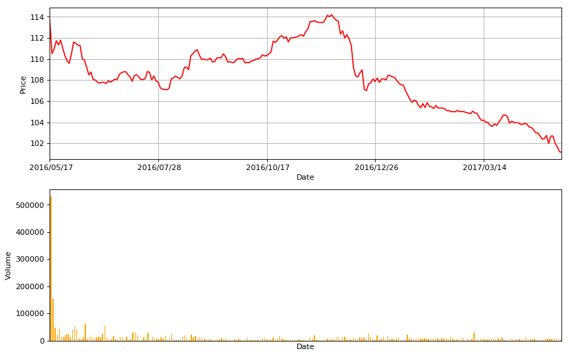
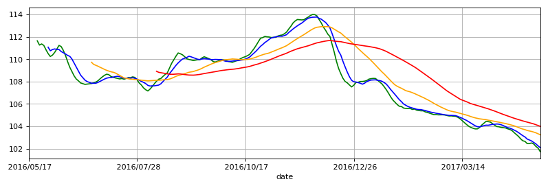

```python
import pandas as pd
```


```python
import matplotlib.pyplot as plt
```


```python
hfzz = pd.read_csv('datacsv/hfzz.csv')
```


```python
hfzz = hfzz.set_index('date') # 设置date列为索引列
```


```python
hfzz1 = hfzz.sort_index(axis=0, ascending=False)
```


```python
hfzz1 # 按时间date列降序：False
```


<div>

<table border="1" class="dataframe">
  <thead>
    <tr style="text-align: right;">
      <th></th>
      <th>open</th>
      <th>high</th>
      <th>low</th>
      <th>close</th>
      <th>volume</th>
      <th>MA5</th>
      <th>MA10</th>
      <th>MA20</th>
      <th>MA60</th>
    </tr>
    <tr>
      <th>date</th>
      <th></th>
      <th></th>
      <th></th>
      <th></th>
      <th></th>
      <th></th>
      <th></th>
      <th></th>
      <th></th>
    </tr>
  </thead>
  <tbody>
    <tr>
      <th>2017/05/08</th>
      <td>101.160</td>
      <td>101.290</td>
      <td>101.103</td>
      <td>101.160</td>
      <td>2268</td>
      <td>101.743</td>
      <td>102.098</td>
      <td>102.767</td>
      <td>104</td>
    </tr>
    <tr>
      <th>2017/05/05</th>
      <td>101.460</td>
      <td>101.797</td>
      <td>101.144</td>
      <td>101.200</td>
      <td>2981</td>
      <td>102.049</td>
      <td>102.252</td>
      <td>102.907</td>
      <td>104.072</td>
    </tr>
    <tr>
      <th>2017/05/04</th>
      <td>101.801</td>
      <td>101.983</td>
      <td>101.501</td>
      <td>101.661</td>
      <td>5678</td>
      <td>102.207</td>
      <td>102.43</td>
      <td>103.044</td>
      <td>104.144</td>
    </tr>
    <tr>
      <th>2017/05/03</th>
      <td>102.696</td>
      <td>102.892</td>
      <td>101.814</td>
      <td>101.999</td>
      <td>5474</td>
      <td>102.423</td>
      <td>102.564</td>
      <td>103.16</td>
      <td>104.214</td>
    </tr>
    <tr>
      <th>2017/05/02</th>
      <td>102.690</td>
      <td>102.900</td>
      <td>102.642</td>
      <td>102.696</td>
      <td>5889</td>
      <td>102.511</td>
      <td>102.694</td>
      <td>103.265</td>
      <td>104.271</td>
    </tr>
    <tr>
      <th>2017/04/28</th>
      <td>102.100</td>
      <td>102.799</td>
      <td>102.000</td>
      <td>102.690</td>
      <td>7205</td>
      <td>102.452</td>
      <td>102.775</td>
      <td>103.325</td>
      <td>104.322</td>
    </tr>
    <tr>
      <th>2017/04/27</th>
      <td>102.504</td>
      <td>102.504</td>
      <td>101.500</td>
      <td>101.990</td>
      <td>7260</td>
      <td>102.454</td>
      <td>102.862</td>
      <td>103.417</td>
      <td>104.367</td>
    </tr>
    <tr>
      <th>2017/04/26</th>
      <td>102.754</td>
      <td>102.754</td>
      <td>102.480</td>
      <td>102.740</td>
      <td>3925</td>
      <td>102.652</td>
      <td>103.043</td>
      <td>103.552</td>
      <td>104.427</td>
    </tr>
    <tr>
      <th>2017/04/25</th>
      <td>102.679</td>
      <td>102.730</td>
      <td>102.304</td>
      <td>102.440</td>
      <td>863</td>
      <td>102.704</td>
      <td>103.159</td>
      <td>103.649</td>
      <td>104.481</td>
    </tr>
    <tr>
      <th>2017/04/24</th>
      <td>102.554</td>
      <td>102.767</td>
      <td>102.100</td>
      <td>102.403</td>
      <td>2896</td>
      <td>102.877</td>
      <td>103.296</td>
      <td>103.741</td>
      <td>104.542</td>
    </tr>
    <tr>
      <th>2017/04/21</th>
      <td>102.890</td>
      <td>102.890</td>
      <td>102.380</td>
      <td>102.699</td>
      <td>2590</td>
      <td>103.098</td>
      <td>103.437</td>
      <td>103.821</td>
      <td>104.6</td>
    </tr>
    <tr>
      <th>2017/04/20</th>
      <td>103.005</td>
      <td>103.278</td>
      <td>102.885</td>
      <td>102.980</td>
      <td>1554</td>
      <td>103.269</td>
      <td>103.562</td>
      <td>103.871</td>
      <td>104.658</td>
    </tr>
    <tr>
      <th>2017/04/19</th>
      <td>103.100</td>
      <td>103.300</td>
      <td>102.950</td>
      <td>103.000</td>
      <td>6478</td>
      <td>103.434</td>
      <td>103.657</td>
      <td>103.914</td>
      <td>104.719</td>
    </tr>
    <tr>
      <th>2017/04/18</th>
      <td>103.779</td>
      <td>103.779</td>
      <td>103.300</td>
      <td>103.301</td>
      <td>3505</td>
      <td>103.614</td>
      <td>103.756</td>
      <td>103.944</td>
      <td>104.785</td>
    </tr>
    <tr>
      <th>2017/04/17</th>
      <td>103.511</td>
      <td>103.691</td>
      <td>103.460</td>
      <td>103.510</td>
      <td>4117</td>
      <td>103.716</td>
      <td>103.836</td>
      <td>103.964</td>
      <td>104.856</td>
    </tr>
    <tr>
      <th>2017/04/14</th>
      <td>103.633</td>
      <td>103.797</td>
      <td>103.500</td>
      <td>103.552</td>
      <td>1088</td>
      <td>103.775</td>
      <td>103.876</td>
      <td>103.988</td>
      <td>104.923</td>
    </tr>
    <tr>
      <th>2017/04/13</th>
      <td>103.970</td>
      <td>103.970</td>
      <td>103.701</td>
      <td>103.810</td>
      <td>12017</td>
      <td>103.854</td>
      <td>103.973</td>
      <td>104.011</td>
      <td>104.992</td>
    </tr>
    <tr>
      <th>2017/04/12</th>
      <td>103.822</td>
      <td>103.900</td>
      <td>103.711</td>
      <td>103.900</td>
      <td>947</td>
      <td>103.88</td>
      <td>104.061</td>
      <td>104.03</td>
      <td>105.061</td>
    </tr>
    <tr>
      <th>2017/04/11</th>
      <td>103.830</td>
      <td>103.830</td>
      <td>103.680</td>
      <td>103.810</td>
      <td>1712</td>
      <td>103.898</td>
      <td>104.138</td>
      <td>104.044</td>
      <td>105.134</td>
    </tr>
    <tr>
      <th>2017/04/10</th>
      <td>103.958</td>
      <td>103.990</td>
      <td>103.801</td>
      <td>103.802</td>
      <td>7414</td>
      <td>103.955</td>
      <td>104.186</td>
      <td>104.076</td>
      <td>105.208</td>
    </tr>
    <tr>
      <th>2017/04/07</th>
      <td>104.040</td>
      <td>105.490</td>
      <td>103.813</td>
      <td>103.950</td>
      <td>2664</td>
      <td>103.976</td>
      <td>104.206</td>
      <td>104.129</td>
      <td>105.285</td>
    </tr>
    <tr>
      <th>2017/04/06</th>
      <td>104.194</td>
      <td>104.194</td>
      <td>103.821</td>
      <td>103.940</td>
      <td>1091</td>
      <td>104.091</td>
      <td>104.181</td>
      <td>104.175</td>
      <td>105.361</td>
    </tr>
    <tr>
      <th>2017/04/05</th>
      <td>104.095</td>
      <td>104.101</td>
      <td>103.822</td>
      <td>103.990</td>
      <td>3575</td>
      <td>104.241</td>
      <td>104.171</td>
      <td>104.231</td>
      <td>105.428</td>
    </tr>
    <tr>
      <th>2017/03/31</th>
      <td>104.290</td>
      <td>104.290</td>
      <td>103.800</td>
      <td>104.095</td>
      <td>6515</td>
      <td>104.377</td>
      <td>104.132</td>
      <td>104.271</td>
      <td>105.497</td>
    </tr>
    <tr>
      <th>2017/03/30</th>
      <td>104.505</td>
      <td>104.622</td>
      <td>103.905</td>
      <td>103.906</td>
      <td>2045</td>
      <td>104.417</td>
      <td>104.093</td>
      <td>104.311</td>
      <td>105.564</td>
    </tr>
    <tr>
      <th>2017/03/29</th>
      <td>104.784</td>
      <td>104.899</td>
      <td>104.526</td>
      <td>104.526</td>
      <td>2214</td>
      <td>104.436</td>
      <td>104.101</td>
      <td>104.361</td>
      <td>105.628</td>
    </tr>
    <tr>
      <th>2017/03/28</th>
      <td>104.671</td>
      <td>104.779</td>
      <td>104.500</td>
      <td>104.690</td>
      <td>1888</td>
      <td>104.27</td>
      <td>104.049</td>
      <td>104.384</td>
      <td>105.689</td>
    </tr>
    <tr>
      <th>2017/03/27</th>
      <td>104.200</td>
      <td>104.699</td>
      <td>104.101</td>
      <td>104.670</td>
      <td>10724</td>
      <td>104.101</td>
      <td>104</td>
      <td>104.401</td>
      <td>105.742</td>
    </tr>
    <tr>
      <th>2017/03/24</th>
      <td>104.002</td>
      <td>104.294</td>
      <td>104.002</td>
      <td>104.293</td>
      <td>2865</td>
      <td>103.887</td>
      <td>103.95</td>
      <td>104.418</td>
      <td>105.8</td>
    </tr>
    <tr>
      <th>2017/03/23</th>
      <td>103.701</td>
      <td>104.499</td>
      <td>103.700</td>
      <td>104.001</td>
      <td>9450</td>
      <td>103.769</td>
      <td>103.967</td>
      <td>104.459</td>
      <td>105.857</td>
    </tr>
    <tr>
      <th>...</th>
      <td>...</td>
      <td>...</td>
      <td>...</td>
      <td>...</td>
      <td>...</td>
      <td>...</td>
      <td>...</td>
      <td>...</td>
      <td>...</td>
    </tr>
    <tr>
      <th>2016/06/29</th>
      <td>107.850</td>
      <td>108.000</td>
      <td>107.722</td>
      <td>107.943</td>
      <td>17021</td>
      <td>107.823</td>
      <td>107.847</td>
      <td>109.05</td>
      <td></td>
    </tr>
    <tr>
      <th>2016/06/28</th>
      <td>107.920</td>
      <td>107.920</td>
      <td>107.600</td>
      <td>107.799</td>
      <td>2895</td>
      <td>107.794</td>
      <td>107.928</td>
      <td>109.133</td>
      <td></td>
    </tr>
    <tr>
      <th>2016/06/27</th>
      <td>107.980</td>
      <td>107.980</td>
      <td>107.604</td>
      <td>107.928</td>
      <td>3649</td>
      <td>107.774</td>
      <td>107.998</td>
      <td>109.233</td>
      <td></td>
    </tr>
    <tr>
      <th>2016/06/24</th>
      <td>107.980</td>
      <td>108.299</td>
      <td>107.500</td>
      <td>107.673</td>
      <td>11020</td>
      <td>107.748</td>
      <td>108.127</td>
      <td>109.352</td>
      <td></td>
    </tr>
    <tr>
      <th>2016/06/23</th>
      <td>107.666</td>
      <td>108.100</td>
      <td>107.326</td>
      <td>107.770</td>
      <td>55944</td>
      <td>107.814</td>
      <td>108.35</td>
      <td>109.519</td>
      <td></td>
    </tr>
    <tr>
      <th>2016/06/22</th>
      <td>107.604</td>
      <td>107.800</td>
      <td>107.430</td>
      <td>107.799</td>
      <td>24904</td>
      <td>107.871</td>
      <td>108.573</td>
      <td>109.72</td>
      <td></td>
    </tr>
    <tr>
      <th>2016/06/21</th>
      <td>107.620</td>
      <td>108.320</td>
      <td>107.610</td>
      <td>107.700</td>
      <td>11318</td>
      <td>108.062</td>
      <td>108.919</td>
      <td>109.896</td>
      <td></td>
    </tr>
    <tr>
      <th>2016/06/20</th>
      <td>107.910</td>
      <td>108.089</td>
      <td>107.600</td>
      <td>107.800</td>
      <td>14974</td>
      <td>108.222</td>
      <td>109.279</td>
      <td>110.098</td>
      <td></td>
    </tr>
    <tr>
      <th>2016/06/17</th>
      <td>108.189</td>
      <td>108.699</td>
      <td>107.850</td>
      <td>108.000</td>
      <td>11236</td>
      <td>108.506</td>
      <td>109.649</td>
      <td>110.256</td>
      <td></td>
    </tr>
    <tr>
      <th>2016/06/16</th>
      <td>108.753</td>
      <td>108.753</td>
      <td>108.000</td>
      <td>108.057</td>
      <td>8119</td>
      <td>108.886</td>
      <td>110.009</td>
      <td>110.381</td>
      <td></td>
    </tr>
    <tr>
      <th>2016/06/15</th>
      <td>108.228</td>
      <td>109.679</td>
      <td>108.117</td>
      <td>108.751</td>
      <td>11071</td>
      <td>109.274</td>
      <td>110.253</td>
      <td>110.662</td>
      <td></td>
    </tr>
    <tr>
      <th>2016/06/14</th>
      <td>109.127</td>
      <td>109.198</td>
      <td>108.227</td>
      <td>108.500</td>
      <td>14674</td>
      <td>109.776</td>
      <td>110.338</td>
      <td></td>
      <td></td>
    </tr>
    <tr>
      <th>2016/06/13</th>
      <td>109.800</td>
      <td>109.990</td>
      <td>109.200</td>
      <td>109.220</td>
      <td>2802</td>
      <td>110.336</td>
      <td>110.468</td>
      <td></td>
      <td></td>
    </tr>
    <tr>
      <th>2016/06/08</th>
      <td>110.000</td>
      <td>110.280</td>
      <td>109.117</td>
      <td>109.900</td>
      <td>61432</td>
      <td>110.792</td>
      <td>110.577</td>
      <td></td>
      <td></td>
    </tr>
    <tr>
      <th>2016/06/07</th>
      <td>111.200</td>
      <td>111.200</td>
      <td>109.801</td>
      <td>110.000</td>
      <td>11138</td>
      <td>111.132</td>
      <td>110.687</td>
      <td></td>
      <td></td>
    </tr>
    <tr>
      <th>2016/06/06</th>
      <td>111.100</td>
      <td>111.860</td>
      <td>111.100</td>
      <td>111.260</td>
      <td>4099</td>
      <td>111.232</td>
      <td>110.866</td>
      <td></td>
      <td></td>
    </tr>
    <tr>
      <th>2016/06/03</th>
      <td>111.200</td>
      <td>111.500</td>
      <td>111.168</td>
      <td>111.300</td>
      <td>7450</td>
      <td>110.9</td>
      <td>110.874</td>
      <td></td>
      <td></td>
    </tr>
    <tr>
      <th>2016/06/02</th>
      <td>112.020</td>
      <td>112.800</td>
      <td>111.200</td>
      <td>111.500</td>
      <td>40898</td>
      <td>110.601</td>
      <td>110.917</td>
      <td></td>
      <td></td>
    </tr>
    <tr>
      <th>2016/06/01</th>
      <td>110.700</td>
      <td>112.800</td>
      <td>110.331</td>
      <td>111.600</td>
      <td>52175</td>
      <td>110.363</td>
      <td>110.862</td>
      <td></td>
      <td></td>
    </tr>
    <tr>
      <th>2016/05/31</th>
      <td>109.699</td>
      <td>110.789</td>
      <td>109.611</td>
      <td>110.500</td>
      <td>38697</td>
      <td>110.243</td>
      <td>110.752</td>
      <td></td>
      <td></td>
    </tr>
    <tr>
      <th>2016/05/30</th>
      <td>109.900</td>
      <td>110.100</td>
      <td>109.553</td>
      <td>109.600</td>
      <td>10749</td>
      <td>110.501</td>
      <td>111.071</td>
      <td></td>
      <td></td>
    </tr>
    <tr>
      <th>2016/05/27</th>
      <td>110.100</td>
      <td>110.590</td>
      <td>109.805</td>
      <td>109.805</td>
      <td>23232</td>
      <td>110.848</td>
      <td></td>
      <td></td>
      <td></td>
    </tr>
    <tr>
      <th>2016/05/26</th>
      <td>110.520</td>
      <td>111.200</td>
      <td>110.120</td>
      <td>110.309</td>
      <td>21064</td>
      <td>111.233</td>
      <td></td>
      <td></td>
      <td></td>
    </tr>
    <tr>
      <th>2016/05/25</th>
      <td>112.330</td>
      <td>112.489</td>
      <td>110.800</td>
      <td>111.000</td>
      <td>14033</td>
      <td>111.362</td>
      <td></td>
      <td></td>
      <td></td>
    </tr>
    <tr>
      <th>2016/05/24</th>
      <td>111.336</td>
      <td>111.790</td>
      <td>111.011</td>
      <td>111.790</td>
      <td>13009</td>
      <td>111.262</td>
      <td></td>
      <td></td>
      <td></td>
    </tr>
    <tr>
      <th>2016/05/23</th>
      <td>111.670</td>
      <td>112.500</td>
      <td>111.120</td>
      <td>111.334</td>
      <td>44931</td>
      <td>111.642</td>
      <td></td>
      <td></td>
      <td></td>
    </tr>
    <tr>
      <th>2016/05/20</th>
      <td>110.890</td>
      <td>111.890</td>
      <td>110.510</td>
      <td>111.734</td>
      <td>22811</td>
      <td></td>
      <td></td>
      <td></td>
      <td></td>
    </tr>
    <tr>
      <th>2016/05/19</th>
      <td>110.500</td>
      <td>112.500</td>
      <td>110.500</td>
      <td>110.950</td>
      <td>47687</td>
      <td></td>
      <td></td>
      <td></td>
      <td></td>
    </tr>
    <tr>
      <th>2016/05/18</th>
      <td>113.611</td>
      <td>113.611</td>
      <td>109.800</td>
      <td>110.500</td>
      <td>153137</td>
      <td></td>
      <td></td>
      <td></td>
      <td></td>
    </tr>
    <tr>
      <th>2016/05/17</th>
      <td>118.390</td>
      <td>118.500</td>
      <td>113.300</td>
      <td>113.690</td>
      <td>530745</td>
      <td></td>
      <td></td>
      <td></td>
      <td></td>
    </tr>
  </tbody>
</table>
<p>237 rows × 9 columns</p>
</div>


```python
hfzz2 = hfzz.sort_index(axis=0, ascending=True)
```


```python
hfzz2 # 按时间date列升序：True
```


<div>

<table border="1" class="dataframe">
  <thead>
    <tr style="text-align: right;">
      <th></th>
      <th>open</th>
      <th>high</th>
      <th>low</th>
      <th>close</th>
      <th>volume</th>
      <th>MA5</th>
      <th>MA10</th>
      <th>MA20</th>
      <th>MA60</th>
    </tr>
    <tr>
      <th>date</th>
      <th></th>
      <th></th>
      <th></th>
      <th></th>
      <th></th>
      <th></th>
      <th></th>
      <th></th>
      <th></th>
    </tr>
  </thead>
  <tbody>
    <tr>
      <th>2016/05/17</th>
      <td>118.390</td>
      <td>118.500</td>
      <td>113.300</td>
      <td>113.690</td>
      <td>530745</td>
      <td></td>
      <td></td>
      <td></td>
      <td></td>
    </tr>
    <tr>
      <th>2016/05/18</th>
      <td>113.611</td>
      <td>113.611</td>
      <td>109.800</td>
      <td>110.500</td>
      <td>153137</td>
      <td></td>
      <td></td>
      <td></td>
      <td></td>
    </tr>
    <tr>
      <th>2016/05/19</th>
      <td>110.500</td>
      <td>112.500</td>
      <td>110.500</td>
      <td>110.950</td>
      <td>47687</td>
      <td></td>
      <td></td>
      <td></td>
      <td></td>
    </tr>
    <tr>
      <th>2016/05/20</th>
      <td>110.890</td>
      <td>111.890</td>
      <td>110.510</td>
      <td>111.734</td>
      <td>22811</td>
      <td></td>
      <td></td>
      <td></td>
      <td></td>
    </tr>
    <tr>
      <th>2016/05/23</th>
      <td>111.670</td>
      <td>112.500</td>
      <td>111.120</td>
      <td>111.334</td>
      <td>44931</td>
      <td>111.642</td>
      <td></td>
      <td></td>
      <td></td>
    </tr>
    <tr>
      <th>2016/05/24</th>
      <td>111.336</td>
      <td>111.790</td>
      <td>111.011</td>
      <td>111.790</td>
      <td>13009</td>
      <td>111.262</td>
      <td></td>
      <td></td>
      <td></td>
    </tr>
    <tr>
      <th>2016/05/25</th>
      <td>112.330</td>
      <td>112.489</td>
      <td>110.800</td>
      <td>111.000</td>
      <td>14033</td>
      <td>111.362</td>
      <td></td>
      <td></td>
      <td></td>
    </tr>
    <tr>
      <th>2016/05/26</th>
      <td>110.520</td>
      <td>111.200</td>
      <td>110.120</td>
      <td>110.309</td>
      <td>21064</td>
      <td>111.233</td>
      <td></td>
      <td></td>
      <td></td>
    </tr>
    <tr>
      <th>2016/05/27</th>
      <td>110.100</td>
      <td>110.590</td>
      <td>109.805</td>
      <td>109.805</td>
      <td>23232</td>
      <td>110.848</td>
      <td></td>
      <td></td>
      <td></td>
    </tr>
    <tr>
      <th>2016/05/30</th>
      <td>109.900</td>
      <td>110.100</td>
      <td>109.553</td>
      <td>109.600</td>
      <td>10749</td>
      <td>110.501</td>
      <td>111.071</td>
      <td></td>
      <td></td>
    </tr>
    <tr>
      <th>2016/05/31</th>
      <td>109.699</td>
      <td>110.789</td>
      <td>109.611</td>
      <td>110.500</td>
      <td>38697</td>
      <td>110.243</td>
      <td>110.752</td>
      <td></td>
      <td></td>
    </tr>
    <tr>
      <th>2016/06/01</th>
      <td>110.700</td>
      <td>112.800</td>
      <td>110.331</td>
      <td>111.600</td>
      <td>52175</td>
      <td>110.363</td>
      <td>110.862</td>
      <td></td>
      <td></td>
    </tr>
    <tr>
      <th>2016/06/02</th>
      <td>112.020</td>
      <td>112.800</td>
      <td>111.200</td>
      <td>111.500</td>
      <td>40898</td>
      <td>110.601</td>
      <td>110.917</td>
      <td></td>
      <td></td>
    </tr>
    <tr>
      <th>2016/06/03</th>
      <td>111.200</td>
      <td>111.500</td>
      <td>111.168</td>
      <td>111.300</td>
      <td>7450</td>
      <td>110.9</td>
      <td>110.874</td>
      <td></td>
      <td></td>
    </tr>
    <tr>
      <th>2016/06/06</th>
      <td>111.100</td>
      <td>111.860</td>
      <td>111.100</td>
      <td>111.260</td>
      <td>4099</td>
      <td>111.232</td>
      <td>110.866</td>
      <td></td>
      <td></td>
    </tr>
    <tr>
      <th>2016/06/07</th>
      <td>111.200</td>
      <td>111.200</td>
      <td>109.801</td>
      <td>110.000</td>
      <td>11138</td>
      <td>111.132</td>
      <td>110.687</td>
      <td></td>
      <td></td>
    </tr>
    <tr>
      <th>2016/06/08</th>
      <td>110.000</td>
      <td>110.280</td>
      <td>109.117</td>
      <td>109.900</td>
      <td>61432</td>
      <td>110.792</td>
      <td>110.577</td>
      <td></td>
      <td></td>
    </tr>
    <tr>
      <th>2016/06/13</th>
      <td>109.800</td>
      <td>109.990</td>
      <td>109.200</td>
      <td>109.220</td>
      <td>2802</td>
      <td>110.336</td>
      <td>110.468</td>
      <td></td>
      <td></td>
    </tr>
    <tr>
      <th>2016/06/14</th>
      <td>109.127</td>
      <td>109.198</td>
      <td>108.227</td>
      <td>108.500</td>
      <td>14674</td>
      <td>109.776</td>
      <td>110.338</td>
      <td></td>
      <td></td>
    </tr>
    <tr>
      <th>2016/06/15</th>
      <td>108.228</td>
      <td>109.679</td>
      <td>108.117</td>
      <td>108.751</td>
      <td>11071</td>
      <td>109.274</td>
      <td>110.253</td>
      <td>110.662</td>
      <td></td>
    </tr>
    <tr>
      <th>2016/06/16</th>
      <td>108.753</td>
      <td>108.753</td>
      <td>108.000</td>
      <td>108.057</td>
      <td>8119</td>
      <td>108.886</td>
      <td>110.009</td>
      <td>110.381</td>
      <td></td>
    </tr>
    <tr>
      <th>2016/06/17</th>
      <td>108.189</td>
      <td>108.699</td>
      <td>107.850</td>
      <td>108.000</td>
      <td>11236</td>
      <td>108.506</td>
      <td>109.649</td>
      <td>110.256</td>
      <td></td>
    </tr>
    <tr>
      <th>2016/06/20</th>
      <td>107.910</td>
      <td>108.089</td>
      <td>107.600</td>
      <td>107.800</td>
      <td>14974</td>
      <td>108.222</td>
      <td>109.279</td>
      <td>110.098</td>
      <td></td>
    </tr>
    <tr>
      <th>2016/06/21</th>
      <td>107.620</td>
      <td>108.320</td>
      <td>107.610</td>
      <td>107.700</td>
      <td>11318</td>
      <td>108.062</td>
      <td>108.919</td>
      <td>109.896</td>
      <td></td>
    </tr>
    <tr>
      <th>2016/06/22</th>
      <td>107.604</td>
      <td>107.800</td>
      <td>107.430</td>
      <td>107.799</td>
      <td>24904</td>
      <td>107.871</td>
      <td>108.573</td>
      <td>109.72</td>
      <td></td>
    </tr>
    <tr>
      <th>2016/06/23</th>
      <td>107.666</td>
      <td>108.100</td>
      <td>107.326</td>
      <td>107.770</td>
      <td>55944</td>
      <td>107.814</td>
      <td>108.35</td>
      <td>109.519</td>
      <td></td>
    </tr>
    <tr>
      <th>2016/06/24</th>
      <td>107.980</td>
      <td>108.299</td>
      <td>107.500</td>
      <td>107.673</td>
      <td>11020</td>
      <td>107.748</td>
      <td>108.127</td>
      <td>109.352</td>
      <td></td>
    </tr>
    <tr>
      <th>2016/06/27</th>
      <td>107.980</td>
      <td>107.980</td>
      <td>107.604</td>
      <td>107.928</td>
      <td>3649</td>
      <td>107.774</td>
      <td>107.998</td>
      <td>109.233</td>
      <td></td>
    </tr>
    <tr>
      <th>2016/06/28</th>
      <td>107.920</td>
      <td>107.920</td>
      <td>107.600</td>
      <td>107.799</td>
      <td>2895</td>
      <td>107.794</td>
      <td>107.928</td>
      <td>109.133</td>
      <td></td>
    </tr>
    <tr>
      <th>2016/06/29</th>
      <td>107.850</td>
      <td>108.000</td>
      <td>107.722</td>
      <td>107.943</td>
      <td>17021</td>
      <td>107.823</td>
      <td>107.847</td>
      <td>109.05</td>
      <td></td>
    </tr>
    <tr>
      <th>...</th>
      <td>...</td>
      <td>...</td>
      <td>...</td>
      <td>...</td>
      <td>...</td>
      <td>...</td>
      <td>...</td>
      <td>...</td>
      <td>...</td>
    </tr>
    <tr>
      <th>2017/03/23</th>
      <td>103.701</td>
      <td>104.499</td>
      <td>103.700</td>
      <td>104.001</td>
      <td>9450</td>
      <td>103.769</td>
      <td>103.967</td>
      <td>104.459</td>
      <td>105.857</td>
    </tr>
    <tr>
      <th>2017/03/24</th>
      <td>104.002</td>
      <td>104.294</td>
      <td>104.002</td>
      <td>104.293</td>
      <td>2865</td>
      <td>103.887</td>
      <td>103.95</td>
      <td>104.418</td>
      <td>105.8</td>
    </tr>
    <tr>
      <th>2017/03/27</th>
      <td>104.200</td>
      <td>104.699</td>
      <td>104.101</td>
      <td>104.670</td>
      <td>10724</td>
      <td>104.101</td>
      <td>104</td>
      <td>104.401</td>
      <td>105.742</td>
    </tr>
    <tr>
      <th>2017/03/28</th>
      <td>104.671</td>
      <td>104.779</td>
      <td>104.500</td>
      <td>104.690</td>
      <td>1888</td>
      <td>104.27</td>
      <td>104.049</td>
      <td>104.384</td>
      <td>105.689</td>
    </tr>
    <tr>
      <th>2017/03/29</th>
      <td>104.784</td>
      <td>104.899</td>
      <td>104.526</td>
      <td>104.526</td>
      <td>2214</td>
      <td>104.436</td>
      <td>104.101</td>
      <td>104.361</td>
      <td>105.628</td>
    </tr>
    <tr>
      <th>2017/03/30</th>
      <td>104.505</td>
      <td>104.622</td>
      <td>103.905</td>
      <td>103.906</td>
      <td>2045</td>
      <td>104.417</td>
      <td>104.093</td>
      <td>104.311</td>
      <td>105.564</td>
    </tr>
    <tr>
      <th>2017/03/31</th>
      <td>104.290</td>
      <td>104.290</td>
      <td>103.800</td>
      <td>104.095</td>
      <td>6515</td>
      <td>104.377</td>
      <td>104.132</td>
      <td>104.271</td>
      <td>105.497</td>
    </tr>
    <tr>
      <th>2017/04/05</th>
      <td>104.095</td>
      <td>104.101</td>
      <td>103.822</td>
      <td>103.990</td>
      <td>3575</td>
      <td>104.241</td>
      <td>104.171</td>
      <td>104.231</td>
      <td>105.428</td>
    </tr>
    <tr>
      <th>2017/04/06</th>
      <td>104.194</td>
      <td>104.194</td>
      <td>103.821</td>
      <td>103.940</td>
      <td>1091</td>
      <td>104.091</td>
      <td>104.181</td>
      <td>104.175</td>
      <td>105.361</td>
    </tr>
    <tr>
      <th>2017/04/07</th>
      <td>104.040</td>
      <td>105.490</td>
      <td>103.813</td>
      <td>103.950</td>
      <td>2664</td>
      <td>103.976</td>
      <td>104.206</td>
      <td>104.129</td>
      <td>105.285</td>
    </tr>
    <tr>
      <th>2017/04/10</th>
      <td>103.958</td>
      <td>103.990</td>
      <td>103.801</td>
      <td>103.802</td>
      <td>7414</td>
      <td>103.955</td>
      <td>104.186</td>
      <td>104.076</td>
      <td>105.208</td>
    </tr>
    <tr>
      <th>2017/04/11</th>
      <td>103.830</td>
      <td>103.830</td>
      <td>103.680</td>
      <td>103.810</td>
      <td>1712</td>
      <td>103.898</td>
      <td>104.138</td>
      <td>104.044</td>
      <td>105.134</td>
    </tr>
    <tr>
      <th>2017/04/12</th>
      <td>103.822</td>
      <td>103.900</td>
      <td>103.711</td>
      <td>103.900</td>
      <td>947</td>
      <td>103.88</td>
      <td>104.061</td>
      <td>104.03</td>
      <td>105.061</td>
    </tr>
    <tr>
      <th>2017/04/13</th>
      <td>103.970</td>
      <td>103.970</td>
      <td>103.701</td>
      <td>103.810</td>
      <td>12017</td>
      <td>103.854</td>
      <td>103.973</td>
      <td>104.011</td>
      <td>104.992</td>
    </tr>
    <tr>
      <th>2017/04/14</th>
      <td>103.633</td>
      <td>103.797</td>
      <td>103.500</td>
      <td>103.552</td>
      <td>1088</td>
      <td>103.775</td>
      <td>103.876</td>
      <td>103.988</td>
      <td>104.923</td>
    </tr>
    <tr>
      <th>2017/04/17</th>
      <td>103.511</td>
      <td>103.691</td>
      <td>103.460</td>
      <td>103.510</td>
      <td>4117</td>
      <td>103.716</td>
      <td>103.836</td>
      <td>103.964</td>
      <td>104.856</td>
    </tr>
    <tr>
      <th>2017/04/18</th>
      <td>103.779</td>
      <td>103.779</td>
      <td>103.300</td>
      <td>103.301</td>
      <td>3505</td>
      <td>103.614</td>
      <td>103.756</td>
      <td>103.944</td>
      <td>104.785</td>
    </tr>
    <tr>
      <th>2017/04/19</th>
      <td>103.100</td>
      <td>103.300</td>
      <td>102.950</td>
      <td>103.000</td>
      <td>6478</td>
      <td>103.434</td>
      <td>103.657</td>
      <td>103.914</td>
      <td>104.719</td>
    </tr>
    <tr>
      <th>2017/04/20</th>
      <td>103.005</td>
      <td>103.278</td>
      <td>102.885</td>
      <td>102.980</td>
      <td>1554</td>
      <td>103.269</td>
      <td>103.562</td>
      <td>103.871</td>
      <td>104.658</td>
    </tr>
    <tr>
      <th>2017/04/21</th>
      <td>102.890</td>
      <td>102.890</td>
      <td>102.380</td>
      <td>102.699</td>
      <td>2590</td>
      <td>103.098</td>
      <td>103.437</td>
      <td>103.821</td>
      <td>104.6</td>
    </tr>
    <tr>
      <th>2017/04/24</th>
      <td>102.554</td>
      <td>102.767</td>
      <td>102.100</td>
      <td>102.403</td>
      <td>2896</td>
      <td>102.877</td>
      <td>103.296</td>
      <td>103.741</td>
      <td>104.542</td>
    </tr>
    <tr>
      <th>2017/04/25</th>
      <td>102.679</td>
      <td>102.730</td>
      <td>102.304</td>
      <td>102.440</td>
      <td>863</td>
      <td>102.704</td>
      <td>103.159</td>
      <td>103.649</td>
      <td>104.481</td>
    </tr>
    <tr>
      <th>2017/04/26</th>
      <td>102.754</td>
      <td>102.754</td>
      <td>102.480</td>
      <td>102.740</td>
      <td>3925</td>
      <td>102.652</td>
      <td>103.043</td>
      <td>103.552</td>
      <td>104.427</td>
    </tr>
    <tr>
      <th>2017/04/27</th>
      <td>102.504</td>
      <td>102.504</td>
      <td>101.500</td>
      <td>101.990</td>
      <td>7260</td>
      <td>102.454</td>
      <td>102.862</td>
      <td>103.417</td>
      <td>104.367</td>
    </tr>
    <tr>
      <th>2017/04/28</th>
      <td>102.100</td>
      <td>102.799</td>
      <td>102.000</td>
      <td>102.690</td>
      <td>7205</td>
      <td>102.452</td>
      <td>102.775</td>
      <td>103.325</td>
      <td>104.322</td>
    </tr>
    <tr>
      <th>2017/05/02</th>
      <td>102.690</td>
      <td>102.900</td>
      <td>102.642</td>
      <td>102.696</td>
      <td>5889</td>
      <td>102.511</td>
      <td>102.694</td>
      <td>103.265</td>
      <td>104.271</td>
    </tr>
    <tr>
      <th>2017/05/03</th>
      <td>102.696</td>
      <td>102.892</td>
      <td>101.814</td>
      <td>101.999</td>
      <td>5474</td>
      <td>102.423</td>
      <td>102.564</td>
      <td>103.16</td>
      <td>104.214</td>
    </tr>
    <tr>
      <th>2017/05/04</th>
      <td>101.801</td>
      <td>101.983</td>
      <td>101.501</td>
      <td>101.661</td>
      <td>5678</td>
      <td>102.207</td>
      <td>102.43</td>
      <td>103.044</td>
      <td>104.144</td>
    </tr>
    <tr>
      <th>2017/05/05</th>
      <td>101.460</td>
      <td>101.797</td>
      <td>101.144</td>
      <td>101.200</td>
      <td>2981</td>
      <td>102.049</td>
      <td>102.252</td>
      <td>102.907</td>
      <td>104.072</td>
    </tr>
    <tr>
      <th>2017/05/08</th>
      <td>101.160</td>
      <td>101.290</td>
      <td>101.103</td>
      <td>101.160</td>
      <td>2268</td>
      <td>101.743</td>
      <td>102.098</td>
      <td>102.767</td>
      <td>104</td>
    </tr>
  </tbody>
</table>
<p>237 rows × 9 columns</p>
</div>


```python
hfzz1.head(5) # 查询数据的前5行
```


<div>

<table border="1" class="dataframe">
  <thead>
    <tr style="text-align: right;">
      <th></th>
      <th>open</th>
      <th>high</th>
      <th>low</th>
      <th>close</th>
      <th>volume</th>
      <th>MA5</th>
      <th>MA10</th>
      <th>MA20</th>
      <th>MA60</th>
    </tr>
    <tr>
      <th>date</th>
      <th></th>
      <th></th>
      <th></th>
      <th></th>
      <th></th>
      <th></th>
      <th></th>
      <th></th>
      <th></th>
    </tr>
  </thead>
  <tbody>
    <tr>
      <th>2017/05/08</th>
      <td>101.160</td>
      <td>101.290</td>
      <td>101.103</td>
      <td>101.160</td>
      <td>2268</td>
      <td>101.743</td>
      <td>102.098</td>
      <td>102.767</td>
      <td>104</td>
    </tr>
    <tr>
      <th>2017/05/05</th>
      <td>101.460</td>
      <td>101.797</td>
      <td>101.144</td>
      <td>101.200</td>
      <td>2981</td>
      <td>102.049</td>
      <td>102.252</td>
      <td>102.907</td>
      <td>104.072</td>
    </tr>
    <tr>
      <th>2017/05/04</th>
      <td>101.801</td>
      <td>101.983</td>
      <td>101.501</td>
      <td>101.661</td>
      <td>5678</td>
      <td>102.207</td>
      <td>102.43</td>
      <td>103.044</td>
      <td>104.144</td>
    </tr>
    <tr>
      <th>2017/05/03</th>
      <td>102.696</td>
      <td>102.892</td>
      <td>101.814</td>
      <td>101.999</td>
      <td>5474</td>
      <td>102.423</td>
      <td>102.564</td>
      <td>103.16</td>
      <td>104.214</td>
    </tr>
    <tr>
      <th>2017/05/02</th>
      <td>102.690</td>
      <td>102.900</td>
      <td>102.642</td>
      <td>102.696</td>
      <td>5889</td>
      <td>102.511</td>
      <td>102.694</td>
      <td>103.265</td>
      <td>104.271</td>
    </tr>
  </tbody>
</table>
</div>


```python
hfzz2.tail(5) # 查询数据的后5行
```


<div>

<table border="1" class="dataframe">
  <thead>
    <tr style="text-align: right;">
      <th></th>
      <th>open</th>
      <th>high</th>
      <th>low</th>
      <th>close</th>
      <th>volume</th>
      <th>MA5</th>
      <th>MA10</th>
      <th>MA20</th>
      <th>MA60</th>
    </tr>
    <tr>
      <th>date</th>
      <th></th>
      <th></th>
      <th></th>
      <th></th>
      <th></th>
      <th></th>
      <th></th>
      <th></th>
      <th></th>
    </tr>
  </thead>
  <tbody>
    <tr>
      <th>2017/05/02</th>
      <td>102.690</td>
      <td>102.900</td>
      <td>102.642</td>
      <td>102.696</td>
      <td>5889</td>
      <td>102.511</td>
      <td>102.694</td>
      <td>103.265</td>
      <td>104.271</td>
    </tr>
    <tr>
      <th>2017/05/03</th>
      <td>102.696</td>
      <td>102.892</td>
      <td>101.814</td>
      <td>101.999</td>
      <td>5474</td>
      <td>102.423</td>
      <td>102.564</td>
      <td>103.16</td>
      <td>104.214</td>
    </tr>
    <tr>
      <th>2017/05/04</th>
      <td>101.801</td>
      <td>101.983</td>
      <td>101.501</td>
      <td>101.661</td>
      <td>5678</td>
      <td>102.207</td>
      <td>102.43</td>
      <td>103.044</td>
      <td>104.144</td>
    </tr>
    <tr>
      <th>2017/05/05</th>
      <td>101.460</td>
      <td>101.797</td>
      <td>101.144</td>
      <td>101.200</td>
      <td>2981</td>
      <td>102.049</td>
      <td>102.252</td>
      <td>102.907</td>
      <td>104.072</td>
    </tr>
    <tr>
      <th>2017/05/08</th>
      <td>101.160</td>
      <td>101.290</td>
      <td>101.103</td>
      <td>101.160</td>
      <td>2268</td>
      <td>101.743</td>
      <td>102.098</td>
      <td>102.767</td>
      <td>104</td>
    </tr>
  </tbody>
</table>
</div>


```python
hfzz3 = hfzz.sort_values(by='volume', ascending=False) # 对交易量volume进行降序
```


```python
hfzz3
```


<div>

<table border="1" class="dataframe">
  <thead>
    <tr style="text-align: right;">
      <th></th>
      <th>open</th>
      <th>high</th>
      <th>low</th>
      <th>close</th>
      <th>volume</th>
      <th>MA5</th>
      <th>MA10</th>
      <th>MA20</th>
      <th>MA60</th>
    </tr>
    <tr>
      <th>date</th>
      <th></th>
      <th></th>
      <th></th>
      <th></th>
      <th></th>
      <th></th>
      <th></th>
      <th></th>
      <th></th>
    </tr>
  </thead>
  <tbody>
    <tr>
      <th>2016/05/17</th>
      <td>118.390</td>
      <td>118.500</td>
      <td>113.300</td>
      <td>113.690</td>
      <td>530745</td>
      <td></td>
      <td></td>
      <td></td>
      <td></td>
    </tr>
    <tr>
      <th>2016/05/18</th>
      <td>113.611</td>
      <td>113.611</td>
      <td>109.800</td>
      <td>110.500</td>
      <td>153137</td>
      <td></td>
      <td></td>
      <td></td>
      <td></td>
    </tr>
    <tr>
      <th>2016/06/08</th>
      <td>110.000</td>
      <td>110.280</td>
      <td>109.117</td>
      <td>109.900</td>
      <td>61432</td>
      <td>110.792</td>
      <td>110.577</td>
      <td></td>
      <td></td>
    </tr>
    <tr>
      <th>2016/06/23</th>
      <td>107.666</td>
      <td>108.100</td>
      <td>107.326</td>
      <td>107.770</td>
      <td>55944</td>
      <td>107.814</td>
      <td>108.35</td>
      <td>109.519</td>
      <td></td>
    </tr>
    <tr>
      <th>2016/06/01</th>
      <td>110.700</td>
      <td>112.800</td>
      <td>110.331</td>
      <td>111.600</td>
      <td>52175</td>
      <td>110.363</td>
      <td>110.862</td>
      <td></td>
      <td></td>
    </tr>
    <tr>
      <th>2016/05/19</th>
      <td>110.500</td>
      <td>112.500</td>
      <td>110.500</td>
      <td>110.950</td>
      <td>47687</td>
      <td></td>
      <td></td>
      <td></td>
      <td></td>
    </tr>
    <tr>
      <th>2016/05/23</th>
      <td>111.670</td>
      <td>112.500</td>
      <td>111.120</td>
      <td>111.334</td>
      <td>44931</td>
      <td>111.642</td>
      <td></td>
      <td></td>
      <td></td>
    </tr>
    <tr>
      <th>2016/06/02</th>
      <td>112.020</td>
      <td>112.800</td>
      <td>111.200</td>
      <td>111.500</td>
      <td>40898</td>
      <td>110.601</td>
      <td>110.917</td>
      <td></td>
      <td></td>
    </tr>
    <tr>
      <th>2016/05/31</th>
      <td>109.699</td>
      <td>110.789</td>
      <td>109.611</td>
      <td>110.500</td>
      <td>38697</td>
      <td>110.243</td>
      <td>110.752</td>
      <td></td>
      <td></td>
    </tr>
    <tr>
      <th>2016/07/13</th>
      <td>108.000</td>
      <td>108.600</td>
      <td>107.949</td>
      <td>108.430</td>
      <td>29421</td>
      <td>108.384</td>
      <td>108.4</td>
      <td>108.124</td>
      <td></td>
    </tr>
    <tr>
      <th>2016/07/21</th>
      <td>108.137</td>
      <td>108.890</td>
      <td>107.951</td>
      <td>108.810</td>
      <td>29140</td>
      <td>108.273</td>
      <td>108.299</td>
      <td>108.261</td>
      <td></td>
    </tr>
    <tr>
      <th>2016/07/12</th>
      <td>108.300</td>
      <td>108.470</td>
      <td>107.812</td>
      <td>107.880</td>
      <td>28818</td>
      <td>108.453</td>
      <td>108.352</td>
      <td>108.14</td>
      <td></td>
    </tr>
    <tr>
      <th>2017/03/08</th>
      <td>105.170</td>
      <td>105.660</td>
      <td>104.880</td>
      <td>104.880</td>
      <td>28305</td>
      <td>104.905</td>
      <td>104.967</td>
      <td>105.106</td>
      <td>106.795</td>
    </tr>
    <tr>
      <th>2016/12/21</th>
      <td>106.899</td>
      <td>107.981</td>
      <td>106.899</td>
      <td>107.638</td>
      <td>25594</td>
      <td>107.882</td>
      <td>108.851</td>
      <td>111.068</td>
      <td>111.434</td>
    </tr>
    <tr>
      <th>2016/06/22</th>
      <td>107.604</td>
      <td>107.800</td>
      <td>107.430</td>
      <td>107.799</td>
      <td>24904</td>
      <td>107.871</td>
      <td>108.573</td>
      <td>109.72</td>
      <td></td>
    </tr>
    <tr>
      <th>2016/05/27</th>
      <td>110.100</td>
      <td>110.590</td>
      <td>109.805</td>
      <td>109.805</td>
      <td>23232</td>
      <td>110.848</td>
      <td></td>
      <td></td>
      <td></td>
    </tr>
    <tr>
      <th>2016/05/20</th>
      <td>110.890</td>
      <td>111.890</td>
      <td>110.510</td>
      <td>111.734</td>
      <td>22811</td>
      <td></td>
      <td></td>
      <td></td>
      <td></td>
    </tr>
    <tr>
      <th>2016/08/05</th>
      <td>107.220</td>
      <td>108.599</td>
      <td>107.210</td>
      <td>108.100</td>
      <td>21599</td>
      <td>107.327</td>
      <td>107.6</td>
      <td>107.96</td>
      <td></td>
    </tr>
    <tr>
      <th>2017/01/17</th>
      <td>107.003</td>
      <td>107.149</td>
      <td>106.160</td>
      <td>106.602</td>
      <td>21275</td>
      <td>107.274</td>
      <td>107.774</td>
      <td>107.814</td>
      <td>110.695</td>
    </tr>
    <tr>
      <th>2016/05/26</th>
      <td>110.520</td>
      <td>111.200</td>
      <td>110.120</td>
      <td>110.309</td>
      <td>21064</td>
      <td>111.233</td>
      <td></td>
      <td></td>
      <td></td>
    </tr>
    <tr>
      <th>2016/08/18</th>
      <td>108.912</td>
      <td>110.300</td>
      <td>108.910</td>
      <td>110.290</td>
      <td>20484</td>
      <td>109.217</td>
      <td>108.714</td>
      <td>108.189</td>
      <td>108.656</td>
    </tr>
    <tr>
      <th>2016/11/16</th>
      <td>113.332</td>
      <td>113.649</td>
      <td>113.196</td>
      <td>113.649</td>
      <td>19027</td>
      <td>113.242</td>
      <td>112.703</td>
      <td>112.304</td>
      <td>110.787</td>
    </tr>
    <tr>
      <th>2016/08/15</th>
      <td>108.400</td>
      <td>109.249</td>
      <td>108.203</td>
      <td>109.175</td>
      <td>18985</td>
      <td>108.464</td>
      <td>108.005</td>
      <td>108.013</td>
      <td>108.762</td>
    </tr>
    <tr>
      <th>2016/12/27</th>
      <td>108.300</td>
      <td>108.324</td>
      <td>107.720</td>
      <td>108.189</td>
      <td>18591</td>
      <td>107.91</td>
      <td>107.962</td>
      <td>109.852</td>
      <td>111.31</td>
    </tr>
    <tr>
      <th>2016/07/14</th>
      <td>108.800</td>
      <td>109.000</td>
      <td>108.450</td>
      <td>108.500</td>
      <td>17910</td>
      <td>108.324</td>
      <td>108.442</td>
      <td>108.146</td>
      <td></td>
    </tr>
    <tr>
      <th>2016/08/02</th>
      <td>107.116</td>
      <td>107.168</td>
      <td>106.950</td>
      <td>107.118</td>
      <td>17679</td>
      <td>107.437</td>
      <td>107.928</td>
      <td>108.145</td>
      <td></td>
    </tr>
    <tr>
      <th>2016/10/25</th>
      <td>111.800</td>
      <td>112.500</td>
      <td>111.631</td>
      <td>112.100</td>
      <td>17288</td>
      <td>111.567</td>
      <td>110.943</td>
      <td>110.408</td>
      <td>109.58</td>
    </tr>
    <tr>
      <th>2016/06/29</th>
      <td>107.850</td>
      <td>108.000</td>
      <td>107.722</td>
      <td>107.943</td>
      <td>17021</td>
      <td>107.823</td>
      <td>107.847</td>
      <td>109.05</td>
      <td></td>
    </tr>
    <tr>
      <th>2016/08/22</th>
      <td>110.103</td>
      <td>111.000</td>
      <td>110.010</td>
      <td>110.750</td>
      <td>15688</td>
      <td>109.952</td>
      <td>109.208</td>
      <td>108.414</td>
      <td>108.655</td>
    </tr>
    <tr>
      <th>2017/01/04</th>
      <td>108.001</td>
      <td>108.770</td>
      <td>108.001</td>
      <td>108.460</td>
      <td>15435</td>
      <td>108.091</td>
      <td>108</td>
      <td>108.659</td>
      <td>111.162</td>
    </tr>
    <tr>
      <th>...</th>
      <td>...</td>
      <td>...</td>
      <td>...</td>
      <td>...</td>
      <td>...</td>
      <td>...</td>
      <td>...</td>
      <td>...</td>
      <td>...</td>
    </tr>
    <tr>
      <th>2017/02/27</th>
      <td>105.120</td>
      <td>105.120</td>
      <td>104.990</td>
      <td>105.000</td>
      <td>1544</td>
      <td>105.023</td>
      <td>105.132</td>
      <td>105.327</td>
      <td>107.76</td>
    </tr>
    <tr>
      <th>2016/07/08</th>
      <td>108.700</td>
      <td>108.819</td>
      <td>108.501</td>
      <td>108.512</td>
      <td>1421</td>
      <td>108.657</td>
      <td>108.306</td>
      <td>108.217</td>
      <td></td>
    </tr>
    <tr>
      <th>2016/11/22</th>
      <td>113.022</td>
      <td>113.500</td>
      <td>113.022</td>
      <td>113.451</td>
      <td>1295</td>
      <td>113.51</td>
      <td>113.227</td>
      <td>112.642</td>
      <td>111.035</td>
    </tr>
    <tr>
      <th>2016/09/13</th>
      <td>109.709</td>
      <td>109.799</td>
      <td>109.331</td>
      <td>109.742</td>
      <td>1280</td>
      <td>110.061</td>
      <td>110.007</td>
      <td>110.082</td>
      <td>108.782</td>
    </tr>
    <tr>
      <th>2016/09/30</th>
      <td>109.799</td>
      <td>109.890</td>
      <td>109.619</td>
      <td>109.844</td>
      <td>1200</td>
      <td>109.721</td>
      <td>109.83</td>
      <td>109.898</td>
      <td>109.098</td>
    </tr>
    <tr>
      <th>2017/03/06</th>
      <td>104.908</td>
      <td>104.987</td>
      <td>104.800</td>
      <td>104.806</td>
      <td>1185</td>
      <td>104.924</td>
      <td>104.974</td>
      <td>105.158</td>
      <td>107.041</td>
    </tr>
    <tr>
      <th>2017/01/16</th>
      <td>107.363</td>
      <td>107.790</td>
      <td>106.822</td>
      <td>107.000</td>
      <td>1117</td>
      <td>107.545</td>
      <td>107.914</td>
      <td>107.84</td>
      <td>110.781</td>
    </tr>
    <tr>
      <th>2017/02/23</th>
      <td>104.993</td>
      <td>105.000</td>
      <td>104.853</td>
      <td>104.996</td>
      <td>1113</td>
      <td>105.043</td>
      <td>105.214</td>
      <td>105.426</td>
      <td>108.06</td>
    </tr>
    <tr>
      <th>2017/04/06</th>
      <td>104.194</td>
      <td>104.194</td>
      <td>103.821</td>
      <td>103.940</td>
      <td>1091</td>
      <td>104.091</td>
      <td>104.181</td>
      <td>104.175</td>
      <td>105.361</td>
    </tr>
    <tr>
      <th>2017/04/14</th>
      <td>103.633</td>
      <td>103.797</td>
      <td>103.500</td>
      <td>103.552</td>
      <td>1088</td>
      <td>103.775</td>
      <td>103.876</td>
      <td>103.988</td>
      <td>104.923</td>
    </tr>
    <tr>
      <th>2016/11/17</th>
      <td>113.584</td>
      <td>113.800</td>
      <td>113.359</td>
      <td>113.511</td>
      <td>1075</td>
      <td>113.422</td>
      <td>112.849</td>
      <td>112.395</td>
      <td>110.858</td>
    </tr>
    <tr>
      <th>2016/09/02</th>
      <td>109.991</td>
      <td>110.200</td>
      <td>109.741</td>
      <td>109.741</td>
      <td>964</td>
      <td>109.878</td>
      <td>110.133</td>
      <td>109.543</td>
      <td>108.574</td>
    </tr>
    <tr>
      <th>2017/04/12</th>
      <td>103.822</td>
      <td>103.900</td>
      <td>103.711</td>
      <td>103.900</td>
      <td>947</td>
      <td>103.88</td>
      <td>104.061</td>
      <td>104.03</td>
      <td>105.061</td>
    </tr>
    <tr>
      <th>2016/09/22</th>
      <td>110.211</td>
      <td>110.269</td>
      <td>109.833</td>
      <td>110.000</td>
      <td>940</td>
      <td>109.86</td>
      <td>109.961</td>
      <td>109.976</td>
      <td>108.954</td>
    </tr>
    <tr>
      <th>2016/11/11</th>
      <td>112.610</td>
      <td>112.890</td>
      <td>112.324</td>
      <td>112.850</td>
      <td>911</td>
      <td>112.426</td>
      <td>112.191</td>
      <td>111.841</td>
      <td>110.536</td>
    </tr>
    <tr>
      <th>2016/11/03</th>
      <td>111.801</td>
      <td>112.220</td>
      <td>111.715</td>
      <td>112.050</td>
      <td>886</td>
      <td>111.955</td>
      <td>111.942</td>
      <td>111.161</td>
      <td>110.086</td>
    </tr>
    <tr>
      <th>2017/04/25</th>
      <td>102.679</td>
      <td>102.730</td>
      <td>102.304</td>
      <td>102.440</td>
      <td>863</td>
      <td>102.704</td>
      <td>103.159</td>
      <td>103.649</td>
      <td>104.481</td>
    </tr>
    <tr>
      <th>2016/11/02</th>
      <td>112.031</td>
      <td>112.031</td>
      <td>111.728</td>
      <td>111.998</td>
      <td>846</td>
      <td>111.936</td>
      <td>111.906</td>
      <td>111.049</td>
      <td>110.004</td>
    </tr>
    <tr>
      <th>2016/11/18</th>
      <td>113.471</td>
      <td>113.690</td>
      <td>113.010</td>
      <td>113.470</td>
      <td>816</td>
      <td>113.546</td>
      <td>112.986</td>
      <td>112.491</td>
      <td>110.933</td>
    </tr>
    <tr>
      <th>2016/11/08</th>
      <td>112.284</td>
      <td>112.310</td>
      <td>112.009</td>
      <td>112.310</td>
      <td>808</td>
      <td>112.132</td>
      <td>112.056</td>
      <td>111.499</td>
      <td>110.323</td>
    </tr>
    <tr>
      <th>2016/09/14</th>
      <td>109.524</td>
      <td>109.770</td>
      <td>109.517</td>
      <td>109.668</td>
      <td>790</td>
      <td>109.971</td>
      <td>109.966</td>
      <td>110.116</td>
      <td>108.813</td>
    </tr>
    <tr>
      <th>2016/09/20</th>
      <td>109.616</td>
      <td>109.987</td>
      <td>109.616</td>
      <td>109.911</td>
      <td>788</td>
      <td>109.74</td>
      <td>109.978</td>
      <td>110.055</td>
      <td>108.882</td>
    </tr>
    <tr>
      <th>2016/09/28</th>
      <td>109.680</td>
      <td>109.696</td>
      <td>109.500</td>
      <td>109.666</td>
      <td>599</td>
      <td>109.803</td>
      <td>109.805</td>
      <td>109.916</td>
      <td>109.062</td>
    </tr>
    <tr>
      <th>2016/11/21</th>
      <td>113.410</td>
      <td>113.480</td>
      <td>113.214</td>
      <td>113.470</td>
      <td>587</td>
      <td>113.53</td>
      <td>113.113</td>
      <td>112.574</td>
      <td>110.986</td>
    </tr>
    <tr>
      <th>2016/11/25</th>
      <td>114.190</td>
      <td>114.200</td>
      <td>113.890</td>
      <td>114.006</td>
      <td>562</td>
      <td>113.763</td>
      <td>113.654</td>
      <td>112.923</td>
      <td>111.2</td>
    </tr>
    <tr>
      <th>2016/10/31</th>
      <td>111.814</td>
      <td>112.192</td>
      <td>111.616</td>
      <td>111.616</td>
      <td>511</td>
      <td>111.998</td>
      <td>111.62</td>
      <td>110.815</td>
      <td>109.843</td>
    </tr>
    <tr>
      <th>2016/09/23</th>
      <td>110.109</td>
      <td>110.199</td>
      <td>110.014</td>
      <td>110.060</td>
      <td>498</td>
      <td>109.938</td>
      <td>109.955</td>
      <td>109.962</td>
      <td>108.989</td>
    </tr>
    <tr>
      <th>2016/12/08</th>
      <td>112.071</td>
      <td>112.350</td>
      <td>111.721</td>
      <td>111.900</td>
      <td>454</td>
      <td>112.247</td>
      <td>113.061</td>
      <td>113.3</td>
      <td>111.651</td>
    </tr>
    <tr>
      <th>2016/10/12</th>
      <td>110.034</td>
      <td>110.179</td>
      <td>109.921</td>
      <td>110.103</td>
      <td>436</td>
      <td>109.953</td>
      <td>109.878</td>
      <td>109.925</td>
      <td>109.173</td>
    </tr>
    <tr>
      <th>2016/09/29</th>
      <td>109.785</td>
      <td>109.865</td>
      <td>109.531</td>
      <td>109.812</td>
      <td>349</td>
      <td>109.765</td>
      <td>109.812</td>
      <td>109.91</td>
      <td>109.08</td>
    </tr>
  </tbody>
</table>
<p>237 rows × 9 columns</p>
</div>


```python
plt.figure(2, figsize=(12,8), dpi=80)
ax1 = plt.subplot(211)
ax2 = plt.subplot(212)
```


```python
plt.sca(ax1) #可以通过plt.sca()进行subplot的切换
hfzz2['close'].plot(color='red', grid='on')
plt.xlabel('Date')
plt.ylabel('Price')
```


    <matplotlib.text.Text at 0xc199c50>


```python
plt.sca(ax2)
hfzz2['volume'].plot.bar(color='orange')
plt.xlabel('Date')
plt.ylabel('Volume')
ax2.set_xticks([])
```


    []


```python
plt.show()
```





```python
MA5 = hfzz2['close'].rolling(window=5).mean()
```


```python
MA5
```


    date
     2016/05/17         NaN
     2016/05/18         NaN
     2016/05/19         NaN
     2016/05/20         NaN
     2016/05/23    111.6416
     2016/05/24    111.2616
     2016/05/25    111.3616
     2016/05/26    111.2334
     2016/05/27    110.8476
     2016/05/30    110.5008
     2016/05/31    110.2428
     2016/06/01    110.3628
     2016/06/02    110.6010
     2016/06/03    110.9000
     2016/06/06    111.2320
     2016/06/07    111.1320
     2016/06/08    110.7920
     2016/06/13    110.3360
     2016/06/14    109.7760
     2016/06/15    109.2742
     2016/06/16    108.8856
     2016/06/17    108.5056
     2016/06/20    108.2216
     2016/06/21    108.0616
     2016/06/22    107.8712
     2016/06/23    107.8138
     2016/06/24    107.7484
     2016/06/27    107.7740
     2016/06/28    107.7938
     2016/06/29    107.8226
                     ...   
     2017/03/23    103.7686
     2017/03/24    103.8872
     2017/03/27    104.1012
     2017/03/28    104.2698
     2017/03/29    104.4360
     2017/03/30    104.4170
     2017/03/31    104.3774
     2017/04/05    104.2414
     2017/04/06    104.0914
     2017/04/07    103.9762
     2017/04/10    103.9554
     2017/04/11    103.8984
     2017/04/12    103.8804
     2017/04/13    103.8544
     2017/04/14    103.7748
     2017/04/17    103.7164
     2017/04/18    103.6146
     2017/04/19    103.4346
     2017/04/20    103.2686
     2017/04/21    103.0980
     2017/04/24    102.8766
     2017/04/25    102.7044
     2017/04/26    102.6524
     2017/04/27    102.4544
     2017/04/28    102.4526
     2017/05/02    102.5112
     2017/05/03    102.4230
     2017/05/04    102.2072
     2017/05/05    102.0492
     2017/05/08    101.7432
    Name: close, Length: 237, dtype: float64


```python
MA10 = hfzz2['close'].rolling(window=10).mean()
```


```python
MA30 = hfzz2['close'].rolling(window=30).mean()
```


```python
MA60 = hfzz2['close'].rolling(window=60).mean()
```


```python
plt.figure(figsize=(12,8), dpi=80)
plt.subplot(211)
MA5.plot(color='Green', grid='on')
MA10.plot(color='Blue', grid='on')
MA30.plot(color='Orange', grid='on')
MA60.plot(color='Red', grid='on')
```


    <matplotlib.axes._subplots.AxesSubplot at 0xd54bc88>


```python
plt.show()
```




