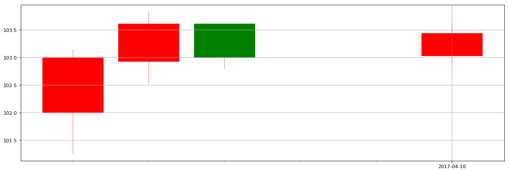

```python
import pandas as pd
import numpy as np
import matplotlib.pyplot as plt
import mpl_finance as mplf
import matplotlib.dates as mdates
```


```python
gdzz0 = pd.read_csv('D:/Python/iPython/datacsv/gdzz.csv')
```


```python
gdzz = gdzz0[['date','open','close','high','low']]
print gdzz
```

               date    open   close    high     low
    0    2017/04/05  102.00  103.00  103.15  101.25
    1    2017/04/06  102.93  103.61  103.83  102.52
    2    2017/04/07  103.61  103.00  103.61  102.80
    3    2017/04/10  103.03  103.44  103.60  102.91
    4    2017/04/11  103.24  103.29  103.30  102.91
    5    2017/04/12  103.29  103.12  103.32  102.95
    6    2017/04/13  103.12  103.01  103.12  102.85
    7    2017/04/14  103.01  102.31  103.01  102.29
    8    2017/04/17  102.30  101.78  102.30  101.53
    9    2017/04/18  101.79  101.70  101.90  101.55
    10   2017/04/19  101.61  101.54  101.78  101.13
    11   2017/04/20  101.54  101.53  101.81  101.36
    12   2017/04/21  101.53  101.71  101.85  101.48
    13   2017/04/24  101.66  101.48  101.71  101.27
    14   2017/04/25  101.52  101.85  101.94  101.50
    15   2017/04/26  101.85  101.60  101.90  101.50
    16   2017/04/27  101.63  101.72  101.76  101.46
    17   2017/04/28  101.72  101.50  101.75  101.50
    18   2017/05/02  101.55  101.00  101.63  100.88
    19   2017/05/03  101.30  100.95  101.30  100.86
    20   2017/05/04  100.95  100.91  101.00  100.82
    21   2017/05/05  100.86  100.60  101.00  100.48
    22   2017/05/08  100.56  100.11  100.56   99.80
    


```python
gdzz1 = gdzz0['date']
gdzz2 = gdzz0['open']
gdzz3 = gdzz0['close']
gdzz4 = gdzz0['high']
gdzz5 = gdzz0['low']
CD = len(gdzz1)
```


```python
e1 = pd.to_datetime(gdzz1[0])
b1 = gdzz2[0]
c1 = gdzz3[0]
d1 = gdzz4[0]
f1 = gdzz5[0]
```


```python
a1 = mdates.date2num(e1)
```


```python
a1
```


    736424.0


```python
b1
```


    102.0


```python
c1
```


    103.0


```python
d1
```


    103.15000000000001


```python
e2 = pd.to_datetime(gdzz1[1])
b2 = gdzz2[1]
c2 = gdzz3[1]
d2 = gdzz4[1]
f2 = gdzz5[1]
```


```python
e3 = pd.to_datetime(gdzz1[2])
b3 = gdzz2[2]
c3 = gdzz3[2]
d3 = gdzz4[2]
f3 = gdzz5[2]
```


```python
e4 = pd.to_datetime(gdzz1[3])
b4 = gdzz2[3]
c4 = gdzz3[3]
d4 = gdzz4[3]
f4 = gdzz5[4]
```


```python
a2 = mdates.date2num(e2)
a3 = mdates.date2num(e3)
a4 = mdates.date2num(e4)
```


```python
datarray = np.array([[a1,b1,c1,d1,f1],[a2,b2,c2,d2,f2],[a3,b3,c3,d3,f3],[a4,b4,c4,d4,f4]])
```


```python
datarray
```


    array([[  7.36424000e+05,   1.02000000e+02,   1.03000000e+02,
              1.03150000e+02,   1.01250000e+02],
           [  7.36425000e+05,   1.02930000e+02,   1.03610000e+02,
              1.03830000e+02,   1.02520000e+02],
           [  7.36426000e+05,   1.03610000e+02,   1.03000000e+02,
              1.03610000e+02,   1.02800000e+02],
           [  7.36429000e+05,   1.03030000e+02,   1.03440000e+02,
              1.03600000e+02,   1.02910000e+02]])


```python
from matplotlib.dates import DateFormatter, WeekdayLocator,DayLocator, MONDAY
```


```python
mondays = WeekdayLocator(MONDAY)
alldays = DayLocator()
# weekFormatter = DateFormatter('%b %d')
dayFormatter = DateFormatter('%Y-%m-%d')
```


```python
fig = plt.figure(figsize=(18,6), dpi=80)
ax = plt.subplot(111)
```


```python
ax.xaxis.set_major_locator(mondays)
ax.xaxis.set_minor_locator(alldays)
ax.xaxis.set_major_formatter(dayFormatter)
ax.grid(True)
```


```python
# mplf.candlestick2_ochl(ax, gdzz['open'], gdzz['close'], gdzz['high'], gdzz['low'], width=0.8, colorup='red', colordown='green', alpha=1)
```


```python
mplf.candlestick_ochl(ax, datarray, width=0.8, colorup='red', colordown='green', alpha=1)
```


    ([<matplotlib.lines.Line2D at 0xc37a4a8>,
      <matplotlib.lines.Line2D at 0xc331ba8>,
      <matplotlib.lines.Line2D at 0xc32b2b0>,
      <matplotlib.lines.Line2D at 0xc3961d0>],
     [<matplotlib.patches.Rectangle at 0xc1b6940>,
      <matplotlib.patches.Rectangle at 0xc331dd8>,
      <matplotlib.patches.Rectangle at 0xc3207b8>,
      <matplotlib.patches.Rectangle at 0xc396128>])


```python
ax.xaxis_date()
ax.autoscale_view()
# plt.setp(plt.gca().get_xticklabels(), rotation=45, horizontalalignment='right')
```


```python
plt.show()
```




