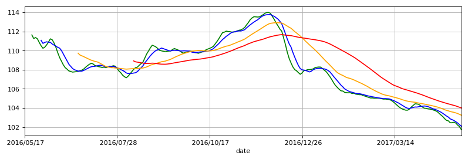
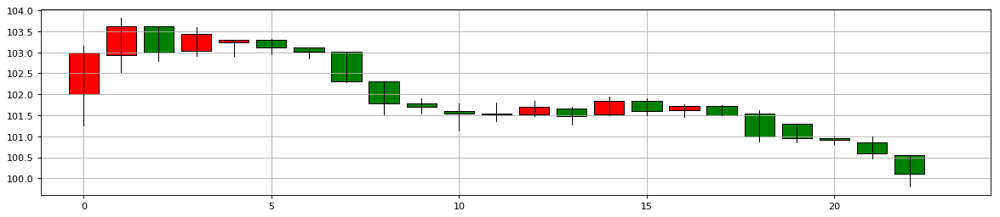

```python
import pandas as pd
```


```python
import matplotlib.pyplot as plt
```


```python
import numpy as np
```


```python
import matplotlib as mpl
```


```python
hfzz = pd.read_csv('datacsv/hfzz.csv')
```


```python
hfzz = hfzz.set_index('date')
```


```python
MA5 = hfzz['close'].rolling(window=5).mean()
```


```python
MA10 = hfzz['close'].rolling(window=10).mean()
```


```python
MA30 = hfzz['close'].rolling(window=30).mean()
```


```python
MA60 = hfzz['close'].rolling(window=60).mean()
```


```python
plt.figure(figsize=(12,8), dpi=80)
plt.subplot(211)
MA5.plot(color='Green', grid='on')
MA10.plot(color='Blue', grid='on')
MA30.plot(color='Orange', grid='on')
MA60.plot(color='Red', grid='on')
```


    <matplotlib.axes._subplots.AxesSubplot at 0xc3cbfd0>


```python
plt.show()
```





```python
print np.__version__
```

    1.12.1
    


```python
print np.__file__
```

    d:\python\27\lib\site-packages\numpy\__init__.pyc
    


```python
print mpl.__version__
```

    2.0.0
    


```python
print mpl.__file__
```

    d:\python\27\lib\site-packages\matplotlib\__init__.pyc
    


```python
import matplotlib.finance as fnc
```


```python
gdzz0 = pd.read_csv('datacsv/gdzz.csv')
```


```python
gdzz1 = gdzz0.set_index('date')
```


```python
gdzz = gdzz1[['open','close','high','low']]
```


```python
gdzz
```


<div>
<style>
    .dataframe thead tr:only-child th {
        text-align: right;
    }

    .dataframe thead th {
        text-align: left;
    }

    .dataframe tbody tr th {
        vertical-align: top;
    }
</style>
<table border="1" class="dataframe">
  <thead>
    <tr style="text-align: right;">
      <th></th>
      <th>open</th>
      <th>close</th>
      <th>high</th>
      <th>low</th>
    </tr>
    <tr>
      <th>date</th>
      <th></th>
      <th></th>
      <th></th>
      <th></th>
    </tr>
  </thead>
  <tbody>
    <tr>
      <th>2017/04/05</th>
      <td>102.00</td>
      <td>103.00</td>
      <td>103.15</td>
      <td>101.25</td>
    </tr>
    <tr>
      <th>2017/04/06</th>
      <td>102.93</td>
      <td>103.61</td>
      <td>103.83</td>
      <td>102.52</td>
    </tr>
    <tr>
      <th>2017/04/07</th>
      <td>103.61</td>
      <td>103.00</td>
      <td>103.61</td>
      <td>102.80</td>
    </tr>
    <tr>
      <th>2017/04/10</th>
      <td>103.03</td>
      <td>103.44</td>
      <td>103.60</td>
      <td>102.91</td>
    </tr>
    <tr>
      <th>2017/04/11</th>
      <td>103.24</td>
      <td>103.29</td>
      <td>103.30</td>
      <td>102.91</td>
    </tr>
    <tr>
      <th>2017/04/12</th>
      <td>103.29</td>
      <td>103.12</td>
      <td>103.32</td>
      <td>102.95</td>
    </tr>
    <tr>
      <th>2017/04/13</th>
      <td>103.12</td>
      <td>103.01</td>
      <td>103.12</td>
      <td>102.85</td>
    </tr>
    <tr>
      <th>2017/04/14</th>
      <td>103.01</td>
      <td>102.31</td>
      <td>103.01</td>
      <td>102.29</td>
    </tr>
    <tr>
      <th>2017/04/17</th>
      <td>102.30</td>
      <td>101.78</td>
      <td>102.30</td>
      <td>101.53</td>
    </tr>
    <tr>
      <th>2017/04/18</th>
      <td>101.79</td>
      <td>101.70</td>
      <td>101.90</td>
      <td>101.55</td>
    </tr>
    <tr>
      <th>2017/04/19</th>
      <td>101.61</td>
      <td>101.54</td>
      <td>101.78</td>
      <td>101.13</td>
    </tr>
    <tr>
      <th>2017/04/20</th>
      <td>101.54</td>
      <td>101.53</td>
      <td>101.81</td>
      <td>101.36</td>
    </tr>
    <tr>
      <th>2017/04/21</th>
      <td>101.53</td>
      <td>101.71</td>
      <td>101.85</td>
      <td>101.48</td>
    </tr>
    <tr>
      <th>2017/04/24</th>
      <td>101.66</td>
      <td>101.48</td>
      <td>101.71</td>
      <td>101.27</td>
    </tr>
    <tr>
      <th>2017/04/25</th>
      <td>101.52</td>
      <td>101.85</td>
      <td>101.94</td>
      <td>101.50</td>
    </tr>
    <tr>
      <th>2017/04/26</th>
      <td>101.85</td>
      <td>101.60</td>
      <td>101.90</td>
      <td>101.50</td>
    </tr>
    <tr>
      <th>2017/04/27</th>
      <td>101.63</td>
      <td>101.72</td>
      <td>101.76</td>
      <td>101.46</td>
    </tr>
    <tr>
      <th>2017/04/28</th>
      <td>101.72</td>
      <td>101.50</td>
      <td>101.75</td>
      <td>101.50</td>
    </tr>
    <tr>
      <th>2017/05/02</th>
      <td>101.55</td>
      <td>101.00</td>
      <td>101.63</td>
      <td>100.88</td>
    </tr>
    <tr>
      <th>2017/05/03</th>
      <td>101.30</td>
      <td>100.95</td>
      <td>101.30</td>
      <td>100.86</td>
    </tr>
    <tr>
      <th>2017/05/04</th>
      <td>100.95</td>
      <td>100.91</td>
      <td>101.00</td>
      <td>100.82</td>
    </tr>
    <tr>
      <th>2017/05/05</th>
      <td>100.86</td>
      <td>100.60</td>
      <td>101.00</td>
      <td>100.48</td>
    </tr>
    <tr>
      <th>2017/05/08</th>
      <td>100.56</td>
      <td>100.11</td>
      <td>100.56</td>
      <td>99.80</td>
    </tr>
  </tbody>
</table>
</div>


```python
plt.figure(figsize=(18,8), dpi=80)
ax = plt.subplot(211)
ax.grid(True)
```


```python
# M3 = gdzz['close'].rolling(window=3).mean()
# MA3.plot(color='white', grid='on', linewidth=2.0, alpha=1)
```


```python
fnc.candlestick2_ochl(ax, gdzz['open'], gdzz['close'], gdzz['high'], gdzz['low'], width=0.8, colorup='red', colordown='green', alpha=1)
```


```python
plt.show()
```




