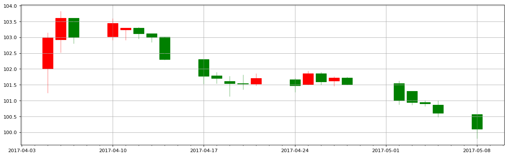

```python
import pandas as pd
import numpy as np
import matplotlib.pyplot as plt
import mpl_finance as mplf
import matplotlib.dates as mdates
```


```python
gdzz0 = pd.read_csv('D:/Python/iPython/datacsv/gdzz.csv')
```


```python
gdzz = gdzz0[['date','open','close','high','low']]
```


```python
gdzz
```


<div>
<style>
    .dataframe thead tr:only-child th {
        text-align: right;
    }

    .dataframe thead th {
        text-align: left;
    }

    .dataframe tbody tr th {
        vertical-align: top;
    }
</style>
<table border="1" class="dataframe">
  <thead>
    <tr style="text-align: right;">
      <th></th>
      <th>date</th>
      <th>open</th>
      <th>close</th>
      <th>high</th>
      <th>low</th>
    </tr>
  </thead>
  <tbody>
    <tr>
      <th>0</th>
      <td>2017/04/05</td>
      <td>102.00</td>
      <td>103.00</td>
      <td>103.15</td>
      <td>101.25</td>
    </tr>
    <tr>
      <th>1</th>
      <td>2017/04/06</td>
      <td>102.93</td>
      <td>103.61</td>
      <td>103.83</td>
      <td>102.52</td>
    </tr>
    <tr>
      <th>2</th>
      <td>2017/04/07</td>
      <td>103.61</td>
      <td>103.00</td>
      <td>103.61</td>
      <td>102.80</td>
    </tr>
    <tr>
      <th>3</th>
      <td>2017/04/10</td>
      <td>103.03</td>
      <td>103.44</td>
      <td>103.60</td>
      <td>102.91</td>
    </tr>
    <tr>
      <th>4</th>
      <td>2017/04/11</td>
      <td>103.24</td>
      <td>103.29</td>
      <td>103.30</td>
      <td>102.91</td>
    </tr>
    <tr>
      <th>5</th>
      <td>2017/04/12</td>
      <td>103.29</td>
      <td>103.12</td>
      <td>103.32</td>
      <td>102.95</td>
    </tr>
    <tr>
      <th>6</th>
      <td>2017/04/13</td>
      <td>103.12</td>
      <td>103.01</td>
      <td>103.12</td>
      <td>102.85</td>
    </tr>
    <tr>
      <th>7</th>
      <td>2017/04/14</td>
      <td>103.01</td>
      <td>102.31</td>
      <td>103.01</td>
      <td>102.29</td>
    </tr>
    <tr>
      <th>8</th>
      <td>2017/04/17</td>
      <td>102.30</td>
      <td>101.78</td>
      <td>102.30</td>
      <td>101.53</td>
    </tr>
    <tr>
      <th>9</th>
      <td>2017/04/18</td>
      <td>101.79</td>
      <td>101.70</td>
      <td>101.90</td>
      <td>101.55</td>
    </tr>
    <tr>
      <th>10</th>
      <td>2017/04/19</td>
      <td>101.61</td>
      <td>101.54</td>
      <td>101.78</td>
      <td>101.13</td>
    </tr>
    <tr>
      <th>11</th>
      <td>2017/04/20</td>
      <td>101.54</td>
      <td>101.53</td>
      <td>101.81</td>
      <td>101.36</td>
    </tr>
    <tr>
      <th>12</th>
      <td>2017/04/21</td>
      <td>101.53</td>
      <td>101.71</td>
      <td>101.85</td>
      <td>101.48</td>
    </tr>
    <tr>
      <th>13</th>
      <td>2017/04/24</td>
      <td>101.66</td>
      <td>101.48</td>
      <td>101.71</td>
      <td>101.27</td>
    </tr>
    <tr>
      <th>14</th>
      <td>2017/04/25</td>
      <td>101.52</td>
      <td>101.85</td>
      <td>101.94</td>
      <td>101.50</td>
    </tr>
    <tr>
      <th>15</th>
      <td>2017/04/26</td>
      <td>101.85</td>
      <td>101.60</td>
      <td>101.90</td>
      <td>101.50</td>
    </tr>
    <tr>
      <th>16</th>
      <td>2017/04/27</td>
      <td>101.63</td>
      <td>101.72</td>
      <td>101.76</td>
      <td>101.46</td>
    </tr>
    <tr>
      <th>17</th>
      <td>2017/04/28</td>
      <td>101.72</td>
      <td>101.50</td>
      <td>101.75</td>
      <td>101.50</td>
    </tr>
    <tr>
      <th>18</th>
      <td>2017/05/02</td>
      <td>101.55</td>
      <td>101.00</td>
      <td>101.63</td>
      <td>100.88</td>
    </tr>
    <tr>
      <th>19</th>
      <td>2017/05/03</td>
      <td>101.30</td>
      <td>100.95</td>
      <td>101.30</td>
      <td>100.86</td>
    </tr>
    <tr>
      <th>20</th>
      <td>2017/05/04</td>
      <td>100.95</td>
      <td>100.91</td>
      <td>101.00</td>
      <td>100.82</td>
    </tr>
    <tr>
      <th>21</th>
      <td>2017/05/05</td>
      <td>100.86</td>
      <td>100.60</td>
      <td>101.00</td>
      <td>100.48</td>
    </tr>
    <tr>
      <th>22</th>
      <td>2017/05/08</td>
      <td>100.56</td>
      <td>100.11</td>
      <td>100.56</td>
      <td>99.80</td>
    </tr>
  </tbody>
</table>
</div>


```python
# 选取一组时间，建立array数组，测试date2num的数组转换，===========================================
```


```python
gdzz1 = gdzz0['date']
gdzz2 = gdzz0['open']
gdzz3 = gdzz0['close']
gdzz4 = gdzz0['high']
gdzz5 = gdzz0['low']
```


```python
gdzz1
```


    0      2017/04/05
    1      2017/04/06
    2      2017/04/07
    3      2017/04/10
    4      2017/04/11
    5      2017/04/12
    6      2017/04/13
    7      2017/04/14
    8      2017/04/17
    9      2017/04/18
    10     2017/04/19
    11     2017/04/20
    12     2017/04/21
    13     2017/04/24
    14     2017/04/25
    15     2017/04/26
    16     2017/04/27
    17     2017/04/28
    18     2017/05/02
    19     2017/05/03
    20     2017/05/04
    21     2017/05/05
    22     2017/05/08
    Name: date, dtype: object


```python
e1 = pd.to_datetime(gdzz1[0])
e2 = pd.to_datetime(gdzz1[1])
e3 = pd.to_datetime(gdzz1[2])
e4 = pd.to_datetime(gdzz1[3])
```


```python
e1
```


    Timestamp('2017-04-05 00:00:00')


```python
stime = np.array([e1,e2,e3,e4])
```


```python
stime # 数组建立成功，类型为object
```


    array([Timestamp('2017-04-05 00:00:00'), Timestamp('2017-04-06 00:00:00'),
           Timestamp('2017-04-07 00:00:00'), Timestamp('2017-04-10 00:00:00')], dtype=object)


```python
stime = mdates.date2num(stime)
```


```python
stime
```


    array([ 736424.,  736425.,  736426.,  736429.])


```python
# 对整个date列进行数组转换，测试date2num，===========================================
```


```python
gdzz6 = pd.to_datetime(gdzz1)
```


```python
gdzz6 # 类型为datetime64[ns]，需要转换
```


    0    2017-04-05
    1    2017-04-06
    2    2017-04-07
    3    2017-04-10
    4    2017-04-11
    5    2017-04-12
    6    2017-04-13
    7    2017-04-14
    8    2017-04-17
    9    2017-04-18
    10   2017-04-19
    11   2017-04-20
    12   2017-04-21
    13   2017-04-24
    14   2017-04-25
    15   2017-04-26
    16   2017-04-27
    17   2017-04-28
    18   2017-05-02
    19   2017-05-03
    20   2017-05-04
    21   2017-05-05
    22   2017-05-08
    Name: date, dtype: datetime64[ns]


```python
gdzz6 = gdzz6.astype(np.object)
```


```python
gdzz6 # 类型已经转化为object
```


    0     2017-04-05 00:00:00
    1     2017-04-06 00:00:00
    2     2017-04-07 00:00:00
    3     2017-04-10 00:00:00
    4     2017-04-11 00:00:00
    5     2017-04-12 00:00:00
    6     2017-04-13 00:00:00
    7     2017-04-14 00:00:00
    8     2017-04-17 00:00:00
    9     2017-04-18 00:00:00
    10    2017-04-19 00:00:00
    11    2017-04-20 00:00:00
    12    2017-04-21 00:00:00
    13    2017-04-24 00:00:00
    14    2017-04-25 00:00:00
    15    2017-04-26 00:00:00
    16    2017-04-27 00:00:00
    17    2017-04-28 00:00:00
    18    2017-05-02 00:00:00
    19    2017-05-03 00:00:00
    20    2017-05-04 00:00:00
    21    2017-05-05 00:00:00
    22    2017-05-08 00:00:00
    Name: date, dtype: object


```python
sdate = np.array(gdzz6)
```


```python
sdate
```


    array([Timestamp('2017-04-05 00:00:00'), Timestamp('2017-04-06 00:00:00'),
           Timestamp('2017-04-07 00:00:00'), Timestamp('2017-04-10 00:00:00'),
           Timestamp('2017-04-11 00:00:00'), Timestamp('2017-04-12 00:00:00'),
           Timestamp('2017-04-13 00:00:00'), Timestamp('2017-04-14 00:00:00'),
           Timestamp('2017-04-17 00:00:00'), Timestamp('2017-04-18 00:00:00'),
           Timestamp('2017-04-19 00:00:00'), Timestamp('2017-04-20 00:00:00'),
           Timestamp('2017-04-21 00:00:00'), Timestamp('2017-04-24 00:00:00'),
           Timestamp('2017-04-25 00:00:00'), Timestamp('2017-04-26 00:00:00'),
           Timestamp('2017-04-27 00:00:00'), Timestamp('2017-04-28 00:00:00'),
           Timestamp('2017-05-02 00:00:00'), Timestamp('2017-05-03 00:00:00'),
           Timestamp('2017-05-04 00:00:00'), Timestamp('2017-05-05 00:00:00'),
           Timestamp('2017-05-08 00:00:00')], dtype=object)


```python
sdate = mdates.date2num(sdate)
```


```python
sdate
```


    array([ 736424.,  736425.,  736426.,  736429.,  736430.,  736431.,
            736432.,  736433.,  736436.,  736437.,  736438.,  736439.,
            736440.,  736443.,  736444.,  736445.,  736446.,  736447.,
            736451.,  736452.,  736453.,  736454.,  736457.])


```python
# ===========================================
```


```python
gdzz7 = gdzz[['open','close','high','low']]
```


```python
gdzz7
```


<div>
<style>
    .dataframe thead tr:only-child th {
        text-align: right;
    }

    .dataframe thead th {
        text-align: left;
    }

    .dataframe tbody tr th {
        vertical-align: top;
    }
</style>
<table border="1" class="dataframe">
  <thead>
    <tr style="text-align: right;">
      <th></th>
      <th>open</th>
      <th>close</th>
      <th>high</th>
      <th>low</th>
    </tr>
  </thead>
  <tbody>
    <tr>
      <th>0</th>
      <td>102.00</td>
      <td>103.00</td>
      <td>103.15</td>
      <td>101.25</td>
    </tr>
    <tr>
      <th>1</th>
      <td>102.93</td>
      <td>103.61</td>
      <td>103.83</td>
      <td>102.52</td>
    </tr>
    <tr>
      <th>2</th>
      <td>103.61</td>
      <td>103.00</td>
      <td>103.61</td>
      <td>102.80</td>
    </tr>
    <tr>
      <th>3</th>
      <td>103.03</td>
      <td>103.44</td>
      <td>103.60</td>
      <td>102.91</td>
    </tr>
    <tr>
      <th>4</th>
      <td>103.24</td>
      <td>103.29</td>
      <td>103.30</td>
      <td>102.91</td>
    </tr>
    <tr>
      <th>5</th>
      <td>103.29</td>
      <td>103.12</td>
      <td>103.32</td>
      <td>102.95</td>
    </tr>
    <tr>
      <th>6</th>
      <td>103.12</td>
      <td>103.01</td>
      <td>103.12</td>
      <td>102.85</td>
    </tr>
    <tr>
      <th>7</th>
      <td>103.01</td>
      <td>102.31</td>
      <td>103.01</td>
      <td>102.29</td>
    </tr>
    <tr>
      <th>8</th>
      <td>102.30</td>
      <td>101.78</td>
      <td>102.30</td>
      <td>101.53</td>
    </tr>
    <tr>
      <th>9</th>
      <td>101.79</td>
      <td>101.70</td>
      <td>101.90</td>
      <td>101.55</td>
    </tr>
    <tr>
      <th>10</th>
      <td>101.61</td>
      <td>101.54</td>
      <td>101.78</td>
      <td>101.13</td>
    </tr>
    <tr>
      <th>11</th>
      <td>101.54</td>
      <td>101.53</td>
      <td>101.81</td>
      <td>101.36</td>
    </tr>
    <tr>
      <th>12</th>
      <td>101.53</td>
      <td>101.71</td>
      <td>101.85</td>
      <td>101.48</td>
    </tr>
    <tr>
      <th>13</th>
      <td>101.66</td>
      <td>101.48</td>
      <td>101.71</td>
      <td>101.27</td>
    </tr>
    <tr>
      <th>14</th>
      <td>101.52</td>
      <td>101.85</td>
      <td>101.94</td>
      <td>101.50</td>
    </tr>
    <tr>
      <th>15</th>
      <td>101.85</td>
      <td>101.60</td>
      <td>101.90</td>
      <td>101.50</td>
    </tr>
    <tr>
      <th>16</th>
      <td>101.63</td>
      <td>101.72</td>
      <td>101.76</td>
      <td>101.46</td>
    </tr>
    <tr>
      <th>17</th>
      <td>101.72</td>
      <td>101.50</td>
      <td>101.75</td>
      <td>101.50</td>
    </tr>
    <tr>
      <th>18</th>
      <td>101.55</td>
      <td>101.00</td>
      <td>101.63</td>
      <td>100.88</td>
    </tr>
    <tr>
      <th>19</th>
      <td>101.30</td>
      <td>100.95</td>
      <td>101.30</td>
      <td>100.86</td>
    </tr>
    <tr>
      <th>20</th>
      <td>100.95</td>
      <td>100.91</td>
      <td>101.00</td>
      <td>100.82</td>
    </tr>
    <tr>
      <th>21</th>
      <td>100.86</td>
      <td>100.60</td>
      <td>101.00</td>
      <td>100.48</td>
    </tr>
    <tr>
      <th>22</th>
      <td>100.56</td>
      <td>100.11</td>
      <td>100.56</td>
      <td>99.80</td>
    </tr>
  </tbody>
</table>
</div>


```python
result = pd.concat([gdzz6, gdzz7], axis=1)
```


```python
result
```


<div>
<style>
    .dataframe thead tr:only-child th {
        text-align: right;
    }

    .dataframe thead th {
        text-align: left;
    }

    .dataframe tbody tr th {
        vertical-align: top;
    }
</style>
<table border="1" class="dataframe">
  <thead>
    <tr style="text-align: right;">
      <th></th>
      <th>date</th>
      <th>open</th>
      <th>close</th>
      <th>high</th>
      <th>low</th>
    </tr>
  </thead>
  <tbody>
    <tr>
      <th>0</th>
      <td>2017-04-05 00:00:00</td>
      <td>102.00</td>
      <td>103.00</td>
      <td>103.15</td>
      <td>101.25</td>
    </tr>
    <tr>
      <th>1</th>
      <td>2017-04-06 00:00:00</td>
      <td>102.93</td>
      <td>103.61</td>
      <td>103.83</td>
      <td>102.52</td>
    </tr>
    <tr>
      <th>2</th>
      <td>2017-04-07 00:00:00</td>
      <td>103.61</td>
      <td>103.00</td>
      <td>103.61</td>
      <td>102.80</td>
    </tr>
    <tr>
      <th>3</th>
      <td>2017-04-10 00:00:00</td>
      <td>103.03</td>
      <td>103.44</td>
      <td>103.60</td>
      <td>102.91</td>
    </tr>
    <tr>
      <th>4</th>
      <td>2017-04-11 00:00:00</td>
      <td>103.24</td>
      <td>103.29</td>
      <td>103.30</td>
      <td>102.91</td>
    </tr>
    <tr>
      <th>5</th>
      <td>2017-04-12 00:00:00</td>
      <td>103.29</td>
      <td>103.12</td>
      <td>103.32</td>
      <td>102.95</td>
    </tr>
    <tr>
      <th>6</th>
      <td>2017-04-13 00:00:00</td>
      <td>103.12</td>
      <td>103.01</td>
      <td>103.12</td>
      <td>102.85</td>
    </tr>
    <tr>
      <th>7</th>
      <td>2017-04-14 00:00:00</td>
      <td>103.01</td>
      <td>102.31</td>
      <td>103.01</td>
      <td>102.29</td>
    </tr>
    <tr>
      <th>8</th>
      <td>2017-04-17 00:00:00</td>
      <td>102.30</td>
      <td>101.78</td>
      <td>102.30</td>
      <td>101.53</td>
    </tr>
    <tr>
      <th>9</th>
      <td>2017-04-18 00:00:00</td>
      <td>101.79</td>
      <td>101.70</td>
      <td>101.90</td>
      <td>101.55</td>
    </tr>
    <tr>
      <th>10</th>
      <td>2017-04-19 00:00:00</td>
      <td>101.61</td>
      <td>101.54</td>
      <td>101.78</td>
      <td>101.13</td>
    </tr>
    <tr>
      <th>11</th>
      <td>2017-04-20 00:00:00</td>
      <td>101.54</td>
      <td>101.53</td>
      <td>101.81</td>
      <td>101.36</td>
    </tr>
    <tr>
      <th>12</th>
      <td>2017-04-21 00:00:00</td>
      <td>101.53</td>
      <td>101.71</td>
      <td>101.85</td>
      <td>101.48</td>
    </tr>
    <tr>
      <th>13</th>
      <td>2017-04-24 00:00:00</td>
      <td>101.66</td>
      <td>101.48</td>
      <td>101.71</td>
      <td>101.27</td>
    </tr>
    <tr>
      <th>14</th>
      <td>2017-04-25 00:00:00</td>
      <td>101.52</td>
      <td>101.85</td>
      <td>101.94</td>
      <td>101.50</td>
    </tr>
    <tr>
      <th>15</th>
      <td>2017-04-26 00:00:00</td>
      <td>101.85</td>
      <td>101.60</td>
      <td>101.90</td>
      <td>101.50</td>
    </tr>
    <tr>
      <th>16</th>
      <td>2017-04-27 00:00:00</td>
      <td>101.63</td>
      <td>101.72</td>
      <td>101.76</td>
      <td>101.46</td>
    </tr>
    <tr>
      <th>17</th>
      <td>2017-04-28 00:00:00</td>
      <td>101.72</td>
      <td>101.50</td>
      <td>101.75</td>
      <td>101.50</td>
    </tr>
    <tr>
      <th>18</th>
      <td>2017-05-02 00:00:00</td>
      <td>101.55</td>
      <td>101.00</td>
      <td>101.63</td>
      <td>100.88</td>
    </tr>
    <tr>
      <th>19</th>
      <td>2017-05-03 00:00:00</td>
      <td>101.30</td>
      <td>100.95</td>
      <td>101.30</td>
      <td>100.86</td>
    </tr>
    <tr>
      <th>20</th>
      <td>2017-05-04 00:00:00</td>
      <td>100.95</td>
      <td>100.91</td>
      <td>101.00</td>
      <td>100.82</td>
    </tr>
    <tr>
      <th>21</th>
      <td>2017-05-05 00:00:00</td>
      <td>100.86</td>
      <td>100.60</td>
      <td>101.00</td>
      <td>100.48</td>
    </tr>
    <tr>
      <th>22</th>
      <td>2017-05-08 00:00:00</td>
      <td>100.56</td>
      <td>100.11</td>
      <td>100.56</td>
      <td>99.80</td>
    </tr>
  </tbody>
</table>
</div>


```python
stock_data = np.array(result)
```


```python
stock_data
```


    array([[Timestamp('2017-04-05 00:00:00'), 102.0, 103.0, 103.15, 101.25],
           [Timestamp('2017-04-06 00:00:00'), 102.93, 103.61, 103.83, 102.52],
           [Timestamp('2017-04-07 00:00:00'), 103.61, 103.0, 103.61, 102.8],
           [Timestamp('2017-04-10 00:00:00'), 103.03, 103.44, 103.6, 102.91],
           [Timestamp('2017-04-11 00:00:00'), 103.24, 103.29, 103.3, 102.91],
           [Timestamp('2017-04-12 00:00:00'), 103.29, 103.12, 103.32, 102.95],
           [Timestamp('2017-04-13 00:00:00'), 103.12, 103.01, 103.12, 102.85],
           [Timestamp('2017-04-14 00:00:00'), 103.01, 102.31, 103.01, 102.29],
           [Timestamp('2017-04-17 00:00:00'), 102.3, 101.78, 102.3, 101.53],
           [Timestamp('2017-04-18 00:00:00'), 101.79, 101.7, 101.9, 101.55],
           [Timestamp('2017-04-19 00:00:00'), 101.61, 101.54, 101.78, 101.13],
           [Timestamp('2017-04-20 00:00:00'), 101.54, 101.53, 101.81, 101.36],
           [Timestamp('2017-04-21 00:00:00'), 101.53, 101.71, 101.85, 101.48],
           [Timestamp('2017-04-24 00:00:00'), 101.66, 101.48, 101.71, 101.27],
           [Timestamp('2017-04-25 00:00:00'), 101.52, 101.85, 101.94, 101.5],
           [Timestamp('2017-04-26 00:00:00'), 101.85, 101.6, 101.9, 101.5],
           [Timestamp('2017-04-27 00:00:00'), 101.63, 101.72, 101.76, 101.46],
           [Timestamp('2017-04-28 00:00:00'), 101.72, 101.5, 101.75, 101.5],
           [Timestamp('2017-05-02 00:00:00'), 101.55, 101.0, 101.63, 100.88],
           [Timestamp('2017-05-03 00:00:00'), 101.3, 100.95, 101.3, 100.86],
           [Timestamp('2017-05-04 00:00:00'), 100.95, 100.91, 101.0, 100.82],
           [Timestamp('2017-05-05 00:00:00'), 100.86, 100.6, 101.0, 100.48],
           [Timestamp('2017-05-08 00:00:00'), 100.56, 100.11, 100.56, 99.8]], dtype=object)


```python
stock_data[0]
```


    array([Timestamp('2017-04-05 00:00:00'), 102.0, 103.0, 103.15, 101.25], dtype=object)


```python
stock_data[:,0]
```


    array([Timestamp('2017-04-05 00:00:00'), Timestamp('2017-04-06 00:00:00'),
           Timestamp('2017-04-07 00:00:00'), Timestamp('2017-04-10 00:00:00'),
           Timestamp('2017-04-11 00:00:00'), Timestamp('2017-04-12 00:00:00'),
           Timestamp('2017-04-13 00:00:00'), Timestamp('2017-04-14 00:00:00'),
           Timestamp('2017-04-17 00:00:00'), Timestamp('2017-04-18 00:00:00'),
           Timestamp('2017-04-19 00:00:00'), Timestamp('2017-04-20 00:00:00'),
           Timestamp('2017-04-21 00:00:00'), Timestamp('2017-04-24 00:00:00'),
           Timestamp('2017-04-25 00:00:00'), Timestamp('2017-04-26 00:00:00'),
           Timestamp('2017-04-27 00:00:00'), Timestamp('2017-04-28 00:00:00'),
           Timestamp('2017-05-02 00:00:00'), Timestamp('2017-05-03 00:00:00'),
           Timestamp('2017-05-04 00:00:00'), Timestamp('2017-05-05 00:00:00'),
           Timestamp('2017-05-08 00:00:00')], dtype=object)


```python
stock_data[:,0] = mdates.date2num(stock_data[:,0])
```


```python
stock_data
```


    array([[736424.0, 102.0, 103.0, 103.15, 101.25],
           [736425.0, 102.93, 103.61, 103.83, 102.52],
           [736426.0, 103.61, 103.0, 103.61, 102.8],
           [736429.0, 103.03, 103.44, 103.6, 102.91],
           [736430.0, 103.24, 103.29, 103.3, 102.91],
           [736431.0, 103.29, 103.12, 103.32, 102.95],
           [736432.0, 103.12, 103.01, 103.12, 102.85],
           [736433.0, 103.01, 102.31, 103.01, 102.29],
           [736436.0, 102.3, 101.78, 102.3, 101.53],
           [736437.0, 101.79, 101.7, 101.9, 101.55],
           [736438.0, 101.61, 101.54, 101.78, 101.13],
           [736439.0, 101.54, 101.53, 101.81, 101.36],
           [736440.0, 101.53, 101.71, 101.85, 101.48],
           [736443.0, 101.66, 101.48, 101.71, 101.27],
           [736444.0, 101.52, 101.85, 101.94, 101.5],
           [736445.0, 101.85, 101.6, 101.9, 101.5],
           [736446.0, 101.63, 101.72, 101.76, 101.46],
           [736447.0, 101.72, 101.5, 101.75, 101.5],
           [736451.0, 101.55, 101.0, 101.63, 100.88],
           [736452.0, 101.3, 100.95, 101.3, 100.86],
           [736453.0, 100.95, 100.91, 101.0, 100.82],
           [736454.0, 100.86, 100.6, 101.0, 100.48],
           [736457.0, 100.56, 100.11, 100.56, 99.8]], dtype=object)


```python
from matplotlib.dates import DateFormatter, WeekdayLocator,DayLocator, MONDAY
```


```python
fig = plt.figure(figsize=(18,6), dpi=80)
ax = plt.subplot(111)
fig.subplots_adjust(bottom=0.2)  
```


```python
#设置主要刻度和显示格式
mondays = WeekdayLocator(MONDAY)
mondaysFormatter = DateFormatter('%Y-%m-%d')
ax.xaxis.set_major_locator(mondays)
ax.xaxis.set_major_formatter(mondaysFormatter)
```


```python
mondays
```


    <matplotlib.dates.WeekdayLocator at 0xc2f7278>


```python
#设置次要刻度和显示格式
alldays = DayLocator()
alldaysFormatter = DateFormatter('%d')
ax.xaxis.set_minor_locator(alldays)
```


```python
#设置x轴为日期
ax.xaxis_date()
ax.autoscale_view()
```


```python
# plt.setp(plt.gca().get_xticklabels(), rotation=45, horizontalalignment='right')
```


```python
ax.grid(True)
```


```python
mplf.candlestick_ochl(ax, stock_data, width=0.8, colorup='red', colordown='green', alpha=1)
```


    ([<matplotlib.lines.Line2D at 0xc2f7240>,
      <matplotlib.lines.Line2D at 0xc2f7ef0>,
      <matplotlib.lines.Line2D at 0xc312a58>,
      <matplotlib.lines.Line2D at 0xc3255c0>,
      <matplotlib.lines.Line2D at 0xc325f98>,
      <matplotlib.lines.Line2D at 0xc334c18>,
      <matplotlib.lines.Line2D at 0xc342780>,
      <matplotlib.lines.Line2D at 0xc3502e8>,
      <matplotlib.lines.Line2D at 0xc350e10>,
      <matplotlib.lines.Line2D at 0xc3e6978>,
      <matplotlib.lines.Line2D at 0xc3f44e0>,
      <matplotlib.lines.Line2D at 0xc3f4eb8>,
      <matplotlib.lines.Line2D at 0xc401b70>,
      <matplotlib.lines.Line2D at 0xc40e6d8>,
      <matplotlib.lines.Line2D at 0xc41d240>,
      <matplotlib.lines.Line2D at 0xc41dd68>,
      <matplotlib.lines.Line2D at 0xc42f8d0>,
      <matplotlib.lines.Line2D at 0xc43c438>,
      <matplotlib.lines.Line2D at 0xc43cf60>,
      <matplotlib.lines.Line2D at 0xc44bac8>,
      <matplotlib.lines.Line2D at 0xc459630>,
      <matplotlib.lines.Line2D at 0xc468198>,
      <matplotlib.lines.Line2D at 0xc468cc0>],
     [<matplotlib.patches.Rectangle at 0xc0f5978>,
      <matplotlib.patches.Rectangle at 0xc312128>,
      <matplotlib.patches.Rectangle at 0xc3129b0>,
      <matplotlib.patches.Rectangle at 0xc325518>,
      <matplotlib.patches.Rectangle at 0xc334080>,
      <matplotlib.patches.Rectangle at 0xc334b70>,
      <matplotlib.patches.Rectangle at 0xc3426d8>,
      <matplotlib.patches.Rectangle at 0xc350240>,
      <matplotlib.patches.Rectangle at 0xc3e60b8>,
      <matplotlib.patches.Rectangle at 0xc3e68d0>,
      <matplotlib.patches.Rectangle at 0xc3f4438>,
      <matplotlib.patches.Rectangle at 0xc401208>,
      <matplotlib.patches.Rectangle at 0xc401ac8>,
      <matplotlib.patches.Rectangle at 0xc40e630>,
      <matplotlib.patches.Rectangle at 0xc41d198>,
      <matplotlib.patches.Rectangle at 0xc41dcc0>,
      <matplotlib.patches.Rectangle at 0xc42f828>,
      <matplotlib.patches.Rectangle at 0xc43c390>,
      <matplotlib.patches.Rectangle at 0xc44b198>,
      <matplotlib.patches.Rectangle at 0xc44ba20>,
      <matplotlib.patches.Rectangle at 0xc459588>,
      <matplotlib.patches.Rectangle at 0xc4680f0>,
      <matplotlib.patches.Rectangle at 0xc468c18>])


```python
plt.show()
```




