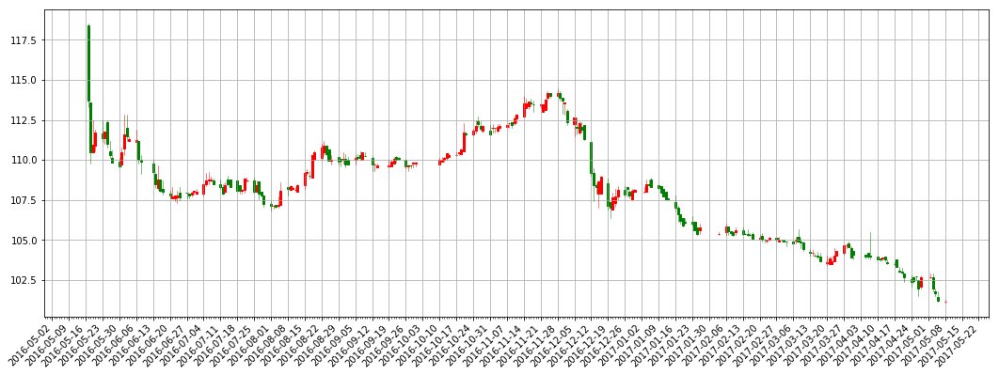

```python
import pandas as pd
import numpy as np
import matplotlib.pyplot as plt
import mpl_finance as mplf
import matplotlib.dates as mdates
```


```python
stock0 = pd.read_csv('D:/Python/iPython/datacsv/hfzz.csv')
```


```python
stock1 = stock0['date']
```


```python
stock2 = stock0[['open','close','high','low']]
```


```python
stock3 = pd.to_datetime(stock1)
```


```python
stock4 = stock3.astype(np.object)
```


```python
stock5 = pd.concat([stock4, stock2], axis=1)
```


```python
stock_data = np.array(stock5)
```


```python
stock_data[:,0] = mdates.date2num(stock_data[:,0])
```


```python
from matplotlib.dates import DateFormatter, WeekdayLocator,DayLocator, MONDAY
```


```python
fig = plt.figure(figsize=(18,6))
ax = plt.subplot(111)
ax.grid(True)
```


```python
#设置主要刻度和显示格式
mondays = WeekdayLocator(MONDAY)
mondaysFormatter = DateFormatter('%Y-%m-%d')
ax.xaxis.set_major_locator(mondays)
ax.xaxis.set_major_formatter(mondaysFormatter)
```


```python
#设置次要刻度和显示格式
alldays = DayLocator()
alldaysFormatter = DateFormatter('%d')
ax.xaxis.set_minor_locator(alldays)
```


```python
#设置x轴为日期
ax.xaxis_date()
ax.autoscale_view()
```


```python
plt.setp(plt.gca().get_xticklabels(), rotation=45, horizontalalignment='right')
```


    [None,
     None,
     None,
     None,
     None,
     None,
     None,
     None,
     None,
     None,
     None,
     None,
     None,
     None,
     None,
     None,
     None,
     None,
     None,
     None,
     None,
     None,
     None,
     None,
     None,
     None,
     None,
     None,
     None,
     None,
     None,
     None,
     None,
     None,
     None,
     None,
     None,
     None,
     None,
     None,
     None,
     None,
     None,
     None,
     None,
     None,
     None,
     None,
     None,
     None,
     None,
     None,
     None,
     None,
     None,
     None,
     None,
     None,
     None,
     None,
     None,
     None,
     None,
     None,
     None,
     None,
     None,
     None,
     None,
     None,
     None,
     None,
     None,
     None,
     None,
     None,
     None,
     None,
     None,
     None,
     None,
     None,
     None,
     None,
     None,
     None,
     None,
     None,
     None,
     None,
     None,
     None,
     None,
     None,
     None,
     None,
     None,
     None,
     None,
     None,
     None,
     None,
     None,
     None,
     None,
     None,
     None,
     None,
     None,
     None,
     None,
     None,
     None,
     None,
     None,
     None,
     None,
     None,
     None,
     None,
     None,
     None,
     None,
     None,
     None,
     None,
     None,
     None,
     None,
     None,
     None,
     None,
     None,
     None,
     None,
     None,
     None,
     None,
     None,
     None,
     None,
     None,
     None,
     None,
     None,
     None,
     None,
     None,
     None,
     None,
     None,
     None,
     None,
     None,
     None,
     None,
     None,
     None,
     None,
     None,
     None,
     None,
     None,
     None,
     None,
     None,
     None,
     None,
     None,
     None,
     None,
     None,
     None,
     None,
     None,
     None,
     None,
     None,
     None,
     None,
     None,
     None,
     None,
     None,
     None,
     None,
     None,
     None,
     None,
     None,
     None,
     None,
     None,
     None,
     None,
     None,
     None,
     None,
     None,
     None,
     None,
     None,
     None,
     None,
     None,
     None,
     None,
     None,
     None,
     None,
     None,
     None,
     None,
     None,
     None,
     None,
     None,
     None,
     None,
     None,
     None,
     None,
     None,
     None,
     None,
     None,
     None,
     None,
     None,
     None,
     None,
     None,
     None,
     None,
     None,
     None,
     None,
     None,
     None,
     None,
     None,
     None,
     None,
     None,
     None,
     None,
     None,
     None,
     None,
     None,
     None,
     None,
     None,
     None,
     None,
     None,
     None,
     None,
     None,
     None,
     None,
     None,
     None,
     None,
     None,
     None,
     None,
     None,
     None,
     None,
     None,
     None,
     None,
     None,
     None,
     None,
     None,
     None,
     None,
     None,
     None,
     None,
     None,
     None,
     None,
     None,
     None,
     None,
     None,
     None,
     None,
     None,
     None,
     None,
     None,
     None,
     None,
     None,
     None,
     None,
     None,
     None,
     None,
     None,
     None,
     None,
     None,
     None,
     None,
     None,
     None,
     None,
     None,
     None,
     None,
     None,
     None,
     None,
     None,
     None,
     None,
     None,
     None,
     None,
     None,
     None,
     None,
     None,
     None,
     None,
     None,
     None,
     None,
     None,
     None,
     None,
     None,
     None,
     None,
     None,
     None,
     None,
     None,
     None,
     None,
     None,
     None,
     None,
     None,
     None,
     None,
     None,
     None,
     None,
     None,
     None,
     None,
     None,
     None,
     None,
     None,
     None,
     None,
     None,
     None,
     None,
     None,
     None,
     None,
     None,
     None,
     None,
     None,
     None,
     None,
     None,
     None,
     None,
     None,
     None,
     None,
     None,
     None,
     None,
     None,
     None,
     None,
     None,
     None,
     None,
     None,
     None,
     None,
     None,
     None,
     None,
     None,
     None,
     None,
     None,
     None,
     None,
     None,
     None,
     None,
     None,
     None,
     None,
     None,
     None,
     None,
     None,
     None,
     None,
     None,
     None,
     None,
     None,
     None,
     None,
     None,
     None,
     None,
     None,
     None,
     None,
     None,
     None,
     None,
     None,
     None,
     None,
     None,
     None,
     None,
     None,
     None,
     None,
     None,
     None,
     None,
     None,
     None,
     None,
     None,
     None,
     None,
     None,
     None,
     None,
     None,
     None,
     None,
     None,
     None,
     None,
     None,
     None,
     None,
     None,
     None,
     None,
     None,
     None,
     None,
     None,
     None,
     None,
     None,
     None,
     None,
     None,
     None,
     None,
     None,
     None,
     None,
     None,
     None,
     None,
     None,
     None,
     None,
     None,
     None,
     None,
     None,
     None,
     None,
     None,
     None,
     None,
     None,
     None,
     None,
     None,
     None,
     None,
     None,
     None,
     None,
     None,
     None,
     None,
     None,
     None,
     None,
     None,
     None,
     None,
     None,
     None,
     None,
     None,
     None,
     None,
     None,
     None,
     None,
     None,
     None,
     None,
     None,
     None,
     None,
     None,
     None,
     None,
     None,
     None,
     None,
     None,
     None,
     None,
     None,
     None,
     None,
     None,
     None,
     None,
     None,
     None,
     None,
     None,
     None,
     None,
     None,
     None,
     None,
     None,
     None,
     None,
     None,
     None,
     None,
     None,
     None,
     None,
     None,
     None,
     None,
     None,
     None,
     None,
     None,
     None,
     None,
     None,
     None,
     None,
     None,
     None,
     None,
     None,
     None,
     None,
     None,
     None,
     None,
     None,
     None,
     None,
     None,
     None,
     None,
     None,
     None,
     None,
     None,
     None,
     None,
     None,
     None,
     None,
     None,
     None,
     None,
     None,
     None,
     None,
     None,
     None,
     None,
     None,
     None,
     None,
     None,
     None,
     None,
     None,
     None,
     None,
     None,
     None,
     None,
     None,
     None,
     None,
     None,
     None,
     None,
     None,
     None,
     None,
     None,
     None,
     None,
     None,
     None,
     None,
     None,
     None,
     None,
     None,
     None,
     None,
     None,
     None,
     None,
     None,
     None,
     None,
     None,
     None,
     None,
     None,
     None,
     None,
     None,
     None,
     None,
     None,
     None,
     None,
     None,
     None,
     None,
     None,
     None,
     None,
     None,
     None,
     None,
     None,
     None,
     None,
     None,
     None,
     None,
     None,
     None,
     None,
     None,
     None,
     None,
     None,
     None,
     None,
     None,
     None,
     None,
     None,
     None,
     None,
     None,
     None,
     None,
     None,
     None,
     None,
     None,
     None,
     None,
     None,
     None,
     None,
     None,
     None,
     None,
     None,
     None,
     None,
     None,
     None,
     None,
     None,
     None,
     None,
     None,
     None,
     None,
     None,
     None,
     None,
     None,
     None,
     None,
     None,
     None,
     None,
     None,
     None,
     None,
     None,
     None,
     None,
     None,
     None,
     None,
     None,
     None,
     None,
     None,
     None,
     None,
     None,
     None,
     None,
     None,
     None,
     None,
     None,
     None,
     None,
     None,
     None,
     None,
     None,
     None,
     None,
     None,
     None,
     None,
     None,
     None,
     None,
     None,
     None,
     None,
     None,
     None,
     None,
     None,
     None,
     None,
     None,
     None,
     None,
     None,
     None,
     None,
     None,
     None,
     None,
     None,
     None,
     None,
     None,
     None,
     None,
     None,
     None,
     None,
     None,
     None,
     None,
     None,
     None,
     None,
     None,
     None,
     None,
     None,
     None,
     None,
     None,
     None,
     None,
     None,
     None,
     None,
     None,
     None,
     None,
     None,
     None,
     None,
     None,
     None,
     None,
     None,
     None,
     None,
     None,
     None,
     None,
     None,
     None,
     None,
     None,
     None,
     None,
     None,
     None,
     None,
     None,
     None,
     None,
     None,
     None,
     None,
     None,
     None,
     None,
     None,
     None,
     None,
     None,
     None,
     None,
     None,
     None,
     None,
     None,
     None,
     None,
     None,
     None,
     None,
     None,
     None,
     None,
     None,
     None,
     None,
     None,
     None,
     None,
     None,
     None,
     None,
     None,
     None,
     None,
     None,
     None,
     None,
     None,
     None,
     None,
     None,
     None,
     None,
     None,
     None,
     None,
     None,
     None,
     None,
     None,
     None,
     None,
     None,
     None,
     None,
     None,
     None,
     None,
     None,
     None,
     None,
     None,
     None,
     None,
     None,
     None,
     None,
     None,
     None,
     None,
     None,
     None,
     None,
     None,
     None,
     None,
     None,
     None,
     None,
     None,
     None,
     None,
     None,
     None,
     None,
     None,
     None,
     None,
     None,
     None,
     None,
     None,
     None,
     None,
     None,
     None,
     None,
     None,
     None,
     None,
     None,
     None,
     None,
     None,
     None,
     None,
     None,
     None,
     None,
     None,
     None,
     None,
     None,
     None,
     None,
     None,
     None,
     None,
     None,
     None,
     None,
     None,
     None,
     None,
     None,
     None,
     None,
     None,
     None,
     None,
     None,
     None,
     None,
     None,
     None,
     None,
     None,
     None,
     None,
     None,
     None,
     None,
     None,
     None,
     None,
     None,
     None,
     None,
     None,
     None,
     None,
     None,
     None,
     None,
     None,
     None,
     None,
     None,
     None,
     None,
     None,
     None,
     None,
     None,
     None,
     None,
     None,
     None,
     None,
     None,
     ...]


```python
mplf.candlestick_ochl(ax, stock_data, width=0.8, colorup='red', colordown='green', alpha=1)
```


    ([<matplotlib.lines.Line2D at 0xdd3bd68>,
      <matplotlib.lines.Line2D at 0xddf4668>,
      <matplotlib.lines.Line2D at 0xddf4cc0>,
      <matplotlib.lines.Line2D at 0xde052e8>,
      <matplotlib.lines.Line2D at 0xde05940>,
      <matplotlib.lines.Line2D at 0xde05f98>,
      <matplotlib.lines.Line2D at 0xde18630>,
      <matplotlib.lines.Line2D at 0xde18c88>,
      <matplotlib.lines.Line2D at 0xde28320>,
      <matplotlib.lines.Line2D at 0xde289b0>,
      <matplotlib.lines.Line2D at 0xde28f98>,
      <matplotlib.lines.Line2D at 0xde3b6a0>,
      <matplotlib.lines.Line2D at 0xde3bcf8>,
      <matplotlib.lines.Line2D at 0xde4d390>,
      <matplotlib.lines.Line2D at 0xde4d9e8>,
      <matplotlib.lines.Line2D at 0xde4dfd0>,
      <matplotlib.lines.Line2D at 0xde5f6d8>,
      <matplotlib.lines.Line2D at 0xde5fd30>,
      <matplotlib.lines.Line2D at 0xde6f3c8>,
      <matplotlib.lines.Line2D at 0xde6fa20>,
      <matplotlib.lines.Line2D at 0xdecc0b8>,
      <matplotlib.lines.Line2D at 0xdecc710>,
      <matplotlib.lines.Line2D at 0xdeccd68>,
      <matplotlib.lines.Line2D at 0xdedb400>,
      <matplotlib.lines.Line2D at 0xdedba58>,
      <matplotlib.lines.Line2D at 0xdeef0f0>,
      <matplotlib.lines.Line2D at 0xdd3b0b8>,
      <matplotlib.lines.Line2D at 0xdeef5f8>,
      <matplotlib.lines.Line2D at 0xdeeff28>,
      <matplotlib.lines.Line2D at 0xdf42be0>,
      <matplotlib.lines.Line2D at 0xdf4e748>,
      <matplotlib.lines.Line2D at 0xdf5a2b0>,
      <matplotlib.lines.Line2D at 0xdf5add8>,
      <matplotlib.lines.Line2D at 0xdf67940>,
      <matplotlib.lines.Line2D at 0xdf734a8>,
      <matplotlib.lines.Line2D at 0xdf73fd0>,
      <matplotlib.lines.Line2D at 0xdfc9b38>,
      <matplotlib.lines.Line2D at 0xdfd76a0>,
      <matplotlib.lines.Line2D at 0xdfe3208>,
      <matplotlib.lines.Line2D at 0xdfe3d30>,
      <matplotlib.lines.Line2D at 0xdff0898>,
      <matplotlib.lines.Line2D at 0xdffc400>,
      <matplotlib.lines.Line2D at 0xdffcf28>,
      <matplotlib.lines.Line2D at 0xe00ca90>,
      <matplotlib.lines.Line2D at 0xe0165f8>,
      <matplotlib.lines.Line2D at 0xe016fd0>,
      <matplotlib.lines.Line2D at 0xe026c88>,
      <matplotlib.lines.Line2D at 0xe0317f0>,
      <matplotlib.lines.Line2D at 0xe03f358>,
      <matplotlib.lines.Line2D at 0xe03fe80>,
      <matplotlib.lines.Line2D at 0xe08c9e8>,
      <matplotlib.lines.Line2D at 0xe09a550>,
      <matplotlib.lines.Line2D at 0xe09af28>,
      <matplotlib.lines.Line2D at 0xe0a9be0>,
      <matplotlib.lines.Line2D at 0xe0b7748>,
      <matplotlib.lines.Line2D at 0xe10e2b0>,
      <matplotlib.lines.Line2D at 0xe10edd8>,
      <matplotlib.lines.Line2D at 0xe11c940>,
      <matplotlib.lines.Line2D at 0xe12a4a8>,
      <matplotlib.lines.Line2D at 0xe12afd0>,
      <matplotlib.lines.Line2D at 0xe137b38>,
      <matplotlib.lines.Line2D at 0xe1466a0>,
      <matplotlib.lines.Line2D at 0xe195208>,
      <matplotlib.lines.Line2D at 0xe195d30>,
      <matplotlib.lines.Line2D at 0xe1a4898>,
      <matplotlib.lines.Line2D at 0xe1b1400>,
      <matplotlib.lines.Line2D at 0xe1b1f28>,
      <matplotlib.lines.Line2D at 0xe1bfa90>,
      <matplotlib.lines.Line2D at 0xe1ce5f8>,
      <matplotlib.lines.Line2D at 0xe1cefd0>,
      <matplotlib.lines.Line2D at 0xe1dcc88>,
      <matplotlib.lines.Line2D at 0xe1eb7f0>,
      <matplotlib.lines.Line2D at 0xe1fa358>,
      <matplotlib.lines.Line2D at 0xe1fae80>,
      <matplotlib.lines.Line2D at 0xe2089e8>,
      <matplotlib.lines.Line2D at 0xe21e550>,
      <matplotlib.lines.Line2D at 0xe21ef28>,
      <matplotlib.lines.Line2D at 0xe22abe0>,
      <matplotlib.lines.Line2D at 0xe23a748>,
      <matplotlib.lines.Line2D at 0xe2472b0>,
      <matplotlib.lines.Line2D at 0xe247dd8>,
      <matplotlib.lines.Line2D at 0xe298940>,
      <matplotlib.lines.Line2D at 0xe2a44a8>,
      <matplotlib.lines.Line2D at 0xe2a4fd0>,
      <matplotlib.lines.Line2D at 0xe2b3b38>,
      <matplotlib.lines.Line2D at 0xe2c06a0>,
      <matplotlib.lines.Line2D at 0xe2ce208>,
      <matplotlib.lines.Line2D at 0xe2ced30>,
      <matplotlib.lines.Line2D at 0xe2dd898>,
      <matplotlib.lines.Line2D at 0xe2ec400>,
      <matplotlib.lines.Line2D at 0xe2ecf28>,
      <matplotlib.lines.Line2D at 0xe2fba90>,
      <matplotlib.lines.Line2D at 0xdce3240>,
      <matplotlib.lines.Line2D at 0xdcc9048>,
      <matplotlib.lines.Line2D at 0xdc30240>,
      <matplotlib.lines.Line2D at 0xdc172b0>,
      <matplotlib.lines.Line2D at 0xdbfd0f0>,
      <matplotlib.lines.Line2D at 0xdba2128>,
      <matplotlib.lines.Line2D at 0xdb7cf28>,
      <matplotlib.lines.Line2D at 0xdb24f98>,
      <matplotlib.lines.Line2D at 0xdb0ce48>,
      <matplotlib.lines.Line2D at 0xda73a20>,
      <matplotlib.lines.Line2D at 0xda5ba58>,
      <matplotlib.lines.Line2D at 0xda41a58>,
      <matplotlib.lines.Line2D at 0xd9e7898>,
      <matplotlib.lines.Line2D at 0xd9ce8d0>,
      <matplotlib.lines.Line2D at 0xd9b76a0>,
      <matplotlib.lines.Line2D at 0xd95b6a0>,
      <matplotlib.lines.Line2D at 0xd942240>,
      <matplotlib.lines.Line2D at 0xd8e72b0>,
      <matplotlib.lines.Line2D at 0xd8d00f0>,
      <matplotlib.lines.Line2D at 0xd8b5128>,
      <matplotlib.lines.Line2D at 0xd81c160>,
      <matplotlib.lines.Line2D at 0xd803198>,
      <matplotlib.lines.Line2D at 0xd7aa198>,
      <matplotlib.lines.Line2D at 0xd790048>,
      <matplotlib.lines.Line2D at 0xd72cef0>,
      <matplotlib.lines.Line2D at 0xd713f28>,
      <matplotlib.lines.Line2D at 0xd6fcf60>,
      <matplotlib.lines.Line2D at 0xd661d30>,
      <matplotlib.lines.Line2D at 0xd647d30>,
      <matplotlib.lines.Line2D at 0xd5ee8d0>,
      <matplotlib.lines.Line2D at 0xd5d6908>,
      <matplotlib.lines.Line2D at 0xd5bd780>,
      <matplotlib.lines.Line2D at 0xd5207b8>,
      <matplotlib.lines.Line2D at 0xd509588>,
      <matplotlib.lines.Line2D at 0xd4ae160>,
      <matplotlib.lines.Line2D at 0xd495198>,
      <matplotlib.lines.Line2D at 0xd47d198>,
      <matplotlib.lines.Line2D at 0xd419048>,
      <matplotlib.lines.Line2D at 0xd401470>,
      <matplotlib.lines.Line2D at 0xd3e9470>,
      <matplotlib.lines.Line2D at 0xd34f080>,
      <matplotlib.lines.Line2D at 0xd336080>,
      <matplotlib.lines.Line2D at 0xd310e10>,
      <matplotlib.lines.Line2D at 0xd2f6f98>,
      <matplotlib.lines.Line2D at 0xd240f98>,
      <matplotlib.lines.Line2D at 0xd227e48>,
      <matplotlib.lines.Line2D at 0xd20fc18>,
      <matplotlib.lines.Line2D at 0xd1b5c18>,
      <matplotlib.lines.Line2D at 0xd19d828>,
      <matplotlib.lines.Line2D at 0xd102828>,
      <matplotlib.lines.Line2D at 0xd0ea668>,
      <matplotlib.lines.Line2D at 0xd0d36a0>,
      <matplotlib.lines.Line2D at 0xd072470>,
      <matplotlib.lines.Line2D at 0xd059470>,
      <matplotlib.lines.Line2D at 0xd000080>,
      <matplotlib.lines.Line2D at 0xcfe8080>,
      <matplotlib.lines.Line2D at 0xcfcd518>,
      <matplotlib.lines.Line2D at 0xcf37550>,
      <matplotlib.lines.Line2D at 0xcf1e320>,
      <matplotlib.lines.Line2D at 0xcf05320>,
      <matplotlib.lines.Line2D at 0xce99d30>,
      <matplotlib.lines.Line2D at 0xce81e48>,
      <matplotlib.lines.Line2D at 0xcde6eb8>,
      <matplotlib.lines.Line2D at 0xcdcccf8>,
      <matplotlib.lines.Line2D at 0xcd73d30>,
      <matplotlib.lines.Line2D at 0xcd5ab00>,
      <matplotlib.lines.Line2D at 0xcd44b00>,
      <matplotlib.lines.Line2D at 0xcd266a0>,
      <matplotlib.lines.Line2D at 0xcd0b6d8>,
      <matplotlib.lines.Line2D at 0xcc726d8>,
      <matplotlib.lines.Line2D at 0xcc5a518>,
      <matplotlib.lines.Line2D at 0xcc42550>,
      <matplotlib.lines.Line2D at 0xcbe8320>,
      <matplotlib.lines.Line2D at 0xcbd0320>,
      <matplotlib.lines.Line2D at 0xcb32588>,
      <matplotlib.lines.Line2D at 0xcb19588>,
      <matplotlib.lines.Line2D at 0xcb003c8>,
      <matplotlib.lines.Line2D at 0xcad9400>,
      <matplotlib.lines.Line2D at 0xcac01d0>,
      <matplotlib.lines.Line2D at 0xcaaa1d0>,
      <matplotlib.lines.Line2D at 0xca01d30>,
      <matplotlib.lines.Line2D at 0xc9ead68>,
      <matplotlib.lines.Line2D at 0xc990d68>,
      <matplotlib.lines.Line2D at 0xc977ba8>,
      <matplotlib.lines.Line2D at 0xc91ebe0>,
      <matplotlib.lines.Line2D at 0xc9059b0>,
      <matplotlib.lines.Line2D at 0xc8ed9b0>,
      <matplotlib.lines.Line2D at 0xc853550>,
      <matplotlib.lines.Line2D at 0xc83b588>,
      <matplotlib.lines.Line2D at 0xc7df588>,
      <matplotlib.lines.Line2D at 0xc7c73c8>,
      <matplotlib.lines.Line2D at 0xc7af400>,
      <matplotlib.lines.Line2D at 0xc7541d0>,
      <matplotlib.lines.Line2D at 0xc73c1d0>,
      <matplotlib.lines.Line2D at 0xc6e2470>,
      <matplotlib.lines.Line2D at 0xc6c92b0>,
      <matplotlib.lines.Line2D at 0xc6b22e8>,
      <matplotlib.lines.Line2D at 0xc6970b8>,
      <matplotlib.lines.Line2D at 0xc67e0b8>,
      <matplotlib.lines.Line2D at 0xc617eb8>,
      <matplotlib.lines.Line2D at 0xc5ffbe0>,
      <matplotlib.lines.Line2D at 0xc5e6c18>,
      <matplotlib.lines.Line2D at 0xc54cc18>,
      <matplotlib.lines.Line2D at 0xc534a58>,
      <matplotlib.lines.Line2D at 0xc4dba90>,
      <matplotlib.lines.Line2D at 0xc4c1860>,
      <matplotlib.lines.Line2D at 0xc4a9860>,
      <matplotlib.lines.Line2D at 0xc43d400>,
      <matplotlib.lines.Line2D at 0xc424470>,
      <matplotlib.lines.Line2D at 0xc40d2b0>,
      <matplotlib.lines.Line2D at 0xc3a9dd8>,
      <matplotlib.lines.Line2D at 0xe307400>,
      <matplotlib.lines.Line2D at 0xe307f28>,
      <matplotlib.lines.Line2D at 0xe4dea90>,
      <matplotlib.lines.Line2D at 0xe4eb5f8>,
      <matplotlib.lines.Line2D at 0xe4ebfd0>,
      <matplotlib.lines.Line2D at 0xe4fac88>,
      <matplotlib.lines.Line2D at 0xe5087f0>,
      <matplotlib.lines.Line2D at 0xe518358>,
      <matplotlib.lines.Line2D at 0xe518e80>,
      <matplotlib.lines.Line2D at 0xe5279e8>,
      <matplotlib.lines.Line2D at 0xe534550>,
      <matplotlib.lines.Line2D at 0xe534f28>,
      <matplotlib.lines.Line2D at 0xe541be0>,
      <matplotlib.lines.Line2D at 0xe54e748>,
      <matplotlib.lines.Line2D at 0xe55e2b0>,
      <matplotlib.lines.Line2D at 0xe55edd8>,
      <matplotlib.lines.Line2D at 0xe56b940>,
      <matplotlib.lines.Line2D at 0xe57b4a8>,
      <matplotlib.lines.Line2D at 0xe57bfd0>,
      <matplotlib.lines.Line2D at 0xe588b38>,
      <matplotlib.lines.Line2D at 0xe5976a0>,
      <matplotlib.lines.Line2D at 0xe5a4208>,
      <matplotlib.lines.Line2D at 0xe5a4d30>,
      <matplotlib.lines.Line2D at 0xe5b3898>,
      <matplotlib.lines.Line2D at 0xe5c0400>,
      <matplotlib.lines.Line2D at 0xe5c0f28>,
      <matplotlib.lines.Line2D at 0xe5cfa90>,
      <matplotlib.lines.Line2D at 0xe65d5f8>,
      <matplotlib.lines.Line2D at 0xe65dfd0>,
      <matplotlib.lines.Line2D at 0xe66bc88>,
      <matplotlib.lines.Line2D at 0xe6797f0>,
      <matplotlib.lines.Line2D at 0xe688358>,
      <matplotlib.lines.Line2D at 0xe688e80>,
      <matplotlib.lines.Line2D at 0xe6a79e8>],
     [<matplotlib.patches.Rectangle at 0xdba9f98>,
      <matplotlib.patches.Rectangle at 0xddf4630>,
      <matplotlib.patches.Rectangle at 0xddf4c88>,
      <matplotlib.patches.Rectangle at 0xde052b0>,
      <matplotlib.patches.Rectangle at 0xde05908>,
      <matplotlib.patches.Rectangle at 0xde180f0>,
      <matplotlib.patches.Rectangle at 0xde185f8>,
      <matplotlib.patches.Rectangle at 0xde18c50>,
      <matplotlib.patches.Rectangle at 0xde282e8>,
      <matplotlib.patches.Rectangle at 0xde28978>,
      <matplotlib.patches.Rectangle at 0xde3b128>,
      <matplotlib.patches.Rectangle at 0xde3b668>,
      <matplotlib.patches.Rectangle at 0xde3bcc0>,
      <matplotlib.patches.Rectangle at 0xde4d358>,
      <matplotlib.patches.Rectangle at 0xde4d9b0>,
      <matplotlib.patches.Rectangle at 0xde5f048>,
      <matplotlib.patches.Rectangle at 0xde5f6a0>,
      <matplotlib.patches.Rectangle at 0xde5fcf8>,
      <matplotlib.patches.Rectangle at 0xde6f390>,
      <matplotlib.patches.Rectangle at 0xde6f9e8>,
      <matplotlib.patches.Rectangle at 0xdecc080>,
      <matplotlib.patches.Rectangle at 0xdecc6d8>,
      <matplotlib.patches.Rectangle at 0xdeccd30>,
      <matplotlib.patches.Rectangle at 0xdedb3c8>,
      <matplotlib.patches.Rectangle at 0xdedba20>,
      <matplotlib.patches.Rectangle at 0xdeef0b8>,
      <matplotlib.patches.Rectangle at 0xdceec50>,
      <matplotlib.patches.Rectangle at 0xdeef5c0>,
      <matplotlib.patches.Rectangle at 0xdf42278>,
      <matplotlib.patches.Rectangle at 0xdf42b38>,
      <matplotlib.patches.Rectangle at 0xdf4e6a0>,
      <matplotlib.patches.Rectangle at 0xdf5a208>,
      <matplotlib.patches.Rectangle at 0xdf5ac88>,
      <matplotlib.patches.Rectangle at 0xdf67898>,
      <matplotlib.patches.Rectangle at 0xdf73400>,
      <matplotlib.patches.Rectangle at 0xdfc9208>,
      <matplotlib.patches.Rectangle at 0xdfc9a90>,
      <matplotlib.patches.Rectangle at 0xdfd75f8>,
      <matplotlib.patches.Rectangle at 0xdfe3160>,
      <matplotlib.patches.Rectangle at 0xdfe3c88>,
      <matplotlib.patches.Rectangle at 0xdff07f0>,
      <matplotlib.patches.Rectangle at 0xdffc358>,
      <matplotlib.patches.Rectangle at 0xe00c160>,
      <matplotlib.patches.Rectangle at 0xe00c9e8>,
      <matplotlib.patches.Rectangle at 0xe016550>,
      <matplotlib.patches.Rectangle at 0xe0260b8>,
      <matplotlib.patches.Rectangle at 0xe026be0>,
      <matplotlib.patches.Rectangle at 0xe031748>,
      <matplotlib.patches.Rectangle at 0xe03f2b0>,
      <matplotlib.patches.Rectangle at 0xe08c0b8>,
      <matplotlib.patches.Rectangle at 0xe08c940>,
      <matplotlib.patches.Rectangle at 0xe09a4a8>,
      <matplotlib.patches.Rectangle at 0xe0a9278>,
      <matplotlib.patches.Rectangle at 0xe0a9b38>,
      <matplotlib.patches.Rectangle at 0xe0b76a0>,
      <matplotlib.patches.Rectangle at 0xe10e208>,
      <matplotlib.patches.Rectangle at 0xe10ec88>,
      <matplotlib.patches.Rectangle at 0xe11c898>,
      <matplotlib.patches.Rectangle at 0xe12a400>,
      <matplotlib.patches.Rectangle at 0xe137208>,
      <matplotlib.patches.Rectangle at 0xe137a90>,
      <matplotlib.patches.Rectangle at 0xe1465f8>,
      <matplotlib.patches.Rectangle at 0xe195160>,
      <matplotlib.patches.Rectangle at 0xe195c88>,
      <matplotlib.patches.Rectangle at 0xe1a47f0>,
      <matplotlib.patches.Rectangle at 0xe1b1358>,
      <matplotlib.patches.Rectangle at 0xe1bf160>,
      <matplotlib.patches.Rectangle at 0xe1bf9e8>,
      <matplotlib.patches.Rectangle at 0xe1ce550>,
      <matplotlib.patches.Rectangle at 0xe1dc0b8>,
      <matplotlib.patches.Rectangle at 0xe1dcbe0>,
      <matplotlib.patches.Rectangle at 0xe1eb748>,
      <matplotlib.patches.Rectangle at 0xe1fa2b0>,
      <matplotlib.patches.Rectangle at 0xe2080b8>,
      <matplotlib.patches.Rectangle at 0xe208940>,
      <matplotlib.patches.Rectangle at 0xe21e4a8>,
      <matplotlib.patches.Rectangle at 0xe22a278>,
      <matplotlib.patches.Rectangle at 0xe22ab38>,
      <matplotlib.patches.Rectangle at 0xe23a6a0>,
      <matplotlib.patches.Rectangle at 0xe247208>,
      <matplotlib.patches.Rectangle at 0xe247c88>,
      <matplotlib.patches.Rectangle at 0xe298898>,
      <matplotlib.patches.Rectangle at 0xe2a4400>,
      <matplotlib.patches.Rectangle at 0xe2b3208>,
      <matplotlib.patches.Rectangle at 0xe2b3a90>,
      <matplotlib.patches.Rectangle at 0xe2c05f8>,
      <matplotlib.patches.Rectangle at 0xe2ce160>,
      <matplotlib.patches.Rectangle at 0xe2cec88>,
      <matplotlib.patches.Rectangle at 0xe2dd7f0>,
      <matplotlib.patches.Rectangle at 0xe2ec358>,
      <matplotlib.patches.Rectangle at 0xe2fb160>,
      <matplotlib.patches.Rectangle at 0xe2fb9e8>,
      <matplotlib.patches.Rectangle at 0xdcd6eb8>,
      <matplotlib.patches.Rectangle at 0xdcbebe0>,
      <matplotlib.patches.Rectangle at 0xdc24ba8>,
      <matplotlib.patches.Rectangle at 0xdc09160>,
      <matplotlib.patches.Rectangle at 0xdbb02e8>,
      <matplotlib.patches.Rectangle at 0xdb96358>,
      <matplotlib.patches.Rectangle at 0xdb7c8d0>,
      <matplotlib.patches.Rectangle at 0xdb24940>,
      <matplotlib.patches.Rectangle at 0xdb0ceb8>,
      <matplotlib.patches.Rectangle at 0xda73f98>,
      <matplotlib.patches.Rectangle at 0xda5bdd8>,
      <matplotlib.patches.Rectangle at 0xda41dd8>,
      <matplotlib.patches.Rectangle at 0xd9e7f60>,
      <matplotlib.patches.Rectangle at 0xd9ced30>,
      <matplotlib.patches.Rectangle at 0xd966470>,
      <matplotlib.patches.Rectangle at 0xd94e438>,
      <matplotlib.patches.Rectangle at 0xd9369b0>,
      <matplotlib.patches.Rectangle at 0xd8dde10>,
      <matplotlib.patches.Rectangle at 0xd8c2f98>,
      <matplotlib.patches.Rectangle at 0xd829ef0>,
      <matplotlib.patches.Rectangle at 0xd811eb8>,
      <matplotlib.patches.Rectangle at 0xd7f8eb8>,
      <matplotlib.patches.Rectangle at 0xd7a0208>,
      <matplotlib.patches.Rectangle at 0xd786668>,
      <matplotlib.patches.Rectangle at 0xd72c898>,
      <matplotlib.patches.Rectangle at 0xd713c50>,
      <matplotlib.patches.Rectangle at 0xd6fce80>,
      <matplotlib.patches.Rectangle at 0xd661f98>,
      <matplotlib.patches.Rectangle at 0xd647e80>,
      <matplotlib.patches.Rectangle at 0xd5eeeb8>,
      <matplotlib.patches.Rectangle at 0xd5d6f98>,
      <matplotlib.patches.Rectangle at 0xd52d3c8>,
      <matplotlib.patches.Rectangle at 0xd5142e8>,
      <matplotlib.patches.Rectangle at 0xd4fd358>,
      <matplotlib.patches.Rectangle at 0xd4a48d0>,
      <matplotlib.patches.Rectangle at 0xd48a940>,
      <matplotlib.patches.Rectangle at 0xd471eb8>,
      <matplotlib.patches.Rectangle at 0xd40ff98>,
      <matplotlib.patches.Rectangle at 0xd3f6fd0>,
      <matplotlib.patches.Rectangle at 0xd35bda0>,
      <matplotlib.patches.Rectangle at 0xd3441d0>,
      <matplotlib.patches.Rectangle at 0xd32b588>,
      <matplotlib.patches.Rectangle at 0xd3107b8>,
      <matplotlib.patches.Rectangle at 0xd2f6d30>,
      <matplotlib.patches.Rectangle at 0xd240da0>,
      <matplotlib.patches.Rectangle at 0xd227f28>,
      <matplotlib.patches.Rectangle at 0xd20ff28>,
      <matplotlib.patches.Rectangle at 0xd1b5d68>,
      <matplotlib.patches.Rectangle at 0xd19deb8>,
      <matplotlib.patches.Rectangle at 0xd102cf8>,
      <matplotlib.patches.Rectangle at 0xd0e1208>,
      <matplotlib.patches.Rectangle at 0xd07f668>,
      <matplotlib.patches.Rectangle at 0xd067898>,
      <matplotlib.patches.Rectangle at 0xd04ec50>,
      <matplotlib.patches.Rectangle at 0xcff4e80>,
      <matplotlib.patches.Rectangle at 0xcfddf98>,
      <matplotlib.patches.Rectangle at 0xcfc3fd0>,
      <matplotlib.patches.Rectangle at 0xcf29080>,
      <matplotlib.patches.Rectangle at 0xcf100f0>,
      <matplotlib.patches.Rectangle at 0xceb4668>,
      <matplotlib.patches.Rectangle at 0xce996d8>,
      <matplotlib.patches.Rectangle at 0xce81a90>,
      <matplotlib.patches.Rectangle at 0xcde6cc0>,
      <matplotlib.patches.Rectangle at 0xcdccdd8>,
      <matplotlib.patches.Rectangle at 0xcd73e10>,
      <matplotlib.patches.Rectangle at 0xcd5ae10>,
      <matplotlib.patches.Rectangle at 0xcd44d30>,
      <matplotlib.patches.Rectangle at 0xcd26d68>,
      <matplotlib.patches.Rectangle at 0xcd001d0>,
      <matplotlib.patches.Rectangle at 0xcc65588>,
      <matplotlib.patches.Rectangle at 0xcc4e7b8>,
      <matplotlib.patches.Rectangle at 0xcbf5d30>,
      <matplotlib.patches.Rectangle at 0xcbdbda0>,
      <matplotlib.patches.Rectangle at 0xcbc2f28>,
      <matplotlib.patches.Rectangle at 0xcb24ef0>,
      <matplotlib.patches.Rectangle at 0xcb0cef0>,
      <matplotlib.patches.Rectangle at 0xcae6da0>,
      <matplotlib.patches.Rectangle at 0xcacd3c8>,
      <matplotlib.patches.Rectangle at 0xcab3550>,
      <matplotlib.patches.Rectangle at 0xca1a5c0>,
      <matplotlib.patches.Rectangle at 0xca01b38>,
      <matplotlib.patches.Rectangle at 0xc9eaba8>,
      <matplotlib.patches.Rectangle at 0xc990f60>,
      <matplotlib.patches.Rectangle at 0xc977c88>,
      <matplotlib.patches.Rectangle at 0xc91eb00>,
      <matplotlib.patches.Rectangle at 0xc8f9518>,
      <matplotlib.patches.Rectangle at 0xc85e0f0>,
      <matplotlib.patches.Rectangle at 0xc845668>,
      <matplotlib.patches.Rectangle at 0xc82e6d8>,
      <matplotlib.patches.Rectangle at 0xc7d3a90>,
      <matplotlib.patches.Rectangle at 0xc7bbcc0>,
      <matplotlib.patches.Rectangle at 0xc75fdd8>,
      <matplotlib.patches.Rectangle at 0xc747e10>,
      <matplotlib.patches.Rectangle at 0xc72ee10>,
      <matplotlib.patches.Rectangle at 0xc6d5dd8>,
      <matplotlib.patches.Rectangle at 0xc6bcc18>,
      <matplotlib.patches.Rectangle at 0xc6a62b0>,
      <matplotlib.patches.Rectangle at 0xc68c438>,
      <matplotlib.patches.Rectangle at 0xc6734a8>,
      <matplotlib.patches.Rectangle at 0xc617860>,
      <matplotlib.patches.Rectangle at 0xc5ffa90>,
      <matplotlib.patches.Rectangle at 0xc5e6f98>,
      <matplotlib.patches.Rectangle at 0xc54cf98>,
      <matplotlib.patches.Rectangle at 0xc534f98>,
      <matplotlib.patches.Rectangle at 0xc4dbef0>,
      <matplotlib.patches.Rectangle at 0xc4b6630>,
      <matplotlib.patches.Rectangle at 0xc447550>,
      <matplotlib.patches.Rectangle at 0xc42e5c0>,
      <matplotlib.patches.Rectangle at 0xc418b38>,
      <matplotlib.patches.Rectangle at 0xc3b4ba8>,
      <matplotlib.patches.Rectangle at 0xc3a9f28>,
      <matplotlib.patches.Rectangle at 0xe307358>,
      <matplotlib.patches.Rectangle at 0xe4de160>,
      <matplotlib.patches.Rectangle at 0xe4de9e8>,
      <matplotlib.patches.Rectangle at 0xe4eb550>,
      <matplotlib.patches.Rectangle at 0xe4fa0b8>,
      <matplotlib.patches.Rectangle at 0xe4fabe0>,
      <matplotlib.patches.Rectangle at 0xe508748>,
      <matplotlib.patches.Rectangle at 0xe5182b0>,
      <matplotlib.patches.Rectangle at 0xe5270b8>,
      <matplotlib.patches.Rectangle at 0xe527940>,
      <matplotlib.patches.Rectangle at 0xe5344a8>,
      <matplotlib.patches.Rectangle at 0xe541278>,
      <matplotlib.patches.Rectangle at 0xe541b38>,
      <matplotlib.patches.Rectangle at 0xe54e6a0>,
      <matplotlib.patches.Rectangle at 0xe55e208>,
      <matplotlib.patches.Rectangle at 0xe55ec88>,
      <matplotlib.patches.Rectangle at 0xe56b898>,
      <matplotlib.patches.Rectangle at 0xe57b400>,
      <matplotlib.patches.Rectangle at 0xe588208>,
      <matplotlib.patches.Rectangle at 0xe588a90>,
      <matplotlib.patches.Rectangle at 0xe5975f8>,
      <matplotlib.patches.Rectangle at 0xe5a4160>,
      <matplotlib.patches.Rectangle at 0xe5a4c88>,
      <matplotlib.patches.Rectangle at 0xe5b37f0>,
      <matplotlib.patches.Rectangle at 0xe5c0358>,
      <matplotlib.patches.Rectangle at 0xe5cf160>,
      <matplotlib.patches.Rectangle at 0xe5cf9e8>,
      <matplotlib.patches.Rectangle at 0xe65d550>,
      <matplotlib.patches.Rectangle at 0xe66b0b8>,
      <matplotlib.patches.Rectangle at 0xe66bbe0>,
      <matplotlib.patches.Rectangle at 0xe679748>,
      <matplotlib.patches.Rectangle at 0xe6882b0>,
      <matplotlib.patches.Rectangle at 0xe6a70b8>,
      <matplotlib.patches.Rectangle at 0xe6a7940>])


```python
plt.show()
```




