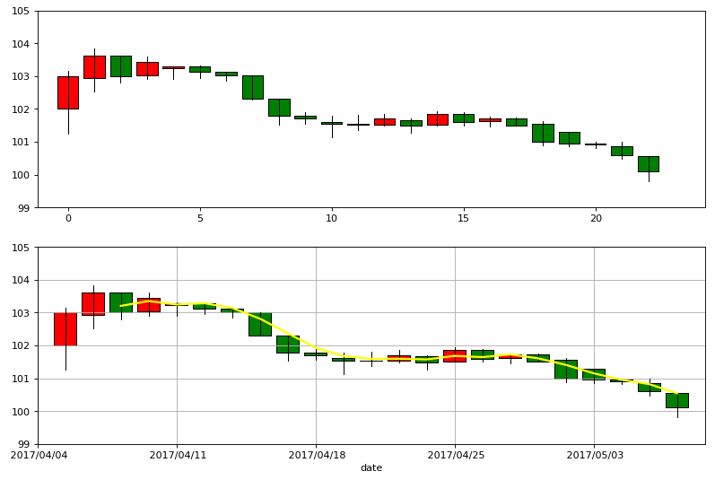

```python
import pandas as pd
```


```python
import matplotlib.pyplot as plt
```


```python
import numpy as np
```


```python
import matplotlib as mpl
```


```python
import mpl_finance as mplf
```


```python
gdzz0 = pd.read_csv('datacsv/gdzz.csv')
```


```python
gdzz1 = gdzz0.set_index('date')
```


```python
gdzz = gdzz1[['open','close','high','low']]
```


```python
gdzz # 在CSV上增加了前一天2017/04/04，和后一天2017/05/09，主要用于影响均线的显示
```


<div>
<style>
    .dataframe thead tr:only-child th {
        text-align: right;
    }

    .dataframe thead th {
        text-align: left;
    }

    .dataframe tbody tr th {
        vertical-align: top;
    }
</style>
<table border="1" class="dataframe">
  <thead>
    <tr style="text-align: right;">
      <th></th>
      <th>open</th>
      <th>close</th>
      <th>high</th>
      <th>low</th>
    </tr>
    <tr>
      <th>date</th>
      <th></th>
      <th></th>
      <th></th>
      <th></th>
    </tr>
  </thead>
  <tbody>
    <tr>
      <th>2017/04/04</th>
      <td>NaN</td>
      <td>NaN</td>
      <td>NaN</td>
      <td>NaN</td>
    </tr>
    <tr>
      <th>2017/04/05</th>
      <td>102.00</td>
      <td>103.00</td>
      <td>103.15</td>
      <td>101.25</td>
    </tr>
    <tr>
      <th>2017/04/06</th>
      <td>102.93</td>
      <td>103.61</td>
      <td>103.83</td>
      <td>102.52</td>
    </tr>
    <tr>
      <th>2017/04/07</th>
      <td>103.61</td>
      <td>103.00</td>
      <td>103.61</td>
      <td>102.80</td>
    </tr>
    <tr>
      <th>2017/04/10</th>
      <td>103.03</td>
      <td>103.44</td>
      <td>103.60</td>
      <td>102.91</td>
    </tr>
    <tr>
      <th>2017/04/11</th>
      <td>103.24</td>
      <td>103.29</td>
      <td>103.30</td>
      <td>102.91</td>
    </tr>
    <tr>
      <th>2017/04/12</th>
      <td>103.29</td>
      <td>103.12</td>
      <td>103.32</td>
      <td>102.95</td>
    </tr>
    <tr>
      <th>2017/04/13</th>
      <td>103.12</td>
      <td>103.01</td>
      <td>103.12</td>
      <td>102.85</td>
    </tr>
    <tr>
      <th>2017/04/14</th>
      <td>103.01</td>
      <td>102.31</td>
      <td>103.01</td>
      <td>102.29</td>
    </tr>
    <tr>
      <th>2017/04/17</th>
      <td>102.30</td>
      <td>101.78</td>
      <td>102.30</td>
      <td>101.53</td>
    </tr>
    <tr>
      <th>2017/04/18</th>
      <td>101.79</td>
      <td>101.70</td>
      <td>101.90</td>
      <td>101.55</td>
    </tr>
    <tr>
      <th>2017/04/19</th>
      <td>101.61</td>
      <td>101.54</td>
      <td>101.78</td>
      <td>101.13</td>
    </tr>
    <tr>
      <th>2017/04/20</th>
      <td>101.54</td>
      <td>101.53</td>
      <td>101.81</td>
      <td>101.36</td>
    </tr>
    <tr>
      <th>2017/04/21</th>
      <td>101.53</td>
      <td>101.71</td>
      <td>101.85</td>
      <td>101.48</td>
    </tr>
    <tr>
      <th>2017/04/24</th>
      <td>101.66</td>
      <td>101.48</td>
      <td>101.71</td>
      <td>101.27</td>
    </tr>
    <tr>
      <th>2017/04/25</th>
      <td>101.52</td>
      <td>101.85</td>
      <td>101.94</td>
      <td>101.50</td>
    </tr>
    <tr>
      <th>2017/04/26</th>
      <td>101.85</td>
      <td>101.60</td>
      <td>101.90</td>
      <td>101.50</td>
    </tr>
    <tr>
      <th>2017/04/27</th>
      <td>101.63</td>
      <td>101.72</td>
      <td>101.76</td>
      <td>101.46</td>
    </tr>
    <tr>
      <th>2017/04/28</th>
      <td>101.72</td>
      <td>101.50</td>
      <td>101.75</td>
      <td>101.50</td>
    </tr>
    <tr>
      <th>2017/05/02</th>
      <td>101.55</td>
      <td>101.00</td>
      <td>101.63</td>
      <td>100.88</td>
    </tr>
    <tr>
      <th>2017/05/03</th>
      <td>101.30</td>
      <td>100.95</td>
      <td>101.30</td>
      <td>100.86</td>
    </tr>
    <tr>
      <th>2017/05/04</th>
      <td>100.95</td>
      <td>100.91</td>
      <td>101.00</td>
      <td>100.82</td>
    </tr>
    <tr>
      <th>2017/05/05</th>
      <td>100.86</td>
      <td>100.60</td>
      <td>101.00</td>
      <td>100.48</td>
    </tr>
    <tr>
      <th>2017/05/08</th>
      <td>100.56</td>
      <td>100.11</td>
      <td>100.56</td>
      <td>99.80</td>
    </tr>
    <tr>
      <th>2017/05/09</th>
      <td>NaN</td>
      <td>NaN</td>
      <td>NaN</td>
      <td>NaN</td>
    </tr>
  </tbody>
</table>
</div>


```python
k = len(gdzz)
```


```python
k
```


    25


```python
gdzz2 = gdzz[1:k-1]
```


```python
maxdate = gdzz0['date'].max()
```


```python
maxdate = pd.to_datetime(maxdate)
```


```python
maxdate
```


    Timestamp('2017-05-09 00:00:00')


```python
mindate = gdzz0['date'].min()
```


```python
mindate = pd.to_datetime(mindate)
```


```python
mindate
```


    Timestamp('2017-04-04 00:00:00')


```python
plt.figure(2, figsize=(12,8), dpi=80)
ax1 = plt.subplot(211)
ax2 = plt.subplot(212)
```


```python
plt.sca(ax1)
```


```python
mplf.candlestick2_ochl(ax1, gdzz2['open'], gdzz2['close'], gdzz2['high'], gdzz2['low'], width=0.8, colorup='red', colordown='green', alpha=1)
```


```python
# plt.xlim(mindate,maxdate)
```


    (736423.0, 736458.0)


```python
plt.ylim(99,105)
```


    (99, 105)


```python
plt.sca(ax2)
```


```python
MA3 = gdzz['close'].rolling(window=3).mean()
MA3.plot(color='yellow', grid='on', linewidth=2.0, alpha=1)
```


    <matplotlib.axes._subplots.AxesSubplot at 0xc1b8dd8>


```python
MA3
```


    date
     2017/04/04           NaN
     2017/04/05           NaN
     2017/04/06           NaN
     2017/04/07    103.203333
     2017/04/10    103.350000
     2017/04/11    103.243333
     2017/04/12    103.283333
     2017/04/13    103.140000
     2017/04/14    102.813333
     2017/04/17    102.366667
     2017/04/18    101.930000
     2017/04/19    101.673333
     2017/04/20    101.590000
     2017/04/21    101.593333
     2017/04/24    101.573333
     2017/04/25    101.680000
     2017/04/26    101.643333
     2017/04/27    101.723333
     2017/04/28    101.606667
     2017/05/02    101.406667
     2017/05/03    101.150000
     2017/05/04    100.953333
     2017/05/05    100.820000
     2017/05/08    100.540000
     2017/05/09           NaN
    Name: close, dtype: float64


```python
mplf.candlestick2_ochl(ax2, gdzz['open'], gdzz['close'], gdzz['high'], gdzz['low'], width=0.8, colorup='red', colordown='green', alpha=1)
```


```python
plt.ylim(99,105)
```


    (99, 105)


```python
plt.show()
```




