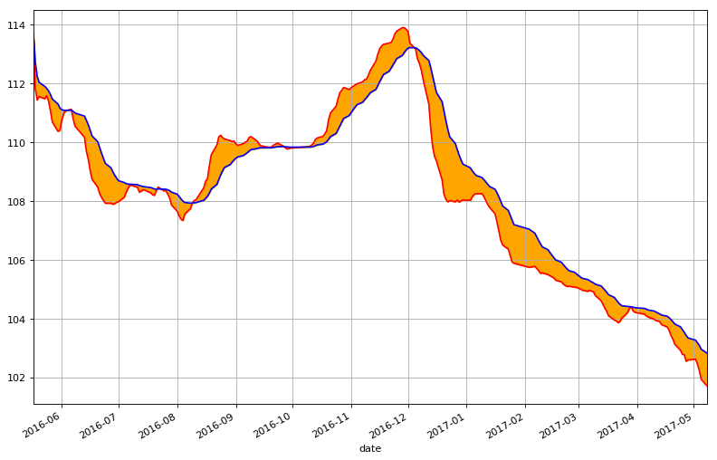
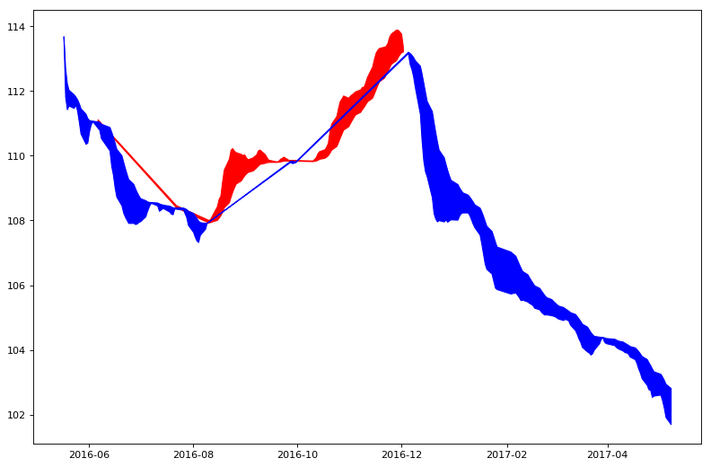
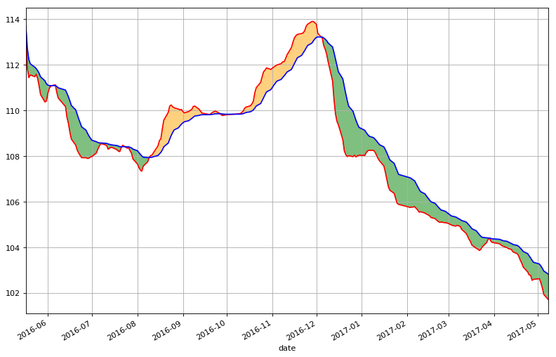

```python
import pandas as pd
```


```python
import numpy as np
```


```python
import matplotlib.pyplot as plt
```


```python
hfzz0 = pd.read_csv('datacsv/hfzz.csv')
```


```python
hfzz = hfzz0.set_index('date')
```


```python
MA12 = hfzz['close'].rolling(window=12).mean()
# 算术移动平均线
```


```python
EMA6 = hfzz['close'].ewm(span=6).mean()
# Span corresponds to what is commonly called an “N-day EW moving average”
# 指数加权移动平均线
```


```python
vEMA18 = EMA6.ewm(span=18).mean()
```


```python
import matplotlib.dates as mdates
```


```python
x = pd.to_datetime(hfzz0['date'])
```


```python
xx = x.astype(np.object)
```


```python
xxx = np.array(xx)
```


```python
# xxxx = mdates.date2num(xxx)
```


```python
EMA6.index = pd.to_datetime(EMA6.index)
```


```python
vEMA18.index = pd.to_datetime(vEMA18.index)
```


```python
plt.figure(figsize=(12,8), dpi=80)
ax1 = plt.subplot(111)
```


```python
EMA6.plot(color='red', alpha=1)
vEMA18.plot(color='Blue', grid='on', alpha=1)
```


    <matplotlib.axes._subplots.AxesSubplot at 0xc042940>


```python
ax1.fill_between(EMA6.index, EMA6, vEMA18, color='orange', alpha=1)
```


    <matplotlib.collections.PolyCollection at 0x3acf048>


```python
plt.show()
```





```python
EMA_data = pd.concat([EMA6, vEMA18], axis=1)
```


```python
EMA_data.columns = ['C6','C18']
```


```python
EMA618 = EMA_data[EMA_data['C6']>EMA_data['C18']]
```


```python
EMA6a = EMA618['C6']
```


```python
vEMA18a = EMA618['C18']
```


```python
EMA186 = EMA_data[EMA_data['C6']<=EMA_data['C18']]
```


```python
EMA6b = EMA186['C6']
```


```python
vEMA18b = EMA186['C18']
```


```python
plt.figure(figsize=(12,8), dpi=80)
ax2 = plt.subplot(111)
```


```python
ax2.fill_between(EMA6a.index, EMA6a, vEMA18a, color='red', alpha=1)
ax2.fill_between(EMA6b.index, EMA6b, vEMA18b, color='blue', alpha=1)
```


    <matplotlib.collections.PolyCollection at 0xc589e10>


```python
plt.show()
```





```python
EMA6aa = pd.concat([EMA6a, EMA6], axis=1)
```


```python
EMA6aa = EMA6aa['C6']
```


```python
vEMA18aa = pd.concat([vEMA18a, vEMA18], axis=1)
```


```python
vEMA18aa = vEMA18aa['C18']
```


```python
EMA6bb = pd.concat([EMA6b, EMA6], axis=1)
```


```python
EMA6bb = EMA6bb['C6']
```


```python
vEMA18bb = pd.concat([vEMA18b, vEMA18], axis=1)
```


```python
vEMA18bb = vEMA18bb['C18']
```


```python
plt.figure(figsize=(12,8), dpi=80)
ax3 = plt.subplot(111)
```


```python
ax3.fill_between(EMA6aa.index, EMA6aa, vEMA18aa, color='orange', alpha=0.5)
ax3.fill_between(EMA6bb.index, EMA6bb, vEMA18bb, color='green', alpha=0.5)
EMA6.plot(color='red', alpha=1)
vEMA18.plot(color='blue', grid='on', alpha=1)
```


    <matplotlib.axes._subplots.AxesSubplot at 0xc46b860>


```python
plt.show()
```




