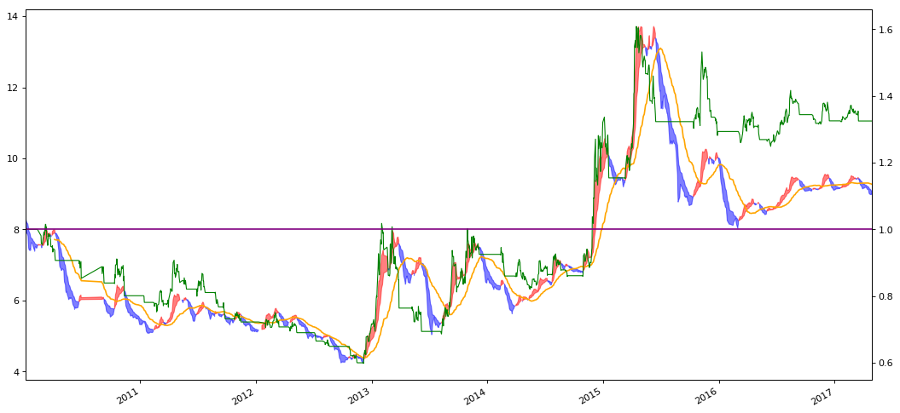

```python
import numpy as np
import pandas as pd
import matplotlib.pyplot as plt
```


```python
stock_data = pd.read_csv('datacsv/sz000001.csv')
stock_data = stock_data.set_index('date')
```


```python
MA_D1 = 6
MA_D2 = 18
```


```python
MA_1 = stock_data['close'].ewm(span=MA_D1).mean()
MA_2 = MA_1.ewm(span=MA_D2).mean()
```


```python
close_MA1 = pd.concat([stock_data['close'], MA_1], axis=1)
close_MA1_MA2 = pd.concat([close_MA1, MA_2], axis=1)
close_MA1_MA2.columns = ['close','MA1','MA2']
```


```python
Strategy_data = close_MA1_MA2[pd.to_datetime(close_MA1_MA2.index) >= pd.to_datetime('20100101')]
Strategy_data = Strategy_data[pd.to_datetime(Strategy_data.index) <= pd.to_datetime('20170501')]
```


```python
Buy_Point = Strategy_data.loc[Strategy_data['MA1'] > Strategy_data['MA2'],['close','MA1','MA2']]
Buy_Point.loc[0:,'point'] = 1
Buy_Point.columns = ['Buy_close','Buy_MA1','Buy_MA2','Buy_point']
```


```python
Sell_Point = Strategy_data.loc[Strategy_data['MA1'] <= Strategy_data['MA2'],['close','MA1','MA2']]
Sell_Point.loc[0:,'point'] = -1
Sell_Point.columns = ['Sell_close','Sell_MA1','Sell_MA2','Sell_point']
```


```python
Strategy_point_data = pd.concat([Buy_Point, Sell_Point], axis=1)
Strategy_point_data = Strategy_point_data.fillna(0)
Strategy_point_data['BS_close'] = Strategy_point_data['Buy_close']+Strategy_point_data['Sell_close']
Strategy_point_data['BS_MA1'] = Strategy_point_data['Buy_MA1']+Strategy_point_data['Sell_MA1']
Strategy_point_data['BS_MA2'] = Strategy_point_data['Buy_MA2']+Strategy_point_data['Sell_MA2']
Strategy_point_data['Points'] = Strategy_point_data['Buy_point']+Strategy_point_data['Sell_point']
Strategy_point_data = Strategy_point_data[['BS_close','BS_MA1','BS_MA2','Points']]
```


```python
Strategy_point_data['BS_point'] = Strategy_point_data['Points'].shift(1)
Strategy_point_data['BS_point'] = Strategy_point_data['BS_point'].fillna(-1)
Strategy_point_data['BS_point'] = (Strategy_point_data['Points'] - Strategy_point_data['BS_point'])/2
Strategy_point_data.head()
```


<div>

<table border="1" class="dataframe">
  <thead>
    <tr style="text-align: right;">
      <th></th>
      <th>BS_close</th>
      <th>BS_MA1</th>
      <th>BS_MA2</th>
      <th>Points</th>
      <th>BS_point</th>
    </tr>
  </thead>
  <tbody>
    <tr>
      <th>2010/01/04</th>
      <td>8.14</td>
      <td>8.190661</td>
      <td>8.301438</td>
      <td>-1.0</td>
      <td>0.0</td>
    </tr>
    <tr>
      <th>2010/01/05</th>
      <td>7.99</td>
      <td>8.133329</td>
      <td>8.283742</td>
      <td>-1.0</td>
      <td>0.0</td>
    </tr>
    <tr>
      <th>2010/01/06</th>
      <td>7.84</td>
      <td>8.049521</td>
      <td>8.259087</td>
      <td>-1.0</td>
      <td>0.0</td>
    </tr>
    <tr>
      <th>2010/01/07</th>
      <td>7.75</td>
      <td>7.963944</td>
      <td>8.228019</td>
      <td>-1.0</td>
      <td>0.0</td>
    </tr>
    <tr>
      <th>2010/01/08</th>
      <td>7.74</td>
      <td>7.899960</td>
      <td>8.193487</td>
      <td>-1.0</td>
      <td>0.0</td>
    </tr>
  </tbody>
</table>
</div>


```python
k = len(Strategy_point_data)
Strategy_point_data['order'] = np.arange(0,k,1)
```


```python
Strategy_signals = Strategy_point_data.loc[Strategy_point_data['BS_point'] != 0, ['BS_close','BS_MA1','BS_MA2','BS_point','order']]
Strategy_signals.columns = ['BS_close','BS_MA1','BS_MA2','point_BS','order_BS']
Strategy_signals.head()
```


<div>

<table border="1" class="dataframe">
  <thead>
    <tr style="text-align: right;">
      <th></th>
      <th>BS_close</th>
      <th>BS_MA1</th>
      <th>BS_MA2</th>
      <th>point_BS</th>
      <th>order_BS</th>
    </tr>
  </thead>
  <tbody>
    <tr>
      <th>2010/02/12</th>
      <td>7.68</td>
      <td>7.575632</td>
      <td>7.557422</td>
      <td>1.0</td>
      <td>29</td>
    </tr>
    <tr>
      <th>2010/02/23</th>
      <td>7.36</td>
      <td>7.508792</td>
      <td>7.553329</td>
      <td>-1.0</td>
      <td>31</td>
    </tr>
    <tr>
      <th>2010/02/26</th>
      <td>7.68</td>
      <td>7.555799</td>
      <td>7.543011</td>
      <td>1.0</td>
      <td>34</td>
    </tr>
    <tr>
      <th>2010/03/25</th>
      <td>7.63</td>
      <td>7.791936</td>
      <td>7.834953</td>
      <td>-1.0</td>
      <td>52</td>
    </tr>
    <tr>
      <th>2010/03/29</th>
      <td>8.08</td>
      <td>7.877927</td>
      <td>7.835911</td>
      <td>1.0</td>
      <td>54</td>
    </tr>
  </tbody>
</table>
</div>


```python
BP_price = Strategy_point_data.loc[Strategy_point_data['BS_point'] == 1, ['BS_close','BS_point','order']]
SP_price = Strategy_point_data.loc[Strategy_point_data['BS_point'] == -1, ['BS_close','BS_point','order']]
```


```python
BP_price['startdate'] = BP_price.index
BP_Profit = BP_price[['startdate','BS_close','BS_point']]
BP_Profit.columns = ['Start_date','Buy_close','Buy_point']
BP_Profit = BP_Profit.reset_index(drop=True)
```


```python
SP_price['enddate'] = SP_price.index
SP_Profit = SP_price[['enddate','BS_close','BS_point']]
SP_Profit.columns = ['End_date','Sell_close','Sell_point']
SP_Profit = SP_Profit.reset_index(drop=True)
```


```python
Strategy_Profit = pd.concat([BP_Profit, SP_Profit], axis=1, join_axes=[BP_Profit.index])
Strategy_Profit = Strategy_Profit[['Start_date','End_date','Buy_close','Sell_close']]
Strategy_Profit.head()
```


<div>

<table border="1" class="dataframe">
  <thead>
    <tr style="text-align: right;">
      <th></th>
      <th>Start_date</th>
      <th>End_date</th>
      <th>Buy_close</th>
      <th>Sell_close</th>
    </tr>
  </thead>
  <tbody>
    <tr>
      <th>0</th>
      <td>2010/02/12</td>
      <td>2010/02/23</td>
      <td>7.68</td>
      <td>7.36</td>
    </tr>
    <tr>
      <th>1</th>
      <td>2010/02/26</td>
      <td>2010/03/25</td>
      <td>7.68</td>
      <td>7.63</td>
    </tr>
    <tr>
      <th>2</th>
      <td>2010/03/29</td>
      <td>2010/04/08</td>
      <td>8.08</td>
      <td>7.72</td>
    </tr>
    <tr>
      <th>3</th>
      <td>2010/06/22</td>
      <td>2010/09/09</td>
      <td>6.26</td>
      <td>5.79</td>
    </tr>
    <tr>
      <th>4</th>
      <td>2010/10/12</td>
      <td>2010/11/12</td>
      <td>6.06</td>
      <td>5.78</td>
    </tr>
  </tbody>
</table>
</div>


```python
p = len(Strategy_Profit)
cash = 10000
Strategy_Profit.loc[0:0,'Startcash'] = cash
Startcash = Strategy_Profit['Startcash'][0]
batch = 100
brokerage = 2.5
Strategy_Profit.head(3)
```


<div>
<style>
    .dataframe thead tr:only-child th {
        text-align: right;
    }

    .dataframe thead th {
        text-align: left;
    }

    .dataframe tbody tr th {
        vertical-align: top;
    }
</style>
<table border="1" class="dataframe">
  <thead>
    <tr style="text-align: right;">
      <th></th>
      <th>Start_date</th>
      <th>End_date</th>
      <th>Buy_close</th>
      <th>Sell_close</th>
      <th>Startcash</th>
    </tr>
  </thead>
  <tbody>
    <tr>
      <th>0</th>
      <td>2010/02/12</td>
      <td>2010/02/23</td>
      <td>7.68</td>
      <td>7.36</td>
      <td>10000.0</td>
    </tr>
    <tr>
      <th>1</th>
      <td>2010/02/26</td>
      <td>2010/03/25</td>
      <td>7.68</td>
      <td>7.63</td>
      <td>NaN</td>
    </tr>
    <tr>
      <th>2</th>
      <td>2010/03/29</td>
      <td>2010/04/08</td>
      <td>8.08</td>
      <td>7.72</td>
      <td>NaN</td>
    </tr>
  </tbody>
</table>
</div>


```python
Strategy_Profit.loc[0:0,'Shares'] = (Startcash/batch)//Strategy_Profit['Buy_close']*batch
Strategy_Profit.loc[0:0,'Price'] = Strategy_Profit['Buy_close']*Strategy_Profit['Shares']
bb = Strategy_Profit['Price'][0]*brokerage/10000
if bb > 5:
    Strategy_Profit.loc[0:0,'Buy_Brokerage'] = bb
else:
    Strategy_Profit.loc[0:0,'Buy_Brokerage'] = 5
Strategy_Profit.loc[0:0,'Surplus'] = Strategy_Profit['Startcash'] - Strategy_Profit['Price'] - Strategy_Profit['Buy_Brokerage']
Strategy_Profit.loc[0:0,'AlphaCat'] = Strategy_Profit['Sell_close']*Strategy_Profit['Shares']
sb = Strategy_Profit['AlphaCat'][0]*brokerage/10000
if bb > 5:
    Strategy_Profit.loc[0:0,'Sell_Brokerage'] = sb
else:
    Strategy_Profit.loc[0:0,'Sell_Brokerage'] = 5
Strategy_Profit.loc[0:0,'Tax'] = Strategy_Profit['AlphaCat']*1.0/1000
Strategy_Profit.loc[0:0,'Endcash'] = Strategy_Profit['AlphaCat'] + Strategy_Profit['Surplus'] - Strategy_Profit['Sell_Brokerage'] - Strategy_Profit['Tax']
Strategy_Profit.loc[1:1,'Startcash'] = Strategy_Profit['Endcash'][0]
Strategy_Profit.head(3)
```


<div>

<table border="1" class="dataframe">
  <thead>
    <tr style="text-align: right;">
      <th></th>
      <th>Start_date</th>
      <th>End_date</th>
      <th>Buy_close</th>
      <th>Sell_close</th>
      <th>Startcash</th>
      <th>Shares</th>
      <th>Price</th>
      <th>Buy_Brokerage</th>
      <th>Surplus</th>
      <th>AlphaCat</th>
      <th>Sell_Brokerage</th>
      <th>Tax</th>
      <th>Endcash</th>
    </tr>
  </thead>
  <tbody>
    <tr>
      <th>0</th>
      <td>2010/02/12</td>
      <td>2010/02/23</td>
      <td>7.68</td>
      <td>7.36</td>
      <td>10000.000</td>
      <td>1300.0</td>
      <td>9984.0</td>
      <td>5.0</td>
      <td>11.0</td>
      <td>9568.0</td>
      <td>5.0</td>
      <td>9.568</td>
      <td>9564.432</td>
    </tr>
    <tr>
      <th>1</th>
      <td>2010/02/26</td>
      <td>2010/03/25</td>
      <td>7.68</td>
      <td>7.63</td>
      <td>9564.432</td>
      <td>NaN</td>
      <td>NaN</td>
      <td>NaN</td>
      <td>NaN</td>
      <td>NaN</td>
      <td>NaN</td>
      <td>NaN</td>
      <td>NaN</td>
    </tr>
    <tr>
      <th>2</th>
      <td>2010/03/29</td>
      <td>2010/04/08</td>
      <td>8.08</td>
      <td>7.72</td>
      <td>NaN</td>
      <td>NaN</td>
      <td>NaN</td>
      <td>NaN</td>
      <td>NaN</td>
      <td>NaN</td>
      <td>NaN</td>
      <td>NaN</td>
      <td>NaN</td>
    </tr>
  </tbody>
</table>
</div>


```python
for i in range(1,p):
    Strategy_Profit.loc[i:i,'Shares'] = (Strategy_Profit['Startcash']/batch)//Strategy_Profit['Buy_close']*batch
    Strategy_Profit.loc[i:i,'Price'] = Strategy_Profit['Buy_close']*Strategy_Profit['Shares']
    bbr = Strategy_Profit['Price']*brokerage/10000
    if bbr[i-1] > 5:
        Strategy_Profit.loc[i:i,'Buy_Brokerage'] = bbr[i-1]
    else:
        Strategy_Profit.loc[i:i,'Buy_Brokerage'] = 5
    Strategy_Profit.loc[i:i,'Surplus'] = Strategy_Profit['Startcash'] - Strategy_Profit['Price'] - Strategy_Profit['Buy_Brokerage']
    Strategy_Profit.loc[i:i,'AlphaCat'] = Strategy_Profit['Sell_close']*Strategy_Profit['Shares']
    sbr = Strategy_Profit['AlphaCat']*brokerage/10000
    if sbr[i-1] > 5:
        Strategy_Profit.loc[i:i,'Sell_Brokerage'] = sbr[i-1]
    else:
        Strategy_Profit.loc[i:i,'Sell_Brokerage'] = 5
    Strategy_Profit.loc[i:i,'Tax'] = Strategy_Profit['AlphaCat']*1.0/1000
    Strategy_Profit.loc[i:i,'Endcash'] = Strategy_Profit['AlphaCat'] + Strategy_Profit['Surplus'] - Strategy_Profit['Sell_Brokerage'] - Strategy_Profit['Tax']
    Strategy_Profit.loc[i+1:i+1,'Startcash'] = Strategy_Profit['Endcash'][i]
```


```python
Strategy_Profit['Profit_real'] = Strategy_Profit['Endcash']/cash
Strategy_Profit.head()
```


<div>

<table border="1" class="dataframe">
  <thead>
    <tr style="text-align: right;">
      <th></th>
      <th>Start_date</th>
      <th>End_date</th>
      <th>Buy_close</th>
      <th>Sell_close</th>
      <th>Startcash</th>
      <th>Shares</th>
      <th>Price</th>
      <th>Buy_Brokerage</th>
      <th>Surplus</th>
      <th>AlphaCat</th>
      <th>Sell_Brokerage</th>
      <th>Tax</th>
      <th>Endcash</th>
      <th>Profit_real</th>
    </tr>
  </thead>
  <tbody>
    <tr>
      <th>0</th>
      <td>2010/02/12</td>
      <td>2010/02/23</td>
      <td>7.68</td>
      <td>7.36</td>
      <td>10000.000</td>
      <td>1300.0</td>
      <td>9984.0</td>
      <td>5.0</td>
      <td>11.000</td>
      <td>9568.0</td>
      <td>5.0</td>
      <td>9.568</td>
      <td>9564.432</td>
      <td>0.956443</td>
    </tr>
    <tr>
      <th>1</th>
      <td>2010/02/26</td>
      <td>2010/03/25</td>
      <td>7.68</td>
      <td>7.63</td>
      <td>9564.432</td>
      <td>1200.0</td>
      <td>9216.0</td>
      <td>5.0</td>
      <td>343.432</td>
      <td>9156.0</td>
      <td>5.0</td>
      <td>9.156</td>
      <td>9485.276</td>
      <td>0.948528</td>
    </tr>
    <tr>
      <th>2</th>
      <td>2010/03/29</td>
      <td>2010/04/08</td>
      <td>8.08</td>
      <td>7.72</td>
      <td>9485.276</td>
      <td>1100.0</td>
      <td>8888.0</td>
      <td>5.0</td>
      <td>592.276</td>
      <td>8492.0</td>
      <td>5.0</td>
      <td>8.492</td>
      <td>9070.784</td>
      <td>0.907078</td>
    </tr>
    <tr>
      <th>3</th>
      <td>2010/06/22</td>
      <td>2010/09/09</td>
      <td>6.26</td>
      <td>5.79</td>
      <td>9070.784</td>
      <td>1400.0</td>
      <td>8764.0</td>
      <td>5.0</td>
      <td>301.784</td>
      <td>8106.0</td>
      <td>5.0</td>
      <td>8.106</td>
      <td>8394.678</td>
      <td>0.839468</td>
    </tr>
    <tr>
      <th>4</th>
      <td>2010/10/12</td>
      <td>2010/11/12</td>
      <td>6.06</td>
      <td>5.78</td>
      <td>8394.678</td>
      <td>1300.0</td>
      <td>7878.0</td>
      <td>5.0</td>
      <td>511.678</td>
      <td>7514.0</td>
      <td>5.0</td>
      <td>7.514</td>
      <td>8013.164</td>
      <td>0.801316</td>
    </tr>
  </tbody>
</table>
</div>


```python
Strategy_Profit_Buy = Strategy_Profit[['Start_date','Buy_close','Shares','Buy_Brokerage','Surplus','Sell_Brokerage']]
Strategy_Profit_Buy = Strategy_Profit_Buy.set_index('Start_date')
Strategy_Profit_Sell = Strategy_Profit[['End_date','Tax','Profit_real','Endcash']]
Strategy_Profit_Sell = Strategy_Profit_Sell.set_index('End_date')
Strategy_Profit_real_ALL = pd.concat([Strategy_point_data,Strategy_Profit_Buy], axis=1)
Strategy_Profit_real_ALL['BS_point'] = Strategy_Profit_real_ALL['BS_point']+Strategy_Profit_real_ALL['Points']
```


```python
Strategy_Profit_real_ALL = pd.concat([Strategy_Profit_real_ALL,Strategy_Profit_Sell], axis=1)
Strategy_Profit_real_ALL = Strategy_Profit_real_ALL[['order','Shares','Buy_close','Buy_Brokerage','Surplus','BS_close','BS_MA1','BS_MA2','Sell_Brokerage','Tax','Endcash','Profit_real','BS_point']]
```


```python
if Strategy_Profit_real_ALL.loc[Strategy_Profit_real_ALL['order'] == 0,'BS_point'].values != 2:
    Strategy_Profit_real_ALL.loc[Strategy_Profit_real_ALL['order'] == 0,['Buy_close','Buy_Brokerage','Sell_Brokerage','Tax','Shares']] = 0
    Strategy_Profit_real_ALL.loc[Strategy_Profit_real_ALL['order'] == 0,['Surplus','Endcash']] = cash
    Strategy_Profit_real_ALL.loc[Strategy_Profit_real_ALL['order'] == 0,'Profit_real'] = 1
```


```python
for j in range(1,k):
    sh = Strategy_Profit_real_ALL.loc[Strategy_Profit_real_ALL['order'] == j-1,'Shares'].values
    bc = Strategy_Profit_real_ALL.loc[Strategy_Profit_real_ALL['order'] == j-1,'Buy_close'].values
    bbk = Strategy_Profit_real_ALL.loc[Strategy_Profit_real_ALL['order'] == j-1,'Buy_Brokerage'].values
    sp = Strategy_Profit_real_ALL.loc[Strategy_Profit_real_ALL['order'] == j-1,'Surplus'].values
    sbk = Strategy_Profit_real_ALL.loc[Strategy_Profit_real_ALL['order'] == j-1,'Sell_Brokerage'].values
    ec = Strategy_Profit_real_ALL.loc[Strategy_Profit_real_ALL['order'] == j-1,'Endcash'].values
    #
    bsp = Strategy_Profit_real_ALL.loc[Strategy_Profit_real_ALL['order'] == j,'BS_point'].values
    if bsp == 1.0 or bsp == -2:
        Strategy_Profit_real_ALL.loc[Strategy_Profit_real_ALL['order'] == j,'Shares'] = sh
        Strategy_Profit_real_ALL.loc[Strategy_Profit_real_ALL['order'] == j,'Buy_close'] = bc
        Strategy_Profit_real_ALL.loc[Strategy_Profit_real_ALL['order'] == j,'Buy_Brokerage'] = bbk
        Strategy_Profit_real_ALL.loc[Strategy_Profit_real_ALL['order'] == j,'Surplus'] = sp
        Strategy_Profit_real_ALL.loc[Strategy_Profit_real_ALL['order'] == j,'Sell_Brokerage'] = sbk
    if bsp == -1.0:
        Strategy_Profit_real_ALL.loc[Strategy_Profit_real_ALL['order'] == j,'Shares'] = 0
        Strategy_Profit_real_ALL.loc[Strategy_Profit_real_ALL['order'] == j,'Buy_close'] = 0
        Strategy_Profit_real_ALL.loc[Strategy_Profit_real_ALL['order'] == j,'Buy_Brokerage'] = 0
        Strategy_Profit_real_ALL.loc[Strategy_Profit_real_ALL['order'] == j,'Surplus'] = ec        
        Strategy_Profit_real_ALL.loc[Strategy_Profit_real_ALL['order'] == j,'Endcash'] = ec
        Strategy_Profit_real_ALL.loc[Strategy_Profit_real_ALL['order'] == j,'Sell_Brokerage'] = 0
```


```python
if bsp >= -1.0:
    Strategy_Profit_real_ALL.loc[0:k,'Tax'] = Strategy_Profit_real_ALL['BS_close']*Strategy_Profit_real_ALL['Shares']/1000
    Strategy_Profit_real_ALL.loc[0:k,'Profit_real'] = (Strategy_Profit_real_ALL['BS_close']*Strategy_Profit_real_ALL['Shares']+Strategy_Profit_real_ALL['Surplus']-Strategy_Profit_real_ALL['Sell_Brokerage']-Strategy_Profit_real_ALL['Tax'])/cash
```


```python
Strategy_Profit_real_ALL[k-1:k]
# Strategy_Profit_real_ALL[337:354]
# 2011/08/15～2011/09/08
```


<div>

<table border="1" class="dataframe">
  <thead>
    <tr style="text-align: right;">
      <th></th>
      <th>order</th>
      <th>Shares</th>
      <th>Buy_close</th>
      <th>Buy_Brokerage</th>
      <th>Surplus</th>
      <th>BS_close</th>
      <th>BS_MA1</th>
      <th>BS_MA2</th>
      <th>Sell_Brokerage</th>
      <th>Tax</th>
      <th>Endcash</th>
      <th>Profit_real</th>
      <th>BS_point</th>
    </tr>
  </thead>
  <tbody>
    <tr>
      <th>2017/04/28</th>
      <td>1706</td>
      <td>0.0</td>
      <td>0.0</td>
      <td>0.0</td>
      <td>13250.243</td>
      <td>8.99</td>
      <td>8.984057</td>
      <td>9.073816</td>
      <td>0.0</td>
      <td>0.0</td>
      <td>13250.243</td>
      <td>1.325024</td>
      <td>-1.0</td>
    </tr>
  </tbody>
</table>
</div>


```python
Strategy_trend_data = pd.concat([Buy_Point, Sell_Point], axis=1)
Strategy_trend_data.index = pd.to_datetime(Strategy_trend_data.index)
Strategy_trend_data['MA60'] = Strategy_Profit_real_ALL['BS_close'].rolling(window=60).mean()
Strategy_trend_data.index
```


    DatetimeIndex(['2010-01-04', '2010-01-05', '2010-01-06', '2010-01-07',
                   '2010-01-08', '2010-01-11', '2010-01-12', '2010-01-13',
                   '2010-01-14', '2010-01-15',
                   ...
                   '2017-04-17', '2017-04-18', '2017-04-19', '2017-04-20',
                   '2017-04-21', '2017-04-24', '2017-04-25', '2017-04-26',
                   '2017-04-27', '2017-04-28'],
                  dtype='datetime64[ns]', length=1707, freq=None)


```python
Strategy_Profit_real_ALL.index = pd.to_datetime(Strategy_Profit_real_ALL.index)
```


```python
plt.figure(2,figsize=(16,8), dpi=80)
ax1 = plt.subplot(111)
```


```python
ax1.fill_between(Strategy_trend_data.index, Strategy_trend_data.Buy_MA1, Strategy_trend_data.Buy_MA2, color='red', alpha=0.5)
ax1.fill_between(Strategy_trend_data.index, Strategy_trend_data.Sell_MA1, Strategy_trend_data.Sell_MA2, color='blue', alpha=0.5)
Strategy_trend_data['MA60'].plot(color='orange', alpha=1)
```


    <matplotlib.axes._subplots.AxesSubplot at 0xc62f9b0>


```python
ax2 = ax1.twinx()
Strategy_Profit_real_ALL['Profit_real'].plot(color='green', linewidth='1').axhline(y=1, color='purple', linewidth='1.5')
```


    <matplotlib.lines.Line2D at 0xc7a9240>


```python
plt.show()
```




