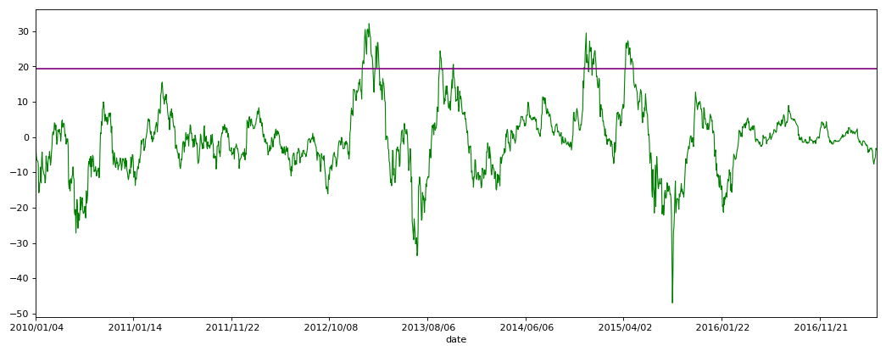

```python
import numpy as np
import pandas as pd
import matplotlib.pyplot as plt
```


```python
stock_data = pd.read_csv('datacsv/sz000001.csv')
stock_data = stock_data.set_index('date')
```


```python
MA = stock_data['close'].rolling(window=60).mean()
close_MA = pd.concat([stock_data['close'], MA], axis=1)
close_MA.columns = ['close','MA']
```


```python
Strategy_data = close_MA[pd.to_datetime(close_MA.index) >= pd.to_datetime('20100101')]
```


```python
Strategy_data.loc[:,'BIAS'] = (Strategy_data.loc[:,'close']-Strategy_data.loc[:,'MA'])/Strategy_data.loc[:,'close']*100
```


```python
BIAS_ltd = Strategy_data.max()*0.6
b = BIAS_ltd['BIAS']
```


```python
plt.figure(2, figsize=(16,6), dpi=80)
plt.subplot(111)
Strategy_data['BIAS'].plot(color='green', linewidth='1').axhline(y=b, color='purple', linewidth='1.5')
plt.show()
```





```python


```
