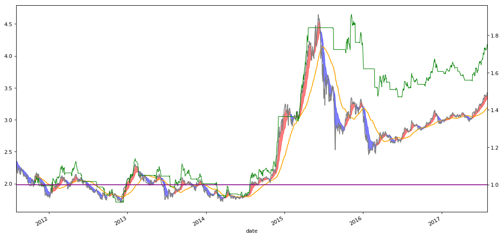

```python
import numpy as np
import pandas as pd
import matplotlib.pyplot as plt
```


```python
# 读取交易行情CSV文件；将时间序列用to_datetime格式化，并用sort_index排序
# 建议在csv文件就把date列设置成日期格式
# 若没有进行时间的数据清洗，有可能出现图表断裂、面积线条状
stock_data = pd.read_csv('datacsv/510180.csv')
stock_data = stock_data.set_index('date')
stock_data.index = pd.to_datetime(stock_data.index)
stock_data = stock_data.sort_index(axis=0, ascending=True)
```


```python
# 设置均线日
MA_D1 = 6
MA_D2 = 18
MA_D3 = 60
stadate = '20110801'
enddate = '20170801'
```


```python
# 窦为的神仙趋势：MA_1是收盘价的6日EWM，MA_2是6日EWM的18日EWM
MA_1 = stock_data['close'].ewm(span=MA_D1).mean()
MA_2 = MA_1.ewm(span=MA_D2).mean()
# MA_3是60日均线
MA_3 = stock_data['close'].rolling(window=MA_D3).mean()
```


```python
# 将收盘价、MA1、MA2、MA3合并成一个表，方便计算
close_MA1 = pd.concat([stock_data['close'], MA_1], axis=1)
close_MA1_MA2 = pd.concat([close_MA1, MA_2], axis=1)
close_MA1_MA2_MA3 = pd.concat([close_MA1_MA2, MA_3], axis=1)
close_MA1_MA2_MA3.columns = ['close','MA1','MA2','MA3']
```


```python
# 设置起止时间段
Strategy_data = close_MA1_MA2_MA3[pd.to_datetime(close_MA1_MA2_MA3.index) >= pd.to_datetime(stadate)]
Strategy_data = Strategy_data[pd.to_datetime(Strategy_data.index) <= pd.to_datetime(enddate)]
```


```python
# 计算乖离率BIAS，已经最大乖离率参考，这里有点未来函数的感觉（这是不好的！），或可理解为对历史乖离率的一个参考，我觉得还需要在改进！
Strategy_data.loc[:,'BIAS'] = (Strategy_data['close'].values-Strategy_data['MA3'].values)/Strategy_data['close'].values*100
BIAS_max = Strategy_data['BIAS'].max()
bL = BIAS_max*0.8
```


```python
bL
```


    19.801663073606498


```python
# 选择窦为神仙趋势中的上升趋势，即MA1>MA2；并将这些收盘价设置为买点（1）
Buy_Point = Strategy_data.loc[Strategy_data['MA1'] > Strategy_data['MA2'],['close','MA1','MA2','MA3','BIAS']]
Buy_Point.loc[0:,'point'] = 1
Buy_Point.columns = ['Buy_close','Buy_MA1','Buy_MA2','Buy_MA3','Buy_BIAS','Buy_point']
```


```python
# 选择窦为神仙趋势中的下降趋势，即MA1<=MA2；并将这些收盘价设置为卖点（-1）
Sell_Point = Strategy_data.loc[Strategy_data['MA1'] <= Strategy_data['MA2'],['close','MA1','MA2','MA3','BIAS']]
Sell_Point.loc[0:,'point'] = -1
Sell_Point.columns = ['Sell_close','Sell_MA1','Sell_MA2','Sell_MA3','Sell_BIAS','Sell_point']
```


```python
# 将买表、卖表合并；形成一个买卖（1，-1）的信号点Point，但这并不够表示实际交易，缺少买点、卖点、持仓、空仓区分
Strategy_point_data = pd.concat([Buy_Point, Sell_Point], axis=1)
Strategy_point_data = Strategy_point_data.fillna(0)
Strategy_point_data['BS_close'] = Strategy_point_data['Buy_close']+Strategy_point_data['Sell_close']
Strategy_point_data['BS_MA1'] = Strategy_point_data['Buy_MA1']+Strategy_point_data['Sell_MA1']
Strategy_point_data['BS_MA2'] = Strategy_point_data['Buy_MA2']+Strategy_point_data['Sell_MA2']
Strategy_point_data['BS_MA3'] = Strategy_point_data['Buy_MA3']+Strategy_point_data['Sell_MA3']
Strategy_point_data['BS_BIAS'] = Strategy_point_data['Buy_BIAS']+Strategy_point_data['Sell_BIAS']
Strategy_point_data['Points'] = Strategy_point_data['Buy_point']+Strategy_point_data['Sell_point']
Strategy_point_data = Strategy_point_data[['BS_close','BS_MA1','BS_MA2','BS_MA3','BS_BIAS','Points']]
```


```python
# 设置一个排序序列，用于对照、显示调用
k = len(Strategy_point_data)
Strategy_point_data['order'] = np.arange(0,k,1)
```


```python
# 将最后一个交易日的买卖信号点设置为卖点（-1），因此规定最后一个交易日为卖出，才能形成买卖闭环
Strategy_point_data.loc[k-1:k,'Points'] = -1
Strategy_point_data[k-1:k]
```


<div>
<style  type="text/css">
    .dataframe thead tr:only-child th {
        text-align: right;
    }

    .dataframe thead th {
        text-align: left;
    }

    .dataframe tbody tr th {
        vertical-align: top;
    }
</style>
<table border="1" class="dataframe">
  <thead>
    <tr style="text-align: right;">
      <th></th>
      <th>BS_close</th>
      <th>BS_MA1</th>
      <th>BS_MA2</th>
      <th>BS_MA3</th>
      <th>BS_BIAS</th>
      <th>Points</th>
      <th>order</th>
    </tr>
    <tr>
      <th>date</th>
      <th></th>
      <th></th>
      <th></th>
      <th></th>
      <th></th>
      <th></th>
      <th></th>
    </tr>
  </thead>
  <tbody>
    <tr>
      <th>2017-08-01</th>
      <td>3.423</td>
      <td>3.38623</td>
      <td>3.324738</td>
      <td>3.1888</td>
      <td>6.841952</td>
      <td>-1.0</td>
      <td>1457</td>
    </tr>
  </tbody>
</table>
</div>


```python
# 通过错位.shift(1)函数，形成一个买卖持空仓（1，-1，0）的信号点BS_point，有买点、卖点、持仓/空仓点；
# 但是这依然未能表示全部实际交易过程，缺少开仓、平仓、持仓、空仓区分
Strategy_point_data['BS_point'] = Strategy_point_data['Points'].shift(1)
Strategy_point_data['BS_point'] = Strategy_point_data['BS_point'].fillna(-1)
Strategy_point_data['BS_point'] = (Strategy_point_data['Points'] - Strategy_point_data['BS_point'])/2
```


```python
# 将所有乖离率大于历史最高乖离率的乖离率信号点设置成卖点（-1）
Strategy_point_data.loc[Strategy_point_data['BS_BIAS'] > bL,'BIAS_point'] = -1
```


```python
# 出现乖离率高位卖点后，要将原来卖点、持仓、空仓状态都设置为空仓（-1）；
# 因此，当原来的持仓空仓（0）+上一个交易时间的乖离率卖点（-1）== -1 时，将乖离率信号点设置为（-1）；
# 当原来的信号点BS_point为卖点（-1）时，同样将乖离率信号点设置为（-1）。
for h in range(0,k):
    bsbp = Strategy_point_data.loc[Strategy_point_data['order'] == h-1,'BIAS_point'].values
    poi = Strategy_point_data.loc[Strategy_point_data['order'] == h,'Points'].values
    bspo = Strategy_point_data.loc[Strategy_point_data['order'] == h,'BS_point'].values
    if  bspo + bsbp == -1 or poi == -1:
        Strategy_point_data.loc[Strategy_point_data['order'] == h,'BIAS_point'] = -1
```


```python
# 将乖离率信号点的空值部分先设置为（1），设置一个“含乖离率判定的买卖信号点”BS_BIAS_point，信号为BIAS_point的错位；
# 将BS_BIAS_point的空值（一般就是第一行的值）设为（-1），BIAS_point和将BS_BIAS_point的空值相减之后得到一个新的信号；
# 这个信号为“含乖离率判定的买卖信号点”，有买点、卖点、持空仓点（1，-1，0）；
# 但是这依然未能表示全部实际交易过程，缺少开仓、平仓、持仓、空仓区分
Strategy_point_data['BIAS_point'] = Strategy_point_data['BIAS_point'].fillna(1)
Strategy_point_data['BS_BIAS_point'] = Strategy_point_data['BIAS_point'].shift(1)
Strategy_point_data['BS_BIAS_point'] = Strategy_point_data['BS_BIAS_point'].fillna(-1)
Strategy_point_data['BS_BIAS_point'] = (Strategy_point_data['BIAS_point'] - Strategy_point_data['BS_BIAS_point'])/2
```


```python
# 将“含乖离率判定的买卖信号点”的买点、卖点取出来
# 通过上一个代码块，可以使得每次取出的买卖点中，保证第一个时间若符合策略要求则为买入点（1）；
# 而不会出现仅仅一个持仓点（0），这样会导致画图时图像不能出来，一片空白。
Strategy_signals = Strategy_point_data.loc[Strategy_point_data['BS_BIAS_point'] != 0, ['BS_close','BS_MA1','BS_MA2','BS_BIAS_point','order']]
Strategy_signals.columns = ['BS_close','BS_MA1','BS_MA2','point_BS','order_BS']
```


```python
# 再将买点和卖点单独成表
BP_price = Strategy_point_data.loc[Strategy_point_data['BS_BIAS_point'] == 1, ['BS_close','BS_BIAS_point','order']]
SP_price = Strategy_point_data.loc[Strategy_point_data['BS_BIAS_point'] == -1, ['BS_close','BS_BIAS_point','order']]
```


```python
# 买点表设置一个startdate，为开仓时间，开仓信号点Buy_point位（1）
BP_price['startdate'] = BP_price.index
BP_Profit = BP_price[['startdate','BS_close','BS_BIAS_point']]
BP_Profit.columns = ['Start_date','Buy_close','Buy_point']
BP_Profit = BP_Profit.reset_index(drop=True)
```


```python
# 卖点表设置一个enddate，为平仓时间，开仓信号点Sell_point位（-1）
SP_price['enddate'] = SP_price.index
SP_Profit = SP_price[['enddate','BS_close','BS_BIAS_point']]
SP_Profit.columns = ['End_date','Sell_close','Sell_point']
SP_Profit = SP_Profit.reset_index(drop=True)
```


```python
# 将两个表合并，形成一个有开仓时间、平仓时间、开仓价格、平仓价格的交易表
Strategy_Profit = pd.concat([BP_Profit, SP_Profit], axis=1, join_axes=[BP_Profit.index])
Strategy_Profit = Strategy_Profit[['Start_date','End_date','Buy_close','Sell_close']]
```


```python
Strategy_Profit.tail()
```


<div>
<style  type="text/css">
    .dataframe thead tr:only-child th {
        text-align: right;
    }

    .dataframe thead th {
        text-align: left;
    }

    .dataframe tbody tr th {
        vertical-align: top;
    }
</style>
<table border="1" class="dataframe">
  <thead>
    <tr style="text-align: right;">
      <th></th>
      <th>Start_date</th>
      <th>End_date</th>
      <th>Buy_close</th>
      <th>Sell_close</th>
    </tr>
  </thead>
  <tbody>
    <tr>
      <th>33</th>
      <td>2017-01-17</td>
      <td>2017-03-06</td>
      <td>2.993</td>
      <td>3.058</td>
    </tr>
    <tr>
      <th>34</th>
      <td>2017-03-16</td>
      <td>2017-03-20</td>
      <td>3.087</td>
      <td>3.054</td>
    </tr>
    <tr>
      <th>35</th>
      <td>2017-03-24</td>
      <td>2017-03-30</td>
      <td>3.080</td>
      <td>3.043</td>
    </tr>
    <tr>
      <th>36</th>
      <td>2017-04-05</td>
      <td>2017-04-18</td>
      <td>3.102</td>
      <td>3.055</td>
    </tr>
    <tr>
      <th>37</th>
      <td>2017-05-23</td>
      <td>2017-08-01</td>
      <td>3.044</td>
      <td>3.423</td>
    </tr>
  </tbody>
</table>
</div>


```python
# 设置资金cash，第一行Startcash列为初始资金cash
# batch：1手=100股
# 佣金比例brokerage：万分之2.5
p = len(Strategy_Profit)
cash = 10000
Strategy_Profit.loc[0:0,'Startcash'] = cash
Startcash = Strategy_Profit['Startcash'][0]
batch = 100
brokerage = 2.5
Strategy_Profit.head()
```


<div>
<style  type="text/css">
    .dataframe thead tr:only-child th {
        text-align: right;
    }

    .dataframe thead th {
        text-align: left;
    }

    .dataframe tbody tr th {
        vertical-align: top;
    }
</style>
<table border="1" class="dataframe">
  <thead>
    <tr style="text-align: right;">
      <th></th>
      <th>Start_date</th>
      <th>End_date</th>
      <th>Buy_close</th>
      <th>Sell_close</th>
      <th>Startcash</th>
    </tr>
  </thead>
  <tbody>
    <tr>
      <th>0</th>
      <td>2011-10-27</td>
      <td>2011-11-17</td>
      <td>2.074</td>
      <td>2.066</td>
      <td>10000.0</td>
    </tr>
    <tr>
      <th>1</th>
      <td>2012-01-11</td>
      <td>2012-03-16</td>
      <td>1.910</td>
      <td>2.046</td>
      <td>NaN</td>
    </tr>
    <tr>
      <th>2</th>
      <td>2012-04-16</td>
      <td>2012-05-16</td>
      <td>2.026</td>
      <td>2.026</td>
      <td>NaN</td>
    </tr>
    <tr>
      <th>3</th>
      <td>2012-05-29</td>
      <td>2012-06-04</td>
      <td>2.098</td>
      <td>2.014</td>
      <td>NaN</td>
    </tr>
    <tr>
      <th>4</th>
      <td>2012-08-09</td>
      <td>2012-08-13</td>
      <td>1.918</td>
      <td>1.866</td>
      <td>NaN</td>
    </tr>
  </tbody>
</table>
</div>


```python
# 建仓股数Shares = （资金/100股）整除建仓价*100股
# 建仓总价Price = 建仓价格 * 建仓股数Shares
# 佣金bb，最低5元，建仓时的佣金Buy_Brokerage（Price），平仓时的佣金Sell_Brokerage（AlphaCat）
# 剩余未交易资金Surplus = 初始资金（剩余总资金）- 建仓总价 - 佣金
# 平仓总价AlphaCat = 平仓价格 * 建仓股数Shares
# 印花税Tax = 平仓总价AlphaCat的千分之一
# 剩余总资金Endcash = 平仓总价 + 未交易资金 - 平仓佣金 - 印花税
```


```python
Strategy_Profit.loc[0:0,'Shares'] = (Startcash/batch)//Strategy_Profit['Buy_close']*batch
Strategy_Profit.loc[0:0,'Price'] = Strategy_Profit['Buy_close']*Strategy_Profit['Shares']
bb = Strategy_Profit['Price'][0]*brokerage/10000
if bb > 5:
    Strategy_Profit.loc[0:0,'Buy_Brokerage'] = bb
else:
    Strategy_Profit.loc[0:0,'Buy_Brokerage'] = 5
# ===============================================
Strategy_Profit.loc[0:0,'Surplus'] = Strategy_Profit['Startcash'] - Strategy_Profit['Price'] - Strategy_Profit['Buy_Brokerage']
Strategy_Profit.loc[0:0,'AlphaCat'] = Strategy_Profit['Sell_close']*Strategy_Profit['Shares']
sb = Strategy_Profit['AlphaCat'][0]*brokerage/10000
if bb > 5:
    Strategy_Profit.loc[0:0,'Sell_Brokerage'] = sb
else:
    Strategy_Profit.loc[0:0,'Sell_Brokerage'] = 5
Strategy_Profit.loc[0:0,'Tax'] = Strategy_Profit['AlphaCat']*1.0/1000
Strategy_Profit.loc[0:0,'Endcash'] = Strategy_Profit['AlphaCat'] + Strategy_Profit['Surplus'] - Strategy_Profit['Sell_Brokerage'] - Strategy_Profit['Tax']
Strategy_Profit.loc[1:1,'Startcash'] = Strategy_Profit['Endcash'][0]

```


```python
# 以上是设置了收益表的第一行，下面将用For循环，设置剩余整表
Strategy_Profit.head()
```


<div>
<style  type="text/css">
    .dataframe thead tr:only-child th {
        text-align: right;
    }

    .dataframe thead th {
        text-align: left;
    }

    .dataframe tbody tr th {
        vertical-align: top;
    }
</style>
<table border="1" class="dataframe">
  <thead>
    <tr style="text-align: right;">
      <th></th>
      <th>Start_date</th>
      <th>End_date</th>
      <th>Buy_close</th>
      <th>Sell_close</th>
      <th>Startcash</th>
      <th>Shares</th>
      <th>Price</th>
      <th>Buy_Brokerage</th>
      <th>Surplus</th>
      <th>AlphaCat</th>
      <th>Sell_Brokerage</th>
      <th>Tax</th>
      <th>Endcash</th>
    </tr>
  </thead>
  <tbody>
    <tr>
      <th>0</th>
      <td>2011-10-27</td>
      <td>2011-11-17</td>
      <td>2.074</td>
      <td>2.066</td>
      <td>10000.0000</td>
      <td>4800.0</td>
      <td>9955.2</td>
      <td>5.0</td>
      <td>39.8</td>
      <td>9916.8</td>
      <td>5.0</td>
      <td>9.9168</td>
      <td>9941.6832</td>
    </tr>
    <tr>
      <th>1</th>
      <td>2012-01-11</td>
      <td>2012-03-16</td>
      <td>1.910</td>
      <td>2.046</td>
      <td>9941.6832</td>
      <td>NaN</td>
      <td>NaN</td>
      <td>NaN</td>
      <td>NaN</td>
      <td>NaN</td>
      <td>NaN</td>
      <td>NaN</td>
      <td>NaN</td>
    </tr>
    <tr>
      <th>2</th>
      <td>2012-04-16</td>
      <td>2012-05-16</td>
      <td>2.026</td>
      <td>2.026</td>
      <td>NaN</td>
      <td>NaN</td>
      <td>NaN</td>
      <td>NaN</td>
      <td>NaN</td>
      <td>NaN</td>
      <td>NaN</td>
      <td>NaN</td>
      <td>NaN</td>
    </tr>
    <tr>
      <th>3</th>
      <td>2012-05-29</td>
      <td>2012-06-04</td>
      <td>2.098</td>
      <td>2.014</td>
      <td>NaN</td>
      <td>NaN</td>
      <td>NaN</td>
      <td>NaN</td>
      <td>NaN</td>
      <td>NaN</td>
      <td>NaN</td>
      <td>NaN</td>
      <td>NaN</td>
    </tr>
    <tr>
      <th>4</th>
      <td>2012-08-09</td>
      <td>2012-08-13</td>
      <td>1.918</td>
      <td>1.866</td>
      <td>NaN</td>
      <td>NaN</td>
      <td>NaN</td>
      <td>NaN</td>
      <td>NaN</td>
      <td>NaN</td>
      <td>NaN</td>
      <td>NaN</td>
      <td>NaN</td>
    </tr>
  </tbody>
</table>
</div>


```python
for i in range(1,p):
    Strategy_Profit.loc[i:i,'Shares'] = (Strategy_Profit['Startcash']/batch)//Strategy_Profit['Buy_close']*batch
    Strategy_Profit.loc[i:i,'Price'] = Strategy_Profit['Buy_close']*Strategy_Profit['Shares']
    bbr = Strategy_Profit['Price']*brokerage/10000
    if bbr[i-1] > 5:
        Strategy_Profit.loc[i:i,'Buy_Brokerage'] = bbr[i-1]
    else:
        Strategy_Profit.loc[i:i,'Buy_Brokerage'] = 5
    Strategy_Profit.loc[i:i,'Surplus'] = Strategy_Profit['Startcash'] - Strategy_Profit['Price'] - Strategy_Profit['Buy_Brokerage']
    Strategy_Profit.loc[i:i,'AlphaCat'] = Strategy_Profit['Sell_close']*Strategy_Profit['Shares']
    sbr = Strategy_Profit['AlphaCat']*brokerage/10000
    if sbr[i-1] > 5:
        Strategy_Profit.loc[i:i,'Sell_Brokerage'] = sbr[i-1]
    else:
        Strategy_Profit.loc[i:i,'Sell_Brokerage'] = 5
    Strategy_Profit.loc[i:i,'Tax'] = Strategy_Profit['AlphaCat']*1.0/1000
    Strategy_Profit.loc[i:i,'Endcash'] = Strategy_Profit['AlphaCat'] + Strategy_Profit['Surplus'] - Strategy_Profit['Sell_Brokerage'] - Strategy_Profit['Tax']
    Strategy_Profit.loc[i+1:i+1,'Startcash'] = Strategy_Profit['Endcash'][i]
```


```python
# 相对原始资金的收益率Profit_real
Strategy_Profit['Profit_real'] = Strategy_Profit['Endcash']/cash
Strategy_Profit.head()
```


<div>
<style  type="text/css">
    .dataframe thead tr:only-child th {
        text-align: right;
    }

    .dataframe thead th {
        text-align: left;
    }

    .dataframe tbody tr th {
        vertical-align: top;
    }
</style>
<table border="1" class="dataframe">
  <thead>
    <tr style="text-align: right;">
      <th></th>
      <th>Start_date</th>
      <th>End_date</th>
      <th>Buy_close</th>
      <th>Sell_close</th>
      <th>Startcash</th>
      <th>Shares</th>
      <th>Price</th>
      <th>Buy_Brokerage</th>
      <th>Surplus</th>
      <th>AlphaCat</th>
      <th>Sell_Brokerage</th>
      <th>Tax</th>
      <th>Endcash</th>
      <th>Profit_real</th>
    </tr>
  </thead>
  <tbody>
    <tr>
      <th>0</th>
      <td>2011-10-27</td>
      <td>2011-11-17</td>
      <td>2.074</td>
      <td>2.066</td>
      <td>10000.0000</td>
      <td>4800.0</td>
      <td>9955.2</td>
      <td>5.0</td>
      <td>39.8000</td>
      <td>9916.8</td>
      <td>5.0</td>
      <td>9.9168</td>
      <td>9941.6832</td>
      <td>0.994168</td>
    </tr>
    <tr>
      <th>1</th>
      <td>2012-01-11</td>
      <td>2012-03-16</td>
      <td>1.910</td>
      <td>2.046</td>
      <td>9941.6832</td>
      <td>5200.0</td>
      <td>9932.0</td>
      <td>5.0</td>
      <td>4.6832</td>
      <td>10639.2</td>
      <td>5.0</td>
      <td>10.6392</td>
      <td>10628.2440</td>
      <td>1.062824</td>
    </tr>
    <tr>
      <th>2</th>
      <td>2012-04-16</td>
      <td>2012-05-16</td>
      <td>2.026</td>
      <td>2.026</td>
      <td>10628.2440</td>
      <td>5200.0</td>
      <td>10535.2</td>
      <td>5.0</td>
      <td>88.0440</td>
      <td>10535.2</td>
      <td>5.0</td>
      <td>10.5352</td>
      <td>10607.7088</td>
      <td>1.060771</td>
    </tr>
    <tr>
      <th>3</th>
      <td>2012-05-29</td>
      <td>2012-06-04</td>
      <td>2.098</td>
      <td>2.014</td>
      <td>10607.7088</td>
      <td>5000.0</td>
      <td>10490.0</td>
      <td>5.0</td>
      <td>112.7088</td>
      <td>10070.0</td>
      <td>5.0</td>
      <td>10.0700</td>
      <td>10167.6388</td>
      <td>1.016764</td>
    </tr>
    <tr>
      <th>4</th>
      <td>2012-08-09</td>
      <td>2012-08-13</td>
      <td>1.918</td>
      <td>1.866</td>
      <td>10167.6388</td>
      <td>5300.0</td>
      <td>10165.4</td>
      <td>5.0</td>
      <td>-2.7612</td>
      <td>9889.8</td>
      <td>5.0</td>
      <td>9.8898</td>
      <td>9872.1490</td>
      <td>0.987215</td>
    </tr>
  </tbody>
</table>
</div>


```python
# 将收益表Strategy_Profit进行拆分，拆分成建仓表Strategy_Profit_Buy，和平仓表Strategy_Profit_Sell
# 再将这两个表按时间序列合并
```


```python
Strategy_Profit_Buy = Strategy_Profit[['Start_date','Buy_close','Shares','Buy_Brokerage','Surplus','Sell_Brokerage']]
Strategy_Profit_Buy = Strategy_Profit_Buy.set_index('Start_date')
Strategy_Profit_Sell = Strategy_Profit[['End_date','Tax','Profit_real','Endcash']]
Strategy_Profit_Sell = Strategy_Profit_Sell.set_index('End_date')
Strategy_Profit_real_ALL = pd.concat([Strategy_point_data,Strategy_Profit_Buy], axis=1)
```


```python
# 设置一个买卖持空仓信号点BS_point：实现建仓点、平仓点、持仓段、空仓段的区分
Strategy_Profit_real_ALL['BS_point'] = Strategy_Profit_real_ALL['BS_BIAS_point']+Strategy_Profit_real_ALL['BIAS_point']
```


```python
Strategy_Profit_real_ALL = pd.concat([Strategy_Profit_real_ALL,Strategy_Profit_Sell], axis=1)
Strategy_Profit_real_ALL = Strategy_Profit_real_ALL[['order','Shares','Buy_close','Buy_Brokerage','Surplus','BS_close','BS_MA1','BS_MA2','Sell_Brokerage','Tax','Endcash','Profit_real','BS_point']]
```


```python
# sh：首行建仓股数
# bc：首行建仓价
# bbk：首行建仓佣金
# sp：首行剩余未交易资金
# sbk：首行平仓佣金
# ec：首行平仓总价
# bsp：第二行买卖信号
```


```python
for j in range(1,k):
    sh = Strategy_Profit_real_ALL.loc[Strategy_Profit_real_ALL['order'] == j-1,'Shares'].values
    bc = Strategy_Profit_real_ALL.loc[Strategy_Profit_real_ALL['order'] == j-1,'Buy_close'].values
    bbk = Strategy_Profit_real_ALL.loc[Strategy_Profit_real_ALL['order'] == j-1,'Buy_Brokerage'].values
    sp = Strategy_Profit_real_ALL.loc[Strategy_Profit_real_ALL['order'] == j-1,'Surplus'].values
    sbk = Strategy_Profit_real_ALL.loc[Strategy_Profit_real_ALL['order'] == j-1,'Sell_Brokerage'].values
    ec = Strategy_Profit_real_ALL.loc[Strategy_Profit_real_ALL['order'] == j-1,'Endcash'].values
    #
    bsp = Strategy_Profit_real_ALL.loc[Strategy_Profit_real_ALL['order'] == j,'BS_point'].values
    if bsp == 1.0 or bsp == -2:
        Strategy_Profit_real_ALL.loc[Strategy_Profit_real_ALL['order'] == j,'Shares'] = sh
        Strategy_Profit_real_ALL.loc[Strategy_Profit_real_ALL['order'] == j,'Buy_close'] = bc
        Strategy_Profit_real_ALL.loc[Strategy_Profit_real_ALL['order'] == j,'Buy_Brokerage'] = bbk
        Strategy_Profit_real_ALL.loc[Strategy_Profit_real_ALL['order'] == j,'Surplus'] = sp
        Strategy_Profit_real_ALL.loc[Strategy_Profit_real_ALL['order'] == j,'Sell_Brokerage'] = sbk
    if bsp == -1.0:
        Strategy_Profit_real_ALL.loc[Strategy_Profit_real_ALL['order'] == j,'Shares'] = 0
        Strategy_Profit_real_ALL.loc[Strategy_Profit_real_ALL['order'] == j,'Buy_close'] = 0
        Strategy_Profit_real_ALL.loc[Strategy_Profit_real_ALL['order'] == j,'Buy_Brokerage'] = 0
        Strategy_Profit_real_ALL.loc[Strategy_Profit_real_ALL['order'] == j,'Surplus'] = ec        
        Strategy_Profit_real_ALL.loc[Strategy_Profit_real_ALL['order'] == j,'Endcash'] = ec
        Strategy_Profit_real_ALL.loc[Strategy_Profit_real_ALL['order'] == j,'Sell_Brokerage'] = 0
```


```python
if bsp >= -2.0:
    Strategy_Profit_real_ALL.loc[0:k,'Tax'] = Strategy_Profit_real_ALL['BS_close']*Strategy_Profit_real_ALL['Shares']/1000
    Strategy_Profit_real_ALL.loc[0:k,'Profit_real'] = (Strategy_Profit_real_ALL['BS_close']*Strategy_Profit_real_ALL['Shares']+Strategy_Profit_real_ALL['Surplus']-Strategy_Profit_real_ALL['Sell_Brokerage']-Strategy_Profit_real_ALL['Tax'])/cash
```


```python
Strategy_Profit_real_ALL.tail()
```


<div>
<style  type="text/css">
    .dataframe thead tr:only-child th {
        text-align: right;
    }

    .dataframe thead th {
        text-align: left;
    }

    .dataframe tbody tr th {
        vertical-align: top;
    }
</style>
<table border="1" class="dataframe">
  <thead>
    <tr style="text-align: right;">
      <th></th>
      <th>order</th>
      <th>Shares</th>
      <th>Buy_close</th>
      <th>Buy_Brokerage</th>
      <th>Surplus</th>
      <th>BS_close</th>
      <th>BS_MA1</th>
      <th>BS_MA2</th>
      <th>Sell_Brokerage</th>
      <th>Tax</th>
      <th>Endcash</th>
      <th>Profit_real</th>
      <th>BS_point</th>
    </tr>
  </thead>
  <tbody>
    <tr>
      <th>2017-07-26</th>
      <td>1453</td>
      <td>5100.0</td>
      <td>3.044</td>
      <td>5.0</td>
      <td>63.8442</td>
      <td>3.363</td>
      <td>3.363951</td>
      <td>3.297657</td>
      <td>5.0</td>
      <td>17.1513</td>
      <td>NaN</td>
      <td>1.719299</td>
      <td>1.0</td>
    </tr>
    <tr>
      <th>2017-07-27</th>
      <td>1454</td>
      <td>5100.0</td>
      <td>3.044</td>
      <td>5.0</td>
      <td>63.8442</td>
      <td>3.367</td>
      <td>3.364822</td>
      <td>3.304727</td>
      <td>5.0</td>
      <td>17.1717</td>
      <td>NaN</td>
      <td>1.721337</td>
      <td>1.0</td>
    </tr>
    <tr>
      <th>2017-07-28</th>
      <td>1455</td>
      <td>5100.0</td>
      <td>3.044</td>
      <td>5.0</td>
      <td>63.8442</td>
      <td>3.368</td>
      <td>3.365730</td>
      <td>3.311149</td>
      <td>5.0</td>
      <td>17.1768</td>
      <td>NaN</td>
      <td>1.721847</td>
      <td>1.0</td>
    </tr>
    <tr>
      <th>2017-07-31</th>
      <td>1456</td>
      <td>5100.0</td>
      <td>3.044</td>
      <td>5.0</td>
      <td>63.8442</td>
      <td>3.386</td>
      <td>3.371521</td>
      <td>3.317504</td>
      <td>5.0</td>
      <td>17.2686</td>
      <td>NaN</td>
      <td>1.731018</td>
      <td>1.0</td>
    </tr>
    <tr>
      <th>2017-08-01</th>
      <td>1457</td>
      <td>5100.0</td>
      <td>3.044</td>
      <td>5.0</td>
      <td>63.8442</td>
      <td>3.423</td>
      <td>3.386230</td>
      <td>3.324738</td>
      <td>5.0</td>
      <td>17.4573</td>
      <td>17498.6869</td>
      <td>1.749869</td>
      <td>-2.0</td>
    </tr>
  </tbody>
</table>
</div>


```python
Strategy_trend_data = pd.concat([Buy_Point, Sell_Point], axis=1)
Strategy_trend_data.index = pd.to_datetime(Strategy_trend_data.index)
Strategy_trend_data['MA60'] = Strategy_Profit_real_ALL['BS_close'].rolling(window=60).mean()
Strategy_trend_data.index
```


    DatetimeIndex(['2011-08-01', '2011-08-02', '2011-08-03', '2011-08-04',
                   '2011-08-05', '2011-08-08', '2011-08-09', '2011-08-10',
                   '2011-08-11', '2011-08-12',
                   ...
                   '2017-07-19', '2017-07-20', '2017-07-21', '2017-07-24',
                   '2017-07-25', '2017-07-26', '2017-07-27', '2017-07-28',
                   '2017-07-31', '2017-08-01'],
                  dtype='datetime64[ns]', name=u'date', length=1458, freq=None)


```python
Strategy_Profit_real_ALL.index = pd.to_datetime(Strategy_Profit_real_ALL.index)
```


```python
Strategy_trend_data['BS_close'] = Strategy_Profit_real_ALL['BS_close']
```


```python
plt.figure(2,figsize=(16,8), dpi=80)
ax1 = plt.subplot(111)
```


```python
ax1.fill_between(Strategy_trend_data.index, Strategy_trend_data.Buy_MA1, Strategy_trend_data.Buy_MA2, color='red', alpha=0.5)
ax1.fill_between(Strategy_trend_data.index, Strategy_trend_data.Sell_MA1, Strategy_trend_data.Sell_MA2, color='blue', alpha=0.5)
Strategy_trend_data['MA60'].plot(color='orange', alpha=1)#.axhline(y=bL, color='yellow', linewidth='1.5')
Strategy_trend_data['BS_close'].plot(color='gray', alpha=1)
```


    <matplotlib.axes._subplots.AxesSubplot at 0xc9919b0>


```python
ax2 = ax1.twinx()
Strategy_Profit_real_ALL['Profit_real'].plot(color='green', linewidth='1').axhline(y=1, color='purple', linewidth='1.5')
```


    <matplotlib.lines.Line2D at 0xc7fcf28>


```python
plt.show()
```





```python
Profit = Strategy_Profit_real_ALL.tail(1)['Profit_real'].values*100
print '策略总收益率：',
print Profit[0].round(3),
print '％'
```

    策略总收益率： 174.987 ％
    


```python
StartClose = Strategy_data.head(1)['close'].values
EndClose = Strategy_data.tail(1)['close'].values
ProfitClose = (EndClose[0] - StartClose[0])/StartClose[0]*100
print '基准收益率：',
print ProfitClose.round(3),
print '％'
```

    基准收益率： 47.67 ％
    


```python
SZ_data = pd.read_csv('datacsv/SZ000000.csv')
SZ_data = SZ_data.set_index('date')
SZ_data.index = pd.to_datetime(SZ_data.index)
SZ_data = SZ_data.sort_index(axis=0, ascending=True)
SZ_data = SZ_data[pd.to_datetime(SZ_data.index) >= pd.to_datetime(stadate)]
SZ_data = SZ_data[pd.to_datetime(SZ_data.index) <= pd.to_datetime(enddate)]
StartSZ = SZ_data.head(1)['close'].values
EndSZ = SZ_data.tail(1)['close'].values
ProfitSZ = (EndSZ[0] - StartSZ[0])/StartSZ[0]*100
print '上证收益率：',
print ProfitSZ.round(3),
print '％'
```

    上证收益率： 21.779 ％
    
